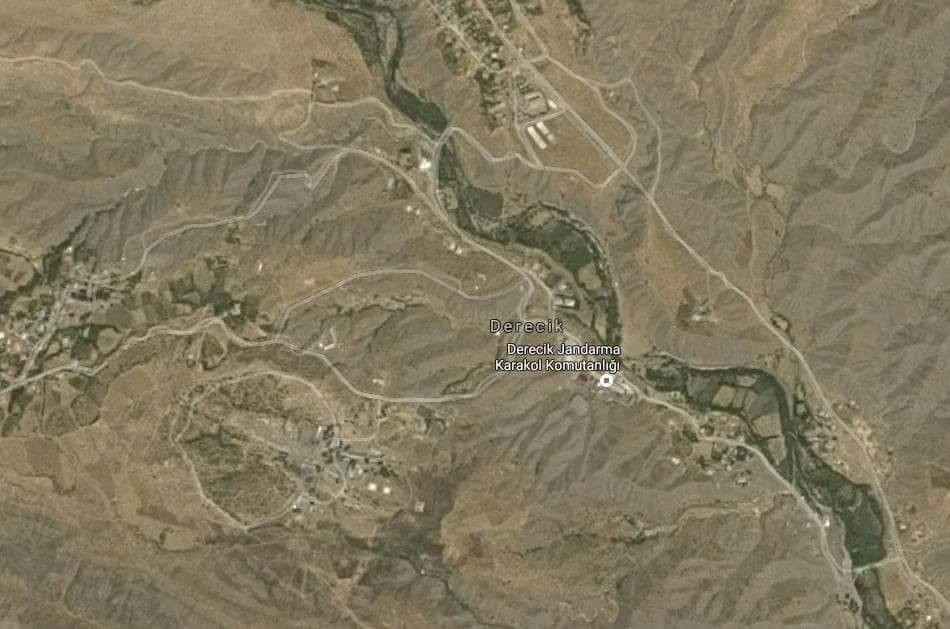
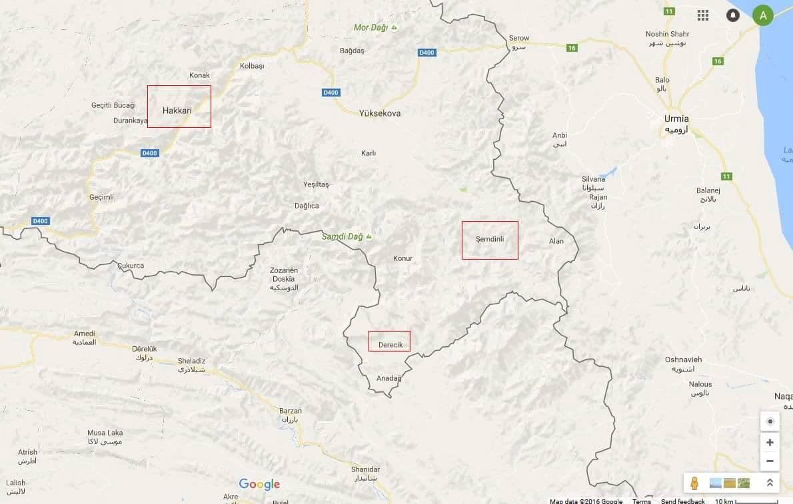
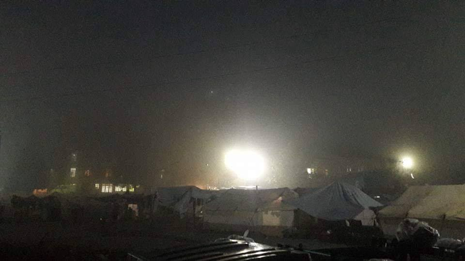
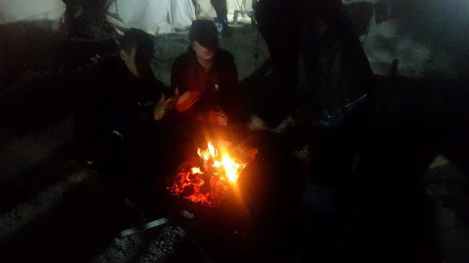
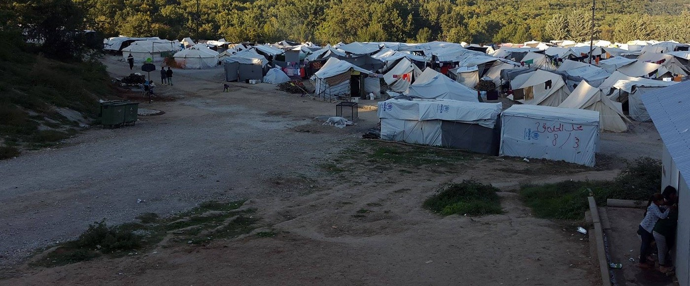
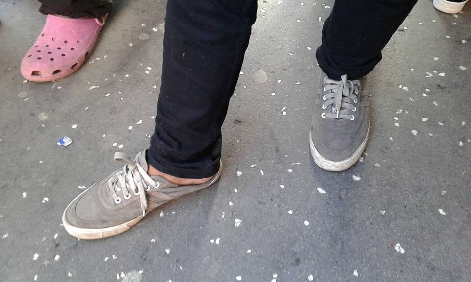
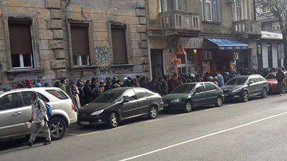
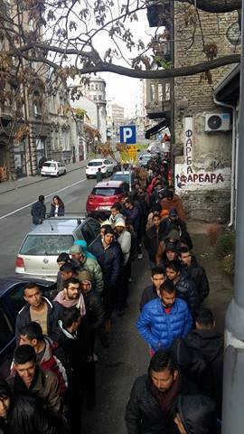

### AYS Daily News Digest 01/11: People freezing and getting ill in camps across Greece as Europe dwells on relocation

_Saudi Arabia announces continuation of attacks — more victims of war and famine in Yemen / People kept in military area without help in Derecik, Turkey / New arrivals and old problems pile up on Greek islands / More problems in overcrowded camps with the winter getting closer / Serbian volunteers can’t cope alone anymore with growing number of refugees in need — help\! / Youngest Jungle residents to be evacuated in the morning / The British social workers and coaches on stand by to collect young refugees from France / Germany sets the bar low for the social care of the youngest refugees_

 **\)**](assets/7eb0b9c99dfb/1*CnzX0j1-yOQuvBw19mtfYA.jpeg)

on a sunny day in a Greek camp\. \. \(Photo: [**Through refugee eyes**](https://www.facebook.com/throughrefugeeeyes/?hc_ref=PAGES_TIMELINE&fref=nf) **\)**
#### YEMEN
### Saudis to keep bombing “no matter what it takes”

Talking at the Annual Arab\-U\.S\. Policymakers Conference, Saudi Arabia’s ambassador to the United States said the Saudi\-led coalition bombing Yemen had “righteousness, legitimacy, a lot of support,” and would keep bombing no matter what it takes, [The Intercept](https://theintercept.com/2016/11/01/saudi-ambassador-to-the-u-s-vows-to-keep-hitting-yemen-no-matter-what/) reports\. Since the beginning of bombing Yemen, in 2015, Saudi Arabia has since been responsible for the [majority](http://www.nytimes.com/2015/09/30/world/middleeast/saudis-faces-mounting-pressure-over-civilian-deaths-in-yemen-conflict.html) of the 10,000 deaths in the conflict, according to the U\.N\. 
The war and restrictions of aid getting through causes most of the people in different regions of Yemen to suffer famine\.

> Bringing more awareness to this terrible inhumane situation is the least we can do\. 

 **\)**](assets/7eb0b9c99dfb/1*HRDPWfK3teztpeKGKCIAOg.jpeg)

One of the only ways to get aid into Taiz is trough the dangerous mountain paths\. If they don’t use donkeys, it’s by hand\. \(Photo: [**Brendan Woodhouse**](https://www.facebook.com/brendan.woodhouse.18) **\)**
#### TURKEY
### People kept in military area in Derecik without help

Together with around 1500 refugees a family stranded in a military area in Derecik, Turkey, located near the triangle where the Turkey, Iran, and Iraqi borders meet\. Mostly women and children, who have appointments in the European embassies to join their families\.

If they cannot pay the fee for “accomodation”, they would be sent out with no support at all, no shelter, no food and no transport to the next bus stop\. They are told that the next bus was 400km away\.

They don’t have access to informations, how they could leave the place or can be registered by any official authorities\.

This camp consist of military barracks\. The people sleep in dormitories, nevertheless they have to pay for rooms, which are estimated at more than 10 US dollars per night, at a overcrowded place with many other refugees in the building\. A large part of them is sleeping outdoors without blankets\. The camp governor prevents Syrian refugees from leaving the barracks\. They have to wait for more than a month to be registered\. Additionally humanitarian missions or any NGOs are not allowed to enter the camp as a military zone\. This inhumane situation requires special and immediate attentions\.

Derecik at the Turkis, Iraqi and Iranian border
#### GREECE
#### Arrivals

Official registration on Greek island counted **153** people arriving, 36 on Lesvos,86 onSamos and 31 on Megisti\.
A sailboat issued a distress signal several hours before the Greek coastal patrol boats could set off to look for it, believing it was carrying an unknown number of refugees\. This distress signal came after a separate incident involving around 45 migrants and refugees who were rescued from the northeastern coast of the island of Antikythera, [Ekathimerini](http://www.ekathimerini.com/213297/article/ekathimerini/news/coast-guard-searching-for-distressed-boat-off-southern-peloponnese) reports\.
### Lesvos protests

> The situation in Lesvos is continuously bad\. Fortress Europe has turned this beautiful island into a big prison and for people seeking safety and hope, only despair is left\. Every day it’s new rejections, new problems, new pretend games about legal processes\.
 

> Everybody wants to leave and create new lives somewhere but there is no way off the Island\. Tonight we are down to 6 degrees and most people don’t even have a jacket\.
 

> Maybe Fortress Europe is hoping that everyone will die this winter and the problem be there no more? — [**United Rescue Aid**](https://www.facebook.com/unitedrescueaid/?fref=nf) 

Overall, the number of refugees trapped in the islands of the northern Aegean amounts to 11\.789\.

 \)](assets/7eb0b9c99dfb/1*oyAdBmgp6tonFZ3QC6Sbzg.jpeg)

Families, women and men stranded at the Greek island of Lesvos march in protest \(Photo: [**No Border Kitchen Lesvos**](https://www.facebook.com/NBKLesvos/) \)

 **\)**](assets/7eb0b9c99dfb/1*0pD3_-70t_cTww0_BeDAyw.jpeg)

Protest of the refugees kept at the refugee camp on Lesvos \(Photo: [**No Border Kitchen Lesvos**](https://www.facebook.com/NBKLesvos/) **\)**
#### New arrivals putting pressure on Samos

The island of Samos has seen a deterioration in conditions at the camp\. The camp is currently hosting 3 times the official capacity of the camp and new residents are still arriving daily\. In the midst of the difficult situation, much needed new and creative activities are still provided at the camp, while the circumstances allow them to organize it\.

](assets/7eb0b9c99dfb/1*zLYVuzR8lVWqcdyr-qcNag.jpeg)

Photo: [**Pru Waldorf**](https://www.facebook.com/pru.waldorf)
### The everlasting relocation process

> “Greece is ready, but Europe is not proceeding as it has been committed to do” — Yiannis Mouzalas 

111 Syrians, who were in Greece for 3 to 11 months, including 16 families \(59 refugees\) and 52 individuals, including 36 unaccompanied minors were relocated from greece to Finland this Monday, Greek [media](http://www.tanea.gr/news/greece/article/5402386/sth-finlandia-apo-thn-ellada-111-syroi-prosfyges/) report\.

The Greek Deputy Minister of Migration Policy, Yiannis Mouzalas, was at the airport to see the Syrians off, saying that each time a group is relocated to another country, people get a new hope in the process, but that the process itself is not being done in a timely manner by the EU member states\. The 5,000 people who have so far been relocated means about six camps less in Greece\. At the same time, it meains better living conditions for the remaining refugees\. He stresses that Europe has assumed the responsibility to relocate 30,000 people, in 2016 alone, and calls them to stop the hypocrisy\.

> “We are now able to record every day nearly 200 people nominated for relocation, about 1,000 people a week\. That means that if we have the necessary response from the other Member States, about 1,000 people would leave every week and begin their lives in another country”, stated the director of the Asylum Service\. 

### Yazidis in Petra getting worried as the winter draws near

Apart from the lengthy procedures and interlocked interests from all sides involved in the relocation process and along with the worrying [MSF report](https://medium.com/@AreYouSyrious/ays-digest-31-10-msf-tells-it-like-it-is-stories-from-greece-and-beyond-4971a69c8a83#.qxjrbc62r) about the health damaging living conditions of the refugees in Greek camps, another inevitable problem has arrived — the cold\.

Night at the Petra Olympus camp \(Photo: Fouad Alfaqer\)

We are told these days by the residents of Cherso that it is getting hard to stand the cold in the worn out tents and the Yazidis who had to leave that and some other camps because of violence mostly ended up at the camp Petra\. 
It is the only refugee camp in Greece exclusively for Yazidis, who have suffered brutal treatment at the hands of the so called IS, only to later go through different kinds of discrimination and abuse in almost all of the Greek camps and detention centre on Leros, which led them to gather in the same place again\.

Conditions at Petra are extremely rough\. The canvas tents that were too hot in the summer are now getting really too cold\. Snakes and scorpions were a constant threat during the summer months and now the cold ground is making it hard to fall asleep and refugees are patiently finding ways to warm up during nights that are getting colder day by day\.

So far this has been the only “heating system” in the camp \(Photo: Fouad Alfaqer\)

There are more than 500 children in Petra\. Fouad, a young Yazidi, resident of the camp who wrote to says the children are reacting very bad to the atmosphere caused by these difficulties\. They fear the overall psychological and health state of the people will deteriorate very soon\. 
We’ve visited and [written about the Yazidis](https://medium.com/@AreYouSyrious/ays-special-we-are-just-alive-but-not-living-dceda508a314#.bc8h3akpk) who were staying at the Mazaraki camp in Cherso, mostly staying away from the other residents, although that did not help and eventually after they were attacked in the camp, [they had to be moved](https://medium.com/@AreYouSyrious/ays-8-7-fear-of-more-violence-in-cherso-and-leros-refugees-beaten-in-hungary-1414ba1431ce#.sx6j4t4po) to a separate camp\.

Recent possibility and invitation from the Portuguese to quickly [relocate 450 Yazidis](http://theportugalnews.com/news/greeks-blocking-resettlement-of-yazidi-in-portugal/38756) from Greece to Portugal was not met with approval in Greece\. Portugal stated they didn’t want this gesture to be seen as giving privilege to anyone, recalling that the resettlement process had so start somewhere\. Although the Yazidi feared the relocation process, as they thought it would disperse the already diminished minority accross the European countries, now they patiently wait for the interview appointments and hope to finally reach a safe, warm, friendly place — together\.

Petra, the camp that is home to Yazidi refugees in the Thessaloniki area \(Photo: Fouad Alfaqer\)
#### UNHCR promises all the sites on mainland and on the islands will receive winter items by the end of this week

By the end of this week, winter items such as leggings, sleeping bags, thermal blankets, rain ponchos, socks, and warm hats/beanies will be delivered from warehouses to all the sites on mainland and on the islands by UNHCR’s NGO partners under the coordination of the Migration Ministry\. Camp Nea Kavala had most of the old torn canvas tents replaced with containers and the they plan to put some more containers in Katsikas and Filipiada camps as well, News that moves [reports](https://newsthatmoves.org/en/unhcr-plans-for-winter-housing/) \.
#### Hosting households programme for Greeks

Praksis [invites](http://www.praksis.gr/assets/Hosting_Households_%CF%80%CF%81%CE%BF%CF%83%CE%BA%CE%BB%CE%B7%CF%83%CE%B7_%CF%80%CF%81%CE%BF%CF%82_LGBTQI_%CE%BA%CE%BF%CE%B9%CE%BD%CF%8C%CF%84%CE%B7%CF%84%CE%B1_01.11.2016.pdf) Greek residents, families or individuals, specifically in the region of Attica, who are willing to provide accommodation for families or LGBTQI refugees, who are awaiting for relocation to another European country\. Find more information [here](http://www.praksis.gr/el/news-top/item/%CF%80%CF%81%CE%BF%CF%83%CE%BA%CE%BB%CE%B7%CF%83%CE%B7-%CE%B5%CE%BA%CE%B4%CE%B7%CE%BB%CF%89%CF%83%CE%B7%CF%83-%CE%B5%CE%BD%CE%B4%CE%B9%CE%B1%CF%86%CE%B5%CF%81%CE%BF%CE%BD%CF%84%CE%BF%CF%83-%CF%80%CF%81%CE%BF%CE%B3%CF%81%CE%B1%CE%BC%CE%BC%CE%B1-hosting-households) \.
### Shoes needed in Belgrade

As the winter draws near, the need for warm clothes and shoes becomes even greater in centres where most of the refugees gather to get food, clothes and information\. Volunteers in Belgrade are sending out a special call for men’s, women’s and children’s shoes\. If you have some shoes you would like to donate, but can’t come yourself, [contact](http://Maja Vrbanovic) the volunteers who will pick it up and give it to the feet in need\!

 **\)**](assets/7eb0b9c99dfb/1*oKeZfzI7C28uPEui6fAeYw.jpeg)

Refugee boys on the streets of Belgrade without warm shoes or socks \(Photo: [**Maja Vrbanovic**](https://www.facebook.com/maja.bulajic.9) **\)**
### No food distribution at Refugee Aid Miksalište

Due to the pressure created from the large amount of refugees coming to the center, Refugee Aid Miksaliste has had to halt its food distribution starting tomorrow, the 2nd of November\. The last few days, Hot Food Idomeni distributed over 1600 meals a day\. Due to the security risks from the presence of so many people, as well as the need to distribute so many meals while respecting all sanitary and communal requirements, RAM has to stop distributing this kind of help from today\. Considering that the number of refugees in Savamala keeps growing, they are appealing to both the government, as well as non\-governmental organizations, to help in finding a solution and securing future food distribution to people in need\.

Images of people waiting for the food distribution \(Photos: Refugee Aid Miksalište\)
#### **FRANCE**
### **Calais**
#### Riots ahead of evacuation

About 20 police riot vans arrived early this evening and teargas was used to stop the protests and fights among the remaining estimated 1,500 refugees, most of whom are teenagers\. The violence came at the end of a day of mounting tension after minors were told that they were to be removed to “juvenile centres” across France on Wednesday morning, starting at 8am\. 
Those with family in the UK, or who have specific vulnerabilities that may make them eligible to claim asylum in the UK, were told that their applications would be processed from the new locations, [The Guardian](https://www.theguardian.com/world/2016/nov/01/calais-camp-hit-riots-refugees-teenagers?CMP=Share_iOSApp_Other) reports\.
#### Minors on the move on Wednesday

[Calais Action](https://www.facebook.com/calaisaction/) reports the French and the British authorities explained to the NGOs the plan of evacuation of the 1,500 unaccompanied and separated children staying in the container camp, who are to be moved to CAOs for minors on Wednesday morning\.
Flyers explaining the operation in different languages were distributed to the children\.

 **\)**](assets/7eb0b9c99dfb/1*NvFZOsOnO9-9kdzi4XRhuA.jpeg)

Flyers distributed to the young refugees in Calais \(Photo: [**Riaz Ahmad**](https://www.facebook.com/riaz.ahmad.58367) **\)**

Children will be given wristbands with the number of the bus they will have to get on\. With the intention to prevent possible tensions among the children, young refugees of the same mother tongue or those who know each other \(who were lodged together\) will go on buses together\. The children will be escorted by two staff members of the Home Office onto the buses, joined by two French firemen and / or FTDA staff and interpreters\. The Home Office will start to process the cases from the CAOs for minors \(CAOMI\) this Thursday and the transfers to the UK will resume this week\. The children moved to a CAOMI during the operation last week will also be visited and interviewed by the HO\.

> As today was our last day with them, we decided to do an art project\. This involved drawing around each other and creating silhouettes, as part of [Gladys Chav Harvey](https://www.facebook.com/profile.php?id=100008115557490) ’s art project The Paper People\- Hung Out To Dry\.
 

> The project was first created back in March, with the help of the refugees living in the camp\. The paper cut outs that were hung out to dry represented the 291 unaccompanied children that were made homeless when the South side of the Jungle was demolished\. From those 291 children, 129 went missing\.
 

> This was a very poignant last workshop with the children, as this reminds us of how ‘throw\-away’ their lives are seen by so many people\.
 

> We wish them all the luck in the world and hope that justice will prevail and we will see them in the UK soon\. — [Care4Calais](https://www.facebook.com/care4calais/) 

 **\)**](assets/7eb0b9c99dfb/1*6o54pSEOffUugGynvgTArw.jpeg)

Drawings and paper art by the last young Calais residents as a part of the C4C art project \(Photo: [**Care4Calais**](https://www.facebook.com/care4calais/) **\)**

The women \(378 including 167 unaccompanied asylum\-seeking children — UASC\) in the Jules Ferry Centre will be moved either to CAO for families or CAOMI for girls before the end of the week\.

The Calais Action team forwards the latest figures for the family reunification:

1335 UASC were interviewed by FTDA / Home Office including Dubs pre\-screening interviews by FTDA in the past 10 days\.

312 UASC including 60 Dubs cases were transferred to the UK until now\.

UNHCR has requested a particular care for young UASC \(under 14\) \. They also contacted a representative of the French Ministry of the Interior in order to organise the support to the operation\. For the time being, the Sous\-Préfet asks UNHCR to provide information to the UASC during the operation\.

](assets/7eb0b9c99dfb/1*Hqm7kiL5AcQD6cx5ufWcuA.jpeg)

Photo: [Miguel Amortegui Photography](https://www.facebook.com/Miguelamorteguiphotography/)
#### UK
### A concrete initiative to collect the children refugees from France to the UK

Queens Park Rangers football club has [offered to help](https://www.theguardian.com/world/2016/nov/01/qpr-gives-fleet-of-coaches-to-bring-child-refugees-from-calais) bring refugee children stranded in [France](https://www.theguardian.com/world/france) to the UK\. Before any child can come to the UK they must be assessed to ensure they are eligible for sanctuary on the other side of the Channel\.
Lord Alf Dubs announced the plan to bring child refugees to the UK in a letter to the home secretary and the French ambassador, clearly stating:

> “ I formally request that the French government allows us to send in coaches and social workers to collect those refugee children that have a right to be here in the UK\. We will need assistance with travel documents out of France\. We have people arranging the coordination of this\.” 

Reportedly, they have social workers and a fleet of coaches on standby ready to go to France as soon as the French authorities give them permission to go in and collect the children\.
#### GERMANY
### Germans lowering the social care standards for the youngest refugees

At a conference of Germany’s 16 state premiers in Rostock, northern Germany, the state governments asked Berlin to reclassify youth social work with young refugees, reducing the number of social workers assigned to help young refugees from one in four or five \(the current standard\) to one in 10 — or even more\. 
The proposed change has met intense criticism among social work associations, which have described it as discriminatory, [Deutsche Welle](http://m.dw.com/en/german-states-seek-to-cut-corners-with-young-refugees/a-36215133) reports\.

About 50,000 minors arrived to Germany as unaccompanied refugees in 2015, and they have since been distributed across the country\. Most of them were 16 or 17 years old, and many are considered particularly traumatized\. Because of administrative bottlenecks, only 53 percent had been able to apply for asylum through this August\. Underage refugees are also dependent on their social workers to help them apply for asylum and some of them have been through tough circumstances and need special care\.
#### AUSTRALIA
### UN human rights investigator visits Australia’s detention centres

Meetings with border protection officials and migrants are on the schedule of Francois Crepeau’s [visit to Australia](http://mobile.abc.net.au/news/2016-11-01/un-investigator-to-examine-australia's-immigration-nauru/7980952?pfmredir=sm) \. This visit comes after a series of alarming reports about the conditions and treatment of refugees at the immigration detention and processing centres in Australia and on Nauru\. The UN’s special rapporteur on the human rights of migrants plans to investigate how Australia manages its overall migration policies, and their impact on the human rights of migrants\.

_Converted [Medium Post](https://areyousyrious.medium.com/ays-daily-news-digest-01-11-people-freezing-and-getting-ill-in-camps-across-greece-as-europe-7eb0b9c99dfb) by [ZMediumToMarkdown](https://github.com/ZhgChgLi/ZMediumToMarkdown)._
