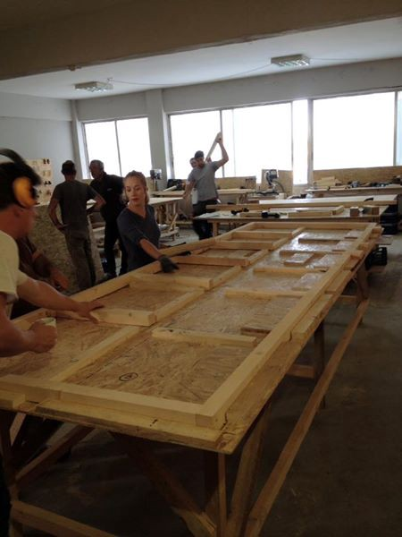
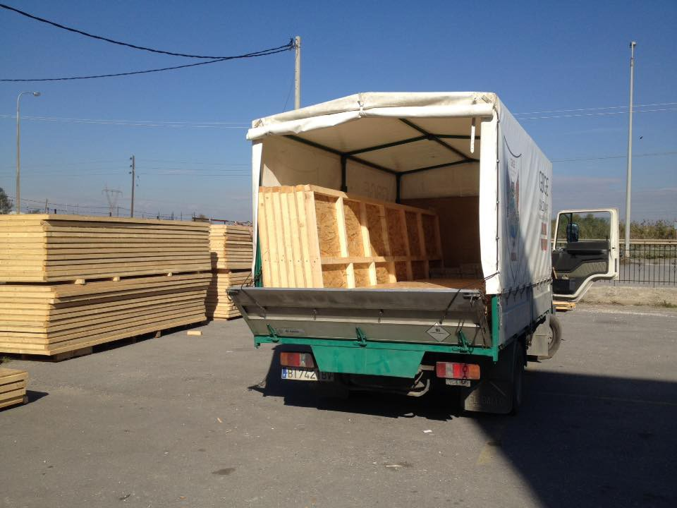
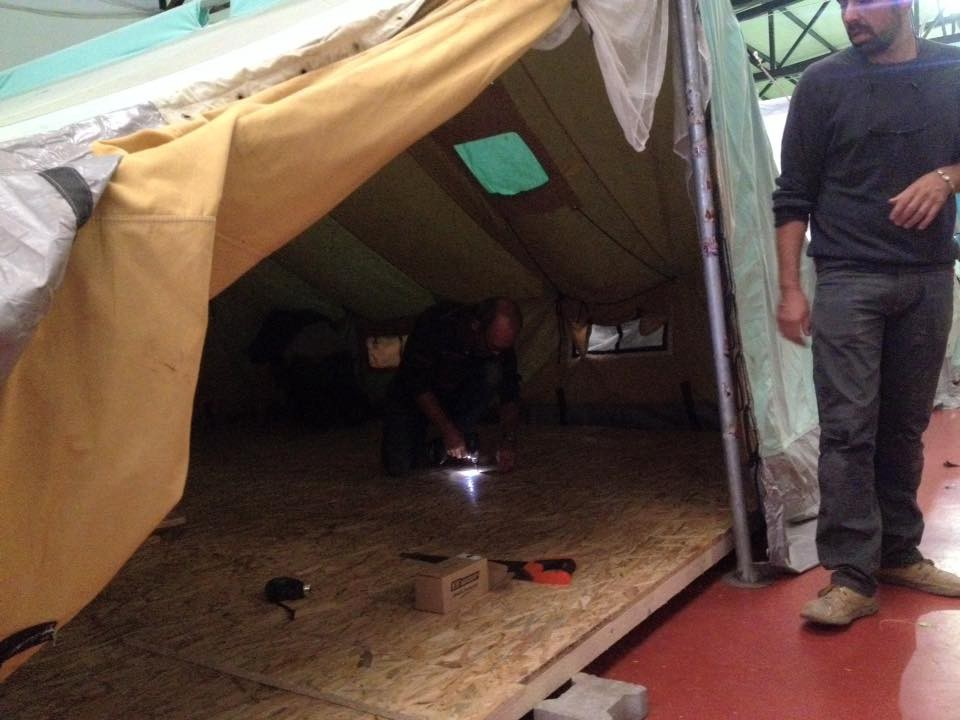

### AYS DIGEST 06/11: Germany intends to adopt Australia\-like system for migrants
### Volunteers prepare for the winter in the camps/ Bad weather alert for the Aegean sea/ Shooting at the Serbian\-Hungarian border/ Urgent calls for volunteers and donations in Greece and elsewhere

](assets/699098a65c7d/1*G2WSDU94hjRG3dGEYROb1Q.jpeg)

“I am still waiting here” by [**Through refugee eyes**](https://www.facebook.com/throughrefugeeeyes/)
#### Germany
### Germany´s government says migrants intercepted on Europe´s shores should be sent back to Africa\.

A spokeswoman for German Interior Minister Thomas de Maiziere said on Sunday to the newspaper “Welt am Sonntag”, the minister believes the European Union should adopt an Australian\-like system under which migrants intercepted at sea are sent for processing at camps in third countries\. The proposal would mean that migrants picked up in the Mediterranean Sea, to be sent to Tunisia, Egypt or other north African states to apply for asylum from there which would mean and huge change on German´s migration policy\.

> “The elimination of the prospect of reaching the European coast could convince migrants to avoid embarking on the life\-threatening and costly journey in the first place,” 

Angela Merkel´s ruling party has been under pressure by far\-right opposition parties to change its asylum policies and is loosing votes to some of these Xenophobic and populist movements\.

Other opposition parties have quickly condemned this idea, Bernd Riexinger, head of the leftist opposition Die Linke party said the minister is treating refugees as a contagious disease\. According to him, a fair process could only be done on German soil where applicants have access to legal help an commented on the government intentions as:

> “a humanitarian scandal and a further step toward elimination of the right to asylum,” 

#### Greece
### Volunteers prepare for winter

A Group of volunteers, the [**The Get Shit Done Team**](https://www.facebook.com/The-Get-Shit-Done-Team-304001796641127/?hc_ref=PAGES_TIMELINE&fref=nf) **,** have been busy at Kalochori camp, near Thessaloniki building wooden tent floors which will serve as insulation for the cold months ahead giving a bit more of comfort to the people stranded in very bad conditions in the refugee camps in Greece\. They will keep building more of these structures for other camps so any bit of help is welcome to support this big project\.

Building the structures

Transport

Destination

If you’d like to volunteer you can send them a message or if you want to support their work you can also [donate](http://www.cardeacenterforwomen.org/Donate.html) :
PayPal: thegetshitdoneteam@gmail\.com

Or bank account:
Jennifer A James
Account: 
01 0249
0101288 00
Swift: ANZBNZ22
ANZ Ponsonby 
308–312 Ponsonby Road, Ponsonby, Auckland, 1144, New Zealand

USA can donate via the Cardea Center for Women so you can go to their donate page, scroll down and you’ll see Get Shit Done
#### Arrivals

There have been 47 new arrival in Greece today, 16 on Chios, 1 on Leros and 25 on Kos\.
#### Weather

There has been issued a warning for tonight for the islands on the Aegean see that ranges from Orange on Chios, Samos and Kos with waves of up to 1 meter and Red for Leros with waves up to 1,5 meters\.

A Severe Red warning was issued for Lampedusa \(Italy\)in the Mediterranean with waves that could be bigger than 2 meters\.
#### Call for volunteers

Groups of volunteers need more volunteers in Greece:

[A drop in the ocean](https://www.facebook.com/drapenihavet/?fref=ts) has made an urgent call for more volunteers in the north of Greece, you can contact them clicking on the link or via email on siv@drapenihavet\.no\. They are looking for volunteers who can commit for 10 days or more and are over 25 years old\.

There is also urgent need for medical staff on Chios, details on [Greecevol](http://greecevol.info/task.list.php?ID=363) \.

Another call was made for dentists in the north of Greece by Health point foundation, follow the [link](http://healthpointfoundation.org/) for more info\.
#### Serbia

Once more Miksaliste centre has seen a great number of refugees coming for their basic needs, serving 9 men, 15 women and 202 children\.
### Shooting at the border with Hungary

Last night a shooting took place at Horgos border pass, near Kelebija refugee camp\. Both volunteers and refugees report hearing several gunshots with refugees claiming they were probably fired by both police and smugglers\. According to the volunteers on the ground, police for the Hungarian side readily went across the border to push back and beat refugees in the area which is clearly illegal and shows how the authorities from both countries seem to let this happen not only in order to prevent people from crossing the border but also to chase refugees away from their countries using violence\.

We got reports today of a case of 2 Pakistani men that had to be hospitalized at Subotica after showing up at kelebija camp with dog bites saying the Hungarian police let the dogs on them when they were in the forest\.
#### France
### Not everyone made it to the centres

Some people that missed the evacuation of Stalingrad were left with no options by the authorities and once again are the volunteers who take care of these vulnerable refugees\. We have the story of one of them\.

> “I would happily sleep on the streets for twenty nights if they would just tell me if I can go to UK or not\. I don’t know why my luck is so bad\. If you have bad luck, you did something wrong\. What did I do?” 

Most people who have fled war in their country and ended up in Paris have no way of receiving regular, reliable information about government developments surrounding the refugee crisis\. N waited 21 days in Paris for the evacuation\. His brother told him to go to Calais\. He went, was arrested and spent eleven days in front of three judges, the last of whom released him on November 4th in Lille\. He arrived back in Paris around 12:00; an hour after the CRS had spent eight hours loading over three thousand refugees onto busses\. He is now told, he is too late and that there is no place for him\. He told us that in Pashto the direct translation of the colloquial phrase used when you find somebodies behaviour inappropriate or offensive is, “I was not free with you\.”

Thanks to, donations and help of local support groups PRGS have been able to house N for two nights and will be helping him move forward, legally, to achieve his “life long dream” of living in England with his brother\.
#### Call for donations

Calais action is asking for donations to help them raise money to buy a van/trailer to be able to reach areas where refugees are living and some times hiding in order to try to reach their destinations\. Please consider donating using the [link](https://mydonate.bt.com/events/mobilefood) \.

_Converted [Medium Post](https://areyousyrious.medium.com/ays-digest-06-11-germany-intends-to-adopt-australia-like-system-for-migrants-699098a65c7d) by [ZMediumToMarkdown](https://github.com/ZhgChgLi/ZMediumToMarkdown)._
