### AYS Daily News 08/11: “I could kill you here and **no** one would care”

> Hungarian state putting border control before human life\. Only a handful of volunteers to help refugees in Hungary and Serbia, often in\-hiding due to terrorism laws against them\. Food shortages in the camps force many refugees to go hungry or, if they have it, spend all their money on food\. Kelebija is a camp that even lacks enough toilets, making the smell of feces from the nearby forest to spread across the whole area\. 

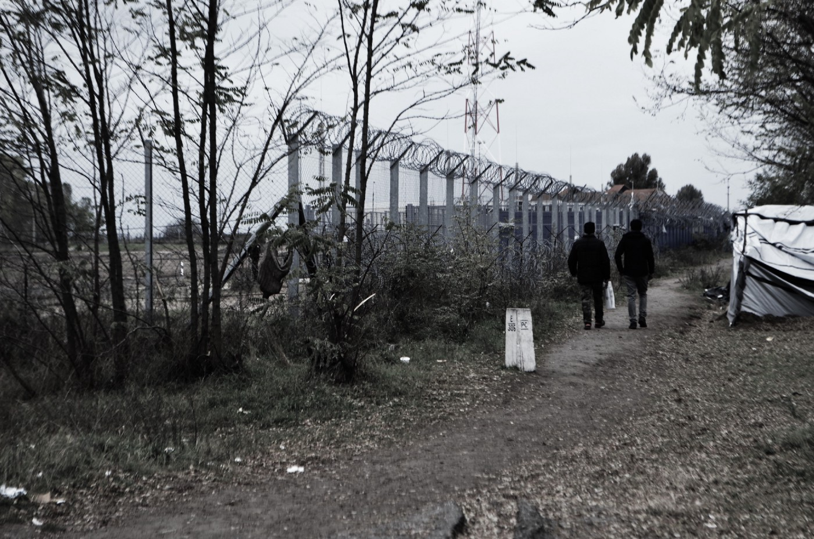

Credits: Sara Benceković \(AYS\)
#### Serbia
### The hunting of refugees in Serbia

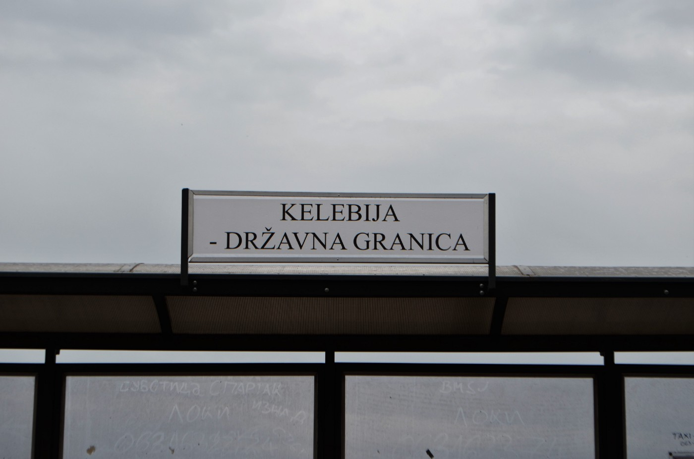

Credits: Sara Benceković \(AYS\)

Are You Syrious? team visited Kelebija transit zone camp at the Serbian\-Hungarian border this past weekend\. The night of our arrival, two Pakistani refugees entered the Kelebija independent volunteers\-ran community centre, severely wounded with bites coming from Hungarian police dogs that attacked them in the nearby forest\. The morning after, we were sent a video by a refugee that showed a cross\-fire between police and smugglers in the same forest\. Three gunshots were fired between them\.

](assets/562af6f68b9b/0*AWa4PCYBVnt4iysC.)

Route of the “refugee hunters”\. Credits: [**Péli Zsolt**](https://www.facebook.com/peli.zsolt.1)

Kelebija is, all in all, a very dangerous place for refugees\. The living conditions there are made unbearable with a goal of cleansing Serbia of refugees\. As it seems, the attempt is successful, as Kelebija transit zone camp is by all our estimates unfit even for rats\. According to some estimations, there are around 100 refugees in Kelebija camp, but more are wandering around and hiding in the forest\. Nearby border camp Horgos is estimated to around 60 refugees, and official Subotica camp currently has 100–150 refugees\.

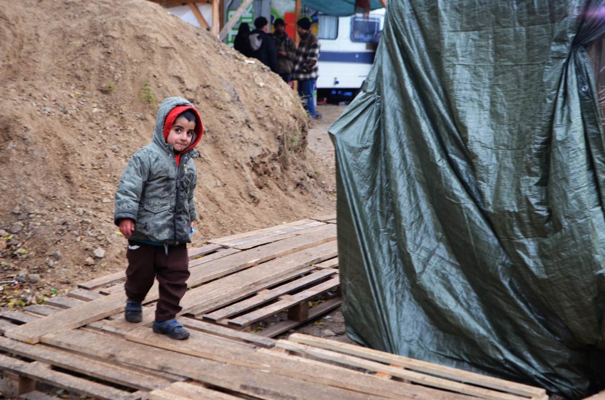

Credits: Sara Bencekovic \(AYS\)
#### Hunger

There are two groups of refugees in Kelebija: “Legal refugees”, largely from Syria and Iraq, which have access to the official camp, and “illegal refugees”, largely from Afghanistan, Iran and Pakistan, that are hiding in forests or squatting in abandoned buildings in the nearby city of Subotica\. Individuals from Afghanistan, Iran, and Pakistan who are considered “legal refugees” are directed to a similar transit zone camp at Horgoš, but a community center similar to that of the Kelebija community center cannot be built to serve that population\.

Those who are accepted into the camp have some although very poor meal ensured\. Namely, they receive one package of instant noodles in the morning, which is supposed to cover their daily nutrition needs\. Those who are forced to live outside the camp, which makes for the majority of refugees, have zero meals ensured by the officials\. Hunger prevails\.

Fresh Response is one organization organized by independent volunteers which provides Kelebija refugees with fresh vegetables three times a week, thus allowing them to cook some meals for themselves\. This is a really beautiful and effective initiative, which we fear will need to stop following the Serbian state decision to forbid meal distribution to refugees due to, allegedly, hygiene reasons\. That being said, we deem this allegation ridiculous, seeing the extremely unsanitary conditions in which refugees in thi area are forced to live\.

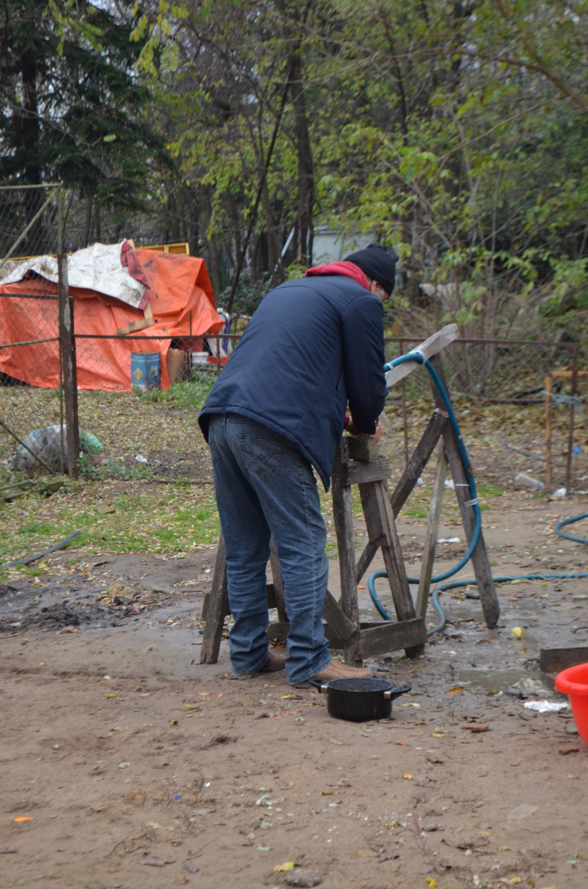

Hand\-washing station\. Credits: Sara Bencekovic \(AYS\)
#### Hygiene

Kelebija camp doesn’t have enough toilets\. Refugees are forced to defecate in the nearby forests, which makes the smell of feces spread all around the area\. Not even the Kelebija community centre was able to organize toilets for refugees, which is extremely problematic seeing that this centre is built on a plot in between houses; this means that refugees defecate in front of local people’s fences and homes, causing an extreme mental and health disturbance for the locals living in the area\. Refugees have told us that neighbours sometimes throw stones at them while they defecate, in order to keep them away from their fences\. For example, one of the neighbours, after building the higher fence towards the Kelebija transit zone camp, put up the sign bellow on the fence:

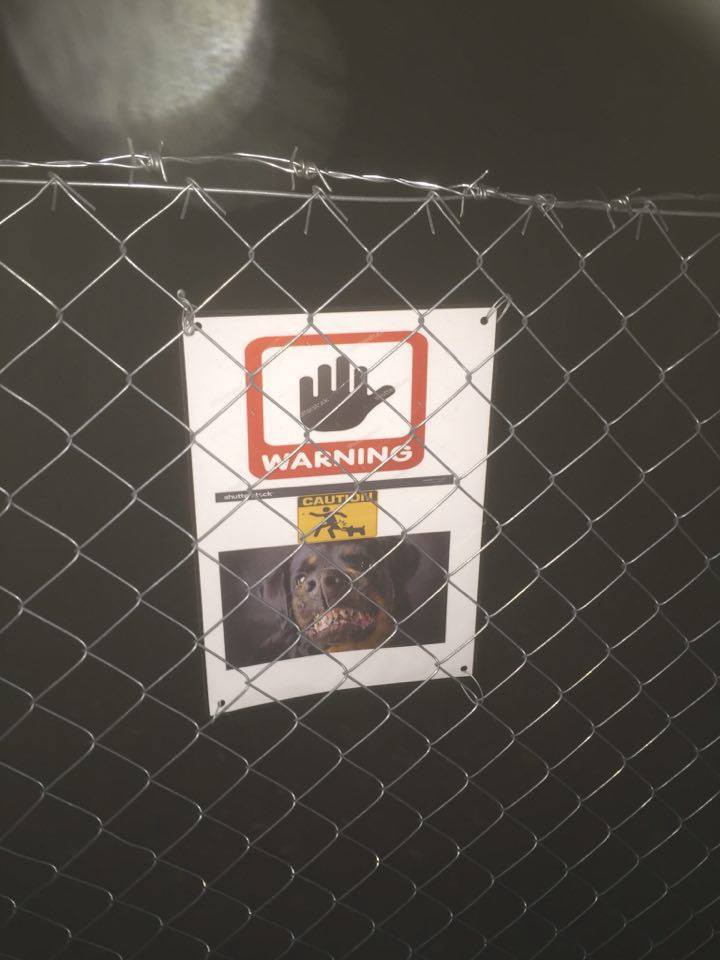

Credits: Northstar

Likewise, Kelebija doesn’t have showers for refugees, except from a single, barely usable shower in the Kelebija community centre\. This shower forces a refugee to shower in cold water on temperatures that sometimes reach close to zero at this time of the year, while also standing on the bare ground, in the mud \(Please see the shower cabin of the Kebelija community centre bellow\) \. At the same time, Kelebija camp has zero showers of any kind\.

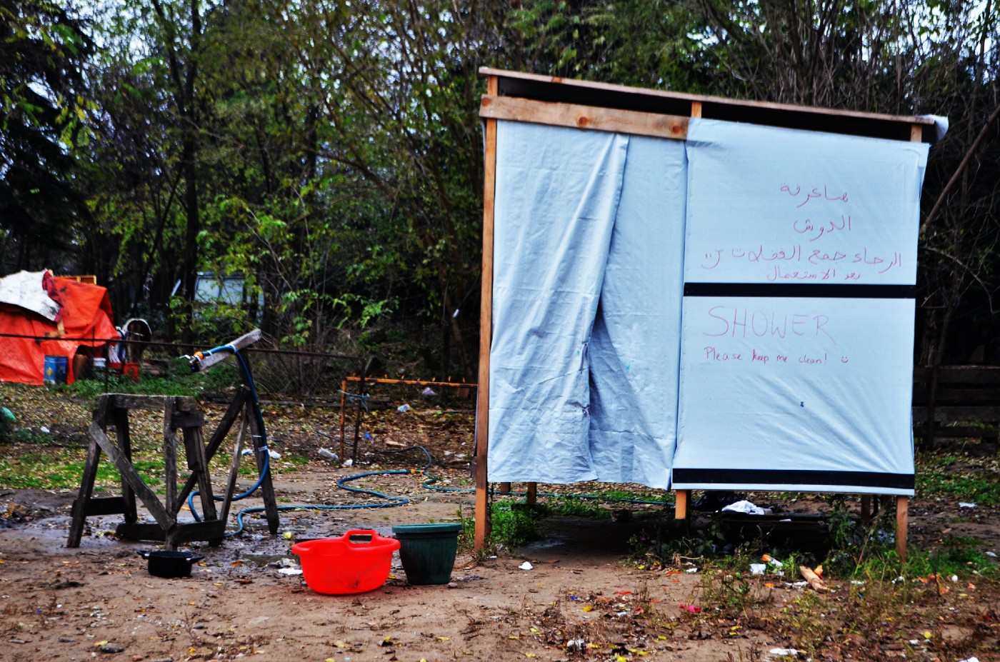

Credits: Sara Benceković \(AYS\)

Refugees’ clothes are predominantly very dirty and their shoes are inadequate, largely sandals; however, it seemed as if though we were more concerned about this problem than refugees themselves\. The first day of our work, we were shocked by the amount of refugees wearing open shoes while out in the cold; thereafter, we went out and bought 5 pairs of new shoes for those in the greatest need and the day after, all of these people were again wearing their old shoes\. Turns out that refugees sold their new shoes\. Although we were disappointed at first, we soon realized that we made a mistake in our response to needs of refugees — more than shoes, refugees needed money to buy food\. This was, indeed, a good lesson for us to pay closer attention to what refugees say their greatest need is at any one time, as well as to accept that selling donated shoes is sometimes of greater aid to refugees than merely accepting and wearing them\. By our current estimation, no donations in clothes are necessary, though this may change very easily\.

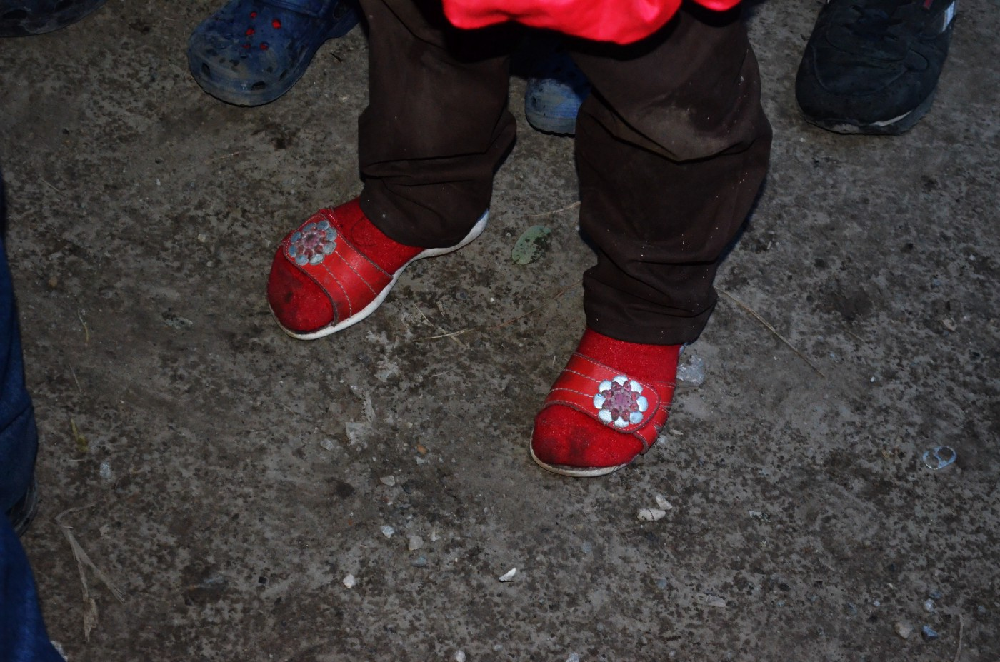

Credits: Sara Bencekovic \(AYS\)

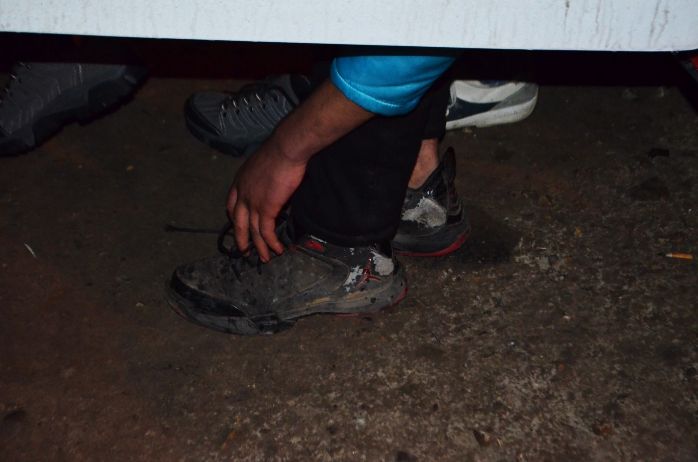

Credits: Sara Bencekovic \(AYS\)

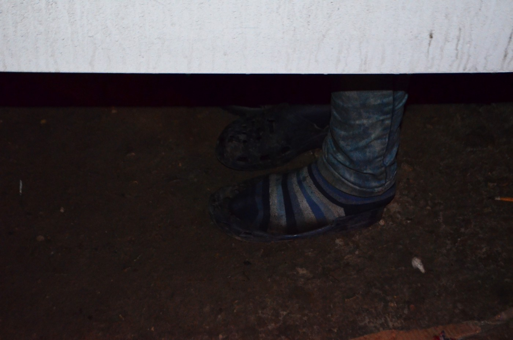

Credits: Sara Bencekovic \(AYS\)
#### Services

There are no services provided for refugees in Kelebija camp, however, the Kelebija community centre provides some services, such as free WiFi hotspot provided by Mercy Corps and managed by Northstar and cell phone charging stations\. There is also a kitchen provided by Northstar and built through cooperation between volunteers and refugees themselves, which provides warm tea and coffee for refugees, which is of tremendous help for the cold evenings\. The Kelebija community centre remains open until 10 p\.m\., after which refugees retreat to Subotica or the official camp\.

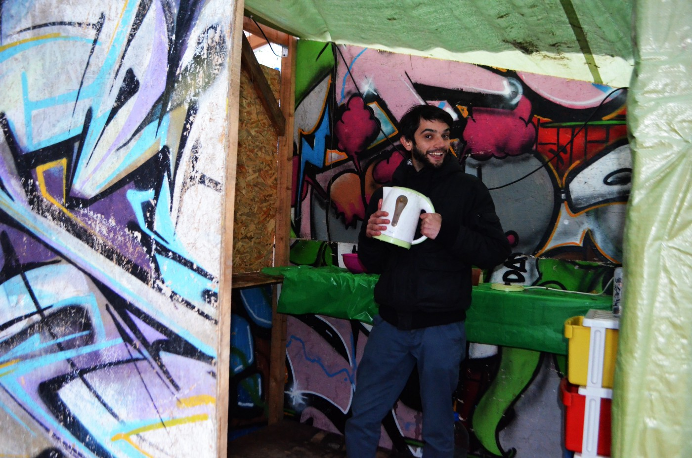

Kitchen\. Credits: Sara Bencekovic \(AYS\)

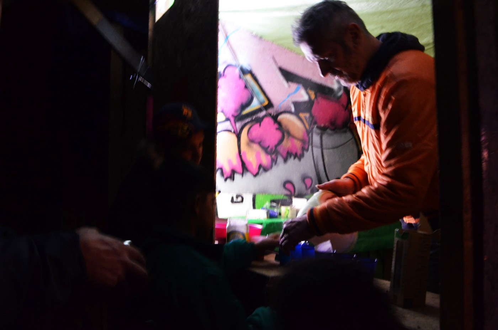

Credits: Sara Bencekovic \(AYS\)

Volunteers continuously try makes refugee lives a bit happier through a variety of activities, though none of these are well organized and systematic\. We were told that there are English lessons for refugees in the centre, but none happened during our time there, which indicates that these are non\-fixed and depend on the availability of volunteers\.

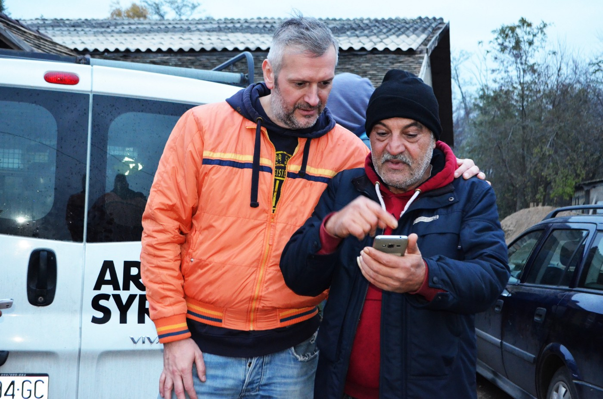

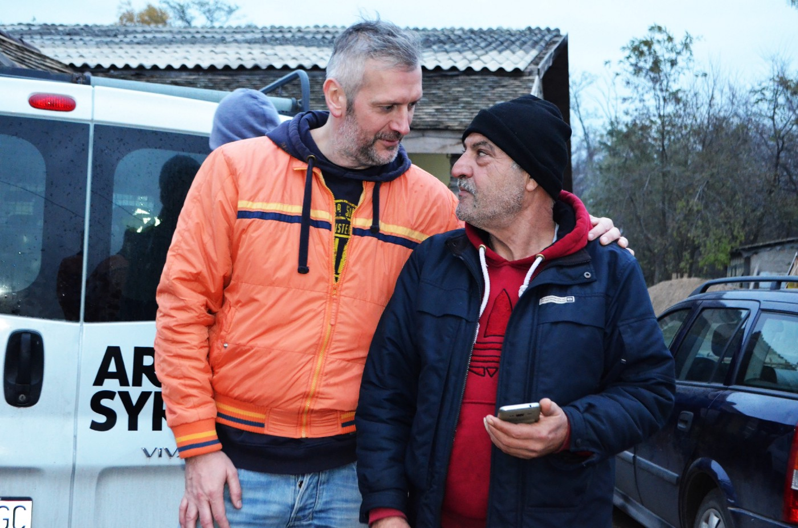

Credits: Sara Bencekovic \(AYS\)

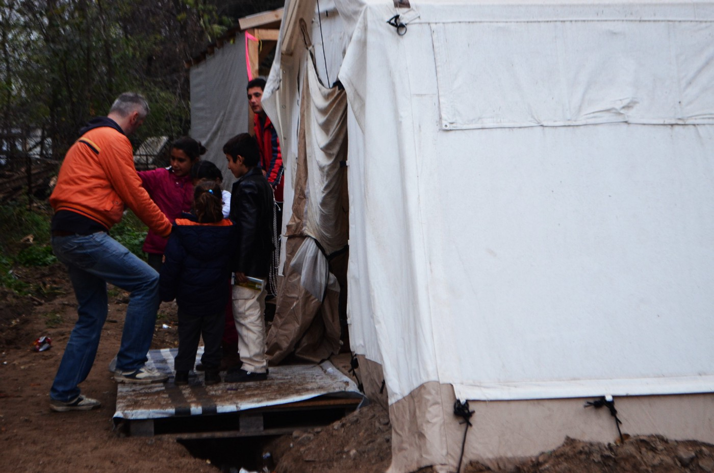

Candies\! Credits: Sara Bencekovic \(AYS\)

During our time there, we organized a small drawing workshop with materials provided by the Northstar, which brought some joy and colour into the transit centre\.

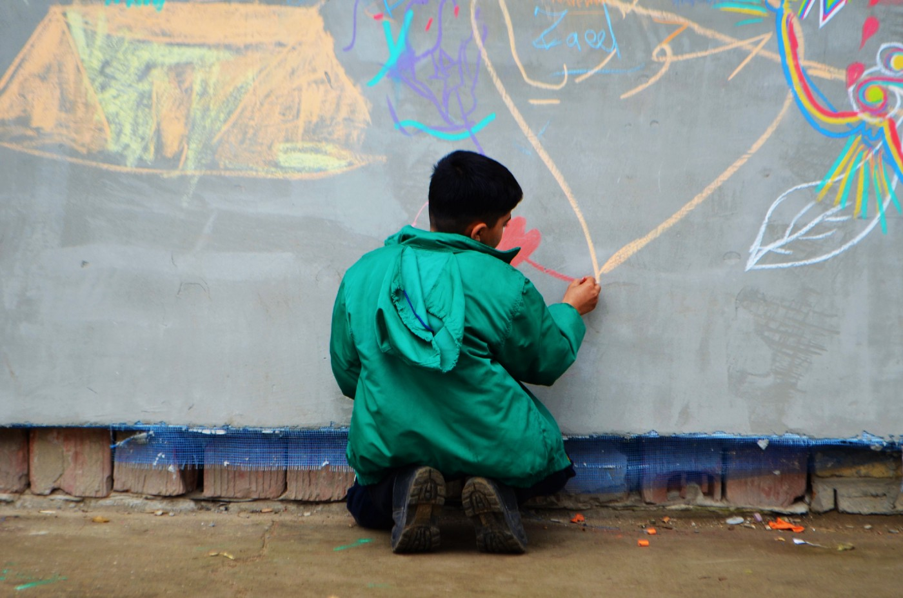

Credits: Sara Bencekovic \(AYS\)

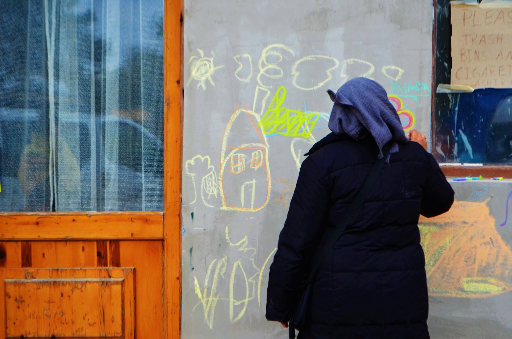

Credits: Sara Bencekovic \(AYS\)

Credits: Sara Bencekovic \(AYS\)
#### Here are few messages refugees have for you\.

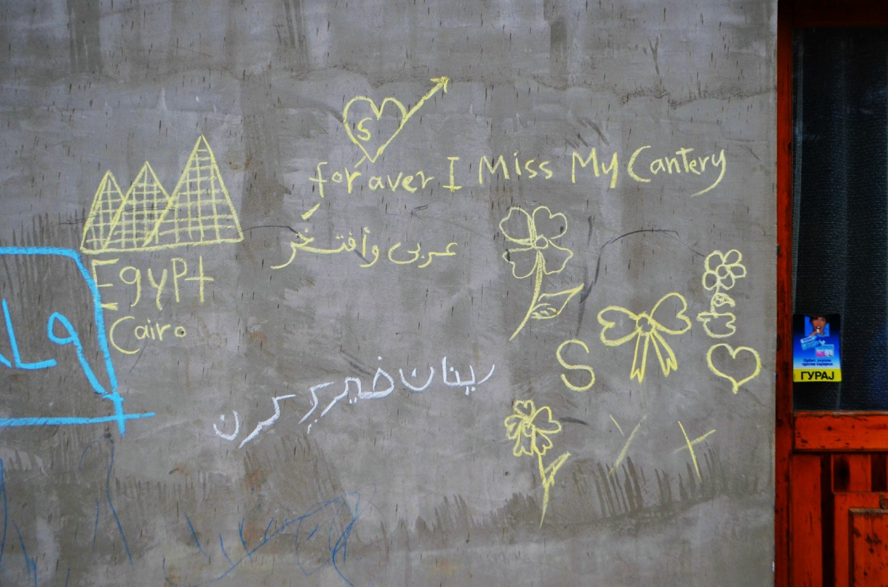

Credits: Sara Bencekovic \(AYS\)

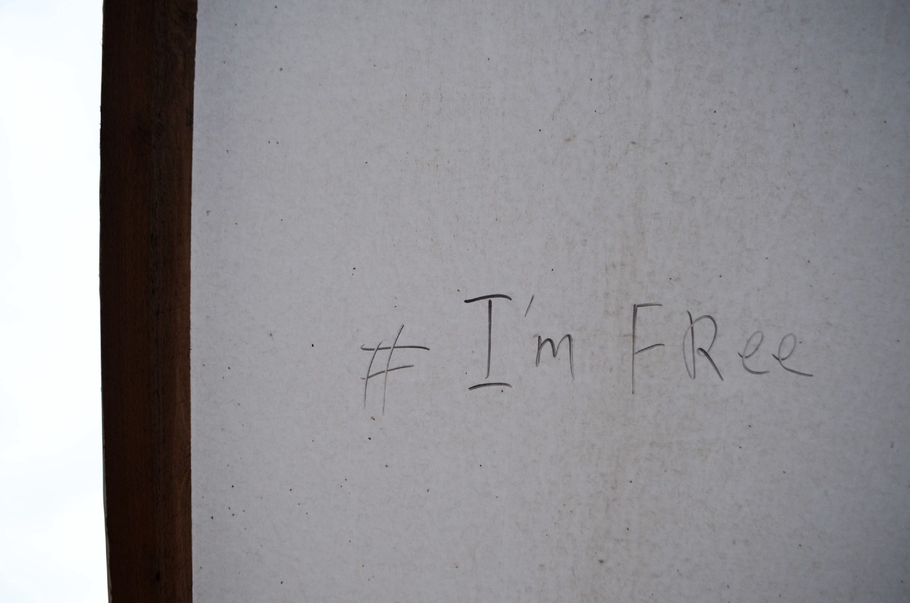

Credits: Sara Bencekovic \(AYS\)
### Numbers
- Number stable at 6200
- Over 4,790 \(or 77%\) of refugees are accommodated in 11 governmental facilities
- Over 1,000 sleeping rough at night in Belgrade City centre \(including several hundred unaccompanied minors/separated children\)
- On 03 and 04 November, Hungarian authorities admitted to territory and asylum procedures at the “transit zones” near Kelebija and Horgos border crossings only 20 asylum seekers per day \(compared to 30/per day
previously\), while there were no admissions over the weekend \(05–06 November\) \. These news rules may continue\.
- Miksalište numbers today: 11 men, 28 women, 267 children; Total 306

#### Syria
### Another massacre today

](assets/562af6f68b9b/0*ALQQLrQnrZivLyWO.)

Credits: [**Syrian Civil Defence Idlib WhiteHelmets**](https://www.facebook.com/Syrian-Civil-Defence-Idlib-WhiteHelmets-1489609321340242/)

10 martyrs, mostly children, in targeted Barbo village in the southern countryside of Idlib\.

](assets/562af6f68b9b/0*PRq4VY_0fl5GRZ_6.)

Credits: [**Syrian Organization for the Defense of Human Rights**](https://www.facebook.com/Syrian.Organization4Human.Rights.Defence/)

[https://www\.youtube\.com/shared?ci=0xOu1plv8Fk](https://www.youtube.com/shared?ci=0xOu1plv8Fk)

](assets/562af6f68b9b/0*wJDKZXzBFsbQf0y8.)

Scenes from Syria\. Credits: [**Children of SYRIA**](https://www.facebook.com/marcheforsyria/)
### Regime forces progress

Assad forces take control on the full 1070 project in west south of Aleppo\.

](assets/562af6f68b9b/0*fNXbZOyM-B6XApMG.)

Credits: [**Free Syria — Salam**](https://www.facebook.com/Free.SyriaSalam/)
### Russia to launch new assault on Aleppo

[Russia](http://www.independent.co.uk/topic/Russia) is preparing to resume air strikes around the Syrian city of Aleppo “in coming hours”, the Interfax news agency cited a source in the Russian Defence Ministry as saying\.

It comes after the Kremlin said on Monday Russia’s air force would maintain a suspension on strikes in Aleppo, unless militants launched an offensive\.

A Russian frigate capable of firing cruise missiles at targets up to 370 miles \(600km\) [docked in the Syrian port of Latakia](http://www.independent.co.uk/news/world/middle-east/aleppo-war-latest-russia-syria-final-assault-timed-us-election-a7404596.html) on Tuesday morning, ahead of what intelligence sources and rebels say is a new attack on Aleppo timed for when the world’s attention is focused on the [US election](http://www.independent.co.uk/news/world/americas/us-elections) \.

The NGO Reporters Without Borders awarded Hadi al\-Abdallah the title of Journalist of the year 2016, for his freelance media activism in Syria\. 
Al\-Abdallah has narrowly escaped death several times, and is targeted by both Assad’s regime and extremist groups, but still decided to remain inside Syria’s most dangerous zones\.

We thank Reporters Without Borders and warmly congratulate هادي العبدالله Hadi Abdullah\.

[https://youtu\.be/FeZOEw\-O\-bU](https://l.facebook.com/l.php?u=https%3A%2F%2Fyoutu.be%2FFeZOEw-O-bU&h=9AQFOtplj)
#### Iraq

In Iraq, WAHA is setting up containers in two camps near Hasansham in the South of Mossul\. They will soon be able to provide reproductive health in two semi\-fixed clinics which will be open six days a week Many internally displaced people arrived recently in this village\.

Credits: WAHA

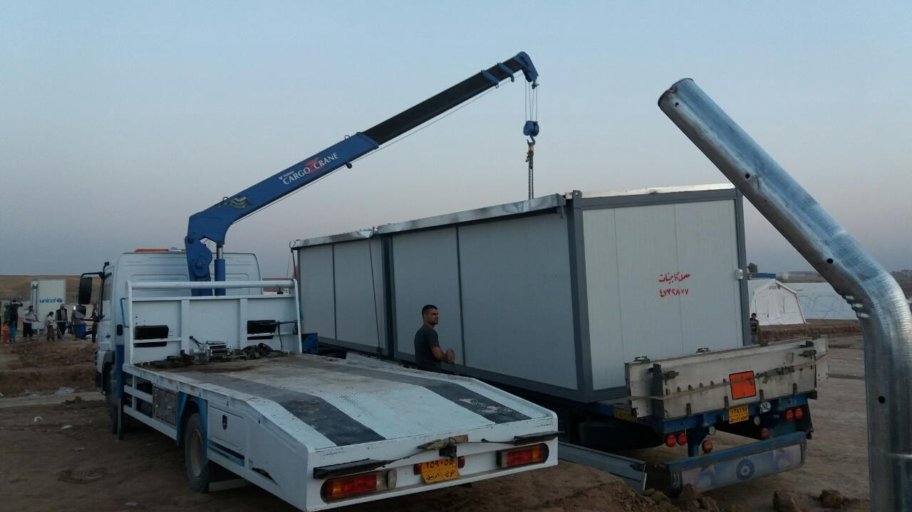

Credits: WAHA
#### Greece
### Numbers
- Since 4/11, it’s officially more than 16\.000 refugees on the islands

](assets/562af6f68b9b/0*cPdF6i97OWK2xkdC.jpg)

Credits: [**Through refugee eyes**](https://www.facebook.com/throughrefugeeeyes/)
### Registration numbers
- Lesvos: 1
- Chios 3
- Samos 62
- Leros 44
- Kastellorizo \(Megisti\) 20

Total: 130
### Work after registration

](assets/562af6f68b9b/0*lRuzINFjS89ykD8W.jpg)

Credits: [**Through refugee eyes**](https://www.facebook.com/throughrefugeeeyes/)

A refugee can work legally in Greece once they have full registration card\. The registration card is the one a refugee receives after they have been fingerprinted\. To work in Greece, refugees do not need a “work permit\.” The registration card is effectively their work permit\. However, refugees must first go through several steps, which are required of anyone who wants to work in Greece, including Greek citizens\.
### Chios news following the meeting of the island’s officials

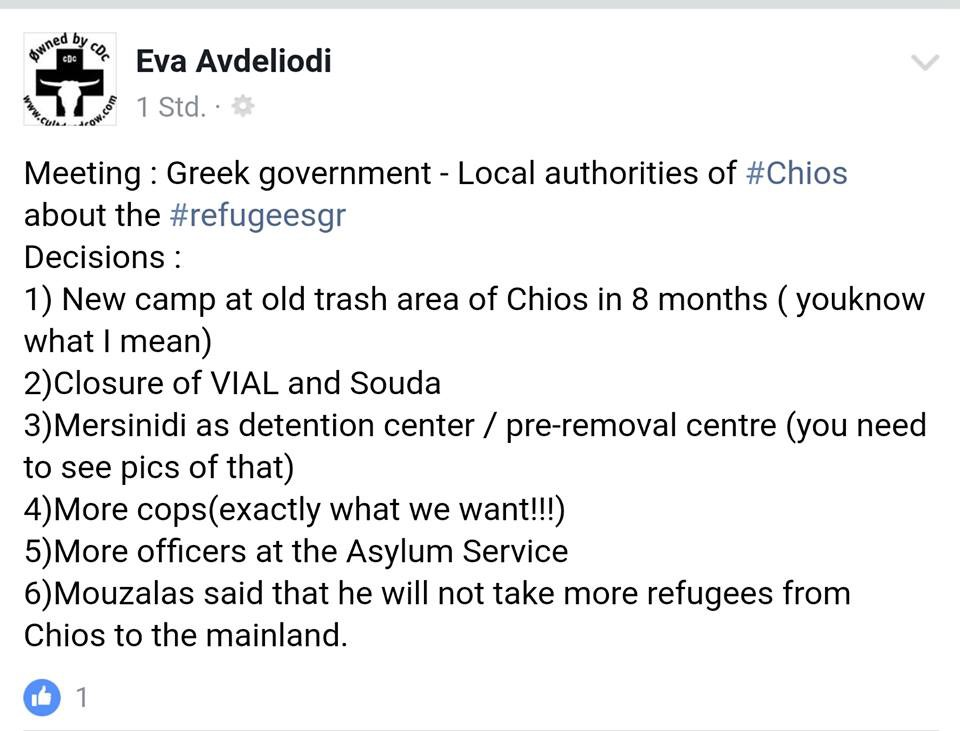

Credits: Eva Avdeliodi
### Fight between refugees and police at Chios

There was trouble today in the refugee camp on chios\. \. a fight broke out between refugees and the police\. All volunteers had to leave the place\. One women had to get assistance for possible kidney problems but without any volunteers inside the camp, refugees had to get in touch with friend volunteers to get this women medical attention\.

](assets/562af6f68b9b/0*DtC3tzN54EimwQ1p.jpg)

Credits: [**Through refugee eyes**](https://www.facebook.com/throughrefugeeeyes/)

](assets/562af6f68b9b/0*CpevZ0HEzaArkhEa.jpg)

Credits: [**Through refugee eyes**](https://www.facebook.com/throughrefugeeeyes/)
### False rumour\!

> “Refugee children who go to school in Greece must stay in Greece with their families until they get a certificate from their schools\. They cannot be relocated or reunified to another country until they have this certificate”\. 

This is NOT true\!

Children can get a certificate if they have attended school\. This may come in useful in another country to prove your child’s education level or background\. However, this certificate has no bearing what\-so\-ever on you leaving Greece through relocation or family reunification\.

You should not be scared that sending your children to school will affect your asylum options\.

](assets/562af6f68b9b/0*QWpQpLpqS7F8pqZj.jpg)

Credits: [**Through refugee eyes**](https://www.facebook.com/throughrefugeeeyes/)

](assets/562af6f68b9b/0*0rUifTyxJ7y3p3xE.jpg)

Credits: [**Through refugee eyes**](https://www.facebook.com/throughrefugeeeyes/)
### Call for builders and warehouse volunteers in Northern Greece

Winter is approaching and the need to process and distribute winter stock is increasingly urgent\. Can you come and help kit out our warehouse to build the systems needed to manage incoming aid and ensure it goes out where its needed most?

Please email northerngreecevolunteers@gmail\.com
### Bras not bombs

There are currently 700 women in need of bras of all sizes, with the most common being 34B, 36B and 34C and 36C\. Plain soft underwear\. Nothing sexy please\. This is a very sensitive reach out\. Please donate what you can\. Every little parcel of kindness and respect means everything to these girls and please if you can…send a little note of love and strength to them\.

Message the Bras not bombs [here](https://www.facebook.com/groups/1086525351391860/) \.
#### Mediterranean

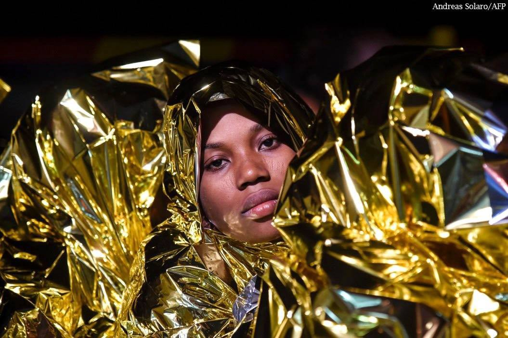

An exhausted refugee after she was rescued from an overcrowded boat off the coast of Libya\. Credits: Andreas Solaro
### Numbers

An estimated record 4,233 people have died trying to make the crossing in 2016, surpassing the 2015 total of 3,498 \(1 January to 8 November\) \.

According to most up\-to\-date Italian Ministry of Interior figures, the 163,989 migrants who arrived in Italy by sea to represent a 15 percent increase compared to the same period last year\.
#### France
### Direct volunteer reports on post\-Calais Paris

](assets/562af6f68b9b/0*yRgCdXC7_sJklegX.jpg)

Credits: [**Paris Refugee Ground Support**](https://www.facebook.com/PRGS.team/)

> It has rained today but its clear tonight and its 2 degrees\. 

> We loaded the van at 8pm\. After last nights distribution we decided to load the van with the essentials \(sleeping bags, blankets, jumpers, jackets, first aid, hygiene packs, hats, gloves, scarves and emergency space blankets\) \. A mobile warehouse, so that we’re equipped for any need at any moment\. 

> The way we distribute has had to change due to the fact that people are scattered throughout the area and there is a much bigger police presence than before\. The police actively patrol the streets in and around the 3 main areas where the tents used to be\. Refugees now have to remain hidden or run risk of being moved on\. This means we can no longer conduct controlled distributions\. Instead we are either contacted by people \(volunteers \) on the ground who have located refugees who we then arrange to meet or we walk the streets trying to find them in order to provide them with basic needs\. 

> By midnight we had ran out of sleeping bags, roll mats, gloves and scarves, we went back to storage to restock\. 
 

> ~
 

> On our second round we found these 3 Eritrean boys with thin blankets around their shoulders\. One of the boys had a t shirt underneath his shoulder blanket, another had a hat on but all three were shivering, exhausted and frightened\.
 

> ~
 

> Although last night we distributed sleeping bags and roll mats to these 3 Sudanese boys, tonight they remain exposed to the harshness of the inhumanity and the winter weather conditions\.
 

> ~ 

> We arrived home at 3am, knowing that we had missed many people hidden throughout the city\. 

](assets/562af6f68b9b/0*VR_sI3Qd_i9aiXqh.)

Credits: [**Paris Refugee Ground Support**](https://www.facebook.com/PRGS.team/)

> Like many long\-term co\-volunteers, I’m trying to keep in touch with ex\-residents of the Calais jungle via FB messenger\. It is proving more and more difficult, as, through sheer survival, these guys are having to live in ditches and small woods with limited wifi, charge and phone credit\. Many have now been turned away from CAOs as, through sheer panic and distress and the recent most haphazard and upsetting ‘ registration’ non\-system, set up by FTDA and the Pas de Calais local auths, they simply missed the bus\.
 

> Amelia at The Guardian here also highlights another very grave issue — that of deporting \( mostly\) Afghans, fostered as tiny children, with UK families up to 15 years ago — and now sent back to the ‘ safe country’ that is Afghanistan — fully\-assimilated young \( barely\) adults of eighteen\. 

> This is ‘ cleansing’ taken to a new twisted level of displacement\. Barely out of childhood and wrenched from a loving UK family who saved them from the horrors that Theresa May is about to return them to\.
 

> Another contemptible and inhumane gesture from a UK government that is already dragging its xenophobic feet over the reprehensible inaction on protecting refugee children \( UAMs — unaccompanied minors\) set up through Section 67 of the amended Immigration Bill\. A firm slice of humanitarian legislation, green\-lit \( thanks in no small part to ex\-refugee child, Alf Lord Dubs himself and Calais Action\) \. 

### Very helpful map for refugees in Paris

Find [here](http://www.streetpress.com/sujet/1466676097-welcome-map-carte-aide-refugies-paris) \!
### Very helpful map for refugees in Berlin

Find [here](https://arriving-in-berlin.de/) \!
### Dublin deportations

While refugees coming from Calais will be able to stay, the French government is preparing to accelerate the deportation of refugees to EU member states according to Dublin Regulations\. The French state has started a tender process to create around 5,500 temporary accommodation places in detention centres for people who are about to be deported\. Gérard Sadik of the Cimade association says 42% of asylum\-seekers registered in the Hauts\-de\-Seine are concerned, as France could ask another country to take them back and around 20% of those living in the Parisian camps are concerned as well\.
#### UK
### Permission granted by the high court to judicially review Amber Rudd over the Dubs Amendment \(s\.67 Immigration Act 2016\)

](assets/562af6f68b9b/0*JOEDOMUH0oC_tW2X.jpg)

Credits: [**Help Refugees**](https://www.facebook.com/HelpRefugeesUK/)

The Dubs Amendment was passed in May 2016 in response to the global refugee crisis\. We issued legal proceedings on the 18th October as at this time not one child had been relocated to the UK under the agreement\.

We highlighted that, before October 2016, the children who were said to be brought to the UK under Dubs were in fact children to whom the Home Secretary already owed separate duties under European Union law \(the Dublin III Regulation\) for family reunion purposes\.

Our legal challenge also alleges that the Home Secretary’s failure to implement her Dubs duties towards unaccompanied children in Calais — despite her commitments in Parliament to prioritise those children — contributed to the Calais children being exposed to serious human rights violations\.

Amber Rudd was repeatedly warned that unless proper registration and relocation processes were put in place children who would otherwise be safely relocated might go missing\.

Despite these warnings, the Home Office’s registration of children in the Jungle for the purposes of relocating them to the UK only began on 21 October, three days before the eviction and demolition, and after Help Refugees had begun their legal challenge\. The first relocations to take place to the UK under s\.67 Immigration Act 2016 started on 22 October, two days before demolition\.

At the time of the eviction on 24 October, many children, including some as young as eight, remained unregistered and non\-accommodated\. Children slept by the roadside or re\-entered the partially demolished Jungle Camp in which fires were burning\. Unaccompanied children are believed to have gone missing during and in the aftermath of the demolition of the Jungle Camp\.

We will continue to fight for the rights of the unaccompanied minors, now dispersed across France in accommodation centres, awaiting the attention of Home Office officials\.
#### General
### [Map](http://refugeesmap.info) of all organizations helping refugees throughout Europe
### Council of the EU: Progress [report](http://statewatch.org/news/2016/nov/eu-council-it-borders-12661-16.pdf) on “Information technology measures related to border management”
### Outsourcing and privatisation of migrant detention

Read more about how migrant detention in the European Union is becoming a thriving business [here](http://www.migreurop.org/article2762.html?lang=en) \.

_Converted [Medium Post](https://areyousyrious.medium.com/ays-daily-news-08-11-i-could-kill-you-here-and-no-one-would-care-562af6f68b9b) by [ZMediumToMarkdown](https://github.com/ZhgChgLi/ZMediumToMarkdown)._
