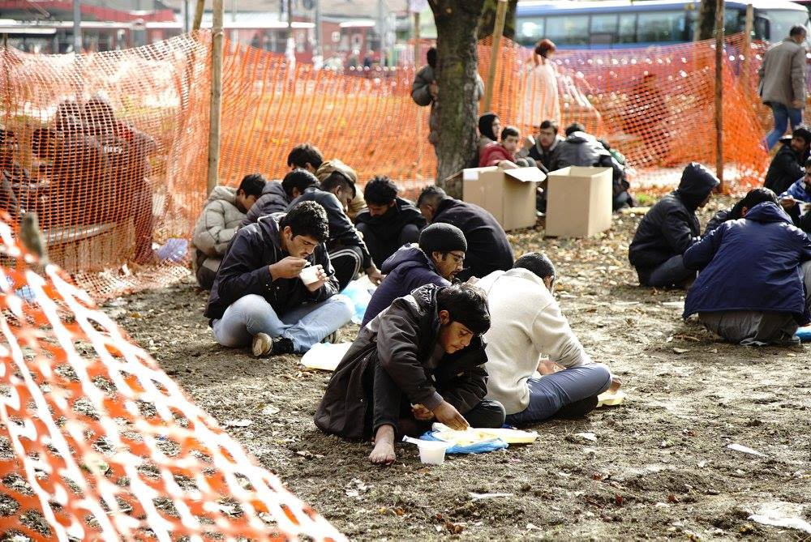
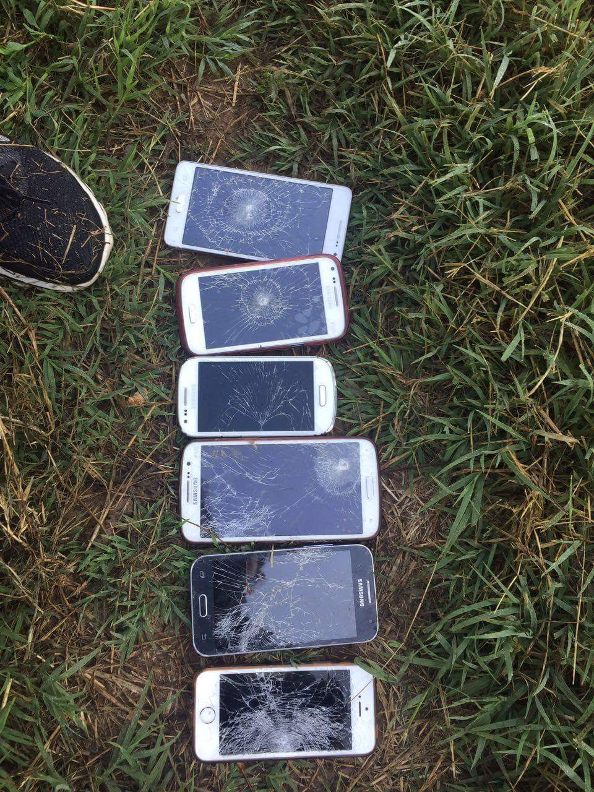
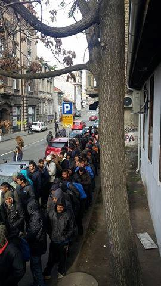
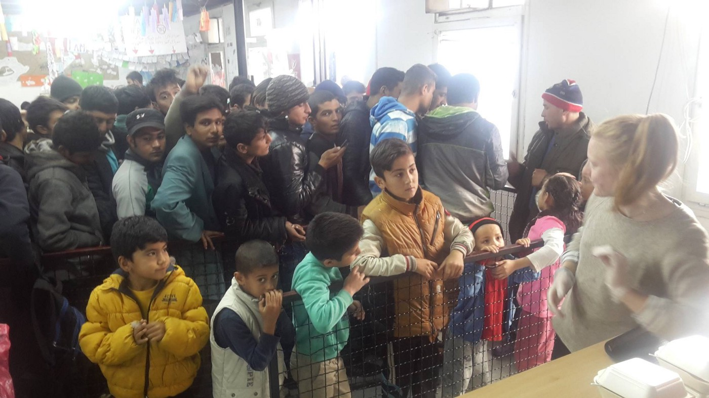
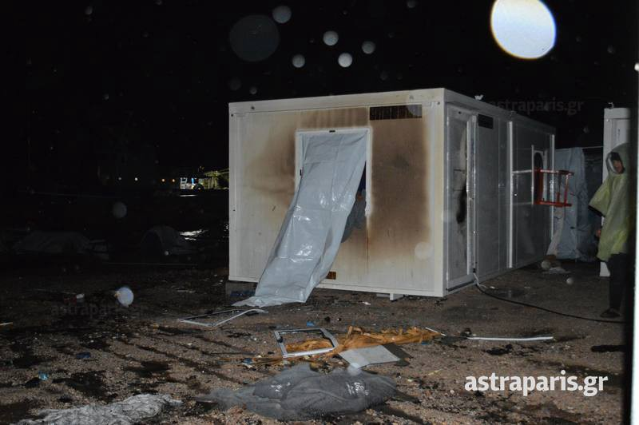
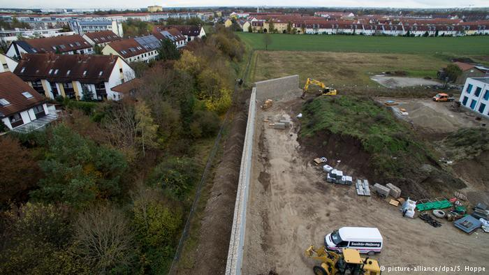
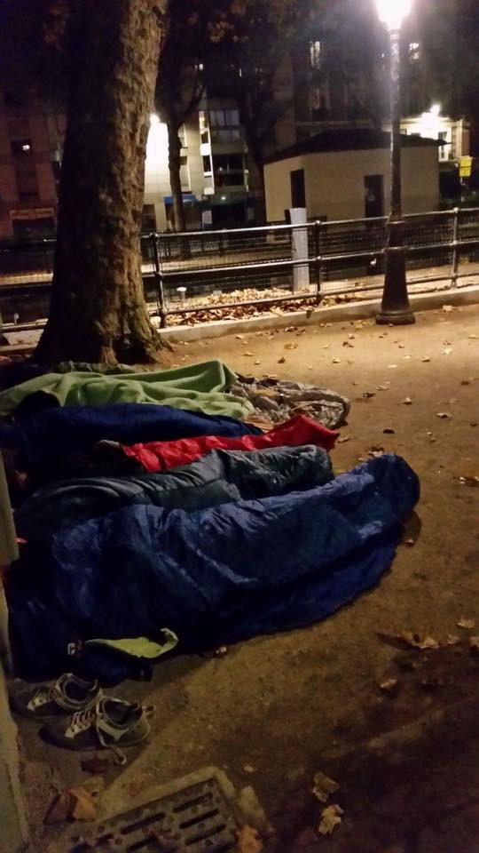

### AYS Daily News digest: 9/11: Refugee testimonies about mistreatment in Serbia
#### _Serbia, a limbo on the refugee path to safety, systematically breaching human rights / Overcrowded island of Chios getting another refugee reception centre / Hungary limited the number of applications by half / Wet, cold, dangerous — circumstances in which hundreds sleep in Paris streets / People of Aleppo left alone, attacked by all sides / Mosul evacuation under go_

 \)](assets/8c2bc49e529c/1*qIT4GLDMVBUk421MlMVRrw.jpeg)

“ No child shall be subjected to arbitrary or unlawful interference with his or her privacy, family, or correspondence, nor to unlawful attacks on his or her honour and reputation\.” — Article 16, Convention on the Rights of the Child \(Photo: [SIRIUS\.HELP](https://www.facebook.com/sirius.help/) \)
### One step forth, two back: Serbia systematically ignores Human Rights

For most of the refugees Serbia is meant to be a station, not a new home\. But with around 6200 refugees there estimated by UNHCR as of 2\. November 2016, the people stuck there are facing more and more problems\. This is a consequence of the stricter border controls in Hungary which have been implemented in the beginning of July and left the protection seekers stranded in Serbia, which obviously was not prepared to host that much people\. One example: In the end of June UNHCR reported agitatedly, that for the first time since February there have been more than 2000 people\. Today the number is three times higher\.

 \)](assets/8c2bc49e529c/1*sRkCsgYgsYGqHJVxoaYW8w.jpeg)

additional places: tents on the ground in the official camp in Subotica \(Photo: [Moving Europe](http://moving-europe.org/bordered-lives-unbound-violence/) \)
#### Illegal deportations

“Go in Macedonia\. Don’t come in Serbia again\.” This sentence has been shouted to a refugee by Serbian authority\. It has come to our attention, that since several weeks authorities in Serbia have started to deport refugees from Sid and other locations back to Presevo\. When the camp in the south of the country was too overcrowded, they started to deport the protection seekers back to Macedonia without any legal process or information\. “They put everyone on four busses\. Two buses they take to the little, uh, in the Preševo camp, a closed camp\. And two buses they take to deport”, a deported refugee told AYS volunteers and continued: “Because Preševo camp is now full, they deport to Macedonia\.”\. After spending some two weeks in the forest and later in a small village, they paid 300 Euros to get back to Belgrade\.

> “Twelve kilometers from Belgrade we get off from that car and walk about four kilometers and then take a bus to the city”, the refugee described\. “Then we arrived to Belgrade in the park\. And the people are concerned about the police in Belgrade also\. They say police maybe also deports from Belgrade\.” 

**AYS is aware of people hiding in forests or abandoned factory buildings with only little support from volunteers\.**

](assets/8c2bc49e529c/1*tmXj_LDyoBnuyuHrEsshHg.jpeg)

Photo: [Kimmie Whicher](https://www.facebook.com/KimberlyMae19)

These deportations are surprising for volunteers in the field, who can’t react on these actions since there is no legal process and the deported refugees don’t get information before it happens\. For the protection seekers this is even more surprising — and frightening\. “They say, there is no deporting of people in Serbia\. Then why they deport people in Serbia?” our contact said\. During the last months Serbian police among refugees was famous for being kind of calm, nice\. At least to what they and their friends experience in Hungary or especially Bulgaria, where our contact had spend three months: “It is very very difficult and very very strict\. They are also beating us and take our mobile phones and our money\.”

](assets/8c2bc49e529c/1*3uFM07--XzeGlvkpFp5Ilw.jpeg)

Photos: [Refugee’s Anthem](https://www.facebook.com/refugeesanthem/)

Back in Macedonia we heard different stories of what happens to the deported refugees\. “The Macedonian police also catched them and threw them to Greece and some of them are in prison, in jail”, another refugee told an AYS volunteer\. Obviously it doesn’t matter if they are on the list to enter Hungary, registered or not in Serbia: “They don’t care if you are registered or not\. They don’t check papers\. They just say, “Come\. Let’s go\.” He was even more confused from the fact, that the group had entered Serbia through Bulgaria not Greece — so they were not registered there\. “He had a fingerprint of Bulgaria\. Why not deport to Bulgaria? Why are you deporting to Macedonia and then Greece? Now he is in jail\.” Again he repeated: “We have never been to Greece\. That’s why we are afraid\.”

Another problem in Macedonia has been described AYS as following: “There is also mafia there\. If they catch you, then they ask you to call to your home and give them 5,000 dollar 10,000 dollar\. If we don’t, they beat us\. They cut our fingers nails\. There is a lot of problem for us\. That is why we are afraid\.”

Further volunteers in the field reported that the or pushbacks after the deportation\. Because the returns to Macedonia obviously don’t happen officially, Macedonian police sometimes refuses to take these refugees\. Then they send them back to Serbia, where they are now illegally and have to hide from the police\.

On the other side UNHCR reports, that within three days they “and partners encountered over 60 foreign nationals who reported to have been pushed\-back/unlawfully expelled into Serbia, without having been granted access to asylum procedures in Croatia”\. Same for Hungary, where the refugees reportedly were not being given any food or drinks until they came back to Serbia\.

](assets/8c2bc49e529c/1*4Mx-6DSUWrnZmFLDFVMUXg.jpeg)

Photo: [DOAM](https://www.facebook.com/doamuslims/)
#### Leave order

“I only helped a friend with translating in the hospital”, another refugee told us — but this should become his downfall in Serbia\. On his way back to the official camp he was controlled by police but hasn’t had the correct papers\. Then authorities told him to leave within one month, otherwise they will send him back to Macedonia or even Afghanistan, his home country\. His family, travelling with him, is not affected by this order\. And usually the authorities in the camps tell the refugees they are free to go in the city\.

_Until today our contact does not understand, why he has to leave the country while there is no neighboring country willing to host him\._

This Afghan man is not the only case we know about with this order\. Other cases, AYS got to know, were prompted to leave within ten days\. While some are panicking, afraid of being deported to their country of origin, others say it’s safe to stay in the transit zones until Hungarian authorities let you cross the border\. But still then they have to hope, that they won’t be controlled by Serbian police until then\.
#### Lack of hygiene

We all remember the pictures of Idomeni, Dunkirk, Calais and at least Paris\. While all of these makeshift camps have been demolished, several hundred refugees still have to wait in the same, not to say even worse, conditions compared to the mentioned camps\. In the transit zones of Kelebija/Tompa and Horgos/Röszke around 170 people camp on Serbian soil, waiting to cross the border soon\. [They have no appropriate shelter, showers or heaters there](https://medium.com/@AreYouSyrious/ays-daily-news-08-11-i-could-kill-you-here-and-no-one-would-care-562af6f68b9b#.n9cilmrz3) \. Having asked for at least showers, some were answered that they are not supposed to stay in the transit zones but the camps\.

 \)](assets/8c2bc49e529c/1*ZcScq2qsBZ7P0NJSCApd3w.jpeg)

\(Photo: [SIRIUS\.HELP](https://www.facebook.com/sirius.help/) \)

Further in Belgrade the government has asked volunteers and NGOs to stop supporting refugees who live in the rough streets, sometimes since months\. The reason is, that they want the refugees to stay in official reception centres\. Info Park \(on 25\.10\.2016\) and Miksaliste \(2\.11\.2016\) already suspended food distributions\. Miksaliste at least until they find a way to support enough people\.

Photo: Refugee Aid Miksalište

But apparently the governmental facilities are hardly better than soil, streets are abandoned buildings\. Already after the first evictions in Belgrade the refugees came back after a few days, saying the conditions in the camps are too bad, the rooms too overcrowded\. Only a few showers for several hundred people\. There obviously is a lack of hygiene, in its latest report UNHCR just confirmed this:

> “With close to 20% of refugees reportedly infected with body lice, the Serbian Institute for Public Health declared an ’epidemic’ in Krnjača Asylum Centre \(Belgrade\), Preševo Reception Centre \(South\), Subotica \(North\), Sid, Adaševci and Principovac Transit Centres \(West\) \. Disinfection measures including the treatment of infected persons, washing of infested clothes at 60 degrees, steam\-cleaning of beds/mattresses and spraying of the facilities, have by now more than halved the number of infected refugees/migrants from around 900 eight days ago to less than 450 currently\. Apart from screening of new arrivals, no special restrictions of movement needed to be introduced by the centres\.” 

Furthermore internationals volunteers are being denied access, even when trying to collaborate with authorities, asking for permission officially\. On the other hand authorities try more and more to collaborate with local NGOs in the governmental facilities\. But in fact this sometimes leads to volunteers being used as workforce which can be a conflicting situation for themselves\.

**Serbia special research: Keegan Nashan** 
**Additional reporting: Niklas Golit**

](assets/8c2bc49e529c/1*eOEZUpVimBhnWljzEIDLHQ.jpeg)

Photo: [Info Park](https://www.facebook.com/Info-Park-885932764794322/)

116 people, all male, were brought to Preševo camp last Saturday\. Two of the buses were with refugees and one bus took the police from Subotica\. According to some sources, on the same day 76 people were taken from Preševo and approximately 45 people from Bujanovac to Sombor, all of them families\. At the moment there are 697 people in Preševo: 401 male, 50 female and minors\. According to KIRS, a new group of people, around 500 of them\(all male, though not confirmed\) should arrive on Thursday afternoon\. Some of them are going to be lodged in the halls of the Preševo camp and others will stay in Miratovac camp\.
#### SYRIA

> Immense suffering continues in Syria, as a huge city battle with hundreds of thousands of civilian lives in danger is taking place in Aleppo\. 

> Meanwhile Idlib is being heavily bombarded and could be the next Aleppo\. 

](assets/8c2bc49e529c/1*Emhw_2Ln2l4PaUTuvv3xeg.jpeg)

Photo: [Children of SYRIA](https://www.facebook.com/marcheforsyria/)
#### IRAQ
### Tens of thousands displaced from Mosul

Nearly 42,000 people have fled Mosul after the military operations launched to retake control from “Islamic State”\. During their two\-year rule, IS militants exterminated dozens of people in southern and central Iraq, [DW](http://m.dw.com/en/tens-of-thousands-flee-mosul-as-operation-against-is-intensifies/a-36321008) reports\. According to IOM’s latest [report](http://www.iom.int/news/iom-aids-displaced-iraqis-mosul-military-operations-enter-4th-week) , on Monday there were 34,038 displaced Iraqis from Mosul and adjacent districts, so the numbers are rising by day\. 
Aid organizations have warned that fighting around the city could displace up to a million people in the area\.

Gogjali, Iraq 7 November 2016
A boy carries a lamb as he and his family flee their home trying to find safety from war operations in Mosul\.
\(Photo: Marko Drobnjaković\)
#### GREECE

18 people were officially registrated on Kastellorizo\.
15,955 migrants are currently staying at reception facilities on eastern Aegean islands: 6,124 on Lesvos, 4,211 on Chios, 2,760 on Samos, 1,990 on Kos and 870 on Leros\.
### Chios
#### Storm hits Chios

As the weather is getting rough lately, a strong wind destroyed some tent structures causing damage, volunteers report\. “Tension grew among the people who just had their tents crushed, and it escalated quite quickly\. It all resulted in a small fire, and one container burned down\.” 
They claim there have been many improvements and efforts have been made to move people off the beach, though some are still living in small tents outside the camp\.

Photo credits: Astraparis\.gr
#### **New reception centre to be opened on Chios**

Despite objections by local residents on the island of Chios, due to overcrowded reception centres on the island, a new facility will be opened, on the site of a former landfill, state officials announced\. The existing reception centre in Souda will be used as a registration point, while the new centre is intended to accomodate more people in a spacious facility\. The Greek [media](http://www.ekathimerini.com/213524/article/ekathimerini/news/govt-planning-new-migrant--center-for-chios) confirm pressure on the center, that currently hosts 4 times more people than its capacity allows, keeps building as more refugees arrive from Turkey daily, sometimes more than 100 per day\.
#### **English classes on Chios continue during winter**

Refugee students from Syria, Afghanistan, Iraq, Iran, Pakistan, Algeria, and more have attending the English classes held by [Chios Eastern Shore Response Team](https://www.facebook.com/groups/421759534684819/permalink/550472008480237/) volunteers since July\. Some of them were at times walking the distance from Vial into Chios \(20km\) in order to attend a class\. Now, thanks to the assistance of a local real estate agent and a landlord who approved of the activity, they have an indoor place with four rooms for classes, and a bathroom\. They hope to raise funds to be able to pay rent, electricity, water, furnishings, supplies, and resources for students \(library, stationary, dictionaries, etc\. \) \. Consider supporting the school; 
for more information, go [here](https://www.youcaring.com/chios-east-shore-rescue-team-5175…) \.

 \)](assets/8c2bc49e529c/1*Drm1IFi-lr6vLfy7AWYlqA.jpeg)

“ RRDP research studying the human rights situation in refugee camps in Greece is underway\! Yesterday we completed data collection in four major camps around Athens and will proceed to further camps hosting a large number of refugees and displaced people during the next days\. The study results to be compiled into a report and made widely available to European policy makers, media and general public before the end of the year\.” \(Photo: [Refugee Rights Data Project](https://www.facebook.com/RefugeeRightsData/) \)

 \)](assets/8c2bc49e529c/1*SVy87MRckHB2Zl7vkX9DKA.jpeg)

A new bus shelter built for the Oreokastro camp\. “We welcome anyone that wants to get shit done so if you have a project that needs doing, let us know\. You are welcome to come use our workshop full of helpful toys\.” \(Photo: [The Get Shit Done Team](https://www.facebook.com/The-Get-Shit-Done-Team-304001796641127/) \)
#### **HUNGARY**
### **Hungary allowing half as many people the right to apply for asylum in the transit zones**

Volunteers from the [Sirius\.Help](https://www.facebook.com/sirius.help/) team, who have been actively present on the Serbo\-Hungarian border warn about recent changes in numbers and conditions of crossing the Hungarian border from Serbia\. Reportedly, from November 2nd, the official Hungary will only allow half as many refugees to apply for asylum in the transit zones at the border\. Up until now 105 people a week were able to apply, 15 per day\. This number now decreased to 10 a day, and reportedly, from now on they won’t accept applications on weekends, meaning that only 50 people get a chance in a week time\. In addition, there are still 150–200 people arriving daily to Serbia\. In the increasingly colder weather a family currently has to wait 4–5 months to submit their application, and single men have practically no chance to do so\. Since from the daily limit of 10 people usually only 1 is a single man, they would have to wait years to enter the country legally\.
#### AUSTRIA
### Positive outcome for a family deported back to the ‘first EU country of entry’

After a year of outstanding integration efforts living in Austria, a young Iraqi family was pushed back to Croatia\. 
They had arrived in their new home, their little son was born in Austria\. But, once again they had to face an unknown future after their deportation to Zagreb, Croatia\. A family from Austria immediately followed them to Zagreb, contacted local volunteers and did everything they could to get information and legal help for their new, now expelled, Iraqi neighbors\. Like a growing number of refugees in Austria, they could not avoid the deportation, but with the help of their Austrian friends and some assistance from the volunteers, they made a big step\. The Austrian Constitutional Court granted their appeal and allowed the family to come back to Austria immediately, where they will continue their family life\.
#### GERMANY
### 27 years after — more walls?\!

In the heart of the most refugee welcoming country in Europe a wall has been built\. Local politicians have expressed anger at a sound barrier built between a new refugee shelter and residential homes in the Munich district of Neuperlach, DW reports\. A 100 meters \(330 feet\) long and four metres high wall made of massive gray rocks and held together by metal wires, it has sparked outrage among the locals and politicians\.

#### FRANCE

[Paris Refugee Ground Support](https://www.facebook.com/PRGS.team/) reporting from the streets of Paris:

> _Paris Tonight\. 6 degrees\. Wet\._ 
 

> _The numbers have markedly risen between last night and tonight\._ 
 

> _Chased into hiding asylum seekers sought refuge under bridges, in dark allies, gated gardens; behind bushes where rats rustle through the leaves and under street furniture\._ 
 

> _Looking for them without bringing attention of authorities to our main means of distribution \(the van\) and cautiously not bringing any attention to the scattered sleeping spots they successfully found\._ 
 

> _Approaching them with a kind hand was so easy as they sleep deep in tonight’s damp bitterness\. Too easy…too easy for a harmful hand to approach just the same way\._ 
 

> _Vulnerable in their situation any of them could be mislead into an invitation made by false kindness\. Lacking basic needs and increasing in desperation, hoping for a little bit of mercy from life — what options would you take in the struggle to survive?_ 
 

> _K, a 16 year old teenager, was lucky \(possibly just for tonight\) to be taken in by a friend, how easy would it have been to be taken in by a foe?_ 

](assets/8c2bc49e529c/1*fHb6Qw7cJtVHEEc_krey9A.jpeg)

Photo: [Paris Refugee Ground Support](https://www.facebook.com/PRGS.team/)

_Converted [Medium Post](https://areyousyrious.medium.com/ays-daily-news-digest-9-11-refugee-testimonies-about-mistreatment-in-serbia-8c2bc49e529c) by [ZMediumToMarkdown](https://github.com/ZhgChgLi/ZMediumToMarkdown)._
