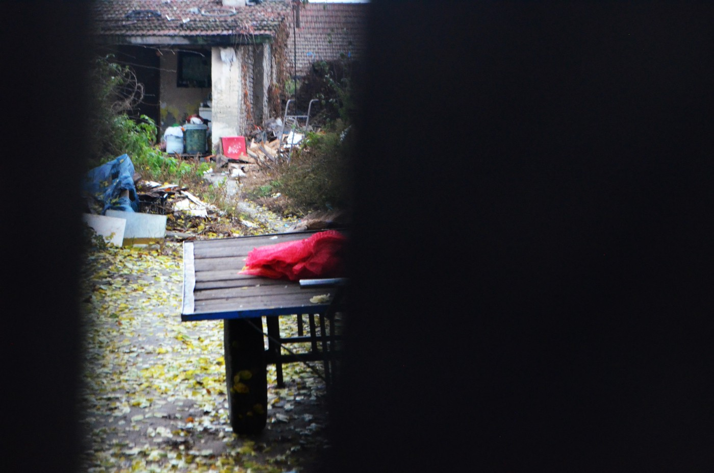
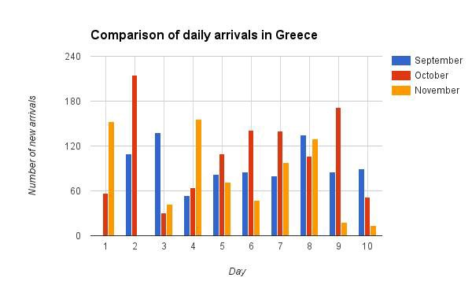

### AYS News Digest 10/11: Refugees in Serbia have no choice but to run and hide

> Cleansings and evictions spread across Serbia, refugees in hiding and running\. Volunteers and translators needed in Greece\. War in Syria continues… 

Credits: Sara Bencekovic \(AYS\)
#### Serbia
### Eviction of refugees in Serbia; Fear looms over their deportations to Macedonia

](assets/a21881df24d3/0*L3gWKrRRTrJUB4aq.)

A night in Belgrade\. Credits: [**Refugee Aid Serbia**](https://www.facebook.com/refugeeaidserbia/)

After Serbian authorities failed in trying to convince refugees currently sleeping rough in **Belgrade** and in the **north** , near the Hungarian border, to **voluntarily move** to organized official sites, they decided to forcefully evict the refugees\.

This morning before the sunrise, there was a fast and secretely organized police action by which 109 refugees squatting in Belgrade were taken on buses and sent to Presevo\. This happened between 4 and 6 a\.m\. According to reports more than 300 police in riot gear, Gendarme, and anti\-terrorism officials, wearing helmets and shields, surrounded the buildings behind the main bus station where over 700 refugees live in empty warehouses\. Police forced people to get on buses with lies and threats\. Preševo, where refugees were taken to, is from where constantly people get pushed back and, moreover, contacts in Macedonia report semi\-regular pushbacks with people being dropped at the border\. These are all yet another indication of cleansings of refugees that are taking place in Serbia\.

Many refugees tried to hide, fearing being put in closed camps or being deported to Macedonia and Bulgaria\. In such circumstances, one man fell from a roof and broke his leg\. There are reports of many other various injuries\. Refugees fear being pushed back, which is more than a legit concern seeing the Serbian state intentions\.

Along these lines, Serbian authorities requested humanitarian organizations to stop distributing food and aid to migrants and refugees in the center of Belgrade\. Herewith, the state is making it unbearable for refugees to stay\. Even Are You Syrious? is now re\-considering its mobile kitchen plans, as cooking for refugees in Serbia would mean breaking the law and facing severe fines\. Seeing the overwhelming hunger and the lack of food provided by the Serbian state, this is heartbreaking\.
### Numbers
- Kelebija 100
- Horgos 60
- Subotica 100–150

#### Syria
### War in Syria continues…

](assets/a21881df24d3/0*U6IOMzX9S2izqppL.)

Assad helicopters dropping napalm like barrel bombs on Khan al\-Sheeh in rural Damascus\. Credits: [**Free Syria — Salam**](https://www.facebook.com/Free.SyriaSalam/)

8 people were killed, and tens of people were injured by 14 airstrikes on civilians neighborhoods in Douma city\. The people were hit by Assad and Russian warplanes’ bombs\.

Here is a message from a person living inside the targeted areas:

> The neighborhood that I live in has been attacked very hard by the warplanes that caused large destruction and lots of suffering of us here\. Our neighbors lost their 6 year old child, and 2 other children were killed here\. We were searching for victims under debris and fixing our home for the whole day\. 

### UN says 250,000 Aleppo residents could starve if emergency resupply fails

Residents in Aleppo’s eastern rebel\-held region are being handed out the last remaining food rations, the UN says\. The organization’s aid convoys have been unable to access the area since July\.
### UN Presents Plan for Saving Syrian Aleppo

The United Nations are proposing a plan consisting of four parts for saving Syrian city of Aleppo, Senior Adviser to UN Special Envoy for Syria Jan Egeland said Thursday\.

“We are urging the following four things: medical supplies in to the kneeling medical facilities in east Aleppo; medical evacuations out of east Aleppo for the estimated 300 or so patients that are in urgent need of medical evacuation, together with their families; the third element is food and other urgent supplies, humanitarian relief in to east Aleppo, and the fourth element is more medical personnel in to provide medical relief in east Aleppo\. None of the four elements are conditional on the other\.”
#### Greece
### Arrivals to Greece dropping

Arrivals in the first ten days of October: 1242
Arrivals in the first ten days of November: 730

According to UNHCR data Greece saw the 160\.000th refugee arriving on 7/11, when 130 arrived\. On the same day in Italy the 165\.000th arrived in Italy, when 2911 refugees arrived\.
### Tensions on Samos after clashes between residents and refugees

The tension was palpable in the town of Vathi on the island of Samos on Wednesday, in the aftermath of clashes between migrants and local youths late Tuesday\.

Migrants claim that they were attacked by a group of hooded individuals\. However, locals insisted that the stone\-throwing brawl was started by migrants “who circulate and drink in the center of town every night creating trouble\.”

The fighting was broken up by riot police\.

Meanwhile, migrants continued to arrive this week at overcrowded accommodation centers on eastern Aegean islands\.
### Refugees set fire in Chios hotspot to protest their living conditions\. Samos refugees marched for justice\.

For one more time, frustrated refugees and migrants stuck in the hot spots of the islands of Chios and Samos launched protests\.

In the hot spot _Souda_ on Chios, the protest started Wednesday noon when young camp residents having block the street leading to the camp with garbage bins, which they later set on fire\.

Workers left the camp in panic\. The fire spread damaging three mobile units used as clinic, store for medical material and for food distribution\.

In the hot spot of Samos, refugees and migrants marched through the streets at 10 o’clock in the evening demanding dry clothes and tents\.
### Job\-search in Greece made easier

For those migrants and refugees eligible to work in Greece and currently looking for a job, a great number of job adverts are published in English every Thursday on Generation 2\.0 for Rights, Equality & Diversity website\.
### All volunteer opportunities in Greece

](assets/a21881df24d3/0*j9YFVaaN_dS-M6e7.)

Credits: [**Khora**](https://www.facebook.com/KhoraAthens/)

Please note that independent volunteers are not allowed in any of the official camps listed here\. Volunteers need to be registered with one of the NGOs/Groups mentioned below\.

1\) Ellinikon Camp II and II — Baseball and Arrivals– DRC is overseeing the adult education program at both camps\. We are looking for volunteers to teach English and Greek at the Baseball camp to adult women and men — beginners and advanced levels for English and beginners level for Greek\. Farsi speaking volunteers are desired, but not a requirement\. The English classes are taught daily to women and men separately\. Greek classes have not yet begun, so schedule for these is yet to be determined\. minimum time commitment is 30 days\. Please PM [Vicki Trapalis](https://www.facebook.com/vicki.trapalis) if you are interested with CV\. an interview is required\. Completion of the Ministry of Interior form is also required once you have been selected to join the educational team\. 
2\) The Schoolbox Project at Ellinikon Arrivals Camp for children — must meet minimum requirements\. [https://www\.facebook\.com/theschoolboxproject/?fref=ts](https://www.facebook.com/theschoolboxproject/?fref=ts) Please write with interest to Kirsty Turner at schoolboxvolunteers@gmail\.com 
3\) Eleonas — volunteer via Project Elea — minimum 2 weeks and minimum age requirements \(18 years\) [https://www\.facebook\.com/projectelea\.volunteers/](https://www.facebook.com/projectelea.volunteers/) — now taking volunteer applications from September onwards\.
4\) Skaramangas with Drop in the Ocean — see below for more info
5\) Skaramangas with Organisation Earth — See below for more info
6\) Oinofyta \(this camp is 1 hr drive from Athens\) — ArmandoAid who provides the schooling at this camp is looking for volunteers, volunteer teachers, and also has openings for remote roles\. [https://www\.facebook\.com/ArmandoAid/?fref=ts](https://www.facebook.com/ArmandoAid/?fref=ts) \. or Contact [Layhing Siu Munro](https://www.facebook.com/LayhingSiu) 
Do Your Part is also in need of general volunteers as well as someone with IT experience\. email [Lisa Campbell](https://www.facebook.com/lisa.campbell.5099) at dyplisa@gmail\.com\.
8\) Sounio Camp in Lavrio \(1 hour from Athens — location here [https://goo\.gl/maps/zsxE6MiX18C2](https://www.facebook.com/l.php?u=https%3A%2F%2Fgoo.gl%2Fmaps%2FzsxE6MiX18C2&h=PAQF-8BE6AQGUXKKmVNU3A85f0OHev2lvxab4IYhIKlRgrg&enc=AZOv82v8gssF13UyinQ3kgsVnvWIfi7jTFnrhZByfuT6x9T_TiehucJIdPPweNHjodPhL0l8O9NxrOVrfi1OtS4j12_VbYzq4iQtUcsDefE1jIOtSjlQHoAW4i0TfNsmUMBlUohpCiFI-cNE1MfE6AqNqJM8bqiiIcHVqamf_UfFT7ednrNZ9Mkdnqn5Df0O7WA&s=1) \) with Organisation Earth — see below for more info\.

OTHER LOCATIONS:
1\) Street Outreach — a few volunteers go out to various locations late at night to feed refugees or the homeless sleeping in the streets\. [Rando Wagner](https://www.facebook.com/rando.wagner) is back next week in Athens so if you want to join him, then PM him\.
2\) Khora community Centre — Tsimiski 21, Athens — interested volunteers and community members can send an email to Khora\.athens@gmail\.com\. Or show up at 9\.30am from Monday\-Saturday\. [https://www\.facebook\.com/KhoraAthens/?fref=ts](https://www.facebook.com/KhoraAthens/?fref=ts) you can also contact the No Borders School — more info below
3\) Pamperaiki Warehouse at Ellinikon — from 11–6pm Monday to Friday [Katerina Rouniou](https://www.facebook.com/rouniouk) — continuous need for volunteers to help sort donations — you can turn up at the hours stated — you don’t need to book in advance — You can also volunteer at the warehouse with Organisation Earth \(see below for more info\) \.
The warehouse is within the disused Ellinikon airport, at the back of the huge Basketball Stadium on the coastal road \(Posidonos\), across the tram/bus stop “Elliniko”\. Please report at the security check\-point — between the Olympic Airways terminal and the Stadium — and tell the guard you are a volunteer at the warehouse of “Pampiraiki”\. The warehouse is the big blue building \(pinpoint here [https://www\.google\.com/…/data=\!4m5\!3m4\!1s0x0:0x0\!8m2\!3d37\.8…](https://www.facebook.com/l.php?u=https%3A%2F%2Fwww.google.com%2Fmaps%2Fplace%2F37%25C2%25B053%2744.2%2522N%2B23%25C2%25B043%2725.2%2522E%2F%4037.895616%2C23.723674%2C15z%2Fdata%3D%214m5%213m4%211s0x0%3A0x0%218m2%213d37.895616%214d23.723674%3Fhl%3Den-US&h=kAQFkSWbUAQGg0vnd_ywQxDK8KRRS4TWYblK0K-b47XbJww&enc=AZNy_6x3T8yUSwVcsW_ubNAdWDCiEojtcWs76TfBoVRhwgQEIIvsWpY_TJo2XIWEa-b68zDjE4Mv-QpiurBxsZDUF38OirADoqyF1EtaojIM9NUiTn2NPbc7rGATftHi3zSI4qPQDhTNcz9mLl0y4GaZj40eFyI_4esa_kWc37WejqZM1RAb7zuLnap6nma8Xqc&s=1) 
Spanish volunteers, you can join a Spanish Speakers volunteers WhatsApp chat, message [Patricia Colón](https://www.facebook.com/patricia.colon) \+34 678318021
4\) Marhacar team is looking for volunteer drivers to help with distribution of Aid in and around Athens — contact via [http://marhacar\.org/](http://l.facebook.com/l.php?u=http%3A%2F%2Fmarhacar.org%2F&h=vAQFIMQdNAQGhbsFXqUToyVJ7UevbAPaCDL2oUTcn9Prutw&enc=AZM_aADLCr5szm8A6BQi81sxIYulq-6dG442r-nmXgihD1Pn2nLX-aQ_hKPhjRRkcFer0iCSjxiWXxLExJhxPhCTkM99sAH-q3mhdLtfVXrC4GWQx1OyuPXNrgmYKfD6zrjZ46L4b2AUnAXc95qxQAVQAFwVzIdfQNuoVEd5YtadlRUEQ9lC6JRGihRTCmHUANs&s=1) 
5\) Orange House — we need volunteers preferably farsi or arabic speakers — contact volunteer@zaatar\.org or PM Aida Khalil Trissell
6\) Project leaders needed to help run projects with groups of refugees \(Rooftop gardening, Solar cooking, Woodworking, Civil engineering \(building maintenance and conservation\), Herbalism, IT and electronics \(e\-Learning and R&D\), General tinkering and DIY\. Contact [Harper Pollock](https://www.facebook.com/HarperPol) [https://daedalus\.libtech\.website/ltg\-athens/](https://www.facebook.com/l.php?u=https%3A%2F%2Fdaedalus.libtech.website%2Fltg-athens%2F&h=8AQEKDEtkAQHXma5g6ogJuvHBXhoxqpkKawj7oA3_ucsLAw&enc=AZPxwcXqX-HwiAK79NGZlKOsvY4fesBS1l4hkOd5o9g5wXXVKw2Ow5GwTULoWWHE7LLdRpDSgZW3rTAf_YUpY8moAi_ohG3pFyVTkk7UKa2f8jUfcN2ixIlexZi1JnsQydIzNq5mfJVhRtIR4aAv5PZI2Vki8_jxB3Mrjm3Sb0PVgTHQkgphVsX9-4Te5q9MxMU&s=1)

SQUATS: \(please note that the address of each squat is shown first on this post\) 
When working at the squats, please note that the environment can be extremely unstructured\. Therefore, you need to be able to work within the informal structures that are set up at each squat\.
1\) Notara 26 — contact via [https://www\.facebook\.com/profile\.php?id=100010239857028](https://www.facebook.com/profile.php?id=100010239857028) 
2\) Themistokleous 58 — currently this squat has indicated that it does not need help\. 
3\) Merlie Oktaviou 19 \(5th school squat \(5th Likio\) \) — contact viahttps://www\.facebook\.com/5olikeio/ 
4\) Acharnon 78 and Katrivanou \(Hotel City Plaza\) \- [https://www\.facebook\.com/sol2refugeesen/](https://www.facebook.com/sol2refugeesen/) English teachers needed to help with English classes \(long term\) and French and German and for kids activities contact [Ellen Downes](https://www.facebook.com/ellen.downes.52) via [https://www\.facebook\.com/groups/868661516611629/\-](https://www.facebook.com/groups/868661516611629/-) they require a minimum commitment of at least a full week\.

 ‎](assets/a21881df24d3/0*qO9aKqz-ELldqEy2.)

Celebration of 6 months of City Plaza\. Credits: [**Χώρος Στέγασης Προσφύγων City Plaza**](https://www.facebook.com/cityplazaathens/) ‎

5\) Sourmeli 1,3 \(2o filoxenio prosfigon\) — This is the 2nd school squat \(also known as the Jasmine school more recently\) — contact via [https://www\.facebook\.com/2ofiloxenioprosfigon/?fref=nf](https://www.facebook.com/2ofiloxenioprosfigon/?fref=nf) or [https://www\.facebook\.com/Jasmine\-School\-Athens\-2298699407](https://www.facebook.com/Jasmine-School-Athens-2298699407) …/… 
6\) Spyrou Trikoupi 57 in Exarchia \(ex Hotel Oniro\) https://www\.facebook\.com/%CE%9A%CE%B1%CF%84%CE%AC%CE%BB%CE%… In particular this squat needs teachers or experienced volunteers to help set up English and German classes, contact [Mahmoud Rihawiy](https://www.facebook.com/mahmoud.rihawiy) if you can help with the classes\. This squat also needs volunteers who would like to help cook and do childrens activities, please contact Mahmoud for this also\.
7\) Spirou Trikoupi 17 — new squat — this squat needs translators and general fixers \(DIY\) \. If you are able to help please call on 6997391808 or email on st17@riseup\.net\. Facebook: [https://www\.facebook\.com/spiroutrikoupi17/?fref=ts](https://www.facebook.com/spiroutrikoupi17/?fref=ts) \. They also need volunteers to help with children activities and beginners/improvers English class for 5–10 year olds \(loose age grouping\) 11am to 1pm\. contact [Lauren WZ](https://www.facebook.com/lauren.wzander) Childcare and teaching experience ideal\. 
8\) Arachovis 44 — single men squat — no vols needed as yet, contact is Kastros — this squat needs help with donations as they do not have very much to enable them to become self\-sufficient
9\) Acharnon 22 — families with young kids and pregnant mums\. News squat opened up so needs various activities to be set up [https://www\.facebook\.com/Aharnon22/](https://www.facebook.com/Aharnon22/) 
ORGANISATIONS THAT TAKE VOLUNTEERS
No Border School need volunteers for squats and other locations in Athens\. Minimum age 18 and minimum commitment of two weeks is required\. They do not need to be teachers, just confident to deliver a lesson\! Interested volunteers can message through their fb pagehttps://www\.facebook\.com/noborderschool/ or PM [Laura Cesaro](https://www.facebook.com/laura.cesaro.12) \.

To volunteer with Drop in the Ocean, you have to register first\. Send an email to volunteer@drapenihavet\.no and ask for more information, or go to web\-page [http://drapenihavet\.no/en/](http://l.facebook.com/l.php?u=http%3A%2F%2Fdrapenihavet.no%2Fen%2F&h=mAQHXvpapAQFHWe3UPflNbwuKEEl8ICCyDxhKOXKrhLngSw&enc=AZOUGjEENPRAn7QC9vU6_tqpK4d-rGxzcTl7GorQsWqRmr43x-GDXvUK1KeY9PZAmagWo5UhaXsuL5OWPKF5jDsC8nCuIPlGTo5NQq6TWLE5jUDlWq-Ap4hE71bM64xHlZj4YVsfes9Cvv8GqfOmv5sh8F9J6qgmsvDSV_dN6PyWb84FoDQ-2FfHK-562mcOikU&s=1) , and submit the register form from there\. Their requirements are that volunteers should be minimum 25 years old, can commit for at least 10 days, and can communicate in English\. It’s not necessary to have any particular competence, but pre\-school personnel/teachers, medic/health care, people with relevant language skills, and long\-term are highly valued\.

To volunteer with Organization Earth at Ellinikon Warehouse, Skaramangas and Lavrio \(Sounio — accommodation provided at Lavrio only\) \), please fill out the form on the attached link\. Minimum age limit is 18\. 
[https://docs\.google\.com/…/1FAIpQLSdOuLqvHoDR9aQKQ…/viewform…](https://www.facebook.com/l.php?u=https%3A%2F%2Fdocs.google.com%2Fforms%2Fd%2Fe%2F1FAIpQLSdOuLqvHoDR9aQKQaRT6s6LEXBrG3Yk2NSGNtUuMComPEZ6XA%2Fviewform%3Fc%3D0%26w%3D1&h=6AQF_ZDaMAQGq6LowqE9Vt1RRNqfU9v9y5swlIv8FIS02Tg&enc=AZMwDMpksqr63FpYtXoQJOHtjqkK4Gb7EL6978dwtbgoGFINQMG9KOhvHN5uiYi71DH_cPTSR4fDsxb64zJ50IcYt3qyIopko057-E7emO9J_oUMnuqKaEm7zxeSq2bR_mprhx98fAKRpp14mI10sT3Vv5mPrxAAcKdOgBRSUPl8rXQ1Pwr4LbbNmpHA2AiaCWU&s=1) 
Facebook page: [https://www\.facebook\.com/EarthRefugee](https://www.facebook.com/EarthRefugee)

For wider opportunities in Greece, please check here [WWW\.GREECEVOL\.INFO\.](http://l.facebook.com/l.php?u=http%3A%2F%2FWWW.GREECEVOL.INFO%2F&h=tAQEG7_d4AQH_HP7BCEtDkj5-cTKA_-0evsJ6mdQromQC6g&enc=AZMFP3tLuBY-VE-X-qT0vC2AFkI6L9N6ARl5mspUMTbhJAQsSM5ruBZdI6Y03b95tYTpS1Vv2-SGeCMjQ82oyy-socJ7f-JhYhHJ2cd6QGCi3aup0S2DXvFyILm7hMVvjLNH0ZQ5ceccouCofK4cAtsSEV-srsSzINYWEe7_vDuqDhaO0w8kv5P6eSI5kwweK-E&s=1) New projects can also be added here\.
ADMIN NOTE: if you are going to share this wider, please make sure you include the original source link as I update the post during the week with changes\. If you intend to translate it, please make sure you ask our permission before you do so and include the original source link
### IRC is looking for translator/cultural mediators \(Arabic or Urdu speakers\) in Athens

Apply [here](https://www.skywalker.gr/elGR/aggelia/ergasias/Translator---Cultural-Mediator-(Arabic-or-Urdu-Speakers)---Athens/461CE99F-8BDE-B8A8-AFDC-F0A55CEAB1A8) \.

Also, on Lesvos where most refugees enter Greece there is currently 6000 people and the hospitals are in desperate need of translators for Arabic, Farci, Urdu and French preferably with a medical background an knowledge of mental health\.
#### Cyprus
### Cyprus rescued a boat with 150 refugees on board

Rough seas were making the rescue effort difficult, but the rescue was successful and all refugeeshave safely arrived to Latsi harbor\. The boat is believed to have set off from Mersin, Turkey\.
#### Serbian\-Hungarian border

This morning the temperature was \-2 degrees Celsius\. The transport for today to the Serbian\-Hungarian border: wood briquettes, insulation materials, winter clothes and shoes\.

](assets/a21881df24d3/0*rPyENZLgZIuvkyNg.)

Credits: [**SIRIUS\.HELP**](https://www.facebook.com/sirius.help/)

](assets/a21881df24d3/0*CQMtow7EDRwnAhEv.)

Credits: [**SIRIUS\.HELP**](https://www.facebook.com/sirius.help/)
#### France
### A Paris volunteer’s testimony

> 9:00pm and a deluge of rain descends on the Paris streets\. 
 

> We were asked by an Egyptian man “Do you know of any dry areas on the street tonight?” We were all standing under the awning of a cafe watching the rain pour from the sky, we answered him with our eyes, he lowered his head\. 

> We filled and emptied the van\. 

> We need: \(Mens\)
 

> \-Sleeping bags 
 

> \-Roll mats 
 

> \-Warm winter jumpers 
 

> \-Warm winter coats
 

> \-Waterproof jackets
 

> \-Emergency space blankets/sleeping bags 
 

> \-Bulky scarves/snoods
 

> \-Gloves
 

> \-Underware
 

> \-Winter boots size 40 and above\. 

### Paris opens its first humanitarian migrant camp

After two and half months of building, the official “humanitarian” Paris migrant camp and reception centre will open its doors on Thursday\.

The new camp is located in a disused hangar, near Porte de la Chapelle, to the north of the city near Gare du Nord\.

It will act as an official reception centre for migrants — mainly single men — who have just arrived in Paris\. Women and children will be taken straight to specific accommodation\.

“The idea is to create a place where every newly arrived migrant can be welcomed and offered dignified, humane shelter,” said Bruno Morel, head of the Emmaus Solidarite charity running the centre\.

The most agree that the camp is good news, but Baam’s post from September 23rd is still relevant: They argue that the 400 beds are insufficient and complain about the temporary nature of the centre\. They also say that people will only be able to stay up to ten days and no team of lawyers is planned to orient and help refugees in their asylum procedures\. After the ten days, asylum\-seekers will be sent to CAOs in the province, from where they could be deported to countries like Hungary and Bulgaria, according to Dublin Regulations\. Baam also says that the French Office for Immigration and Integration \(OFFI\) will be present inside the centre to “accompany” people in their administrative procedures — the group worries that this will transform the centre into a place that sorts between “good” and “bad” migrants\.
#### Spain
### Exhibition

This saturday in Madrid, Spain, there will be a photography exhibit and round table about the situation of refugees in Greece and Europe \(all photos were done in Idomeni and other camps in Greece\) \. The goal of this exhibit is to create awareness of what’s happening here and in other countries\.

Here are the details: Exhibit “Beyond Borders, Más allá de las fronteras”
Saturday, November 12th at 19:00 hrs\.
Centro Cultural Galileo, Calle Galileo 39, Madrid, Spain

Entrance is free\.
#### Germany
### Germany boosts aid to U\.N\. in Africa to deter Europe\-bound migration

Germany on Monday pledged a 61\-million\-euro \($67\.44 million\) hike in funding for U\.N\. relief operations in Africa so that fewer of its people undertake perilous odysseys to Europe, which has struggled to absorb an influx of migrants since last year\.

The extra funding lifts Germany’s total contribution to the U\.N\. refugee agency UNHCR to 298 million euros for 2016, Foreign Ministry officials said\. Its total humanitarian budget for 2016 was 1\.28 billion euros, up from just 105 million euros in 2012\.

_Converted [Medium Post](https://areyousyrious.medium.com/ays-news-digest-10-11-refugees-in-serbia-have-no-choice-but-to-run-and-hide-a21881df24d3) by [ZMediumToMarkdown](https://github.com/ZhgChgLi/ZMediumToMarkdown)._
