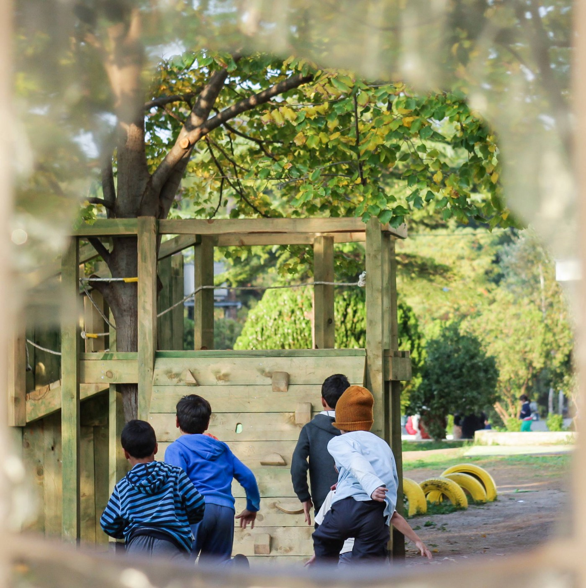
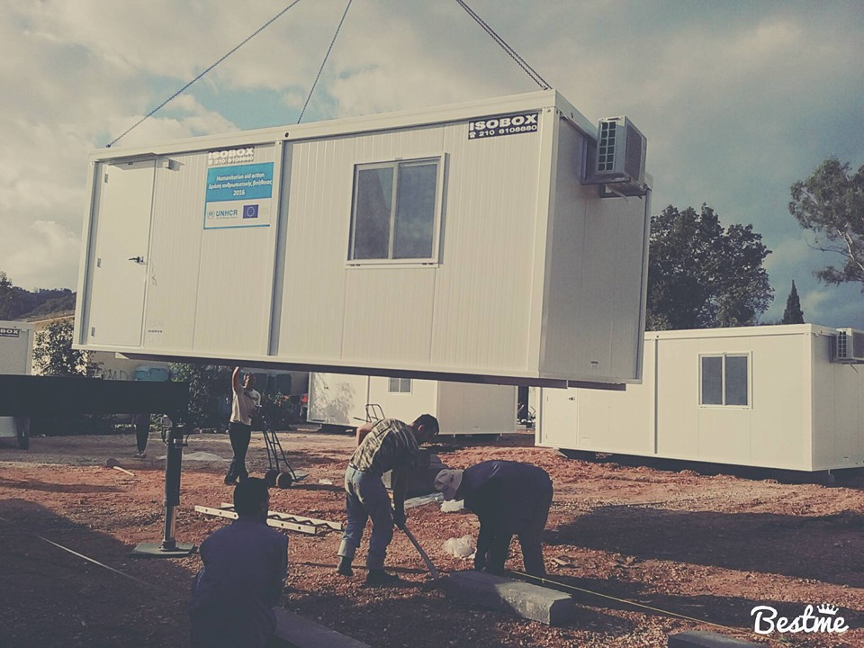
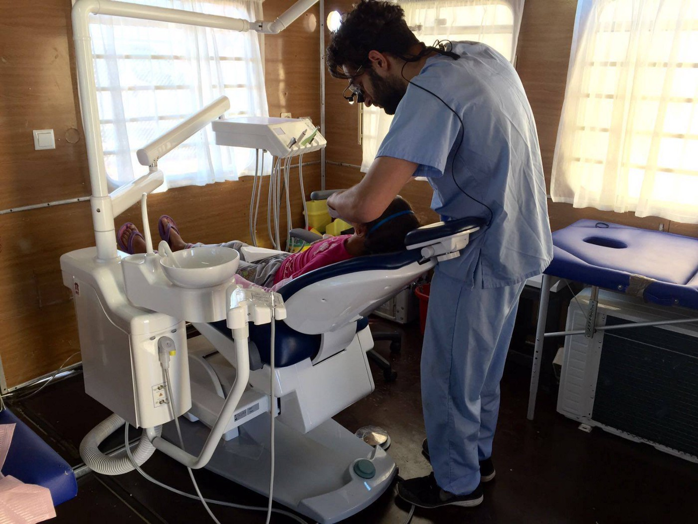
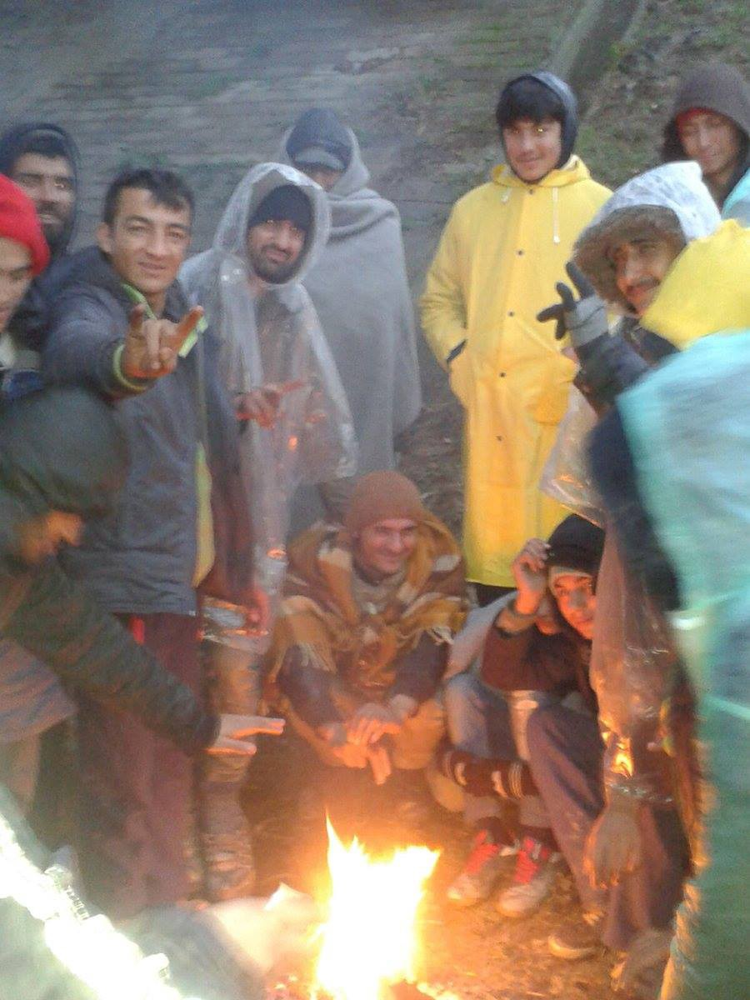
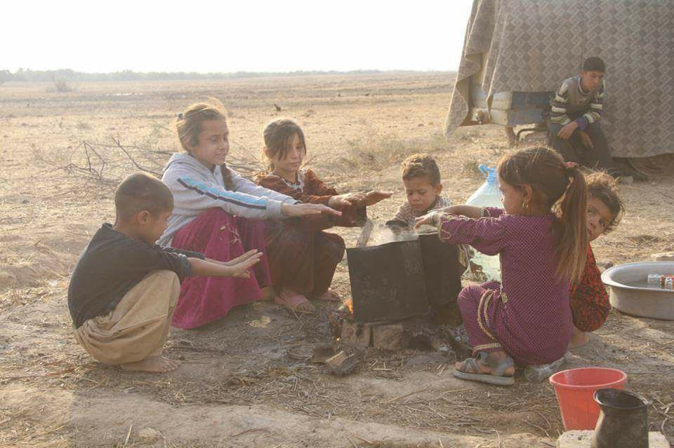
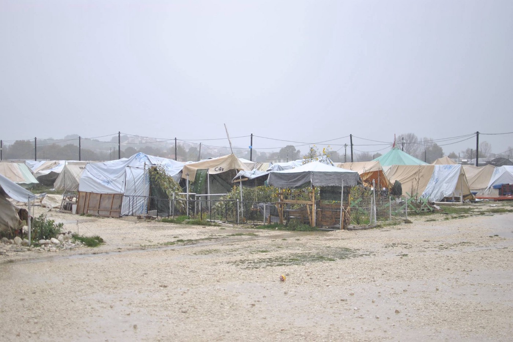

### AYS Daily Digest 12/11: Although Hatred Rains Down, Solidarity Will Grow

_Possibly emboldened by a Trump victory, Golden Dawn protests next week targeting Chios and Lesvos, volunteers and refugees warned\. Filippiada finalizes first steps of winterization\. Erdogan continues to leverage refugee exodus for his own whims\. March from Belgrade to Croatian border reaches the border\. Croatian organization calls out human rights abuses\. Italians protest inadequate support of refugees, and officials call for right to freedom of movement\._

Photo Credit: Together for Better Days
### GREECE

On the heels of President\-Elect Donald Trump’s election, it appears that the emboldening of xenophobia is not being limited to just the United States\. After news of President\-elect’s success at the voting booths, Golden Dawn officially announced their joy at his election, “calling it a victory against “illegal immigration” and in favour of ethnically “clean” nations\.” It is unsure if the following news was directly spurred on by the election, but considering the rhetoric of Golden Dawn it would make sense that they would celebrate this election with a possibly terrifying protest in Greece\.

Golden Dawn has scheduled rallies on **Chios** and **Lesvos** for Tuesday and Wednesday\. Party supporters peppered the islands with leaflets which claim that the purpose of the rallies will be to determine the fate of refugees, specifically Golden Dawn’s proposal for them\. Police are stepping up security, and most onsite teams have been notified and are in the process of preparations; regardless, this is a disturbing turn of events and hopefully not to be anticipated as a regular event\. Volunteers are encouraged to keep an eye out for any outbreaks of violence and to be careful and take sensible precaution to help minimize the risk or harm of any possible attacks\. We believe that love will conquer this hate\.

Photo Credit: Together for Better Days

Fortunately, in **Filippiada** Camp, the new isoboxes have almost finished being installed\. Despite multiple delays due to bad weather, this will complete the installation of cabins for the people living there, which will hopefully take the bite out of winter’s cold\. Furthermore Refugee Support Greece’s Filippiada team is continuing to run a points\-based “store” where people can shop for much\-needed items\. In order to prevent a pull for a black market and individually empower people, strategies to promote ethical distribution of goods are crucial\. Read more about it [here](https://www.facebook.com/RefugeeSupportGreece/posts/1708166636169474) \.

Photo Credit: Filippiada Camp News

There is much news coming out of City Plaza Accommodation in **Athens** , between [a six month celebration](https://www.facebook.com/sol2refugeesen/posts/1640144109611259?hc_location=ufi) , to workshops on internal and external borders of the EU to promote solidarity beyond borders, as well as English classes\. City Plaza is searching for English teachers as well in order to support their newly opened school\. [Message them for details](https://www.facebook.com/sol2refugeesen/) \.

Photo Credit: Health Point Foundation

Health Point Foundation has put out an urgent call for dentists/ dental assistants/ hygienists/therapists in the wake of one of their teams having to cancel their upcoming trip\. If you are able to join them from the 23rd to the 28th of November, the clinic in **Thessaloniki** \(Northern Greece\) would deeply appreciate it in order to continue to provide this vital service\. Please email: dental@healthpointfoundation\.org\.
### TURKEY

Continuing one of the most passive aggressive exchanges in contemporary politics, Erdogan, who like Golden Dawn expressed much delight at the new President Elect of the United States, shot another barb at Europe, stating that Europe [“will not know what to do”](http://www.keeptalkinggreece.com/2016/11/12/erdogan-if-3-million-refugees-march-to-europe-the-eu-will-not-know-what-to-do/) if 3 million refugees march there\. After a week of brutal crackdowns on NGOs, journalists, and other human rights activists, the EU released a report criticizing Erdogan for his “backsliding democracy” in Turkey; in response, Erdogan seems to be pre\-emptively leveraging one of his biggest bargaining chips in order to deflect serious confrontation\.
### SERBIA

The \#marchofhope that began yesterday was continued today despite the pouring rain and biting wind\. Various NGO actors eventually showed up as it continued with MSF, UNHCR, and DRC showing up to provide support\. After walking again all day and well into the night, the group made it to Ruma train station\. Although unconfirmed, it appears that the group proceeded by either train or bus as the latest update from the Twitter account @BelgradeUpdates which is documenting the march states that they “should arrive in Šid…at midnight\.” It is unclear what will happen then, although activists and volunteers are hoping that participation in this march does not heighten the risk of this group being targeted for the secret pushbacks happening throughout Serbia\.

A photo from the \#marchofhope mid Friday
#### Kelebija

Elsewhere in Serbia, in Kelebija, volunteers with North Star at the Kelebija Community Center are continuing to make projects for the people inhabiting the transit zone\. Today was another arts and crafts project\. Despite the grey weather, more colour is appearing around the space as children’s artwork is posted\. North Star is also searching for long\-term volunteers for end of November and beginning of December\. If you are interested in joining their team, please message [their page](https://www.facebook.com/NorthStarSerbia/?fref=ts) \.

Photo Courtesy of North Star Volunteer
### CROATIA

The website “Welcome/Dobrodošli” released a scathing statement condemning brutality against refugees across the Balkan route\. Read it in full below\. The original, in Croatian, will be linked\.

> UN against restrictive migration policies 

> The situation in the asylum centers in Croatia remains the same for weeks, in Zagreb there is 500 people, and in Kutina about 80 — this being mainly families with children\. Refugees continue to be returned to Croatia against their will, and equally so people are leaving Croatian centers\. Initiative Welcome volunteers as well as volunteers from other organizations, are visiting the centers to ease the days of the people waiting for a decision on their asylum application\. Integration activities, like learning how to speak the language and getting to know the Croatian system are of great value for asylum seekers as well as for those who have obtained the right to international protection\. 

> Because of this Initiative Welcome once again appeals to the state institutions to take the necessary measures to make the learning of Croatian language possible to all the people, as this is a precondition for integration into Croatian society\. Following a big nocturnal police raid in Serbia 3 days ago, when over a 100 people living in the abandoned warehouses close to the bus station in Belgrade have been taken to a detention center in Presevo, about 150 people headed to the Croatian border in another protest march hoping to access Croatia and continue their journeys towards other European countries\. 

> Also, the Serbian government has asked all organizations to stop giving aid to the 1200 people that are stuck in Belgrade\. The reason they gave was the aim to place all the people living in the streets in camps as soon as possible, however the organizations state that given the information in the field it is clear that Serbia does not have enough capacity to place all the refugees in the camps and that moves like this one do not and should not have legal grounds\. The organizations warn that the trend of expulsions, degradation of dignity and living conditions of the refugees, the criminalization of solidarity and moving this issue from the agenda is continuing\. The organizations helping the refugees call the government to provide for housing, sanitary conditions and social services, this including healthcare for the refugees now being in Serbia\. 

> Viktor Orban the prime minister of Hungary after loosing the referendum that aimed at stopping the relocation of refugees from other countries to Hungary also failed getting the support from his parliament for changing the constitution in order to achieve this goal\. This is another victory of the Hungarian people over the xenophobic policies of their prime minister\. In the latest report of the UN special rapporteur for Human Rights Ben Emmerson to the General Assembly in New York, it is clearly stated that restrictive migration policies introduced because of fear of terrorism cannot be justified, but on the contrary can pose a threat to public safety\. In fact this is a warning to the EU countries, but also to the rest of the world that not only do moves like these not help providing public safety but that they jeopardize it\. 

> In the report it is stated that these restrictive moves are made on basis of assumptions missing any factual grounds, and that there is no proof whatsoever that migration leads to an increase in terrorist activities, on the contrary it has been established that restrictive policies violating human rights create the conditions for terrorism\. 

Read the original [here](http://welcome.cms.hr/index.php/hr/2016/11/12/un-protiv-restriktivnih-migracijskih-politika/) \.

Children in Iraq\. Photo Credit: Alaa Hasan
### ITALY
#### Palermo

> _The 250 people from Morocco, Sudan and Libya, who arrived last Monday with Dattilo, spent their third night outside in the city of Palermo, under the rain, with an expulsion decree in their pockets\. Some of them could afford a bus ticket to go somewhere else, while other 50 people waited at the central station in search of help\. Volunteering organizations supported them with first aid, hot meals and some clothes\. Most of the migrants do not have money to eat or to leave\. Many of them were seeking information about their relatives\._ 
 

>  Palermo mayor Leoluca Orlando accused the European system, proved to be inapplicable and inhuman, trying to divide the people in categories\. “The only possible solution — which takes social, cultural and economic benefits with itself — seems to be again the abolishing of the residency permit, and the acknowledgment of the right to move, as an undeniable right\.” 

Rain at Katsikas\. Photo Credit: Katsikas Live
#### Como/Milano

Refugees continue to be shuffled around between promised housing in camps that reportedly have space\. WelCom NGO reported that last night several Ethiopian men were denied housing overnight first due to a bureaucracy mishap where they were unable to report to the police, after which they were taken to another location and told that the camp was too full, when it had additional capacity\. For a full report \(In Italian\) see [here](https://www.facebook.com/osservatoriomigranticomo/photos/a.744394972361875.1073741828.730614903739882/862167337251304/?type=3&hc_location=ufi) \.
#### Rome

Baobab Experience was marching in Piazza Santi Apostoli in Roma,asking the prefecture for:
\- The end of the clearances of the informal camps created by the citizens
\- The commitment to guarantee a welcoming to transiting migrants with dignity
\- The respect of the asylum seeking and of the related receiving measures

Watch their video \(in Italian\) here\.

_Converted [Medium Post](https://areyousyrious.medium.com/ays-daily-digest-although-hatred-rains-down-solidarity-will-grow-79562d03fcb2) by [ZMediumToMarkdown](https://github.com/ZhgChgLi/ZMediumToMarkdown)._
