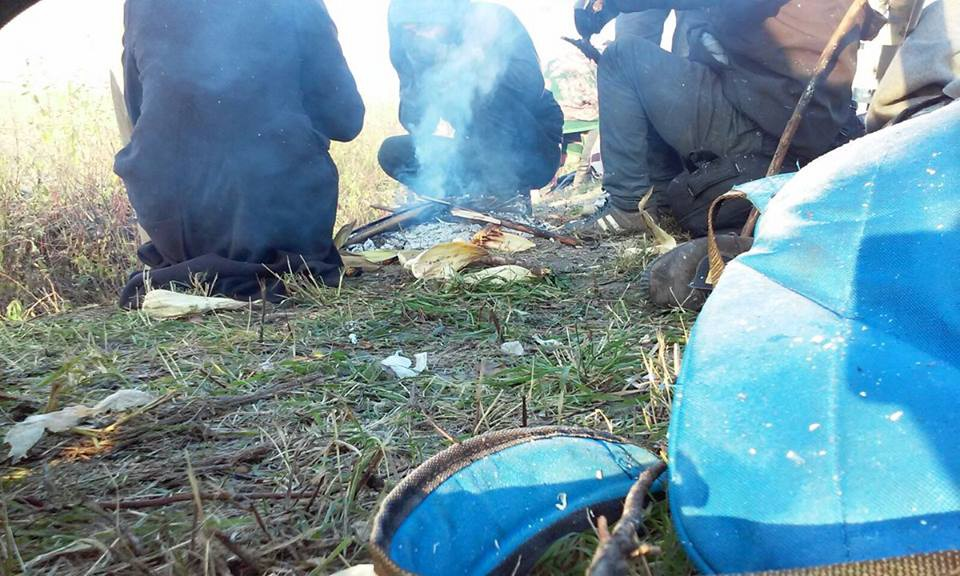
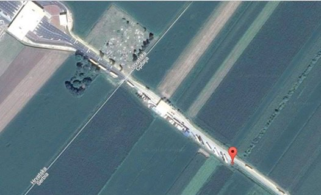
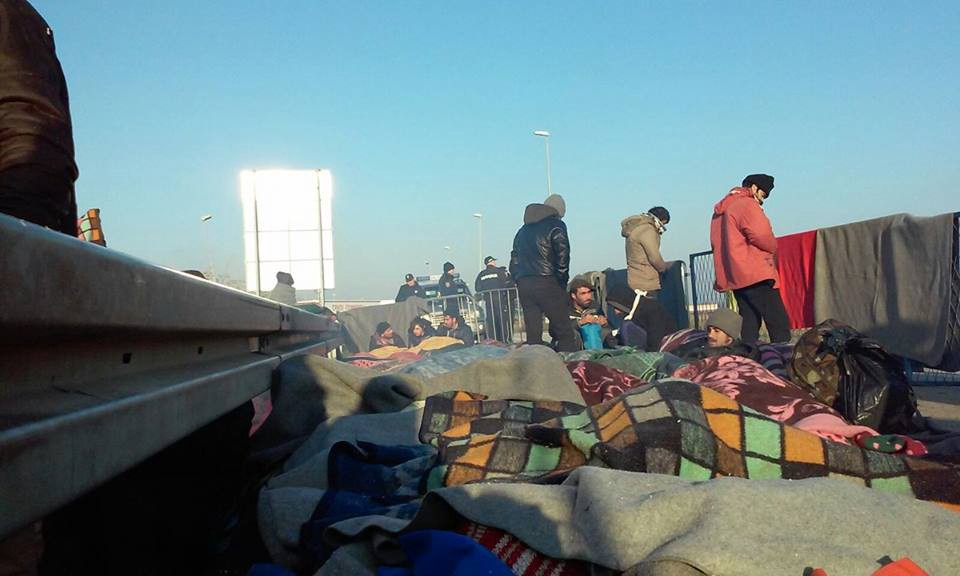
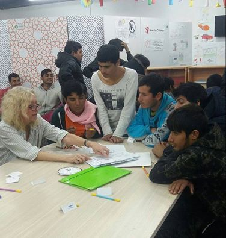
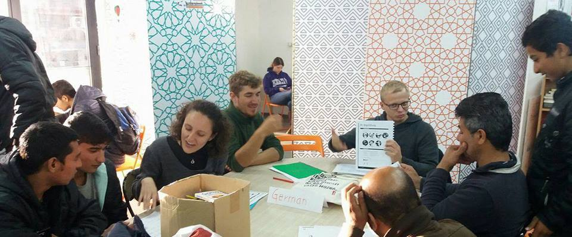
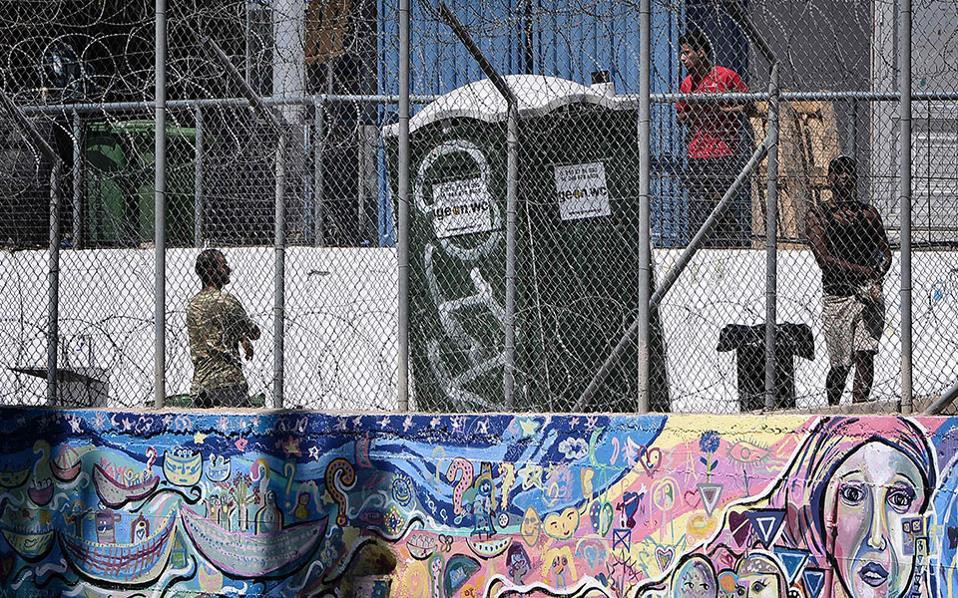
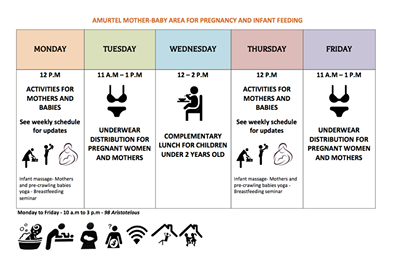
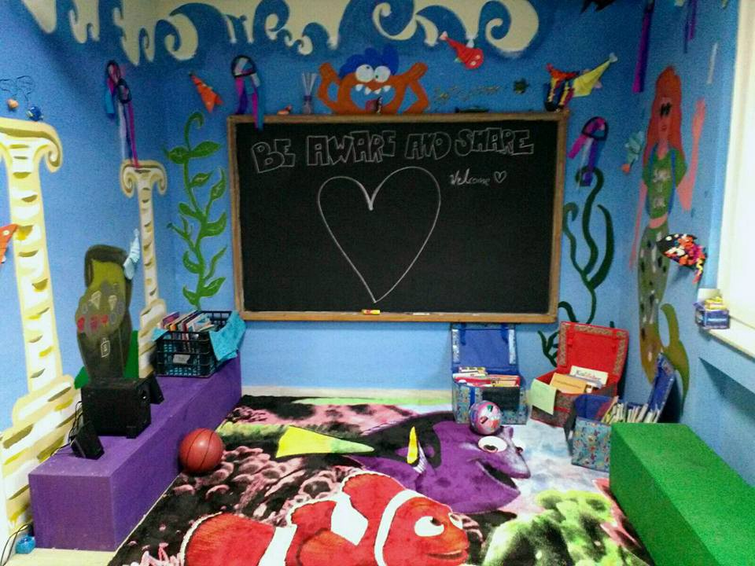
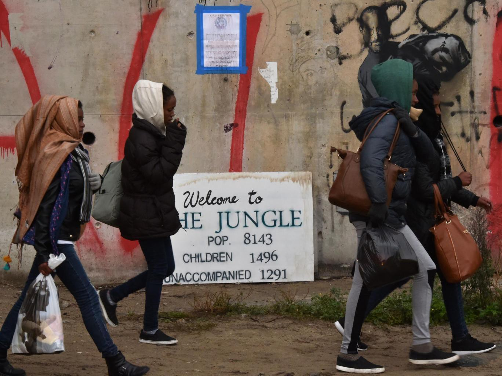

### AYS digest 14/11: We hope, therefore we march\. The borders stay closed

_People trying to return to Belgrade after the march of Hope // Hungary letting through even smaller number of people as winter approaches // State of emergency at Samos camp, UNHCR warns // Useful info on relocation and family reunification // Volunteers and donations needed all around // Some of the children from the jungle received in Scotland, others wait still with some of them starting the hunger strike // The fascist candidate in Bulgaria’s presidential election has taken 15% of the vote_

March of hope extinguished
### March of hope

Today people were still protesting near the border between Serbia and Croatia\. We have written extensively on it yesterday and the situation is still pretty much the same\. Refugees were protesting at Croatian border \(Location 45\.15378, 19\.1770\. \) and by the reports from the field, Police were aggressively extinguish one small source of warmth even though the temperature is below zero, but unlike yesterday, volunteers were allowed emergency distribution around 5 o’clock\. There are 90 people there at the time of writing this report\. Finally, they tried to board train to Belgrade at 6\.55 but were not allowed\. They have to wait next one at 4am\. As is reported from the ground some of the media are there now, too\. Fresh updates can still be followed on Twitter account @BelgradeUpdates, but also @MSF\_Sea Twitter account for detailed hourly updates

Location of protest

To put the whole ordeal into a political and regional context, No border Serbia has published a statement on these events saying that by this brave act “people have raised their voice against state violence and criminalisation” and most notably that they “have shown they aren’t helpless, that they don’t want to stand in line for charity, that no one can take away their dignity\.”

March of hope, stopped in it’s tracks

No border collective continues linking the march to the reality of the region stating that : “The problem of the border regime and the violence it creates is closely linked to the problems we all face on a daily basis in a system in which there’s place only for the “movement” of goods but not people and ideas surrounding solidarity\.”

They also add a bit of a message to all of us volunteers, activists and commentators that: “Simply observing that there are no local solidarity structures isn’t going to change the status quo; such structures are formed through active efforts\. But now in fact is the moment to gather, to join our forces and to bring about concrete change, to bring together local and personal struggles with larger struggles\.

Now is the moment to show solidarity with people who have organised themselves, who don’t want to wait for the system to decide, who are fed up with oppression and systematic killing\.” Finally they conclude by saying: “Let’s connect and unite the struggles you have everyday in collectives or individually with the fight of these 150 people for free movement and against the politics of so\-called Fortress Europe\.”
#### Serbia
### **Language lessons in Miksalište**

Miksalište

Back in Belgrade, where, by some estimates over 1000 people sleep rough on the streets, guys from different organizations are working tirelessly to provide necessities and programs for learning and socializing\. One of such places is Miksalište where they have organized a school for English and German language\. Guys from Miksalište send this message to their volunteers: “We are eternally grateful to our volunteer teachers who come regularly and give the refugees a chance to improve their knowledge of these languages\.”

Miksalište
#### Hungary
### **Less and less people are being let through Hungarian border**

As situation in camps on the border of Serbia and Hungary gets worse due to the drop of the temperature, Hungarian authorities have decided that Fewer and fewer refugees admitted through to Hungary\. Between November 3 and November 6, Hungarian authorities admitted only 20 asylum after allowing around 30 people per day previously\. The Hungarian NGO Sirius\.Help are present near the transit zones and noted that this may now drop to ten per day and that only 50 people per week will be allowed to submit an asylum claim at the zones\. Currently, around 200 people are camping out near the transit zones, waiting to to enter Hungary and apply for asylum, News that moves reports\.
#### Greece
### **State of emergency in Samos camp, UNHCR states**

Samos

As we have written many times before, camps in Greek islands are severely overcrowded\. This situation prompted UNHCR to react, or more to the point, plead with authorities and the EU that this is unbearable and unnecessary\. They are particularly concerned with the situation on Samos where the official capacity is 850, but they have received 2000 people\. They have issued an appeal for urgent action to address the “severe deterioration of the living conditions of refugees and migrants on Samos\.” adding that “Hundreds of migrants have been left in “small camping tents out in the open, with limited access to services such as toilets and showers, exposed to protection and security risks,” and that “There is no reason why vulnerable people and children remain homeless or in appalling living conditions,” the UNHCR’s representative in Greece Philippe Leclerc said\. Finally, they offer some resources and manpower to help with this, and propose that they are, as Kathimerini reports, “ready to assist with alternative short\-term accommodation for families and vulnerable asylum\-seekers, such as use of hotels at special rates, in close collaboration with local and central authorities”\. The UNHCR also called for a redoubling of efforts to speed up the processing of asylum applications and the transfer of more migrants to the Greek mainland\.

Samos, unfortunately is not alone in this, all the other od the 5 so called “hot spots” are overcrowded and as it is reported to us by our volunteer in Chios, tensions are high there between those stranded without hope\.
### **For all of those waiting, here is a short video explanation on the relocation process**

### **Useful info on family reunification**

For all of those who are waiting or want to apply for family reunification, please turn your attention to the [document that RefuComm](https://www.facebook.com/notes/refucomm-communication-and-information-for-refugees/family-reunification-dublin-iii-englishfarsi-%D8%AE%D8%A7%D9%86%D9%88%D8%A7%D8%AF%D9%87-%D8%A7%D9%84%D8%AD%D8%A7%D9%82-%D8%AF%D9%88%D8%A8%D9%84%DB%8C%D9%86-iii-%D8%A7%D9%86%DA%AF%D9%84%DB%8C%D8%B3%DB%8C-%D9%81%D8%A7/336948746656934) communication and information for refugees group has published\. There you can find useful data on family reunification under Dublin 3\.
### **Skaramangas now has camp wide free WiFi\! \!**

Back to good news, or more like — as good as they get, Data tech Lab has announced that Skaramangas now has camp wide free WiFi\! \! Great job Data tech Lab guys\! If anybody feels that they could help this organization, please follow the link [https://www\.gofundme\.com/refugeewifigreece](https://www.gofundme.com/refugeewifigreece)
### **Volunteers needed in Chios**

DiO Chios needs volunteers, here is their call: “We are in lack of volunteers on Chios between 20th of November and the 20th of December\. We serve and cook food to the refugees three times a day, do activities for children and distribution of clothes\. But most important we hand out hugs and smiles to people in the most vulnerable time in their life\. If you have the possibility to come down and help us and are over the age of 25 please send an e — mail at jeanette@drapenihavet\.

In other practical news, Amurtel center in Athens have a new schedule — check it out in this lovely picture scheme\.

Amurtel center schedule
### **Kitchen in Alexandria camp needs donations**

Further down the practical, guys that cook meals for those in Alexandria camp have announced that “after a lot of hard work the Kitchen in camp Alexandria is now ready to serve hot meals, to start with one hot meal for everyone every day\. This will require a lot of food and I need help to do this\. £5 will provide hot food for one person for a week\. £20 will provide hot food for 1 person for a month\. These amounts can be donated via 2 methods: 1\. Text message very simply by Texting 70070 and messaging RSEU99 followed by the amount \( £1, £2,£3,£4,£5 or £10\) 2\. My Donate Page \(Link below\) If you are a UK Taxpayer please fill in the Gift Aid section and the donation will increase by 25% My Donate charges no fees to Refugee Support so all the money will go to buy much needed food\.” If you are able to help, please follow this link [https://mydonate\.bt\.com/fundraisers/johnsloan1](https://mydonate.bt.com/fundraisers/johnsloan1)
### **New school in Chios**

Chios

Today, a Refugee education Chios opened their second school on this island\. Congratulations and keep up the good work\!
### **Dentists needed in northern Greece**

Guys, that is dentists from [**Health\-Point Foundation Dental/Medical Relief**](https://www.facebook.com/healthpointfoundation/?fref=nf) are sending a thank you note to all of their volunteers and are searching for more good dental souls in northern Greece\. If you see yourself as one and are a dentist, please contact them via their FB page\.
#### Bulgaria
### **Fascists are knocking on the door**

The fascist candidate in Bulgaria’s presidential election has taken 15% of the vote — sharply up on previous elections — and taken third place\.

Bulgaria’s presidential election was somewhat overshadowed by that in the US this week — the country of just seven million people is the poorest in the EU\. But the electoral rise of Bulgaria’s fascists is still worrying, especially as the country’s parliamentary fascist organisations are closely linked with the armed paramilitary groups that are “hunting” refugees at the country’s borders\.
#### France
### **Kids arrived in Scotland under Dubs amendment**

A group of refugee children have arrived safely and quietly in Scotland, nearly three weeks after the Calais Jungle was demolished\. The Home Office said a group of girls aged between 15 and 17 who left a reception centre in France landed at Edinburgh airport on Saturday, without incident\. The children were brought to the UK by Home Office staff, with support from the local authority, under the Dubs amendment, Independent reports
### **Other kids go on hunger strike**

As for the place they have left behind, Three 16\-year\-olds from Afghanistan have begun a hunger strike in France in protest at the slow process of being reunited with their families in the UK, according to a refugee legal organisation, Guardian reports
### **Volunteers and donations needed**

Also, there are a lot of those who need help and organizations are calling for donations and help\.

Care4Calais continues to monitor and provide aid to CAOs throughout France\. They need help in donations, for more follow their FB page\. If you can donate, please turn to this one [http://care4calais\.org/donate](http://care4calais.org/donate)

_Converted [Medium Post](https://areyousyrious.medium.com/ays-digest-14-11-we-hope-therefore-we-march-the-borders-stay-closed-60a4b79ad4fe) by [ZMediumToMarkdown](https://github.com/ZhgChgLi/ZMediumToMarkdown)._
