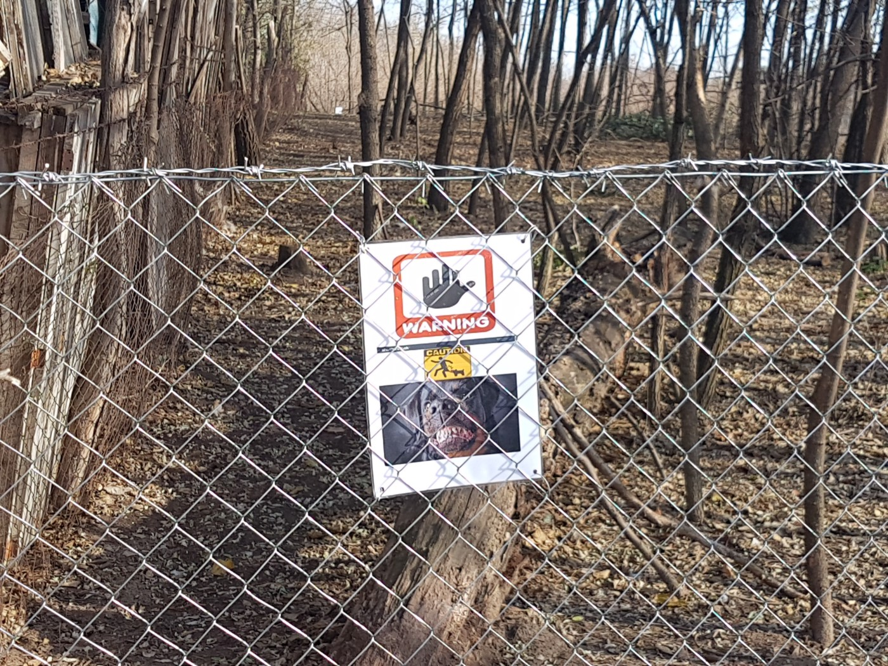
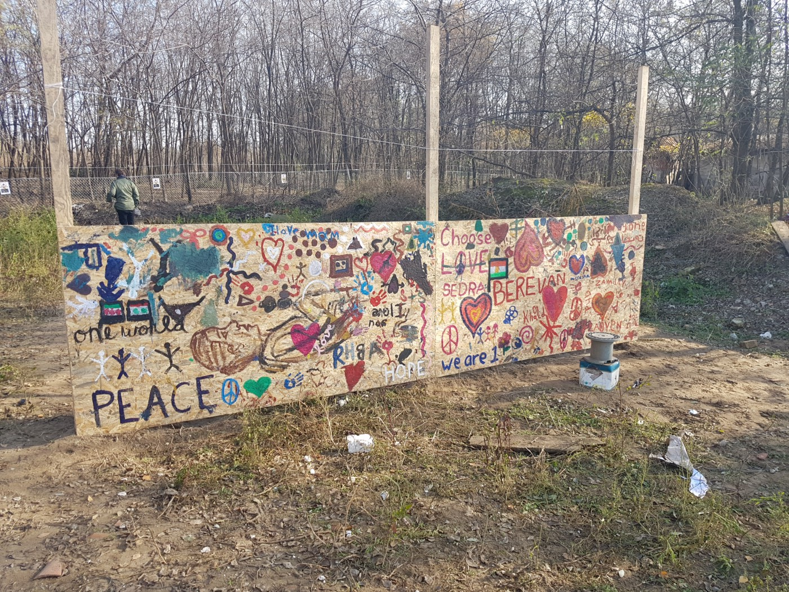
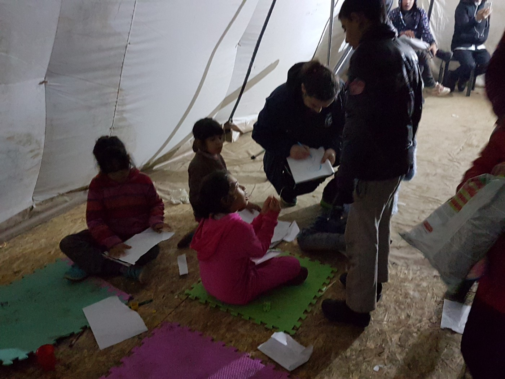
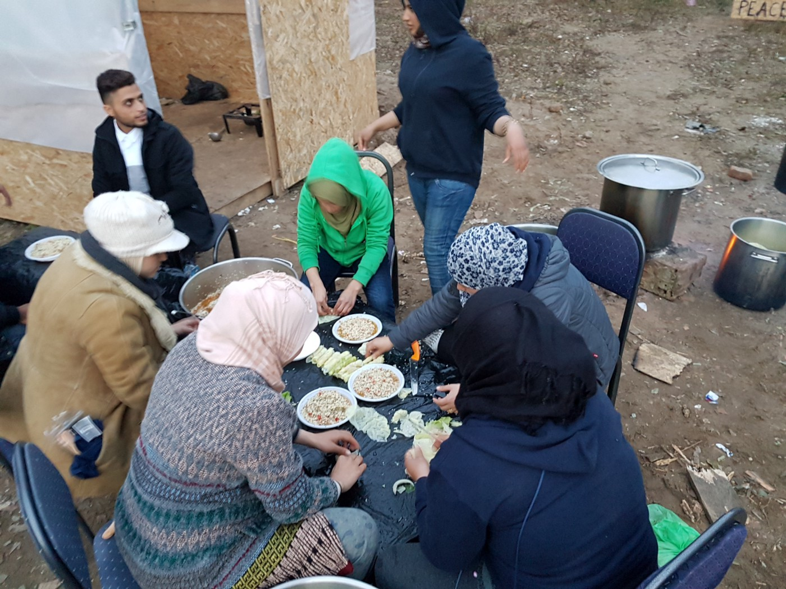
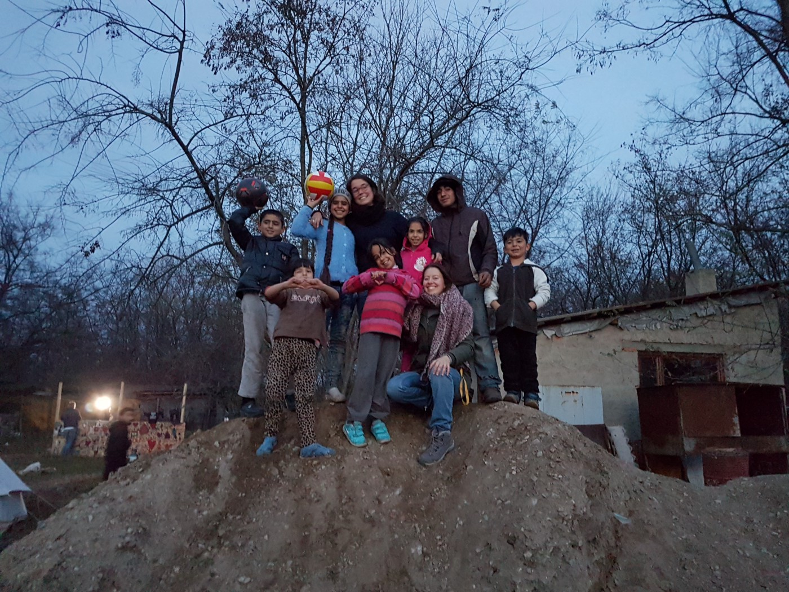
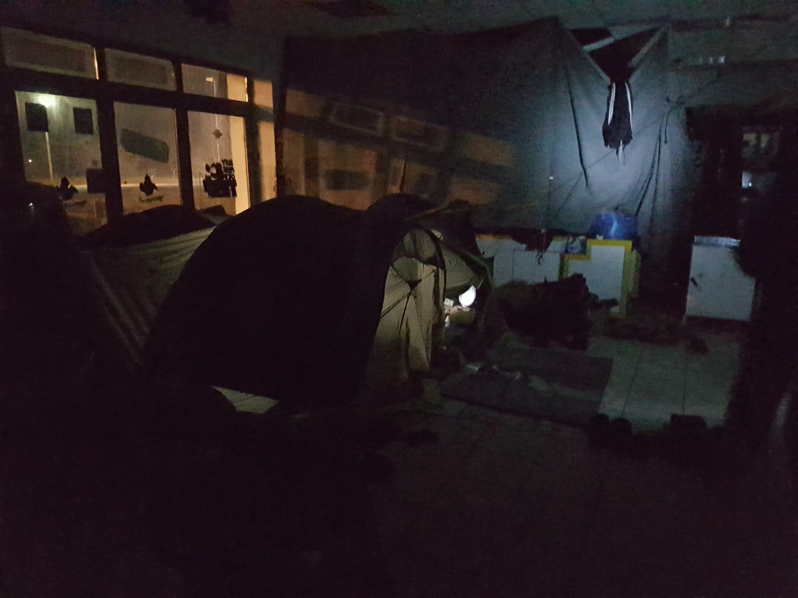
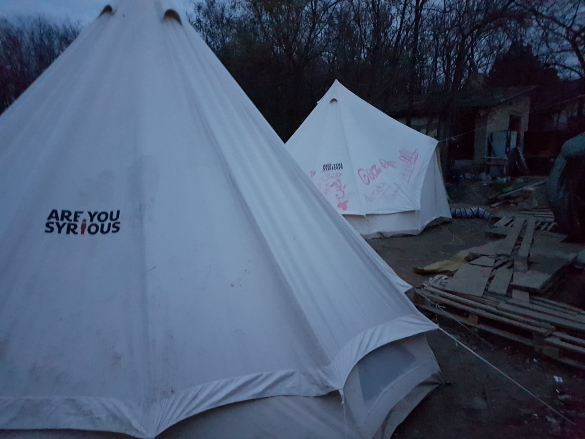
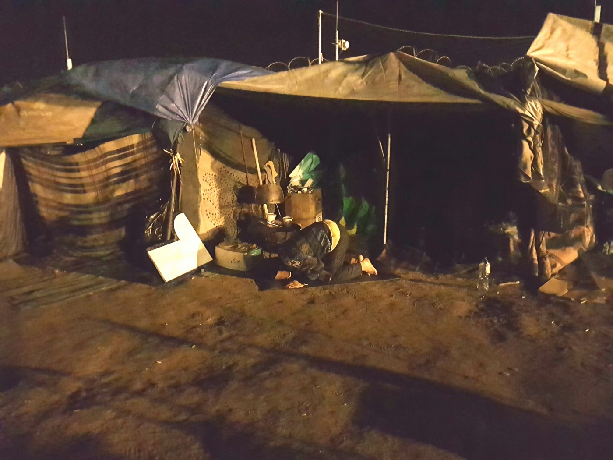
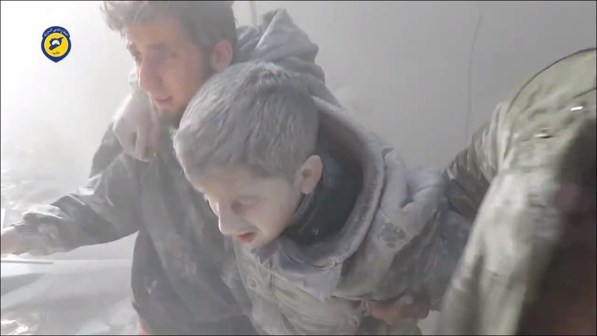
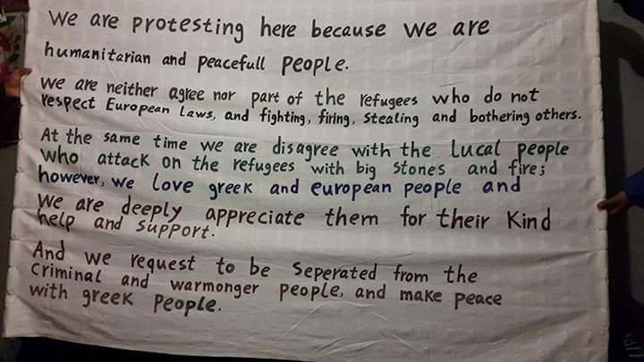

### AYS Daily News Digest 21/11: Refugees’ deaths in Serbia — a consequence of Europe’s ignoring the appalling conditions
#### Feature: Misery in Serbia, fear at the Hungarian border

A warning sign\. \(Photo: Emir Omanović, AYS\)
#### SERBIA

A 16 year\-old from Pakistan was electrocuted at the Serbian\-Hungarian border while attempting to cross\. He touched the wrong cable while navigating a train yard\. Refugees continue to report severe injuries by Hungarian border police, with severe bruising and dog bites among the main injuries\.

Photo: Emir Osmanović, AYS

[According to Serbian Commissioner for Refugees and Migrations Vladimir Cucic](http://www.b92.net/eng/news/society.php?yyyy=2016&mm=11&dd=21&nav_id=99738) , until two weeks ago approximately 810 migrants were entering Hungary each month, whereas now the number is 400\. About 1,300 more are currently staying in parks and 5,200 people are being accommodated in migrant camps in the country\.

According to volunteers, there are about 140 people in Subotica camp, 110 in Kelebija transit zone camp and about 50 in Horgoš\. In addition there are about 250 people living outside the camps \(in Subotica, in the city’s old brick factory and behind the bus station, and in Kelebija in nearby forests\) \.

Subotica is the official “one\-stop” centre where refugees come a few months before it is their turn to cross\. They’re sent there from camps all over the country as people can register at any camp in Serbia\. Once they register, people’s names are placed on a common list\. When they become eligible to claim asylum in Hungary they get a notification and go to one of two transit zone camps: Kelebija or Horgoš\. Kelebija has a predominantly Arabic\-speaking population, mostly from Syria and Iraq, with some cases from Tunisia, Egypt, Morocco and Libya\. People from Afghanistan and Pakistan are mostly sent to Horgoš\.

The circumstances in which people are currently living and waiting\. \(Photo: Emir Osmanović, AYS\)
#### Two refugees died today in Serbia\.

One of the deaths was the result of [a fight](http://rs.n1info.com/a209503/Vesti/Vesti/Migrant-ubijen-u-tuci.html) that broke out between refugees in Belgrade, in which another person was severely wounded\. Aside from the obvious — the dreadful conditions and impossible situation — the causes of the fight are not known\.

■■■■■■■■■■■■■■ 
> **[Reuters World](https://twitter.com/ReutersWorld) @ Twitter Says:** 

> > WATCH: Trapped in Serbia, the 1,000 migrants sheltering in a warehouse don't want to go to a refugee center. [reut.rs/2gf9W6y](http://reut.rs/2gf9W6y) https://t.co/rx0ZhNPOyU 

> **Tweeted at [2016-11-21 20:19:13](https://twitter.com/reutersworld/status/800795723805655042).** 

■■■■■■■■■■■■■■ 

A group of AYS volunteers went for the second time to support fellow Serbian volunteers in the area around Subotica, Kelebija campsite\. 
Apart from supplying essential winter clothes, shoes and other very needed items, our team brought a lot of good will and was able to set up some tents for mothers with children \(one heated\) and could hand out supplies and provide some food and medication for certain cases at the camp\. Some people later went to the Subotica ER\. The medical staff turned out to be very friendly towards the people and helped as much as they could\.

Photos: AYS
#### Harsh realities continue on the border

A group of people are living in an abandoned “Duty free shop” in Kelebija, on the Serbian\-Hungarian border\. In total there are 100 families and more than 30 children\. The age of the residents ranges from a newborn baby to a 76 year\-old senior\. In the absence of electric power or any form of heating, sleeping conditions are rough\. People are sleeping in an abandoned store, in poor\-quality tents and outside in the cold\.

\(L\) Tents inside the former duty free shop; \(R\) communal cooking \(Photos: Emir Omanović, AYS\)

Still, they manage to function as a community despite living in a state of fear and uncertainty there, in an area where all sides see them as unwanted guests and a liability given the political context\.

With the help of our Serbian colleagues, we managed to set up tents and provide a measure of safety and privacy to the most vulnerable people\. \(Photo: Emir Omanović, AYS\)

This so called “No man’s land” is home to dozens of frightened refugees patiently waiting for what is going to happen\. People sleeping outside in the woods, among them children as young as 15, are a common sight\. There is even an 8 year\-old boy living here with his brother\.

A man prays in front of a provisional tent that has served as a home for way too long\. \(Photo: Emir Omanović\)
#### SYRIA
### 490 Airstrikes targeted Aleppo city in the past 8 days, killing 300 civilians & injuring more than 820

#### **UN Security Council: back your resolution\!**

> “There is nothing subtle or complicated about the practice of besiegement\. Civilians are being isolated, starved, bombed and denied medical attention and humanitarian assistance in order to force them to submit or flee,” U\.N\. aid chief [Stephen O’Brien said](http://uk.reuters.com/article/uk-mideast-crisis-besieged-syrians-idUKKBN13G25T) to the Members of the Council, adding:
 

> “Without strong backing from each of you, red lines will be crossed again and again; international humanitarian law will be trampled on; war crimes will be committed\. And until there is action by you, there will be no accountability\.” 

 \)](assets/6a4ec5d0792f/1*veQDCYgmwl9SVNcDuZ-9UA.jpeg)

“The aftermath of a barrel bomb attack carried out by Syrian regime choppers on eastern Aleppo today; the attack targeted a mosque in the Katerji district in which 3 people were killed\.” \(Photo: [Rami Jarrah](https://www.facebook.com/ramijarah?fref=nf) \)

At least a dozen children have been killed on both sides of the city as regime and rebel forces step up their attacks on civilian targets\. The Syrian Observatory for Human Rights monitors and documents deaths in all parts of Syria\. Read their detailed [report](http://www.syriahr.com/en/?p=55243) on Sunday’s casualties, including shelling in [the capital](http://www.syriahr.com/en/?p=55238) and [Idlib](http://www.syriahr.com/en/?p=55223) \.

[Attacks on hospitals](http://www.abc.net.au/news/2016-11-21/syria-unrest-aleppos-children-slaughtered-on-both-sides/8041258) have sadly been ongoing throughout the conflict\. The vast majority of attacks, 293 out of a recorded 382, were by the Assad regime, [sources](https://www.facebook.com/SyriaSolidarityCampaign/posts/379711932371997?hc_location=ufihttps://www.facebook.com/SyriaSolidarityCampaign/posts/379711932371997?hc_location=ufi) claim\. A map of attacks on health care in Syria is available [here\.](https://s3.amazonaws.com/PHR_syria_map/web/index.html)

After yesterday’s attack, which destroyed the remaining hospitals in East Aleppo as well as killing two doctors and injuring 16 healthcare workers, at the World Extreme Medicine conference in Edinburgh, [Doctors Under Fire](https://www.facebook.com/DoctorsUnderFire/?fref=nf) called upon healthcare professionals worldwide to unite against these horrors and create a collective response:

_“The Syrian doctors left standing in East Aleppo can’t do it without you\. And for us to force this change we all need to be shoulder to shoulder pushing forward at the same time\. This is about saying in one collective voice at the same time ENOUGH — from wherever you are, wherever you work\. Email [info@doctorsunderfire\.org](mailto:info@doctorsunderfire.org) or [info@saleyhaahsan\.com](mailto:info@saleyhaahsan.com) or comment below or message this page with your name, specialty, location, email and where you work\. If you are not a healthcare worker please share widely\.”_

The head of the International Committee of the Red Cross, Peter Maurer, will fly to Moscow, Washington and Tehran in the coming days in a bid to secure humanitarian access to civilians in Aleppo, [Reuters](http://uk.reuters.com/article/uk-mideast-crisis-syria-icrc-idUKKBN13G26T) reports\.
#### GREECE
#### Lesvos

45 people, all Syrians, landed on the southeast coast of Lesvos early this Monday, according to local sources\.

With boat arrivals slowly increasing again, our friends on Lesvos are in need of donations:
\- Men’s clothes, size small and medium
\- Coats
\- Socks 
\- Shoes 
\- Underwear
\- Toiletries
\- Sleeping bags
\- Tents

**Greek Lorry drivers for freedom of movement** 
Lorry drivers in Mitilini protested against the situation, which forces refugees to hide in their lorries to get off the island\. They said that they and the refugees are paying the consequences of European politics and demand a change\. Some lorry drivers have been accused of trafficking and their vehicles have been taken by the police\.
#### Samos

As [reported](https://medium.com/@AreYouSyrious/ays-daily-news-digest-18-11-the-world-ignores-one-of-the-worst-days-for-aleppo-desperation-in-e180c1193dde#.u7cvccpwp) previously, recently there has been an increase in clashes between local residents and refugees on the islands\. The municipal authorities of Samos have called a demonstration for 1pm on Monday in order to protest the impact of the refugee crisis on the island, Greek media [announced](http://www.tovima.gr/en/article/?aid=845839) \.

Souda residents’ protest sign\.
#### Chios

Authorities on Chios are calling for migrants to be moved from the island\. Greek migration minister Mouzalas has countered that mass relocations would merely encourage more arrivals from Turkey\. He also [expressed concern](http://www.ekathimerini.com/213903/article/ekathimerini/news/migration-minister-slams-island-mayors-for-blocking-initiatives) about the apparent participation of far\-right protesters in attacks\.
Following the attacks on refugees on the island, NGOs working on site have issued a public [statement](https://www.facebook.com/StoriesfromChios/posts/161782664290200:0) with demands for the safety of Souda residents\.

 \)](assets/6a4ec5d0792f/1*FBbCGTplyEBJ-pud_EL0gg.jpeg)

Dozens of women and children sleeping on the streets in Chios for a third consecutive night\. \(Photo: [Juliette Georgiades](https://www.facebook.com/thomas.gata.5) \)

To protect the nearly 100 refugees and migrants who have lost their shelter in Souda camp on Chios in the last two days, UNHCR has begun setting up family tents with flooring\. They have [expressed concern](http://www.unhcr.gr/print/nea/artikel/992e999e45a1f460b460b2a7c58b8fa0/unhcr-expresses-serious-concern-over.html) over the recent attacks and hope to be able to speed up efforts to find [alternative accommodation](http://greece.greekreporter.com/2016/11/20/dep-migration-minister-vows-to-close-refugee-camp-in-souda-following-days-of-violence/) to enable the closure of Souda\.

■■■■■■■■■■■■■■ 
> **[City Plaza Squat](https://twitter.com/sol2refugees) @ Twitter Says:** 

> > A video #refugees from #MalakasaCamp send us, a "normal" rainy day of the hell &amp; the drama of families living in tents. This is not fair ... https://t.co/FHUvfhgCIf 

> **Tweeted at [2016-11-21 06:51:41](https://twitter.com/sol2refugees/status/800592501186957312).** 

■■■■■■■■■■■■■■ 

Follow the updates on the situation in Malakasa Refugee Camp [here](https://www.facebook.com/Malakasa-Refugee-Camp-292255991154075/) and check out which Greek camps are most prone to floods and low temperatures on [this map](https://t.co/cX7asOlWf3) \.

Yazidi refugees from the Petra camp were moved to other, more appropriate locations in the Thessaloniki area\. According to volunteers, some people were moved to camps with heated containers while others were sent to hotels close to the city of Thessaloniki\.

 \)](assets/6a4ec5d0792f/1*kOLAdNG2SglRpUEgwCObFA.jpeg)

Yazidis from Petra waiting for transportation, hopefully to a safer and healthier environment\. \(Photo: [Tamás Zoltán Szüts](https://www.facebook.com/szuts.tamas) \)
#### BULGARIA

Bulgarian [state media](http://bnr.bg/en/post/100763361/refugees-to-be-temporarily-banned-from-leaving-accommodation-center-in-harmanli) report that refugees will be temporarily banned from leaving the accommodation center in Harmanli \(Southeast Bulgaria\) as of Tuesday, November 22, due to locals’ suspicion and fear of infectious diseases\. We hope that health organizations and Bulgaria\-based UN Refugee Agency representatives will react accordingly\.
#### BELGIUM

23 percent of all asylum applicants under 18 in the European Union are unaccompanied minors, a total of about 88,300 young people\.

121 unaccompanied minors, registered in Belgium as refugees, have found new homes in the country so far this year\. [Pleegzorg Vlaanderen](https://www.facebook.com/pleegzorgvlaanderen/?ref=page_internal) , an organization that coordinates over 4,000 foster families in Belgium, [launched a campaign](http://deredactie.be/cm/vrtnieuws.english/News/1.2824238) named “Give the world a home” in September 2015, with the goal of helping unaccompanied underage refugees find foster homes\.

70 minors are still waiting to join foster parents\.

New updates on the statistics regarding the process of relocation are available on the EASO [website](https://www.easo.europa.eu/relocation-0) \.

_Converted [Medium Post](https://areyousyrious.medium.com/ays-daily-news-digest-21-11-refugees-deaths-in-serbia-a-consequence-of-europe-s-ignoring-the-6a4ec5d0792f) by [ZMediumToMarkdown](https://github.com/ZhgChgLi/ZMediumToMarkdown)._
