### AYS SPECIAL: Artists trapped in Greek refugee camps
#### _At the moment, 61,962 refugees are trapped in Greece\. Often, when we speak about numbers, we forget one important thing — that behind each number there is an individual with a unique story, dreams, hopes, plans for the future, and passions\. Sixty\-one thousand nine hundred sixty\-two untold stories\. This article aims to present artists, their stories and works\. Art as form of self\-expression speaks more than any other means of communication and often it transcends cultural, linguistic and other barriers\. Also, for people in this situation art is like a megaphone, through which they can shout their worries and dreams, and hope to be heard\._

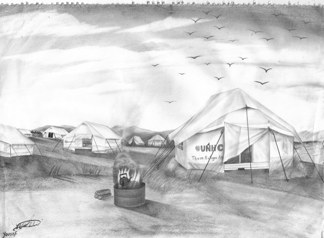

Youssef is a Syrian refugee living in the Nea Kavala camp in Greece: this is how he sees his new home

**_By Anamaria Macanović \(AYS\)_**
### **Colors and poems**
#### Ahmad Al\-Mouhmad, from Syria, now in Chios, Greece

“My name is Ahmad Al\-Mouhmad and I’m from Syria\. I worked for Fendi in Kuwait for 13 months as a sales representative\. Unfortunately though, everything changed for me a year ago when I went to the Syrian embassy in Kuwait to renew my passport\. I was refused a passport renewal because the law in Syria forces men my age to serve in the Syrian army to support the regime and the war\.

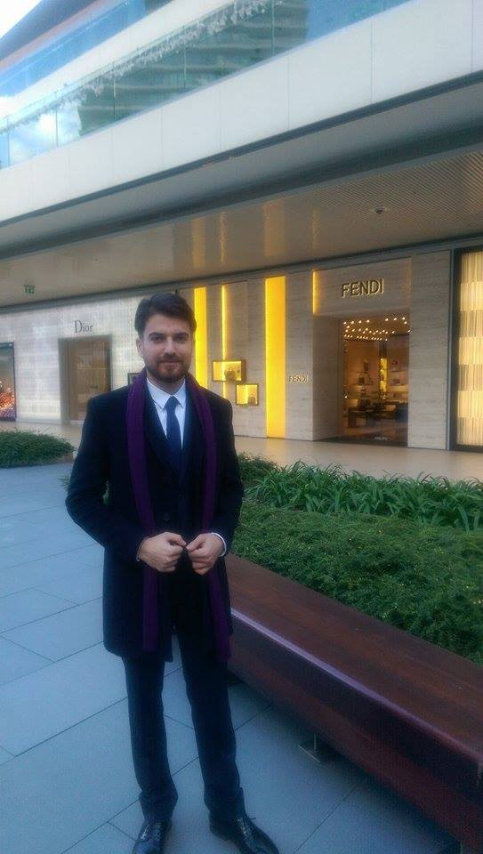

Ahmad Al\-Mouhmad

I was threatened that when my passport and residency expired the Kuwait police would send me back to Syria and force me to fight in the war\. This has happened to many Syrians in Kuwait already\. But I am not a soldier, I do not want to be in a war zone and risk my life and I don’t want to kill anyone\.

I tried to apply for a Schengen visa through the Spanish embassy in Kuwait but I was refused because I am one of so many Syrian refugees in this situation\.

I decided to travel to Turkey to search for work in Istanbul and try to find a job in the fashion industry, but no one wanted to employ me — despite my work experience in fashion\. It is very hard to find a job in Turkey because people like me are discriminated against\.

I had hoped that in Europe maybe this would be different\.

I left Turkey because I had no chances there and it was not safe for me to stay\. Having no other choice, I decided to make the journey from Turkey to Greece by boat, so I could reach Europe to find a better opportunity\. I arrived on the island of Chios together with many other refugees escaping the war and I have been trapped in a refugee camp here for over 7 months\.

I waited for 3 months for the result of my asylum application, which was eventually rejected, and then I appealed\. And I have been waiting for an answer ever since — I have no idea what the result will be\.

I’m just waiting and I don’t know for what\. If they reject me again, they will send me back to Turkey in line with the EU — Turkey deal passed in March\.

Even though this is my life, it’s impossible for me to comprehend that after seven months of pain they can send me back to Turkey\.

If Turkey is a safe place, as they say, then why have they been refused EU membership?

This is a very hard time for me, I feel trapped with no future and no options\. All I am asking for is a safe place to be and the chance to go back to a normal life\. All I need is to leave the nightmare I’m living in, to find a job so I can use my skills and passion and have a purpose, and feel like a human being again\.

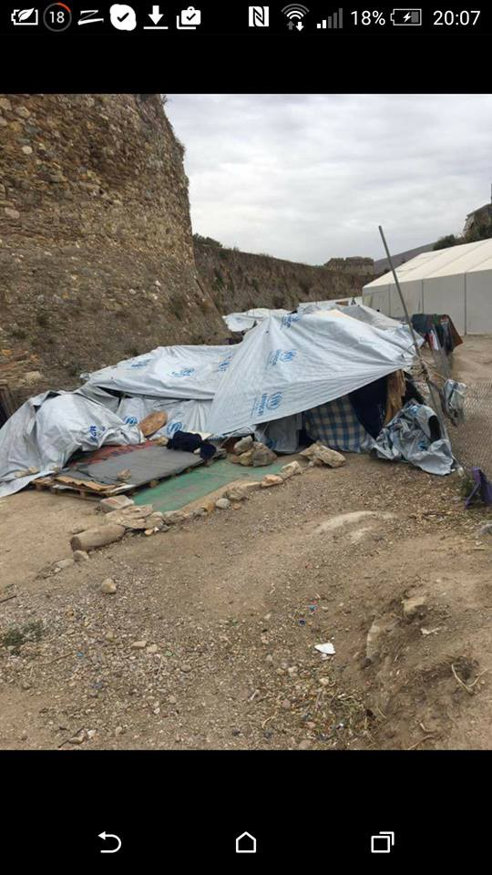

Place where Ahmad lives today, in Europe\.

I am in love with merchandise, clothes, colors and materials\. I feel relaxed when I mix and match clothes and colors\. In this kind of art, I have found myself\. My goal is to be a fashion designer\. Also, I write poetry\. When I’m upset I write to feel relaxed\. I feel more relaxed when I see others reading and listening to what I write\. I like to write about the struggles of the people who can’t describe their pain\.

I try to feel the pain on behalf of others\.”

> **To whom it may concern** 

> I demand my humanity
 

> Seven months of being a refugee, trust me, I’ve often asked
 

> How should humans feel about other humans?
 

> I requested help, but I didn’t find an ear to listen,
 

> the only answer I found came from myself
 

> How should humans feel?
 

> Like humans
 

> You didn’t just steal my rights
 

> my time
 

> my feelings
 

> but more importantly, my humanity, too
 

> I blame all of you for the loss of the last seven months;
 

> gone from my life like rubbish
 

> Floating around a prison camp, intermingled with despair
 

> You have taught me how rights can be stolen,
 

> You have taught me how we can change the facts,
 

> You have taught me how people can be harsh to people
 

> But really all I’ve learnt is a world of lost humanity\.
 

> Stop, enough is enough\.
 

> Yes, maybe you saved my life from death
 

> Or was it a boat and a smuggler your news\-screens condemn all day
 

> The price: all the feelings I was born to have
 

> You made me a monster
 

> That’s why I blame you
 

> After all this, all I am asking for is
 

> my humanity back
 

> I ran away from war and death
 

> To find peace, a safe place, protection, to regain my identity
 

> But I am still searching
 

> To keep looking or move on?
 

> I don’t know anymore, what is going on?
 

> If I’m still alive
 

> or if I’m really, truly dead inside?
 

> My plea to you:
 

> Please keep looking for the humanity in your life and discover whether it is a truth
 

> or a lie?
 

> Make sure to know what the real meaning is
 

> Is it actions or just words?
 

> I’m wondering how we blame animals in the woods
 

> Living by a law criticized and named
 

> ‘Survival of the fittest’
 

> But this is humans, too, not just confined to the woods\.
 

> Or maybe it is instead ‘Survival of the richest\.’
 

> Oh what I am doing?
 

> I almost forgot: no\-one is listening
 

> No ears keen to know what I’m talking about
 

> But my own hearing is deafened
 

> ‘Make a line, make a line, everybody get in line’
 

> ‘We brought you a scarf today’
 

> Maybe you like to give,
 

> but I don’t like to take
 

> Hurt when you take without giving
 

> It hurts when you need but you can’t give yourself
 

> Hurts when someone’s hands are above yours and yours are tied
 

> Really, I want nothing from you, apart from myself, my humanity and maybe your solidarity\.
 

> To whom it may concern,
 

> but my concern is no\-one is concerned\. 

### This is reality
#### Fawaz Alfawaz, now in Greece

Age: 33

Marital status: Married with three children and a fourth on the way

Religion: peace, love, tolerance

From: Syria

A former detainee in Tadmur Prison in 2004, for a period of 9 months and 17 days

Detained in a military security branch in Suweida for 11 days in 2014\.

“I’m trying and trying hard to change the world’s view of refugees\. My dream is to change the world, and someday I will be able to say, “I did it\.”

> **Barking dogs** 

> I apologize for having to write this description, but this is a reality\.
 

> Throughout our daily lives, we see several homeless dogs along the edge of the road
 

> Filled with dirty wounds, slender, weak and unable to stand
 

> Homeless and without food, with no one to defend or protect them
 

> No one to hear or care for them, some think they’re barking, but the truth is
 

> They’re complaining and hurting and asking for help\.
 

> Security & Safety
 

> This is me and this is our situation
 

> Who we are?
 

> We’re just stuck in Greece
 

> Just numbers or wood or fuel wars
 

> Just cheap products or obsolete commodities
 

> who are we
 

> An anguished cry and shout
 

> Even the highest sound does not receive an answer, only an echo
 

> Is it rational or are we these displaced dogs
 

> Yeah
 

> Hidden from reality and the whole world does not care\.
 

> An image of hope and a smile on the cover hides the pain and the real picture\.
 

> We are these dogs, displaced from our homeland with no security and no safety
 

> And no one to heal our wounds
 

> Watch the whole world stand idly, silent, in front of a child or
 

> So to say, a small puppy
 

> Jumped border fences and barbed wire
 

> And rode sea waves in a boat where only 1% survive 

> Aren’t the channels BBC and Franc 24, and all those who claim humanity, suppose to see what is happening to us ?
 

> We are not killers and saboteurs and terrorists, we are treated as human beings
 

> We know what happened to us
 

> And what happens to us
 

> And why I came to you
 

> But know that we will tell our children, as will God and Jesus Christ
 

> In the end I can only say that there are unidentified soldiers
 

> Thanks to them, we are still alive
 

> I remember the story of that man
 

> Who lived for years, despite being sentenced to death
 

> Thanks to the milk from the breast of his daughter\.
 

> Unknown Soldiers
 

> They take care of these dogs and are the source of our strength
 

> They offer the best in spite of everything
 

> Thanks to everyone who heard the barking, like the medical surgeon who put his hand on my head
 

> Thank you, unknown soldiers
 

> These words are dedicated to the unknown soldiers\. 

> \(E\. S\. G\. M\. G\. \) 

09/11/2016

More of his poems, translated into several languages, can be found on [Fawaz’s facebook page](https://www.facebook.com/fawazalfawaz1984/?fref=ts) \.

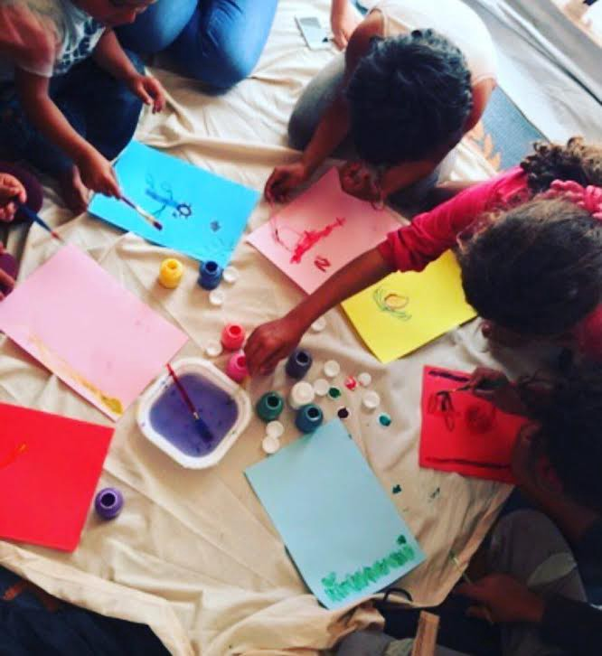

Nea Kavala, Art Withouth Borders\.
### Kayra Martinez — Nea Kavala — Art without borders

Kayra, an independent volunteer in Nea Kavala, started running art workshops \(Art without borders\) half a year ago\. Here is her story:

“As an American working in Germany, now living part time near the camp in Nea Kavala, I have been volunteering full time all over Europe to aid and support the refugees that have been displaced\. I want to be a part of supporting the talents that these amazing people have as well as giving them an outlet to earn money for basic items\. I supply all the materials and give them 100% of the earnings\. Our goal is to send these art pieces around the world creating awareness, sharing their stories and in the future to create a traveling art exhibition with the beautiful pieces they have so graciously created\. From 5 year\-old children to adults, we have seen some amazing talent and the children/young adults have had a cathartic experience to share their journey and emotions\.

It’s a win\-win project with no overhead costs and no political background, just pure humanitarian spirit\.

We’ve just received 4,000 postcards of four motifs from our art and when I asked the children what they would do with the money, they said they wanted to help other children\.

This is my motivation\!”

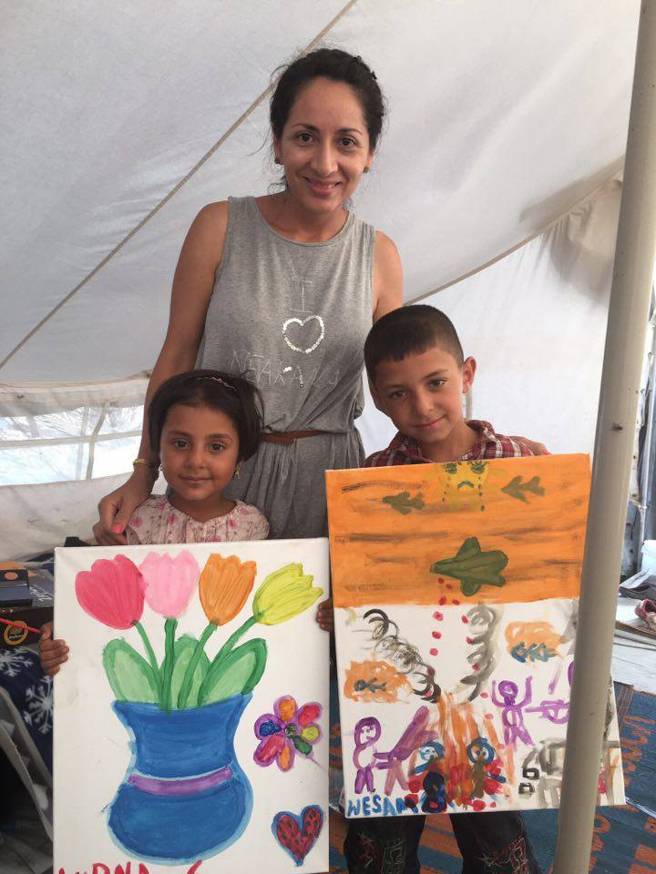

Kayra Matinez

> If you want to support this work, please join one of these facebook groups where you can buy some of the lovely pieces of art: [Love Without Borders\-For Refugees](https://www.gofundme.com/3f3h4qqw) , [Nea Kavala — Art Without Borders](https://www.facebook.com/groups/307016992976229/) , and [Designs Without Borders\- For Refugees In Need](https://www.facebook.com/groups/981189408660375/) \. 

Kayra’s workshops have many talented artists, but this time we are presenting just two: Youssef and Ahmad\.

**Yuossef, from Syria, now living at Nea Kavala, Greece**

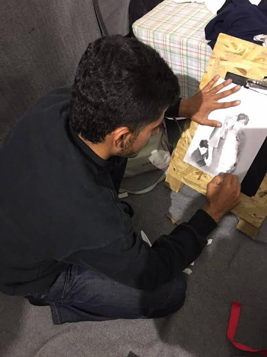

Youssef is a Syrian refugee living in the Nea Kavala camp in Greece\. When war first broke out, his family fled to Turkey and eventually Greece where he now awaits reunification with his father in Germany\. This is his story:

“I am Youssef Abu Kashef, born in 1996\. A Syrian refugee in Greece, at Nea Kavala camp\. I started primary school in 2002 but did not continue\. I wasn’t allowed to continue my studies since I had a severe hearing disorder\. In order to fill my free time, I began drawing and it became a hobby\. After some time we had to leave Syria, but despite all the obstacles and the deprivation I kept drawing\. My dream and ambition is to become an artist\. As I did not attend any art school before, my wish is to get into art school and attend classes to improve my talent\.”

[_If you can support Yuossef’s family, currently living in a tent at Nea Kavala, please donate\._](https://www.humanwire.org/cause/fatima-and-family/)

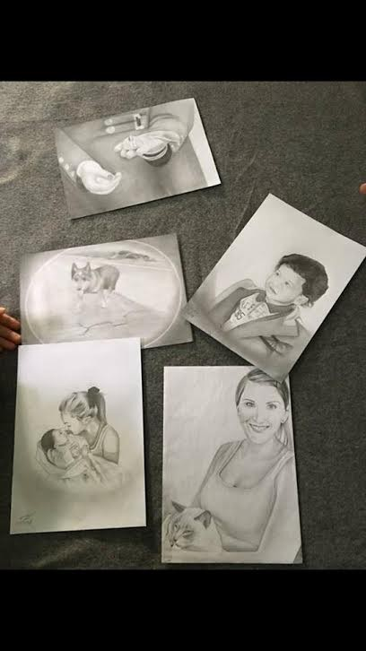

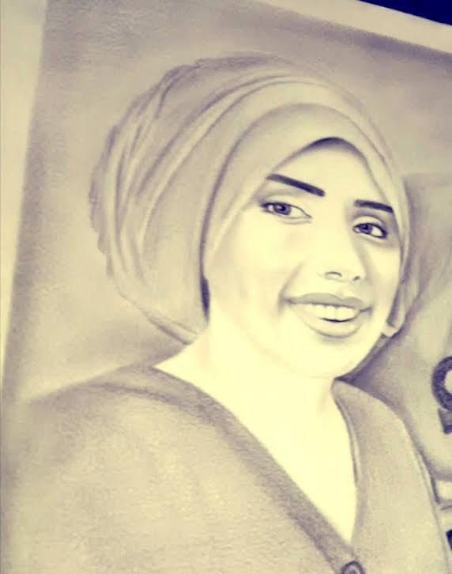

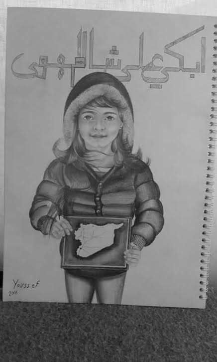

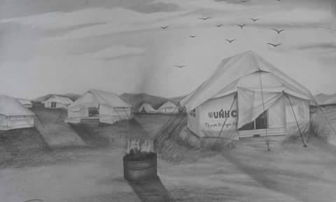

**Ahmad Ismael, from Palestine, now living at Nea Kavala, Greece**

“My name is Ahmad Ismael\. I was born in Palestine on June 1, 1992\. I studied political science at the University of Beirut in Lebanon\. I think that everybody is born with a spark of artistic talent and it is gift from God\.

Ever since I was student in primary school, art was a very big part of my life and the majority of my days were spent creating paintings\. I displayed my drawings in many local galleries\.

In our community and the countryside in particular, there was no opportunity to improve our hobbies because working to provide basic needs takes up a big part of our lives\.

At this point in my life, painting represents a window to release the stress of our daily life in a refugee camp in Greece\. Almost everything was taken from the children and the people here, like their hobbies and talents\. Even the children, who love school, lost their faith in the future\. This message goes out to the people who can save the children in the world who are victims of war\.”

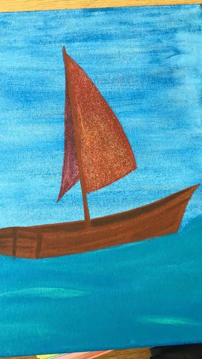

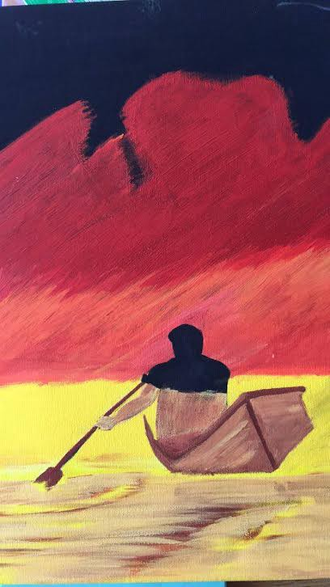

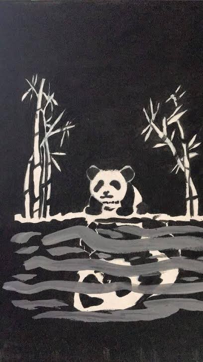

Finally, we remind you about Abdulazez Dukhan, an 18 year\-old Syrian photographer, living in Thessaloniki and creating wonderful art\. 
[We published a story about Abdulazez recently\.](https://medium.com/@AreYouSyrious/ays-special-my-name-is-refugee-and-i-am-artist-5ed2cbbcaf28#.cs7cvcw57)

A

\(Aditional reporting Lara Osman Grganja\)

_Converted [Medium Post](https://medium.com/are-you-syrious/ays-special-artists-trapped-in-greek-refugee-camps-1c4ac836915d) by [ZMediumToMarkdown](https://github.com/ZhgChgLi/ZMediumToMarkdown)._
