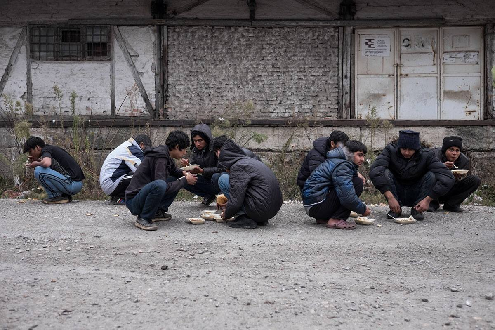

### AYS News 29/11: When border becomes the condition of living

> What does it mean to build a wall at the international border; what consequences does it have and how we can bring it down, how we brought it down with our volunteer work\. Austria\-Croatia Dublin returns temporarily suspended, what to do now, act fast\! Syria is still being bombed\. Hungary was declared unsafe for refugees\. Scabies and body lice declared a national epidemic in Serbia\. 

#### Greece

There are numerous walls being built at international borders around the world at this very moment: Argentina is building a wall with Paraguay, China is building a border fence with Korea, India is building walls with Burma and Bangladesh, Iran with Pakistan, Ukraine with Russia, while some other walls still remain at the phase of proposal: Belize\-Guatemala, Costa Rica\-Nicuragua, Estonia\-Russia, Malaysia\-Thailand, Pakistan\-Afghanistan\.

World’s many walls differ in three things: physicallity, purpose, and what or whom they aim at deterring\. For example, South African apartheid wall acted as a complex internal maze of walls and checkpoints, while the South African current wall on its border with Zimbabwe is an electrified fence\. Saudi Arabian wall on its border with Yemen stands as a huge concrete wall, while some other borders represent walls within walls, such as Israeli settlements\. The purposes of these wals are many\. The Chinese wall with North Korea was built to deter refugees, the U\.S\. wall with Mexico to stop drug smuggling; Israeli wall is used to settle land disputes, while Indian wall with Pakistan to suppress Islamic guerrilla fighters\. Thusly, these walls deter different types of people and things: refugees, immigrants, poor people, workers, human trafficking, drugs, weapons, smuggled taxable goods, religious mixing, terror\.

Be that as it may, world’s many different walls share some of the same traits, which we are noticing in the recent European walls as well\. The legitimation for building the walls comes as a discourse about a danger in the form of the poor of the global south or religious aggression on Western values\. Moreover, different walls refer to one another for justification and legitimacy, they are of incresingly complex technology, privatized and subcontracted\.

Withal, walls exercise a particular type of violence upon people’s livelihoods, opportunities and lives\. In the past years of the European refugee crisis, we have spent every single day worrying over the ways in which borders are destroying the aforementioned triad of our refugee friends and today, once again, we find ourselves terrified for the weather conditions are getting worse, numbers of people stuck in front of the walls are getting greater, and no resolution is nearing our sights\.

It has been excessively windy and rainy in eastern Greece today\. These are homes in which people lived through the today’s eastern Greece winds and rain:

](assets/f8d93bc92c9f/0*3l9bJo3dRyL18FQt.)

Credits: [**Leslie Meral Schick**](https://www.facebook.com/leslie.schick)

The rain destroyed many tent\-homes to refugees in Samos, leaving them without even that thin roof of fabric they had above their heads\. This is Samos today, after it has rained for two days continuously:

](assets/f8d93bc92c9f/0*dE2HRsUEjwqMuMd2.)

Credits: [**Mohammed Abdullah**](https://www.facebook.com/profile.php?id=100013475689112)

](assets/f8d93bc92c9f/0*gJW0Vqj4rwe_-YU2.)

Credits: [**Mohammed Abdullah**](https://www.facebook.com/profile.php?id=100013475689112)

](assets/f8d93bc92c9f/0*1wETuGG2Z6uXeHAk.)

Credits: [**Mohammed Abdullah**](https://www.facebook.com/profile.php?id=100013475689112)

](assets/f8d93bc92c9f/0*XHTiuPepdZmTpZQe.)

Credits: [**Mohammed Abdullah**](https://www.facebook.com/profile.php?id=100013475689112)

Yet the wall in Samos still stands strong and mercilessly…

](assets/f8d93bc92c9f/0*TkcEbv4rsG0xfPQv.)

Credits: [**Mohammed Abdullah**](https://www.facebook.com/profile.php?id=100013475689112)

One volunteer in Greece writes:

> It is freezing and snowing in Greece\. I am wearing everything I own and I am still freezing\. Last night I covered myself with all the blankets I own, including an electric blanket, and was still freezing\. People, including pregnant women and babies are sleeping outside on floors in tents\. Many have no access to hot water\. This is the second winter people have been here; waiting, waiting, and waiting due to long legal processed and no humanity in Europe, after having fled the bombs in which we are all complicit\. As they freeze, people hear Aleppo is falling; they hear grim news of closed doors across the Europe\. The EU and every organisation is failing to do anywhere near enough — myself included\. I weep for the people here\. I am no doctor, but I can see people will die if significant help does not come now\. Across Europe and the Middle East thousands are facing the same hardship — this is criminal\. If our generation does not want to go down in history as barbaric, we all need to do more now\. Please, push your MPs, donate, volunteer, get in the media\! — [**Trace Myers**](https://www.facebook.com/trace.myers.75?fref=nf) 

The following situation in Thessaloniki might be similar to what the mentioned volunteer was seeing\.

](assets/f8d93bc92c9f/0*07wmasxhO4V94b51.)

Credits: [**Amir Karimi**](https://www.facebook.com/amir.spn)

](assets/f8d93bc92c9f/0*2mGAg-biOX-MDxsU.)

Credits: [**Amir Karimi**](https://www.facebook.com/amir.spn)

](assets/f8d93bc92c9f/0*8HDRzWlPNE0zU93J.)

Credits: [**Amir Karimi**](https://www.facebook.com/amir.spn)

](assets/f8d93bc92c9f/0*6gCR8hw4LoSAvveH.)

Credits: [**Amir Karimi**](https://www.facebook.com/amir.spn)

](assets/f8d93bc92c9f/0*tu4C5l97GHFg5tgs.)

Credits: [**Amir Karimi**](https://www.facebook.com/amir.spn)

](assets/f8d93bc92c9f/0*zEJ-tHUyBsjlEfu2.)

Credits: [**Amir Karimi**](https://www.facebook.com/amir.spn)

](assets/f8d93bc92c9f/0*v8hBD1R_a67IzGI2.)

Credits: [**Amir Karimi**](https://www.facebook.com/amir.spn)

](assets/f8d93bc92c9f/0*Pr2v_OW7ae94vOn-.)

Credits: [**Amir Karimi**](https://www.facebook.com/amir.spn)

](assets/f8d93bc92c9f/0*uHLFqyg0Na2reXC-.)

Credits: [**Amir Karimi**](https://www.facebook.com/amir.spn)

Another volunteer writes:

> I can’t sleep\. 

> Listen to the sound of the rain: Soothing isnt it? Now look at the flashes of lightning and listen roars of the rolling thunder\. Slightly romantic when you are warm in a warm comfortable bed, all snuggled up under a warm duvet\. 

> Now imagine sleeping in a flimsy tent\. With nothing but the ground sheet, and a UNHCR blanket between you and the ground\. With insufficient covers and trying to ensure that your children aren’t too frightened, cold or wet\. They are already coughing quite badly and you hope their coughs dont get worse\. 

> They will\. Because its 5 degrees, raining and strong winds\. Because your shelter provided by the European authorities is leaking and your belongings are being soaked\. You’ll need to worry that your tent doesnt get struck by lightning or blown away\. 

> Welcome to Europe 2016, a continent that prides itself as the shining beacon of hope for human rights\. — [**Gabrielle Tan**](https://www.facebook.com/gabrielle.tan?fref=nf) 

Indeed, winter is here\. Since last night the weather conditions are very difficult\. Rainstorms, strong winds, very cold\. It doesn’t seem as if there will be an increase in border\-crossings, but as the days pass and December is almost here, we need to be as ready as we can because all the predictions said for an increase of boats arrivals\. We can’t forget how the crossing during winter time is\. \.how hypothermia is the biggest enemy after the waves\. \. And refugees on the firm soil won’t have it any less difficult\.

Refugees in Serbia have been experiencing the same\. The photographer found refugees eating lunch near the abandoned depot that serves as a shelter\. Others are trying to sleep on the cold sreets of Belgrade\.

](assets/f8d93bc92c9f/0*1mvIEz_QpsauYDYD.jpg)

Credits: [**Art Against**](https://www.facebook.com/artagainstproject/)

](assets/f8d93bc92c9f/0*l8FEb7COF1516gBG.jpg)

Credits: [**Art Against**](https://www.facebook.com/artagainstproject/)

](assets/f8d93bc92c9f/0*CGt9grnjFtRPKymc.jpg)

Credits: [**Art Against**](https://www.facebook.com/artagainstproject/)

](assets/f8d93bc92c9f/0*ULXQIWb8r9jSYOva.jpg)

Credits: [**Art Against**](https://www.facebook.com/artagainstproject/)

At the Torbali Refugee Camp in Izmir, Turkey, volunteers witness to barefoot children in sub\-zero temperatures, as seen in the video bellow

[Torbali Izmir Refugee Camp - January 26, 2016](http://www.youtube.com/watch?v=f5X1VImK4Gs)

And now we ask, what is this all for? From what everything our work has shown us, walls do not work — they do not accomplish the interdiction fueling and legitimating them\. None of the walls actually stop or even significantly reduce conflicts or traffic\. On the contrary, many increase enmity and give rise to new forms of aggression, merely rerouting the flows and, thus, increasing the general level and geographical reach of violence and criminality at the border byincluding previously peaceful and remote regions\. Indeed, aren’t the smuggling operations growing ever more sophisticated in response to barriers? Walls, when looked this way, are a pure form of brutishness and racism\.

How do we respond?

Maybe like [**Refugee Support Greece**](https://www.facebook.com/RefugeeSupportGreece/) team has today\! This morning it was 2°C in Alexandreia, even briefly snowing\. It was imperative to act quickly\. The volunteers were in the warehouse by 8am today getting ready for distribution and a delivery of 1,500 blankets, which they received from [Help Refugees](https://www.facebook.com/HelpRefugeesUK/) \. By 1pm, Refugee Support Greece delivered 3 blankets to every resident to their unheated containers\. Fantastic work by a great team\!

](assets/f8d93bc92c9f/0*szxF9dxDdnMGgcSe.)

Credits: [**Refugee Support Greece**](https://www.facebook.com/RefugeeSupportGreece/)

](assets/f8d93bc92c9f/0*YO7h-E5q8yjQYSbN.)

Credits: [**Refugee Support Greece**](https://www.facebook.com/RefugeeSupportGreece/)

](assets/f8d93bc92c9f/0*PU-p4hMBBaWed2yY.)

Credits: [**Refugee Support Greece**](https://www.facebook.com/RefugeeSupportGreece/)

](assets/f8d93bc92c9f/0*WEnTqGzOOWhODaLM.)

Credits: [**Refugee Support Greece**](https://www.facebook.com/RefugeeSupportGreece/)

](assets/f8d93bc92c9f/0*XiXdAqGtaG-y_g3q.)

Credits: [**Refugee Support Greece**](https://www.facebook.com/RefugeeSupportGreece/)

](assets/f8d93bc92c9f/0*_ykeG0trQN2XRQSR.)

Credits: [**Refugee Support Greece**](https://www.facebook.com/RefugeeSupportGreece/)

Or as a warehouse in Thessaloniki which, to better serve 32 local camps, built new storage unites for winter clothes\!

The infrastructure teams from [ERCI — Emergency Response Centre International](https://www.facebook.com/ercintl/) and [Together for Better Days](https://www.facebook.com/betterdays.ngo/) who work at [\#ElpidaHome](https://www.facebook.com/hashtag/elpidahome?source=feed_text&story_id=550852748447814) yesterday constructed clothes storage units at [Help Refugees](https://www.facebook.com/HelpRefugeesUK/) ’s warehouse in Thessaloniki\.

All donated clothes have to be processed and organized by type, size and quality\. With NGOs often making use of the same spaces to serve 32 local camps, warehouse infrastructure and operating systems become essential to ensuring refugees receive the clothes they need\.

These new storage unit are designed to facilitate primary, on sight sorting\. This will allow the relevant organizations to accesses clothes they need much more efficiently\.

ERCI as an organization relies heavily on the proper functioning of warehouses and supply systems\. If you have experience in construction, electrics, plumbing, carpentry, etc and wish to volunteer with their infrastructure team please visit: [www\.ercintl\.org/volunteer/](http://www.ercintl.org/volunteer/) , if you wish to donate please visit: [www\.ercintl\.org/donate/](http://l.facebook.com/l.php?u=http%3A%2F%2Fwww.ercintl.org%2Fdonate%2F&h=mAQEH84f1AQEHpTUU1tgvb-JiHtGhGBTM8US9Xoyuk2JQIw&enc=AZOE36u0yGOSXBbWpFnX80ug3hJthj8_OA3S8uru3qbZDTXkPz-QF0gmhlhpMinAyyLGutafXMtVui61KIM_aAzZR77QWdXiefZPwODxQlgVzGkavq_S_V_FxJl-SOm34EhZ21pD6iumSYnpxBltAkpQhgAC9t9NM2q8ULpXu4ap-loUYf0Vt5QxmTn0qz9Kr8VvKo1YutRPeoYc5DXOYCmG&s=1) \.

](assets/f8d93bc92c9f/0*sIuUMLYJj8sf2Vk5.)

Credits: [**ERCI — Emergency Response Centre International**](https://www.facebook.com/ercintl/)

](assets/f8d93bc92c9f/0*tLbewxIgV7FZfQ1h.)

Credits: [**ERCI — Emergency Response Centre International**](https://www.facebook.com/ercintl/)

Or as locals who protested against poor conditions at the Thessaloniki reception centre\. A protest was organized at the Ministry of Macedonia and Thrace in Thessaloniki Tuesday\. Representatives of the nearby municipality of Thermi and local residents are insisting that conditions at the refugee reception facility in the area of Vasilika be improved immediately as winter is looming and temperatures are dropping\. Protesters are also calling for an on\-site school to be set up for migrant children and the faster processing of asylum applications and relocations\.

Another group of heroes consists of ‘Get Sh\*t Done’ Team which is producing raised wooden flooring in the Help Refugees Greece warehouse to protect occupants from cold and flooding\. It’s a small but extremely important step to improve living conditions\. And this is no minor operation\. In the last month, they’ve produced over 3,000m2 of new flooring\. Their work is ensuring that Greece’s often\-harsh winter is more comfortable and survivable for thousands of people\.

](assets/f8d93bc92c9f/0*EA6UuuuB5vlt6hwt.jpg)

Credits: [**Help Refugees**](https://www.facebook.com/HelpRefugeesUK/)

If you want to help fund winterization projects, or life improvement projects for people in the camps, here are some suggestions of places to donate:
- [https://web\.facebook\.com/The\-Get\-Shit\-Done\-Team\-304001796…/…](https://web.facebook.com/The-Get-Shit-Done-Team-304001796641127/?fref=ts) 
paypal: thegetshitdoneteam@gmail\.com
- [https://www\.gofundme\.com/weareherecentre](https://www.facebook.com/l.php?u=https%3A%2F%2Fwww.gofundme.com%2Fweareherecentre&h=PAQF6S7_qAQGVULRNBYz4ldTN32dzw3sPA27aeQ39FuFWlw&enc=AZPh6oRcfNkH_QcxStfDjhBnEcpE0Yj2OATkj-Qc4cVM-9TRcVaGOKJMglbKnJ3EKdM8MWfDMUX6fAcmm4hwfafTk9NzzPEGPG9KmK9g9mIja5lLAz8kuocGzkm_k-B_aQP7hslHYgTRnoQfSS9KgDj5vFfBZEghPOZcvtiFurAP-VMGBtLUczlvXKTiJL2SiIbc8JhDr9J6DaJZ4SqsGXNY&s=1) 
A team offering vital support in Nea Kavala \(their facilities just burned down\)
- [https://mydonate\.bt\.com/donation/start\.html?charity=127188](https://mydonate.bt.com/donation/start.html?charity=127188) 
Help Refugees: Funding significant work with refugees right across Europe
- [http://www\.leetchi\.com/c/nonprofit\-charity\-club\-mojca](http://www.leetchi.com/c/nonprofit-charity-club-mojca) 
Soulfood Project — getting hot good food to people living on the streets \(Greek and refugees\)
- [https://www\.paypal\.com/gr/cgi\-bin/webscr…](https://www.paypal.com/gr/cgi-bin/webscr?cmd=_flow&SESSION=N9z0i-yhSOCtNPdYsH7gFL_h-tQpWcLoo5m1tW8PNaoF6OkfHtqnM2eeQ24&dispatch=5885d80a13c0db1f8e263663d3faee8d333dc9aadeed3fe0b5b299d55fd35542) 
Intervolve — distributing much needed aid to people across camps in Thessaloniki and addressing the needs of families in difficult circumstances
- [http://filoxenia\-intl\.org/get\-involved/donate/](http://filoxenia-intl.org/get-involved/donate/) 
Filoxenia — Providing alternative housing to some of the most vulnerable people
- If you can send XS\-S men’s jumpers, jackets, trousers, underwear and wintershoes size 40–43, please contact the [Epigrafes Nea Magnisia](https://www.facebook.com/epigrafes.neamagnisia) warehouse
- Nea Kavala Community Center “We are here”, which was burned down yesterday, have set up a gofundme\-page to raise money for reconstruction: [https://www\.gofundme\.com/weareherecentre](https://l.facebook.com/l.php?u=https%3A%2F%2Fwww.gofundme.com%2Fweareherecentre&h=eAQHUygFA)

Bring down the walls\!
### Who is to blame for fires in refugee camps?

Definitely unsafe conditions as laid out by states and other political actors — so too think organizations in Moria\. After the camp fire in Moria, 23 humanitarian organizations signed a letter requesting from greek authorities more safety better living conditions in the camps, thus calling them out on their irresponsibility towards refugees\.
### Greece Returns 17 refugees to Turkey Under EU\-Turkey Deal

Greek authorities on Tuesday sent 17 irregular migrants back to Turkey from the Aegean island of Lesvos, in accordance with the [EU\-Turkey agreement](http://greece.greekreporter.com/tag/eu-turkey-agreement/) \. The group included two Pakistanis, three Iraqis, seven Algerians, one Afghan, one Ghanian, one Malian, one Moroccan and one Nigerian, all of them men\.

Of the group, five were returned after their asylum applications were turned down at appeal, two had withdrawn their applications for asylum and 10 had never filed an application for asylum\. They were transferred to the Turkish coast under the supervision of the EU border agency Frontex and, on arrival, were taken to a migrant camp\.
### Refugee children re\-enter education program

Refugee children in Doliana have started going to school again\!

](assets/f8d93bc92c9f/0*76F6TiO4UnnM9_YX.jpg)

Credits: [IOM Greece](https://twitter.com/IOMGREECE)

](assets/f8d93bc92c9f/0*z_w9vNy1BonGoIJ3.jpg)

Credits: [IOM Greece](https://twitter.com/IOMGREECE)
### Arrivals
- Lesvos \+256
- Chios: \+233
- Samos \-185
- Leros \+69
- Kos \+17
- All islands: \+445

### Over 5300 voluntary returns from Greece this year

More than 5,300 foreign citizens voluntary returned from Greece to their countries of origin from January 1 to November 7 this year, according to the [latest figures](https://greece.iom.int/el/news/%CE%B4%CE%BF%CE%BC-5328-%CF%85%CF%80%CE%AE%CE%BA%CE%BF%CE%BF%CE%B9-%CF%84%CF%81%CE%AF%CF%84%CF%89%CE%BD-%CF%87%CF%89%CF%81%CF%8E%CE%BD-%CE%B5%CF%80%CE%AD%CF%83%CF%84%CF%81%CE%B5%CF%88%CE%B1%CE%BD-%CE%B5%CE%B8%CE%B5%CE%BB%CE%BF%CE%BD%CF%84%CE%B9%CE%BA%CE%AC-%CF%83%CF%84%CE%B7-%CF%87%CF%8E%CF%81%CE%B1-%CE%BA%CE%B1%CF%84%CE%B1%CE%B3%CF%89%CE%B3%CE%AE%CF%82-%CF%84%CE%BF%CF%85%CF%82-%CE%BC%CE%B5-%CE%B1%CF%83%CF%86%CE%AC%CE%BB%CE%B5%CE%B9%CE%B1-%CE%BA%CE%B1%CE%B9) from the Greek office of the International Organization for Migration \(IOM\) \.

For the month of October alone, IOM assisted with the safe return of 488 third\-country nationals to their home countries\.

In total, in 2016, 5,328 third country nationals have left Greece, with 1,193 returned to Afghanistan, 1,040 to Morocco, 934 to Iraq, 577 to Iran, and 472 to Pakistan\.

The repatriations included assistance with reintegration into home countries\.

For more information about the Assisted Voluntary Return and Reintegration Program \(AVRR\) click [here](https://newsthatmoves.org/en/assisted-voluntary-return-from-greece/) \.
#### Syria
### How to slow the refugee crisis in Europe? Stop bombs in Syria

](assets/f8d93bc92c9f/0*Uw3ZhqZSBCVqJrnJ.)

Credits: [**DOAM — Documenting Oppression Against Muslims**](https://www.facebook.com/doamuslims/)

Many families in besieged Aleppo are leaving their homes due the severe shelling by the Assad’s regime and Russia\.

25\+ more killed today in Aleppo when a regime jet launched an attack on displaced civilians fleeing by foot in Bab al\-Neyrab\.

](assets/f8d93bc92c9f/0*lAQb1VDtPfh04ktn.jpg)

Credits: [**DOAM — Documenting Oppression Against Muslims**](https://www.facebook.com/doamuslims/)

](assets/f8d93bc92c9f/0*Q3o4nWdBKfKwm6Fc.jpg)

Credits: [**DOAM — Documenting Oppression Against Muslims**](https://www.facebook.com/doamuslims/)

](assets/f8d93bc92c9f/0*liSfOncpfTPra4cy.jpg)

Credits: [**DOAM — Documenting Oppression Against Muslims**](https://www.facebook.com/doamuslims/)

](assets/f8d93bc92c9f/0*vrAuKGNQmDZ5FPA7.jpg)

Credits: [**DOAM — Documenting Oppression Against Muslims**](https://www.facebook.com/doamuslims/)
### Aid distribution in rural Aleppo

Syria Relief team distributed parcels containing oil, rice, lentils, tomato sauce, and other food items to 437 displaced families in rural Aleppo\.

](assets/f8d93bc92c9f/0*olDYs5VTjG5oVFDX.)

Credits: [**Syria Relief Operations**](https://www.facebook.com/Syria-Relief-Operations-415315011989817/)

](assets/f8d93bc92c9f/0*1zrW4teOzz5UMy0t.)

Credits: [**Syria Relief Operations**](https://www.facebook.com/Syria-Relief-Operations-415315011989817/)
#### Bulgaria
### A 15 year old severely injured in recent riots in Harmanli

The 15 year old afghan boy is in critical condition, while Bulgaria still claims there was no police violence involved in Harmanli riots\.

Last week, around 400 migrants were [detained](https://newsthatmoves.org/en/over-400-detained-in-bulgaria-after-riots/) after the riots in Harmanli\. Several police officers and migrants were injured, including one in induced coma for head injuries\.

Of these, 18 are charged with hooliganism, and one for desecrating the Bulgarian national flag, the state prosecutor’s spokesperson Rumyana Arnaudova told [Bulgarian National Radio](http://bnr.bg/post/100765525) \.

The local newspaper, 24 Chasa, [reported](https://www.24chasa.bg/novini/article/5900398) that approximately 400 migrants currently hosted in Harmanli will be transferred to closed facilities\.

Harmanli center will remain as an open center focusing on families, and will be only for refugees from Syria, Novinite [reported](http://www.novinite.com/articles/177661/Bulgaria+to+Move+Migrants+to+Closed+Camps) \.

Outgoing Bulgarian Prime Minister Boyko Borissov said on Saturday that Bulgaria will begin deporting people involved in the riots, mostly Afghans, next month\.

UNHCR is concerned that a protest at Bulgaria’s largest reception centre for asylum\-seekers has prompted calls for asylum\-seekers to be expelled on national security grounds\.

UNHCR urges the Bulgarian government to decongest the Harmanli reception centre, improve living conditions and strengthen management of the centre\. Most of all, UNHCR urges the government to establish a constructive dialogue with asylum\-seekers staying in the centre\. UNHCR will continue to support the efforts of the authorities to improve conditions and to work with the refugees and local communities to diffuse any tensions\.
#### Serbia
### Miksalište numbers
- Men 33
- Women 31
- Children and unaccompanied minors 293
- Total: 357

### Scabies and body lice declared a national epidemic in Serbia

Over 30% of the population of refugees living in the warehouses have scabies, more have body lice\. In order to get rid of them, they must have access to medicine and a shower while in Belgrade, for example, there are only 4 showers for over 1000\+ people and can be used by referal only\.

[**Refugee’s Anthem**](https://www.facebook.com/refugeesanthem/?fref=nf) has colaborated with MSF to help eradicate scabies and body lice\. They sprayed over 700\+ blankets and sleeping areas with permaclean, helping to prevent the spread\.
#### Hungary
### A state court in Germany has ruled that an asylum\-seeker cannot be returned to Hungary, citing “systematic deficiencies” in the asylum procedures there

But in the Lueneburg state court ruling announced Tuesday, judges upheld a lower court’s decision that the man couldn’t be sent to Hungary, where human rights officials have said many asylum\-seekers are put in detention and don’t have their applications examined on merits\. The court said it was considerably likely the man would face “inhumane or degrading treatment” in Hungary\.

Meanwhile, aHungarian lawmaker says the government will spend up to 100 billion forints \($340 million\) to provide equipment and basic supplies for 3,000 “border hunters” being recruited to guard border fences built last year to stop the flow of migrants trying to enter the country\. Lajos Kosa, head of the governing Fidesz party’s parliamentary group, says the expenditures will be exempt from having to comply with public procurement rules\.
#### Croatia
### Dublin Austria\-Croatia push\-back \(temporarily\) rulled unlawful

In its ruling of 16\.11\.2016 Ra 2016/18/0172 to 0177, the Higher Administrative Court ruled that it must now be decided: „how the entry and transit \[…\] through the Republic of Croatia was carried out and if there were state\-organised measures involved comparable or identical to the ones which form the basis of the Slowenian request for a preliminary finding\.” And: „If the latter can be affirmed, any decision of Austria’s responsibility concerning an assessment of \[…\] applications for international protection will have to be postponed until the conclusion of the preliminary ruling procedure on C\-490/16“ \(cf Rz 12\) \.

The aforementioned organized measures which the preliminary ruling request is based on are described as follows in the court decision: „Serbian authorities had accompanied \[the appellant\] to a border crossing and had under supervision handed him over to the Croatian state authorities who neither denied him entry nor initiated an investigation concerning an expulsion from Croatian state territory, nor did they verify if he complied with conditions for legal entry into the Republic of Croatia\. Instead, the Croatian authorities organised the transport to the Slovenian border\.“ \(cf Rz 6\) \.
In all procedures currently before Austrian authorities and courts, where the entry into Croatia and the transfer to Slovenia took place in the described manner, such procedures now have to be \(preliminarily\) suspended in the view of the Higher Administrative Court\.

WHAT TO YOU NEED TO DO?
- It is especially important that any appeal has to make reference to the way the person travelled and entered the country\. The BFA \(department responsible for asylum cases\) does not make any inquiries so far, so that their legal decision documents contain very little information about the nature of the transit/entry\. It is therefore important in those cases to add this information to the appeal\. This is especially important in cases handled by the VMÖ where only the minimum of documentation was supplied in the appeal\.
- For any cases currently pending at the Higher Administrative Court this information should be added immediately and an application should be made to grant a suspensive effect, an interim measure according to Union Law or the suspension of the proceedings in addition to the existing application\.
- In cases where proceedings have been closed, a new application should be made\. A new application for international protection cannot be turned down due to a pre\-existing decisions if the first decision was made prior to the publication of the application for a preliminary court ruling \(14\.09\.2016\) \.
- For persons already deported, it is important to take legal steps against this deportation\. Within 6 weeks after detention and deportation this measure can be appealed at the Higher Administrative Court\. Such procedures usually take some months, but if deportations are then found to be unlawful, it is possible that Austria can then become responsible for dealing with the asylum application again\.

What still remains to be done after that is to wait — yet again — for the preliminary ruling\. It will depend on the finding of the European Court of Justice if Croatian cases are to be seen as cases of “illegal” entry into the territory of EU member states or not and this will in turn decide whether Croatia or Austria should be charged with handling these asylum applications\.
#### France
### Summary of a refugee life in Paris

](assets/f8d93bc92c9f/0*ZwWGX5PQmwA59lNv.jpg)

Credits: [**Paris Refugee Ground Support**](https://www.facebook.com/PRGS.team/)

> Last Friday saw the first 70 people processed and released by the Porte De La Chappele “Welcome Centre”\. Having visited the centre we saw that the conditions provided are good\. The centre offers legal advice, medical care, social workers and a few days shelter under a roof, a bed to sleep in and hot food\. An all important break from the bitter city streets\. 

> People queue outside of the centre from about 2\.30am with the hope of getting inside to gain access to these services\. 

> Last week around 200 people were waiting on the road outside the centre at 7am\. As the admittace volunteers got ready to accept people, there was a rush to be the first in line\. The police at the gates responded with batons and tear gas\. 

> New arrivals to Paris are numbering around 100 a day\. The Welcome centre is restricted to accept 40 people a day\. With 60 \+ people not gaining access along with those already on the streets, there are many left outside somewhere in the city\. 

](assets/f8d93bc92c9f/0*tlzJBsl43BjRuOca.)

Credits: [**Paris Refugee Ground Support**](https://www.facebook.com/PRGS.team/)

> These people are living in the streets under consant and tiring harassment by the police\. When a person has found a doorway or a dark corner to sleep in, they are searched for, found and moved\-on\. Over and over again\. All night, most nights\. Whilst being moved\-on all over the city they are increasingly vulnerable to the dangers of the dark city nights\. Not to mention the temperatures dropping below zero\. 

> The need now is a constant supply of aid from funders and doners\. This is because it is becoming increasingly visibly that new arrivals to France from across Europe are still crossing borders and ending upon in Paris\. The people who have chosen to leave the CAOs that they were taken to after the closure of the Calais jungle, they are still arriving\. People tired and scared of being chased around the city streets of Calais are finding their way to Paris\. And people who have been arrested and detained for sleeping/walking/sitting/standing in the streets are at various points released and also find themselves in Paris\. 

> It was declared in the media that the evacuation a few weeks ago was a “success\!” 

> We have seen differently\. 

> The numbers on the street have inevitably risen to the point where a new street camp has emerged and is obviously and rapidly growing\. 

> We need aid\. 
 

> We are, in only a few short weeks back to frantically asking for: 
 

> \- Tents, Sleeping bags, roll mats and blankets 
 

> \- Thermal underwear vests and long johns and socks\.
 

> \- Mens small to medium underwear\.
 

> \- Mens small to medium Warm Winter clothes 
 

> \- Winter boots and shoes, sizes 39 to 46 \(especially 42 and 43\)
 

> \- GLOVES, hats and scarves\.
 

> \- Emergency space/heat blankets and sleeping bags\.
 

> \- Hygiene packs\.
 

> \- Cold and flu survival kits\.
 

> \- Hand warmers
 

> \- Mini torches
 

> \- Phones, chargers, powerbanks and sim cards\. And credit \(phone credit for refugees and displaced people\) 

> The unrelenting hostility from the police, the government, the unsupportive far\-right residents, dire living conditions in winter weather and the trappings of a dark inner city culture is taking its toll on these people\. Some fall into an abys 
 

> of sorrow and pain in these dark times\. These people look broken\. 
 

> Others somehow manage to get through every day and night of hardship with humour, kindness and dignity\. It must take a herculean effort\. 
 

> Every night we see how the system in place is failing these people and failing to learn from its mistakes\. It should be a fore gone conclusion by now that the numbers will continue to rise and there will be more street camps as a result\. — [**Paris Refugee Ground Support**](https://www.facebook.com/PRGS.team/) 

### Distribution of clothes from Calais warehouse to locations in the French Alps

The three CAOs are in Annecy, Grenoble and Chambery\. Their standards vary\. But one significant problem that all have in common is that they don’t supply winter clothes\. And the refugees come from hot countries in just the clothes they are wearing\. As anyone who has been to the alps in winter knows, you don’t go outside without proper gear\.

[Paul De Ville Forte](https://www.facebook.com/pauldvf) took winter coats, walking boots, jumpers and jogging bottoms and kits made up with thermals, underwear, hats and scarves from Care4Calais warehouse and has brought them to refugees in Alpes\!
#### Mediterranean
### 1,400 lives saved

**Rescuers saved some 1,400 migrants off the coast of Libya on Monday as Italy announced a record number of people arriving this year after crossing the Mediterranean\.**

Italian, Irish and charity group ships, along with commercial vessels, helped rescue the migrants from 11 inflatable dinghies and two small boats\.

Authorities in Italy said Monday they had recorded a record number of arrivals by sea this year, with one month still to go in 2016\.

Over 171,000 migrants have arrived, which beats the previous annual record of 170,100 from 2014\. The tally does not include Monday’s rescues\.
#### Italy
### Italian police to employ foreign youth as police interns

Youngsters from Arabic countries, China or Latin countries are proposed to become interns pairing up with the local police \(currently, 150 militaries have been called to petrol the streets in the suburbs and in sensitive areas\) \. Therefore, the new unit of task force would be composed of mixed militaries, urban police and an intern, to be deployed in boroughs such as via Padova, San Siro, via Imbonati\.

This intern is intended to support the control and mediate with foreign communities in sensitive realities around Milan\. The ideal profile of this intern is a university student speaking two languages, reason why the local government has already contacted universities Cattolica, Bocconi and Bicocca, which lead master courses on urban security\. The security assessor Carmela Rozza stated that “the idea is based on “Rotterdam model”:

> By Spring 2017, we would like to create these small units composed by three urban policemen and an intern, native speaker of Arabic, Chinese or Spanish language\. For example, Arabic and Muslim interns would be deployed with Latin ones in via Padova; Arabic interns in San Siro\. The interns would have an expense reimbursement and would be endowed with identifying uniforms\. They will be also awarded of an added score for the next competitions to enter Milan’s local police\. 

#### General
### LGBT refugees’ services

One of the most vulnerable groups among the refugees is the LGBT community\. In the camps they are often victims of discrimination, harassment or abuse but until now very little has being done to protect them and to provide them support\.

Here is a list of services provided to the LGBT refugees and LGBT friendly places\. If you are aware of other services or LGBT friendly places please COMPLETE this list\.
- SolidarityNow: recently launched a program in order to provide housing in apartments to 50 LGBT asylum seekers\. 
Address: Domokou 2, opposite Larissis train station 
Email: contact@solidaritynow\.orgtact@solidaritynow\.org
Phone: 210 6772500
- Colour Youth: provides legal support to LGBT refugees\. Most importantly, a lawyer from Colour Youth can be present during the asylum interview, which indirectly certifies the refugees gender identity\. 
Phone: 6945583395 
Email: info@colouryouth\.gr
- ΣΥΔ \(Transgender Association\): it also offers legal support mainly to transgender refugees\. A lawyer from ΣΥΔ can be present during the asylum interview\.
Address : Syggrou 29, 1st floor, Athens, 11743
Phone: 6944820441
Email: transgender\.support\.association@gmail\.com
- LGBTQI refugees in Greece: is a self\-organized solidarity team created by Suma Rafi, a transgender refugee herself\. It’s a point of reference for the LGBT refugee community, it financially supports the most vulnerable refugees and regularly organises events where they can socialise in a secure and fun environment\.
The initiative is supported by Notara 26, Femin@tre, LOA and NoBorders
[https://www\.facebook\.com/lgbtqirefugeesingreece/?fref=ts](https://www.facebook.com/lgbtqirefugeesingreece/?fref=ts) 
Email: lgbtqi\.refugees\.gr@gmail\.com

LGBT friendly places:
- AthensCheckpoint: offers free and anonymous HIV, HBV HCV testing\. 
Address Pittaki 4, Athens, 10554 \(Near Monastiraki Metro station\)
Phone: 210 3310400
ThessCheckpoint: Al\. Svolou 15, Thessaloniki
Phone 2310 282284
- Greek Helsinki Monitor: provides legal support to victims of hate crime\. 
Phone: 210 3472259
Email: office@greekhelsinki\.gr
- Greek Council for Refugees: provides legal support and is particularly sensible to LGBT issues\. 
Phone: \+30 210 3800990
Email: gcr1@gcr\.gr
25 Solomou Str\., 10682, Athens
- Zaatar: Runs one of the few LGBT friendly shelters\. 
[http://zaatarngo\.org/index\.php/about\-us/](http://zaatarngo.org/index.php/about-us/)
- Day Centre Babel: Provides psychological support and is particularly sensible to LGBT issues\.
Address: Ioanni Drosopoulou 72, 112 57 Athens
Phone: 210 8616280

Email \(lgbtrefugeegr@gmail\.com\) for more specific inquiries\.

_Converted [Medium Post](https://areyousyrious.medium.com/ays-news-29-11-when-border-becomes-the-condition-of-living-f8d93bc92c9f) by [ZMediumToMarkdown](https://github.com/ZhgChgLi/ZMediumToMarkdown)._
