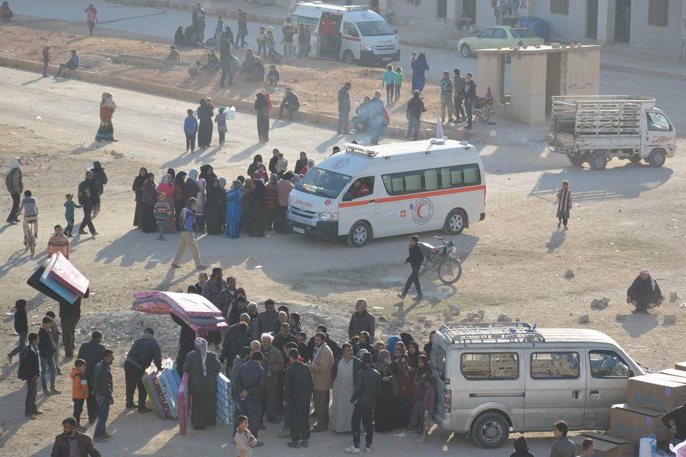
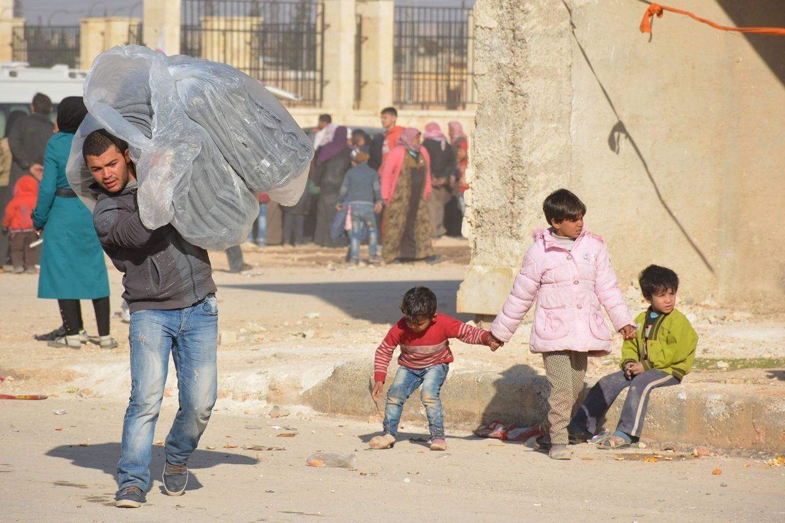
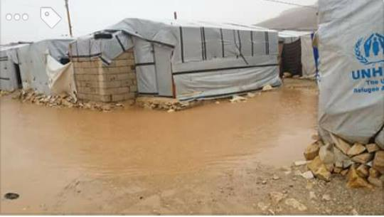
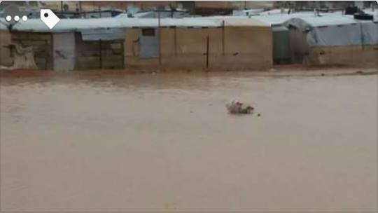
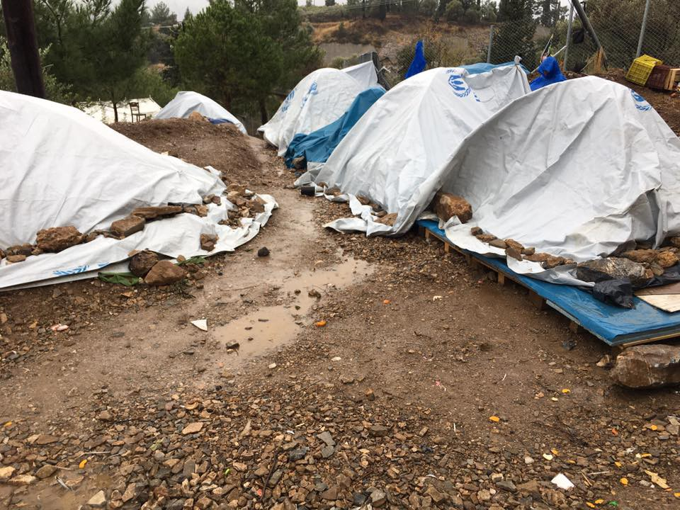
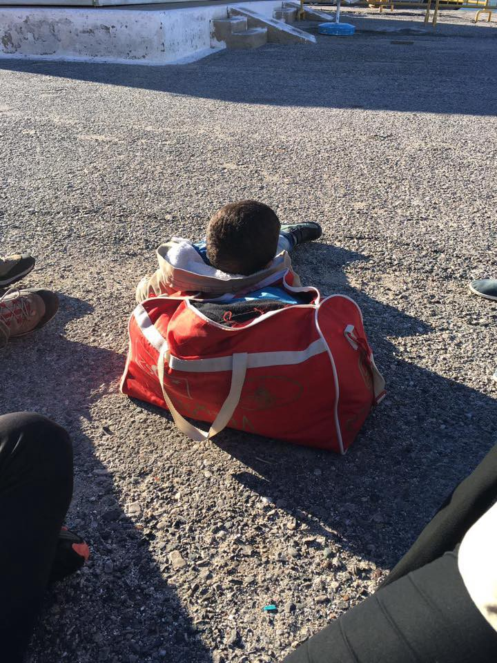
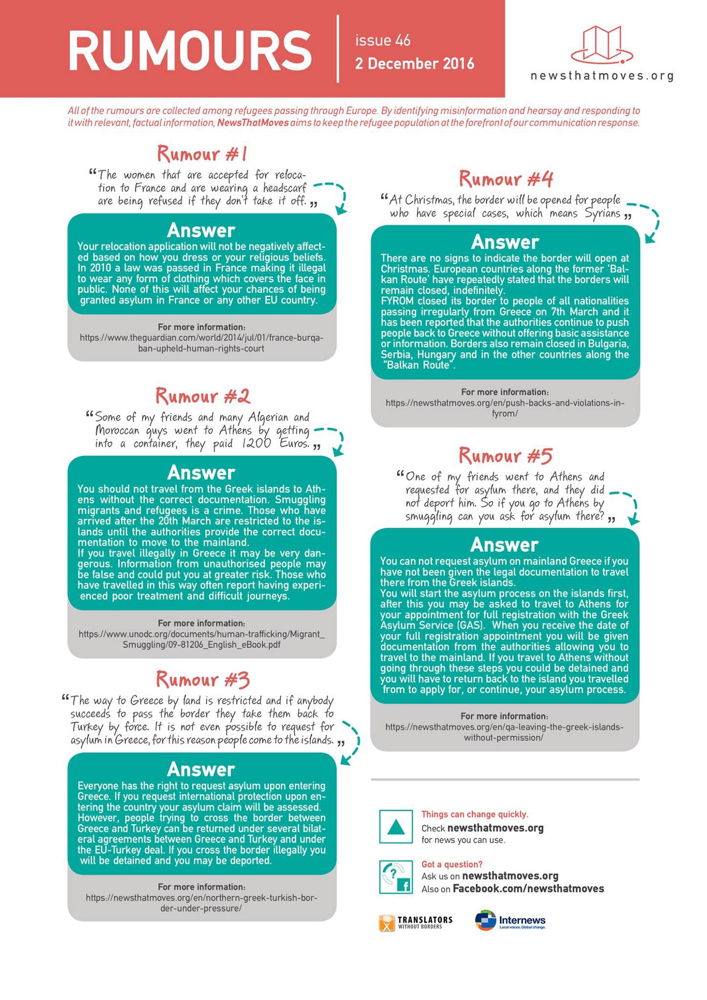
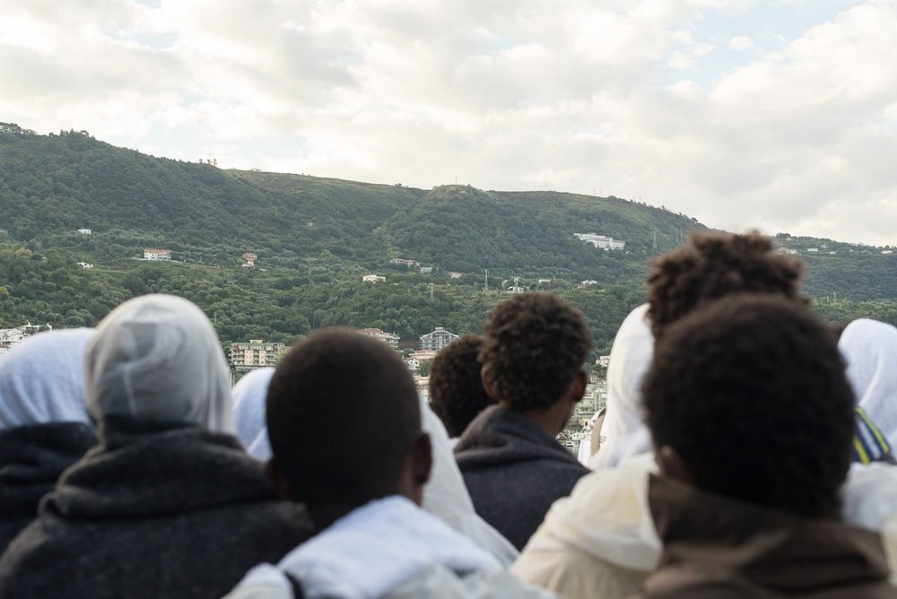

### AYS Daily News Digest 02/12: Victims of a broken system piling up across the continent
#### _Urgent medical evacuations needed in Aleppo; countless displaced / Overwhelming disappointment among both refugees and volunteers across cold Greece; a man dies on Samos due to negligence / “limbo” in transit Balkan countries / Results and the report on the situation of Calais migrants in reception centres across France_

](assets/d1620828d19/1*J5aFyy78Ox_BNGLSrY0bgg.jpeg)

Photo: [Xa Bi](https://www.facebook.com/xabiloz)
#### SYRIA
### Aleppo

A four\-month\-old baby has reportedly died today from the cold in Aleppo\. Many residents of Aleppo are spending the second winter under siege, with no heating, electricity, food or medicine\.

Hostilities have intensified significantly in Aleppo since 24 November, resulting in the displacement of an estimated 31,500 people within Aleppo city and a further deterioration of the humanitarian situation in the remaining besieged neighborhoods\.

Photo: Red Crescent Syria

Little to no assistance can be extended to the 5,000 IDPs who have been displaced within East Aleppo, as the ability of humanitarian actors to respond is severely limited by lack of access\. Resources inside East Aleppo are nearly depleted following almost five months without humanitarian deliveries\. Medical facilities have mostly shut down, with only a few operating at absolute minimum capacity\. Sources inside East Aleppo indicate that, as fuel for ambulances runs low, some wounded individuals are being rushed to medical facilities on vegetable carriages\.

](assets/d1620828d19/1*qBBIl-KbM2mM9RUEcY__Cw.jpeg)

Photo: [Free Syria — Salam](https://www.facebook.com/Free.SyriaSalam/)

WHO’s partners have identified 400 cases in Eastern Aleppo requiring urgent medical evacuations\. Lacking any means of transportation besides walking, civilians remain at great risk of death and injury as long as indiscriminate shelling and airstrikes continue\.

Photo: Red Crescent Syria
### Urgent call for safe routes out of East Aleppo

In their recent [report](https://www.savethechildren.net/article/urgent-call-safe-routes-out-east-aleppo-children-killed-trying-escape) , Save the Children urgently call for safe routes out of East Aleppo for families who wish to leave, after dozens of people have been killed trying to flee\.

> “More children are going to die trying to reach safety in the coming days if we do not urgently establish safe, internationally monitored routes\. The world has utterly failed the children of East Aleppo, but the warring parties have an obligation to protect them now in their hour of greatest need\.” 

### Demonstrations in support of Aleppo

Hundreds of people in several cities, towns and villages of Syria held demonstrations this weekend in support of the people of eastern Aleppo\. According to the [Syrian Observatory for Human Rights](http://www.syriahr.com/en/?p=56113) , demonstrations took place in the city of Idlib, as well as other cities and towns across the country\. Protesters urged the various opposition factions to unite their resources to come to the aid of eastern Aleppo, which is currently besieged by the Assad regime and its loyalist militia\.
### December 2: The International Day for the Abolition of Slavery

> We call for collective and dedicated action for abolition of all forms of modern slavery worldwide and respect for human rights and freedoms to all people, regardless of their nationality, religion or legal status\! 

](assets/d1620828d19/1*5Df4Z4Mit2M3SReJPqehtA.jpeg)

Credits: [**Legis**](https://www.facebook.com/legis.mk/?fref=nf)
#### MACEDONIA

The unprecedented global displacement crisis must be met with a genuine sense of responsibility by all countries, especially members of the EU\.

> A lack of leadership, vision, and solidarity based on human rights principles are at the core of the European Union’s dismal response to refugee and migration challenges\. 

The Macedonian NGO Legis has criticised EU policies for putting refugees at risk\. In an in\-depth [statement](http://legis.mk/news/2151/eu-policies-put-refugees-at-risk) , the group outlines the humanitarian and political crisis that has developed in the last two years\. The statement also lists several crucial points of action that the EU must take to adhere to its own human rights values and ensure thriving, pluralistic and tolerant societies on either side of the Mediterranean\.

Harsh conditions in refugee camp in Lebanon are making the already tough and dangerous life there barely possible \(Photo credit: Youssef Ta\)
#### GREECE

For the first time since the signing of the EU \- Turkey deal, there have been no new asylum registrations by Greek officials in the last three days\.
### Refugees in camps: We need action, not denial
#### Lesvos

Very bad weather plagued Lesvos over the last week, with thunder storms and floods followed by freezing conditions, high winds, and snow\. In spite of these inhospitable circumstances, there have been some new arrivals by boats\. According to the local volunteers, a boat was picked up on the north coast of Lesvos today by the coast guard and brought into Petra with 50 people on board: 3 children, 17 women, 30 men\. All passengers arrived safe, although some reportedly fascist groups have verbally attacked the newcomers\.

On the north coast of the island, they are in need of experienced volunteers to join the coast watch\. Please get in touch with [The Hope Project](https://www.facebook.com/HopeProjectKempsons/?fref=nf) if you are able to come\.
#### Samos

**A 45\-year\-old man died in the camp in Samos after waiting four hours in acute pain to see the duty camp doctor, who kept turning him away** despite the fact that he had a heart condition, a field\-based source wrote\. The vast number of people in the camp are vulnerable: children \(including small babies\), pregnant women, the elderly, and those with disabilities and chronic illnesses\. Many have been living in the inhumane and dangerous conditions of the camp for up to eight months\.

> The people in the camp on Samos are living in horrendous conditions and the endless advocating of volunteers seems to make little difference, because there is a systematic incompetence & general malaise from the top down; a culture of inaction\. There is no excuse for this situation\. 

> The resources are there\. 
 

> The budget is there\.
 

> The personnel are there 
 

> But the political will is not 

 \)](assets/d1620828d19/1*1ZhsV2bsuxet_wz5eZZSUw.jpeg)

State of the camp on Samos \(Photo: [Majida Ali](https://www.facebook.com/profile.php?id=100009525601484) \)
#### The islands’ internal relocation problem

Greek Migration Policy Minister Yiannis Mouzalas said that the EU\-Turkey deal does not include an option for transferring asylum\-seekers on the islands to the mainland\. He added that relocating refugees to the mainland may actually lead to the agreement failing, [News That Moves](https://newsthatmoves.org/en/transfers-to-mainland-against-eu-turkey-deal/) report\.

Some politicians [dispute](https://newsthatmoves.org/en/mep-says-mouzalas-spreading-misinformation/) Mouzalas’s claim, however\. They argue that he is hiding the real reason that relocation of the refugees from the islands is not possible\. According to them, the real reason is that the infrastructure on the mainland could not support receiving refugees from the islands\.

A volunteer reported that thirteen Iraqi refugees are sleeping outside on the streets of the island Kastelorizo, **in need of help and shelter** before they apply for asylum and get transferred from the island\. If you can help, contact the [volunteer](https://www.facebook.com/profile.php?id=100007841867374) on location\.

a boy from the family who is staying on the island streets for the third day\. \. \(Photo: Saad Kasem\)
### Despite sporadic improvements, the situation is deteriorating

Extensive video and photo evidence reaches us on daily basis, showing the horrible, appalling conditions that thousands of people have been living in for many months now\.

This mountain of documentation inevitably invites criticism of those institutions who claim to have refugees’ security and well\-being as their central concern\. As conditions continue to deteriorate, it becomes increasingly difficult to ask for residents’ patience, after all they’ve been through: war, violence, perilous journeys full of life\-threatening risk, and now almost a year in camps whose health and safety standards fall far short of what might be expected of an EU country\.

> It has been more than a year since the crisis happened and there has been more than enough opportunities for the mandated parties and authorities to re\-evaluate, re\-adapt their system of providing aid, to make it more agile, for a more dynamic response — rather than relying on unpaid volunteers, to meet the needs that they should be meeting\. 

> A [volunteer](https://www.facebook.com/gabrielle.tan/posts/10154562169035469) from Chios 

Refugees from the camp [Oraiokastro](https://www.facebook.com/ThevoicesofO/posts/1684371018540672?hc_location=ufi) in northern Greece claim they haven’t had hot water for days and they have also expressed confusion and disappointment with the officially responsible NGOs at the camp:

> Today we heard the NRC have quit our camp\. The UNHCR haven’t been here since Tuesday\. We don’t know what happens for our asylum\. We continue to feel unheard and forgotten\. Depression and no hope, no feelings are problems here\. 

Latest rumor vs\. information by News That Moves
#### ROMANIA

The so\-called Dublin III, an EU regulation that establishes a method for deciding who should process a claim for asylum, is a common obstacle in refugees trying to reach specific European countries where they have family or friends\. Such is the [case in Romania](https://live.w2eu.info/en/romania/) as well\. A growing number of individuals have lately been entering Romania as a transit country\. Many refugees residing in the country originally came there with the intention of eventually moving towards Germany and elsewhere\. These people are usually stopped at the Romanian border, and given the option to either claim asylum, or be detained and deported at any time\.
#### SERBIA

As many [accounts](https://www.afghanistan-analysts.org/afghan-exodus-notes-from-a-belgrade-squat/) on the situation in Serbia confirm, the conditions are worsening as winter draws near\. Serbia remains a roadblock on the route towards Western Europe for many refugees, who have been stranded in official and makeshift camps for months now\.

 \)](assets/d1620828d19/1*VVTUb0TF_EARSbXFTWug0w.jpeg)

Football training warm up at Bujanovac camp in Serbia \(Photo: [Borderfree Association](https://www.facebook.com/borderfreeassociation/) \)
#### Changes in Miksalište

The Miksalište team has changed their working system\. Refugees can now continue getting information 24/7 from the team at the first barrack, the Info point\. From 9pm until 9am, only the Info and Save the Children teams will be present, while in the two daily shifts \(from 9am until 4pm and from 4 until 9pm\) they are welcome for activities as before\.

Another important change is that no clothes will be distributed at the site\. In accordance with government officials, the Miksalište team has forwarded donations to other people in need\.
#### Reception — Transit Center for refugees opened in Dimitrovgrad

The German organisation [ASB](https://www.facebook.com/asb.see/) has built a Reception\-Transit Center in Dimitrovgrad\. The center currently hosts 70 people, more than half of them children\. They will provide three cooked meals per day for the refugees staying there, and a medical team from [IDC Serbia](https://www.facebook.com/idc.serbia/) is responsible for providing medical assistance to all those in need\. According to ASB, they have also provided medical supplies and necessary hygiene products for the centre, and will donate clothes during the next period\.
#### HUNGARY
### The only acceptable ruling: Freedom for Ahmad — protest in Budapest

A [protest](https://www.facebook.com/events/210883196022903/?acontext=%7B%22ref%22%3A%223%22%2C%22ref_newsfeed_story_type%22%3A%22regular%22%2C%22feed_story_type%22%3A%22117%22%2C%22action_history%22%3A%22null%22%7D) to bring attention to Ahmad H’s outrageous conviction at the end of his [deeply unjust trial](https://www.alaraby.co.uk/english/comment/2016/11/7/hungarys-show-trials-refugees-not-welcome-here) will take place tomorrow, Saturday, in Budapest\.

Hungarians invite everyone to join their protest and show support in different ways from other countries\.

](assets/d1620828d19/1*zVP9x--VtTHLGhXYDaLuXw.jpeg)

Photo: [**MigSzol Csoport**](https://www.facebook.com/migszolcsoport/)

> “Those show trials, together with the fence, the police violence and the harsh policy changes are supposed to set an example and create an atmosphere of fear\. They are part of the Hungarian state’s increasing racist propaganda against all migrants, especially Muslims and part of the repressive migration policies\. Masking internal struggles and inequality in Hungary and strengthening the government’s position, Ahmed H’s trial is an integral part of a huge propaganda machinery\.” 

> [MigSzol Csoport](https://www.facebook.com/migszolcsoport/?fref=nf) 

#### CROATIA
### “Set a larger table, not a taller fence”

The Jesuit Refugee Service in Croatia invites all families in and around Zagreb to host refugees for the Christmas meal\. All those interested can write them with questions and invitations to guests: info@jrs\.hr
#### ITALY

> 16% of arrivals to Italy are kids, 88% are alone\. The youngest unaccompanied kid we met this year was 8\. Imagine your 8 y/o at sea alone\. — 

Photo: MSF Sea
#### FRANCE
### Uncertain Future report

A report commissioned by [Help Refugees](https://www.facebook.com/HelpRefugeesUK/) recently came out about the state and current situation of the young people who had been taken from Calais to reception centres across France\. Information and opinions were collected from interviews with minor and staff members of the twelve CAOMIEs \( _Centres d’Accueil et d’Orientation des Mineurs Isolés Étrange_ \) and two CAOs \( _Centres d’Accueil et d’Orientation_ \) visited\. Information was recorded through note\-taking and photography where appropriate\.

According to the report, the interview process by British officials from the Home Office has been marred with confusing misinformation and a consistent lack of information provided by the Home Office to both accommodation centre staff and unaccompanied minors regarding their transfer to the UK\. Based on their findings, the report’s authors have expressed concern that many minors might choose to leave their accommodation centres in the face of this confusion\.

The full report can be accessed [here](https://www.dropbox.com/sh/mc1qtfz8h2wx561/AAAof4FQGk50uEF9p6Iabj3Ha?dl=0) \.

](assets/d1620828d19/1*9dV9fZKH6buQZhDiye9rwA.jpeg)

Image: [**Help Refugees**](https://www.facebook.com/HelpRefugeesUK/)
#### Help still needed in Paris

[La Cuisine Des Migrants](https://www.facebook.com/La-Cuisine-Des-Migrants-305783063121648/?ref=page_internal) in Paris needs donations in food and different kitchen equipment and utensils\. If you are coming to Paris, you can deliver it to the following address: 4 rue Jean Moinon, Paris 10ème, Mondays and Tuesdays from 10am to 9pm\.
#### French speaking volunteers needed in Dundirk

The [Dunkirk Legal Support Team](https://www.facebook.com/DunkirkLegalSupportTeam/?fref=nf) is looking for French\-speaking volunteers to join our small team working on the ground to provide those living in the Grande\-Synthe Refugee Camp with access to independent information, advice, and representation\. For more information, follow this [link](https://drive.google.com/open?id=0B1whtRE-54upcFRCYjUxa0R6Szg) \.

_Converted [Medium Post](https://areyousyrious.medium.com/ays-daily-news-digest-02-12-victims-of-a-broken-system-piling-up-across-the-continent-d1620828d19) by [ZMediumToMarkdown](https://github.com/ZhgChgLi/ZMediumToMarkdown)._
