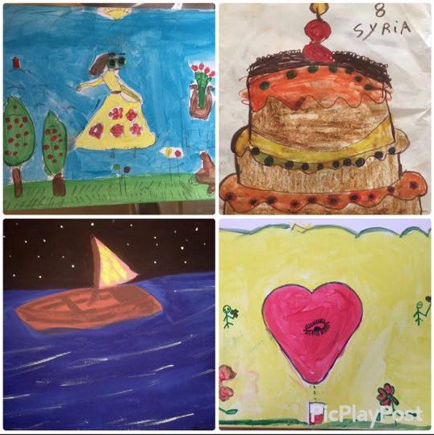
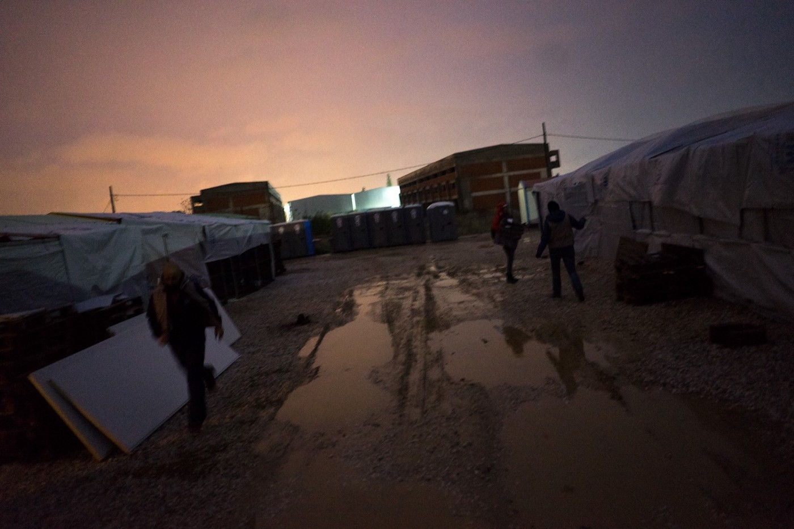
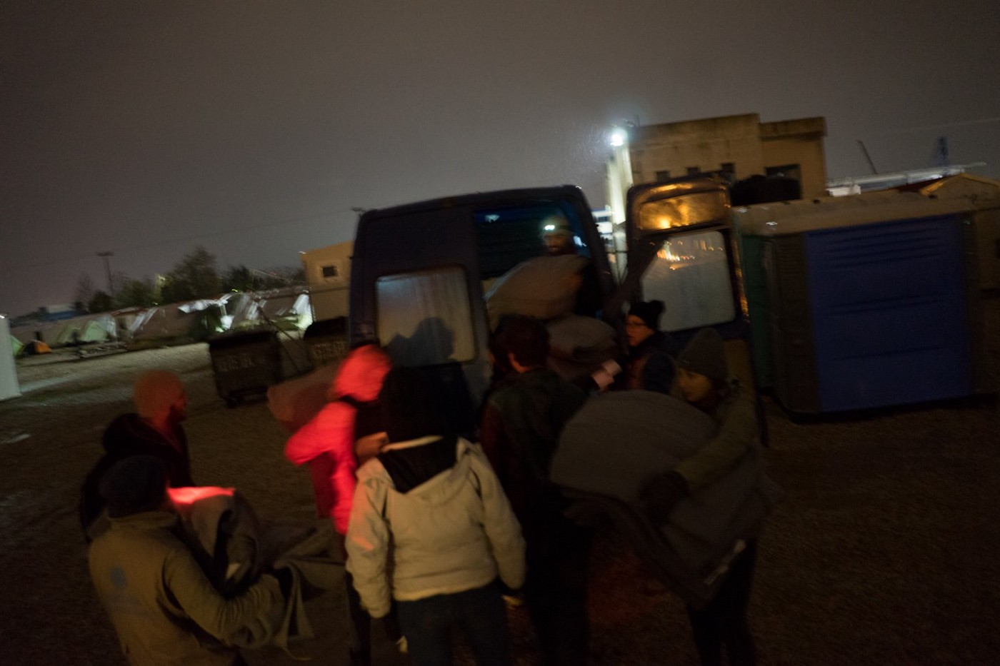

### AYS DAILY DIGEST 06/12/2016: More forcible returns from Europe, while anti\-refugee sentiments continue to rise

_More victims in Syria // Refugees are still arriving to Greece // Hundreds of people in the streets of Belgrade looking for help // Borders like fortress and new rules that could harm refugees in Europe_

Love Without Borders
### Syria

Foreign militias led by Iran but loyal to the regime of Bashar al\-Assad have [captured](https://www.theguardian.com/world/2016/dec/07/syrian-troops-in-control-of-aleppo-old-city-after-rebels-withdraw) the Old City of Aleppo, which was liberated four years ago by Syrian rebel forces\. The capture of the Old City follows a brutal campaign of bombing by both Russian and Baathist aircraft, which has left much of the Eastern parts of the city destroyed and which has claimed [hundreds](https://www.theguardian.com/world/2016/nov/30/syria-aleppo-death-toll-united-nations-statistics) of innocent lives\.

East Aleppo is still under a regime\-enforced siege, while Russia and Assad have destroyed [every](http://www.slate.com/blogs/the_slatest/2016/11/20/there_are_no_functioning_hospitals_in_rebel_held_aleppo_after_days_of_airstrikes.html) medical facility in the city\. The capture of the Old City essentially paves the way for the recapturing of all of East Aleppo from the rebels, bringing an end to four years of liberation and the closest thing the Syrian opposition had to a hub in the country ravaged by Assad and Russia’s vicious air assaults\.

**Yesterday alone at least [38 civilians](https://news.vice.com/story/syrian-rebels-retreat-as-government-forces-take-over-aleppos-old-city) were murdered by pro\-regime forces as they fought to capture the Old City** \.

Rebels, fearing the inevitable, have called for an immediate five\-day ceasefire in order to arrange the evacuation of civilians, particularly the thousands wounded by regime airstrikes and mortar attacks, but the regime has so far yet to respond, focusing instead on ‘clearing operations’ that are widely thought to involve ethnic cleansing, arbitrary execution and forced displacement\.

 \. — via Rami Jarrah](assets/6fe62d13cb38/1*ZpIdVsxRBLLHBhLBCsdXdA.jpeg)

[A man desperately searches the streets for a hospital in eastern Aleppo to save his wife’s life, he fails to do so because wherever he turns there is nothing but destruction and all hospitals and medical clinics have been put out of service](https://www.facebook.com/ramijarah/posts/10154893542822873#) \. — via Rami Jarrah

Speaking to the Guardian, one doctor based in East Aleppo said

> “We are completely paralysed and cannot treat anyone … we are suffering what we have to suffer under this vicious campaign and this extermination and invasion … the civilians are worried and horrified, every day people are getting displaced from one street to the next …” 

### Greece

60official registrations have taken place on the island of Lesvos, which is the location of all the 184 arrivals this month\. With the 74 arrivals from December 5th, Greece has documented its 25000\. refugee arrival since the implementation of the EU\-Turkey deal\. As of December 6th, the count is 25085 newly registered refugees, while Lesvos has hit the 10814\. mark\.
#### The latest Relocation statistics from the Greek Asylum service can be found [here](https://drive.google.com/file/d/0B6Da1eGN7WCjaEV6aEVhUm8waDA/view)

](assets/6fe62d13cb38/1*pcWSys6ut8OC3_wVNyF1YQ.jpeg)

[Through Refugee Eyes](https://www.facebook.com/throughrefugeeeyes/)

](assets/6fe62d13cb38/1*e2aqR10iPywuVeHL_ci4Lw.jpeg)

[Through Refugee Eyes](https://www.facebook.com/throughrefugeeeyes/)

Our friend Abdulazez Dukhan reports that the camps have, after 10 months, slowly started to empty\.

_“Over 50% of refugees in each camp are not there anymore, some of them having left for other European countries and putting their fate in the hands of the smugglers, other deciding on going back to Turkey, or their countries of origin, after the intense suffering brought upon them by the conditions in the camps\. He says that UNHCR processes have only started being visible after 7 months, with a big number of refugees being relocated to apartments and hotels in order to wait for their final appointment with UNHCR and news of their relocations\.”_

[**Love Without Borders — For Refugees In Need**](https://www.facebook.com/groups/478293189015540/) is ready to promote their four postcards, made by four children in northern Greece\. Every postcard has the child’s name on the back, as well as the name of the drawing\. 100% of earnings will stay in northern Greece, to help the refugees and further their creative abilities\. [For details on ordering, please refer to their Facebook page](https://www.facebook.com/photo.php?fbid=10153878835831829&set=gm.666203473557843&type=3&theater)
#### The Greek Ministry of Migration Policy announces a plan to develop smaller reception centers for vulnerable refugees

[News That Moves via _Chios Politis_ reports](https://newsthatmoves.org/en/new-program-for-vulnerable-refugees/) that the program is to be called “Temporary Reception Structures for Refugees Applying for International Protection” and it foresees a series of small hosting centers, each accommodating 15 to 50 people, with a total capacity of 3,000 places\.

> The centers will be funded for five years and will address the needs of unaccompanied minors, the disabled or severely ill, the elderly, pregnant women, single parents with minor children, victims of violence and victims of trafficking\. 

> The long term aim of the project is to help people integrate and develop useful social and work skills\. Several ministries will be involved, along with local governments and NGOs\. 

> However, officials on islands with large asylum seeker populations, such as Chios and Lesvos, question whether municipalities with limited resources can realistically host such centers\. 

](assets/6fe62d13cb38/1*bdT98_AK6Pn2VucRrTxrWQ.jpeg)

[**InterVolve — International Volunteers**](https://www.facebook.com/InterVolve-International-Volunteers-219418945063168/)

[**InterVolve — International Volunteers**](https://www.facebook.com/InterVolve-International-Volunteers-219418945063168/) report a difficult week in Softex camp, where winter kicked in on Tuesday with snow, harsh winds and temperatures below zero\. The camp is still not prepared for winter, people sleep in unheated caravans and in tents, so they have suspended all their activities in order to concentrate their efforts on fighting the cold, running from tent to tent, distributing blankets, sleeping bags, hot water bottles, clothes and shoes\.
### Serbia
#### [Support Kelebija Community Center\!](https://www.youcaring.com/kelebija-community-center-675966)

In only 24 hours, the initiative **„Srce bez granica“** \(Hearts without borders“\), launched by three volunteers from Pula \(Croatia\), has successfully managed to collect gifts for all the asylum seeker children located in Kutina, as well as one more home for children in Pula for New Year\.
Thanks to people who are still applying and their enormous desire to help, they will continue helping further, and have decided to focus on the Kelebija community center for the reception of unaccompanied minors and refugees in Serbia\. The KCC is one of the rare places where they can have some respite from the horrific conditions around the transit zones at Kelebija and Horgoš\. Your money would go to supporting them in terms of maintenance, the cost of buying food, maintaining the workshops for children, and at the same time it will allow the tireless, selfless North Star volunteers to provide a sense of warmth and welcome for the tired and suffering people and their children during the coming holiday season\.
### Belgrade

292 kids, 27 women and 65 men came to Miksalište looking for help today\. People are still sleeping out in the cold, humane ways of sanitation are still extremely scarce — in case they don’t spend hours waiting in line for the 3 showers available to them, MSF presents you with their options:

■■■■■■■■■■■■■■ 
> **[MSF Sea](https://twitter.com/MSF_Sea) @ Twitter Says:** 

> > This is how #refugees &amp; #migrants shower in #Belgrade. Two 44 gallon drums &amp; a camp fire in a railway yard. It's the opposite of dignified. https://t.co/rIBjg70dbE 

> **Tweeted at [2016-12-06 15:50:28](https://twitter.com/msf_sea/status/806163907748524032).** 

■■■■■■■■■■■■■■ 

[News that Moves report](https://newsthatmoves.org/en/no-assistance-in-nemanjina-belgrade/) that due to the cancellation of permits for the premises by the Savski Venac Municipality, The Asylum info Centre \(AIC\), an NGO providing information and support to migrants has stopped providing its services in Nemanjina Street 3, Belgrade\.

> “The organizations working with the Asylum Info Centre had to leave the office in Nemanjina street, but we continued working from [Miksaliste](https://newsthatmoves.org/en/womens-corner-at-belgrades-miksaliste/) and on the ground in the parks non\-stop”, Maja Dragojevic from Crisis Response and Policy Centre told News That Moves\. 

### Bulgaria
#### Bulgarians protest migrants’ presence

[National TV stations reported](http://www.novinite.com/articles/177819/Anti-Migrant+Protest+Held+in+Bulgarian+Border+Town) that the residents of Lesovo in Southeastern Bulgaria have demonstrated against the construction of a reception centre for refugees and migrants, some of them holding banners saying “I Do Not Want Refugees in Bulgaria” and “Our forefathers fulfilled their duty\. So should we”, apparently referencing Bulgaria’s fight for independence from the Ottoman Empire well over a century ago\.
### Austria

The Austrian Government has agreed on a new package of immigration laws, [in which](http://www.oe24.at/oesterreich/politik/Regierung-einig-Keine-Obergrenze-im-Gesetz/261154287) refugees face harder punishments for giving false information during the course of the asylum process — for example, for claiming a false identity the fine is either €5000 or three weeks of incarceration, while not leaving the country after their asylum claim is rejected could result in a fine of up to €15000 or 6 weeks of incarceration\. If their plea gets rejected, refugees are also obligated to undergo a ‘Return Consultation’\. For refugees with a criminal record, the procedures for revoking asylum will be expedited\. The laws are expected to be finalized during the next couple of days, and politicians hope that they will be implemented before the year’s end, as Austria will soon reach the 37\.5000 limit of refugees they were ready to receive in 2016\.
### Germany
### Germany and Austria to pick up border policing to prevent undocumented crossing\.

[The authorities in Germany announced](http://abcnews.go.com/International/wireStory/patrols-german-austrian-border-check-migrants-43983531) that the deployment of 100 Bavarian police officers to patrol the country’s border with Austria comes as a result of recent events, where 37, mostly Eritrean refugees and migrants were detained in Munich after entering the country in freight trains\.
### German Alliance for Civilian Assistance is seeking Serbian\-speaking drivers\.

The German aid organization German Alliance for Civilian Assistance is seeking one or two Serbian\-speaking drivers with an EU drivers licence type B, for a donation delivery to Sombor, Serbia\. The trip is starting from Munich, at 19h on Friday, 9th December, and return is planned for Sunday morning\. If you fit the bill, please [get in touch with them on Facebook](https://www.facebook.com/germanallianceforcivilianassistance/photos/a.592974734193009.1073741828.585474061609743/795170873973393/) as soon as possible\.
### Norway
#### Norway has erected a wall on its border with Russia\.

The aforementioned fence is supposed to be around 200 miles long and 3,5 meters high\. The Russia\-Norwegian border got attention when a group of Syrian refugees crossed into Kirkunes in September 2015 to claim asylum\. The refugees were mostly men from Syria between the ages of 20 to 40 and they came by bike\. A total of 5500 persons crossed the border last year\. The building of the fence began in September 2016\.

The fence is believed by some to be a violation of international law, as Russia’s stringent and unfair policies prevent refugees from getting status as such if they do not register within a day of crossing into Russia\. A report recently issued showed that Russia has forcibly deported Syrian refugees in the past
### Finland
#### Forcible deportation of Iraqi refugees

[Despite a Helsinki Administrative Court ruling back in November](http://yle.fi/uutiset/osasto/news/court_ruling_forces_immigration_officials_to_relax_asylum_policy_for_mosul_iraqis/9314866) , where a decision by the Finnish Immigration Service to deny asylum to a Sunni Muslim who had fled to Finland from the Iraqi city of Mosul was overturned, seeing that it is a theatre of war where the US\-backed Hashd ash\-Shaabi militias are attempting to retake it from Daesh, and the fact that [a second security re\-assessment of Iraq \(and Somalia and Afghanistan\) is in the works](http://yle.fi/uutiset/osasto/news/migri_to_update_security_assessments_for_iraq_somalia_and_afghanistan/9304427) ,

> National Police Board Chief Superintendent Mia Poutanen says [Finland is currently facilitating the forced returns of rejected asylum seekers from Iraq](http://yle.fi/uutiset/osasto/news/finnish_police_carrying_out_forced_returns_of_rejected_iraqi_asylum_seekers/9332150) , in addition to thousands of voluntary returns assisted by the Finnish police and the IOM\. 

> “We have always returned people there, and we seek to continue to do so\. There is a false notion, if you could call it that, that a repatriation agreement must be signed before the police can carry out a forced return, but it is not true,” she says 

#### Internal relocation no longer an option

In spite of the very real and present danger, immigration officials had previously said that civilians escaping the conflict could relocate to Baghdad\. The November decision also means that officials can no longer propose internal relocation in Iraq as an option for similar applicants, for example Iraqis from Mosul, but must approve their requests for asylum\.
### Libya
#### The Netherlands are providing aid for refugees in Libya to return to their home countries\.

[The Dutch government](http://reliefweb.int/report/libya/netherlands-helps-stranded-migrants-return-home-libya) has provided 1 million Euros in aid to fund the repatriation of refugees in Libya to their home countries\. The effort will provide assistance to 400 refugees who chose to return to their countries voluntarily\. The number of those returning to their homes with the IOM program has gone up from 1,113 in 2015 to 2,463 in 2016 as of December 5\.
### Mediterranean
#### Europol to reexamine the largest drowning in the Mediterranean\.

After [journalistic investigations](http://uk.reuters.com/article/uk-europe-migrants-egypt-europol-idUKKBN13V1HP) by Reuters and the BBC have turned up gaps in the official story promoted by the agency, the head of Europol said that the organization would reevaluate its response to the April 9 drowning in which 500 refugees drowned\. The accident left only 37 people alive, who would later go on to tell of the smugglers’ decision to load yet more people onto an already overcrowded boat\.

No European agency decided to launch an investigation, all claiming that it was not within their mandate to do so\. The identities of the smugglers are known, and yet, so far seemingly nothing has come out of this knowledge\. The Egyptian lawyer representing the victims’ families has called the incident tantamount to murder\. “I consider putting 500 people on this boat to be murder\. There is no other way to describe it,” said Sabry Tolba\.
### 1,300 refugees rescued over the past 48 hours, 16 found dead\.

The numbers included 285 rescued on Saturday, 791 on Sunday, and 231 on Monday\. This year thus far, 173,000 refugees have arrived in Italy, usually departing from Libya and most of whom are of West or East African origin\. The UN reports that at least 4,700 people have died this year while attempting to make the journey\.
### Italy
#### Italian volunteers arrested for aiding illegal immigration\.

More criminalization of solidarity, this time from Italy, where seven Italian volunteers from the Ospiti in Arrivo NGO in Udine are accused for aiding illegal immigration, in order to make profit\. You can read more about it [here](http://www.5election.com/2016/06/16/on-coming-guest-osptiti-in-arrivo-when-helping-people-in-need-is-crime-in-italy/) \.
#### Bovolonese protest the relocation of 50 refugees into their town\.

A demonstration took place last night in the Veronese town of Bovolone\. The people eerily used fascist slogans, such as “Italy for Italians, Verona to Veronese”\. The protest convened in reaction to an announcement that the town would be receiving a total of 50 refugees, to be housed in a former farm\. The demonstration attracted over 1000 participants\. Such xenophobic demonstrations and sentiments grow increasingly common in today’s Europe, as demonstrated by the rise of far\-right wing populist movements in politics throughout the continent\.

_Converted [Medium Post](https://areyousyrious.medium.com/ays-daily-digest-06-12-2016-more-forcible-returns-from-europe-while-anti-refugee-sentiments-6fe62d13cb38) by [ZMediumToMarkdown](https://github.com/ZhgChgLi/ZMediumToMarkdown)._
