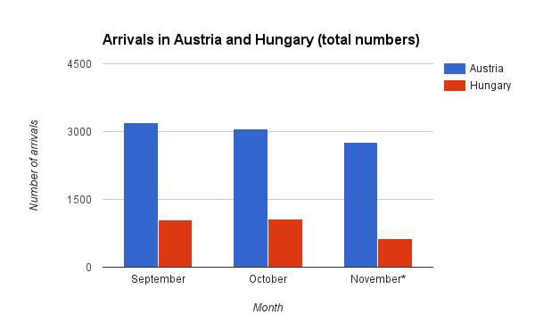
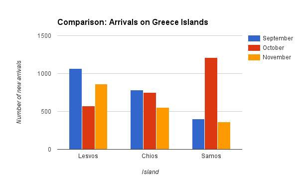
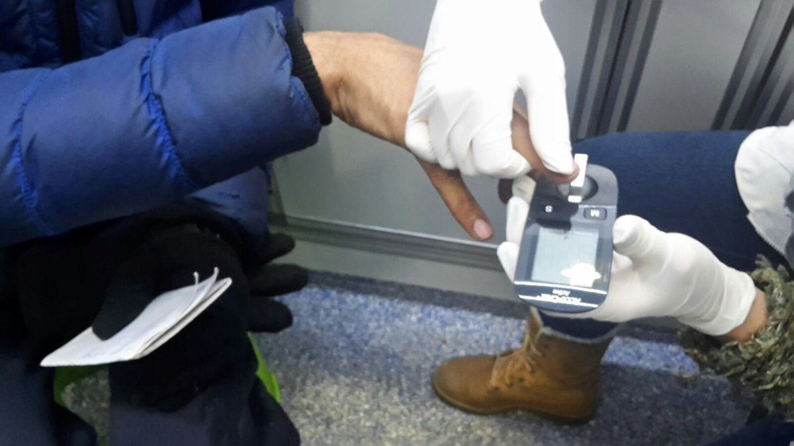
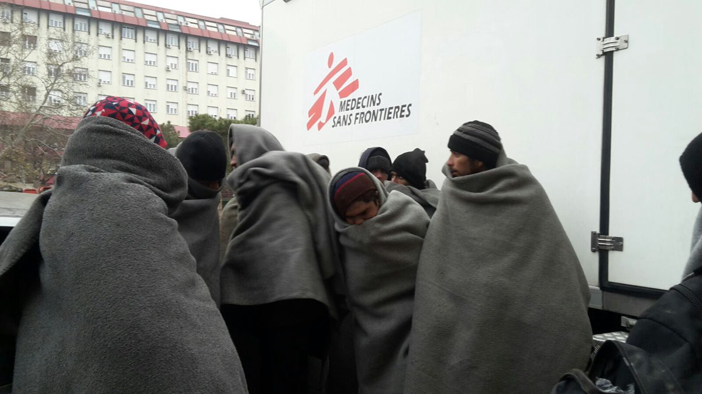
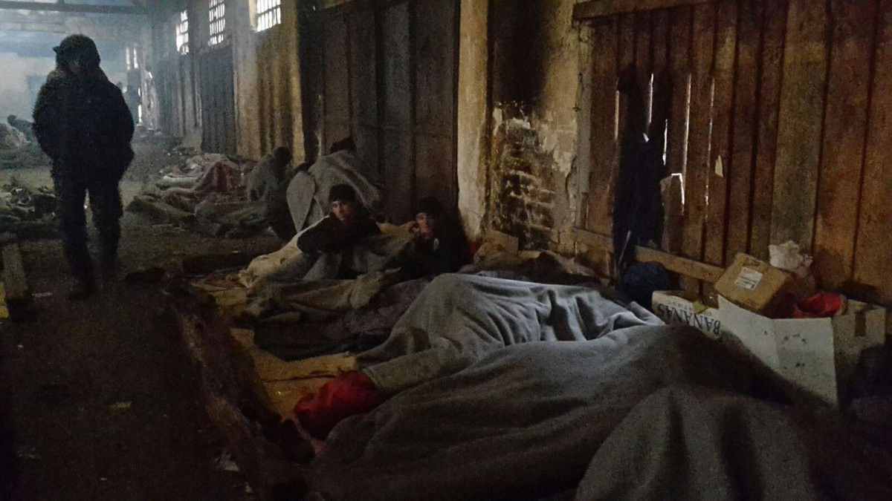
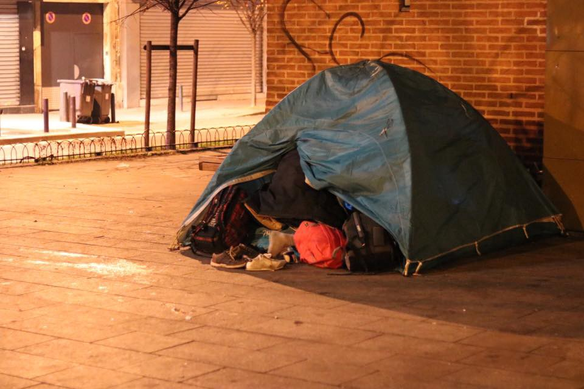

### AYS News 7/12: Closed borders do not stop refugees from coming, but they make their lives terrible

> Closed borders, as research shows, do not stop refugees, but they make their journeys more dangerous\. A Kurdish refugee whose toes and part of the foot were amputated due to frost\-bites he got during his journey receives a prosthesis, yet another refugee showed up in Subotica community centre with bare feet\. New routes are becoming active: Croatia\-Slovenia, Morocco\-Spain, showing that with closed borders the geographical reach of refugee crisis has spread to more dangerous and remote areas 

](assets/3eaeeca8c099/0*Fl7rbBHlmsfQYjes.)

Credits: [**Legis**](https://www.facebook.com/legis.mk/)
### Is Hungary really Western Europe’s gatekeeper?

Credits: NG/AYS

In the beginning of November, on 3/11 to be precise, UNHCR reported that Hungarian authorities only let an average of 20 people daily cross the border, later they continued with that\. Before the number was around 30\. In fact the average number for daily arrivals dropped from 34,48 in October to 22,08\* in November\. But what did this mean to Austria? It should be assumed, that when Hungary reduces the number of new arrivals, it should have an impact on the number of new arrivals in Austria\.

In October 3060 made it into Austria, what’s an average of 98,7 daily\. During this period only 1069 had entered Hungary\. Concluding from this number one can assume, that on paper almost 2/3 of the refugees crossing the Balkans and arriving in Austria are not being registered in Hungary\. \* \*

In November the number of new arrivals to Hungary dropped by 40 percent to 641\* \. But this had almost no impact to Austria, where still 2761\* refugees arrived, what’s an average of still 92,04 \(decrease by ~10%\) \. The average of daily arrivals can vary a bit, the highest number on one day in November was 149 \(8/11 and 14/11\), the lowest 51 \(3/11\) \.

This means that on paper November 76,81 percent of the refugees had arrived Austria without being registered in Hungary\. In total the number remained almost stable, seeing that the number of daily arrivals in Austria can vary\. It’s only more people, who can’t try it legally anymore\.

\*UNHCR data for daily arrivals by now is only available until 24/11\. To that point 2209 refugees had arrived to Austria \(average 92,04\) and 508 to Hungary \(average 22,08\) \. If you add the average number to the missing days, you get a total number of 2761,25 for Austria and 640,52 for Hungary\.
- \*UNHCR only gives numbers for refugees along the Balkan route, not from Italy to Switzerland \(and later France\) or Austria\.

### The hotspots: Key findings from Greece and Italy

Almost one year has passed since the first hotspots were established in Greece and Italy\. ECRE published a study with the following key question in mind — whether and how implementation of hotspots is in line with EU asylum law and legal standards and whether it ensures that the fundamental rights of the migrants and refugees are respected\.
#### Key findings on hotspots in Italy

The hotspots approach in Italy has primarily served as a measure to better control migration and ensure Italy’s compliance with fingerprinting requirements\. The implementation of the approach however raises a number of concerns:
- Most disembarkations happen in non\-hotspot areas where practices are less clear and where the possibility to provide information before identification is not always guaranteed\. No mobile hotspots have been set up so far for this purpose, as suggested by the Commission\.
- Migrants are often not sufficiently informed before pre\-identification and identification about the procedures and the possibility to apply for asylum, or the purpose of the ‘foglio\-notizie’ form\.
- Pre\-identification through the ‘foglio notizie’ form is used to “filter” applicants for international protection butfrequently results in impeding access to the asylum procedure\.
- Information about the asylum procedure is provided mostly by international organisations, even if that remains the responsibility of the authorities
- There is significant lack of cultural mediators/interpreters in all languages, especially the Sub\-Saharan languages
- Medical screening carried out on board is not always coordinated with further medical examinations later on, and there is no continuity of medical care; medical information and vulnerability screening are also not always well coordinated\.
- Coercive measures, including physical force and prolonged detention, are used in the case of persons refusing to be fingerprinted\.
- In case of doubt, age assessment is conducted frequently through X\-ray examination and not as a method of last resort
- Clear referral mechanisms in general and specific referral mechanisms for vulnerabilities are not systematically in place\. The nonvisible and non\-declared vulnerabilities are usually identified at a later stage in the regional hubs, and the EASO vulnerabilities tool is not used systematically
- Detention in the hotspots tends to last longer than 48 hours, and is unregulated and arbitrary\. There is no access to effective remedy
- Unaccompanied minors are placed in hotspots despite the fact that this is against Italian law
- Vulnerable cases, including unaccompanied minors and victims of trafficking, end up staying prolonged periods of time in the hotspots as specialised shelter capacity remains limited
- In practice, unaccompanied minors have no access to relocation\. The timeline for appointment of guardian for unaccompanied minors takes longer than the relocation timeline, making the two incompatible
- The slow pace of relocation makes it unattractive as an option, with the result that those eligible refuse to be fingerprinted and prefer to continue the journey to another Member State through irregular means, rather wait\. Lack of transparency also lead to mistrust in the relocation programme
- Reception capacity in Italy still remains insufficient; facilities are often used for mixed purposes, accommodating asylum seekers outside the relocation programme and relocation candidates\.There is a lack of reception facilities close to disembarkation areas

#### Key findings on hotspots in Greece

The implementation of the hotspots in Greece paints a much more confusing and tense picture than in Italy\. This is a result of the EU\-Turkey Statement that came into effect on 20 March 2016 and brought about major changes to the administrative procedures in the hotspots and enormous pressure to the national asylum system as a whole\. While deficiencies and challenges in the Greek asylum system are still multiple, Greek reforms and developments are highly politicised at national and EU level\. This, combined with a tense security situation in the hotspots and legal uncertainty concerning certain practices, has led to substantial confusion and insufficient information at all levels, ranging from the authorities and organisations providing services to the refugees entering the centres\.
- The limited capacity of the Greek Asylum Service to process asylum applications in the hotspots leads to excessive delays and prolonged stay, both of which contribute to the deteriorating situation
- The role of EASO in the Greek hotspots has increased in individual decision\-making processes \(inadmissibility and in merit examination of claims\) and generates greater accountability and liability for the Agency; in practice, the division of labour with the national authorities is sometimes blurred
- The systematic use of the safe third country \(STC\) concept in the admissibility procedure risks undermining the effectiveness of procedural safeguards and access to the asylum procedure\.
- The practice of mandatory detention, applied indiscriminately, even to vulnerable cases, is not in line with legal standards and the EU acquis
- Certain nationalities are prioritised, while the asylum claims of others, such Iraqis and Afghans, are not examined; this differentiation creates frustration and inter\-ethnic tensions
- Reception conditions are inadequate and often below standard in the Greek hotspots
- Prolonged stay in facilities that were foreseen for a period of a few days is problematic and inappropriate, and one of the factors behind the deteriorating situation and the constant tensions
- The most vulnerable, such as unaccompanied minors, are those that stay in the hotspots the longest because the places in specialised shelters remain insufficient
- The lack of proper guardianship hinders the access of unaccompanied minors to the asylum procedure
- There is substantial confusion, lack of information and guidance to the camp residents about the procedures, due to frequent change of practice and the multitude of different and loosely coordinated actors present in the camps
- There is lack of clarity about the duration of their stay and their prospect of leaving the island for the mainland
- The number of interpreters and cultural mediators on the islands still remains insufficient
- Legal information and assistance is accessible, but as the needs have substantially increased, the capacities of local actors delivering such assistance, including civil society organisations needs to be strengthened
- There is no clear referral pathway in the identification of vulnerabilities by FRS/RIS and EASO\. Non\-visible vulnerabilities are often not sufficiently detected, while identification of trafficking victims is not included in the scope
- With the shift of focus of the Greek hotspots towards asylum and return, access to relocation is only possible from the mainland\. Relocation numbers are slowly increasing, but several implementation challenges involving all actors involved — the Greek authorities, EASO and Member States — still render the process slow\.

#### Syria
### An identity of a woman from another famous “Syrian crisis” image revealed: A mother of 7 killed children, died out of sickness due to lack of doctors in Aleppo

](assets/3eaeeca8c099/0*MyarzE-Np54fM9yl.jpg)

Credits: [Memet Aksakal](https://twitter.com/Fixer_Turkey)
### Syrian\-American Medical Society announces that its facilities and staff can no longer operate in Eastern Aleppo

SAMS **facilities have been seized by the government, leaving too many without the critical and life\-saving medical care they need\.**
### Syrian army seizes Aleppo Old City from rebels

A war monitor said on Wednesday the Syrian army had seized control of all parts of the Old City of Aleppo which had been held by rebels, part of an advance which has seen insurgents lose around two thirds of their main urban stronghold over the past two weeks\.
### Syrians leaving east Aleppo in bus loads

More Syrians have fled eastern Aleppo, with reports of about 800 arriving in the past 24 hours at a disused cotton factory in the Jibreen district of west Aleppo and 1,260 in Hanano district, retaken by government forces, a U\.N\. official said on Wednesday\.
### Canada, France, Germany, Italy, United Kingdom and United States Leaders’ Statement on the situation in Aleppo

](assets/3eaeeca8c099/0*yFiZS-ZU1fpXViQC.jpg)

Credits: [U\.S\. Embassy Syria](https://twitter.com/USEmbassySyria)
### An official statement released by Aleppo rebels who call for five\-day ceasefire; decision yet to be made

Syrian rebels in besieged eastern Aleppo called for an immediate five\-day ceasefire, negotiations about the future of the city and for medical and civilian evacuations, in a humanitarian plan published on Wednesday\.

A Turkey\-based rebel official told Reuters the plan had been sent to international parties which had yet to respond\.

](assets/3eaeeca8c099/0*nj5eeciesbT9RoIp.)

Credits: [**Syria Solidarity Campaign**](https://www.facebook.com/SyriaSolidarityCampaign/)

](assets/3eaeeca8c099/0*JJPUDM2yeYL4wkLX.)

Credits: [**Syria Solidarity Campaign**](https://www.facebook.com/SyriaSolidarityCampaign/)
#### Jordan
### MSF has regrettably decided to end its operations in its Zaatari facility due to Jordan’s decision to seal its borders with Syria

MSF’s facility in Zaatari stands nearly empty despite the growing medical needs at the other side of the Jordanian borders\. Jordan sealed its borders w Syria on June21 halting medical evacuation of war\-wounded from Daraa to MSF’s surgical project in Ramtha\.
#### Turkey
### Hundreds of blankets arrive to Turkey to help shelter refugees in winter conditions

](assets/3eaeeca8c099/0*L-zEBv-q6Kh_mLva.jpg)

Credits: [The Worldwide Tribe](https://twitter.com/worldwide_tribe)

](assets/3eaeeca8c099/0*1GXGnkdgihEiEQ_F.jpg)

Credits: [The Worldwide Tribe](https://twitter.com/worldwide_tribe)
### Smuggler Gets 63 Years In Prison

A Turkish man has been jailed for 63 years and fined 400,000 euros after being convicted of people smuggling in a Greek court on Lesvos\. The man had been apprehended last year by the Greek coast guard while illegally transporting people from Turkey to the Agrilia coast, south of the main port town of Mytilene\. The severity of the sentence reflects the fact that evidence showed he had transported a large number of asylum seekers before being caught by authorities\. The courthouse in Lesvos is trying a long list of similar cases related to people smuggling\.
### A total of 115 migrants were intercepted by Turkish police Wednesday en route to Greek islands

The migrants, many ill due to the bad weather, were taken to tents near the harbor for treatment, where some of the children who fell sick were taken to hospital for checkups\. The police said that after processing, the migrants will be taken to Izmir’s Migration Management Directorate\.
#### Greece
### IOM forcing refugees to move from Kavala Camp to Bulgarian borders

Following are the 1951 Convention’s artivcles that IOM is breaking\.

](assets/3eaeeca8c099/0*M_wyByN86FmkNhBI.jpg)

Credits: [Ali Borsan](https://twitter.com/AliMBorsan)

](assets/3eaeeca8c099/0*7JESV952pgurgLPM.jpg)

Credits: [Ali Borsan](https://twitter.com/AliMBorsan)

Refugees were told that, if they don’t accept to move, the IOM will tomorrow cut the electricity, water and food\.
### Many refugees are being transferred out of Serres camp

](assets/3eaeeca8c099/0*tR6yaCPrkchLUL9J.)

Serres camp\. Credits: [**Saad Kasem**](https://www.facebook.com/profile.php?id=100007841867374)

70 refugees with approved asylum were transferred out of Serres camp yesterday\. Another 100 refugees were transferred today\. Refugees are being taken to apartments in Thessaloniki\. 340 refugees are still in tents and waiting to be transferred soon\.

](assets/3eaeeca8c099/0*4_kV_uWfo0Yzmfrp.)

Serres camp\. Credits: [**Saad Kasem**](https://www.facebook.com/profile.php?id=100007841867374)

](assets/3eaeeca8c099/0*LJNUSmDCC_GmDa97.)

Serres camp\. Credits: [**Saad Kasem**](https://www.facebook.com/profile.php?id=100007841867374)
### A group of refugees from Fillippiada was moved by UNHCR to hotels or apartements due to their especially vulnerable status

](assets/3eaeeca8c099/0*Qm4qxmkoo8GVFrOb.)

Camps are started to be emptied as refugees are increasingly relocated to apartments and hotels\. Credits: [**Through refugee eyes**](https://www.facebook.com/throughrefugeeeyes/)
### Update on conditions of living for refugees in Chios

Currently, only 300 refugees \(out of the official figures of 2100\) are accommodated in hotels and apartments on Chios\. The rest of them — families and single female travellers included, are still in tents/containers and overcrowded conditions\.
### Swiss Cross opened a new community centre for refugees living in apartments in the area of Sindos
### Volunteer story of the day: Saving a Syrian family, round 2

](assets/3eaeeca8c099/0*MvGNdKG-vK-XDoFG.)

Credits: [**Charity United Refugee Aid**](https://www.facebook.com/charityunitedrefugeeaid/)

> In the van with Team Humanity\. We’re driving down the highway to pick up 6 children, 3 mothers, and 1 man from a camp\. Salam rescued them all from the sea last February\. 

> They called him this morning in tears, from their camp in Northern Greece\. No food\. Freezing Cold\. Terrible conditions at the camp and no one helping them\. We’re bringing them to live in the house where they can be safe and warm\. Thank you to everyone who has donated to make this possible\. More updates and pictures coming soon\. 

> At least one of these mothers is a teenager\. 

> Salam is now nonstop on the phone coordinating aid to Iraq, Lesvos, and nearby camps\. Food\. Diapers\. Pajamas\. But he’s a good driver\. And a fast driver\. 

> To donate to help us heat the home and to cover rent and utilities \(US tax deductible\) please visit: 

> [http://charityunited\.us/donate/](http://l.facebook.com/l.php?u=http%3A%2F%2Fcharityunited.us%2Fdonate%2F&h=QAQFX_LQkAQHDJWLdZDNIcYYMWnbfjd_opHkSeEH_rZbQRw&enc=AZMsmSBNIOKGBM2wsPLEE8aqEpNM6jFcdNrRl9rlXx7_Mx5Q6ywCiKk_h4du_9xw_aqv6wvfqSCxp6yUHiSui2A1666jNpNXgl6jDnWJOorY-slB2eBHG-fiRJEQCu8isfUTi1kW0QxdwuOzQ5-n7sOptN9K8DFbLX9uhb8tj4A6OtdMyUG77Gerc0zY975a6fA&s=1) 

Update…

](assets/3eaeeca8c099/0*Tcb1zbeH3TkgHT_O.)

Credits: [**Charity United Refugee Aid**](https://www.facebook.com/charityunitedrefugeeaid/)

> We just picked up these families \(6 children\) from the camp\. The kids haven’t eaten for two days\. 

> Two days\. Kids\. Was not a typo\. 

> We are on the way back to the House\. Salam has named it the House of Peace\. 

> Food is being prepared for them now\. 

### A video explaining the proper safe usage of gas canisters in Arabic language has been released

Find it [here](https://www.facebook.com/refugee.info/videos/1236392959754182/) \.
### Listen to the VOICE OF REFUGEES AND MIGRANTS broadcast

Every week, the “Klimax plus radio” broadcasts informative dialogue emissions with invited representatives of refugee and immigrant actors and communities\.

The VOICE OF REFUGEES AND MIGRANTS is the occasion to discuss challenges and issues human rights activists and refugees may face across Europe — such as the recent questionable deal signed by the EU and the Afghan government\.

[Yonous Muhammadi](https://www.facebook.com/yonous.muhammadi) , President of the Greek Forum of Refugees, leads the broadcast in Farsi\.

Join the group every Wednesday at 14:30 and get connected in:

[http://www\.e\-radio\.gr/Klimax\-Plus\-Internet\-Radio\-i948/live](http://www.e-radio.gr/Klimax-Plus-Internet-Radio-i948/live)

or here:

[https://www\.facebook\.com/yonous\.muhammadi?fref=ts](https://www.facebook.com/yonous.muhammadi?fref=ts)

Good listening\!
### Art and activities with children in Fillippiada

](assets/3eaeeca8c099/0*qPK6HzHGkYWPaZsh.)

Credits: [**Project Hope 4 Kids**](https://www.facebook.com/projecthope4kids/)

](assets/3eaeeca8c099/0*E3-CGhkxxB6FAm2r.)

Credits: [**Project Hope 4 Kids**](https://www.facebook.com/projecthope4kids/)
### [**Refugee Support Greece**](https://www.facebook.com/RefugeeSupportGreece/?fref=nf) **Toy Shop is a big hit among refugee children\!**

](assets/3eaeeca8c099/0*e1H_WaQcffKOTu3D.)

Credits: [**Refugee Support Greece**](https://www.facebook.com/RefugeeSupportGreece/)

](assets/3eaeeca8c099/0*9-CaVapZtFxDmAcM.)

Credits: [**Refugee Support Greece**](https://www.facebook.com/RefugeeSupportGreece/)
### Thank you, donors\!

Someone is well happy with their new hat\. Thank you to whoever donated it and thank you to whoever donated this hoodie\!

](assets/3eaeeca8c099/0*0wPpND1KkkF_exdj.)

Credits: [**Refugee Support Greece**](https://www.facebook.com/RefugeeSupportGreece/)

](assets/3eaeeca8c099/0*1SniOXxC6wxAl8cS.)

Credits: [**Refugee Support Greece**](https://www.facebook.com/RefugeeSupportGreece/)
### Today’s arrivals
- Lesvos 2
- Kos 117
- Others 2

Credits: NG/AYS

Total no\. of new registrations:
Sep: 2950
Oct: 2895
Nov: 2141

To conclude, total numbers are dropping, but Lesvos numbers are increasing as compared to October:
Sep: 1068
Oct: 573
Nov: 862
### Volunteers needed

**‎ [Camilla Juul Bjørn](https://www.facebook.com/profile.php?id=520091709&fref=nf) is** looking for volunteers to join their Let’s Talk Language Club every Wednesday at 2–4pm\. The participants are young refugees, mainly from Moria\. Please Message Camilla if you are a native English speaker, currently located in Mytilini\.
### Donations needed

[**Refugee Support Greece**](https://www.facebook.com/RefugeeSupportGreece/?fref=nf) updated their “ [donations’ wish list](https://www.amazon.co.uk/gp/registry/wishlist/W3V6OWWV44RY/ref=nav_wishlist_lists_1) ”, with many much needed items, such as children’s underwear\. Please take a look and share the list with your friends\.
#### Serbia
### Managing diabetes as a refugee

Credits: MSF Sea

Imagine trying to manage your diabetes as a refugee — on the street or in a camp, with poor quality food\. It’s a huge challenge for many refugees\. This is how MSF helps diabetic refugees in Serbia\.
### Skin diseases continue to be a problem in Serbian refugee camps

Credits: MSF Sea

This is the queue for MSF Belgrade clinic this morning\.They are treating lots of skin issues linked to the conditions of life in camp\. A refugee, Razzeq \(25\) couldn’t have said it better when describing his living conditions on Belgrade streets:

> “We are human beings but we live like animals here\. Tell the UN\.” 

This is where Ryzzeq sleeps:

Credits: MSF Sea
### A Kurdish refugee whose toes and part of the foot were amputated due to frost\-bites he got during his journey receives a prosthesis and individualized orthotic shoes

](assets/3eaeeca8c099/0*s-qwsKvKdoIKv3gJ.)

Credits: [**Borderfree Association**](https://www.facebook.com/borderfreeassociation/)

](assets/3eaeeca8c099/0*Atz414VXJIZjHRsy.)

Credits: [**Borderfree Association**](https://www.facebook.com/borderfreeassociation/)
### A barefoot man was waiting in a line for tea in Fresh Response’s refugee day center in Subotica…

](assets/3eaeeca8c099/0*h3ywR3JlwhBkUR5D.)

Credits: [**Fresh Response**](https://www.facebook.com/freshresponseserbia/)

He lost his shoes at night and with no money and almost no assistance provided for the unregistered ones he couldn’t get any help\. He survived the night\. As it is impossible to transport shoes through the borders to Serbia \(unless they are new and with a receipt\), Fresh Response needs resources to buy them here\. Please consider donating\. They have helped the man by wrapping his feet in emergency blankets\.

](assets/3eaeeca8c099/0*bA8jCr5gUi_7WMAH.)

Credits: [**Fresh Response**](https://www.facebook.com/freshresponseserbia/)

](assets/3eaeeca8c099/0*kv9v2U1pbEd9fS7j.)

Credits: [**Fresh Response**](https://www.facebook.com/freshresponseserbia/)
#### Hungary
### Refugees moved to freezing tent\-camp in Körmend

](assets/3eaeeca8c099/0*JjAShVtArMnZd8Yb.jpg)

Körmend camp\. Credits: [Migszol Csoport](https://twitter.com/MigSzolCsop)

Today, the closing of the Bicske camp becomes a reality, as 10 people are transferred to the tent camp at Körmend\. We want to draw attention to the miserable conditions in the Körmend camp\. It’s gonna be \-4 tonight in Körmend, and tent is the only thing Hungarian government could come up with for refugees\. This is how the government wants to make life impossible for asylum seekers, and forces them move on from Hungary\. From Körmend, Austria is just a stone’s throw away\.
#### Slovenia
### An increasing number of refugees uses Istria \(Slovenia/Italia\) as route to get to Central Europe and Germany

30 refugees, from Pakistan and Afghanistan, were caught close to the Adriatic Coast near Koper \(Slo\) \. The procedure to send them back to Croatia has been initiated\.
#### Germany
### German authorities have assigned one hundred Bavarian police to back up federal officers who are patrolling the country’s border with Austria

The goal is to implement more thorough identification checks at the frontier between the two countries\.
### Germany fulfils its promise to take a lot more people through the Relocation program

In the last six weeks, Germany made nearly 1000 Relocation places available\. Germany is fulfilling its promise to take from September on at least 500 Relocation applications a month\. Also Spain \(405 new places\) and Norway \(211 new places\) made a big afford since mid October\. In total there are 2200 new places\. In the same time frame more then 1100 refugees have been flown out to their country of Relocation\.
### Today’s protest in front of the Russian embassy in Berlin condemned the ongoing bombing of civilians in Syria

](assets/3eaeeca8c099/0*IRldX8FM-XxPjjlg.jpg)

Credits: [**Rami Jarrah**](https://www.facebook.com/ramijarah)

](assets/3eaeeca8c099/0*ccSyk4LBjJXb2LQ1.jpg)

Credits: [**Rami Jarrah**](https://www.facebook.com/ramijarah)

](assets/3eaeeca8c099/0*4LgJXx7Xp6QSDDpA.jpg)

Credits: [**Rami Jarrah**](https://www.facebook.com/ramijarah)
### **Chancellor Angela Merkel insisted on Wednesday that Germany’s record refugee influx last year had not led to a surge in violent crime**

Asked about the [rape\-murder of a German student](http://www.thelocal.de/20161205/afghans-murder-rape-arrest-reignites-germany-refugee-debate) allegedly committed by a teenage Afghan asylum seeker and the recent [arrest of a 31\-year\-old Iraqi asylum seeker](http://www.thelocal.de/20161206/suspect-arrested-over-sex-attacks-on-two-students-in-west-germany) over the sexual assaults of two Chinese students, Merkel urged Germans to stick to the known facts\.

“These are terrible isolated incidents,” Merkel told rolling news channel N\-tv on the sidelines of her CDU party’s annual conference in the western city of Essen\.
#### France

A tent which belongs to a refugee in Paris; this is where he sleeps along with 4 otherrefugees\. The temperature is freezing; it will reach up to \-5 tonnight\. Credits: Help Refugees Worldwide
### 3 Eritreans in France are facing deportation

The three Eritrean exiles who were arrested in Calais and locked up at the Mesnil Amelot detention centre on the 26th November\. The Prefecture gave an obligation to leave French territory without initially giving a country of destination in order not to raise the alarm and to deceive the judges, but when the first legal remedies were passed, Deportation to the country of origin was announced\.

Please call the Minister of the Interior and the Prefect of the Pas\-de\-Calais to ask them to quash the expulsion decision:

**For the Minister of the Interior** , responsible for a decision of such severity: you can write to sec\.immigration@interieur\.gouv\.fr

**The Prefect of Pas\-de\-Calais** , the author of the decision and who can annul it:

By phone: 03\.21\.21\.20\.00

By fax: 03\.21\.55\.30\.30

On the form of the prefecture: [http://www\.pas\-de\-calais\.gouv\.fr/Contact us](http://www.pas-de-calais.gouv.fr/Contactez-nous)
### Volunteers needed
#### [**Care4Calais**](https://www.facebook.com/care4calais/?fref=nf) needs volunteers to come to Calais to…
- help in the Dunkirk camp with building, cooking and the women and children’s centre
- go to Paris where the situation is desperate and refugees are freezing on the streets
- visit CAOs where the our friends from Calais are lonely, isolated and not getting the help they need
- visit those in detention who are scared and alone
- look for those sleeping under bridges and in ditches and in small, muddy camps in the cold
- sort and organise our warehouse that makes everything else possible
- co\-ordinate all the work that is needed now all across France

Email clare@care4calais\.org
#### [**Refugee Women’s Centre**](https://www.facebook.com/refugeewomenscentre/?fref=nf) needs long term volunteers to join their amazing women’s centre team from January

Help them run the centre, manage distribution for all women and children and bring new ideas and experience to ensure they are caring for everyone who spend their day at the centre\. Contact refugeewomenscentre@gmail\.com to find out more\.
#### Sweden
### Afghanistan to continue accepting refugees that were rejected by Sweden

The Afghan parliament last week voted no to a bilateral agreement with Sweden, which said that the country would receive citizens that had been rejected unvolountary/by force from Sweden\.

But after the yesterday’s talk between Morgan Johansson and the Afghan Deputy Foreign Minister Hekmat Karzai, it is clear that Afghanistan will receive its citizens — even if they are expelled by force\. The reason is a general agreement with the EU\.
#### Iceland
### Yet another asylum seeker has poured petrol over themselves and ignited it

[Vísir](http://www.visir.is/kveikti-i-ser-vid-husnaedi-utlendingastofnunar-i-vidinesi/article/2016161208992) reports this happened at the asylum seeker shelter at Víðines this afternoon\. The man was taken to hospital, and is reportedly badly burned\.

This is actually the second time today that police were called to the location to respond to an asylum seeker threatening to hurt themselves\. No injuries were reported at the earlier dispatch\.

Most disturbingly, incidents wherein asylum seekers set themselves on fire, due to long waits for an answer from the Directorate of Immigration or due to poor living conditions, have been prevalent in the news over the years\.
#### Russia
### Why Syrian refugees aren’t in Russia: Study shows Government denying almost all asylum requests

A scathing report from a Russian human rights organization says the government has blocked nearly every Syrian refugee’s request for asylum and has even gone so far as to declare the civil\-war torn Middle East country “safe,” [the Moscow Times reported Wednesday](https://themoscowtimes.com/news/human-rights-group-russian-authorities-dont-want-to-accept-syrian-refugees-56448) \.

Civil Assistance, a nonprofit charity [that helps refugees](http://refugee.ru/en/about-organization/) and “forced migrants” navigate Russian immigration and with legal fees, said in a study titled “Syrian Refugees in Russia” that from 2011 to 2015, 2,011 Syrians asked for permanent asylum in Russia and only one request was granted\.
#### EU
### The EU is still not ready to receive refugees in case Turkey fulfills its threat to unleash a refugee flow to Europe

Bulgaria has urged the European Commission to work on an alternative plan in case Turkey fulfills its threat to unleash a refugee flow to Europe, Foreign Minister Daniel Mitov said while attending a meeting of Nato foreign ministers in Brussels\.

“We cannot base our policy solely on hopes, we have to be ready for any scenario,” Bulgaria’s foreign minister said\.

Mitov said that Nato should closely monitor the increasing possibility that the migration crisis could escalate again\.
#### Mediterranean
### Morocco\-Spain crossings on the rise

Rescue vessels picked up 64 migrants including 11 women and two children on Tuesday on two boats adrift for a day between Morocco and Spain, the latest such operation, officials said\. 4 African migrants drowned and 34 were rescued after their boat sank in the Mediterranean today, Moroccan authorities said\.

The International Organization for Migration \(IOM\) says 5,445 migrants arrived by sea in Spain between January and September, while 62 people died while making the crossing\.
#### General
### Info on how to submit a complaint against a volunteer or a worker of some NGO

Find [here](https://www.facebook.com/groups/204202716585823/permalink/386629031676523/?hc_location=ufi) \.

_Converted [Medium Post](https://areyousyrious.medium.com/ays-news-7-12-closed-borders-do-not-stop-refugees-from-coming-but-they-make-their-lives-terrible-3eaeeca8c099) by [ZMediumToMarkdown](https://github.com/ZhgChgLi/ZMediumToMarkdown)._
