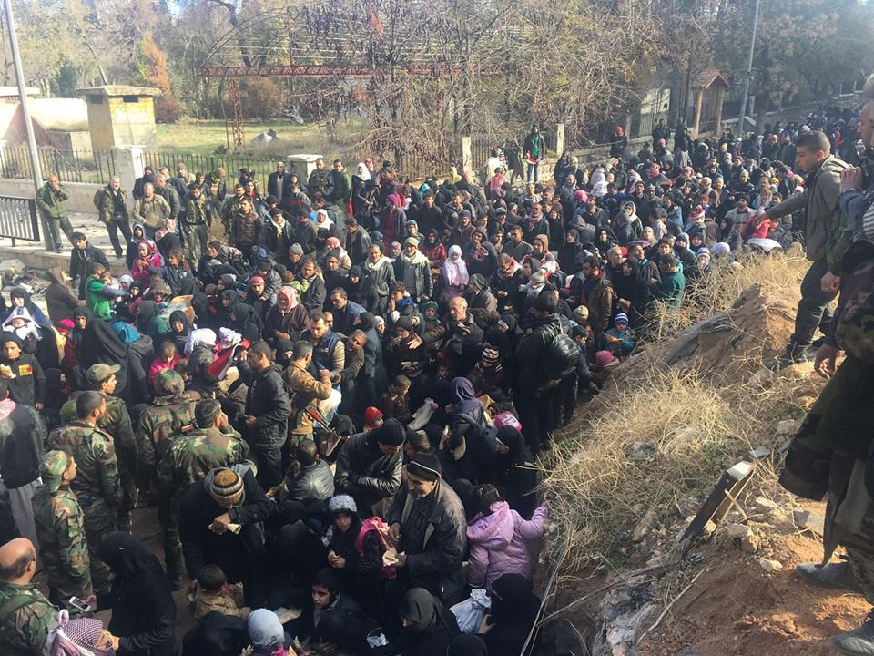
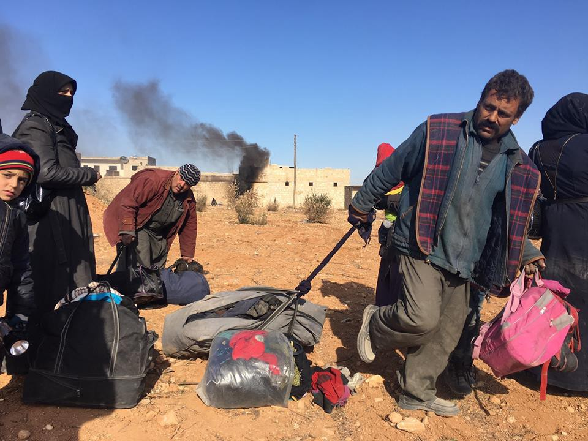

### AYS DIGEST 08/12: Dublin returns to Greece — what does it mean?

](assets/e62161d1cecb/1*KCpGqU4QsxZ7qwtd16B-RA.jpeg)

Photo by [**Samos Volunteers**](https://www.facebook.com/samosvolunteers/?fref=nf)
#### **Protests over bad conditions in camps once more/Refugees write letter to Hungarian government/Danish MP suggests shooting at boats with refugees/8162 people relocated from Italy and Greece so far**
### Feature
#### The European Union has suggested that member states can start deporting refugees back to Greece from March\.

Brussels now hopes the move will help to restore the bloc’s migration policies, which collapsed under a mass influx in 2015\.
#### What’s at stake in this proposal?

The European Commission wishes Greece to fix its migration system and resume taking in asylum seekers from mid\-March next year, which would put an end to its exemption from the EU’s “Dublin rules” on asylum\. Under this agreement member countries which are the first point of entry for people seeking asylum in the EU have an obligation to process their application, and take them back if they have traveled on to other EU countries without authorization\. Transfers from other EU countries to Greece were suspended in 2011, however, after the European Court of Justice and the European Court of Human Rights ruled that conditions in Greek facilities for asylum seekers were unacceptable\.

Now a new proposal from the Commission says:

> “It is recommended that the transfer of asylum applicants to Greece … should be resumed\.” 

Many countries, such as Austria, Germany and Denmark, have reimposed border controls in response to the refugees crisis causing the temporary suspension of Schengen, the passport\-free travel zone and are likely to only remove them if they can send back asylum seekers to the country where they first set foot in the EU\. The commission now considers that Greece has improved in hosting and registering arriving asylum\-seekers and that normality should be re\-implemented\.

EU leaders will hold a summit in Brussels next week and the current state of the Dublin agreement will be certainly be in their agenda\.

Full respect of EU law is required but given the deficiencies in the Greek asylum system there will still be an exemption to this new proposal in the case of “vulnerable applicants” such as **unaccompanied minors\.**

There are also plans to help Greece to “de\-densify” the islands, including a request for other EU countries to accelerate the relocation procedure and take at least 2,000 migrants from Greece by the end of December\. That would be double the number of relocations in November\. Brussels has also agreed an action plan with Athens to help “alleviate the pressure on the islands” by **speeding up the returns of asylum seekers to Turkey** under the EU\-Turkey agreement\.
#### What are the consequences?

Human rights and refugee agencies have said Greek facilities remain so overcrowded they will simply be unable to cope with the extra migrants\.

Due to reluctance by EU states to take in people from Greece and Italy to help process their asylum requests and ease the burden on the two frontline states, fewer than 8,200 people have been moved from these two Mediterranean countries to other EU states under a plan that was supposed to cover 160,000 people and which expires next September\. There are at the moment about 62000 refugees stuck in Greece, 16000 of which living in inhumane conditions in overcrowded hotspots on the Islands\.

Eva Cossé, Human Rights Watch’s Athens\-based Western Europe researcher, said the facilities in place in Greece were not robust enough to process any more refugees\.

> “In a time of deep economic crisis the exceptional number of arrivals by sea, border closures along the Balkans route, a flawed EU\-Turkey deal, and a lack of EU solidarity are putting a strain on Greece’s ability to effectively deal with the mass arrival of migrants, asylum seekers, and refugees” 

> “Reinstating Dublin returns to Greece would not only be unfair for Greece, but above all it would be catastrophic for the rights of asylum seekers fleeing war and persecution and seeking refuge in Europe\.” 

Also Sacha Myers, based in Greece with Save the Children, said the charity was very concerned\.

> Asylum seekers continue to arrive in Greece as the main drivers forcing families to leave their homes — such as war, persecution and extreme poverty — remain unresolved\. “The processing of asylum claims in Greece is also moving at a snail’s pace and some families have been languishing in camps for nine months now waiting for their application to be processed\. 

> “It’s inconceivable how the EU can propose sending more people to live in these conditions but it’s also unsurprising, considering Brussels’ track record on migration policies so far\. 

Nevertheless the European commission is proposing only suggesting country members to act in a certain way and it’s not guarantied that these measures will actually be adopted by any of the stated giving the difficult situation in Greece\.

It’s also important to underline the strength of this recommendation and as per the [European glossary](http://ec.europa.eu/civiljustice/glossary/glossary_en.htm#Recommendation) , in Community law, it says: **a Recommendation is a legal instrument that encourages those to whom it is addressed to act in a particular way without being binding on them\.** A recommendation enables the Commission \(or the Council\) to establish non\-binding rules for the Member States or, in certain cases, Union citizens\.

In the end we understand that, if community countries were to start applying this new rule, **it would only apply to people that travels from Greece to another European country after mid\-March 2017\.**
### Syria

Western diplomats have conceded that there are no technical obstacles to a plan to deliver airdrops of food and medicine to Aleppo using a GPS\-guided parachute system, but the scheme has been stalled in the face of reluctance among military commanders and an absence of political will\.

According to the plan there are three identified feasible landing points inside east Aleppo\. An initial delivery of 20 pallets and the flights could depart from RAF Akrotiri in Cyprus or the Incirlik air base in Turkey\. The ICRC could potentially verify that packages were for humanitarian purposes alone\.

However, although the plan has been generally embraced by diplomats, there has been resistance from western military officers\.

“One military was so reticent they denied the capability even existed”

Discussions about air\-dropping food into Aleppo and other besieged enclaves have been under way for months in Washington between US and UK officials, but have been stalled over inter\-agency disagreements\. Meanwhile, rebel\-held eastern Aleppo has been overrun by pro\-regime forces led by Lebanese Hezbollah and Iranian\-led Shia militias supported by Russian and Syrian regime aerial bombardment\.

On Wednesday about 150 civilians, most either disabled or in need of urgent care, were evacuated from a hospital in Aleppo’s Old City — the first major medical evacuation from the eastern sector\. They had been trapped there for days by nearby fighting, a spokeswoman for the International Committee of the Red Cross said\.

Photo by Fred Pleitgen

Photo by Fred Pleitgen
### Greece

There was another protest today in a refugee camp in Greece because of the bad conditions people are forced to live in\.

Refugees at the recently re\-opened Koutsohero camp blocked the road in front of the camp while they made their demands\. Their concerns were:

> The food is insufficient, flavorless and tasteless, besides there is no doctor within the camp, only nurses in the morning and without prescriptions\. The only organisation we have is the DRC, and it’s incapable to provide all the refugees needs because generally we lack everything even the simple kitchen\. All the other camps are taking salaries monthly but we aren’t\. So we need salaries to be able to provide our simplest widgets\. One of the most important things is that we want the humanitarian organisations such as the Red Cross, IRC, Praksis and Drop in the ocean, because all of these NGO’s were covering our needs in the previous camp\. The worst thing here is that we do not have a school for the children, neither any kind of activities \.the coverage for the mobile’s network does not reach the camp especially vodafone, so the people will miss their appointments and stay isolated from the outside \. The wireless connection does not reach inside the Isoboxes, so we have to go out side near to the army’s compound to get it under the rain and the severe cold\. 

#### Refugee Art Exhibition from Katsikas

After having lived in Greece for more than 8 months, the community from Katsikas Camp would like to host you and make you discover the richness of their countries\. From painting and art crafts over traditional clothing to culinary arts, the exhibition allows you to experience the variety of their cultures and traditions\.

](assets/e62161d1cecb/1*qVzTNzqSbv0NJeyffXEG0g.jpeg)

Photo by [**Bubbles of Hope**](https://www.facebook.com/Bubbles-of-Hope-1572917856059618/)
#### Athens

[Report](https://www.facebook.com/groups/204202716585823/?fref=ts) by Sumita Shah:

A couple of nights ago, there was some unrest at two of the squats \(22 Acharnon and 2nd School \(formerly known as Jasmine\) \) — this resulted in violence with make\-shift weapons\.

Unfortunately we get reports that those who instigated the violence are still around in the squats\.

Some of the volunteers attending this evening’s meeting will be raising this issue of lack of safety\. In addition, we ask any volunteers working at these squats or any of the squats generally to discuss with \(indeed pressure\) squat leaders to remove these guys as quickly and as efficiently as possible\. It should not be the case that they are allowed to stay and vulnerable families are forced to leave because of the violence or indeed that vulnerable families live in fear and threat of further violence\. Indeed, it is difficult for us to recommend that volunteers work at squats if we know there is a likelihood of potential violence\.
#### Islands

Today’s arrivals on the islands were:

Lesvos: 6

Chios: 40

Samos: 24

Total: 70
### Serbia

[**NorthStar**](https://www.facebook.com/NorthStarSerbia/) has been preparing shelter for refugees at Kelebija\.

> After several days of cleaning, the tents are ready and warm for people to thaw out\. Overnight temperatures are a horrifying \-6 with a real feel of \-10\. It’s cold INDOORS now, so we are so grateful for the support of [Doctors Without Borders/ Médecins Sans Frontières \(MSF\)](https://www.facebook.com/msf.english/) via their heated tent we manage\. We have instituted a No Shoes policy in the MSF tent, and have a handy set of shoe racks to keep things organized\. We are currently serving between 50–80 people per day, several times per day for tea and charging\. The goal is to set up a mobile router by the end of the week\! 

You can support the clicking on the [link](https://www.youcaring.com/kelebija-community-center-675966) \.
### Hungary

From Hungary we have news of a desperate appeal\.

We got a cry for help from Körmend where 20 people were transferred yesterday\.

](assets/e62161d1cecb/1*_j-VsJQX9FMpJX7CdCVBZA.png)

Photo by [MigSzol Csoport](https://www.facebook.com/migszolcsoport/)
### Denmark

Security forces should shoot at the boats of migrants trying to reach the European Union illegally, a member of parliament for the Danish government’s main political ally, the Danish People’s Party, suggested on national television\.

> “The only efficient way is to turn the boats and say: ‘You cannot sail within this national border and if you do, you will either be shot at or be turned around and sailed back,” Kenneth Berth, the EU spokesman for anti\-immigrant party” 

Berth later softened his statement on Facebook, saying he did not mean that people should be shot at, but that NATO\-ships could shoot in the air as a warning\.

The Danish People’s Party got 21 percent of the popular vote in last year’s general election, making it the second\-largest party in parliament\.

It seems that insanity keeps growing in Europe, whilst refugees rights seem to decrease\.
### Relocation

Of the total of 8,162 people in the EU, 6,212 were relocated from Greece and 1,950 from Italy\. France is the country that received the most people since the program began in July 2015, with a total of 2,373, followed by the Netherlands \(1,098\), Finland \(901\), Portugal \(720\) and Germany \(615\) \.

The Commission considers that by September 2017 it should be possible to transfer to Member States all eligible applicants in Greece and Italy\.
In order to achieve this objective, Member States are to carry out monthly, from now onwards, at least 2000 relocations from Greece and 1,000 from Italy\.
From April 2017, at least 3,000 monthly replacements will have to be made from Greece and 1,500 from Italy\.

_Converted [Medium Post](https://areyousyrious.medium.com/ays-digest-08-12-dublin-returns-to-greece-what-does-it-mean-e62161d1cecb) by [ZMediumToMarkdown](https://github.com/ZhgChgLi/ZMediumToMarkdown)._
