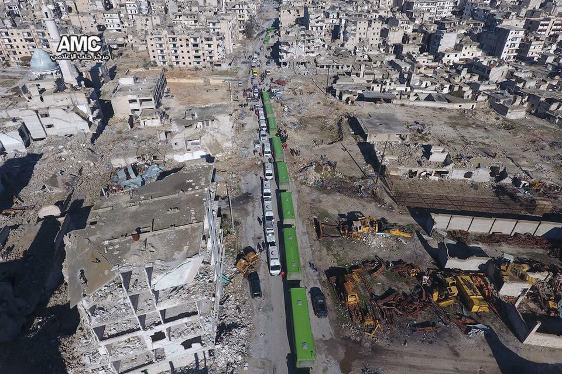

### AYS DIGEST 15/12: The evacuation of Aleppo begins
#### Demonstrations of Solidarity around Europe/ Numbers of refugees in the Greek camps decrease/ Germany deports first group of Afghans/ Refugees getting arrested in Italy

Photo by Hasan Katan/AMC
### Feature

By the end of today more than 2,000, including 200 fighters and 108 wounded people, have been evacuated from besieged districts of east Aleppo\.

This was possible thanks to a deal between Turkey and Russia and overseen by the Red Cross\.

Thousands more are expected to make the journey in the coming hours and days\.

The evacuations was carried out using ambulances and green buses provided by the Syrian government, a convoy of 13 ambulances and 20 buses transported nearly 1,000 people to a rebel\-held town west of the city, and then returned to pick up a second group\. The International Committee of the Red Cross \(ICRC\), which is overseeing the evacuation deal along with the Syrian Arab Red Crescent, said the evacuations would continue through the night\.

The UN said the operation involved the evacuation of the sick and wounded, vulnerable civilians, and fighters and estimated the number of civilians to be evacuated at 30,000\.

](assets/7754a60a5b5f/1*pR5CKgxrAeW3u4ceHJW21w.jpeg)

Photo by [**Rami Jarrah**](https://www.facebook.com/ramijarah)

This new deal to evacuate the people of east Aleppo came after the failure of an agreement the previous day over Iranian objections and now, as a concession to Tehran, which is backing the militias spearheading the offensive into Aleppo, wounded civilians will be evacuated from Fua and Kefraya, two Shia villages in the province of Idlib that have been surrounded by rebels\.

Despite the apparent calm of the operations there were reports of violence during the day\. In fact there was information in the morning of Iranian and Hezbollah militias shooting at ambulances carrying wounded people leaving one dead\.

An Aid worker, Abdul haq, from Anaya Aid did the following report:

> It was planned that 50,000 Aleppo besieged residents would be released today\. However after a long day, 1,500 Aleppo residents were released, including many families, women, children and the injured\. The process inshahaAllah will continue tomorrow\.
 

> At 8\.30 am the C\.H\.U\.G\.S\. team left for the District of Aleppo\. A team of 4 emergency vehicles \(2 donated by Anaya Aid Charity\) and a truck loaded with john west ready meals, water, cakes, biscuits, blankets and sweets were taken to a nearby location about 5 minutes from the extraction point\.
 

> Many hours later the vehicles collected at extraction point 1\. 1 km further down is extraction point zero where the injured and residents of besieged Aleppo were dropped off\.
 

> Our dear brother Mohammad Shakiel Shabbir was at point zero, coordinating with other Aid Relief organisations\. 
 

> To scupper the evacuation process it was reported that a shot or shots were fired by regime allies\. It was further reported that an Russian airstrike was launched at the perpetrating group in another area\. Both sides were warned by Russia that any attempt to disrupt the process would have repercussions\. 
 

> At 2 pm all the emergency extraction vehicles collected at extraction point 1\. It is reported that a total of 116 emergency vehicles were organised for extraction of the injured, as well as buses and coaches to ferry the released besieged residents of Aleppo\. C\.H\.U\.G\.S\. food and blanket truck was taken to extraction point zero and distributed to the besieged residents of Aleppo as they were being released\.
 

> At 3pm a jet launched 3 blanks into the sky right above the emergency vehicles\. Reportedly it was a Syrian jet to cause havoc\. 70% of the emergency vehicles evacuated but later came back\. It was reported that any further incursions into this airspace would be shot down by Russia\.
 

> Later it was reported that a Russian jet was dispatched\. As a precautionary measure to safeguard C\.H\.U\.G\.S emergency vehicles, an amanah \(trust\), the vehicles were spaced out at extraction point 1 in the event of airstrikes\.
 

> However many will move into refugee camps, border areas and various locations within Syria, with meagre possessions and little support\. 

](assets/7754a60a5b5f/1*JGCkraUS-ZMZcYFjtSigNw.jpeg)

Photo by [**Free Syria — Salam**](https://www.facebook.com/Free.SyriaSalam/)

The last informations we got about today’s evacuation, by [Kenan Rahmani](https://www.facebook.com/kenanrahmani?fref=nf) , say that a group of buses with 1150 refugees, have safely reached northern Idlib, where the people are being distributed to different towns\. Bibars Mishaal, the White Helmet who was shot today, is still in bad condition after having surgery\. The second convoy of 1195 evacuees has crossed over into the western countryside of Aleppo\.

After years of fighting the rebels couldn’t go on and had to finally leave the city but many feel they haven’t yet been defeated, leaving Graffits behind saying:

> “We will return, Aleppo\. Our destroyed buildings are a witness of our resistance and your criminality\.” 

Others with less optimistic approaches sadly wrote:

> “Under every destroyed building are families buried with their dreams by Assad and his allies\.” 

### Across Europe

It has been common to see how the European governments pretend that nothing is really happening in Aleppo and once more it was the public that mobilized itself in support of the suffering people trapped in the city\.

In many cities the message was the similar:

In Berlin

](assets/7754a60a5b5f/1*rvMw4sv_IlDq5Fk4rvF9ug.jpeg)

Photo by [Horst Müller](https://www.facebook.com/horst.muller.7)

In Amsterdam

](assets/7754a60a5b5f/1*EYolPWPnSmaoc1VulzPL5A.jpeg)

Photo by [David Hup](https://www.facebook.com/david.hup.3)

In Copenhagen

](assets/7754a60a5b5f/1*_fkk3RwkfZx8KjpWWSuOTg.jpeg)

Photo by [The Local](http://www.thelocal.dk/20161215/thousands-of-danes-show-support-for-aleppo)
### Greece

The refugee camps in Greece, especially in the north have seen a big reductions in the numbers of people they host in the last 10 days\.

Due to the arrival of winter and the consequent bad deteriorating of the conditions on the ground some camps had to be evacuated completely and the refugees relocated to more habitable places like apartments and hotels\. It’s not clear if this procedure will continue and if it will be long term or the authorities will prefer to invest in the camps and make them more suitable but the first has been the tendency for the last few weeks and we can only hope that the rest of the refugees living in hard wintery conditions, with sub\-zero temperatures and some times no heating will get the same treatment\.

As per the official numbers Serres, Petra, Kavala, Drama and Cherso are now closed, although the last one saw about half of it’s residents being sent to a refurbished camp, further south next to Larissa, known as Koutsochero\.

At the same time other camps saw a dramatic reduction in the population like Softex that has now about 500 less people than 10 days ago\. Although the biggest reductions happened in the north of Greece, Malakasa, a camp just north of Athens, reduced it’s population by 50% and has now just above 400 people\.

These moves caused a huge increase in the numbers of people being hosted in apartments and hotels, 500 more in apartments and 2000 more in hotels across the country\.

Nevertheless it’s hard to say where, in reality, everyone went\. Its possible that some people have been relocated in another country or just simply smuggled itself out of Greece like many still do\.
#### Islands

Today there were registered 44 arrivals on the north coast of Lesvos\.

On Chios there has been a big drop since Monday from 1183 to 810 living in the so called structures bringing the total on the island to 3912\.
#### Mainland

[Refugee Support Greece](https://www.facebook.com/RefugeeSupportGreece/) is looking for volunteer kids in the UK to become penpals with kids at Alexandreia as part of their new initiative to help bring the world together: Refugee Penfriend\. Ten of the children on the camp have got together to start it off by writing this moving letter\. More details [here](http://www.refugeesupport.eu/would-you-like-a-syrian-penfr…/) \.

There’s also a call for [donations](http://www.collectivecalling.org/thank-you-for-donating.html) from this group stating:

> In times of great despair and darkness, everyone that has helped, have beamed light down on those suffering and shown them that they are not alone\. The people here are extremely grateful and wish to be able to live a normal life again one day, in the meantime everyone’s support and compassion really does help a lot\! 

](assets/7754a60a5b5f/1*0or1t0CITkPM6q_8NDCp-w.jpeg)

Photo by [**Refugee Support Greece**](https://www.facebook.com/RefugeeSupportGreece/)

Volunteers in Thessaloniki decided to organise a **peaceful demonstration** outside the Russian consulate and its taking place **tomorrow \(16/12\) at 4pm\.** Refugees from Orerokastro will join as well, and they hope even some people from Softex will come\.

> “Our aim this time is to get as many volunteers to come as we want to show our countries back home that even though our governments remain silent, we are here and we want out governments to JOIN US in helping refugees and intervene the Aleppo evacuation,” Erika Rudash, one of the organizers told us\. 

We encourage anyone to join them supporting the devastated people from Aleppo\.
### Germany

On Thursday morning a flight carrying 34 rejected asylum seekers arrived in the Afghan capital, Kabul\. They were the first people to leave Germany in a highly contested programme of “collective deportations”\.

The mood was bad among the deported men\. Some were sad, others were angry\.

A young man, Babur Sedik, said that he had spent four years in Germany and had never made it out of a refugee camp\.He also said he has no idea what to do next\. He comes from Kabul province, which is still relatively stable\.

> If the security situation doesn’t improve and I don’t find work, then I won’t have a choice — I’ll have to flee again\. 

These so\-called _Sammelabschiebungen_ \(collective deportations\) have resulted in protest due to the unstable security situation in Afghanistan\.

According to the UN, the first six months of 2016 saw the highest civilian casualties in the civil war since records began in 2009: 5,166 people were killed or maimed during that period, a third of whom were children\.

Several hundred people turned up on Wednesday evening at Frankfurt Airport, from where the flight to Kabul took off, to protest the deportations\.

Anton Hofreiter, leader of the Green Party in the German parliament, called the deportation programme a “callous game”, while the doctors’ organization IPPNW said it showed a disregard for human rights\.

Its not only in Germany where these deportations have started\. Sweden, another major host country for Afghan asylum seekers, had organised a similar flight of returns on Tuesday\.
### France

In Paris the situation is still very hard\. More people are arriving every day and there is no space to host them so the camp at St\. Denis that was supposed to be cleared today keeps growing\.

In la Chapelle, refugees queue for hours just to try to get shelter but many have not spent days trying as the place is full and the process is too slow\.

This is how volunteers characterize the centre:

> “TAKE THE LINE” — Welcome of the “Center humanitaire” on 15 December 2016 in Paris\. 

> In hopes of entering the humanitarian center of La Chapelle, asylum seekers lined up every night in front of the bull, with only the few blankets and hot tea from the Asso Utopia56\. 

> Only a forty will return this morning at 8am\. Once this quota of the day is filled \(in 20 minutes for a night of waiting\), the following persons in the queue are scattered, to reform a new one in the afternoon\. Some have tried their luck for six nights in this arbitrary and inhuman system\. 

](assets/7754a60a5b5f/1*ge0FNhMW7xm7I-iSEbVQtw.jpeg)

Photo by [**Rose Lecat**](https://www.facebook.com/rose.lecat)

](assets/7754a60a5b5f/1*4hjNfmt5NTAW25t1HFJnVg.jpeg)

Photo by [**Rose Lecat**](https://www.facebook.com/rose.lecat)

Also today [Care4Calais](https://www.facebook.com/care4calais/?fref=nf) made this apeal:

> As the winter draws in and temperatures drop, life for refugees gets harder\. 
 

> But together, we can change this\. 
 

> By donating to Care4Calais, you can make a huge difference to the lives of thousands of refugees living in some of the worst conditions across northern France\. 
 

> Your money will help to provide warmth, food and shelter to adult and children refugees during these harsh winter months\. 

Donate [here](https://mydonate.bt.com/charities/care4calais)
### Italy

This year alone, the Italian authorities have already detained more than 400 people in Sicily’s ports suspected of smuggling migrants\. However, the authorities themselves believe that many of these detainees are also victims of organized trafficking networks\.

Refugees are forced by smugglers to man the boats they payed to cross the sea to Europe and when they arrive they are accused of smuggling and face between 5 and 15 years in prison\.

A judge, Gigi Modica, has said that its evident that the migrants aren’t part of these organisations but the victims\.

Each migrant pays around 2000 euros for the trip to Europe and sometimes some agree to sail the boat in exchange for a free trip which will put them in an even more vulnerable situation if they manage to arrive to the coasts of Europe\.

_Converted [Medium Post](https://areyousyrious.medium.com/ays-digest-15-12-starts-the-evacuation-of-aleppo-7754a60a5b5f) by [ZMediumToMarkdown](https://github.com/ZhgChgLi/ZMediumToMarkdown)._
