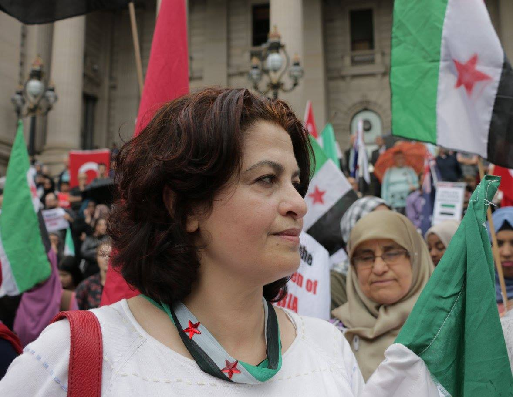
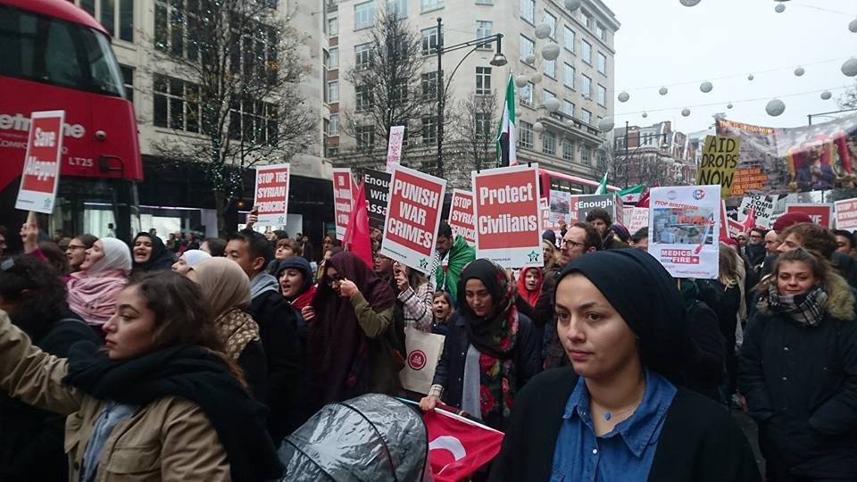
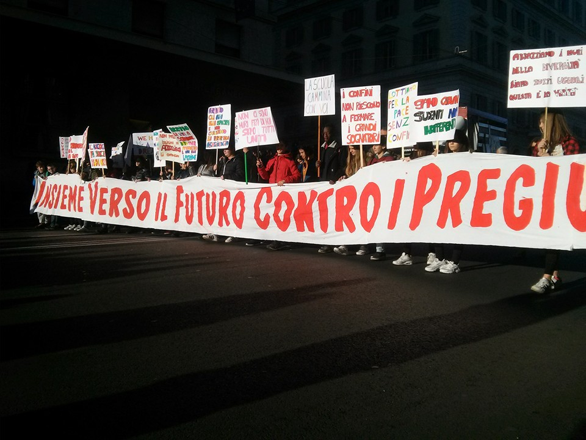
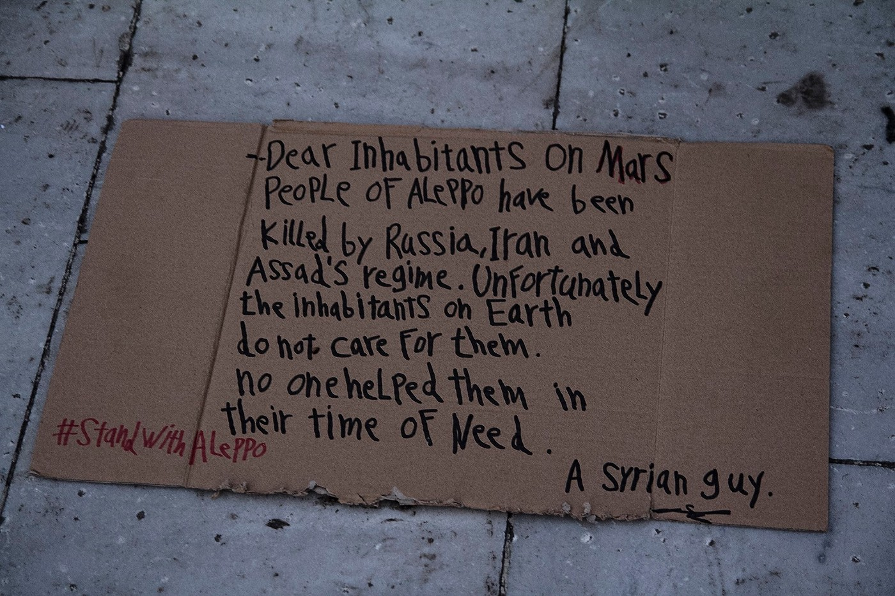
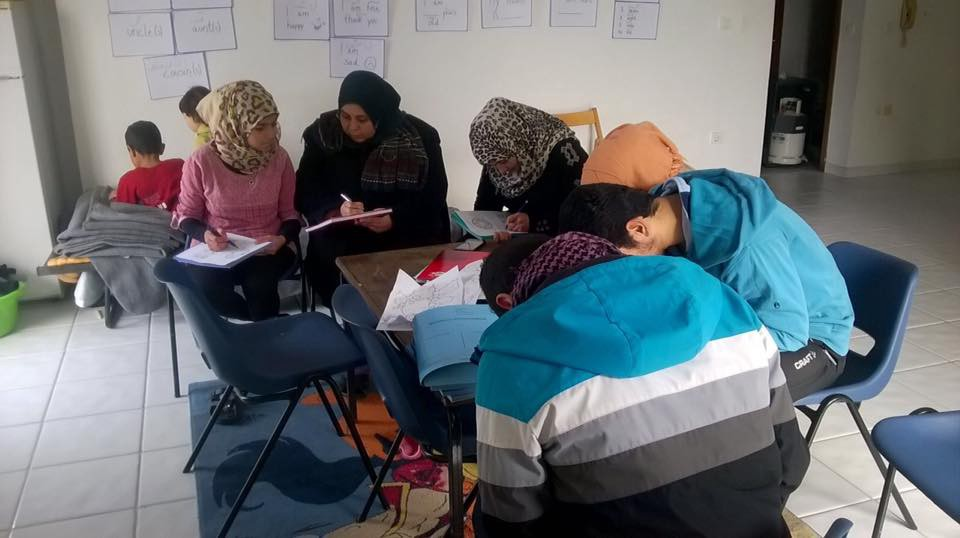
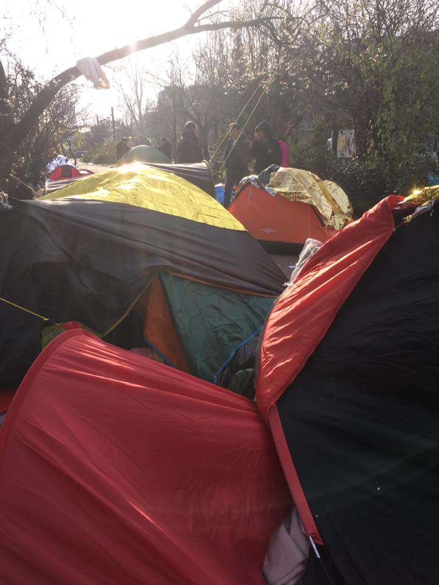
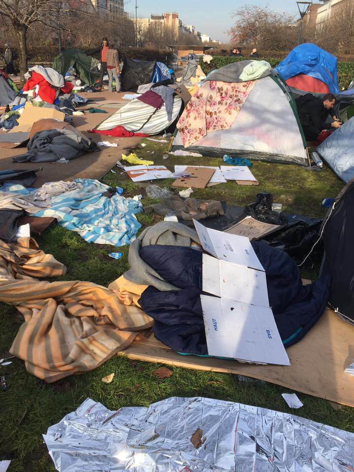

### AYS DAILY DIGEST: 17/12/2016: Thousands of people facing catastrophic situation in Serbia

_Urgent plan needed for all the people sleeping rough in Serbia // Refugees suffer violence and abuse in the Balkans // 63 people found in a burning van on a highway in Croatia // Evacuation of civilians from Aleppo still under negotiation // A quarter of refugee children in Lebanon are working between 11 and 15 hours per day // People in Oreokastro with no electricity for days // Austrian police controls trains from Italy in search of people who are trying to find their way through the fortress Europe_

 , Belgrade\.](assets/4827e7437e85/1*h0iqu6yVwHU7XyP8G_et8g.jpeg)

Play it again Hazizi… One of the rear moment of rest for people who are living in overcrowded wear\-house in Belgrade\. Photo [Igor Čoko](http://igorcoko.net) , Belgrade\.
#### Serbian government without a plan to help homeless refugees

If a sustainable shelter plan is not found very soon, the situation could become catastrophic for almost 2,000 people who are sleeping rough in streets and different squats in Serbia\. Most of them are in Belgrade and at the Northern border with Hungary\.

This time of the year, temperatures in Serbia are below 0\. All the existing centers and camps are overcrowded\. And people are still coming\. Today, only in Miksaliste center 293 persons come to ask for assistance\. There was 60 to 80 people, mostly many, in Kalebija last nigh\. Many of them are unregistered and trying to cross the border by themselves\. The transit zone itself still has plenty of people because they keep being transported to the border \(all vulnerable cases are transported by IOM from the camps\) theoretically a day before the cross\) \.

People who are trying to cross by them selves, usually do not make it that easily and many of them stay out in the open, where they sleep and live\. They receive some hot meals from the Red Cross and some NGOs distribute new clothing and other goods\.

People who are staying out in the open are very vulnerable\. Many of them are very young, some unaccompanied minors\. They are more likely to get sick and contract respiratory tract infections, flu, and frostbite, MSF, which offers help to them, claims\. People also have no or very limited access to sanitation and hygiene, which makes them even more exposed to different skin diseases such as scabies and body lice\.

](assets/4827e7437e85/1*ZHYV6iv9iToSCRZz110GTw.jpeg)

Taking care of hygiene in \-4\. Photo [Igor Coko](http://www.igorcoko.net)

At the same time, conditions in the existing camps are far below what could be called human or decent\. Previously we reported about the bad condition in Adasevci camp and Presevo\. MSF warns that, as a result, relocating people into the existing camps is not a viable option\. 
 
Additionally, MSF reminds about the fact that many refugees and migrants are exposed to cross\-border violence\.

> “The militarization of the EU borders has led to a staggering increase in violence\. MSF data show that nearly one\-in\-three patients attending MSF clinics in the Balkans reported abuse and violence, including women and children\. At the border with Hungary, the situation became so acute at the end of August that MSF teams in Serbia were forced to refer some patients to hospitals due to the severity of their wounds\. While smugglers may bear the responsibility for part of this violence, patients report that at least half is perpetrated by state authorities, responsible for push backs, deportations, and expulsions\.” 

Most of the people who are in such a dire situation in Serbia are from Afghanistan\. However, there are more and more people from Turkey on the so called Balkan route\.

 \.](assets/4827e7437e85/1*ZxGUutRM3YlILFyOm6Iq9g.jpeg)

“When you are 10, with no body to take care of you, alone, in far away Serbia you came from Afghanistan, an you have to take care of everything and have no idea what tomorrow will bring\. This is a story about the youngest refugee in a wear\-house in Serbia where people are living\.” By [Igor Coko](http://www.igorcoko.net) \.

On Saturday nigh, a Kurdish family from Iraq was referred to Bosilegrad camp, Serbia, but they were taken from the regular bus ad unlawfully expelled to Bulgaria\. People were left in the woods at — 11 degree\. They were found in the early morning by the local police\. Two women were treated for hypothermia\.
#### Syria 
Another day of pain ad suffer for civilians of Aleppo

More civilians are being killed every day in Syria\. Today, a new deal was negotiated to complete the evacuation\. By afternoon, no sign off evacuation was visible\.

The International Committee of the Red Cross \(ICRC\) said thousands of cold, scared and injured people were still in east Aleppo waiting to leave\.

Finally, the [UN High Commissioner for Refugees Filippo Grandi spoke](http://www.unhcr.org/news/press/2016/12/58553e114/statement-aleppo-un-high-commissioner-refugees.html) about Aleppo\. He called for all the military actions to be halt immediately\.

> “All remaining civilians must be allowed safe conduct out from Eastern Aleppo\. Priority must be placed on saving lives\. Civilians should not be hostage to negotiations\.” 

Solidarity marches are still going on all around the world

London \(Syria Solidarity UK\), Rim \(Baobab Experience\), Melbourne \(Jess Davis\), Hannover \(Syrisches Haus Hannover SHH\)

Photo by Through Refugee Eyes\.
### Lebanon
#### Children forced to take care of their families

[International Rescue Committee published shocking information](https://www.rescue.org/press-release/new-survey-reveals-extent-hardship-and-abuse-experienced-syrian-children-working) about Syrian children, refugees in Lebanon, between the ages 6 and 10, who are working 10\-hours a day, six days a week, selling goods on the street to make money for their families\. An estimated 1,500 children work on the street of Lebanon

This organization conducted a surveyed among 173 refugee children in Beirut and Tripoli\. A quarter of those children said they worked between 11 and 15 hours per day\. In addition, 63% of those questioned said they had experienced violence\.

Another alarming area of neglect for these children is that many of them have been out of school for more than two years\.
#### Call for volunteers

Volunteers are needed in Lebanon\. [SB Overseas](https://www.facebook.com/groups/SBLebanonVolunteer/) is looking for people to join them from January to February 2017\.

Volunteers will teach English and other subjects to women and children in two of our schools for refugees in Lebanon\. For more information visit their [FB page](https://www.facebook.com/groups/SBLebanonVolunteer/) \.
### Greece

> Today, 27 people were officially registered as new arrivals to the island of Leros\. This is the first group at Leros since mid\-November\. 

#### Help urgently needed in Oreokastro

Another bad day in Oreokastro\. Yesterday, residents of this camp protested because of the often power cuts and general conditions in the camp\. Apparently, five people were arrested but we do not have official confirmation of this\. Today situation is no better\. No electricity in the morning, [The Vices of Oreokastro](https://www.facebook.com/ThevoicesofO/) claims\.
#### Statement of support for squats by Khora

People from [Khora](https://www.facebook.com/KhoraAthens/?fref=nf) issued a statement of support for work on squats in Athens, due to recent _“misconceptions about the situation in Athens and in particular the description of the squats housing refugees in the city\.”_

> “Many Greek and International people, as well as the refugees themselves, have given their time and energy to making the squats homes and thus keeping families and young children from living on the streets\. Self\-organisation and solidarity movements are the only way that we can provide for stateless people when governments and NGOs are failing\. Due to the lack of spaces for people, and often terrible living conditions in official camps, it is important to recognize that the squats provide an essential frontline service and that this is only possible due to the hard work of local people\.” 

Full statement you can find on their [FB page](https://www.facebook.com/KhoraAthens/?fref=nf) \.
#### Help needed in City Plaza squat

People in City Plaza in Athens, need your help\. There are 400 people living in this place, 126 rooms, and 7 floors\. The place was abandoned hotel for 7 years, before refugees, volunteers and solidarity activist occupied it in April this year\. Until today, City Plaza remains supported exclusively through political solidarity and individual donations\. To keep this project going, please visit their [fundraiser page and](https://www.youcaring.com/refugeeaccommodationandsolidarityspacecityplaza-716186) , if you can, donate\.
#### “We live together\. We work together\. We struggle together\.”
#### The Open Cultural Center to continue working

Good news from Polikastro\. Our friend from the Open Cultural Center, which operated in Cherso camps that was recently closed down, will open a new space in this small city\.

Many refugees were moved from the camp to private and hotel accommodation to Polikastro\. Green Light has been given by Ministry of Education to OCC to run this project\. Before the new center is open, the OCC volunteers are teaching in the family houses\.

Photo by OCC\.
### Italy

> Last night [volunteers](https://www.facebook.com/comosenzafrontiere/posts/637662203062510:0) found 87 persons, including one woman, and one minor, sleeping in the streets of Como\. The temperature outside was \-1 degree 

### Croatia
#### 42 people taken to hospital after found in a van on a highway

Last night, a van full of refugees was found on a highway\. Two Bulgarian smuggler were driving 63 people, including children, in a British truck\. The tires caught fire and the smoke went straight to the cargo space where people were hiding\. People, 42 of them, were in a bad shape and transferred to various hospitals in Croatia\. People who were in a van have not eaten for days\. People who were found are from Afghanistan and Pakistan\. Two Bulgarian citizens are arrested and they are facing charges in Croatia\.
#### Austria 
Police is checking trains from Italy

The media are reporting about Austrian borders being even more closely watched by the police\. This country closed its borders in March this year, but people on the move are still found their way in\. Some of them are using trains that are traveling from Italy during the night\. Police started controlling these trains\.

The decision comes after man and women from Eritrea were crushed to death while hiding on a train bringing trucks from southern Italy\.

Since early November, police in the Tyrol have picked up around 90 people heading for Germany\.

“We avoid catastrophes on a daily basis,” — Gerald Tatzgem, head of the anti\-human trafficking unit at Austria’s Interior Ministry told [Euronews](http://www.euronews.com/2016/12/17/trains-searched-in-austria-after-migrants-crushed-to-death?utm_source=dlvr.it&utm_medium=gplus) \.
### France
#### Volunteers needed in Paris

[People in the Motion group](https://www.facebook.com/peopleinmotion15/) visited today what was left after the eviction of over 600 people from the self\-established camp St Denise\. As they report, space has now been cleared and fenced off to ensure that no one can return\. Volunteers from [Rastplatz group](https://www.facebook.com/rastplatz/) provided food for all the people during the eviction\.

> “This was distressing to be witness to as you realized what little shelter and comfort people had were taken from them\. All possessions left behind\. Many people from the St Denis got onto coaches and then were taken to various locations including a gymnasium\. Once there people have a limited time to stay there\. Not everyone got on the buses, this meant that many more people will have slept on the streets last night\.” 

Poor conditions people at St Denise were living in\. Photo by People in Motion

[Paris Refugees Ground Support](https://www.facebook.com/PRGS.team/) predicts that things will take their usual cycle, more people will arrive and a new camp will form\. They are preparing for new arrivals\. Volunteer numbers are shockingly low\. All you good people, if you are in Paris, try to help\.

_Converted [Medium Post](https://areyousyrious.medium.com/ays-daily-digest-17-12-2016-thousands-of-people-facing-catastrophic-situation-in-serbia-4827e7437e85) by [ZMediumToMarkdown](https://github.com/ZhgChgLi/ZMediumToMarkdown)._
