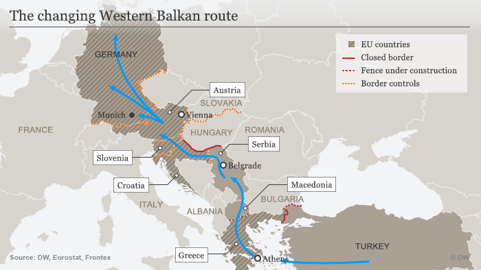
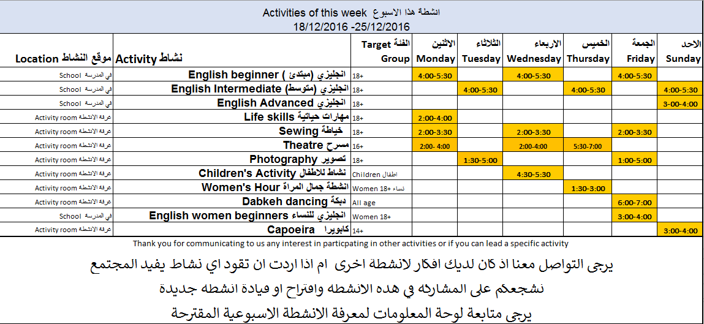
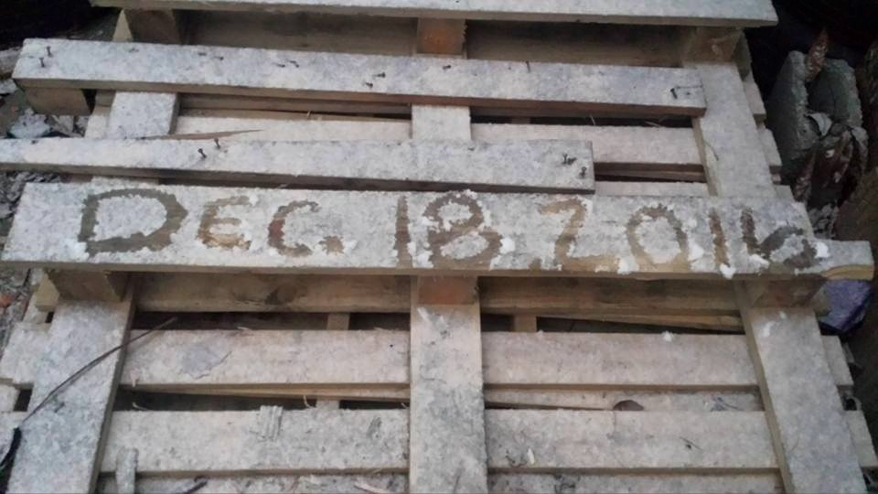
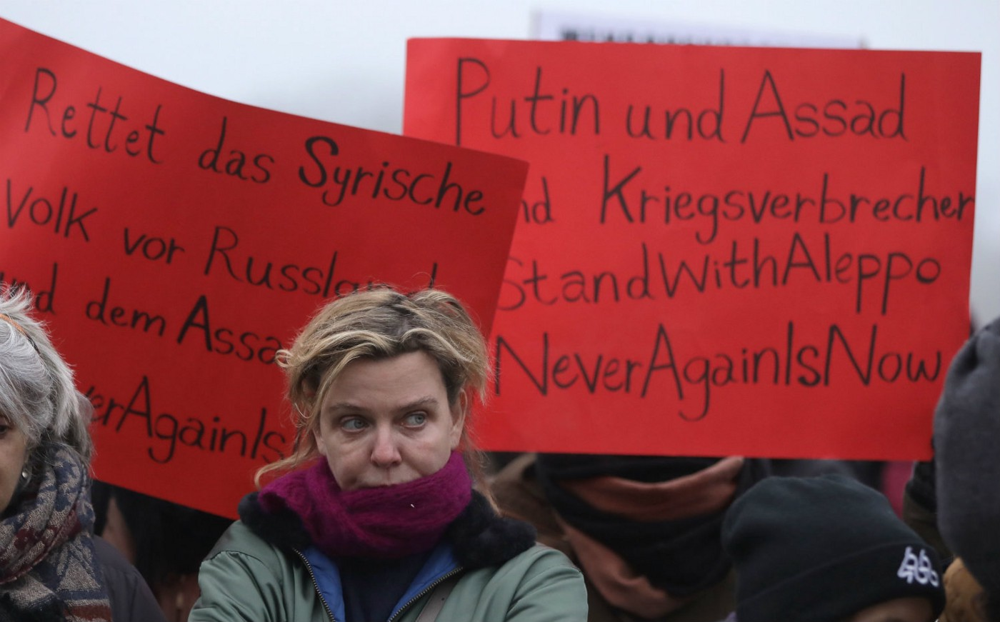

### AYS Daily News Digest 18/12: What happens to refugees caught smuggled through your country?
#### Syria — the evacuation deal slows down due to buses attack \| Greece — new arrivals on Lesvos; “closed” camps opening announced \| Serbia — lives saved after an attempt of illegal deportation; winter threatens refugees in Belgrade\| Croatia — smuggled refugees in hospitals, what happens next? \| Germany — rallies in support of the people of Aleppo; anti\-welcoming attitude for Afghans

Facing the European denial — No wall or closed border will discourage a person from fleeing their home to save the lives of their children\.
#### SYRIA
### Buses set on fire, stalling the long awaited evacuation

The initial plan to evacuate the last rebel\-held enclaves in the city collapsed on [Friday](https://medium.com/@AreYouSyrious/ays-16-12-uk-rejects-all-remaining-asylum-claims-for-refugee-children-in-france-f2fa4ab58a44#.9kqcgitg3) , leaving civilians stranded at various points along the route out without access to food or shelter\. On the way to evacuate people from the villages of al\-Foua and Kefraya, some buses were stopped and 3 of them were set on fire by an unknown group, thus slowing down a deal to allow thousands to depart from east Aleppo\.
Following these incidents, an estimated 50,000 people are left in the besieged city hoping the evacuation would continue\. Although the Aleppo evacuation convoy was eventually cleared to drive to rebel\-held al\-Rashideen, there was no official word on what impact the bus burning would have on the departure of more convoys from the city and the two villages, [Reuters](http://uk.mobile.reuters.com/article/UKNews1/idUKKBN14709W) reports\.
The UN Security Council agreed on Sunday to a compromise draft resolution on U\.N\. officials monitoring the evacuations from Aleppo, after Russia refused the previous draft by France\. While they review it is uncertain how many Syrian people will continue suffering from the cold, hunger and many injuries they’ve received as civilian victims of the fight\.

](assets/c1105865a3d5/1*QSFnzEAB56SYADDoAlU4Kw.jpeg)

Photo source: [Kenan Rahmani](https://www.facebook.com/kenanrahmani)
#### GREECE
### Arrivals

154 **people reached the coast of Lesvos today** , according to local sources, in 3 boats\. One landed in the south east coast of Lesvos with 32 Syrian men who were dropped off by smugglers, the second was picked up on the north coast by the coast guard and taken into Skala Sykaminia\. There were 55 people on board the second boat, 7 children, 15 women, 33 men, reportedly all very cold and wet\. The third boat was picked up off the north coast Lesvos by Frontex just of Eftalou, carrying 67 people who were all in poor condition\.

[Volunteers](https://www.facebook.com/MoonlightTrust/?fref=nf) heading to Lesvos in order to join others helping at the refugee camps during the coming holidays [need help](https://www.facebook.com/MoonlightTrust/posts/10154883343034645) in collecting donations\. Contact them if you can contribute\.

> 172,699 people arrived in Greece from Turkey this year\. 

### “Closed” centres to be opened despite the opposition to the proposal

Greek Migration Minister Yiannis Mouzalas called for the creation of “closed” reception centers on Aegean islands “to accommodate migrants who have displayed delinquent behavior in a bid to curb the outbreak of rioting at larger centers and to stop thefts and other petty crimes that have been testing tolerance in local communities”, [Ekathimerini](http://www.ekathimerini.com/214675/article/ekathimerini/news/migration-minister-eyes-closed-facilities-on-islands) reports\. These centres would accommodate around 150 people and the minister sees it as a necessary measure due to the slow process of relocation of the refugees stuck on the islands\.

577 thousand documented migrants from various countries are currently residing in Greece, according to a [Greek Forum of Migrants](http://www.migrant.gr/) [survey](http://greece.greekreporter.com/2016/12/18/about-577000-documented-migrants-reside-in-greece/) \. This number includes around 62,000 refugees who are now stranded in Greece\. On International Migrants Day the NGO called for the implementation of more policies to ensure the refugees equal inclusion in Greek society\.

 , one of the NGOs in mainland Greece providing an array of activities](assets/c1105865a3d5/1*Y_penqK8mq0GiLhZXiR21g.jpeg)

[InterVolve — International Volunteers](https://www.facebook.com/InterVolve-International-Volunteers-219418945063168/) , one of the NGOs in mainland Greece providing an array of activities
#### SERBIA
### 7 people saved from certain death after an illegal deportation

As we wrote yesterday, a group of Kurdish people who were registered in Serbia as asylum seekers were unlawfully taken off a bus, had their documents torn and destroyed\. They were then left in the woods, in the middle of the night, more than a kilometer from the state border — to die?
In the night, in deep snow, the temperature at \-11 degrees, a 2 year old child was the only one kept warm enough, unaware of what his fellow human beings, who were there “to serve and protect” had in mind for him and his family\. With the only mobile phone that was still working, the family sent an SOS message to an NGO in Serbia with their location\. Luckily enough, a few individuals from the local police and ER managed to find and rescue these people and they were placed in the reception centre in Bosilegrad\.

](assets/c1105865a3d5/1*byskbRPiCZhWIGP9DWtDMA.jpeg)

Screenshot by [Gordan Paunovic](https://www.facebook.com/gordan.paunovic.5)

Such illegal deportations have occurred several times lately, but in most instances as they are carefully planned and organized, so far most of the organizations engaged in helping refugees only have individual stories and a lack of evidence keeps them from making more concrete steps in the direction of putting an end to it and calling out those responsible for the problem\.
### Subotica — closing the day centre

> Today we’ve packed last boxes from our day center in Subotica that for weeks served as safe place for refugees in the region\. In that time together with [Novosadski humanitarni centar](https://www.facebook.com/NSHCentar/) we were able to support hundreds with nutritious food, hygienic products, charging stations and Internet connection\. We’ve been advising the ones in need of information and medical assistance, we’ve been carrying for unaccompanied minors\. We helped everybody and didn’t categorized people\. A soaked and hungry person without shoes deserves assistants regardless of their motivations to come to Europe\. 
 

> We faced many challenges in Serbia but we were always able to find a good solution to our struggles\. Unfortunately we reached our limit\. Political pressure does not allow us to keep our day center running any more\. We closed its door heartbroken but committed to continue working for refugees in the region\. We still deliver help to Kelebija and Horgos transit zone camps and we are working on new ways to support the ones that stayed in Subotica\. 

> Thank you to everybody who supported our work so far\. Your generosity helped many refugees in Serbia\. — [**Fresh Response**](https://www.facebook.com/freshresponseserbia/?fref=nf) 

### Belgrade — more need for help as the winter draws in

![The first real snow fall of the winter here in Belgrade\. Barely equipped for autumn, it is unclear how these 1000\+ people will handle winter\.
Shoes are worth more than gold, jackets not far behind\. Blankets, never sufficient\.
With so many unaccompanied minors, young men and vunerable people\- the same question we’ve been asking for months became more urgent today\. Who will present a solution to this current humanitarian crisis, and when?
Until then we press on, and wait for the answer\. — [**Refugee’s Anthem**](https://www.facebook.com/refugeesanthem/)](assets/c1105865a3d5/1*Kk4h8uALN24siuhl_AHlwg.jpeg)

The first real snow fall of the winter here in Belgrade\. Barely equipped for autumn, it is unclear how these 1000\+ people will handle winter\.
Shoes are worth more than gold, jackets not far behind\. Blankets, never sufficient\.
With so many unaccompanied minors, young men and vunerable people\- the same question we’ve been asking for months became more urgent today\. Who will present a solution to this current humanitarian crisis, and when?
Until then we press on, and wait for the answer\. — [**Refugee’s Anthem**](https://www.facebook.com/refugeesanthem/)
#### CROATIA
### AYS demands information and proper care for the smuggled refugees

Dozens of refugees from Afghanistan and Pakistan were hospitalized in Nova Gradiška and Slavonski Brod for carbon monoxide poisoning after Croatian police discovered 62 people in an overloaded van on a highway close to the city Novska, that we reported about [yesterday](https://medium.com/@AreYouSyrious/ays-daily-digest-17-12-2016-thousands-of-people-facing-catastrophic-situation-in-serbia-4827e7437e85#.kw6u3hatg) \. Several of the migrants were unconscious and were kept in the hospital, while the others were supposed to be “sent back”, as reported earlier today by the Croatian authorities\. Concerned for the safety and rights of the refugees in question, [Are You Syrious](https://www.facebook.com/areyousyrious/) has sent an open letter/demand to the Croatian Ministry of Interior concerning the statements given by the Minister of Interior, who said the **people will be “sent back to where they came from”** , reminding that they **all must be offered international protection and an option to seek asylum or subsidiary protection in Croatia\.** Minister Orepić said earlier that the result of such stopping of the smugglers is a more effective and humane way to deal with the issue of smuggling than any fence or wall built by the Hungarians or others\.

> “Formal closing of the borders did not close the ‘Balkan route’, but it rather pushed the victims of war, poverty and political persecution into the hands of smugglers passing through our country\.” — from the AYS’ letter to the Ministry of The Interior 

#### GERMANY

Photo credits: DPA

As we [reported](https://medium.com/@AreYouSyrious/ays-daily-digest-17-12-2016-thousands-of-people-facing-catastrophic-situation-in-serbia-4827e7437e85#.kw6u3hatg) earlier, rallies of support for the people of Aleppo took place in many countries\. Around 3,000 people gathered in several places in Berlin on Saturday, protesting the international community’s failing to help civilians, especially children, in the besieged city of Aleppo\.
### Selective welcoming

Germany, a country that took in around 600,000 Syrian refugees, was much less welcoming towards those fleeing war in Afghanistan\. There are different theories as to why Switzerland, for example, took in more Afghans than Germany plans to\. For one, Switzerland doesn’t have their troops in Afghanistan\. Also, the average educational level of Afghans coming to Germany is rather low, resulting in higher integration costs, and difficulty of integration into the workforce\. These are some of the points, in an [article](http://www.faz.net/aktuell/wirtschaft/teure-afghanen-analyse-zur-sammelabschiebung-14579268-p2.html) of a German newspaper, that go further into revealing the recently opened question of the refusal of people from Afghanistan\.
#### FRANCE

Care4Calais team is looking for volunteers:

> We need volunteers to come to Calais to…
 

>  — help in the Dunkirk camp with building, cooking and the women and children’s centre
 

>  — go to Paris where the situation is desperate and refugees are freezing on the streets
 

>  — visit CAOs where our friends from Calais are lonely, isolated and not getting the help they need
 

>  — visit those in detention who are scared and alone
 

>  — look for those sleeping under bridges and in ditches and in small, muddy camps in the cold
 

>  — sort and organise our warehouse, which makes everything else possible
 

>  — co\-ordinate all the work that is needed now all across France
 

>  So if you can drive, or work a PC, or like interacting with people, or just have some common sense; if you care, or if you can and if you want to PLEASE JUST COME\. Email contact: [clare@care4calais\.org](mailto:clare@care4calais.org) 

 , we want to highlight the extent of anti\-migrant racism across Europe\. Our EU map of anti\-migrant incidents shows that we urgently need to record, report and resolve racist crimes targeting migrants and refugees\.” — [ENAR](https://www.facebook.com/ENAREurope/)](assets/c1105865a3d5/1*17YoRUS4n9X_vkCHahtWUw.png)

“Today, on [\#InternationalMigrantsDay](https://www.facebook.com/hashtag/internationalmigrantsday?source=feed_text&story_id=1791611631056202) , we want to highlight the extent of anti\-migrant racism across Europe\. Our EU map of anti\-migrant incidents shows that we urgently need to record, report and resolve racist crimes targeting migrants and refugees\.” — [ENAR](https://www.facebook.com/ENAREurope/)

_Converted [Medium Post](https://areyousyrious.medium.com/ays-daily-news-digest-18-12-what-happens-to-refugees-caught-smuggled-through-your-country-c1105865a3d5) by [ZMediumToMarkdown](https://github.com/ZhgChgLi/ZMediumToMarkdown)._
