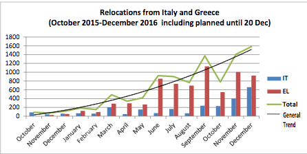
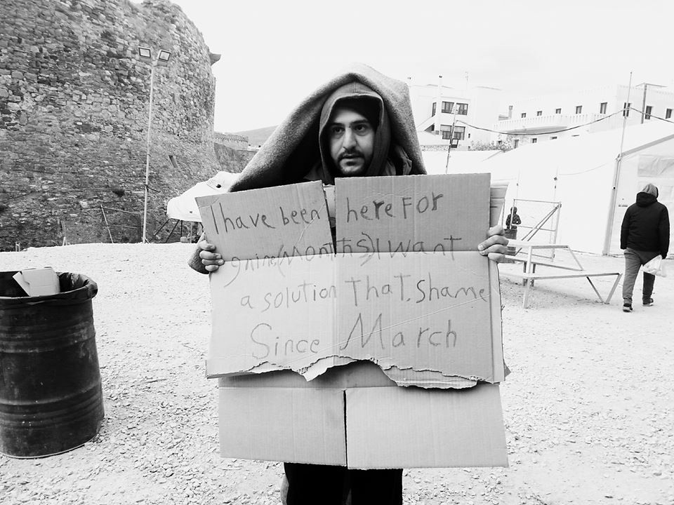
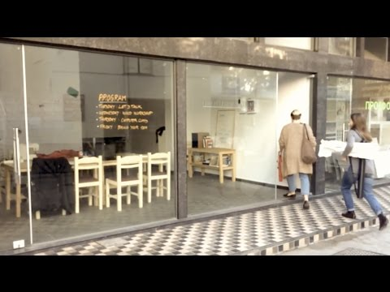
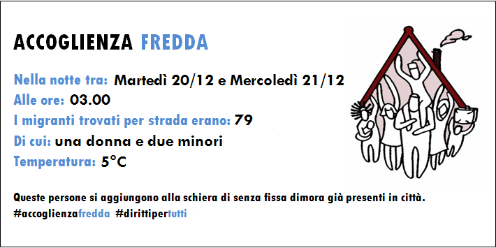
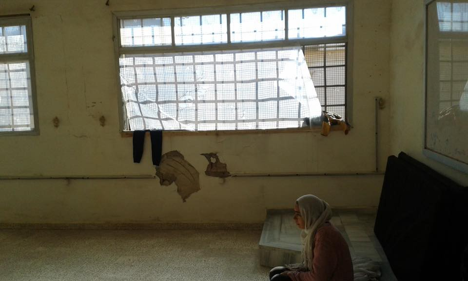
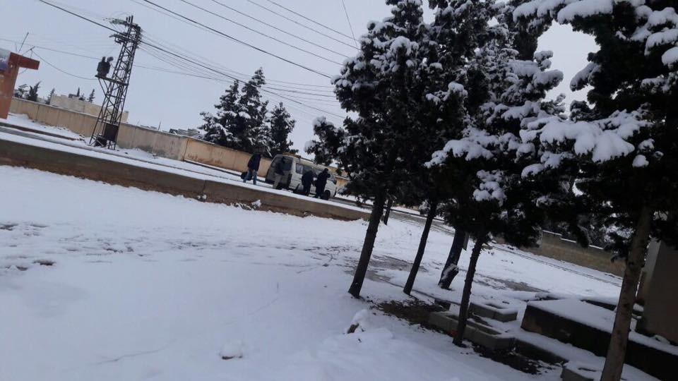

### AYS DIGEST 21/12: Refugee women’s rights at risk in Greece

 story\.](assets/51599c09c43f/0*AbEPZ7pLMTYZLmEl.jpg)

Photo by David Lohmueller\. Part of [Out of sight, out of mind](http://davidlohmueller.com/en/refugee-camps-greece/#more-4516) story\.

_Protection of women’s health and rights remains an issue in Greece\. The European Commission sets ambitious relocation targets but many countries still refuse to participate\. Refugees forced to queue all night in front of the Parisian “humanitarian centre”\. Children’s mental health suffers as many stuck in France\._
### Greece
### Protection of women’s health and rights remains an issue

A new [report](http://reliefweb.int/sites/reliefweb.int/files/resources/Women%27sRightsBriefingPaper_Greece2016.pdf) on the situation of refugee women in Greece says “ _inadequate protection and promotion of women’s health, safety, and rights has been a concerning feature of the crisis”_ and mentions gender\-based violence, access to sexual and reproductive health services as well as women’s participation and empowerment in local communities as the most pressing issues\.

In particular, the report says “poor lighting, facilities and overcrowding” in Northern Greece camps and the lack of police presence is leading to security risks for women\. Toilet and shower areas are not safe, especially at night — one request made by women is “better lighting around toilet and shower areas, improved lighting in the sites overall, and flashlights”\.

Regarding sexual and reproductive health, the report highlights the lack of antenatal and postnatal care, with women often returning to sites shortly after C\-section procedures without adequate support\.

An October report written by the Pleiades law group in cooperation with Human Rights in Childbirth and published on [_AYS_](https://medium.com/@AreYouSyrious/ays-22-10-refugee-mothers-cut-open-stitched-up-and-sent-back-to-filthy-camps-22c5bfcfb838#.vuzo1p9dy) , also mentions that 60% of refugee birthing mothers were subjected to C\-section without them being informed and providing consent, while no pain medication was given to women who did not have a C\-section\. One quoted 37\-year old woman said “ _After 12 hours of trying to give birth naturally, they told me they will give me a C\-section\. While I was still awake and bound on the bed they started cleaning the area of my abdomen with alcohol\. I was scared and I asked the anesthesiologist for sedation saying in Arabic “Khadirini”\. The anesthesiologist started laughing and telling me “no Khadirini”\. I panicked and started screaming from the pain and the fear, so much that I tore the belts that kept my hands\. Luckily, at that moment, the doctors came in and started talking to me and relaxed me_ \.”

An article in [_The Guardian,_](https://www.theguardian.com/global-development-professionals-network/2016/dec/19/greek-hospitals-deepen-trauma-for-refugee-women-giving-birth) adds that “r _efugee women in Greece are being traumatised by their experiences of giving birth, as understaffed hospitals perform medical procedures without consent or translators and with partners banned from the birth_ ”\.

The first report mentions that the food in camps often does not provide sufficient nutritional value for pregnant women, while some camps do not provide a female doctor or nurse\. There is also an unmet need for family planning, including a significant demand for contraceptives\.
### EC hopes to complete relocation by September 2017

In its [_eighth report on relocation and resettlement_](https://ec.europa.eu/home-affairs/sites/homeaffairs/files/what-we-do/policies/european-agenda-migration/proposal-implementation-package/docs/20161208/eighth_report_on_relocation_and_resettlement_en.pdf) , published at the start of December, the European Commission says it hopes to complete relocation by September 2017\.

It also admits that to achieve this goal, member states should already be relocating at least 2,000 people per month from Greece in December and achieve at least 3,000 relocation transfers per month as of April 2017\.

**However, in November, only 1,005 people were relocated to 13 EU member states, as well as to Switzerland and Norway\.**

For the Commission, this is a clear signal that the relocation targets can be achieved if _all_ EU countries participate in the effort — in reality, several countries are still refusing to participate at all\. At the time of publication, Bulgaria, Croatia, the Czech Republic and Luxembourg had not made any relocation pledges for more than three months , while Austria and Hungary have not relocated anyone since the beginning of the programme\. The Czech Republic has not relocated anyone since August and Poland has not pledged nor relocated any refugees since April\.

The EC also notes that while the acceptance rate of relocation requests is high \(around 93%\), some of the rejections are still based on nationality, even if the person belongs to one of the nationalities eligible for relocation\.

Photo taken in Soud camp, Chios\. By Almwuostafaa Alkhtyipe

**101 refugees arrive in Greece**

101 refugees arrived in Greece in the past 24 hours until 7:30AM according to official numbers, including 81 on Lesvos\.

Chios Eastern Shore Response Team helped newly arrived refugees yesterday night, including pregnant women,children and unaccompanied minors, giving them clothes, food and hot tea as the nights are getting extremely cold\. These refugees are not yet counted in official statistics, since the bus bringing them to the Vial hotspot left at 7:30AM\.
### Office of Displaced Designers needs support

In Lesvos, the _Office of Displaced Designers_ needs support to build a Maker Space, targeting refugees with a background in creative professions and youth interested in acquiring new useful skills while in the camps\. Currently, they organise among other things a construction workshop, a computer club and give English classes\.

Please check out their [website](http://www.displaceddesigners.org/) and appeal for donations for more info\.

#### Bulgaria

**1,647 refugees have left Bulgarian refugee camps in November** and close to 600 people left in the two first weeks of December, according to [BalkanEu](http://www.balkaneu.com/2000-left-bulgarias-refugee-camps-month-report/) \.

In recent weeks, the situation has deteriorated for refugees in Bulgaria, with police storming the Harmanli camp after riots, severely beating men and teenage boys\. Bordermonitoring Bulgaria says all closed and open centres are still overcrowded, while the Bulgarian Helsinki Committee also reports on serious human rights violations by police as well as on pushbacks to Turkey\.
#### France
### Refugees forced to queue all night in front of the Paris “humanitarian centre”

In Paris, volunteers say that the major informal camps have now disappeared and that people mainly gather around the ‘humanitarian centre’ during the day, hoping to be allowed in, but are scattered all over the city at night\. The police also forced everyone who was not in the line for the centre to move away during the last two nights, while also stopping any distribution near the centre\.

An article for [_Radical Cinema_](https://radicalcinema.org/fr/20161221142202/) mentions similar issues: refugees are forced to stand in queue the entire night, but in the morning only 20 to 40 people are let in, while the police forces the rest of them to leave\. Refugees are left to sleep in the street, but remain harassed by police who do not let them settle and are looking to prevent the creation of makeshift camps\.

Care4Calais says that refugees are sleeping rough in ditches and fields around Calais, while in the streets of Paris, the police take down tents as soon as they are erected, despite freezing temperatures\.

It asks people to [donate £30](http://www.care4calais.org/donate) , having found ex\-army sleeping bags with a gortex outer at that price\. The sleeping bags are waterproof and breathable and can make these peoples lives a little bit better\.
### Children’s mental health suffers as many unable to reunite with their families in the UK

In yesterday’s digest, we wrote about an article in [_The Independent_](http://www.independent.co.uk/voices/refugee-calais-jungle-children-france-migration-french-centres-homes-dubs-amendment-turning-back-uk-a7484421.html) , mentioning that unaccompanied minors who were moved out of the jungle during the eviction in October, are now starting to come back to Calais, as many children were unable to reunite with their families in the UK and seem to be left alone in French reception centres\.

Today, [_Human Rights Watch_](https://www.hrw.org/news/2016/12/21/france/uk-lone-children-calais-left-limbo) also writes about these unaccompanied minors, saying that “ _there is a real risk that some of them will leave their shelters to reach the UK, risking homelessness, exploitation, and violence_ ”, adding that the process for children to seek transfer to the UK has been non\-transparent and arbitrary, and that children’s mental health has suffered\. Several of them said they were so upset that they could not sleep or eat, and two said they thought of taking their own lives\.
#### Italy

**7 bodies recovered in the Mediterranean**

[France 24](http://www.france24.com/en/20161221-seven-dead-new-migrant-boat-tragedies-italy) says seven bodies were recovered from or around stricken migrants boats in the Mediterranean on Wednesday, while 300 people were saved during rescue efforts for three rubber dinghies and a small wooden boat\.
### A cold welcoming

In Como, 79 people were sleeping in the street last night, including two unaccompanied minors\.

Image by Como Senza Frontiere

Como Without Borders and Caritas Como have sent a letter to the city’s mayor, saying that since the opening of the Via Regina reception centre, the number of persons who couldn’t have access or had their badge disabled has increased, forcing up to a hundred refugees to look for a safe space to sleep at night\. While some find shelter in churches, many are forced to sleep in the streets\. Both groups call on the city to find a warm and safe place to host them\.

A piece by [openmigration\.org](http://openmigration.org/analisi/la-frontiera-di-como-100-giorni-dopo/) says about 1,800 refugees have passed through the centre since its inception, with two\-thirds of them being minors\. Most stop for a very short period, as they try to move on to Switzerland\. 
An average of 200 unaccompanied minors sleeps in the centre and one of them tried to hang himself on the 11th of December — the author says this shines a light on the fact that the centre is not meant to host unaccompanied minors, but was originally created for adults who were in transit through the area \.

The article also mentions that 31,000 refugees have been expelled from the canton of Tessin in Switzerland, this year until November, a large majority of them since July\. Refugees that are stopped in Switzerland but do not want to claim asylum in the country can be expelled within a few hours\.

Around 85% try to cross into the country using the train, while some cross on foot, either with the help of smugglers or by reaching the highway\. In mid\-November for example, a group of refugees attempted to enter Switzerland on foot following the train tracks\. Alarm was raised when police reported the presence of some people inside the tunnel between Como and Chiasso\. The author says that no one was hurt, but adds that “ _with the arrival of winter and the increase in hours of darkness, there is a rise in the attempts to cross the border in an alternative way\.”_
#### Syria
### IDPs suffer from cold temperatures

In Syria, internally displaced persons are suffering from the cold and the snow\. A total of 148 people \(26 families, more than 100 children and two elderly people over 80 years old, many people with significant medical conditions\) are sheltering in an abandoned school with no windows and no heating, after fleeing from ISIS\. These families are in urgent need due to harsh living conditions in damp and sub\-zero temperatures\. Samara’s Aid Appeal is planning to send them food, clothing, bedding and carpets as well as windows and medical care\. If you would like to join them, please download their [information pack](https://static1.squarespace.com/static/53766570e4b003ad46561710/t/5842017137c581d99d802756/1480720768432/CHRISTMAS+%26+NEW+YEAR+AID+APPEAL+INFORMATION+PACK+2016-2017.pdf) \.

Photo by Samara’s Aid Appeal

Photo by Samara’s Aid Appeal

,

_Converted [Medium Post](https://areyousyrious.medium.com/ays-digest-21-12-refugee-womens-rights-at-risk-in-greece-51599c09c43f) by [ZMediumToMarkdown](https://github.com/ZhgChgLi/ZMediumToMarkdown)._
