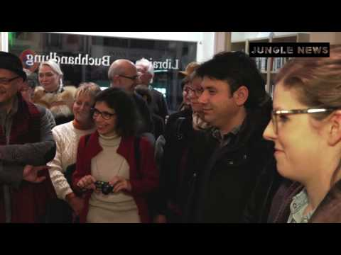

### AYS DIGEST 22/12: Evacuation finished in Aleppo/UN and EU accused of mismanagement/Lesvos groups against more refugee camps/Conditions in Paris getting worse

](assets/289931e0686b/1*UttuS7yZVfCsrbiCmES7uw.jpeg)

Refugees sleeping on the street by [**Care4Calais**](https://www.facebook.com/care4calais/)
### Syria

The last group of rebels and their families stuck in the small eastern enclave of Aleppo were evacuated under a deal that gave the army and its allies full control of the city, Syrian state television said\.

The final phase of the evacuation ended when a convoy carrying nearly 150 people, including fighters and members of their families, departed towards rebel\-held areas outside the city and in parallel, two buses carrying people from the pro\-government villages of al\-Foua and Kefraya, besieged by rebels in Idlib province, arrived in government\-held Aleppo\. A total of 900 people were transferred from the villages to government\-held parts of Aleppo during the week\-long evacuation process, according to the Syrian Observatory for Human Rights, a group that monitors the war\. Government forces had insisted the two villages must be included in the deal to bring people out of Aleppo\.

At least 34,000 people, both civilians and fighters, have been evacuated from east Aleppo in a week\-long operation hampered by severe winter weather, according to the United Nations, which estimates that **thousands more remain behind\.**

> “It’s done\. The evacuation process has ended and the last bus has come out,” 

Said Ahmad al\-Dbis, a medical aid worker heading a team evacuating patients from Aleppo\.

The arrival of thousands of refugees from Aleppo in Idlib aroused fears that the rebel\-held city in northwestern Syria could be next as Assad has said the war is far from over and his armed forces would march on other rebel areas\.

According to U\.N\. Special Envoy Staffan de Mistura:

> “Many of them have gone to Idlib, which could be in theory the next Aleppo” 

[**Help Refugees**](https://www.facebook.com/HelpRefugeesUK/?fref=nf) is sending help to Syria and made this statement today:

> The images coming out of Aleppo these last few weeks have shocked the world\. The hundreds of thousands of people who lost everything have lost their home and are in desperate need of shelter, warmth, food, medical care\. 

> We have begun working with and sending much needed funds to the groups working on the front line including: The Syria Campaign, The People’s Convoy, The Independent Doctor’s Association, Space of Hope, Hand in Hand for Syria, Karam Foundation, The White Helmets, SAMS, Women Now and Molham Volunteering team are all doing the work that other organisations are too afraid to do\. 

> We don’t need to watch what is unfolding in Syria and feel completely helpless\. We can help the people who are there helping\. 

> Help Refugees would not be able to do what we do were it not for the support of the incredible women at [Together Rising](https://www.facebook.com/TogetherRising/) who work with us, side by side to ensure we can get help to organisations on the ground who really are making a difference and saving lives\. 

Also from Macedonia we receive an appeal to help the people suffering in Aleppo:

](assets/289931e0686b/1*2POKbRvsBxzlghgGLYhseg.jpeg)

Photo by [**Legis**](https://www.facebook.com/legis.mk/)
### International

The UN refugee agency and the EU’s aid department have been accused by other aid groups of mismanaging a multimillion\-pound fund earmarked for the most vulnerable refugees in Europe, leaving thousands sleeping in freezing conditions\. The Greek government, which has ultimate jurisdiction over camp activities, has also been criticised for failing to use nearly €90m of EU funding to adequately improve conditions at the camps before the onset of winter\.

The EU aid department, Echo, has given UNHCR more than €14m since April to help prepare roughly 50 refugee camps for the winter in Greece where about 62000 refugees are stuck at the moment\. A further €24m has been given to UNHCR for other projects\. In addition to providing warmer bedding and clothes, UNHCR was expected to use this money to move people from tents to heated containers or formal housing; heat warehouses where other refugees are living; provide a consistent supply of hot water; and install insulated flooring for anyone still left in tents\. Of the 45 camps that were still active at the start of the month, the Guardian visited or was made aware of at least 15 camps that had yet to be properly adapted by the time snow fell in northern Greece at the start of December\.

UNHCR admitted it was itself aware of only eight camps where all the residents have been moved out of tents and into prefabricated containers\. In a [recent UNHCR video,](https://www.facebook.com/ec.humanitarian.aid/videos/10154615194542906/?pnref=story) promoted by Echo, the two institutions hailed the success of their winterisation work\. In early December, the EU also said that Greece was safe enough to return refugees there from other European countries\.

But refugees and independent aid workers know that Echo and UNHCR’s propaganda is far from the truth\.

Also the head of Medécins Sans Frontières in Greece, Loic Jaeger, described the situation as a failure\.

> “We are outraged about the positive communications \[from UNHCR and the EU\] that are completely disconnected with reality\. “Our feeling is that there is a willingness now, led by the fact that there is a massive amount of money, to try to present the situation as if it is OK\. But it is not\. On the islands we are still not even starting to winterise\. In some places it’s working quite well, but in northern Greece you still have people sleeping in tents in the snow\. What is being done with all this money? Who is checking? Where is the report from the EU or UNHCR assessing what is still to be done? Where is the transparency? There is a discrepancy between what is claimed and what is the reality\.” 

[**Mobile Info Team**](https://www.facebook.com/mobileinfoteam/?fref=ts) also made a statement that you can read [here](https://drive.google.com/file/d/0B6Da1eGN7WCjdXd5YnRiNGtud2c/view) \.

Despite some recent improvements in some camps all volunteers know well the reality and the conditions of most of the refugees still stuck in Greece and other countries in Europe\.
#### IOM

The numbers say that there was a decreese in the numbers of arrivals to Europ since the beggining of the month:

](assets/289931e0686b/1*VtEqLQ5Us7zcHc4p8_S1UQ.jpeg)

Picture by [IOM](http://www.iom.int/europe)
#### Turkey

There is, though, the announcement that the EU contracted €270 million to boost [education infrastructure for Refugees in Turkey](http://europa.eu/rapid/press-release_IP-16-4451_en.htm) \.

The European Commission signed contracts worth a total of €270 million for construction and equipping of school buildings for Syrian refugee children and their host communities in Turkey\. Under these contracts, some 100 schools are to be built and equipped, benefitting over 70,000 Syrian refugee children primarily in Turkey’s Southern and South\-Eastern provinces\. The EU funding will also help the Turkish Ministry of National Education \(MoNE\) to manage educational infrastructure\.

If the money will actually reach its destination we are yet to see but the announcement is definatly good news for refugees in Turkey\.
### Greece

According to [Ekathimerini](http://www.ekathimerini.com/214785/article/ekathimerini/news/lesvos-groups-to-lobby-against-more-migrant-camps) , groups on Lesvos have decided to come together to lobby for the island not to host any more camps for migrants\.

Following a similar initiative by professionals on Chios, Lesvos residents want to also advocate greater support for the island and some regulation of the nongovernmental organizations that operate there\.

There were **42 new registrations** today on the islands, 1 on Lesvos and 41 on Chios\.

[**InterVolve — International Volunteers**](https://www.facebook.com/InterVolve-International-Volunteers-219418945063168/) has been busy and posted this about their recent work:

> Due to the generous support of our partners [Help Refugees](https://www.facebook.com/HelpRefugeesUK/) and other donors we are distributing for more than three months now twice a week fresh vegetables from tent to tent to the residents of camp [\#Softex](https://www.facebook.com/hashtag/softex?source=feed_text&story_id=385730048432056) \. People love the veggies not only because they are a welcome change and supplement to the monotonous military food, but especially because they give them the freedom to choose what to eat and when to eat\. A freedom not to be underrated and everyone in this world should have\. 

> Within our distribution we also target in particular vulnerable and medical cases as well as pregnant and lactating women\. And we are jumping for joy over the feedback of the medical team on site that the nutrition status of those persons has improved significally since we have started the distribution\! 

](assets/289931e0686b/1*AkNytAHWyjHfzZWIGEmI-g.jpeg)

Photo by [**InterVolve — International Volunteers**](https://www.facebook.com/InterVolve-International-Volunteers-219418945063168/)

](assets/289931e0686b/1*1t9BNjuiHeTgbR43Hx_mRg.jpeg)

Photo by [**InterVolve — International Volunteers**](https://www.facebook.com/InterVolve-International-Volunteers-219418945063168/)

](assets/289931e0686b/1*-Y6xu53y5a5JgGZft0n8Fg.jpeg)

Photo by [**InterVolve — International Volunteers**](https://www.facebook.com/InterVolve-International-Volunteers-219418945063168/)

](assets/289931e0686b/1*T_Yeg8f8gl2QDvmKtnhPAQ.jpeg)

Photo by [**InterVolve — International Volunteers**](https://www.facebook.com/InterVolve-International-Volunteers-219418945063168/)

It’s always good to hear rare good news from the camps in Greece\.

In Athens a school beside [City Plaza](https://www.facebook.com/sol2refugeesen/) squat invited the residents of the [\#TheBestHotelOfEurope](https://www.facebook.com/hashtag/thebesthotelofeurope?source=feed_text&story_id=1657804881178515) in their Christmas Party\.

The party was organized in solidarity to refugees and City Plaza\.

](assets/289931e0686b/1*K-C81utujztNrzaD2VXlrw.jpeg)

Photo by [**Refugee Accommodation and Solidarity Space City Plaza**](https://www.facebook.com/sol2refugeesen/)
#### Call for help

The group [The Get Shit Done Team](https://www.facebook.com/The-Get-Shit-Done-Team-304001796641127/) is having an opportunity to work on the electric issue in a couple of camps, this project´s success means heat supply to 450 people in nights that reach \-4 degrees\.
Please help finding this specialists, fundraise to sponsor trips, if you are a company owner offer your services, spread the word and help literally saving some lives\. For more info contact [Jenni James](https://www.facebook.com/jenni.james.1806) \.

On the group ‎‎ [**Shoufu — شوفو — Stories from Chios**](https://www.facebook.com/StoriesfromChios/) **,** a refugee posted a video very worth seeing about his situation in Greece and makes an appeal\. A situation shared by thousands of people in Greece\.

> It has been nine months since the EU\-Turkey deal came into effect\. Since then, refugees in Greece have been stuck in inhumane conditions, in camps lacking basic resources like heat and electricity, with no end in sight\. Winter has come and the situation continues to deteriorate\. This is not an appeal for donations\. It is a call for transparency\. A call for action to hold our governments to account\. Refugees are speaking out, will you join them? 

### France

The situation continues to deteriorate in Paris as more people arrive to the city, the weather gets worse and authorities impede refugees from sheltering properly and volunteers from helping them to do so in a way that resembles torture and terror\. Their strategy seems to create the worse conditions for refugees possible so that, physically and psychologically, they feel that it isn’t worth it to go on\.

Last night during another shift around the streets of the french capital, [**Paris Refugee Ground Support**](https://www.facebook.com/PRGS.team/?hc_ref=PAGES_TIMELINE&fref=nf) went in front of the shelter at La Chapelle to try to give out sleeping bags to the 50 or so people queuing at the door waiting to get in\. They were just covered in blankets and they were soaking wet between two rows of barricades like cattle\. One of the members went to talk to the police and asked them if they could put some bin bags on the barricades to try to create a bit more of shelter since refugees have to wait all night, braving the elements, to get a chance to get in at 8:00 in the morning\.

The answer from the police was disturbing, is was forbidden to put the bin bags over the barricades, it was forbidden to give refugees sleeping bags, **it was forbidden to do anything\!**

The police even added that usually they wouldn’t be allowed to put any blankets over the barricades to cover themselves but since it was raining this was the only thing police would allow\. This obviously didn’t last as the blankets get heavy with the water and just fall on the people underneath\. We also have to consider that temperatures fall close to freezing at night\.

[**Care4Calais**](https://www.facebook.com/care4calais/) is also supporting the refugees in Paris and issued an appeal for donations to help minimize the consequences of the weather in the city:

> Imagine being so scared of being found by the police that you sleep outside on the ground without even putting up a tent\. Refugees are sleeping rough in ditches and fields around Calais, in the freezing cold and rain, with only a sleeping bag or blanket for shelter\. 

> On the streets of Paris, the police take down tents as soon as they are erected\. With temperatures of minus six degrees, a blanket is just not enough\. 

> We’ve found ex\-army sleeping bags with a gortex outer that are waterproof and breathable\. For £30 they are the only way we can think of to keep people alive in terrible conditions that they should never be in in the first place\. 

> Please donate £30 now to buy a waterproof sleeping bag for a refugee this Christmas at [www\.care4calais\.org/donate](http://www.care4calais.org/donate) 

We also get a story today about Diaz that get his asylum refused recently in France after being 2 years in the “Jungle”

_Converted [Medium Post](https://areyousyrious.medium.com/ays-digest-22-12-evacuation-finished-in-aleppo-un-and-eu-accused-of-mismanagement-lesvos-groups-289931e0686b) by [ZMediumToMarkdown](https://github.com/ZhgChgLi/ZMediumToMarkdown)._
