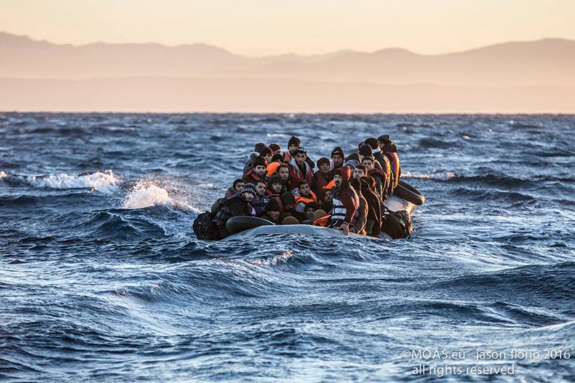
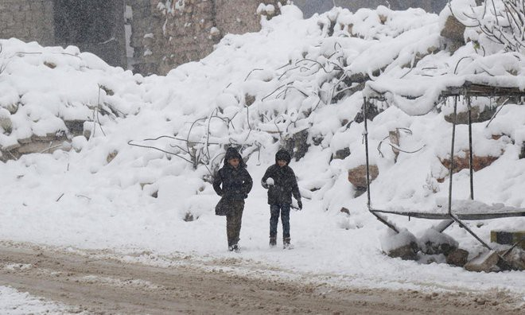
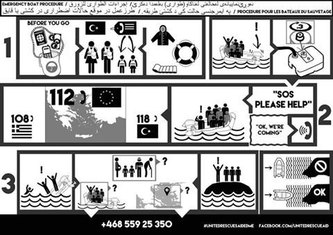
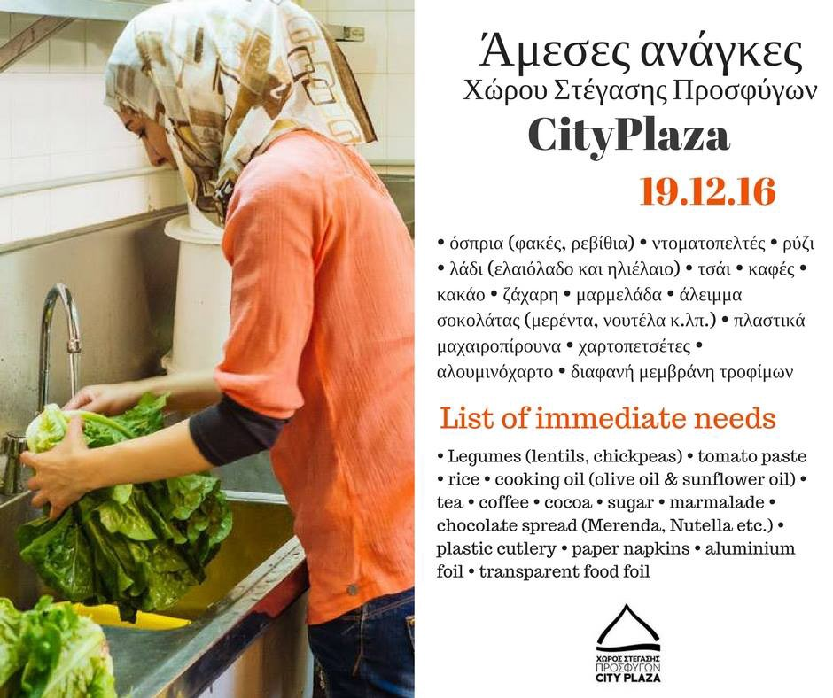
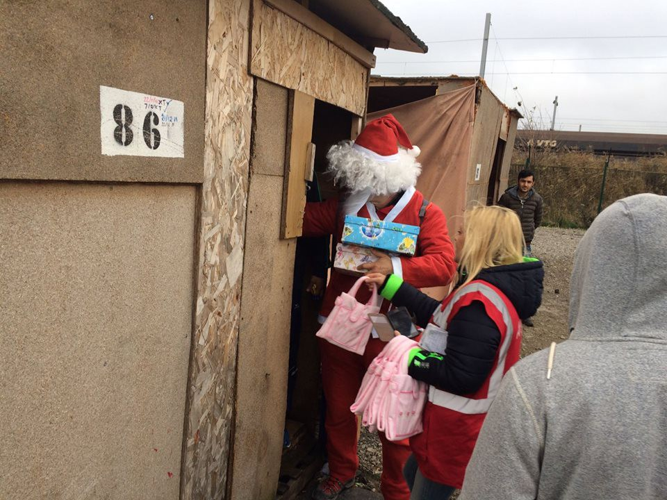
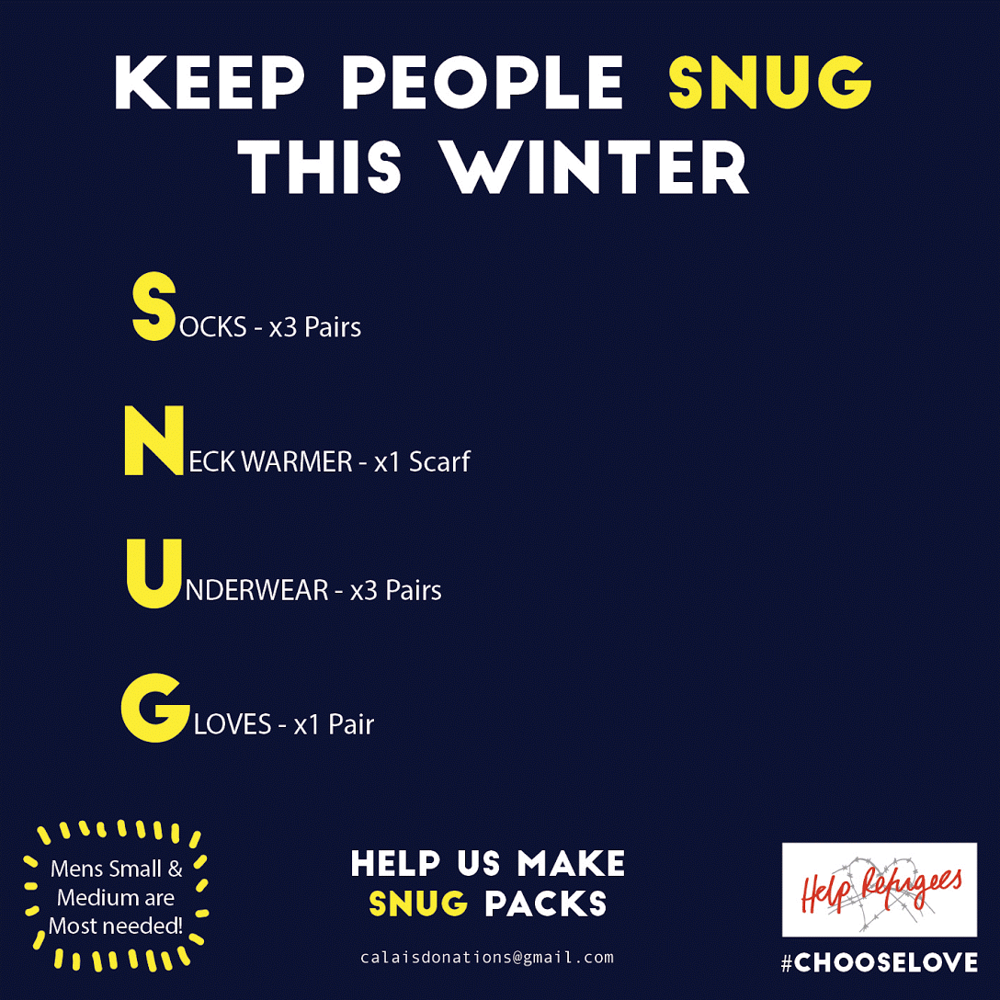

### AYS digest 26/12: Less people came, more people died — deadliest year on record

_5,011 deaths in the Mediterranean this year — the deadliest year on record / Heavy snowstorms and freezing temperatures hit Idlib, especially hurting new camps where those that fled Aleppo have settled / 41 new arrivals in Greece / Lawyers, translators and donations needed in Greece / 80 people found in containers and vans in Serbia on Monday, three smugglers arrested / MSF will support migrants in Como and Ventimiglia waiting to cross the border / Important information when dealing with Italian immigration and asylum system / Civil march to Aleppo / Holiday thank you notes from France_

Photo: MOAS
#### Mediterranean
### **The deadliest year on record**

As December draws to a close, it is time to take a look back on what has been an especially dangerous year at sea\. As has been reported, 2016 has been the deadliest year on record for those crossing the Mediterranean\. There have been 358,923 arrivals to Europe via sea this year with 5,011 dead or missing\. Compared with 2015, which had 1,015,078 arrivals and 3,771 dead and missing, this year has been the deadliest in both absolute and relative terms\. There have been tens of thousands of rescues, but as the MOAS organization points out, “\[we\] have witnessed smuggling practices become ever more dangerous and the season for attempting the crossing is extending far beyond what our crews have previously experienced\.” Many of those who have died at sea could have been saved if rescue teams and resources had not suffered the cutbacks that have been implemented over the last couple of years\. We reiterate the hope that this time next year we will not need to report in this manner\.

For more statistics, see the [Open migration report](http://openmigration.org/en/dashboard/) \.
#### Syria
### **Heavy snow hits Idlib and the vulnerable displaced population that fled Aleppo over recent days\.**

Snow in Idlib\. Photo: AFP Mohamed al — Bakour

With the evacuation of those that wanted to leave Aleppo finished, a new havoc awaits this besieged population\. [According to Arab news](http://www.arabnews.com/node/1029711/middle-east#.WGBadIyrv7Q.twitter) , heavy snow and temperatures as low as \-16 have hit Idlib, the city where these internally displaced people have fled to\. According to the same source, two children have died as a result of the snow\. The snowstorm has collapsed many tents, caused roads to close down and impeded the delivery of water and food\. The UN Office for the Coordination of Humanitarian Affairs \(OCHA\) estimates that 700,000 internally displaced people have found shelter in Idlib since Syria’s war erupted nearly six years ago\.
### **No water in Damascus**

Snow is reaching Idlib, but water is not making it to Damascus\. As Deutsche Welle reports, residents of the Syrian city of Damascus faced their third consecutive day without water on Sunday after the city’s supply was allegedly poisoned\.
#### Greece
### **41 people registered today in Lesvos**

With people still arriving in the Greek islands, volunteers and organizations continue to work to keep them safe\. One such organization is United Rescue Aid, who aims to inform those crossing the sea how to be safe and who to call if in trouble\. Basic guidelines are explained in the picture below\.

United Rescue Aid
### **Lawyers and translators needed on Lesvos**

Lesvos Legal Centre is looking for lawyers, legal professionals, recent graduates and Arabic/Farsi/Urdu/French interpreters willing to assist their legal team\. If your skills are a good fit for this kind of international solidarity community, follow [this link](https://legalcentrelesbos.wordpress.com/join-us/) and get involved\!
### **City Plaza Hotel needs donations**

Another way to get involved is by supporting City Plaza Hotel, which is soliciting donations and has published their needs on their [Twitter page](https://twitter.com/sol2refugees/status/813313499900289024) \. If you are able, please donate and/or share the link\.

### **Khora Community Centre monthly assembly**

For those readers based in Athens, we want to take this chance to remind you about the next open assembly at the Khora community centre\. Khora’s open assemblies happen every four weeks\. Details of January’s meeting such as the date, location and other information is published [here](https://www.facebook.com/events/661443777358728/) \.
#### Serbia
### **80 people found in containers and vans in Serbia today**

As was discovered not so long ago in Croatia, today Serbian authorities found, in three separate places, 80 people being smuggled in shipping containers and vans along the so\-called Balkan route\. Some people were discovered because they were crying for help after nearly suffocating in a shipping container on the Serbian / Croatian border\. These events only prove that due to the lack of safe passage, smuggling networks are getting bigger and transporting people under ever more hazardous circumstances\. Hopefully, the people that were discovered today will get their fair chance to apply for asylum in keeping with national and international law\. For more information, see the [Deutsche Welle report](http://www.dw.com/en/serbia-discovers-80-migrants-heading-to-eu/a-36914541) \.
#### Italy
### **MSF will support migrants in Como and Ventimiglia waiting to cross the border**

Having conducted a needs assessment among the migrants, refugees and asylum seekers waiting at Italy’s northern border, MSF has decided to step in with medical and psychological aid and other support, and are planning to focus particularly on women\. These activities will be led in collaboration with local networks of volunteers, local institutions and other organizations operating in the field\.

In Ventimiglia, a team made up of cultural mediators, an obstetrician and volunteer doctors is providing medical and psychological assistance to migrants in transit hosted at Sant’Antonio church in Gianchette\. In November of this year the church was hosting between 80 and 100 people each day, and in December the arrivals have kept coming\.

Tommaso Fabbri, Head of Mission of MSF Italy, stated that “due to the borders’ closure, people get stuck in a limbo\. This situation is strongly linked to the European policies in terms of asylum and the Dublin Regulation, which forces people seeking international protection to start the procedure in the arrival country\. This is done without considering their familial and cultural connections, their expectations and their language\.”
### **Glossary on most important information when dealing with Italian immigration and asylum system**

If you are one of those stuck in the limbo in Italy, or are helping someone in that situation, here is a very [useful glossary](http://openmigration.org/en/glossary/) regarding the most important words and names to know when dealing with the Italian immigration and asylum system
#### Germany
### **Civil march to Aleppo**

The civil march from Berlin to Aleppo has started today\. On [this link](http://civilmarch.org/) you can follow the live feed of the march and also join them on the route that is marked on the same link
#### France
### **Thank you note from the mayor of Grande — Synthe**

As holiday season continues, this time we have only thank you notes from France\. First off there is a wonderful thank you note from the Mayor of Grande Synthe to the volunteers and organizations that help with the refugee camp in a town that welcomes strangers and foreigners to stay\.

_December 2016_

_From Monsieur Damien CAREME_

_Mayor of Grande\-Synthe_

_To associations involved with the humanitarian settlement of Grande\-Synthe_

_Ladies and Gentlemen,_

_The humanitarian settlement opened on the 7th March 2016\._

_Since that date and thanks to the efforts which we have undertaken together, the humanitarian settlement of Grande\-Synthe is fulfilling the functions which we envisaged: to welcome in a dignified manner dispossessed people, notably refugees from war\-torn countries or from conflict zones\._

_Thousands of volunteers have already put a lot of time into the camp and more than 50 associations are still present on site to make the camp function so effectively\._

_Well, today the humanitarian settlement, which numbered 1090 people at the last count, allows the provision of essential needs with access to catering, hygiene, education, law and indeed to culture\._

_Over and above the agreement that I signed with the State and ministers Bernard Cazeneuve and Emmanuelle Cosse, the refugees take comfort from all your ongoing accomplishments\. I know that they appreciate this\._

_With these few words I wanted to thank you wholeheartedly and sincerely\._

_The work that you have been carrying out for months is essential, indeed vital, for the refugees and for ourselves\._

_It sends out a message of hope from our town and the humanitarian settlement, it rejects the darker side of life and the easy acts and speeches of hate\._

_It proves that France, as throughout its history, remains a welcoming country in which the words solidarity and humanity still have a meaning\._

_It proves that the voluntary sector and unselfish commitment are precious\._

_As Mayor and as a citizen, I wanted to let you know before the end of the year of my great esteem and respect for your dedication\._

_I wish you and your nearest and dearest a happy festive season\._

_Damien CAREME_

_Mayor of Grande\-Synth_
### **Thank you note from Dunkirk children’s centre**

Other thank you note is from Dunkirk children’s centre who wish “Merry Christmas to all the children in Dunkirk\!” and sent thanks “to everyone who donated the shoe boxes, teddies and treats that were delivered by Father Christmas himself\! The children were thrilled with their gifts\! And most of all a great BIG THANK YOU to the fab team of volunteers who have spent their Christmas spreading hope, love and laughter\. As we go to sleep safe in our cozy warm beds tonight, with our bellies full of food, we think of all the children in Dunkirk, and of the millions of children worldwide who have been displaced by war and conflict who will be going to sleep cold and hungry\. Here’s to hoping 2017 is a better year for everyone\.”

Dunkirk
### **Donate your socks, neck wear, underwear and/or gloves that you received as a present for Christmas, but do not need**

Also, Help refugees would like to ask you do donate the unwanted or unneeded gifts such as socks, neck wear, underwear, gloves \(SNUG\) and to organise a group to put together 50 or more SNUG packs? If you can send some SNUG packs their way, email them on calaisdonations@gmail\.com

SNUG ;\)

_Converted [Medium Post](https://areyousyrious.medium.com/ays-digest-26-12-less-people-came-more-people-died-deadliest-year-on-record-c00c8341a970) by [ZMediumToMarkdown](https://github.com/ZhgChgLi/ZMediumToMarkdown)._
