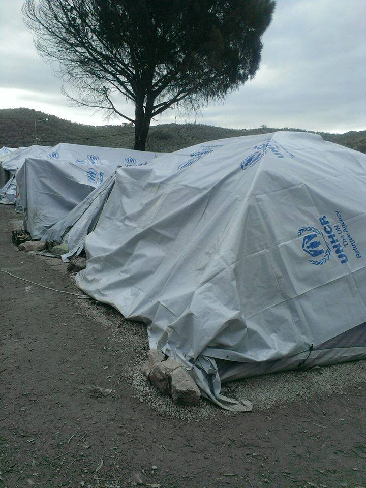
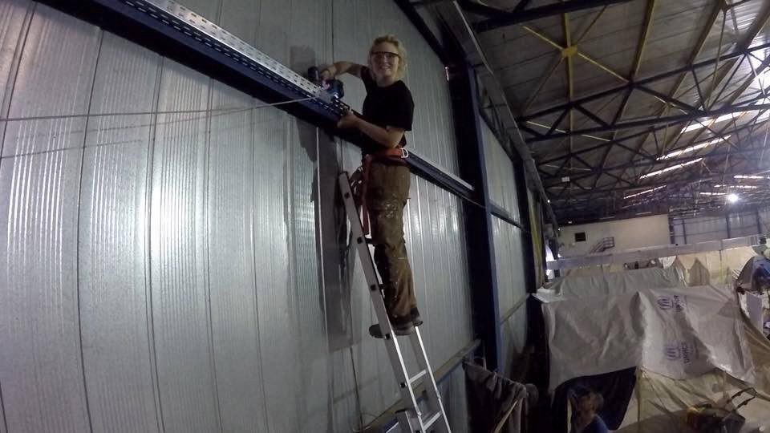
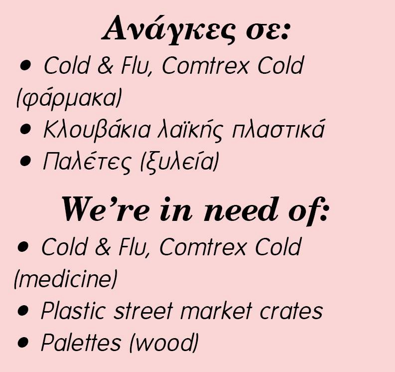
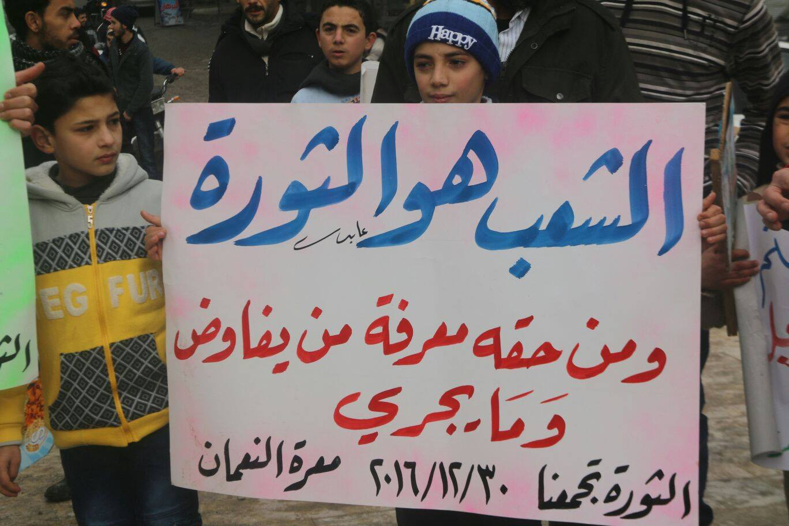
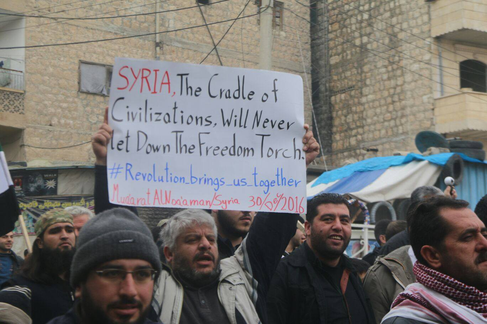
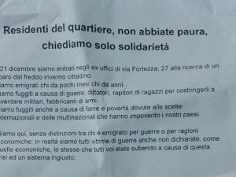
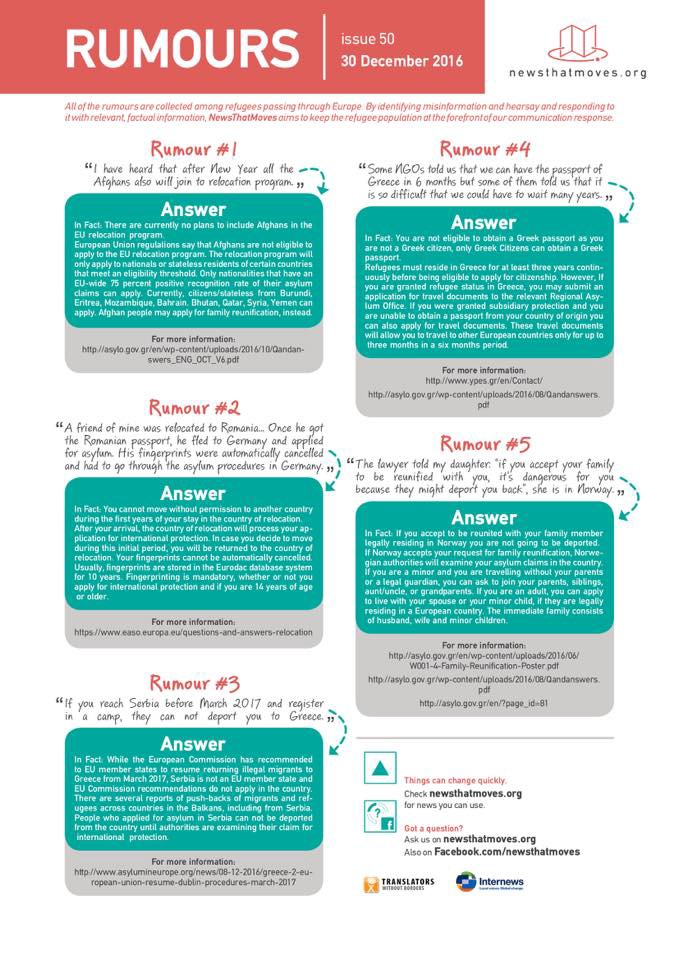

### AYS Daily News Digest 30/12: asylum system too slow, Greece and Italy still waiting for the others to pitch in
#### winter seriously threatening people on Greek islands, in camps and streets; growing need to tackle the problem of drugs and prostitution among young refugees in Greece; Oraiokastro finally getting electricity provided by the volunteers \| Despite nationwide truce deal in Syria, airstrikes under way and anti\-regime protests going on\| Italy struggling at the end of a difficult year \| France faces rejection by Mali \| increasing number of asylum applications in Germany

](assets/20a28c94f6b2/1*GlF3q58V7ElTGCGkR97UeQ.jpeg)

A Yazidi child in a camp in Greece where they live and wait\. Photo: [Migrant Jaeyd Yezidi](https://www.facebook.com/profile.php?id=100004580628675)
#### GREECE

The 18 men, 6 women and 7 children, all Syrian, who arrived today at the island of Kastellorizo were arrested for illegal entrance\.
No new registrations were officially made on the Greek islands this Friday\.

> Strong winds, snow and hail caused damage to some of the camp structures on the Aegean islands today\. 

](assets/20a28c94f6b2/1*DuaX11Y15xGZBdOqOo6_rw.jpeg)

Photo by: [Lighthouse Relief](https://www.facebook.com/lighthouserelief/)

Continuing worsening of the [weather conditions](https://medium.com/@AreYouSyrious/ays-digest-29-12-new-ceasefire-in-syria-to-start-at-midnight-severe-weather-over-unprepared-5e931d1e502f#.d5islh8x3) in Greece sparks new comments, actions and conclusions by the refugees and volunteers on site\.

> \(…\)All the small NGOs and volunteers have been preparing for months for the winter and preparing just in case Erdogan opens the borders and the so called ‘experts’ with all the funding cannot even prepare for another winter\. — Lesvos locals’ comments on the severe conditions refugees are stuck in 

 \)](assets/20a28c94f6b2/1*d_GFDV5BsCXEPglr6br6sQ.jpeg)

Moria camp, December 30 \(Photos: [Philippa Kempson](https://www.facebook.com/philippa.kempson.1) \)

> We hope that the worst is over, but it seems bad weather is still in store\. Greece’s Civil Protection issued a Warning for Extreme Snow Weather Conditions from Thursday to Saturday\. The national weather service has predicted gale\-force winds, especially at sea\. It’s deeply worrying that there are still refugee sites across Greece not properly winterised and many people are not adequately protected from the cold\. Measures must be taken to ensure that, especially now, they can access warm, safe spaces\. — Lighthouse Relief 

 **working with children on Lesvos need support:** “We need financial support\.
Volunteers composers and choir director, string musicians,Guitar and flute teachers\.
We need a bigger ISO BOX \-Container in Kara Tepe\.
We need an ISO BOX close to Moria Camp \.Capacity of 45–80 persons\.
We need in ISO Box in one of the Attica Area Camps\.
We need heating for our frozen ISO Box in Kara Tepe
We need lamps and chairs for our ISO Box in Kara Tepe\.
2\. Violins 4/4 x 2, 1/8 x 2\.
3\.We need few good quality violin cases 4/4 x 2, 2/2 x1\.
5\. We need an Irish Harp or Ancient Greek Lyra\.
6\. We need volunteers,art therapist with a car for 4 hours for 5 days a week\. “— contact: artangelsreliefteam@gmail\.com](assets/20a28c94f6b2/1*tEf0UrQGxZ2Beqh3zEkozg.jpeg)

[**ART Angels Relief Team**](https://www.facebook.com/ARTMusicTeam/) **working with children on Lesvos need support:** “We need financial support\.
Volunteers composers and choir director, string musicians,Guitar and flute teachers\.
We need a bigger ISO BOX \-Container in Kara Tepe\.
We need an ISO BOX close to Moria Camp \.Capacity of 45–80 persons\.
We need in ISO Box in one of the Attica Area Camps\.
We need heating for our frozen ISO Box in Kara Tepe
We need lamps and chairs for our ISO Box in Kara Tepe\.
2\. Violins 4/4 x 2, 1/8 x 2\.
3\.We need few good quality violin cases 4/4 x 2, 2/2 x1\.
5\. We need an Irish Harp or Ancient Greek Lyra\.
6\. We need volunteers,art therapist with a car for 4 hours for 5 days a week\. “— contact: artangelsreliefteam@gmail\.com
#### Light is coming back to Oraiokastro

Thanks to the efforts of a group of volunteers and some residents of the camp, Oraiokastro might finally have reliable electricity inside the halls\.

 with the support of Help Refugees](assets/20a28c94f6b2/1*P42Uj6ZI7y9W5Mm0N0TWXg.jpeg)

Taking matters into their own hands is [The Get Shit Done Team](https://www.facebook.com/The-Get-Shit-Done-Team-304001796641127/) with the support of Help Refugees

![“After many talks with the Commander, Military electrical engineers, Swiss Cross and the refugee community the work finally begins\. First up laying the 200m warehouse with cable trays along both sides\. No easy task\. All the tents are less than 1m from the walls and less than 1m apart from each other\. With safety harnesses attached the team with the support of the refugee community scurry the ladders with tray and drills in hand\. While back at the workshop the 4m posts are being prepared\. It’s all go and together we will get this camp electrified\!” — [The Get Shit Done Team](https://www.facebook.com/The-Get-Shit-Done-Team-304001796641127/)](assets/20a28c94f6b2/1*bw9FnbArkJXyROrrx6krnQ.jpeg)

“After many talks with the Commander, Military electrical engineers, Swiss Cross and the refugee community the work finally begins\. First up laying the 200m warehouse with cable trays along both sides\. No easy task\. All the tents are less than 1m from the walls and less than 1m apart from each other\. With safety harnesses attached the team with the support of the refugee community scurry the ladders with tray and drills in hand\. While back at the workshop the 4m posts are being prepared\. It’s all go and together we will get this camp electrified\!” — [The Get Shit Done Team](https://www.facebook.com/The-Get-Shit-Done-Team-304001796641127/)

Fouad, Mohammad & Hamza, 3 young Syrians leaving to Norway, are the last group of Syrian refugees departing from Greece as a part of the frustratedly slow emergency resettlement, the so called relocation process, in 2016, IOM Greece [reported](https://twitter.com/IOMGREECE/status/814826474213609472) \.

Those preparing for interviews or without a provided translation of the Greek documents, as well as the volunteers and attorneys helping refugees in Greece can now use the updated version of the [Greek Lexicon](https://drive.google.com/open?id=0B7m1mbz3TgLbSE5ndnRURy1oYVU) by the Advocates Abroad, who prepared it with the generous help of Greek translators\.
### Athens

Notara 26 squat is looking for donations\. Please consider helping them by donating or providing the following:

Due to extremely low temperatures 5 metro stations in Athens will remain open during the night in order to host homeless people:
**Omonoia, Metaxourgio, Monastiraki, Sygrou Fix, Elaionas**

The following shelters will remain open at least until Monday morning\.
1/ 26, Drakou Street, Koukaki, Athens ; Phone: 210 9232 044
2/ 12, Formionos Street, Pagrati, Athens ; Phone: 210 7222 590
3/ Emonos 9 and Astrous \(near Larissa metro station\); Phone: 210 5140877
4/ Eyripidou 14, 7th floor \(near Omonia metro station\); Phone: 210 3315417

HEATED AREAS OPENED SINCE 10 A\.M\.:
1/ Kolonos district: 35 Alexandras Avenue
2/ Rouf district: 165 Pireos Street \(an old gymnasium\)

HOTLINE
If you see a homeless person in Athens who may need help, please call: 1595
You can also join [Refugees’ Refuge](https://www.facebook.com/RefugeesRefuge/) in their night rounds providing hot tea and sandwiches to the homeless\.

 warns\.
اگر فرد بی خانمانی را در آتن دیدید که به کمک احتیاج داشت، لطفن با شماره زیر تماس بگیرید: 1595](assets/20a28c94f6b2/1*XxfNqpCbMQThCA2NiyK9BA.jpeg)

إذا رأيت شخص بلا مأوى في اثينا يحتاج إلى مساعدة، فرجاءً اتصل على الرقم: 1595
If you see a homeless person in Athens who may need help, call: 1595, [Refugee\.Info](https://www.facebook.com/refugee.info/?fref=nf) warns\.
اگر فرد بی خانمانی را در آتن دیدید که به کمک احتیاج داشت، لطفن با شماره زیر تماس بگیرید: 1595
### Threatening conditions bring about more problems and dangerous engagements of young refugee men

There is still a growing number of young boys and men whose life stories and living conditions have put them into the criminal realm, many of whom are in fact prostituting for money\. According to some sources, the Greek officials claim they don’t have enough funds or capacities to give lodging of any sort to these young, in large part Afghan, men\. These young people mostly live on their own in overcrowded squats or other types of improvised group lodging and, as most of them are not eligible to be in the relocation process, they don’t get financial or organizational support that would lead up to a safer life, job opportunities or any kind of integration and involvement at all\. It raises a great concern with many volunteers and, of course, with the local refugee communities\. Some of the information of the problem can be found in a recently published [article](http://observers.france24.com/en/20161228-alone-desperate-afghan-boys-prostitution-greece) \.
Some of them end up going deeper into the area of drug abuse\. Few organisations in Greece can offer assistance to migrants and refugees suffering from drug abuse\. One of the organisations providing free help is [**Kethea**](http://www.kethea.gr/) , a non\-profit organisation with clinics in various locations around Greece, primarily in **Athens** and **Thessaloniki** \. Information in [**Arabic**](http://www.kethea.gr/en-us/%D8%A7%D9%84%D9%83%D9%8A%D8%AB%D9%8A%D8%A7%D8%A1%D9%85%D9%88%D8%B2%D8%A7%D9%8A%D9%8A%D9%83%D9%84%D9%84%D9%85%D9%87%D8%A7%D8%AC%D8%B1%D9%8A%D9%86.aspx) and [**Farsi**](http://www.kethea.gr/en-us/kethea%DA%A9%D8%AA%D8%A2%D9%85%D8%B1%DA%A9%D8%B2%D8%AF%D8%B1%D9%85%D8%A7%D9%86%D8%A7%D9%81%D8%B1%D8%A7%D8%AF%D9%85%D8%B9%D8%AA%D8%A7%D8%AF.aspx) is available on the Kethea website but not always at clinic locations\. Athens office has the most access to translators, [News That Moves](https://newsthatmoves.org/en/qa-drug-rehab-in-greece/) report\.
### Spaniards released from prison

Greek court on Friday ordered the conditional release of two Spanish self\-styled activists arrested for allegedly trying to take a group of migrants out of the country\. In a taped message, the pair said they wanted to make a political statement of “disobedience” to the “barbaric” policies of European governments who have raised borders of “death” to refugees\. Over 13,000 people had earlier signed an online petition to release the two activists, [Ekathimerini](http://www.ekathimerini.com/214946/article/ekathimerini/news/spaniards-arrested-for-transporting-migrants-released) reports\.

 **\)**](assets/20a28c94f6b2/1*K-flGwmoof-bwMCoHq4e1g.jpeg)

Protest in Thessaloniki in support to the two Spanish activists \(Photo: [**Aitor Txabarri**](https://twitter.com/aitortxabarrii) **\)**
#### SYRIA
### **Fighting between government and rebel forces has been reported in parts of Syria**

Despite a nationwide truce coming into force early on Friday, there were airstrikes today on Wadi Barada, in Idlib, on Maadi east of Damascus and around northern Hama as well\. In addition, regime forces shelled numerous rebel\-held towns in Daraa, besieged east Ghouta and other places, sources claim\.
The UN [expressed concern](http://reliefweb.int/report/syrian-arab-republic/four-million-people-damascus-have-no-access-water-enar) about the fighting in Wadi Barada on Thursday, [saying](http://www.bbc.com/news/world-middle-east-38463021) combatants were deliberately targeting and damaging springs used to supply some four million people in the Damascus area with drinking water\.

After the declaration of a nation\-wide ceasefire, Syrians across rebel\-held towns and cities came out today to protest against the Assad regime\.

\(left photo sign translates: “The people are the revolution and it’s our right to know who is negotiating and what is happening”\) — Protesters gathered in different parts of Syria \( Photos by: Muhammad Mansour\)
#### JORDAN
### Dignity and survival above upholding the law, for Syrians in Jordan

As everywhere else, **legitimate work is essential if refugees are to have a future independent of donor support** \.
Insecurity, a lack of legal protection, fear of raids and fines, and anxiety about being deported to a refugee camp — these are some of the things bothering working Syrians in Jordan\. Many advocates are disappointed at the results of the permit efforts so far, as only 35,000 working permits were issued, for an unknown reason\. On the other hand, many are the reasons why some Syrians, too, are wary of formalizing their status\. Some fear losing UNHCR assistance or their chance to be resettled abroad; others are wary of contact with authorities, [media](http://m.dw.com/en/syrian-refugees-in-jordan-find-little-benefit-in-legal-work/a-36943348) reports\.
### Take part in the The Journal of Interrupted Studies blog

The Journal of Interrupted Studies blog, ‘ [Interruptions: New Perspectives on Migration](http://jis-oxford.co.uk/blog.html) ’, will be launching in January 2017\. If you are yourself a refugee, migrant or asylum\-seeker, work in humanitarian aid, or have something to say about the mass migration of the past few years that you think will contribute positively to the global dialogue on migrants’ rights, please consider submitting\.

Entries may be journalistic articles or any other form of media, from fiction to visual responses to poetry\. Written submissions should be between 500 and 1500 words, and should be emailed to **blog@jis\-oxford\.co\.uk** \.

> We are looking for considered, original and incisive new approaches to redress a mainstream dialogue around refugees and migrants that has become one\-sided, reductive and Eurocentric\. 

If you have an idea for the blog, but no finished content, we are open to pitches, and our Blog Editors are available to discuss your idea and help with the editing process\. If you require assistance with English or copy\-editing this will also be forthcoming — simply get in touch with Blog Editors Emma Christie at emma\.christie@jis\-oxford\.co\.uk or Richard Birch at richard\.birch@jis\-oxford\.co\.uk\.
#### SERBIA

Situation in Serbia is getting more and more difficult, both for the refugees and for those trying to help them\. Many refugees have spent up to 7 months waiting for things to change and a possibility to be allowed to cross the border\. In the meantime, they are waiting, deprived of basic living conditions and their dignity, risking their lives with faith in the provisional system of numbers handed in order to organize border crossing\. The fact that some of them have been waiting for a really long time speaks alone about the way the system works\. Information we’ve been receiving goes to support the claims that people are being constantly pushed back in their attempts to illegally travel to Europe, some beaten up by the neighboring border police and similar situation is noted on the other side of the country — people are being returned to Bulgaria, often with no time or possibility to possibly ask for asylum in Serbia\.

As there was no further developments in the situation, the team assisting the refugees on the Serbian side of the Kelebija/Horgos crossing will continue working for the time being\. 
“After discussion, the Kelebija Community Center is going to continue operating until further notice as opposed to shutting down on January First\. This could change at any point, but for now, we continue\.”
#### ITALY
#### More than 181,000 migrants arrived in Italy by boat in 2016, the ministry said, an increase of almost 18 percent compared with 2015\.

In 2015, EU member states promised to relocate 40,000 asylum seekers from Italy to other countries over two years, but only 2,654 have so far been moved\. Several states have refused to take any\. After an agreement between the European Union and Turkey to curb the flow of migrants sailing for Greece, Italy became the focus of people smugglers based mostly in Libya, who pack men, women and children onto unsafe boats for the crossing, [Reuters](http://news.trust.org/item/20161230153019-zqxuz) reports\.

 — at 2am in the night 51 person was found in the street at temperature of \-1 degree celsius\.](assets/20a28c94f6b2/1*1JiILSSYbUukdmpUc62EZg.png)

“A cold welcome” by [**Como senza frontiere**](https://www.facebook.com/comosenzafrontiere/?fref=nf) — at 2am in the night 51 person was found in the street at temperature of \-1 degree celsius\.
#### \-Eviction\!
\-Don’t be afraid\. \.

North of Milan, about 50 refugees have squatted an empty 3 story building on December 21\. A local priest wrote an [open letter](http://milano.fanpage.it/migranti-occupano-palazzo-a-milano-un-prete-sgombero-la-replica-non-abbiate-paura/) to the police to get them to evacuate the building, claiming the situation could become uncontrollable and that he is concerned about safety and public order\. The police claimed they cannot do anything if the owner of the building doesn’t complain\. The refugees answered by letter in which they ask them not to be afraid, inviting to solidarity, claiming they want to contribute to the town and inviting the parish priest to have a tea together and talk about the possible solutions\.

Letter sent by the refugees
#### FRANCE

7 refugees \(3 children\) discovered in a truck this morning in Nord France\. They were of good health and were brought to the local police station, French [media](http://france3-regions.francetvinfo.fr/nord-pas-de-calais/sept-migrants-dont-trois-enfants-decouverts-semi-remorque-ethiopien-hourdain-1163757.html) reported\. After the recent refusals of the underage refugees to the UK, many have even started heading towards Calais again\. However, that is not taken seriously by the officials and Calais [reportedly](http://www.lci.fr/societe/calais-veut-transformer-le-site-de-l-ex-jungle-en-site-naturel-d-exception-2019421.html) wants to transform the former Jungle into a natural park\.

A 10% raise of of asylum application will most likely be registered in France \( [estimated](http://www.la-croix.com/France/Immigration/Hausse-de-10-des-demandes-dasile-en-2016-2016-12-30-1200813807) number for 2016 will be 80\.000–85\.000\) \. Biggest refugee group is from Afghanistan, followed by Sudan, Haiti, Albania and Syria\. At the moment, the rate of positive decisions \(refugee protections\) is 38% vs\. 31\.5% in 2015 and 28% in 2014\. The OFPRA \(l’Office français pour la protection des réfugiés et des apatrides\) is in the process of hiring 150 new employees\.
#### Mali returns the deported “laissez\-passer“ passengers back to France

Recent reports of a deal with the EU to repatriate failed Malian asylum seekers have sparked protests and the [new case](http://www.bbc.com/news/world-africa-38467244?ocid=socialflow_facebook) of a couple being sent back to France, from where they were earlier expelled, sends a clear statement from Mali to France and Brussels that they don’t accept the ‘hidden’ deal they claim they were tricked into signing\.
#### SWITZERLAND

5 refugees \(4 Eritreans, 1 Sudanese\) have been found walking along the emergency lane a highway \(A2\) in the region of Ticino in direction nord\. A police spokesman said, that every 2–3 days police is called because of refugees walking along the highway, so they ask drivers to drive carefully and call 117 to report any pedestrians\.
#### BELGIUM
### Belgian politicians questioning the court ruling in the Afghan woman’s case

Belgian authorities expressed doubt in Germany’s putting enough effort into the treatment of vulnerable refugees\. A woman from Afghanistan who first applied for asylum in Germany and then went to Belgium apparently claimed she was not treated well, fighting against the deportation to Germany according to the Dublin agreement\. Belgian court is now deciding if she has to go back according to Dublin III or not\. Judges decided Germany was not offering appropriate housing to the woman from Afghanistan and her five children and it was against her being sent back, German media [report](https://www.neues-deutschland.de/artikel/1036979.belgien-abschiebung-nach-deutschland-verboten.html) \.
Belgian politicians do not agree with this decision and their objection against the decision is examined at the moment\.
#### GERMANY
### Slowed down asylum applications system

Germany will finish the year of 2016 with at least 450\.000 open asylum applications, compared to 360\.000 at the end of 2015, media [reports](http://www.spiegel.de/politik/deutschland/fluechtlinge-bamf-hat-mehr-offene-asylverfahren-als-ende-2015-a-1127983.html) \. The average processing time per case was 6\.9 months in 2016 \(vs\. 5\.2 months in 2015\) \. Reason for the slow down compared to last year is the large number of old cases which are currently being processed — with a large number of complex cases, e\.g\. with unclear identities\. A spokesman of BAMF \(German ministry for migration and refugees\) said, once these old cases are closed, the average processing time will significantly decrease\. Processing time for new cases \(applications received after 1 June\) takes 2 months in average\.
Economists predict that the refugee influx is going to cause economic growth in Germany in the long run — through private consumption of the refugees as well public spending with an estimated growth \+0\.7% per year\.

Germany’s official crime statistics show that the number of crimes committed by asylum seekers and refugees decreased from the first to the third quarter of 2016\. 17% of the crimes are based on using public transport without a valid ticket\. While25% of crimes where of violent nature \(theft, physical violence…\) , only 6% of those were committed towards Germans, the vast majority of them were committed within the own community, the statistics [show](http://www.tagesschau.de/inland/bka-kriminalitaet-fluechtlinge-103.html) \.
#### UK

CalAid needs help sorting and packing aid **Sunday 8 January** 9\.30am — 4\.30pm in Slough\. If you can help pls email info@calaid\.co\.uk

News That Moves latest edition of Rumours

_Converted [Medium Post](https://areyousyrious.medium.com/ays-daily-news-digest-30-12-asylum-system-too-slow-greece-and-italy-still-waiting-for-the-others-20a28c94f6b2) by [ZMediumToMarkdown](https://github.com/ZhgChgLi/ZMediumToMarkdown)._
