### AYS New Year Special: This is what we wish for in 2017\.

_Our volunteers and collaborators share expectations on how their countries should treat refugees in the year to come\._

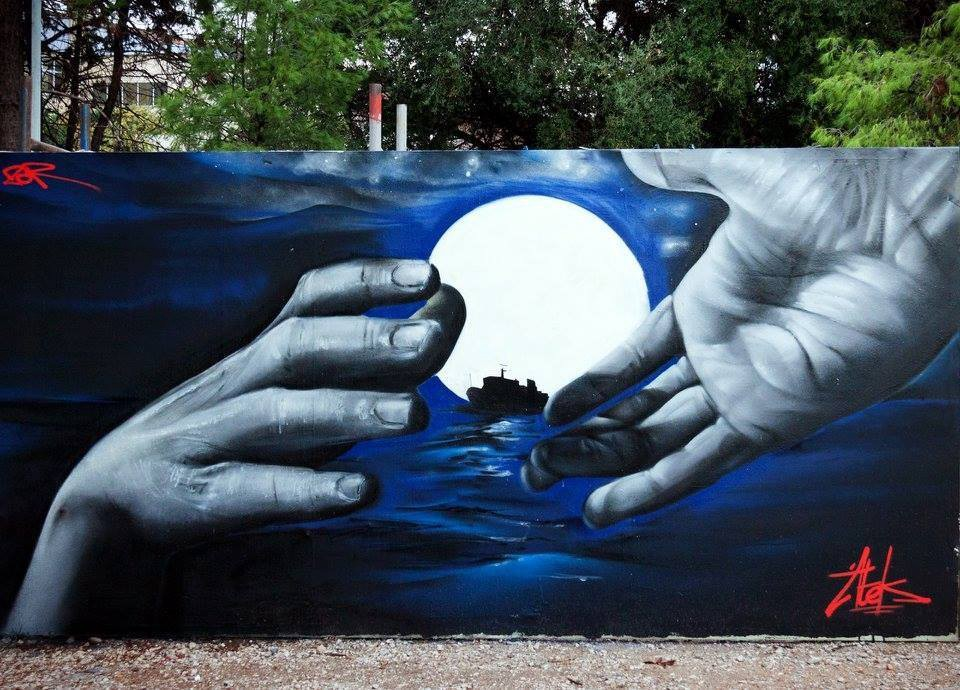

Athens, Greece, Helping Hand, Atek Art\. From Art Against\.
#### Intro

When people say 2016 was the deadliest year so far, they too often say it in relation to celebrity deaths that have marked the year\. While every lost life deserves to be mourned, we can’t feel proud of the world that only cares about faces from glossy magazines\. According to IOM, 7,274 refugee deaths have been officially recorded in 2016\. We can’t know how many are still unaccounted for\. However, refugee issues became „old news“ in the public discourse\. Compassion with refugees from many troubled countries was often replaced with growing anti\-immigrant sentiment\. We too often talk about the „refugee crisis“, while in reality we should be talking about the crisis of humanity\. While our governments continue to disregard needs and even basic human rights of refugees, we think they should know better\. For New Year special, refugees, AYS team members and our valuable collaborators express their wishes on how their own countries \(or countries they live in\) should deal with the crisis\.
#### Syria
### Dear 2017, I hope you will be better

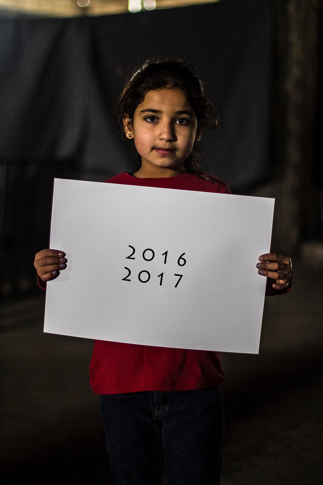

Dear 2016,
I forgive you for all the difficult things I passed, I was suffering during you but I am going to forget it\.
I will just remember the good moments which I spent\.
thank you for teaching me so many things\.

Dear 2017
I am waiting you and I have so much hope that you’ll be better

[\#Through\_Refugee\_Eyes](https://www.facebook.com/hashtag/through_refugee_eyes)

Abdulazez Dukhan, now lives in Greece
#### Afghanistan
### Not a single gun should be fired from

I wish this new year to be a good new year for all\. I wish 2017 be named the year of peace\. Not a single gun should be fired from\. No one should be far from their homeland, no one should miss those closest to them, their friends and families as a result of these borders\. Everyone should have the right to travel to any place that they want, and no one should live in fear\. I hope 2017 will be the year of equality of every human being, no one should take pride of their nation over other humans\.

_Ali, now lives in Austria_
#### Turkey
### Provide fair work opportunities for all

In 2017, I wish Turkey to truly realize and accept that refugees are here to stay\. Our country’s reluctance to admit the permanency of the issue has already caused enough damage in both refugees and host populations, while it also caused us to miss a lot of valuable integration opportunities\. I wish for my country to come forward with a comprehensive plan about how to help these vulnerable people to integrate in our country, and not act like they have a place to go back to\. The first step would be to acknowledge their refugee rights set by international agreements, while providing them opportunities to work and provide for their families\. This would provide them protection from predatory companies that are trying to exploit them by hiring them illegally and forcing them to work in slavery\-like conditions\. Another step is to press hard on countering the recent anti\-refugee propaganda spreading in our country\. Misinformation and fabricated news are straining the relationship between refugees and locals while incubating extremely dangerous situations\. In 2017, I want people to understand that we don’t have the luxury to turn our back and alienate those who need our help, and I truly believe in the compassion and perseverance of both refugees and people of Turkey to achieve a future together\.

_Mehmet Serdarcan Kurt, AYS editor_
#### Greece
### Time to admit systemic pathologies

I wish for Greece to stop pretending it respects refugee rights, admit its systemic pathologies and proceed to a global call for help, demanding the solidarity declared in theory to be expressed in practice\. I wish it declares the situation “a humanitarian emergency” and calls on the Commission to activate the Council’s “Temporary Protection Directive” \(2001/55/EC\), for the immediate burden sharing of all incoming influxes among EU member states\. I wish Greece exposes clearly, loudly and concisely how pressurized it has been for the last 15 years to massively violate refugee rights and to serve as a ‘breakwater’ for refugee flows reaching to the EU for protection\. I finally wish for both Greece and the EU to look directly and deeply in the eyes of their shadows, deep into the horrendous crimes their policies nurture, and to the insecurity caused to millions of EU citizens who witness that political leaders deny even the most absolute of rights, like the ones to life and dignity, to persons in their jurisdiction\. Only by exposing, seeing and admitting these crimes a different stance can be achieved\. I wish EU countries take a decisive turn towards honesty, efficiency and humanity\. I wish Greece and its partners to respect and protect the vulnerable, but also their human rights defenders, and stop harassing and intimidating them\. Finally, I wish Greece and its “partners in fear” will be able to perceive that building up walls that divide us, in an era when walls are naturally demolished, one after the other, in all aspects of social, economic and political life, is nothing but the materialization of all the invisible walls built up in the last decades, as a means to avoid compliance with Democratic values and with humanity’s real needs\.

_Electra Leda Koutra / Pleiades — Hellenic Action for Human Rights_

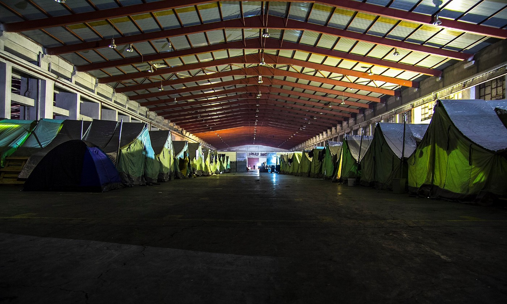

“ Here we close our eyes every night and here we open it again, some of us like their dream more than the reality, some of us would like to keep sleeping and dreaming more than waking up to find them selves here\.” Through refugee eyes
### Empowerment is a powerful thing

When one volunteers in Athens, what is immediately apparent is the politics between the various groups of volunteers\. But what is also apparent is that all these people bring passion in their hearts, passion for the cause, passion to help people that are, purely by the luck of where they were born, stuck in deplorable conditions in an unfamiliar country\. Along with the passion, there is also a competition between who gets to help the families more, is it those who live in Athens long\-term and are on the ground or those who come and go but bring with them donations and aid… neither group can do without the other, but neither can stop the conflict with the other… trust is lacking, but then trust is a powerful thing and can only be earned by working together\. What is also apparent is that people forget to ask the most important group of people, what is it that they want\! There are whole communities of refugee families who want to get away from this in\-fighting and who just want to re\-build their lives, They want to live together, peacefully and independently, in peace and harmony, \(in a non\-violent way\) and work with each, accepting each other despite their differences\. They want to build community centres where everyone can sit and eat together, play together, and educate and learn together\. All they need is empowerment to enable them to use the vast range of skills that they have, to build structures, to paint, to decorate, to cook, and to generally manage their own lives\. After all, they did all this back home didn’t they? And yet, the environment created by these politics gets in the way of their empowerment and their agency\. If only people could see the damage that they are doing to the very cause that they are trying to help\. Empowering vulnerable people doesn’t sound like a huge task and yet navigating through politics, people and egos makes the reality difficult and challenging and damages those that have been hurt by the bigger wider conflict, that of war\.

_Sumita Shah, independent volunteer_
#### Bulgaria
### Don’t turn migrant hunters into national heroes

As a Bulgarian, I wish that our country and people grow to realise the responsibility we have in the context of the conflicts in the Middle East and the fact we have the power to change people’s lives for better or worse and I don’t only mean the lives of refugees, but also our own and those of the future generations\. I wish that in 2017 more and more Bulgarians would start treating refugees and migrants with the respect and compassion they deserve… that every human deserves\. I wish “volunteer” migrant hunters will never again be turned into national heroes\. I wish in 2017 there will be no more police violence, or least that no police violence of any kind will remain unpunished\. I wish the many dedicated, brave and compassionate volunteers in Bulgaria stop receiving threats on daily basis\. I also wish that refugees and migrants would not be forced to live in disgusting closed camps, but have at least the option to be integrated into our society in case they decide to stay in the country\.

I wish that in 2017 refugee kids get access to education and are welcomed in the same schools with Bulgarian children and children of expats, and not treated differently than them in any way\. I wish that the state authorities and organisations working with refugees are run by competent people, people who chose their jobs because of their beliefs and willingness to make a difference\. I wish that in 2017 Bulgarian people will stop repeating that Muslims are terrorists, when it was recently discovered that Bulgaria is selling weapons in Syria\. I also wish they stop repeating that there is no war in Afghanistan, when Bulgarian military troops \(among many others\) are there as we speak\. I wish in 2017 we stop building fences in a desperate attempt to prove that we are “good enough” to be an outer European border and start spending for something that actually makes sense, something that shows that we are civilised enough to recognise our mistakes and take responsibility for them — to make a sharp change in our refugee policy and push our neighbours and allies to do the same\.

I wish that in 2017 “refugee” and “migrant” stop being dirty words in Bulgaria\. I wish our government and all the Bulgarian people take the time to think more about our future rather than our past\. I wish in 2017 we take the time to think about what do we want the refugees to remember about Bulgaria, what do we want them to tell their children and grand children about our country in the years to come, how do we want them to treat our children whey they visit their rebuilt countries or if God\-forbid they happen to seek refuge there\. May 2017 be the year that will make us feel proud for being Bulgarians, for being Europeans, for being humans\. Inshallah\!

_Katia Dimova, independent volunteer_
#### Macedonia
### Not all countries should be considered “safe”

In 2017 I want Macedonia to be a country in which refugees will be welcome\. I want the borders to open, and everyone who wants to come and ask for protection, to get it\. I want everyone who wants to enter the country to have that right, to have the right to be registered and claim asylum\. For this reason, I want Macedonia to amend its Asylum Act, so that not all neighbouring countries will be automatically considered “safe countries”; instead, the UN methodology should be applied\.

I want the refugees who have been stranded for ten months to be granted the right to be registered, or to get some kind of legal status which would give them the right to freedom of movement, instead of being kept in inhumane conditions and with limited freedom of movement\. I want the huge, inhumane and fascist fence on the border with Greece to be removed\. I want conditions in the Centre for Asylum Seekers to be improved and to be more humane\. For people to have warm rooms and better food\. I want the smuggling network to be broken up and for people to have legal status and legal movement\. I want Macedonia to adhere to the Convention on Refugees and not to reject asylum claims\. It’s not that refugees don’t want to stay here, but they are discouraged by the number of rejected claims\. I want Macedonia to take responsibility for the 32 refugees who lost their lives on its territory\.

I want Macedonia to be held responsible for all the illegal deportations to Greek territory\. In its Constitution, Macedonia is declared to be a humane welfare state, a country of solidarity\. That is what I want Macedonia to be in 2017 toward all people who reside in it\.

_Mersiha Smailović, Legis \(translation by AYS volunteer Sanja Sanja\)_
#### Bosnia
### Stop putting children to detention\-like facilities

Unfortunarely, in 2017, government in Bosnia and Herzegovina will for sure not change its policy toward refugees and asylum seekers\. But, I wish they would do that\. Even in this field, they will continue to disregard wishes of people of Bosnia and Herzegovina\.

When the Balkan route opened last year, many people from Bosnia and Herzegovina, self organized and tried to find the way to help to those in need\. At that moment, the government promised that the help will be given to anybody who enters the country\. Instead of helping, they imposed strict measures and started treating refugees as illegal migrants, potential security threats for the country, placing them in detention or detention\-like facilities\. Additionally, the same treatment is given to everybody, regardless of age, country of origin, health conditions… At the end of this year, in Bosnia and Herzegovina, children were kept in detention\-like facilities and treated as illegal migrants\. Nobody knows how many minors were and are treated like this, since the government decided not to keep record of them\. International organizations dealing with refugees and migrations, so far, didn’t react even though they are present in the country\. I hope this situation can change\.

_Nidžara Ahmetašević, AYS editor_

 \.](assets/106066f0bf74/1*B-Ru0pAjADUvcz-ejqUVCQ.jpeg)

Afghan refugees in Belgrade\. By [Igor Čoko](https://www.facebook.com/antonio.cimavica) \.
#### Serbia
### Start prioritizing refugees over bureaucracy

My New Year’s Wish for Serbia is for the Serbian government to begin to prioritize the well being of refugees and migrants over the well\-being of a bureaucracy\. The government and media apparatus continues to further criminalize and ostracize any assistance that falls out of the direct control of the government, further catalyzing anger towards refugees, migrants, and volunteers\. This is a dangerous trajectory and will only do harm to refugees, migrants, and the Serbian people, cultivating fear\. My wish is that rather than pushing refugees away and out of the public view, that steps towards hospitality and community be taken, and that more members of the public would put down their papers and pick up a cup of tea or coffee with a refugee\.

_Kelsey Montzka\-Böttiger, AYS editor / NorthStar coordinator_
#### Hungary
### Accept that migration is a movement for peace

As one of the most terrible years in the history of migration to Europe is ending, Migszol wishes first and foremost that people in Hungary, in Europe, around the world accept that **migration is a movement for peace** \! It is the largest movement away from war, deprivation, exploitation, and suppression\! It is the strongest movement asking for freedom, equality, and dignity\! 
From the Hungarian state we wish equal opportunities, freedoms, and rights for all — including refugees, asylum seekers, homeless people, Roma, queers — to be granted on the basis of the Declaration for Universal Human Rights and the national constitution\. This said, we wish that the Hungarian state takes responsibility for its social and material duties as grantor of these rights\.

**First** , we wish that the practice of brutally pushing back people to Serbia be stopped and the right for legally seeking asylum be re\-established in Hungary\. This includes that in the transit zones at the border people seeking refuge have to be accepted without restriction or discrimination\.

**Second** , in November 2016 the open reception camp in Bicske, near to Budapest, was closed and people seeking asylum were transferred to facilities far away from any access to support or the possibility to start a new life\. Despite us being against any encampment of people, we wish this worsening changes to be reversed\. Herewith, we also wish for an immediate closure of the inhumane tent camp in Körmend, in which people are forced to stay in the middle of this winter\.

**Third** , we wish for an improvement of social services in the form of financial support, language classes, housing, education, health\-care and work opportunities\.

**Forth** , we wish the Röszke 11 trials to be investigated at the High Court for Human Rights and the disproportionate conviction of Ahmed H\. to be appealed and overruled\. We demand freedom for the Röszke 11\!

We continue to stand in solidarity with all people seeking protection in Hungary, in Europe, in the world\!

_Salome Schaerer, MigSzol_
#### Croatia
### Offer protection instead of push\-backs

In 2015, Croatia was one of the first ex\-Yugoslavian countries to offer humanitarian transit support for refugees on Balkan route\. In 2016, it was one of the first countries to deny it\. While noticeable progress has been made in providing decent living conditions to those who are stuck in Croatia, we still refuse to accept the reality of constant migration through our country\. Smuggler activity has replaced government\-led, NGO\-supported humanitarian response which made us so proud in the past\.

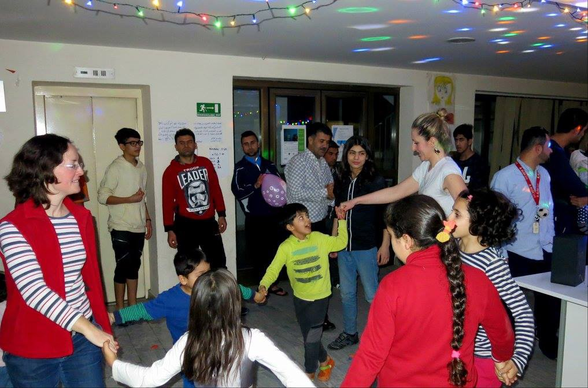

AYS volunteers Sanja Miskovic and Dzenana Dzaferagic playing with children in Porin refugee hotel\. Photo: Sanja San

In 2017, I wish for Croatian government to respect everyone’s right to seek international protection and stop the policy of silent push\-backs\. I wish for Croatian educational system to fully accept children who are still waiting to enter our schools\. Unaccompanied minors need to be provided better support in language of their choice\. No one should be told to go back to Afghanistan or any other war\-torn country based on quotes from Wikipedia or several years old reports\. Croatia remembers our own refugees seeking shelter in European countries during the 1990s\. Let’s use this opportunity to offer holistic institutional and civil support to those who need it now\.

_Milena Zajović, AYS editor_
#### Austria
### Hear people’s stories instead of stereotyping them

For Austria I wish refugees to be treated as human beings rather than numbers by political decision makers, and hope for the spirit of the Geneva Convention to be upheld and reinforced; I hope victims of war and displacement won’t be stereotyped any longer in the public debate; I wish asylum seekers won’t have to wait one and a half years or longer to be able to explain their reasons for seeking international protection in Austria\.

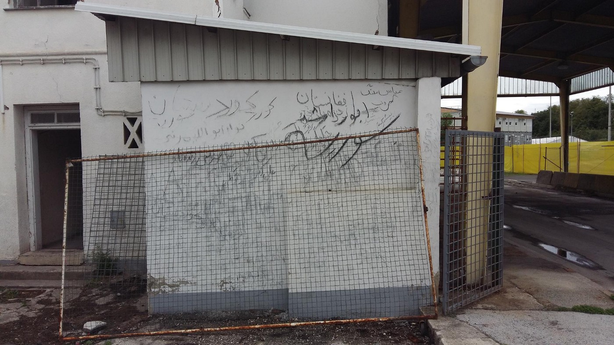

Sentilj/Spielfeld border crossing, the main gateway to Austria from Sept 2015 to March 2016\. Photo: Petra Leschanz

This picture shows the writing reflecting hopes, dreams and memories of those waiting for hours and days at the Sentilj/Spielfeld border crossing, the main gateway to Austria from Sept 2015 to March 2016, before being able to finally cross the border\. In the rear: the huge infrastructure of tents, fences and gates build by Austria at the border which is still standing today but completely in disuse\.

_Petra Leschanz, Border Crossing Spielfeld_
#### Switzerland
### Abolish the borders in hearts and minds

My wish isn’t just for 2017 but for 2018, 2019, 2020\. It is for as long as this refugee crisis is happening: For the borders to be abolished, not just the physical ones but in the hearts and minds of people\. Countries need to stop speaking about the crisis in terms of economics and security, as opposed to empathy\. In 2016, Switzerland rejected three quarters of asylum applications received and took part in 20 deportation flights with the EU\. The Swiss village of Oberwil\-Lieli would rather pay 290 000 CHF in fines rather than take in ten refugees as “they wont fit in”\. Ten\! The Swiss borders with Italy remain resolutely shut, with the border guards pushing back anyone who simply wishes to transit through Switzerland, according to our readmission agreement with Italy\. Action from Switzerland did a scouting trip in the summer and we confirm that this has cause stress on aid agencies and churches struggling to manage the backlog at the Italian\-Swiss border\. It is also inconceivable in my mind that anyone seeking asylum in Switzerland are required to hand over any property over the value of CHF 1000\. Asylum seekers who do secure the right to live and work in Switzerland will also be required to hand over 10% of their salary for up to a decade, or until they pay back CHF 15 000\. The Swiss government defends its stance for the law under the rationale that asylum seekers and refugees need to pitch in for the costs associated with processing applications and social services\. It is laughable for one of the richest countries in the world to even needing to adopt such a measure\. It is akin to the chilling Nazi policy of confiscating gold and other valuable items from Jews and others during World War 2 and contradicts Switzerland’s supposed long humanitarian tradition\. Refugees have lost everything they possess and to be stripped away what they’ve managed to salvage is mind boggling\. They deserve compassion, understanding and our solidarity\. There are solidarity movements within Switzerland but we can never have enough people on our side\. If people could use their hearts, and consider for a minute, that the only difference between the refugees knocking on their doors, begging for sanctuary, and them is the simple fact that they’ve been blessed by the circumstances of their birth\. Their passport\. If these people who’ve not yet opened their hearts and minds could seriously contemplate the question: “what if it was me? my family? My sister? My mother?” Maybe then, we will finally see that all borders will be finally abolished — not just the physical barb wire fences, manned by border guards, but also the borders in peoples’ hearts and minds where humanity and compassion rules\.

_Gabrielle Tan, Action from Switzerland_

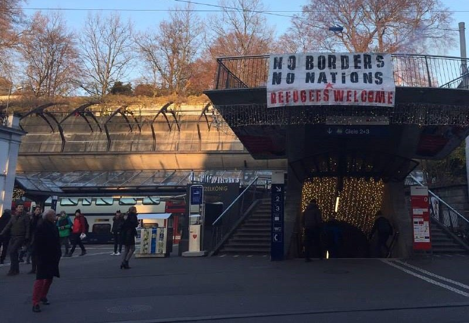

In 2016, Switzerland rejected three quarters of asylum applications received\. Photo: Anna Bleibe
#### Germany
### Illuminate the darkness of nationalist fear

In 2016 we saw huge efforts in integrating refugees\. More and more were able to leave the camps and gyms and find appropriate shelter, some education or work\. Here the governmental support for most of them seems to be — unfortunately — unique in Europe\. Volunteers are also working tirelessly to make integration as smooth as possible\. But the conditions are getting harder: in some cases authorities try to get rid of refugees, especially those from African countries, using questionable practices, and have started to deport Afghans back to their country of origin\. After coming back to Dublin III for Greece, as advised by the European commission in March, and implementing the aimed deals with African countries similar to the one with Turkey, it will be even harder to seek and find asylum in Europe\. But what we, as the European Union, have to do in 2017, is not to outsource our self\-made so\-called “crisis”, but to take the humanitarian responsibility we preached for decades and gave ourselves\. We have to stop illegal deportations as a reaction to racism and treat humans like humans, not like poison\. Where nationalists bawl and foment fear, we have to illuminate\. Because humanity comes first\.

_Niklas Golitschek, AYS contributor \(Brian Miller and Lena Reiner contributed\)_

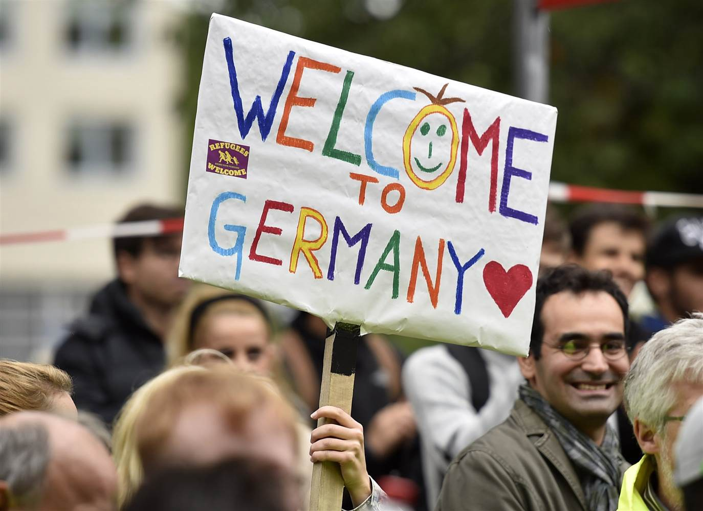

Volunteers are also working tirelessly to make integration as smooth as possible\.
#### Italy
### Understand that inclusive models are winning

For year 2017, I wish for Italy to open up to itself\. I wish my people to start seeing their territory the way it is: full of migrants, refugees, desperate adults and children who faced death, and now they simply want to build up a new life\. Most Italian people are confused, and scared\. There is no framework, nor communication on the events\. They need to cope with the new reality, slowly but solidly realizing what Italy is today\. Hope, for most of the newcomers\.

I wish the local governments to see migrants and refugees as a resource, to give them the chance to develop and grow, and to represent a chance, rather than a burden\. Parishes, volunteers and small realities show the strong wills of some locals to support who needs help\. I wish these governments to do their job, to represent this direction and to build up the best conditions for a new life\.

I wish the regions to understand that inclusive models are winning\. Tuscany is a great lab, it allows Italian families and enterprises to “adopt” refugees and migrants, respecting the formers’ freedom while promoting foreigners’ work and life in a stagnating system\. The region is barely tolerating the effort, but it stands and challenges the central government: “we can still host people, what’s your excuse?”

I wish the Italian representatives to refuse communication based on assumptions and threats\. My people need to understand the complexity of this reality, it deserves truth and freedom of expression, not ghosts of invasion and foreigners blamed as an excuse to facing the reality\.

I wish Italy to promote bottom\-up processes of inclusion, dialogue and coordination, to match the famous Italian solidarity with a well\-functioning inclusive and pro\-active system\. One day, I wish to see my country face Europe, and proudly saying it\. “we can still host people, what’s your excuse?”

_Jacopo Spatafora, AYS info gatherer_
#### Spain
### A year of solidarity and closed borders

Political activists, professors, electricians, students, swimming pool lifeguards, plumbers, doctors, nurses, etc\. Many people and many stories that show beyond countries, ideologies, religions\.

This year has been an occasion to top up into practice all of our human values\. Cooking for 5000 people in the field of Idomeni, sorting warehouses, organizing activities for children in a squat, attending pregnancies in tents, working on maintenance to set up running water, installing electricity for the night, cleaning… Sharing daily life with people whose language you don’t understand, but the non\-verbal language translates into a universal one in a refugee camp; common meals, laughing together, loving through glances, intense emotions, having tea together in a tent, learning that the one who has the least shares the most\.

Seeing into the world of smugglers who sell false passports, walking through a park where young men prostitute themselves to earn the 10 euros they need for food or for drinking in order to forget the agony they live every day\.

It’s been a year when the EU and the Greek government are closed their doors to the volunteers letting only the big NGOs in, insisting on protocols that prohibit immediate relations between the volunteers and now we are seen almost as suspects\.

We wish that the coming year bring peace to the Syrians or otherwise, open borders\.

We hope in the coming year our government welcomes the 18,000 refugees they promised to welcome\.

We want the social and institutional racism to become a thing of the past\.

We want human rights to be the program of all political parties in Europe\.

_Richi Valderrama, independent volunteer_

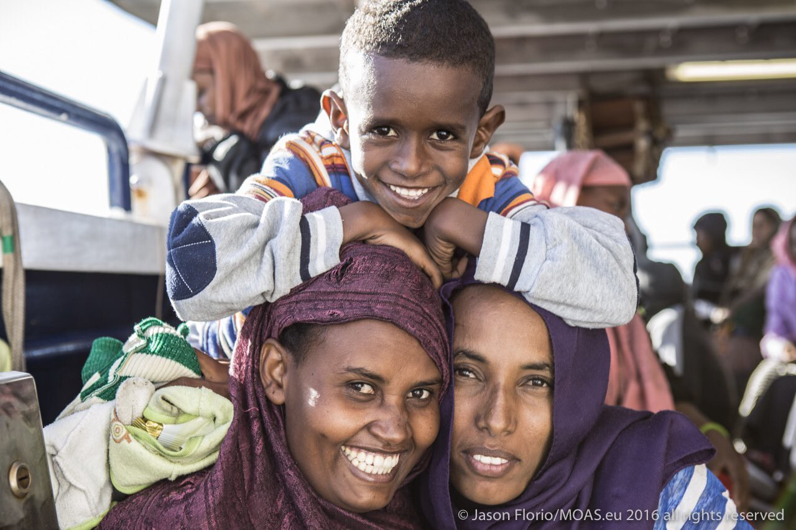

“We’ve come across some incredible people this year; we’re thankful to have met & learned from their strength & resilience\.” Photo by Jason Florio/MOAS
#### Portugal
### More action, less empty promises

This year we’ve seen how Political Solidarity lost ground across the continent\. The borders closed, minds are closing and racist populists are breaking the project of a free Europe and free people where the most vulnerable should be supported and not repressed\. Portugal so far hasn’t seen a rise of these movements and in general it has been supportive to the cause of helping and welcoming refugees\. Unfortunately this hasn’t really made a difference considering the huge numbers of refugees still waiting to be relocated from Italy and Greece with Portugal only taking 747 refugees up to the 19th of December\. Back in February the prime minister said the country was willing to receive 5800 people in addition to the 4486 that had already agreed to take rising the figures to over 10000 people and when he visited Eleonas camp in Athens in April it was said that the governments of Portugal and Greece had and agreement and that Portugal was ready to take immediately 1250 refugees\. Promises that never came true\.

Recently António Guterres, previous UHNCR Commissioner for Refugees, was elected UN secretary general and hopefully he will continue to struggle for a better treatment for refugees around the world and inspire Portugal and other countries to do more and better in the future\. So for the new year I hope for more solidarity and above all more action and for less empty promises and less political show, that in Portugal in particular is many times used for internal and even external political benefit\. I demand commitment and that, once and for all, these promises become a reality\. I wish that governments finally respect the laws of the Declaration of Human rights and follow responsibly their obligations\. I wish that the needs of the most vulnerable people can be put in first and that we can finally give an answer according to the scale of this crisis\.

_Joao Pequeno, AYS editor_
#### France
### Protect unaccompanied minors looking for shelter

France’s New Year’s resolution should be to provide unaccompanied minors with the protection they deserve, after forcing them to sleep in the streets of Paris in 2016\. DEMIE, the organism that is supposed to protect them in Paris, turned down 60% to 80% of kids looking for shelter, often arguing they lack the ID papers that could prove they are underage\. The office refuses to give them the benefit of the doubt, even when it is undeniable that they are still kids, and prefers to send them back into the streets where they have to cope with hunger and cold and are at the mercy of traffickers\. Volunteers are able to host some of them, for a few days to a couple of months, but it is never enough\. In 2017, France should immediately protect unaccompanied minors looking for help in the ‘country of human rights’ — it should take their vulnerable state into account and shelter them, like they would for any French kid finding himself in a similar desperate situation\. By doing so, it would simply fulfill a promise it made in 1989, when it signed the Convention on the Rights of the Child\.

_Luca Eckermann, AYS editor_
#### UK
### Individual governments erected fences not the EU

This time last year I was still blaming our respective European governments for the failure to provide safe passage, further down the line closed borders and human living conditions in camps etc\. Everyone started blaming the Institution EU, when it was individual governments who ignored signed treaties and erected fences\.

In September 2015 a financial aid package for the refugee crisis on European soil was announced,\(I believe in The multi billion € bracket\), the EU paid in it’s half immediately, the Member countries haven’t to this day\. This fund paid for the buses on Lesvos, train through Macedonia, partly for other transport along the Balkan route\.

I sincerely hope our compatriots come en masse to their senses and want to help refugees by allowing them into their country\. Is the people who ultimately hold the power, democratic parties just to win the next election\.

_Rando Wagner, Independent volunteer_
#### Netherlands
### Campaign of structural demonization needs to end

In 2016 we have seen a Europe wide anti refugee sentiment which and Holland had its fair share of hate and ear driven violence against refugees\. What are we afraid off? What does it matter what religion somebody fleeing for war has? Where did the tolerance go Holland was so famous for, how come we have exchanged humanity for fear and hate?

Only a structural demonization of the refugees on grounds of religion and culture could make us to see them as subhuman and treat them accordingly\. Dehumanized and painted as a threat to western civilization they are seen as dangerous and unwanted intruders\. In the news we read that refugee flows we are so afraid of haven’t been so large since the end of World War II; a war that left the world with treaties and declarations on war, peace, refugees and human rights\. The UN’s Universal Declaration of Human Rights of 1948 was an important time in history and one of the achievements of western civilization to be proud off\.

So on the dawn of a new year lets take a moment to reflect on article 2; “Everyone is entitled to all the rights and freedoms set forth in this declaration, without distinction of any kind, such as race, colour, sex, language, religion, political or other opinion, national or social origin, property, birth or other status…\. \.” A campaign of structural demonization, dehumanization and scapegoating the other has lead to the conditions that made the atrocities that have been committed possible\. After this the world said ‘never again’ but we have not been able to keep our promises\. Writing form the city that is known for its tolerance and that has been a safe haven for people seeking refuge for many centuries, I hope that solidarity and humanity will make us build bigger tables, not higher fences\. The only thing we have to do is to open our hearts and eyes\.

_Aida Kristina Ničija, AYS info gatherer_

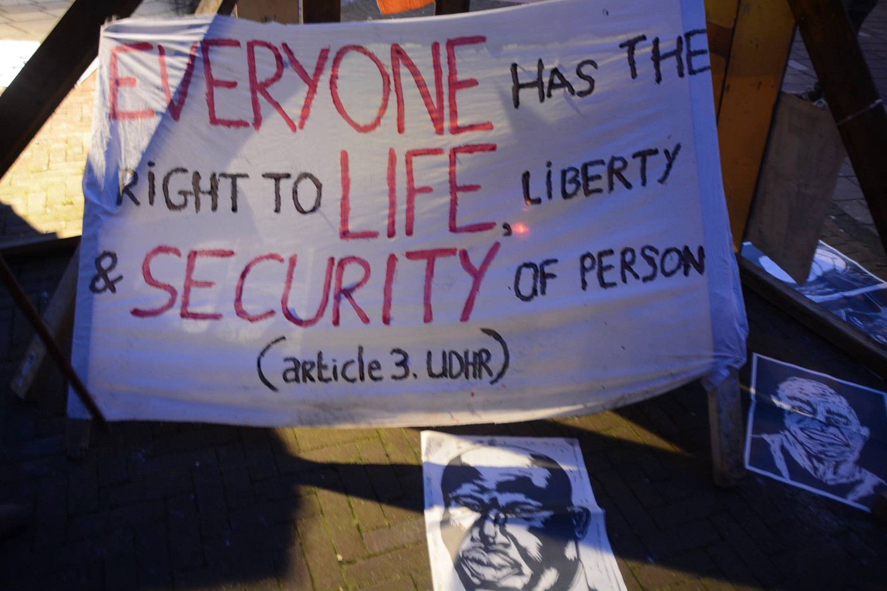

Message from a recent solidarity protest in Amsterdam\. Photo: Aida Kristina Ničija / AYS
#### Sweden
### Don’t limit the right to family reunification

In 2017 there are a lot of specific things I would like Sweden to change\. For example the right to family reunification that has been restricted in the last year\. This is something that affects women and kids most, since they often are the ones left in the country of origin or somewhere along the route\. I don’t think that is a good feminist foreign policy, as Sweden as the first country in the world claims it has\. And I would like Sweden to stop criminalizing and blaming unaccompanied minors for claiming to be older than they are and instead talk about why these young people might feel the need of doing so\. Another wish I have is to stop sending people back to unsafe countries such as Afghanistan and discuss similar agreements with other countries as well\. I also really hope that right wing populist doesn’t grow and gain more support here than they already have\.

But maybe first, I would like people to start questioning the concept of humanity\. What is that, for who is it, and how shall this humanity be implemented in practice\. I think we need to discuss these issues on a more general and philosophical level in order to do changes in certain decisions that are made, both by citizens and politicians\. We have to start talking about why things are happening, not the symptoms and how we shall treat them to protect ourselves\. That is double standards for a country that still claims to be a humanitarian superpower where equality and human rights are respected\. I hope that Sweden, and its citizens, that for a long time have been privileged wont let that privilege affect our ability to feel compassion for other less fortunate, those who cannot choose not to be a part of the ongoing crisis the same way as we can, in 2017\.

_Hanna Strid, AYS info gatherer_
#### Norway
### Volunteer — a fascinating “new breed”

2016\. What a surreal year, the “election” of a sociopath as president of one of the most influential nations, the massacre of thousands under the passive eyes of international political community, the shameful reception of hundreds of thousands of desperate people by the European governments all resulting in a deeper moral and humanitarian crisis\. I never thought I would assist such a situation on my life time\.

In the other hand, I never thought to meet and work with hundreds of international volunteers, united on a borderless community bringing relief to the fleeing people, by their own means, throughout the refugee routes\. What a fascinating “new breed” — My second wish goes to you, a year of heart filling experiences, peace, more support and less work — you are bringing back the meaning of the words refugee and humanity every day\.

The third — I wish peace, warmth and happiness to all the suffering people, I wish you are reunited with your family soon as possible, I wish you life,however and wherever you feel the best\. As migrant myself, I feel the best in Norway\. This country has been known as one of the richest and most peaceful countries in the world\. However it revealed also to be one of the most profiting nations over oil related conflicts\. The Nobel prize host is one of the country with the strictest and most unwelcoming policies regarding asylum seekers\.

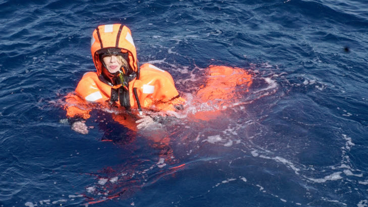

Øistein Norum Monsen / NRK

So another wish for the upcoming year is that politicians like Sylvi Listhaug admit that the current outrageous asylum policies are irresponsible, deadly and will have the opposite and negative impact on this society she allegedly tries to contain\. Stop deporting Afghan kids to war zones for example\. Improve the asylum services\. Promote solidarity in opposition to hatred\.
\[I also wish that she comes back to Lesvos with her family and jump in the water, but this time with no special suit and any kind of support\. Maybe a more realistic experience, if survived, will in print a new attitude, solidarity and respect towards fellow humans\. \]

_Ana Jorge, AYS collaborator / Greecevol\.info_
### Last, but not least…

Many more authors, researchers and collaborators have greatly contributed to AYS info team in the past year\. It’s been a hard year and we’d like to use this opportunity to warmly thank all volunteers who have sacrificed their own private lives to help the others\. **You make this world a better place\.**

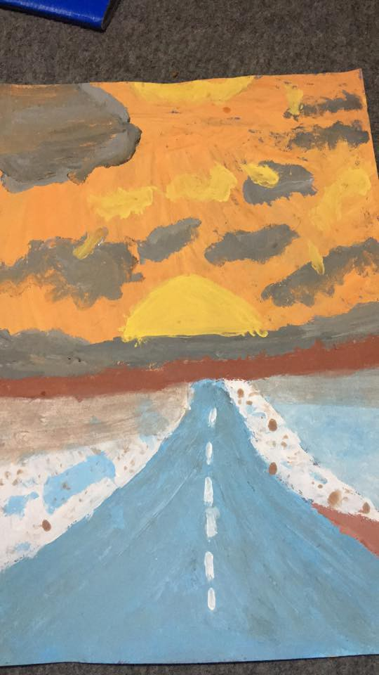

The Future, Noor\-17, Syria, Nea Kavala, Art Without Borders

_Converted [Medium Post](https://medium.com/are-you-syrious/ays-new-year-special-this-is-what-we-wish-for-in-2017-106066f0bf74) by [ZMediumToMarkdown](https://github.com/ZhgChgLi/ZMediumToMarkdown)._
