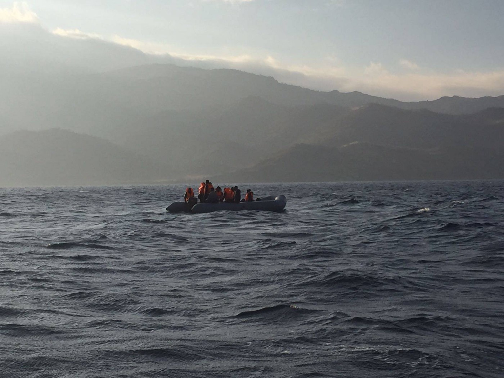
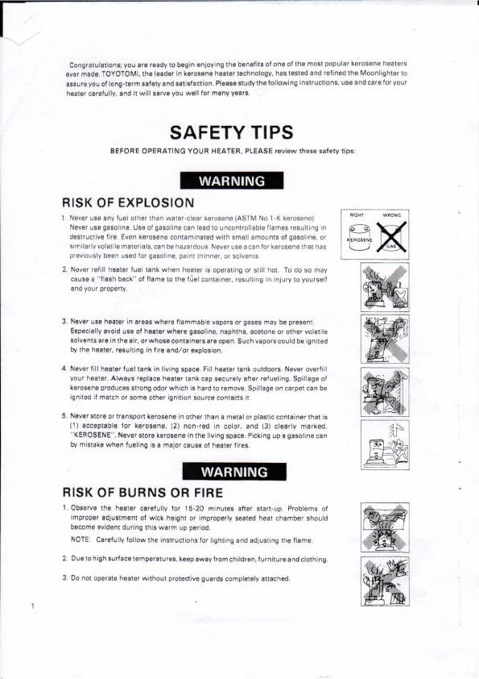
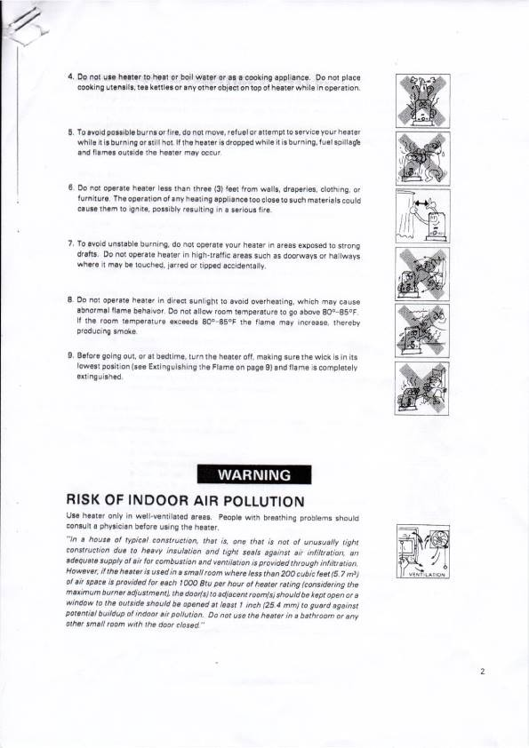
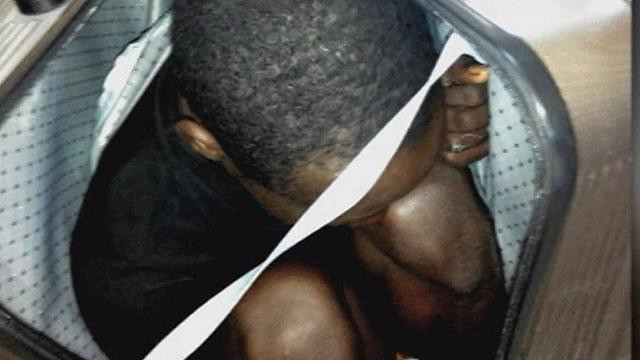

### AYS DAILY DIGEST 3/1/2017: Closed borders took three young lives this year

_230 people rescued from the sea over the last 24 hours // Young Afghan man froze to death after trying to cross Evros river from Turkey to Greece // Young woman froze to death while trying to cross from Turkey to Bulgaria // Young woman found dead in the center near Venice // Sweden to start performing a controversial medical age assessment for children asylum seekers_

 n\.](assets/f625edc6764f/1*r6RJMj_9smJQIYejx8aQuA.jpeg)

The Samos camp foundstrumen creature is born, through the hands of children, adults, and the entire community\. A huge colorful and interactive addition made by many people who don’t speak the same language and come from different parts of the world\. Photo by [Artolutio](https://www.facebook.com/Artolution/?fref=nf) n\.
#### Mediterranean
### \#safepassage

Since the beginning of this year — only three days — 230 people were rescued from the sea\. This morning, more than 100 people were found floating on a boat\. All people were pulled to safety, MSF Sea reports\.

■■■■■■■■■■■■■■ 
> **[MSF Sea](https://twitter.com/MSF_Sea) @ Twitter Says:** 

> > BREAKING: Another rescue just completed by #Aquarius under very challenging conditions. Desperate people in water but all pulled to safety https://t.co/c081IwRavh 

> **Tweeted at [2017-01-03 11:58:33](https://twitter.com/msf_sea/status/816252407856263168).** 

■■■■■■■■■■■■■■ 

#### Greece
### Perilous journey to freedom

The winter in Greece took the first refugee life\. Near the city of Didimoteicho, police found a body of an Afghan man, 20 years old, who has died of hypothermia after crossing Evros river, at the border with Turkey\.

Over the last couple of months, this border crossing became very busy\. It is used by people coming from Turkey and trying to avoid the possibility of being arrested and deported at one of the islands\.

However, people are still arriving to islands\. At Lesvos, two boats were rescued today with about 70 people, including many children\. 13 people were registered arriving at other islands\.

](assets/f625edc6764f/1*sj2PofaFFMsJrsf5z247Ww.jpeg)

Photo by [Refugee Rescue](https://www.facebook.com/RefugeeRescueUK/?ref=page_internal)

For all those who are getting ready for their journey, but also all the volunteers and refugees in Greece, warning about a fresh wave of cold weather from Thursday\. Forecasting temperature is as low as \-5 Celsius\. According to the national weather service \(HNMS\), there is also a possibility of a new snow\.

> WHERE TO FIND FREE MEALS IN ATHENS? 

> \* \*Caritas Hellas\* \*
 

> Kapodistriou Street 52
 

> Tel: 210–524\.66\.37
 

> Monday to Friday: 10:30 to 13:00 

> \* \*Helping Hands \(Athens Refugee Ministry\) \* \*
 

> Sofokleous 53
 

> Tel: 210–322\.42\.16
 

> Tuesday to Friday at 13:00 h
 

> With ticketing system\. Tickets are provided every Friday at 13:00\. 

> \* \*Khora \* \*
 

> Tsimiski 21 / Asklipiou 80
 

> Monday to Saturday — 2nd floor
 

> Breakfast from 10 am
 

> Lunch from 1 pm 

> \* \*Omonia Church\* \*
 

> Pireos 28, 1st floor, Omonia
 

> Luchs on Tuesdays and Thursdays
 

> Time meals to be confirmed\. 

> \* \*Samaria\* \*
 

> Leonidou 20
 

> Tuesdays and Wednesdays: 16:00
 

> \(Meal for homeless Greek people: every Monday\) 

> Researched and collated by the [Athens Volunteers Information and Co\-ordination Group](https://www.facebook.com/groups/AthensVolunteersInformation/?fref=nf) \. 

_With bad weather comes flu\. An increase of cases is noticed in many camps and squats\. Shortages in medicines, especially at the island, is the big problem\. All of you out there, please take care of yourself and help to the others\._

Currently, there are 62,792 persons registered all over Greece\. Out of this number, 7,600 are self\-settled, while 18,567 are accommodated in different places which are sponsored by different NGOs or UNHCR\.

Nevertheless, some of the refugees are reporting strange rules apparently imposed by the UNHCR at some of the accommodation facilities they are paying for\.

[Abdelilah Alhamoud](https://www.facebook.com/abooda20124?fref=nf) posted FB status about visit to his sister’ family in the new house near Thessaloniki, city Epanomi\.

_“Today I went there and I arrived by 3 pm, everything was ok; y lovely nephews were very happy to see me again and me as well; but I surprised when the \#UNHCR officer asked me to leave because I’m not allowed to stay after 5 pm; then they kicked me out I can’t believe why all that really it is a shame; we have got tired of being a refugees\. But I don’t understand is it a crime if a sister wants to spend a few hours with her brother ??\! \! \! \! \! \! \! When we told you that we are living in big prisons in \#greece you were laughing but Unfortunately, this happened today with me\. Is this 2017 ????\! \! \! \! \! \! \! Just we want to be free like others Thanks \#UNHCR for the nice prisons Thanks \#GREECE for \#stables that you build for us Thanks \#EUROPE for you humanity Stop the war in Syria and you won’t see our faces here anymore\.”_
### Voices against racism

While the overwhelming majority of refugees on Chios are from Syria, there are also people coming from different African countries, like Cameroon, Congo, Mali, Nigeria, Ghana, Eritrea, Ethiopia, the Caribbean island of Haiti\. Yesterday, the African Refugee Community of Souda Camp, held a small protest to voice their frustrations at what seems to be the racist asylum process and treatment of Africans in Greece\.

> Call for volunteers 

> [Filoxenia International](https://www.facebook.com/filoxenia.intl/?fref=nf) is urgently looking for volunteers to help us setting up and running activities for Filoxenia’s residents\. If interested, please contact Eva, their protection officer at [eva@filoxenia\-intl\.org](mailto:eva@filoxenia-intl.org) 

#### Safety manual for kerosene heaters

Immigrant and Refugee Support Athens
#### Bulgaria
### Closed borders are taking lives

According to the [Border monitoring Bulgaria](http://bulgaria.bordermonitoring.eu/2017/01/03/breaking-news-somali-migrant-dies-near-the-bulgarian-turkish-border/) , a body of a woman has been found near the border with Turkey\. The body was found yesterday after a group of people who entered on the New Year’s Eve — 31 person from Afghanistan, Pakistan, and Somalia — told police that they had to leave her because she was too weak to continue walking\. Two other members of the group, 14\-and 16\-year old teenagers, were taken to the hospital because of frostbite\. The others were arrested\.

Additionally, police arrested 26 people who were trying to cross from Bulgaria to Serbia also on a New Year’s Eve\.
#### Italy
### Protests against inhuman treatment

Huge riots occurred in the center in Cona, Venice, after one young woman, Sandrine Bakayoko, from Ivory Coast died\. Her body was found in the bathroom on the morning of January 2nd\. People in the center claimed that it took them 8 hours for the ambulance to respond their call\.

After her death, a group of people occupied center, keeping inside 25 employees of the Cooperative Ecofficina\. They were released after the arrival of the police\.

People also raised their voices because of overcrowding, the cold, the shameful conditions, the lack of basic services, and other problems\. Apparently, the Center capacity is 540, but it hosts about 1,400 people\.

After negotiation with local authorities and the police, the protest died down\.

Centers in Italy are run by cooperatives based on government contracts, and so far several of them face criminal probes for corruption and fraud\.
### People are still arriving to Como

In Como, more people are arriving daily, with a noticeable increase since December 25th, [WelCom — Osservatorio Migranti Como](https://www.facebook.com/osservatoriomigranticomo/?fref=nf) claims\. Many people are still forced to sleep outside\. Volunteers found 49 person sleeping in the street in the night between January 2 and 3rd\.

#### Spain
### \#Safepassage

A women from Morocco was arrested after they found a young man hiding in her suitcase\. He almost suffocated and doctor’s help was necessary to save him\. Woman will be charged for attempt to smuggle a person across the border into Spain’s North African enclave of Ceuta\.

#### Germany
### 420,000 asylum request processed

Figures released on Tuesday by the EU statistics office, Eurostat, are showing that around 420,000 asylum requests were processed in Germany in the first nine months of 2016 — more than in all other 27 EU countries combined\.

A total of 756,000 asylum requests were processed in the EU between January and September 2016\. Out of this number, 55 percent were handled in Germany\.
#### Sweden
### Age assessment of unaccompanied minors soon to began

During the first three months of this year, Sweden will start with the medical age assessment of unaccompanied minors who applied for the asylum\. There are around 20,000 open applications now\.

Age test that in Sweden are widely discussed, both from the ethical perspective, but also the reliability\.

[According to Fredrik Bengtsson, Head of communication at the Swedish Migration Agency](http://www.svt.se/nyheter/inrikes/nu-ska-tusentals-alderstester-genomforas) , not all of the 20,000 cases will need medical age assessments, but a significant part yes\. Previously the Agency have said that up to 70 percent of the unaccompanied minors may need to be tested in order to be able to verify that they really are under 18 years old\.

The Department of Forensic Medicine \(in Swedish “Rättsmedicinska market”\) are responsible for the implementation of the medical age assessments, but they will purchase agreements and deals with clinics who will actually do the tests in practice\.

The procedure consists of a x\-ray of teeth and an MRI of the knee joint\. The result will be overlooked by two dentists and two doctors and then compiled by The Department of Forensic Medicine\. If the tests don’t start as they are supposed to in the beginning of 2017, the asylum seekers will have to rely on other evidence in their asylum process\.

_Converted [Medium Post](https://areyousyrious.medium.com/ays-daily-digest-3-12-2017-closed-borders-took-three-young-lives-this-year-f625edc6764f) by [ZMediumToMarkdown](https://github.com/ZhgChgLi/ZMediumToMarkdown)._
