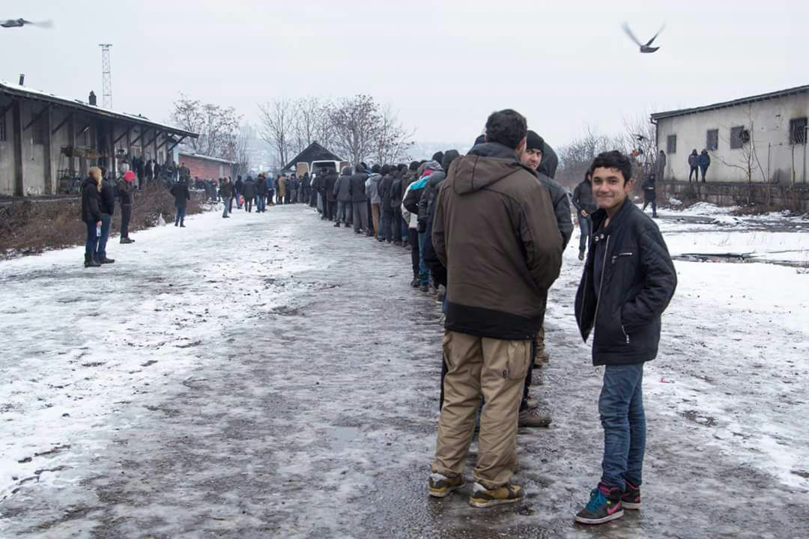
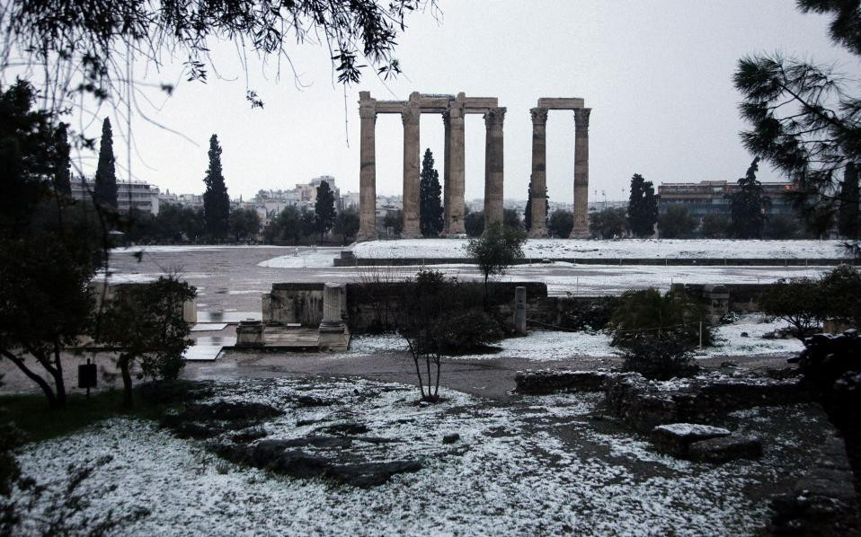
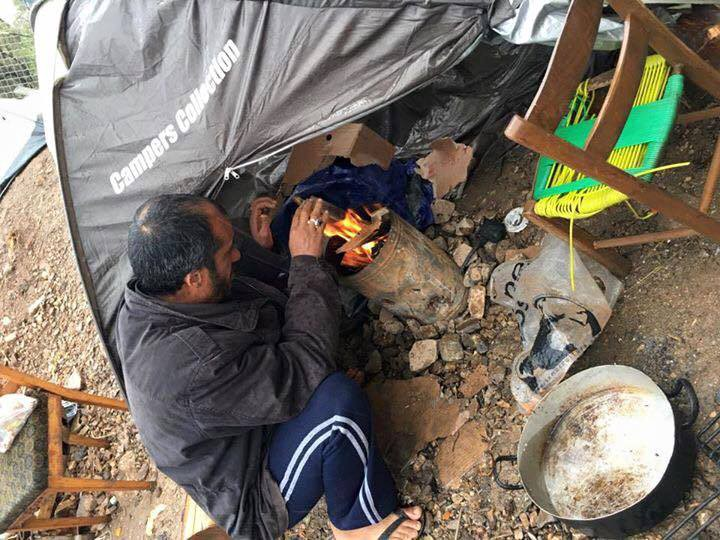
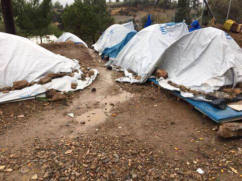
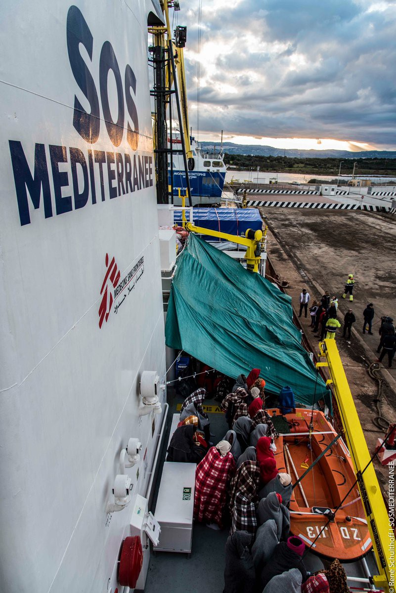

### AYS digest 4/1: Activists facing prison time, governments let refugees freeze on the streets of Europe

_Overcrowding and freezing cold in Greek camps / Returns to Greece may be resumed, but humane conditions not / People returning to freezing cold and destroyed Aleppo / Sub zero temperatures in Belgrade — MSF wants to help people who are sleeping rough, government silent / 375 new rescues in the Mediterranean / Italy to “step up” deportations / Belgium wants to increase border controls in trains, buses and ships / French farmer on trial for being an activist and helping those that were in danger_

Belgrade today\. Long line for food distribution\. Photo: volunteers in Belgrade
#### Greece
### **Overcrowding in the camps, people sleeping in police precincts**

There are 93 new arrivals in Greek islands today\. As camps on the islands are dangerously overcrowded, people are being in some instances transferred to local police precincts\. “The situation in the cells has been suffocating for months now,” Dimitris Alexiou, spokesman for the local police union, told Kathimerini\. With overcrowding and cold temperatures, flu is spreading in the camps\.
### **Cold front from Siberia**

Snow in Greece

Meteorologists on Wednesday warned that a high\-pressure system from Siberia is expected to sweep into Greece on Thursday, bringing freezing temperatures and snow to many parts of the country, including the capital\. According to forecasts so far, temperatures in Athens will drop below the 0\-Celsius mark for about three days from Friday, with the wind\-chill factor making it feel like \-10 Celsius in the capital’s northern suburbs and mountains\. In other parts of the country that are accustomed to wintry conditions, the wind\-chill factor is expected to be as low as \-25 Celsius\.
### **Returns to Greece may be resumed, but humane conditions not — sign the petition against the returns**

Overcrowding and non existent winterization of the camps did not prevent the EU commission from recommending the returns to Greece that were suspended in 2011 and, as we have reported, may be resumed in **March 2017** \. This recommendation, though, is not binding for all EU member states and can not be applied retroactively, meaning that people who reached other EU countries in the past and until the 15th of March 2017 will not be returned to Greece\. The new rules will concern only asylum applicants who enter Greece irregularly or not from the 15th of March, 2017 onward, and then move without authorization to another EU country\.

Greek camps\. Photo: Calais Action

Calais Action stresses that “Yet no moves are being made to force other European states to make good on their commitments to receive a quota of refugees\.” Out of tens of thousands relocations that member states agreed to, only 7,006 have been carried out until the end of 2016\. “ If these “Dublin” transfers are restarted Greece will once again be bearing the burden for the refugee crisis completely unsupported by other responsible Schengen states\.” Calais Action collective posted next to the online petition to stop the returns to Greece\. Please sign it [here](https://www.change.org/p/council-of-the-european-union-standforhumanity-stopdeportations/share?after_sign_exp=default&just_signed=true)

Conditions in Greek camps\. Photo: Calais Action
### **Booklet for adult male refugees**

For those stuck in Greece, The [International Organisation for Migration](https://www.iom.int/) \(IOM\) and [Cooperazione Italiana allo Sviluppo](http://www.esteri.it/mae/en/politica_estera/cooperaz_sviluppo/) had published a [**booklet**](https://publications.iom.int/system/files/pdf/self_help_booklet_en.pdf) in 2014 for adult male refugees from Syria, with the aim of helping them to cope with the distress they may face in displacement as News that moves reports\.

The booklet, available also in [Arabic](https://publications.iom.int/system/files/pdf/self_help_booklet_ar.pdf) , may assist in:
- Understanding the roots of the distress;
- Destigmatize depression and learn ways to alleviate it\.

The self\-help booklet is available for download [here](https://publications.iom.int/system/files/pdf/self_help_booklet_en.pdf) \.
#### Syria
### **People returning to freezing and destroyed Aleppo**

As Reuters reports, “Thousands of people are starting to return to formerly rebel\-held east Aleppo despite freezing weather and destruction “beyond imagination”, a top U\.N\. official told Reuters from the Syrian city\. In the last couple of days around 2,200 families have returned to the Hanano housing district, said Sajjad Malik, country representative in Syria for the United Nations High Commissioner for Refugees \(UNHCR\) \. “People are coming out to east Aleppo to see their shops, their houses, to see if the building is standing and the house is not that looted … to see, should they come back,” he said in an interview\.”
#### Serbia
### **Temperatures well below zero in Serbia — MSF wants to help, Serbian government doesn’t care**

Weather forecast for today says that the temperature in Belgrade will drop to \-10 degrees Celsius\. MSF warns that this is unbearable situation for around 1800 people sleeping rough on the streets of Belgrade\. They are offering to help shelter those freezing in the city, but Serbian government is still not responding\.
#### Italy
### **375 rescued and brought to Sicily**

Aquarius rescues\. Photo: SOS Meditterranee

SOS Mediterranee reports that Aquarius has arrived today with 375 rescued people that are safe in the port of Augusta on Sicily and added that Weather and Sea were rough today\.
### **Italy to “step up” the deportations**

While Italy is at the forefront of the Mediterranean rescues and receives those saved, it has not manage to properly accommodate those arriving\. Meanwhile, riots broke out in the Cona migrant centre in the Veneto region following the death of a 25\-year\-old woman of a blood clot on Monday\. Due to this Italy on Wednesday pledged to step up deportations of migrants whose asylum applications have been rejected with Foreign Minister Angelino Alfano, the country’s former interior minister, said in an interview with La Stampa daily that “We have saved many lives but we cannot accept rule\-breaking\. We need to speed up deportations” \. For more follow [the link](http://www.thelocal.it/20170104/migrant-centre-riot-reignites-political-debate-over-immigration)
#### Germany
### **People are suing Germany due to prolonged asylum processes**

As Deutsche Welle reports “Experts believe the number of asylum\-related court cases could triple in 2017\. Many refugees going to court are Syrians who aren’t in danger of being sent back\. But they want to make sure their families are safe, too\.Some refugees are suing the Federal Office for Migration and Refugees \(BAMF\) because of inaction\. They have been waiting for up to a year for the BAMF to even start processing their applications — and before the applications have gone through the process and been approved, refugees aren’t allowed to start looking for work or even take German language classes\. But a growing number of Syrian refugees are suing, basically, for the right to be reunited with their families\.” For more follow [the link](http://www.dw.com/en/thousands-of-refugees-are-suing-germany/a-37004504?maca=en-Facebook-dw)
#### Belgium
### **Belgium to increase border controls in trains, buses and ships**

As Deutsche Welle reports, “Belgium is planning to collect and evaluate data on passengers on all international trains, buses and ships\. It is also in talks with neighbors France, Germany, and the Netherlands\. The goal of the Belgian government is the EU\-wide collection of such data\.” Even though railway companies are against such a plan as it will complicate traveling and potentially decrease the number of passengers, they are warning that long lines and crowds that this system will create is the real threat since those instances can be the targets of terrorist attacks\. For more on the European paranoia, follow [the link](http://m.dw.com/en/belgium-wants-to-boost-border-checks/a-37009597)
#### France
### **French farmer on trial for being an activist**

As Guardian reports “A French farmer, who has become a local hero for helping African migrants cross the border from Italy and giving them shelter, has gone on trial for aiding illegal arrivals\. Cédric Herrou is one of three people to appear before courts in southern France for assisting people fleeing to Europe\. The 37\-year\-old activist, accused of “helping undocumented foreigners enter, move about and reside” in France, faces up to five years in prison and a €30,000 \(£25,500\) fine if convicted\.” It is interesting that Herrou has been arrested before for his efforts to help people cross the border, but has been released when court decided that he acted as a “humanitarian”\. Now, as Guardian reports, he is being accused for being an activist which brings to light a dangerous precedent and a an active persecution of those who not only help, but believe that helping is a political statement\. Herrou stood today in front of the Nice court and said “If we have to break the law to help people, let’s do it\!” to some 300 supporters gathered for the trial\. He added that “Our role is to help people overcome danger, and the danger is this border,”, accusing French police of detaining “thousands” of minors and dumping them back across the border, Guardian reports\. We say — solidarity with Herrou\!
### **Donate to women in Dunkirk camp**

Calais4Calais group is helping women cope with physical consequences of rape and send following message, please donate if you are able:

_“Informal settlements anywhere in the world are dangerous places, especially for women\. Forced to sleep in a crowded wooden shack surrounded by men, women’s needs and dignity can be forgotten\. Going out at night alone is forbidden by culture and no safe: The camp is dark and lawless; Smugglers and opportunists lurk in the shadows\. Rape is a real threat and the shame it brings can be even worse\._

_An undignified bucket in the corner of your shack is humiliating when your co\-inhabitants are male; even if there was room for it\. Every inch of space is precious in these shacks\. Children are restless sleepers and a bucket can be kicked over in an instant\._

_To preserve some dignity for these ladies who have already suffered so much, we offer a small piece of privacy by providing female incontinence pants for nightwear when needed\. It’s not ideal\. It’s expensive and it’s a short\-term solution but they are discreet and offer a safer option\. They are requested by the women themselves and we listen to their voices\. We give them some choice and control in their lives\._

_We urgently need supplies of these for the Women’s Centre at Dunkirk\. Just one week’s’ supply for the women in the camp costs €350\._

_Please donate towards local purchase at [care4calais\.org/donate](http://l.facebook.com/l.php?u=http%3A%2F%2Fcare4calais.org%2Fdonate&h=3AQH0zEo-AQHp4qT15XbhM1chuiguZRZ_DDPKgWC4SjlCOQ&enc=AZOtn3KLAc5YpxIyw-dALGgFp-xYsRuOY1WTFEjfLDRcuApEd-ImmbbYlGKFGFWsEQ9uWISTQgnpHhtv6uNtak4UumsC9wEpuPs1wsBt67ldTUZ49TMKIt9du8pmqYMuINwTJb1OxJ7-eCKn4G0_V9LUKIffkLZ32b7Yk7ZFp3a7yqZuumKEq8NKyp3F6B01LmM&s=1) or email clare@care4calais to arrange delivery to Calais\._

_Thank You”_

_Converted [Medium Post](https://areyousyrious.medium.com/ays-digest-4-1-activists-on-trial-while-people-are-freezing-on-the-streets-of-europe-8990087b4a4a) by [ZMediumToMarkdown](https://github.com/ZhgChgLi/ZMediumToMarkdown)._
