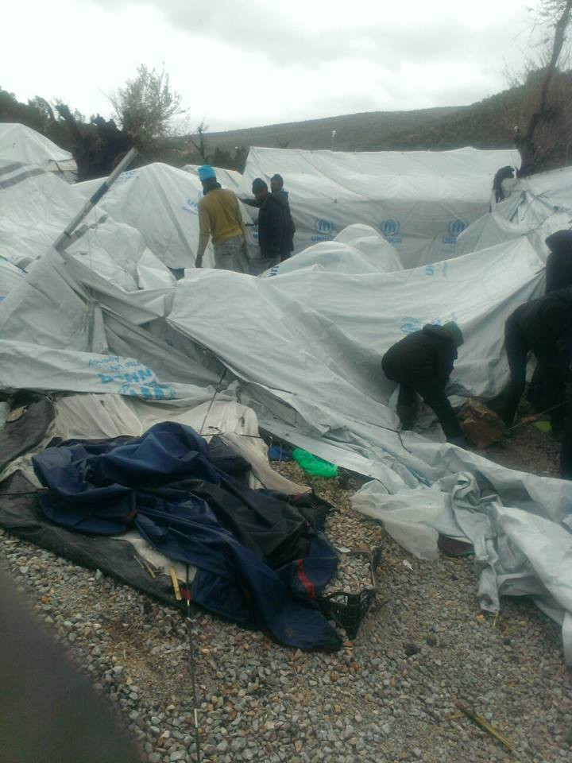
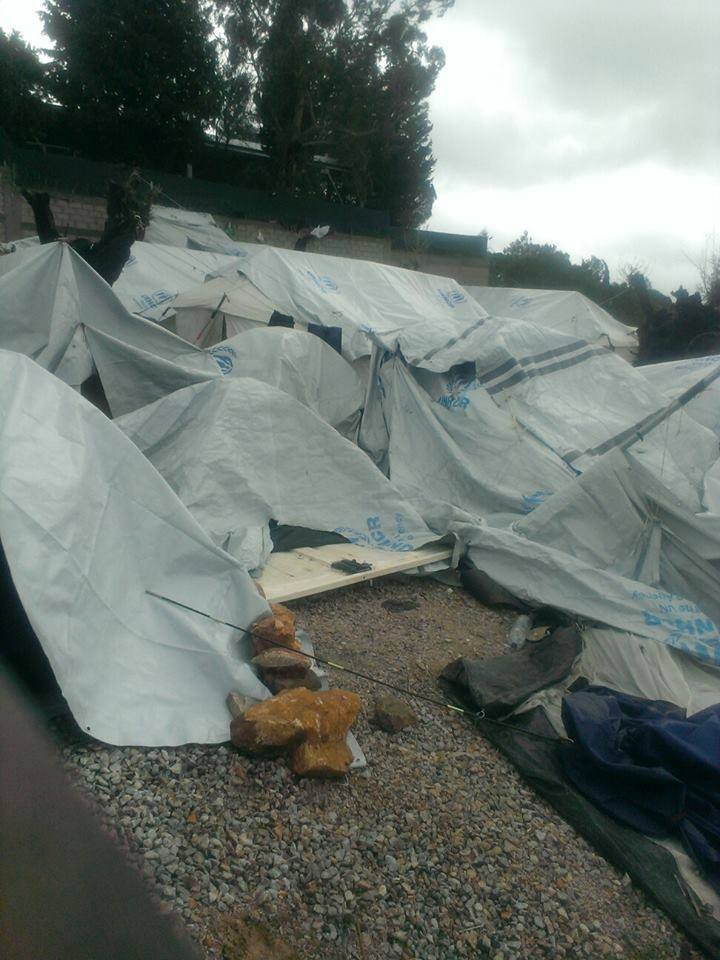
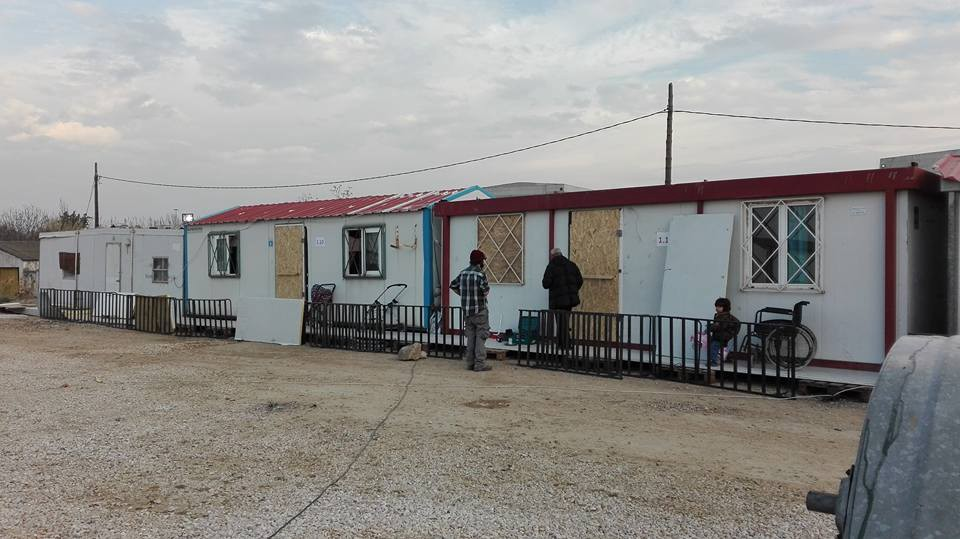
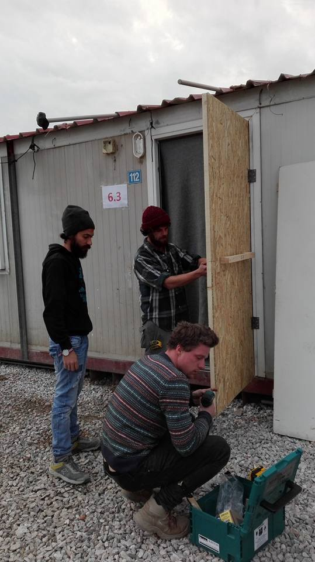
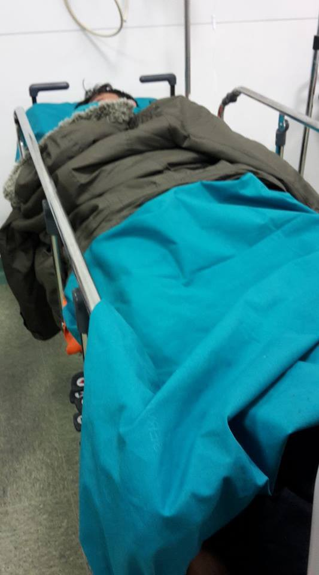

### AYS DAILY DIGEST 06\.01\.17 — Refugees endure harsh winter in Europe

_Preparations for the winter not completed in the Aegean Islands\. Refugees, including children, still sleeping in Belgrade’s abandoned buildings\._

Photo by Eric Kempson
#### Greece
#### Some refugee camps still unprepared for the winter

As Greece faces freezing weather and with temperatures expected to drop, all camps should at least be prepared for the winter, or even better, refugees brought to apartments and hotels\. According to Greek Migration Policy Minister Yiannis Mouzalas, this is already the case, as he stated yesterday that except for 40 tents left in Vayiohori, and another 100 in Athens,

> **_“there are no refugees or migrants living in the cold anymore\. We successfully completed the procedures for overwintering”_** 

This is not the case in all mainland camps and volunteers and UNHCR alike have pointed out the dire situation in island camps, where people still sleep in unheated tents\.

UNHCR spokesperson Adrian Edwards said today:

> **_“Conditions at many sites on the islands remain very poor\. The need for better protection will become all the more acute this weekend when temperatures on the islands are expected to drop\. We are worried\.”_** 

To the UNHCR the situation is concerning on Chios, Lesvos and Samos in particular, as “ _on Samos, around 700 people including young children and other vulnerable individuals remain in unheated tents in the Reception and Information Centre_ ”\.

For the MSF head in Greece, Clément Perrin, talking to the Athens\-Macedonian News Agency, the situation is “infuriating” — as of last Friday, MSF counted 329 tents without heating and access to hot water in Samos, while in Lesvos, hot water is only available in the morning, causing large queues\. Volunteers’ photos also show that people are still sleeping in unheated tents on Lesvos, on Chios and on Samos\.
#### Lesvos

Lesvos\. Photo by Eric Kempson

#### Chios

](assets/36d9f031ab63/0*AQDViEKSfHEx6mhK.)

Chios\. Photo by [Salvamento Marítimo Humanitario](https://www.facebook.com/smhumanitario/)

](assets/36d9f031ab63/0*1RcpSKdPX8UQ3AaX.)

Chios\. Photo by [Salvamento Marítimo Humanitario](https://www.facebook.com/smhumanitario/)

](assets/36d9f031ab63/0*hFCPfPvtoX2pre1r.)

Chios\. Photo by [Salvamento Marítimo Humanitario](https://www.facebook.com/smhumanitario/)
#### Samos

](assets/36d9f031ab63/0*8Vqok1D5L7lOI8qA.)

“Rain, cold, tents, wet clothes, sickness, sogging blankets, puddles, ruined belongings again, more rain” Photo by [No more borders, No more tears](https://www.facebook.com/No-more-borders-No-more-tears-1254181771265187/)

While the UNHCR criticises living conditions on the islands, it also states that

> _“On the mainland, the challenges we faced just a few weeks ago are diminishing\. Over the Christmas and New Year period UNHCR completed the winter preparation work for all the sites assigned to us by the Greek authorities and we are completing additional infrastructural upgrades elsewhere\.”_ 

#### However, in camps like Softex, people are still enduring terrible living conditions\.

A volunteer, Gerhild Salzer, describes the situation in the camp saying

> _“\-5°C, according to my phone felt like \-12°C\. A storm that made dozens of toilets just fly away\. And still 130 children under 12 living in this camp\. As much as I try to prepare myself for those kind of days, when I stand in the camp I freeze again and again in disbelief\.”_ 

#### **Meanwhile, small organisations are trying to fill the gaps\.**

Photo by Intervolve

In Softex for example, [Intervolve,](https://www.facebook.com/InterVolve-219418945063168/) with the help of [The Get Shit Done Team](https://www.facebook.com/The-Get-Shit-Done-Team-304001796641127/) , has been providing containers with wooden doors and windows as some people had to sleep with the wind blasting through their “home”\.

They also plan to provide snow suits for children and blankets tomorrow, well knowing that these are only temporary solutions, but hoping that it will at least somewhat improve their lives\.

Photo by Intervolve

Beyond stories of unheated tents, “winterisation” and other NGO talk, refugees should never have had to spend a second winter in Greece in the first place\. The problems refugees are facing are not only the fault of Greece and the UNHCR — they are also due to the EU’s failure to relocate refugees as it promised\.

Due to extremely low temperatures, **the following “shelters” in Thessaloniki will remain open during the night** in order to host homeless people:

1/Andreou Georgiou 13, Thessaloniki, 546 27
 Phone: 0030 2310528811
 Open from 19h00 to 11h00 the next day

2/ Cultural Center “Christos Tsakiris”
 Lagkada 221, Stavroupoli 564 30

3/ The health center of the municipality of Thermi
 Phone: 0030 2313 310800

Many thanks to Pandelis Papadopoulos for all the information\.
#### Bulgaria
### Two refugees died of exposure to the cold

[Sofia Globe](http://sofiaglobe.com/2017/01/06/two-migrants-found-dead-in-bulgarias-bourgas-region-as-temperatures-plummet/) writes that two refugees have died of exposure to low temperatures near the Serbian border\. This comes a few days after the death of a Somalian woman\. Snow now covers most of the country, reaching 35cm in certain places, while temperatures are below \-10 and \-5 degrees Celsius\.
#### Serbia \(Belgrade: \-9° to \-16° on Saturday\)
### Unregistered migrants unable to sleep in reception centers despite announcement by authorities

In Serbian media, official authorities announced that reception centers would be open to all refugees and migrants, registered and otherwise, given the freezing weather\. Volunteers in Kelebija took a Kurdish family previously registered on the list who had shown up to the transit zone early to the reception center in Subotica\. If any case were to be eligible for an exception \(1\. a family 2\. previously registered\), it would be this one, however the family was turned away, with the normal stipulations requiring re\-registration in Belgrade and subsequent distribution to another camp being invoked as protocol\.

This instance highlights what volunteers and activists had feared about the announcement, that it was namely lip\-service which would enable the “responsible” actors to wash their hands of responsibility for any deaths that may occur\. Serbia continues to criminalize the existence of humans\.
### MSF provides heaters in derelict Belgrade warehouse

In Belgrade itself, people continue to live in abandoned buildings and warehouses, with MSF providing some emergency, and potentially life\-saving heaters\.

■■■■■■■■■■■■■■ 
> **[MSF Sea](https://twitter.com/MSF_Sea) @ Twitter Says:** 

> > Today the @[SerbianGov](https://twitter.com/SerbianGov) will bring some of the people in #Belgrade to the camps, but not enough space for all. Many risk to sleep at -14. https://t.co/lzrYTCESe9 

> **Tweeted at [2017-01-06 12:25:55](https://twitter.com/msf_sea/status/817346456046759936).** 

■■■■■■■■■■■■■■ 

■■■■■■■■■■■■■■ 
> **[MSF Sea](https://twitter.com/MSF_Sea) @ Twitter Says:** 

> > ~1500 #people are freezing tonight in #Belgrade at -15! We are putting emergency heaters to warm the abandoned buildings where they sleep https://t.co/jpeEB4emHN 

> **Tweeted at [2017-01-06 19:49:08](https://twitter.com/msf_sea/status/817457996712341506).** 

■■■■■■■■■■■■■■ 

### Unaccompanied children sleep in Belgrade despite freezing temperatures

Unaccompanied children are also sleeping in the Belgrade warehouse, which is [described by Lucy Carrigan of the IRC](https://medium.com/uprooted/children-alone-and-at-risk-on-the-refugee-route-81effe923ec6#.3b7v38cfv) as “dirty, dark, cold, drafty, and pest\-infested”\. She explains that many children still prefer to sleep there rather than in official shelters, as they fear they could get deported\.
#### Italy
### Refugees in hospital due to exposure to the cold

Photo by Lorena Fornasir

Refugees are still sleeping in the streets of Italy\. [Rete Solidale Pordenone](https://www.facebook.com/retesolidalepn/?fref=nf) says that in their city of Pordenone 12 people were sleeping in a parking, with two of them hospitalised with high fever and pneumonia — both had received asylum\. The group criticizes the local government for its inaction, saying it could have activated an emergency plan, as the previous mayor and other cities did before\.
### Media reports on living conditions inside Cona reception centre

Following the death of Sandrine Bakayoko and the ensuing clashes inside the Cona reception centre near Venice, many newspapers report on the refugees’ living conditions, that have been made even more difficult with winter\. [Left\.it](https://www.left.it/2017/01/05/ce-voluto-un-morto-affinche-ci-si-accorgesse-dei-vivi-viaggio-dentro-al-cpa-di-cona/) says 1,400 people live in former army barracks in a village of 190 people, saying “ _the beds are squeezed one next to another, there is no water, and when it is available, it is only cold” \._ It also says that _“some people have been here since October 2014, and still have no destination but the line for a shower and a meal_ \. A Guinean refugee tells the website:

> “ _These conditions are dangerous, look at our clothes, we are not ready to face winter, we need your help and your voice\. Take our cry of help to the Italian Commission, to the European Community, we need your support\. This is an emergency situation_ ”\. 

#### EU
### EU countries make proposals to close the borders to refugees
- **In Slovenia,** [Euractiv](http://www.euractiv.com/section/global-europe/news/slovenia-toughens-law-to-prevent-another-influx-of-migrants/) says the government approved amendments that would enable police to seal the country’s borders to “illegal migrants” for a limited period if needed\. [Slovenia Times](http://www.sloveniatimes.com/govt-to-debate-tougher-immigration-law) explains the new law will also be applied “when a migrant expressed intention to seek asylum when wanting to enter illegally or has crossed illegally from another safe EU country\.” Amnesty International has urged parliament to reject the legal changes as they “would deny refugees and asylum seekers the protections to which they are entitled under international and EU law”\.
- **In Germany,** [DW](http://www.dw.com/en/merkel-mulls-flexible-target-for-asylum-seeker-numbers/a-37032371) reports that Chancellor Angela Merkel’s CDU has floated the idea of flexible annual targets for asylum seeker numbers, after the CSU’s insistence on an upper limit of 200,000 refugees per year\.
- **In Austria** , [Reuters](http://in.mobile.reuters.com/article/worldNews/idINKBN14P2BS) says defence minister Hans Peter Doskozil has drafted a plan that would overhaul the European Union’s migrant policy by establishing a ceiling for migration and only permitting applications for asylum from outside the EU\.

#### France
### French teacher cleared of all charges for helping Eritreans cross the border

[Le Monde](http://www.lemonde.fr/police-justice/article/2017/01/06/un-enseignant-chercheur-relaxe-apres-avoir-aide-des-migrants_5058581_1653578.html) reports a French researcher who had helped Eritrean refugees trying to cross the border from Italy, by taking them in his car and hosting them at home, has been cleared from all charges\. In November, he was sentenced to 6 months prison for helping illegal immigrants\. The tribunal president stated that nobody can be punished for “hosting a stranger to ensure good and dignified living conditions or to preserve his physical integrity”\.

The farmer Cédric Herrou meanwhile, was in court on Wednesday for helping refugees cross the border ad finding them shelter, with the prosecution asking the court for an eight\-month suspended sentence\.
### Kurdish artist opens first art exhibition near Avignon

Some good news out of Dunkirk, as Peshawa Mahmood, a talented Kurdish artist who has volunteered his time as an art teacher inside the camp, opens his first French art exhibition near Avignon\. If you live in the region, the exhibition is open until the 20th of January, at “ **Le Renc’Arts”** 275 Rue du Grand Montagné, 30133 Les Angles\.

](assets/36d9f031ab63/0*_7oD7d26FVhyacQJ.)

Photo by [Dunkirk Refugee Children’s Centre](https://www.facebook.com/dunkirkrefugeechildrenscentre/)
#### UK
### Refugees At Home needs help in Bournemouth

[Refugees At Home](http://www.refugeesathome.org/) , which connects people with a spare room with asylum seekers and refugees in need of accommodation, has found some success but found nobody so far in Bournemouth, despite approaching local papers, churches, mosques and everyone else\. If you have any ideas or leads, please email info@refugeesathome\.org\.
### SOAS University of London offers scholarships

[SOAS University of London](https://www.soas.ac.uk/registry/scholarships/soas-sanctuary-scholarships---201718.html) is offering scholarships for displaced student, including up to six undergraduate and one Master’s students commencing their degree in 2017/18\. must have provided a letter from UK Government confirming leave to remain status or humanitarian status in the UK\.

_Converted [Medium Post](https://areyousyrious.medium.com/greek-migration-policy-minister-yiannis-mouzalas-said-yesterday-36d9f031ab63) by [ZMediumToMarkdown](https://github.com/ZhgChgLi/ZMediumToMarkdown)._
