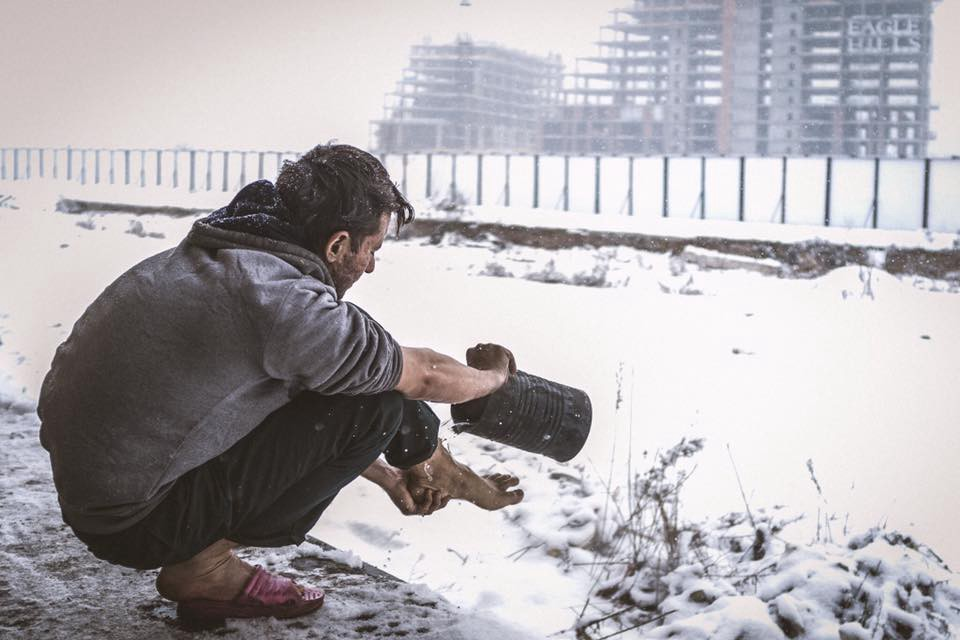
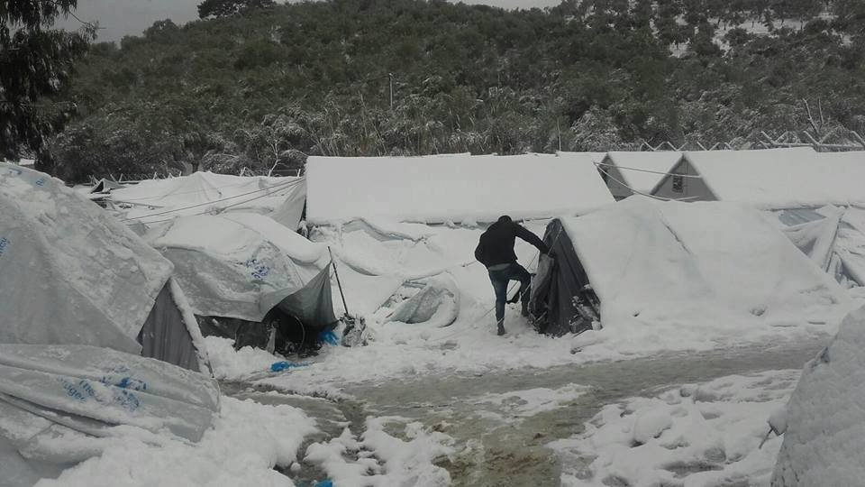
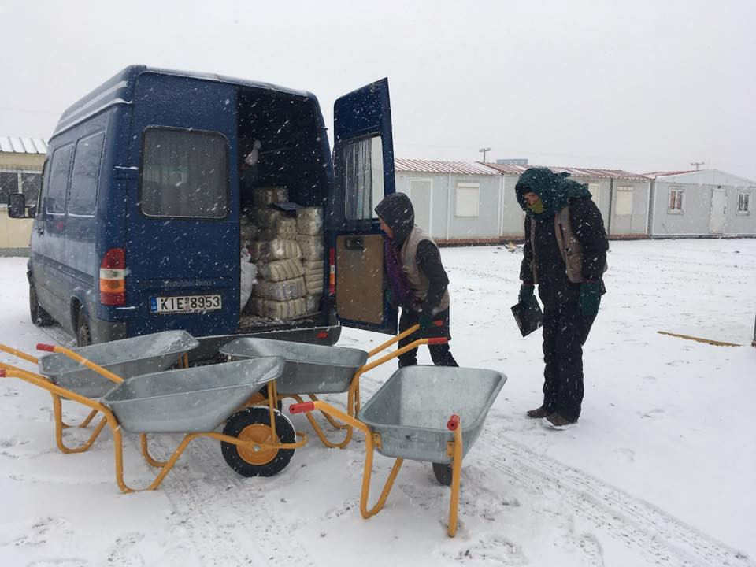
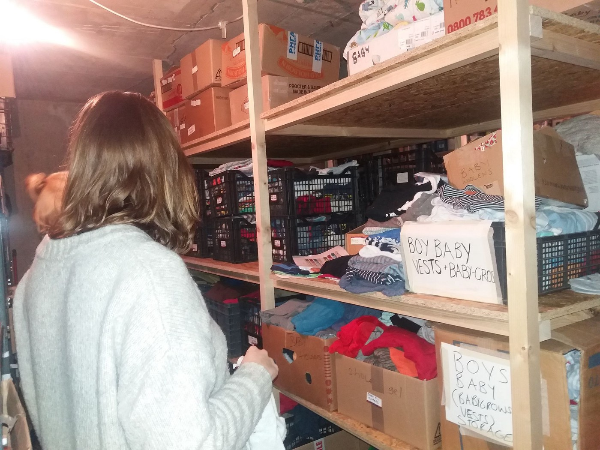
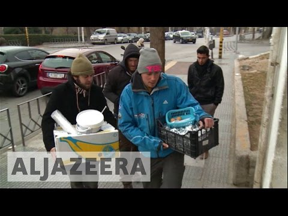
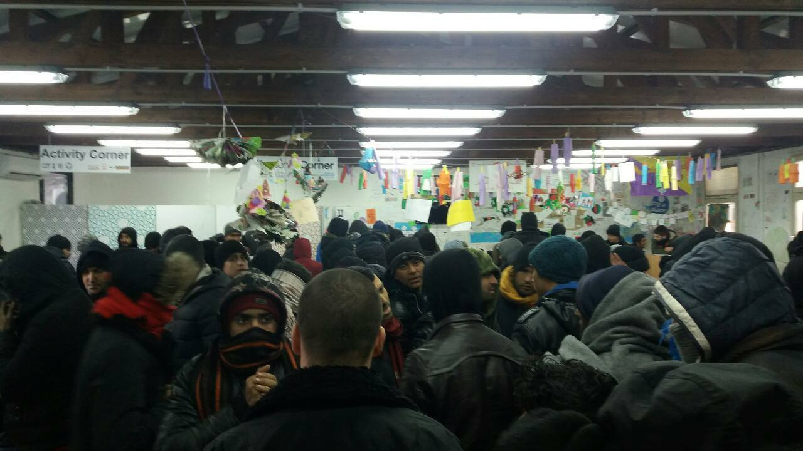

### AYS Digest 10/1: Fluttering banners of resistance

_UNHCR declares Afghanistan unsafe country\. IOM report on refugees in Turkey highlight extent of refugee crisis\. Official response to winterization failure staggeringly insufficient, outmatched by human response\. Italians getting refugees off the streets\. Serbian organizations scrambling to resolve catastrophic failure of state humanitarian apparatus\._

Photo credit: AYS
### GERMANY

_Afghanistan ruled “not safe” by UNHCR, calling into question Germany deportations_

After the disheartening news of Germany increasing deportations of Afghan asylum\-seekers, it appears that some pushback from international bodies may be imminent after a new assessment of the situation in Afghanistan has been released\.

After a reassessment, UNHCR has definitively declared that [Afghanistan is not a safe country](http://Flüchtlinge: Schleswig-Holstein plant Abschiebestopp für Afghanistan Afghanistan ist sicher genug, um Flüchtlinge dorthin abzuschieben, behauptet die Bundesregierung. Im Dezember flog eine…www.zeit.de) and therefore disagrees with the German government\. In December a plane with Afghan refugees, who had been convicted of a crime or previously denied asylum, started from Frankfurt to Kabul\.

Due to vocal criticism of this action, the government asked UNHCR to evaluate the situation in Afghanistan again\. Already in April 2016, the organization summarized, that the whole country is torn by a civil war and people there are in danger\. The new report, which Zeit Online has read and reports on, is even more insistent\. Since April 2016, the situation has “overall clearly worsened,” UNHCR reports\.

UNHCR has concluded that the whole country is engaged in intra\-state conflict\. This is the crucial point that the German government denies\. “Because of the permanently changing security situation” it would be impossible to decide which area is safe and which not\. The situation would be so “volatile”, that it for asylum decisions always the newest information would have to be used\.

Now Stefan Studt \(SPD, social\-democrats\), interior minister of the federal state Schleswig\-Holstein, has discussed suspending deportations to Afghanistan for three months\. “The report confirms my concerns,” he said\. “A repatriation of humans into safety and in dignity therefore seems not possible\. Against the background I don’t eliminate the decree of a temporarily deportation stop\.” This would not apply to people, who are being seen as a danger for Germany\.

Studt asked his fellows to explain what they think about the report\. He also wishes for a statement from interior minister Thomas de Maizière \(CDU, christ\-democrats\) \. In December he said, the deportations would be “right and necessary”\.

UNHCR sees a lot of issues with deportations to Afghanistan\. The threat for citizens is reported to be the highest in years — on Tuesday dozens of people died during two assaults in Kabul\. Furthermore, the destroyed infrastructure could not sustain any more returnees\. The already overstrained regions would be extremely burdened with this\. The government fears a “fatal humanitarian crisis”\.

Hopefully, UNHCR’s stalwart conclusions will put pressure onto the German government to abandon their current deportation program in favor of more humane and functional integration and resettlement solutions\. It is also the hope of many that this will herald a new precedent of UNHCR reassessments of previously declared “safe countries” in order to minimize the risk of traumatized individuals being forcibly deported into harm’s way\.

Photo Credit: Refugee Solidarity Movement Thessaloniki\-Eidomeni
### TURKEY

_IOM report on December migration in Turkey highlights where refugees are staying, being returned, and being kept\._

IOM released the December migration presence report\. It is imperative to remember that although the refugee crisis of 2015 and ongoing forward movement in 2016 has resulted in approximately 1\.5 million refugees, nearly three million remain in Turkey\. The report includes summaries of refugees and migrants apprehended on land and at sea, a breakdown of refugees with different residence statuses and more\.

In brief, the report notes that 2,823,987 refugees are under the Temporary Protection regime, “a vast majority of them 2,565,390…live outside the camps and are spread across the Turkish border provinces while nearly 258,597 live in 26 camps also close to the border with Syria\.”

News pertinent to the EU\-Turkey deal entails the following: namely, that since April, 2,718 Syrians were resettled under the One\-to\-One mechanism, facilitated by IOM\. Under the EU\-Turkey agreement, 800 refugees were readmitted to Turkey from Greece\.

All are encouraged to read the report in full [here](http://migration.iom.int/docs/Sitrep_Turkey_December_2016.pdf) \(opens a \.pdf\)
### GREECE

_Official response to winter crisis moving at a glacial pace\._

Speaking of numbers, according to refugee\.info, 7280 people have been relocated from Greece to date\. Although every happy relocation is worth a celebration, this is a distressing progress rate and seems to indicate that fears of years\-long waiting periods in Greece may be what lies in store for the tens of thousands of refugees that remain\.

Meanwhile, the EU commission has issued a strong criticism of the failure to prepare for winter in Greece, stating that the situation was “ [untenable](http://www.keeptalkinggreece.com/2017/01/10/eu-commission-untenable-situation-in-greeces-refugee-camps/?utm_source=feedburner&utm_medium=twitter&utm_campaign=Feed%3A+KeepTalkingGreece+%28Keep+Talking+Greece%29) \.” Although this is, indeed, true, it appears to be another case of “too little, too late”

Photo courtesy of Che Brandes\-Tuka

With temperatures remaining below \-5 Celsius across much of Greece, some action has been taken, with thousands of refugees being housed in hotels as facilitated by UNHCR and other partners — in the last weeks around 5000 have been moved to hotels; however, in many camps, the brunt of the work falls on the shoulders of independent volunteers and small organizations\.

Volunteers at InterVolve report that the employees of large NGOs at Softex largely abandoned the camp due to the fact that “no one should be working in these conditions\.” Volunteers figured that if people were expected to live in these conditions, they could be expected to work\.

Photo Credit: Chloe Kousoula

The group [Khora](https://www.facebook.com/KhoraAthens/) posted this chilling update from Moria detention center:

> The Moria Detention Centre on Lesvos is currently 3 to 4 times over original maximum capacity and as the snow continues to fall the majority of people are still living in tents inadequately covered in UNHCR tarpaulin\. Agencies within the camp cannot confirm definite numbers but estimates suggest that there are between 4,500 and 6000 people, including children, living there\. This disparity in figures alone clearly points to the horrendous level of mismanagement present within the camp\. Although half of the Moria camp is still open, conditions on both sides are appalling and life threatening\. The camp has not been adequately set up for the current freezing temperatures and it is not sanitary\. The only possible solution is to re\-house the camp’s population in humane conditions\. If this does not happen then deaths are inevitable\. Since the start of 2017 393 people have already arrived on the Greek islands via the Aegean\. With the future of the EU\-Turkey deal still uncertain it is imperative that conditions are improved for both the refugees arriving on the islands and those already trapped there\. 

Moria Photo Courtesy of Khora

AYS volunteers recently helped Khora and provide the following, heartwarming report on the ongoing activities to support refugees in Greece:

> Since January 9, in Khora Community Center in Athens a free shop with cloths and shoes is open every day from noon to 5pm\. 

> The shop is in the basement of the building, it is worm and cosy, and people can come by, or even better, arrange an appointment\. Khora people will do their best to help, in the shop where people are free to chose things they like\. So far it is very popular and people are coming from all over Athens, different squats, camps around the city, or other places\. 

> The idea is that everybody can choose and have what they like, it creates different feeling and people feel confident\. 

> However, in order to make the free shop running regularly, Khora needs more volunteers\. Also there is huge need for mans cloths, not extra large, and shoes for man and women, specially water proof and winter cloths, and man pajamas\. Backpacks for kids and prams are also needed\. If you can donate, it will make many people happy\. 

> Khora provides many other services, including dentistry\. However, currently only one dentist provides services while the need is huge, so they are looking for more dentists who could volunteer in a very nice and well equipped dentistry\. 

> Additionally, if you can donate speakers for community spaces, that would be of a great help\. 

> Khora is a co\-operative foundation offering on\-going compassionate support for refugees stuck in Athens and the surrounding area\. “The term Khora has its origins in ancient Greek philosophy\. It can be described as a ‘placeless place’, a space in which borders cease to exist, in which all people are thus free\. We believe all humans are equal and deserve equal care and rights\.” 

> If you can help in any way, or want to join Khora, you can find them on their FB page\. Write them and they will reply soon\. 

Photo Credit: AYS

In spite of these horrifying circumstances, many refugees look to care for those around them, finding solidarity in the plight of the homeless of Greece\. The video report contains more details on these ongoing acts of kindness\.

As the bureaucratic entities continue to only expedite procedures that push people out and back, it comes to the spirit of regular people reaching out to make life\-saving changes to the world\.
### ITALY

_Refugees removed from the streets by organization\._

In Italy, again, it comes to the small people to resist winter’s chill — Baobab Experience praises the efforts of [Arci nazionale](https://www.facebook.com/Arci-nazionale-158558100860495/) to house 19 refugees who otherwise would be sleeping on the freezing streets\. However, as Baobab Experience [notes](https://www.facebook.com/BaobabExperience/posts/1210262979050452) , making space is more than space:

> “And above all they found humanity, a thing that we keep taking for granted … natural, but that doesn’t seem to be granted so easily from what you read in the papers or that you see on TV\.
 

> This is why we have the right to tell the stories that we listen to… solidarity and the despair, the laughter and the sharing\. We have a duty because we have to give information, testify, so that everyone can choose a side\.” 

### SERBIA

_The fight against winter continues in Serbia, with organizations joining forces to look after people\._

Organizations in Belgrade continue to scramble to make small modifications to the makeshift sleeping spaces for the thousands on the streets\. MSF installed several heaters in the barracks, but are [quick to point out](https://twitter.com/MSF_Sea/status/818777711460106243) that this is not a viable solution to the crisis\.

Miksaliste 2\.0 Photo credit: Borderfree Association

[Borderfree is continuing its partnership with Miksaliste](https://www.facebook.com/borderfreeassociation/posts/1610858812264777) to provide support to the day center in Belgrade\. Furthermore, Miksaliste is providing space to sleep for 50 women and children\. Although this makes only a small dent in the number of people sleeping in horrific conditions throughout Serbia, perhaps this gamble can set a precedent for ordinary people and other organizations to innovate safe, warm sleeping options through the increasingly brutal winter\.

> It is with horror that we all read about this terrifying winter nightmare, but let the hopeful stories encourage us to take courage and rather than falling prey to despair, instead raise a banner of hope until people are safe\. 

_Converted [Medium Post](https://areyousyrious.medium.com/ays-digest-10-1-fluttering-banners-of-resistance-2d0147f29e5c) by [ZMediumToMarkdown](https://github.com/ZhgChgLi/ZMediumToMarkdown)._
