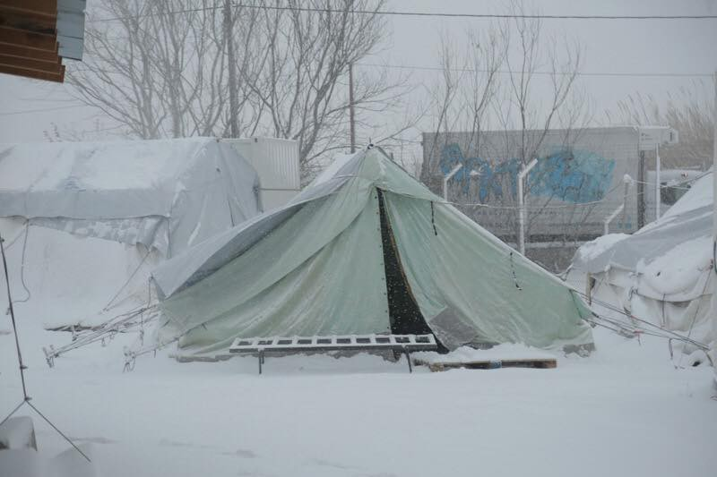
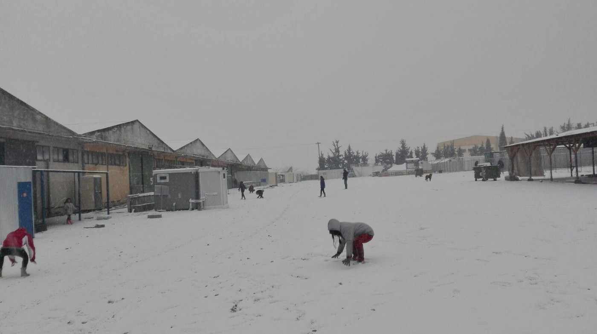
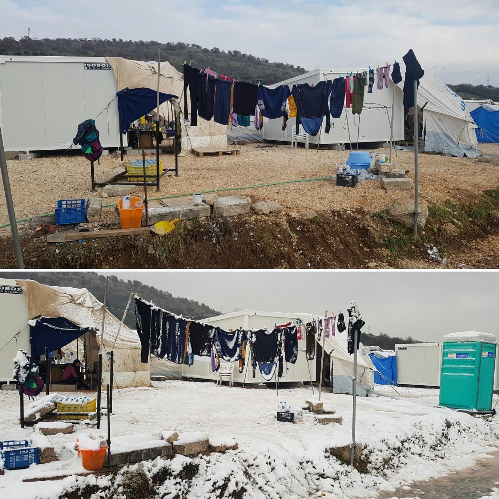
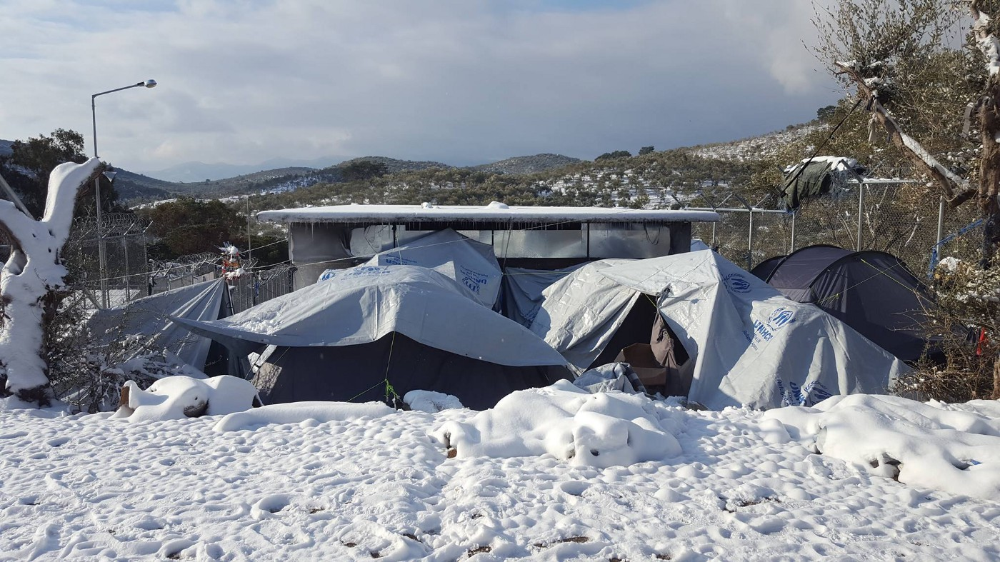

### **WAKE UP, EUROPE: Human beings in life threatening conditions**

**A joint statement from refugees and groups denouncing the treacherous living conditions of Greek camps**

**11th January 2017**

](assets/6123880d07a7/1*bCdG85LBSPjpTnMg4lhbaA.jpeg)

Photo by [InterVolve](https://www.facebook.com/InterVolve-219418945063168/?hc_ref=PAGES_TIMELINE)

**With this statement, we, the people, networks and groups standing in solidarity with the refugees side by side, from inside and outside of the camps:**
- **reject the Greek Migration Minister Yiannis Mouzalas’ most recent comments about conditions in the camps\. In light of the presented evidence, we call for Mr Mouzalas to exercise responsibility by either issuing a clarification or retraction;**
- **urge all parties to uphold, with utmost urgency, their responsibilities in providing adequate shelter for refugees on the Greek mainland and the Aegean islands, adapted to the winter conditions and respecting fundamental rights\.**
- **oppose any plans of the European Commission and European governments to resume planned Dublin returns to Greece after 15th March 2017 as survival in Greece cannot be guaranteed for the refugees in light of the inadequate living conditions\.**

On 28 December 2016, Mr Mouzalas announced that “ _there is no\-one living in tents, no\-one living without heating, with the only exception being 100 UNHCR tents in Elliniko \[an Athens camp\], that are winter tents and they do have heating\._ ”

Despite clear evidence disputing that statement posted by various groups onsite, Mr Mouzalas declared on 5 January 2017, that _“there are no refugees or migrants living in the cold anymore\. We successfully completed the procedures for overwintering,”_ he said, with the exception of 40 tents left in Vayiohori \[a camp near Thessaloniki\] and another 100 in Athens\.

These words are in stark contrast to the reality of life in the camps that we witness on a daily basis, as well as refugees’ reports from throughout Greece\. Public statements like the aforementioned cannot remain undisputed\.

Nearly €90m have been disbursed by the EU to the Greek Government and more than €14m to UNHCR to improve conditions at the camps before the winter\. Yet, for the last months, more than 30,000 and 15,000 refugees on the mainland and the islands respectively, have been sleeping under inhumane and degrading conditions\. Many camps remain without heating, electricity or hot water whilst temperatures drop below zero degrees during the night\.

In **Northern Greece** , numerous refugee camps do not have heaters and electricity cuts are frequent\. In **Nea Kavala** , even inside the ‘winterised’ containers, the water pipes are frozen and there is no warm water; the toilets won’t flush\. In **Softex** , a camp in Thessaloniki, there are still 130 children under 12 living in deplorable conditions\.
 
In Souda camp on **Chios** , more than 800 refugees still have no access to hot water; whilst some of the supposedly ‘winterised’ shelters — including those housing women and children — have no heating and are unfit to keep out the rain, snow, and humidity\. Last weekend, in light of dangerously low temperatures where the risk of hypothermia is higher for children, three families, including four children and a 9\-month old baby, had to be housed by volunteers in alternative accommodation as an emergency measure\.
 
On **Samos** , around 700 people including young children and other vulnerable individuals remain in unheated tents\. The situation for refugees on **Lesvos** grows increasingly dire\. The refugee population living on the island exceeds 6,000, of whom 50% are children living in life\-threatening conditions and are at serious risk of hypothermia\. Only 130 have been recently accommodated in hotels\.

Moria, Lesvos, Alexendreai, Vasilik, Sindos, Softex \(all photos by refugees and volunteers\)

Hence, contrary to the Minister’s claims, the conditions in the camps remain unsuitable, inadequate, undignified and dangerous\. **It is unacceptable that this is happening when almost half of all the hotels on all islands remain empty and unconscionable that hoteliers remain unmoved, stating that it is not them “to solve the problem\.”**

We therefore demand that:
- the Greek Government takes urgent measures to **immediately provide adequate shelters able to effectively protect refugees and migrants from the winter conditions, and improve facilities** \. This includes the provision of hot water, and reliable access to electricity;
- when the existing shelters and facilities cannot be improved such that they ensure dignified living conditions, the Greek Government, in cooperation with its partners, shall urgently provide **alternative options for housing** , such as hotels or rented apartments; and
- the Greek Government, in cooperation with the European Commission, **investigates the allocation of EU emergency funding** in refugee camps and implements **effective oversight\.**

We would also like to cordially invite:
- independent and principled media to question the Minister’s statements and to continue highlighting Europe’s inhumane policies towards refugees in Greece; and
- the Migration Minister himself, Mr Yiannis Mouzalas, and all relevant officials to visit the camps of Souda, on Chios, and Softex in Thessaloniki within the next days\.

Finally, we insist for a more solidary European response to this man\-made crisis\. With approximately 60 000 lives affected by the cold, the Greek authorities, responsible NGOs, and European Governments must stop the dangerous blame game they are currently involved in, and **must take responsibility for their actions and their omissions to act in response to the urgent needs in the camps** \.

The undersigned
1. Action from Switzerland, Chios

2\. Advocates Abroad, Mainland/Greek Islands

3\. Asociación Amigos de Ritsona, Ritsona Camp

4\. Archipelagos, Institute of Marine Conservations, Samos

5\. Are You Syrious

6\. Calais Action, Samos

7\. Be Aware and Share \(BAAS\), Chios

8\. Bê Sînor — Sinatex Cultural Center, Sinatex Camp

9\. Borderfree Association, Thessaloniki

10\. Catch a Smile asbl, Thessaloniki

11\. Dirty Girls of Lesbos, Lesvos

12\. Echo Refugee Library, Thessaloniki

13\. Everyday, Just a smile, Derveni\-Alexyl Camp

14\. Filoxenia International, Thessaloniki

15\. Friendly Humans, Samos

16\. High Wycombe Helping Others, Samos /Athens

17\. Holes in the Borders, Athens

18\. Human Aid Greece, Thessaloniki

19\. Humanitarian Support Agency, Lesvos

20\. InterEuropean Human Aid Association \(IHA\) — Northern Greece

21\. KHORA Co\-Op, Athens

22\. Marlow Refugee Action Group Samos

23\. Mobile Info Team, Thessaloniki

24\. Montcada Solidaria, Thessaloniki

25\. No Tears No Borders, Samos

26\. North Devon Refugee Solidarity, Samos

27\. One Human Race, Athens

28\. 100procentnødhjælp Greece

29\. People Street Kitchen, Chios

30\. Phone Credit for Refugees and Displaced People” Greece

31\. RefuAid, Greece

32\. RefuComm e\.V, Athens

33\. Refugee Biriyani & Bananas, Thessaloniki

34\. Refugee Trauma Initiative, Northern Greece

35\. Re\-Act Scotland, Samos

36\. Salvamento Maritimo Humanitario, Chios

37\. Samos volunteers, Samos

38\. Soul Food Kitchen, Thessaloniki

39\. Team Bananas, Thessaloniki

40\. The Common Good Collective Lesvos

41\. Together for Better Days

42\. United Refugee Aid, northern Greece

43\. United Rescues

44\. Weareonecollective, Greece

45\. Where Is The Life, Lagkadikia Camp

46\. Yellow Aid Truck, Northern Greece

47\. Soup and Socks e\.V\. / Habibi\.Works

48\. Zaporeak Proiektua, Chios

49\. Solidaridad con Ritsona \(Chalkida\)

Groups wishing to send pictures testimonials from the ground in greece can do to this email greecewinter@gmail\.com\.

If you want to sign the statement, please write to our inbox on FB\.

_Converted [Medium Post](https://areyousyrious.medium.com/wake-up-europe-human-beings-in-life-threatening-conditions-6123880d07a7) by [ZMediumToMarkdown](https://github.com/ZhgChgLi/ZMediumToMarkdown)._
