### AYS DAILY DIGEST 21/01/2017: When solidarity prevails

_The most important lesson for Negia Milian, learned after years of volunteering, is that we, ordinary people, have the power to change the world // Out of crisis a new movement is being born // A group of volunteers from Spain are helping Afghan refugees in Belgrade to stay warm // In Italy, a humanitarian corridor for refugees from Eritrea, South Sudan and Somalia soon to be open // People are coming back to Calais_

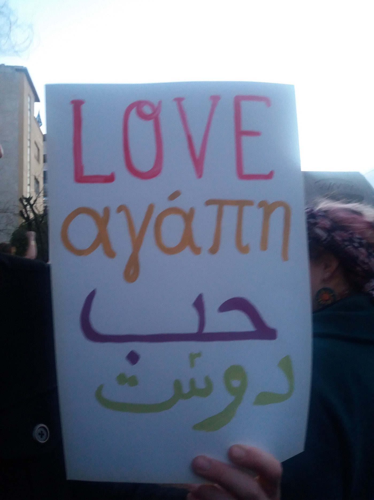

Photo from the march in Athes\. AYS\.
### Feature
#### Good people of Pamperaki warehouse

Everybody who volunteered in Athens knows about Pamperaki warehouse in Piraeus Port and two ladies — Negia Milian and Katerina Rouniou — who are running it\. From this warehouse, all the squats in Athens — 10 at the moment with about 2000 people — as well as different community centers, private accommodations and other places where refugees are living, are supplied\. But also many Greeks who are in need\.

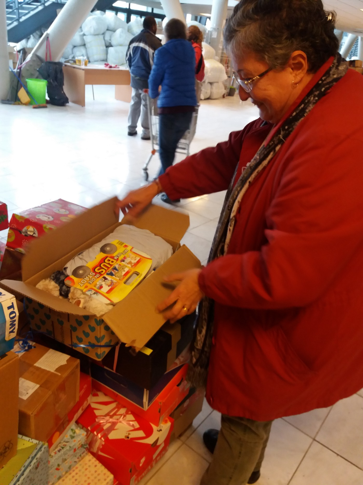

Donations are coming from all the the world and stored and later distributed \. Negia Milian and the team of volunteers run the place trying to help to as many people as it is possible\.

This enormous place is in the same building where the basketball stadium was during the 2004 Olympic Games in Athens\. It was abandoned until October 2015, when part was given to a group of volunteers to store donations from individuals and groups around the world\.

Negia has been in the Port every day since September 2015, when refugees started coming in big numbers to Greece\. And she is still there, determined to stay as long as there is a need for help\.

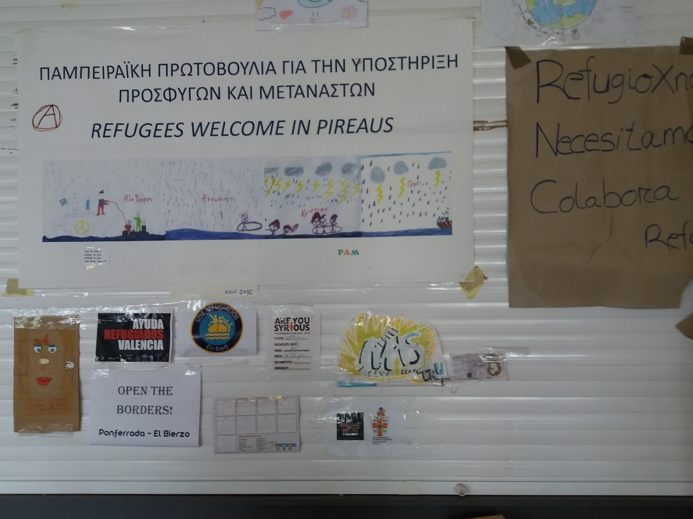

Photo by AYS\.

She is an immigrant herself who came from Cuba 30 years ago after marrying her Greek husband\. In September 2015, she was in the port to greet newcomers and help to those in need\. _“Back at that time, people in Piraeus were seeing refugees getting off the boats from the islands, and walking to Victoria and Omonia Square where the buses were picking them up and taking them further on,”_ Negia remembers\. _“Several organizations, charities, solidarity groups, decided to get together and form a group to help them, to greet them and help before they continued their journeys\. One of my friends told me about it and I came as a volunteer\. In the Port, one person told me “do whatever you can” and just left me there\. I said OK and I never left from here\.”_

As the donations were coming to Greece, the need for storage was enormous\. _“At the beginning, it was just people coming and bringing stuff,”_ she recalls those days\. _“At the beginning of December we got containers from Holland and asked for more space inside the stadium\. Soon, two containers from Are You Syrious? arrived, right before Christmas\. At the same time, more people were arriving in Greece and soon, we were getting help from everywhere\. But the borders closed and suddenly people were not just passing through the Port but many lived here and needed help, like they need it until today\.”_

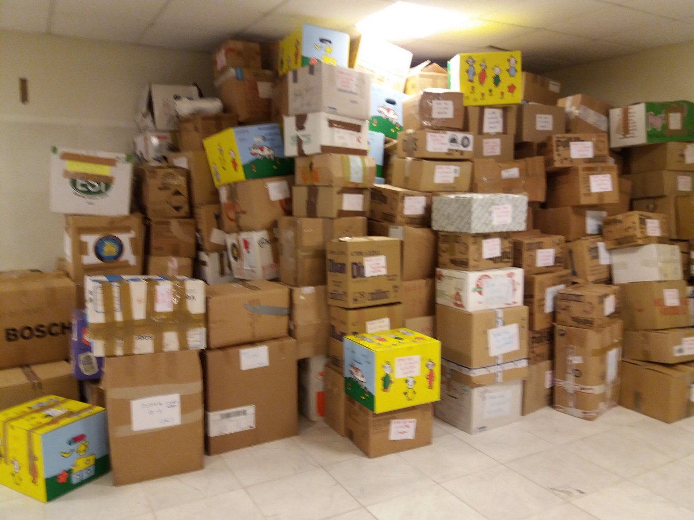

Photo AYS\.

Every day items are carefully sorted and arranged, and all that is done only by volunteers\. _“Normally we have about 10 people almost every day, including Katarina and me, but many volunteers are coming, too\. Some people are in Greece for a vacation and they decide to help\. A lot of people come from Spain\. In the meantime, we continue receiving donations from everywhere, all from people to people\.”_ However, even though donations are coming almost every day, the need is huge, and something is always missing\. Currently, there are enough clothes, but things like men’s shoes \(especially numbers from 40 to 44\) run out fast\. The greatest difficulty is with food\.

_“It is not that we do not get a lot, but it is that we give a lot\. We provide food for all the squats in Athens\. Also, we supply a lot of people who are living in apartments paid for by volunteers or some organizations\. Some organizations are supporting families and instead of families coming here, which the Ministry does not allow, they come to pick up what is needed and distribute it\. There are also individual people who take care of families\. We also provide for poor people in Greece\. So, food runs out fast, particularly things like milk, coffee, tea, sugar, oil… Pasta, rice, beans tend to be OK,”_ Negia tells us\.

Looking back on almost two years of volunteering in the Port, Negia sees some changes\. _“When we started, refugees were passing by and needed food for the road, shoes, they wanted to take a bath, maybe they needed aspirin, first aid, etc\. We usually had a brief contact before they continued their journey\. Now, people who need help are here for a long time and many, especially people in squats, depend on us for the major part of the stuff they need,”_ Negia says\. Despite billions dedicated at the international level for refugees in Greece, the most needed help has so far been provided by individuals and volunteer organizations, which is for Negia a situation hard to believe in and she admits that what volunteers are doing is “ _just putting a band\-aid on their problems\. They have a huge cut and they are bleeding, but the only thing we can do is to put on a bandage\.”_

_“I feel that a lot of the major organizations have not really sat down to see what they can do or how they can even coordinate their efforts\. People will always want to give something, to contribute, but you cannot base help only on that\. If you do that, you are not really addressing the problem\.”_

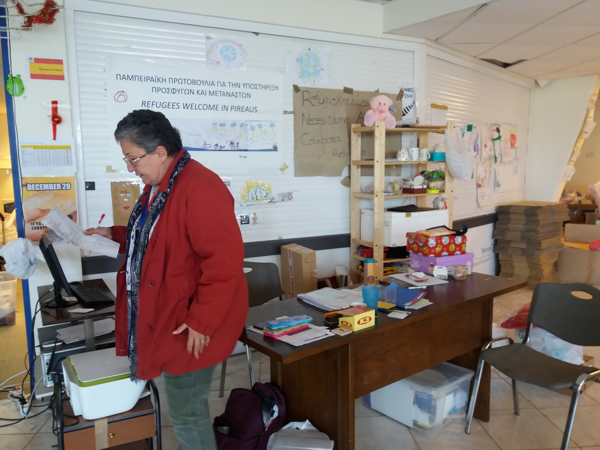

Negia’s day in Pamperatki starts around 10 and soon it gets very busy leaving no time to rest for any of the volunteers\.

In the past two years, Negia has learned some important lessons about people and the world we are living in\. _“The first thing is that people are very resilient, especially children\. Some of the refugees have gone through horrible things but they still manage to overcome them\. I would expect to see a lot more anger from them\. And, there is a lot, of course, especially among the ones that do not have anything, but not that much as one would expect\._

_The second thing I learned is that you never know who is going to be willing to help others\. People surprise you both with good and bad\. But in this case, many surprised me with good\. The third thing is that I believe now that we sometimes give our governments, all over the world, too much power over everyday things\. I think that people, if they got more involved, could get things done\. This volunteer movement that is being born now is a foundation\. More and more people are coming to this side and I feel something is changing,”_ Negia shared with us the valuable lessons she has learned\.
### Greece

Today, 47 people were registered as new arrivals in Greece\.

In Athens, big groups of people marched through the city protesting against racism, xenophobia, and closed borders\. They ended their march in front of the US Embassy where they joined the Women’s March\. Together, people from Greece, refugees and many volunteers, called again for borders to be opened\.

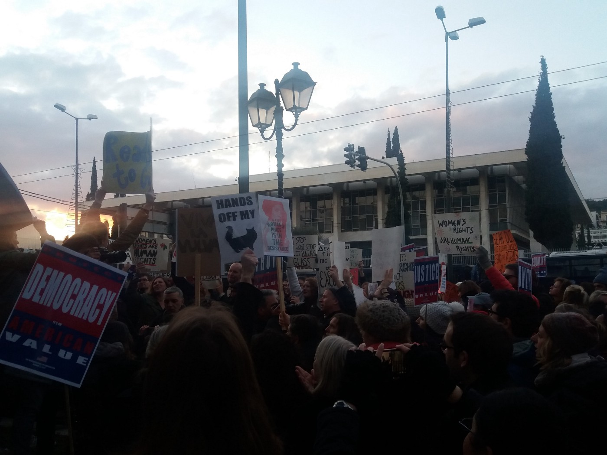

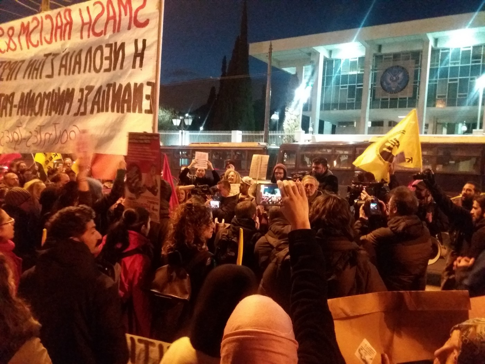

Photo AYS\.
### Serbia

As in Greece, in Serbia people come to help other people when the government remains cruel and ignorant and incapable of acting\. Spanish volunteers from the group [Holes in the Borders](https://www.facebook.com/RefugiadosenAtenas/) have been in Belgrade for several days and today they finished their big project that will help people who are living in the warehouse in Belgrade to stay warmer\.

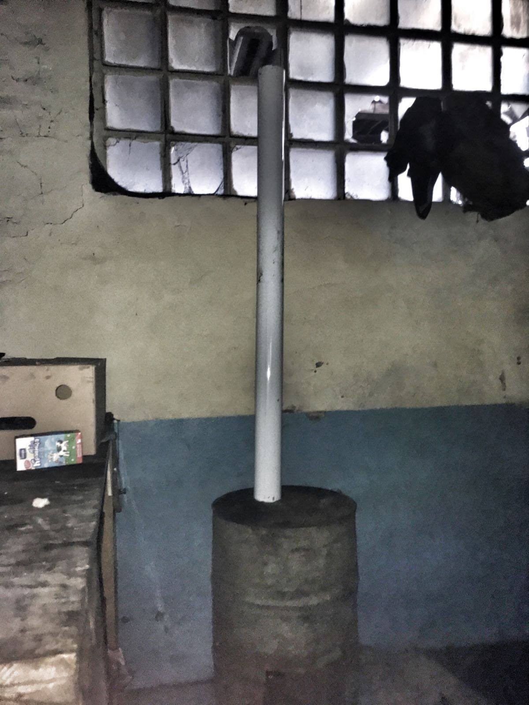

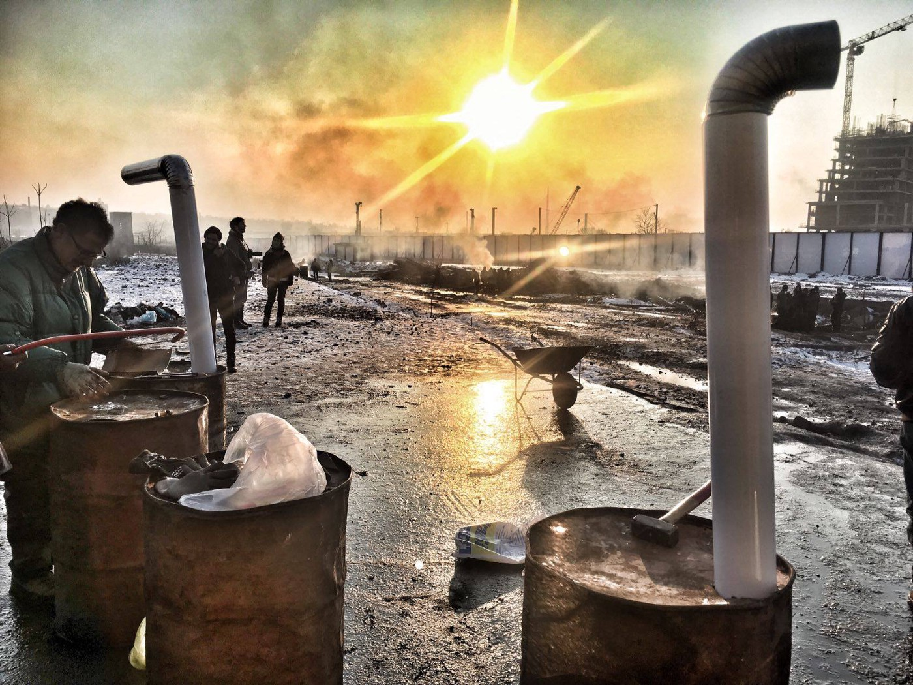

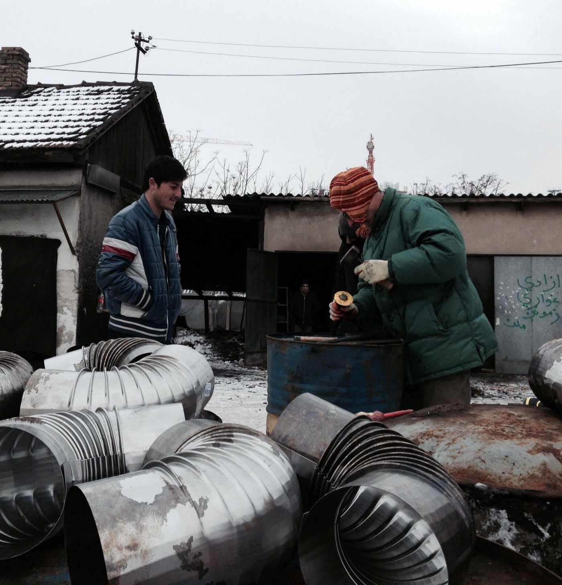

Photo by Holes in the Borders\.

In the meantime, more [reports about police violence](http://legis.mk/news/2213/refugee-winter-crisis-serbia-accused-of-illegal-mass-deportations) are coming from Serbia and the Balkans\. According to reports from Macedonia, between 400 and 600 people were illegally deported from Serbia to this country\.
### Italy

[Caritas announced that a humanitarian corridor](http://www.caritas.org/2017/01/caritas-supports-humanitarian-corridor-horn-africa-refugees/) for refugees from Eritrea, South Sudan and Somalia will soon be open\. Once in Italy, this organization will help them to find housing with the local communities\.

_“The humanitarian corridor is an opportunity for people who are living in very bad conditions in Ethiopian refugee camps\. Through this mechanism, they will arrive in Italy in a safe and legal way\. We believe this is the only way to fight against traffickers and to avoid people dying during their migrant journey,”_ Oliverio Forti, head of Caritas Italy’s migration office said\.

Our friends from [Baobab](https://www.facebook.com/BaobabExperience/) are calling everybody to the antiracist protest and public assembly to be held at 3 pm in Piazzale Spadolini in Rome\. The events were announced after a group of so\-called Neo\-Fascists from the “Roma ai Romani” group, linked apparently to Forza Nuova \(a far right political party\), occupied the former Ferr hotel, the structure that the municipality of Rome indicated as the next reception center for refugees in this city\. It took five hours for police to intervene\.

_“The situation is unacceptable, a provocation that Rome, an open city, and anti\-fascist, can’t accept\. All this, while another four minors arrived today and they’ll sleep in the street together with another 20\.”_

Also, on Wednesday 25 January, at the Pantheon, a protest against the “new” migration policies will be held\.
### France

Terrifying news from France, again\. One person, 20 years old from Ethiopia, was crushed under a truck on the A16 motorway in the direction Calais — Dunkerque, at the exit to the port ring road\. The exact circumstances of this tragedy are still unknown\. The police are calling on everybody who witnessed the incident to report what they have seen at 03 28 44 21 20\.

This is the first death of refugees on the motorway since the dismantling of the “jungle” last October\. During the 2016, 14 migrants lost their lives in the Calais region, nine of them on this motorway\.

In the meantime, volunteers are reporting that people have started coming back to Calais\.

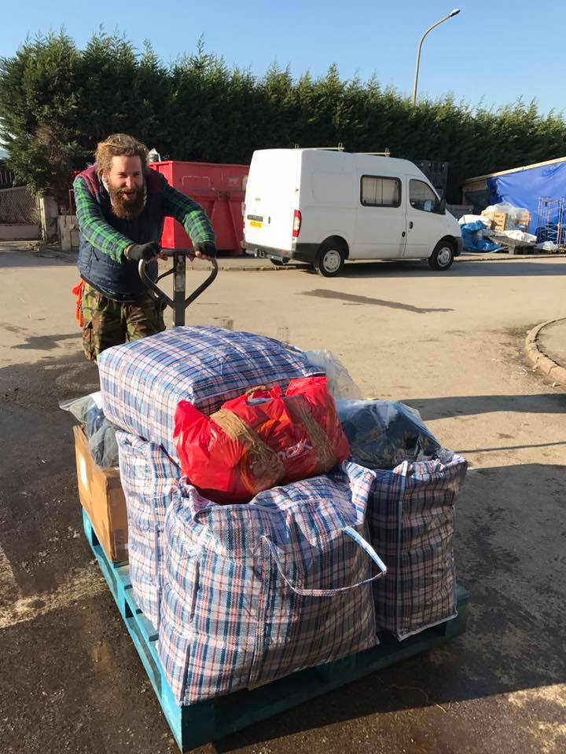

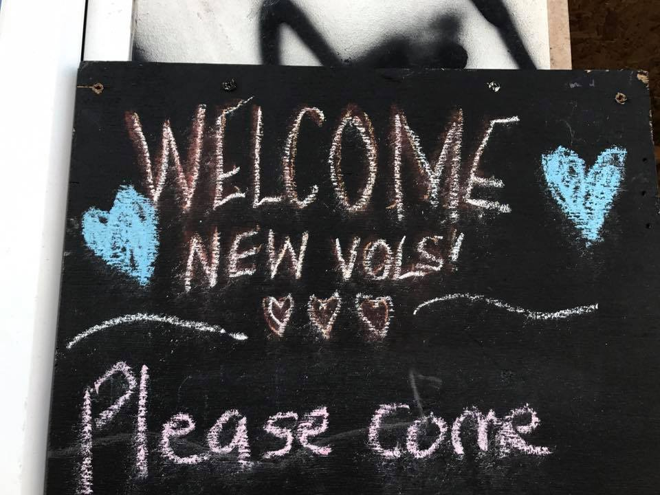

Photo by Rachel Mantell\.

_“I am in the warehouse in Calais today — it is unbelievably cold, my fingers are tingling after just a couple of hours\. People are sleeping out in this with no shelter\. Refugees are coming back to Calais in increasing numbers, trying to stay discreet and not setting up any visible tent\-camps as it makes them a target, but there are here lots of them, and lots and lots of kids,”_ wrote Rachel Mantell on his FB wall\.

Some volunteers are already there to help, but more people are needed, as well as food, warm clothes, SNUG packs, sleeping bags, and blankets\. Last night alone they found 415 people in need\.

_Converted [Medium Post](https://areyousyrious.medium.com/ays-daily-digest-21-01-2017-when-solidarity-prevails-a39e837e3834) by [ZMediumToMarkdown](https://github.com/ZhgChgLi/ZMediumToMarkdown)._
