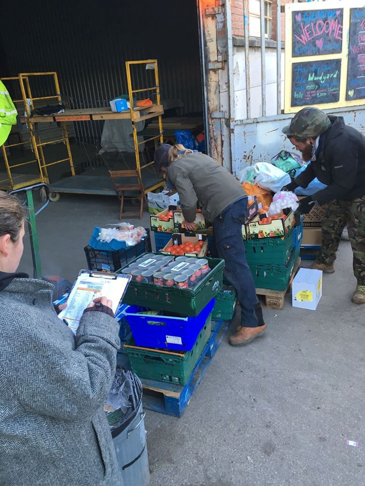
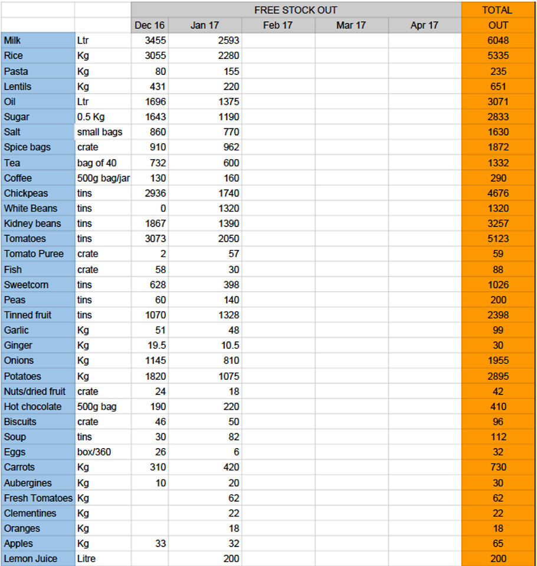
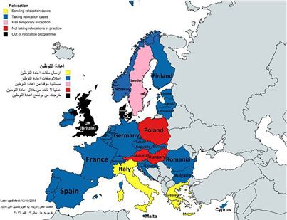
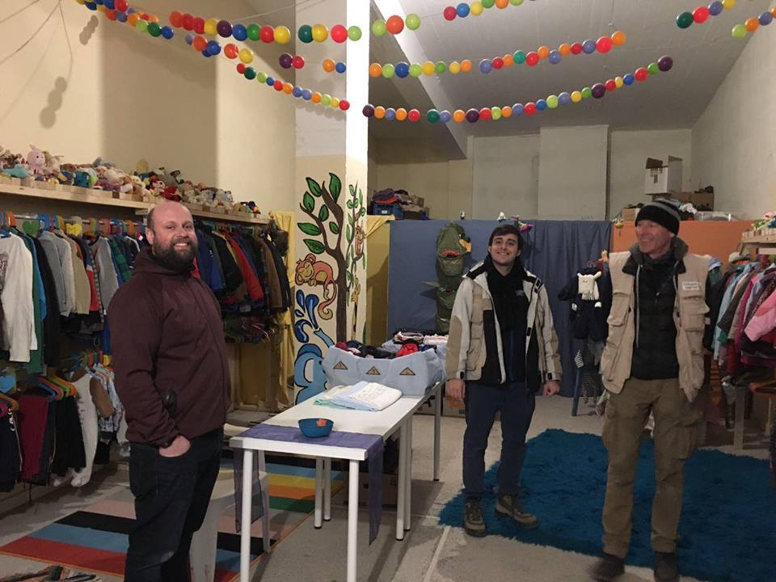
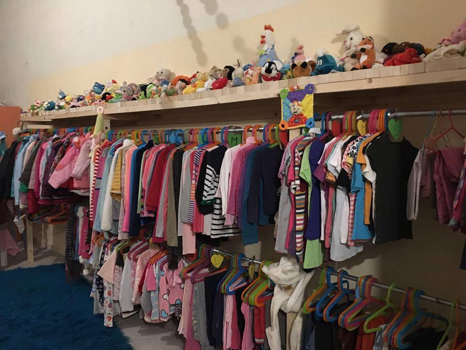
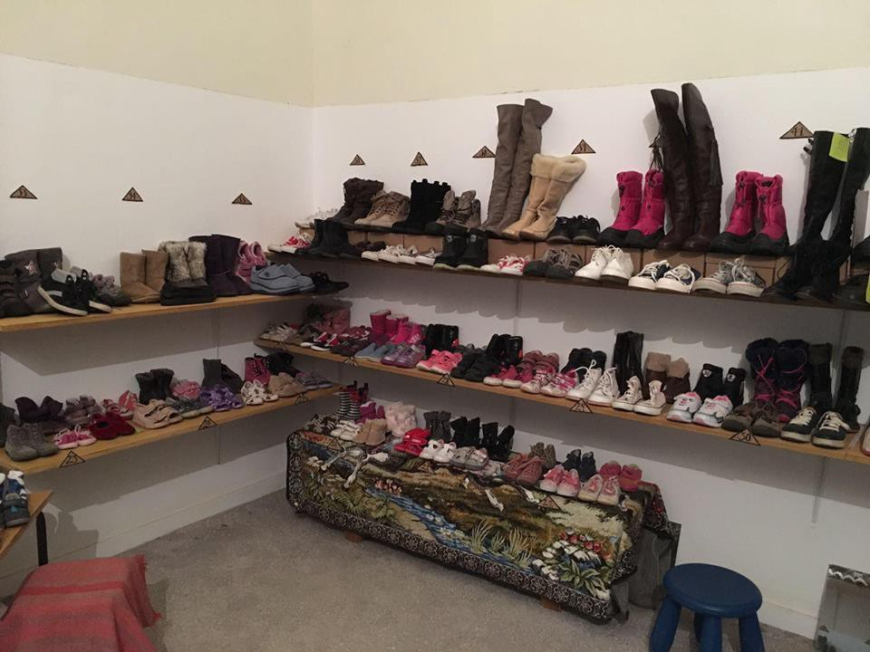

### AYS DAILY DIGEST 22/01/17: Refugees are coming back to Calais

Photo by Joao Pequeno

_Refugees, including many unaccompanied minors, are coming back to Calais//Many still sleep in the streets of Paris despite the cold//Updated relocation statistics for Greece\._
#### France

Refugees are slowly coming back to Calais, leading to the same situation of “ four or five years ago, with small camps and groups”, according to François Guennoc of L’Auberge des Migrants\. Adele, of the association Salam spoke to [France Info](http://www.francetvinfo.fr/france/hauts-de-france/migrants-a-calais/a-calais-les-associations-s-inquietent-du-retour-des-migrants-sans-rien-pour-les-mettre-a-l-abri_2027906.html?utm_source=Newsletter&utm_campaign=a83b11d78b-EMAIL_CAMPAIGN_2017_01_21&utm_medium=email&utm_term=0_a4fcaa5b66-a83b11d78b-141789033) and said that 400 refugees are currently in Calais, noting that police are everywhere to prevent the formation of a new camp, with no alternative solution offered by authorities\.

Volunteers continue to provide support, often patrolling the city at night — Care4Calais for example says it currently takes food and aid to around 70 people who are sleeping rough in the area and is aware of at least two small camps in the region, with living conditions much worse than in the initial Calais ‘jungle’\. Police are cracking down on these camps — on the 6th of January for example, police visited a small encampment and destroyed tents, sleeping bags and possessions, while a French association that had been assisting the refugees was subject to fines\.

Care4Calais also says the majority of refugees they support are children, and many have run away from the French centres after hearing the news that they are not going to be taken to the UK\. The group says it sees at least ten to twelve people, including minors, arriving in or traveling through Calais daily, adding that the state run children’s centre at St Omer is completely full\. L’Auberge des Migrants meanwhile provides help to 60 unaccompanied minors who sleep in the streets, with police and the state doing nothing to shelter them\.

The Collectif Parisien de Soutien aux Exilés says a progressive closure of the CAOs is planned starting March and many more refugees could therefore be sleeping in the streets come Spring, as the government refuses to review its undersized reception system\.

Refugees sleeping in the cold urgently need warm clothes and the warehouse in Calais especially needs jogging pants, sizes 28 and 30, which you can buy [here](https://www.leisurefayre.com/product.php/302944/warm_jersey_jog_pants/0df4558b3ffe844f239ebfc8e6b1a793) \.

Care4Calais is also looking for volunteers to help refugees in the streets, in the Dunkirk camp, in Paris and in CAOs\. You can email [clare@care4calais\.org](mailto:clare@care4calais.org) or visit [www\.care4calais\.org](http://www.care4calais.org/) for more info\.
### Refugee Community Kitchen still active in northern France

The Refugee Community Kitchen says that while it has reduced its hot food distribution from 2500–3000 meals to 300–500 meals a day, it is as busy as ever, as it now has two Free Shops in the La Linière camp in Grande\-Synthe, supplying food such as fresh bread and vegetables to the 1,200 residents of the camp and maintaining seven community kitchens\. RCK is also working with outreach groups to supply hot and cold food to the smaller camps and squats that are now reappearing due to people returning from CAOs\. The group insists that ‘it’s not over in northern France’ and has a call out for both [volunteers](http://refugeecommunitykitchen.com/volunteer/) and [donations](https://mydonate.bt.com/donation/start.html?charity=147727) \.

### Refugees still sleeping in the streets of Paris

In Paris, temperatures have been going down to \-5° on most nights and volunteers have been trying to bring people still living in the streets to the La Chapelle centre and other shelters\. The Minister of the Interior Bruno Le Roux urged people to call the number 115 in case they see refugees sleeping in the streets, promising that everyone would be taken care off\. However, this measure was often unsuccessful, with refugees unable to get through despite calling for hours and sometimes days on end\.

The hotline 115 is overwhelmed, as the state has added shelters without adding additional staff to field the calls, leading to some people sleeping in the streets despite available beds\. The association “P’tit Dej’ à Flandre” visited one shelter with 40 beds a few days ago, with only 13 refugees registered on the list provided by the hotline\. The Collectif Parisien de Soutien aux Exilés \(CPSE\) also says it knew of three gyms with many available beds\.

Utopia 56 has been picking up refugees from the streets every night and placing them in hotels in the area, giving priority to minors, women and sick refugees\. These measures however are limited, as refugees only get shelter for one night and have to leave the hotel the next morning\. Local groups continue to shelter people in Parisian homes, especially unaccompanied minors\. Many groups of independent volunteers have also been demonstrating their solidarity with refugees on the streets of Paris by giving out clothes, food, tea, blankets and sleeping bags\.

More refugees keep arriving to the city everyday — in the last two days, two children, as young as 8 or 9 according to one volunteer, tried to get into the Hidalgo centre, without success\. The guard explained that he followed the procedure of calling the police to take care of the children, but refused to open the gate, keeping the two kids outside\. Once again, Utopia 56 took care of these children\. Last night, there was a huge increase of minors arriving in the area \(between 20–30\), some of them being taken to hotels and some being admitted to the Hidalgo centre\.

Volunteers on the ground say between 100–150 refugees are sleeping rough in the streets of Paris every night, despite the measures in place and the promise to make room for everyone\. Police continues to harass and intimidate refugees, but also volunteers on the ground, undertaking searches for no reason\.

As the European Council on Refugees and Exiles notes, the French Minister of the Interior Bruno Le Roux previously firmly rejected the charges of police harassment against refugees, saying that the “national sport” of criticizing the police should stop\. However, Human Rights Watch says French authorities have not shown any intention to investigate allegations of what would be inhumane practices against already extremely vulnerable people\. The attitude of the police is also evident in a recent statement put out by police union UNSA, as it criticized associations for ‘defending clandestine migrants’ rather than French citizens, perpetuating the old but senseless argument that a country like France can only help one or the other group\.
#### Greece
### Registrations & Arrivals

One refugee wasregistered on the island of Samos and 35 on “other” islands\. One boat arrived on the south east coast of Lesvos with 22 people on board\.
### Relocation update

[The Mobile Info Team](https://www.facebook.com/mobileinfoteam/?hc_ref=SEARCH) has made a helpful map, showing which countries take relocation cases and which countries refuse to do so, including Poland, Hungary and Austria\.

In addition, statistics by the European Commission show that the Czech Republic has relocated nobody since August, while Bulgaria, Croatia and Switzerland have relocated nobody since at least the 8th of November\.

From the 12th to the 18th of January, 115 refugees have been relocated from Greece: 15 to Lithuania, 61 to Portugal, 10 to Lichtenstein, 29 to Latvia\. However, the European Commission insisted that as of December 2016, at least 2,000 people should be relocated every month from the country to ensure all persons eligible for relocation in Italy and Greece are transferred by September 2017\.
### Filippiada kids boutique opens on Monday

The kids boutique and shoe store in Filippiada is ready for dignified distribution on Monday — congratulations on what looks like a beautiful shop\.

#### Bulgaria

**68 “illegally residing foreigners” leave Bulgaria**

[Novinite](http://www.novinite.com/articles/178476/68+Illegal+Migrants+Leave+Bulgaria+in+2017) reports the Directorate Migration of the Interior Ministry has forced out 68 “illegally residing foreigners” from the territory of Bulgaria since the beginning of 2017, with 19 people expelled while the rest left the country “voluntarily”\.

For the first three weeks of the year 112 new migrants were registered, compared to 482 migrants registered in the first three weeks of 2016\.

At the same time, refugees on the territory of Bulgaria continue to attempt to leave the country in the direction of Central and Western Europe\. A total of 323 people have been detained while trying to leave Bulgaria, with 302 caught at the Bulgarian\-Serbian border\.
#### Italy
### Maniago centre for asylum seekers denounced for unhygienic living conditions

[Messagero Veneto](http://messaggeroveneto.gelocal.it/pordenone/cronaca/2017/01/21/news/dandolo-infestata-dai-topi-la-casa-dei-richiedenti-asilo-1.14748823) reports a centre for asylum seekers in Maniago was denounced multiple times since the beginning of January by volunteers of the Rete Solidale Pordenone, because rats and mice were found all around the structure\. The volunteers published pictures of a mouse climbing on a bed while a person sleeps, another one running in the cupboard, mouse feces in the flour, in the rice bags and in the bread\. On 8th of January they filed a complaint and later filed a second and a third complaint, as the mice kept infesting the place undisturbed, and no intervention was taken by the authorities\. One doctor had three cases with similar symptoms, including intestinal pain and fever, coming from both the house and the hygiene office of the health agency\.

Meanwhile, [Tgcom24](http://www.tgcom24.mediaset.it/cronaca/migranti-la-croce-rossa-italiana-non-gestiremo-i-cie-_3052553-201702a.shtml) reports the Italian Red Cross stated that it will not manage any of the new CIEs \(centres for identification and expulsion\) as human rights and dignity are not safeguarded in these centres\.

_Converted [Medium Post](https://areyousyrious.medium.com/ays-daily-digest-22-01-1-refugees-are-coming-back-to-calais-abe1b048407) by [ZMediumToMarkdown](https://github.com/ZhgChgLi/ZMediumToMarkdown)._
