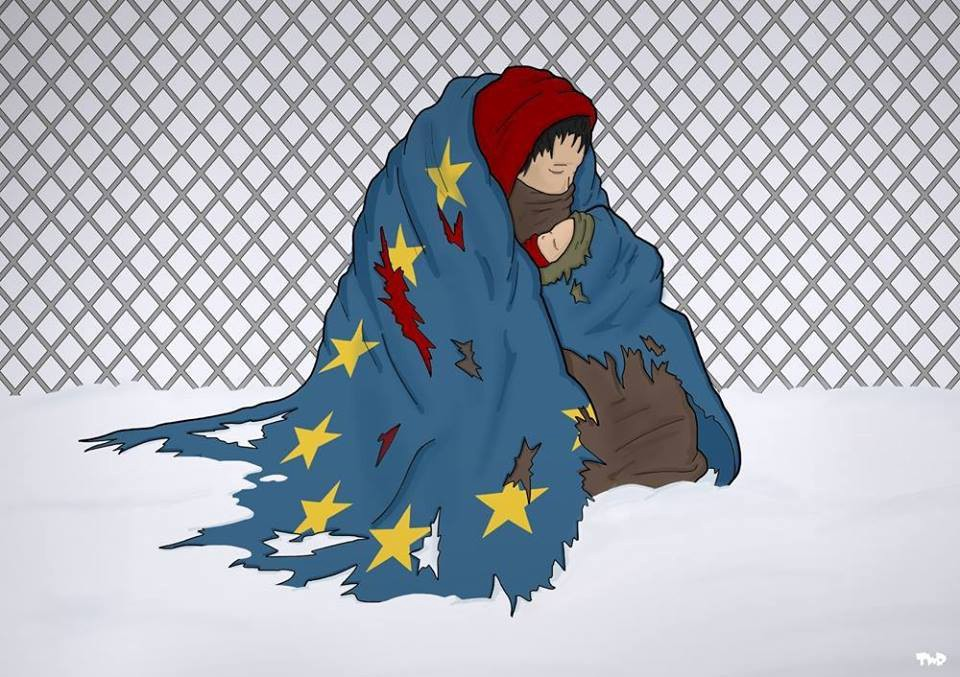
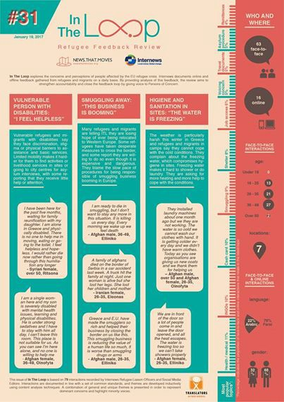
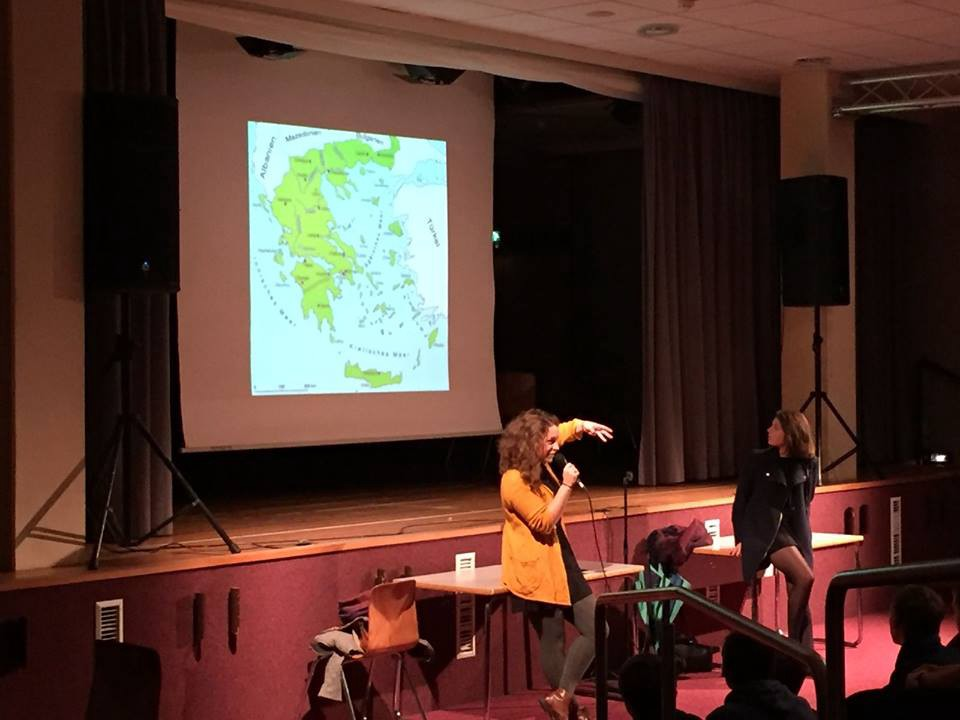
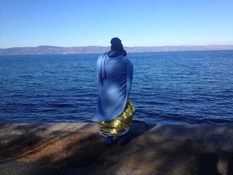
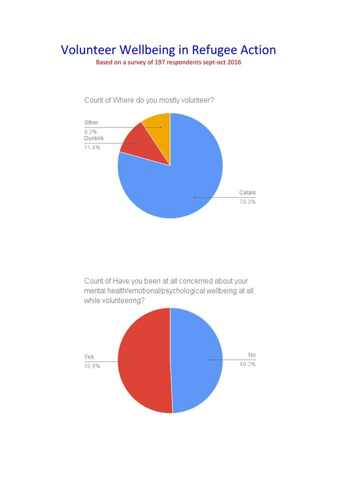
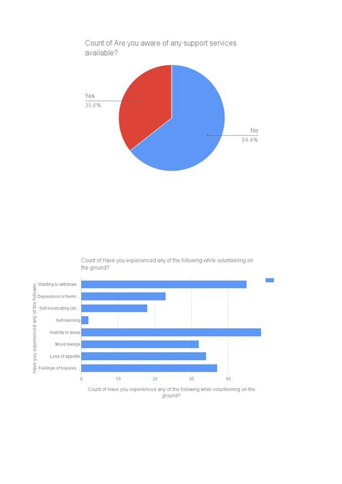
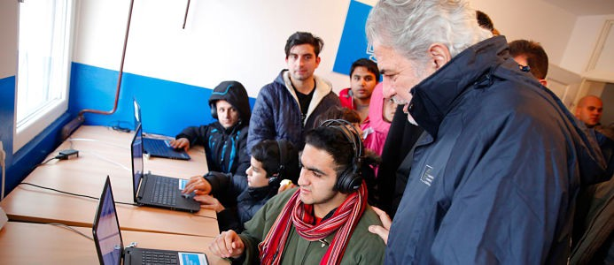
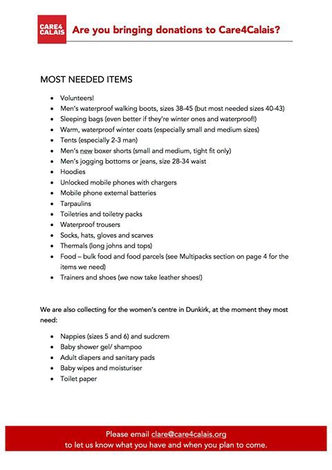

### AYS digest 23/01: Information makes the world go round

_Information on how you can share information / Testimony of a refugee in Greece / Information on current state of volunteers / IOM report on migration flow in 2016 / FAQs about family reunification procedure in Greece / Alternative housing for youth in Athens initiative / Aid and donations needed in Serbia / Summary of asylum procedures in Hungary / Calais4Calais updated list of necessary donations_

Winter in Europe by Tjeerd Royaards

Since we are dedicated to sharing information and believe that information is the key to disseminating ideas of solidarity and support for people undergoing migration, today we are going to focus on information channels and different means of fact sharing\.

New issue of In the Loop

Let’s start by talking about the new issue of _Loop_ \. Staff at Internews are happy to bring you _In The Loop_ , their weekly refugee feedback review: “Everyday our refugee liaison officers hit the streets and the web to listen to concerns and perceptions of people affected by the EU refugee crisis\. By providing analysis of this feedback, we aim to strengthen accountability and close the feedback loop by giving voice to those we are here to assist\.” For English and Greek issues of the _Loop_ follow [this link](https://newsthatmoves.org/en/in-the-loop-31-disabilities-smuggling-and-hygiene/) \. If you want to subscribe, click [here](https://internews.us12.list-manage.com/subscribe?u=e1da207a8aec914695c9503b0&id=422f698ae4) \.

Information can be disseminated in different ways and many times, a personal experience can serve to shed light on many things that are misrepresented in mainstream media\. In line with this, two women who volunteered with Together for Better Days at the Elpida camp recently gave a presentation in their local community\. \(See the Together for Better Days website [here](http://togetherforbetterdays.org/) \. \) The organization added this message: “two sisters who volunteered with us at Elpida are now sharing their experiences with people back home and raising awareness of what the situation is like in Greece\. One year on and the situation is not getting better, overall it seems to be getting worse\. This weekend we witnessed the amazing turnout of people marching in the Women’s Marches across the world for equality and human rights for all\. Giving talks and sharing experiences with your local community is one way we can keep this movement for change alive and advocate for the people stuck in camps in Greece and beyond\.”

Mira Salomori and Alina Solomon

With people usually portrayed as numbers, sharing stories is a crucial way to remind others that we are talking about human beings, people who have hopes, dreams and hardships\. One such story comes to us from the wonderful voice of a man from Nigeria: “From escaping death or imprisonment and torture in Nigeria to the indefinite imprisonment at Moria refugee concentration camp in Lesbos, Greece, this is the revealing story of a migrant that endured months of unimaginable hardship to reach Europe hoping to find, if nothing else, at least some decency and a chance for a future without fearing for his life or freedom, only to be indefinitely confined in a refugee hotspot living under inhumane conditions\.” We recommend that you listen to his voice and hear straight from him what it means to be stuck in Greece\.

To help change the discourse on migration, you can join some of these networks that are working to disseminate information:

The [Journal of Interrupted Studies](https://www.facebook.com/JISOxford/) is launching their blog _Interruptions: New Perspectives on Migration_ on the 30th of January\. _Interruptions_ will feature essays, articles, stories, poems, art, and photography and hopes to revise the discourse around migration and migrants’ rights that has become reductive and Eurocentric\. “It is our hope that, as part of a gradual redefinition of how we talk about migration, readers will feel empowered to begin their own discussions\.” If you have been affected by migration or would like to contribute positively to this new discourse, rolling submissions are accepted at [blog@jis\-oxford\.co\.uk](mailto:blog@jis-oxford.co.uk) \. Please share with anyone you think may be interested, like the page for more updates, and bookmark [http://blog\.jis\-oxford\.co\.uk/](http://l.facebook.com/l.php?u=http%3A%2F%2Fblog.jis-oxford.co.uk%2F&h=ATPqbtfLb90GjIdz9sfMgbBq4Jh8M12WnxdfUpPm443YLjKkpo8px19sJiJ9OD1dJvl7NJ6BUXQF4Mn5mNLEuDJy6t2JRqH9ESKKvyJmeYlftj6NdCc-7ruPSlU-vIEBJYv4O_HUEmD0&enc=AZMYVNFDati4ELG2o39956EsWa5P5YxRXkV6MGolSd0BuRrnCCHSbBXS0MaBDEwIuMKwRsCI-TviCQUsNYhKZ5j5ni4mLiCegelJ-YL9o72Misx-s1syZHFFkROmiIPDmCh64t7fd4_ww_FG04xhHW57Y369MFUIdohTByqzADM3G69mkzH3Y2swQ2rySCFMWWc&s=1) for January 30th\!

For data on migration, which is also crucial to understanding the magnitude of people movements, check out [the new report from IOM](http://migration.iom.int/docs/2016_Flows_to_Europe_Overview.pdf) \. There you can find relevant numbers for the past year, arrivals by nationality, age, gender and much more information, so we cannot be easily fooled by politicians or media who serve ready\-made concepts in lieu of checking the facts\.

Survey by Justine Corrie

For those of us working in the field or writing reports, an army of activists volunteering all around Europe, it is interesting to break down our feelings into numbers\. Justine Corrie did an interesting survey back in Sept\./Oct\. 2016 about volunteer welfare within refugee action: “197 people responded and the results are telling \(see images\) — more attention needs to be paid to the well being of volunteers\.” Justine adds that, “this is the foundation of any sustainable action\.” Justine is also addressing this issue by “offering a freely\-given retreat this May to any volunteers who have been or currently are working in refugee action\. As expected, places are filling up fast\! [Here’s the link with full info](https://www.facebook.com/events/1814239435454415/) \.”

Survey by Justine Corrie
#### Greece

Late yesterday evening, volunteers in Lesvos reported that one boat arrived on the north coast and was picked up by the coast Guard just off Eftalou\. 51 people were taken to Skala Sykaminia including 3 children, 15 women and 33 men\. Three of the women are pregnant and in the group were 3 medical cases\.
### **FAQs on family reunification process in Greece**

For crucial information on what, where and how, whether you are stuck in Greece and want to reunite with your family further north, or whether you are working with those eligible for reunification, please turn to this [web page](http://m.griechenland.diplo.de/Vertretung/griechenland/el/04/Visabestimmungen/Fragen__und__Antworten__zum__Familiennachzug__von__Fluechtlingen.html) where the most common questions on family reunification are answered\.
### **Alternative housing for unaccompanied minors in Athens**

Athens is full of unaccompanied minors and youth who probably have no chance of escaping the streets\. That’s why [Holes in the borders](https://www.facebook.com/RefugiadosenAtenas/) , in collaboration with [Acció Solidària Mediterrània](https://www.facebook.com/acciomediterrania/) and independent volunteers, have inaugurated an alternative housing solution for young refugees in Athens\. Take a look at the video made to commemorate the opening of the home\. It may make you tear up a bit\.

#### Italy
### **No games for refugees in Cona center**

It seems that due to a lack of information and solidarity on the part of local residents, an amateur team made up of asylum seekers based at the Cona center in Venice will not be able to use the sports center or football pitch of Pegolotte anymore due to protests by parents of local children\. Parents threatened to take their kids away from the sports center for “hygienic reasons” as a 19 year old Bengalese boy \(hosted in the CAS of Cona\) had a suspected case of meningitis\. As a result, two migrants who had sports center memberships will not be allowed to enter, much as the entire asylum seekers team, who were involved in a local championship\. We hope this situation will be resolved soon in favor of basic human empathy\.
#### Serbia
### **Commissioner for Humanitarian Aid promised more funds to be sent to Serbia**

Christos Stylianides, on the right, during a visit to a refugee center in Krnjaca, near Belgrade\. Photo\_ EU\_Oliver Bunic

The Commissioner for Humanitarian Aid and Crisis Management, Christos Stylianides, visited Belgrade, Serbia, on the 21st and 22nd of January to discuss EU humanitarian support for refugees in the country\. He stated that: “ _Vulnerable refugees, including young children, are still in need of assistance\. We can’t leave them to face the harsh winter conditions alone\. We are stepping up our humanitarian assistance in Serbia bringing it to a total of €20 million\. We will continue working closely with the Serbian authorities with the help of UN agencies and other humanitarian organisations to meet the most urgent needs, in particular to ensure that centres are adequate for the winter\. Together, as Europeans, we have a moral obligation and humanitarian duty to act and help\._ ” Hopefully these resources will go where they are needed\. This is not to say that we support EU policies of turning south\-east countries into prisons for those who have been barred from northern Europe\.
### **Refugee aid Serbia appeals for donations and help**

While authorities are talking big money, those on the ground are busy collecting basics in order to keep people fed and clothed while those in charge decide what to do\. For this reason Refugee Aid Serbia is asking for donations\. For their full message please visit [this link](https://www.gofundme.com/refugee-aid-serbia-appeal) \.
#### Hungary
### **Summary of asylum procedures in Hungary**

News that Moves reports that the Hungarian Helsinki Committee for Human Rights has published a [summary](http://www.helsinki.hu/wp-content/uploads/tajekoztato_angol.pdf) of the asylum procedures in the country\. It seems that there are four types of asylum procedures: 1\. Border procedure 2\. Inadmissible claim 3\. Fast procedure and 4\. Normal procedure\. After the procedure, people can be granted Refugee status, Subsidiary protection, Humanitarian protection or presented with a Negative decision\. For a detailed explanation of the procedures and outcomes see the [full article](https://newsthatmoves.org/en/asylum-in-hungary-what-are-the-options-2/) on the News that Moves site\.
#### France
### **Calais4Calais updated their list of necessary donations**

The organization Calais4Calais has updated their list of most\-needed items\. If you can help or donate in any way, check out [this link](http://care4calais.org/donate/) or look at the picture below\.

_Converted [Medium Post](https://areyousyrious.medium.com/ays-digest-23-01-information-makes-the-world-go-round-when-we-share-it-we-build-knowledge-975b16356f0b) by [ZMediumToMarkdown](https://github.com/ZhgChgLi/ZMediumToMarkdown)._
