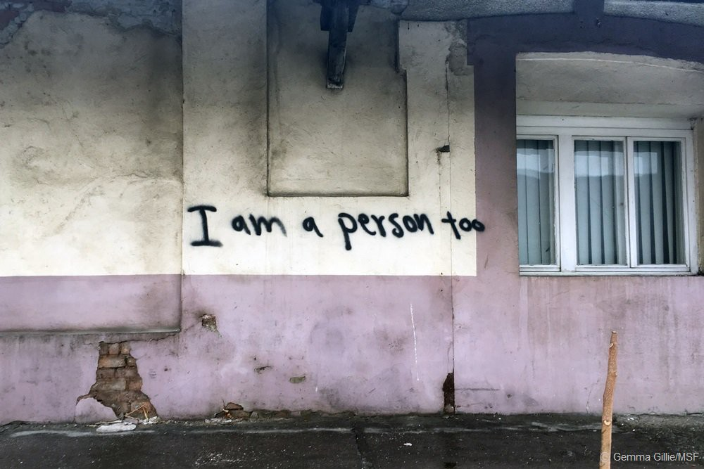
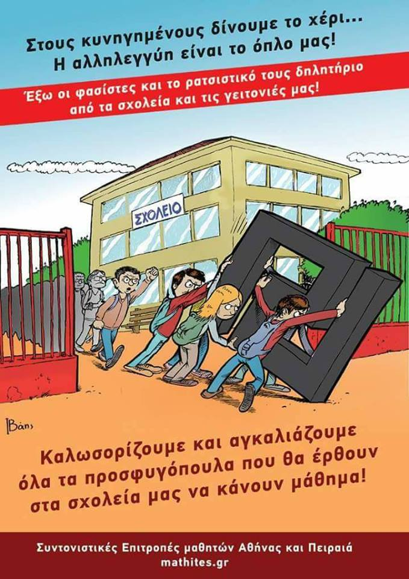

### AYS NEWS DIGEST 26\.01\.17 — Borders and deportations, what else is new?

Photo Credit: MSF
#### Feature

**Feature**

With many countries in the EU closing off their borders and preventing refugees from entering, the EU Commission has called for an extension of controls for another three months\. The Commissioner for Migration, Dimitris Avrampoulos, [has called](http://europa.eu/rapid/press-release_IP-17-124_en.htm) for a steady return to the previous open borders, but admits that present conditions do not allow countries to remove the controls just yet\. The border controls in question are Austria, Germany, Denmark, Sweden, and Norway\. The extension, if applied, would keep the current border controls in place until at least May 2017\.

The recommendations are absurd, especially coming at a time when arrivals are in rapid decline\. As the press release itself admits, the flow of refugees into Greece has ground to a halt as a result of the EU\-Turkey deal\. Mediterranean crossings declined in 2016 as well\. The extension of the current border regime would mean the prolongation of suffering for refugees who feel compelled to leave countries such as Greece and Italy due to the poor conditions and few available prospects for their future there\.

This extension of the status quo, which leaves refugees feeling compelled to travel “illegally,” stems in part from the EU’s failure to commit to its own plan to relocate refugees from Italy and Greece into other countries\. In September 2015, it was agreed that 160,000 refugees from Italy and Greece would be relocated to other countries\. As of now, the EU has fulfilled its commitment to only 11,000 of them\.

In addition to the extension of the current border regime and its failure to commit to its promises, the EU is inching increasingly closer to the realization of its plan to curtail flow on the Mediterranean route\. It has long been known that the EU has suggested that camps be built in Libya to house refugees who attempt to make the crossing\. The Libyan coast guard is currently being trained to fulfill such a plan, and there are suggestions that refugees saved be brought back to Libya\. Never mind the challenging logistics of such a plan, when even EU countries like Greece and Italy cannot secure the necessary funding to care for the people currently in place — it is also important to remember that much of Libya is currently embroiled in a state of civil war\!

The current crisis will surely go down in history as a great fiasco and will shame for generations to come\. Current EU policy seems to be engaged in brainstorming what will surely turn into the humanitarian disasters of the near future\.
#### Greece

Open schools for refugee children\!
### Timeline of Events on the Greek Islands to be compiled

Advocates Abroad will post an updated “Timeline of Events on the Greek Islands” \(Events meaning attacks, fires, deaths, and suicide attempts\), this weekend\. Our islands of refuge and solidarity are turning into islands of chaos and death\. Documentation is the only way to honor those refugees whom we couldn’t, in the end, save from the water, EU policies, or unsafe conditions\.

The timeline dates back to late 2015\. Every inclusion of an event is cited with at least one reputable source \(BBC, Reuters, The Guardian\) \. Suicide attempts are tougher to verify, as well\-known media outlets don’t tend to cover them\.

If you are interested in helping, feel free to email any such events, with their dates, a one\-sentence description, and if possible, a link to a news source: director@advocatesabroad\.org
### EU\-UNICEF joint action aims to support 6,000 children

A project worth 8\.5 million Euros is being coordinated by the EU and UNICEF, with the projected aim of supporting over 6,000 refugee children in Greece\. There are estimated to be 21,000 refugee children currently in the country\. The project will focus heavily on the realm of education, as most of the refugee children have spent the entirety of their time in Greece \(and likely several more years prior to that\) without access to formal education\.
### A boat arrived on the northern coast of Lesvos, with 47 people aboard\.
### News That Moves releases handy guide for family reunification

The full guide may be found [here](https://newsthatmoves.org/en/rumour-family-reunification-2/) \. The process should be begun during the pre\-registration process, at which point officials should be made aware that the applicant has relatives in another European country and would like to join them\. Documentation must be provided to prove your connection\. Your relatives must also register on their side to be reunited with you\.
### Greek press release reveals the deportation of 14 to Turkey

[The press release](http://mindigital.gr/index.php/%CF%80%CF%81%CE%BF%CF%83%CF%86%CF%85%CE%B3%CE%B9%CE%BA%CF%8C-%CE%B6%CE%AE%CF%84%CE%B7%CE%BC%CE%B1-refugee-crisis/893-14) reveals that 14 people, nine men, one woman, and three unaccompanied minors, were deported today\. Seven are from Pakistan, two from Iran, three from Algeria, one from Morocco, and one from Iraq\. Eleven individuals have dropped their application for international protection, while one has withdrawn his expressed will to apply for political asylum, and another had not expressed his interest in filling such a claim\.
### Open Cultural Center has rented space in Polykastro

The space will in the near future become a cultural center for refugees, a place of activities and safety\.

#### Slovenia
### Slovenian Parliament votes to renege on their responsibilities toward refugees

Amnesty International [has brought attention](https://www.amnesty.org/en/latest/news/2017/01/slovenia-proposals-to-strip-refugees-and-asylum-seekers-of-their-rights-must-be-rejected/) to the so\-called “Aliens Act” currently making its way through the Slovenian government\. The provisions of this act would allow the government to adopt emergency measures which, under the guise of national security, would deny entry and automatically expel all refugees who enter Slovenia without documentation\. The bill mirrors the behavior of some of Slovenia’s neighbors, namely Austria and Hungary, both of which are rather infamous for their flagrant disregard for the rights of refugees\. It goes without saying that the bill is a contradiction of international and EU law as it pertains to refugees\.
#### Italy
### Website for finding free Italian courses is up

[The website](http://www.scuolemigranti.org/) lists courses for both adults and children found in the Rome and Lazio regions\.
#### France
### Dunkirk Refugee Children’s Center continues to be in need of international volunteers\!

[ Today is")](https://www.facebook.com/dunkirkrefugeechildrenscentre/photos/a.1213271225374550.1073741830.1210484468986559/1470551469646523/?type=3)

### BAAM seeks refugee artists

[ Le... | Facebook")](https://www.facebook.com/baam.asso/posts/604871073038095)

### Refugee Community Kitchen publishes list of needed foods

The entire list may be found [here](https://docs.google.com/document/d/1Byxq9mQj3bPvq5WRxRZHfApBqTGGMVmjxq34Maspqa4/edit) \. In particular, the products that they are most in need of are oats, dates, tomatoes, aubergines, peppers, olive oil, instant coffee, and green tea\.
#### UK
### Doctors of the World releases staggering condemnation of using refugees’ NHS data to crack down on immigration

■■■■■■■■■■■■■■ 
> **[Doctors of the World](https://twitter.com/DOTW_UK) @ Twitter Says:** 

> > Here's our response to today's shocking reports that #NHS patients' data is shared with @[ukhomeoffice](https://twitter.com/ukhomeoffice) as part of an immigration crackdown: https://t.co/E9bobzYyZV 

> **Tweeted at [2017-01-25 11:58:53](https://twitter.com/dotw_uk/status/824225024584351744).** 

■■■■■■■■■■■■■■ 

### Refugee mother and baby need lodging in Birmingham\!

Refugees at Home works diligently to find housing for many refugees across England\. You can learn more about them on their website, found below\.

#### US
### Donald Trump to publish list of crimes committed by refugees

After less than a week in office, Donald Trump has already proven his commitment to xenophobia\. He has signed an executive order which will publish a list of crimes committed by refugees and migrants every week\. The order is meant to be an attack on sanctuary cities, which have openly stated their refusal to comply with authorities in deporting undocumented immigrants\. Another executive order has decreed that sanctuary cities will be starved of federal grants unless they comply\.

The pace set by the Trump administration should remind all witnesses that this is only the beginning of the horrors to come\.

_Converted [Medium Post](https://areyousyrious.medium.com/ays-news-digest-26-01-17-borders-and-deportations-what-else-is-new-f1478ac847c3) by [ZMediumToMarkdown](https://github.com/ZhgChgLi/ZMediumToMarkdown)._
