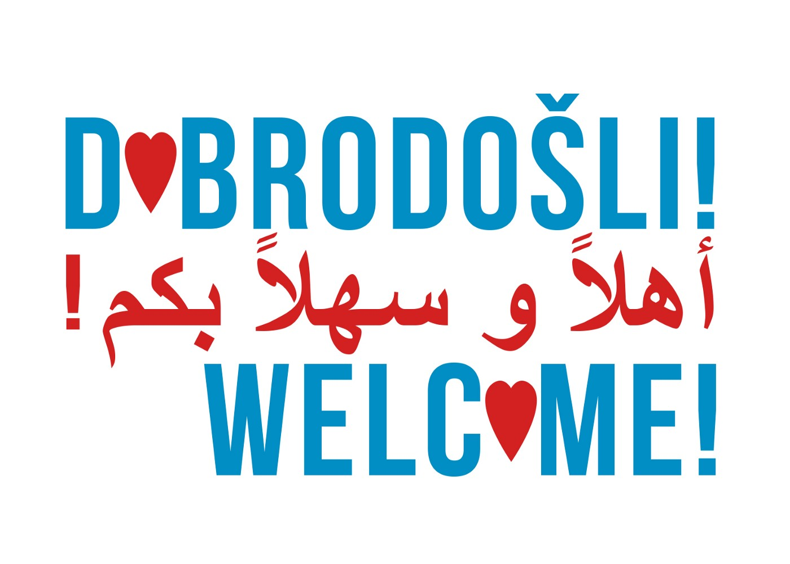
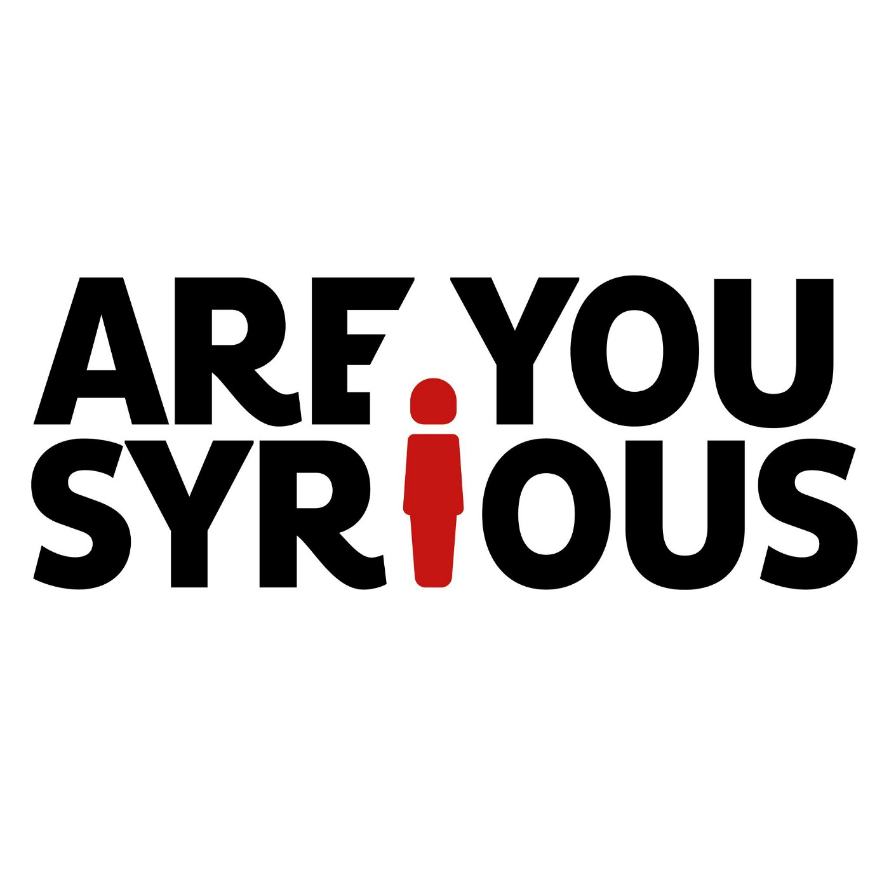

### **Report on illegal and forced push backs of refugees from the Republic of Croatia**
#### Zagreb, January 24, 2017

Published reports of intergovernmental organizations such as UNHCR \(reports about Serbia, e\.g\. from [November](https://www.google.hr/url?sa=t&rct=j&q=&esrc=s&source=web&cd=7&ved=0ahUKEwjO9diU2dbRAhUlOpoKHR9dBNIQFghFMAY&url=https%3A%2F%2Fdata.unhcr.org%2Fmediterranean%2Fdownload.php%3Fid%3D2175&usg=AFQjCNECfTwGdXQ01PE2_BZs3WvaFcigYg&sig2=hp076C9b38i5dGyWOu7JFg) and [December](https://www.google.hr/url?sa=t&rct=j&q=&esrc=s&source=web&cd=4&cad=rja&uact=8&ved=0ahUKEwjlo_WDsNXRAhVEzRQKHecUB6EQFggvMAM&url=https%3A%2F%2Fdata.unhcr.org%2Fmediterranean%2Fdownload.php%3Fid%3D2242&usg=AFQjCNG5eXgu8A41HtfRkIBh6un6-CG28Q&sig2=_9wWwjlOrJGMczNZIgVFgA&bvm=bv.144224172,d.bGs) 2016, a press release from [January](http://www.unhcr.rs/dokumenti/saopstenja-za-medije/izbeglice-i-migranti-suoceni-sa-visokim-rizicima-po-zimi-u-evropi.html) 2017\), as well as recent publications and statements by representatives of organizations that work directly with refugees \(such as [JRS](http://hr.n1info.com/a171650/Vijesti/Tvrtko-Barun-Znamo-za-slucajeve-kada-je-Hrvatska-ilegalno-deportirala-trazitelje-azila.html) — Jesuit Refugee Service, [Are You Syrious?](https://www.facebook.com/hrvatskauzivo/videos/1874913726078656/) , [the Welcome\! Initiative](http://welcome.cms.hr/index.php/hr/2017/01/22/sve-vise-izvjestaja-o-grubom-krsenju-prava-izbjeglica-u-hrvatskoj/) \), and articles and statements in [local](http://www.portalnovosti.com/ovo-je-pasji-zivot) and [foreign](http://www.dw.com/en/refugees-in-serbia-stranded-in-a-warehouse/a-37167779) media, refer to individual or collective illegal push backs of refugees who were found on Croatian territory and/or expressed their intention to seek international protection in the Republic of Croatia\.

The organization Human Rights Watch published a [report](https://www.hrw.org/news/2017/01/20/croatia-asylum-seekers-forced-back-serbia) in January 2017 that lists examples of violence inflicted during such push backs, with testimonies of “shocking and abusive treatment of refugees in Croatia”\.

Activists of Are You Syrious? and the Welcome\! Initiative visited Serbia \(Belgrade, Šid, and other locations\) several times in the past month\. They conducted interviews with approximately thirty refugees who are currently located in refugee camps or in abandoned warehouses in Belgrade\. This helped them to gain **broader and deeper insight into numerous ways in which illegal and forced push backs are conducted** , thus evidencing non\-compliance with national and international legal obligations of Croatia, as well behaviour contrary to universal human values such as the inviolability and protection of human life and dignity\. **Note that this is just a small sample from the experience of our activists and our concern is that the number of illegal and violent push backs is much higher\.**

According to our findings, the police have pushed back families and individuals of all ages, mainly from Afghanistan, but also from Iraq, Pakistan, Syria and other countries, from the Croatian territory\. Many of these people have on several occasions \(in different locations in Croatia\) explicitly sought international protection or asylum, sometimes even in a self\-abasing way \(by begging and kissing the hands and feet of police officers\) \.

In order to preempt replies that these are regular readmissions, we emphasize that these are not official returns of refugees from Croatia; they are **furtive illegal push backs from Croatia to Serbia carried out by Croatian police** , with the use of violence and humiliation\.

The people interviewed after the dangerous crossing of the Croatia\-Serbia border \(whereby they expose themselves to hypothermia, choking, abuse, human trafficking\) experienced systematic verbal and physical abuse instead of exercising their right of access to international protection in one of the EU Member States\. **The violence occurs on Croatian territory along the border, as well as deep within the country\.**

The individuals we spoke to told us that they did not experience such violence even in their countries of origin \(countries they often had to leave precisely because of violence\) \.

According to refugee testimonies, after entering Croatian territory, they come into contact with the Croatian police in different locations\. Some of them came to police stations and the Zagreb Reception Centre for Asylum Seekers \(former Hotel Porin\) by themselves with the aim of seeking international protection\.

The group with which we spoke described their arrival to the Zagreb Reception Centre, staying there overnight and leaving in the morning to the police station in order to apply for asylum/international protection\.

Instead of initiating procedures for seeking asylum, the police expelled them from the country\. One of the refugees interviewed carried with him a paper on which it was written “Hotel Porin, Novi Zagreb” and he came to Croatia with the intention of seeking asylum, but was nonetheless expelled from the country\. Another young man we contacted showed us a paper with the address of the 6th Police Station which he got at Zagreb Reception Centre, along with the instruction to seek asylum there\. However, when he approached the Croatian police for help, instead of providing him with international protection and the opportunity to receive the medical attention he requested, the police officers drove him to the border with Serbia and forced him to walk back out the country\. Activists from Are You Syrious? were also shown medical documentation of a young man who was referred to emergency surgery due to severe head injuries sustained during push backs conducted by the Croatian police\.

An especially worrisome case involves a family who were denied the opportunity to seek asylum by police officials at Harmica border\-crossing\. After that, they were taken to the eastern border, accompanied by verbal and physical violence, and were then forced to walk towards Serbian territory in the freezing cold\.

As a result of several hours of walking, the underage son of the family suffered frostbites that required medical intervention\. The refugees met by activists from the Welcome\! Initiative and Are You Syrious? claim that Croatian officers also pushed back minors \(there are currently at least 100 minors on the streets of Belgrade\) \.

The majority of people we have spoken to **have been pushed back from Croatia several times in the last few months** , and their testimonies lead to the conclusion that there is a **pattern of denied access to the asylum system** with the application of **various forms of violence** \.

The police stations in which our interviewees sought asylum are located in Zagreb, Zaprešić, Đakovo and Vinkovci\. Several other stations were mentioned in the interviews, but we were unable to determine their locations\. The refugees also mentioned:

\- **Several hours, in some cases even several days, of detention in police stations** \(e\.g\. being locked in rooms or being detained\) without an interpreter;

\- **Overstepping authority** \(e\.g\. one interviewee claimed that a police officer told him “No asylum, go to Serbia”\)

\- **Threats** \(e\.g\. three months of prison of they enter Croatia again\)

\- **Mocking** \(e\.g\. translators are available 24/7 at the border with Serbia\)

\- **Forced signing of documents** in Croatian or in another language foreign to the signer \(English, Persian, Romanian, etc\. \) \. Generally, these signed documents are not given to the them, which prevents us from documenting their cases and submitting complaints

\- **Expulsions** despite them explicitly seeking asylum in Croatia

The aforementioned family, as well as other people we spoke with, believe that they could identify the police officials that refused to initiate asylum procedures\.

According to refugee testimonies, the treatment by police officers and the degree of violence they were exposed to during the push backs from Croatia varies depending on the location\. A common thread that runs through all of the testimonies is that refugees are systematically driven to areas bordering with Serbia without further explanations and regardless of whether the refugees sought asylum or not\. Sometimes, police officers said they were transporting them to places where they could initiate the asylum procedure or where they will be accommodated during the period needed to assess their asylum claims\. This was not what happened in the cases of those interviewed\. Instead, they were forced by the police to return to Serbia by foot\. They are usually transported by police vehicles, sometimes stopping along the way, to isolate and remote places along the border with Serbia\. More precisely, according to some statements, to the railway line or the old railway facility located in the border area between Tovarnik and Šid\.

Depending on the number of refugees, groups of police officers varying in number push people back towards the Serbian territory, after additional intimidation and force\. Some of refugees stated that they walked for two hours and 40 minutes from the drop\-off point in Croatia to the Šid railway station\. The length of the walk is somewhat related to the fact that they were dropped\-off at night in extremely low temperatures \(dropping to \-10°C\) and that some members of the group were sick and suffered frostbites\.

> _A\. from Afghanistan told us his group of 24 people, mainly Afghan \(mostly young people and minors\), entered Croatia approximately two weeks ago \(around 6 January 2017\) \. The police found them near Zagreb\. Our interviewee was beaten with a baton\. The police told his friend “Take off your shoes, take off your clothes”\. After that, they were forced to stand barefoot in the snow\. After calling for backup, the police officers were joined by three or four police cars and approximately twenty other police officers, some with dogs, who then proceeded to beat the group of refugees\. Another group of refugees described to us how they were transported to the Serbian border \(near the railway line\), taken out of the vehicles and abused\. A man repeatedly told the police that he sought asylum and that he wants to be in Croatia\. The police then proceeded to beat them with fists and batons while shouting that there is no asylum\._ 

> _Moreover, the police ask for their mobile phones and money after which they destroy the phones by stepping on them and pocket the money\. The man claimed that they were forced to take off their shoes and some of their clothes\. The police then shout at them and force them to move towards Serbia\._ 

**All of the statements show that the following happens during expulsion:**
- **Valuables and personal belongings are taken** from refugees, such as money \(e\.g\., € 1000\), mobile phones \(that are also often destroyed\), watches, bags and documents\.
- Refugees are exposed to various forms of **verbal abuse** \. Refugees have talked about shouting, humiliation, mocking, swearing, etc\.
- Refugees are exposed to various forms of **physical abuse** \. They speak of shoving, kicks to different parts of the body, hits to the face using fists and hits to the abdomen, thighs and other body parts using batons, undressing \(e\.g\., one of the refugees said “They took my clothes and shoes off and made me stand in the snow\.”\), etc\. In conversation with one group of refugees we found out that _six police officers stood in line on both sides and that each member of the group had to walk between them while the police officers hit them with batons\. They shattered their mobile phones in front of them and took their money\._ The refugees we spoke with described or showed us the following injuries that, according to their claims, they sustained during bush backs: serious eye injuries, arm fractures, injuries in area between the eyes, an injured leg and feed, traces of blows to the head and cuts on the scalp, face bruises, scars on thighs, bruises on the face and lips, a broken finger, leg wounds, etc\. Several people confirmed that they lost consciousness, as well as that they received medical attention in Serbia due to the injuries\. In response to our inquiry, Doctors Without Borders confirmed that they treated four patients in Serbia just in the first few days 2017 for various injuries such as hematomas, swollen limbs and wounds\. All four told them that the injuries were inflicted by the Croatian police on the Croatia\-Serbia border\.

In December 2016, the Centre for Peace Studies and Are You Syrious? independently sent letters to the 6th police station in Novi Zagreb regarding two men from Afghanistan who have been pushed back from the Croatian territory after applying for asylum at the station\. The Zagreb Police Department avoided the question whether said persons were allowed to seek asylum in the presence of an interpreter and briefly replied that the aforementioned persons were issued decisions on returns from the European Economic Area within 30 days pursuant to the Foreigners Act of the Republic of Croatia\.

We remind that the European Council on Refugees and Exiles \(ECRE\), in the report from December 2016, requested that the Croatian authorities thoroughly investigate allegations of unlawful practice of refugee cross\-border push backs from the Republic of Croatia\. The testimonies given to us confirm the findings from that report\. Moreover, the number and content of those testimonies clearly point to the conclusion that these are not exceptions but a systematic practice of the Croatian police against the refugees who enter Croatia from neighbouring countries \(mostly from the Republic of Serbia\) \. In accordance with that, we are not only asking for immediate investigations in police stations, but also that the officials of the highest level take responsibility for the push backs\. We also ask that for the return of pushed\-back refugees that sought asylum in Croatia\.

The Welcome\! Initiative and Are You Syrious? ask for the following:
1. **An immediate end to violent and unlawful expulsions of refugees from the Croatian territory\.**
2. **Urgent implementation of a thorough investigation on unlawful and violent push backs of refugees across the Croatian border and sanctioning of violent police officials and responsible persons\.**
3. **The return of unlawfully pushed\-back refugees, who still wish to seek asylum in Croatia, to the Reception Centres for Asylum Seekers in Zagreb and Kutina and the continuation of the application procedure for international protection\.**

**The Welcome\! Initiative and Are You Syrious? will submit a complaint to the Ministry of the Interior for systematic illegal and forcible returns of refugees and, if necessary, follow through with all the subsequent steps such as asking for internal control and submitting a complaint to the Complaint’s Commission of the Ministry of the Interior\. In addition to that, the Welcome\! Initiative and Are You Syrious? will submit a complaint to the Ombudsperson and the international bodies for human rights protection such as the Human Rights Council of the United Nations\.**

_Converted [Medium Post](https://areyousyrious.medium.com/report-on-illegal-and-forced-push-backs-of-refugees-from-the-republic-of-croatia-3f8c50ca10c1) by [ZMediumToMarkdown](https://github.com/ZhgChgLi/ZMediumToMarkdown)._
