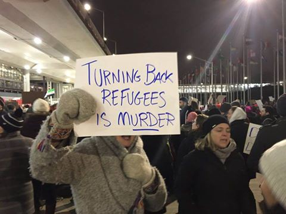
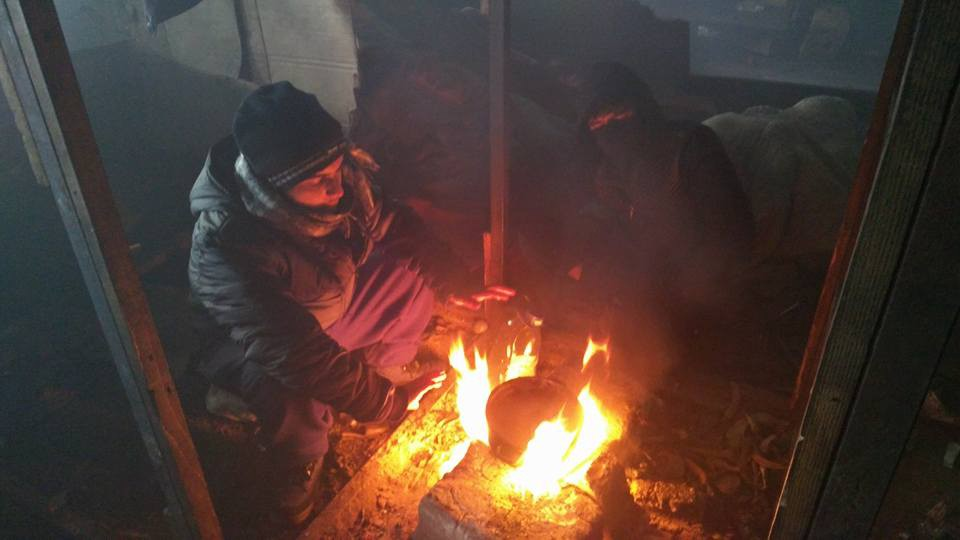
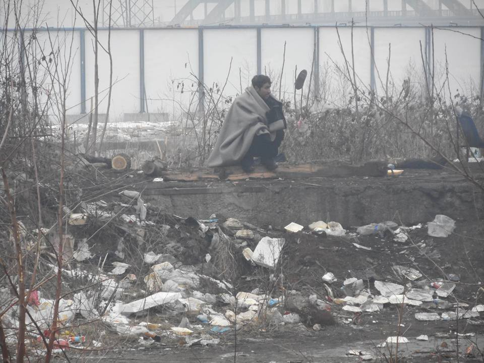
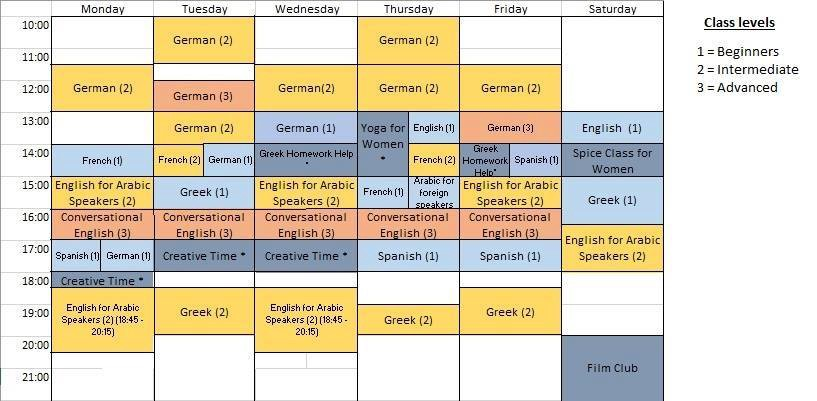
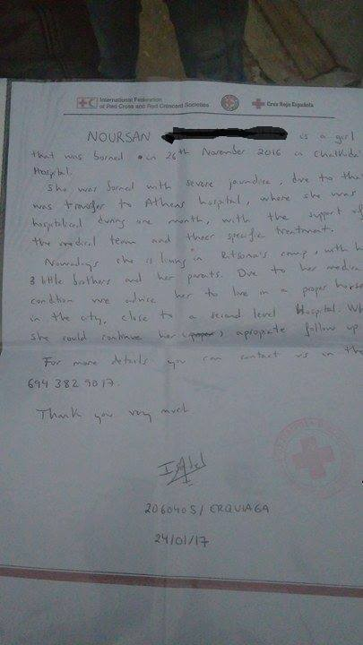
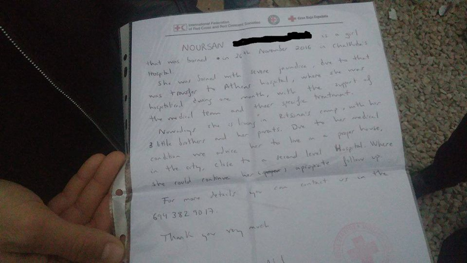
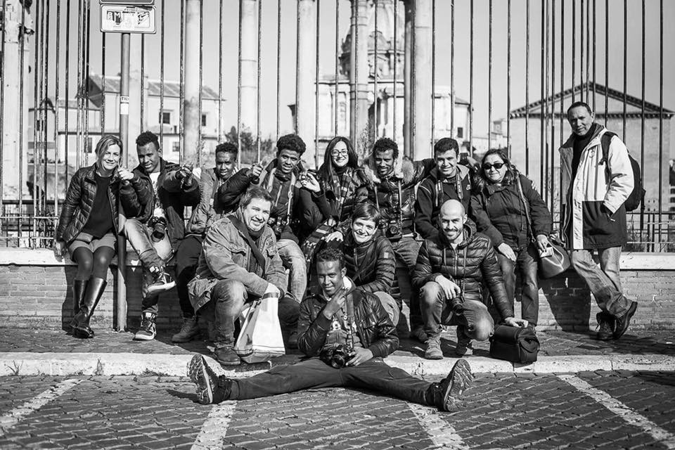
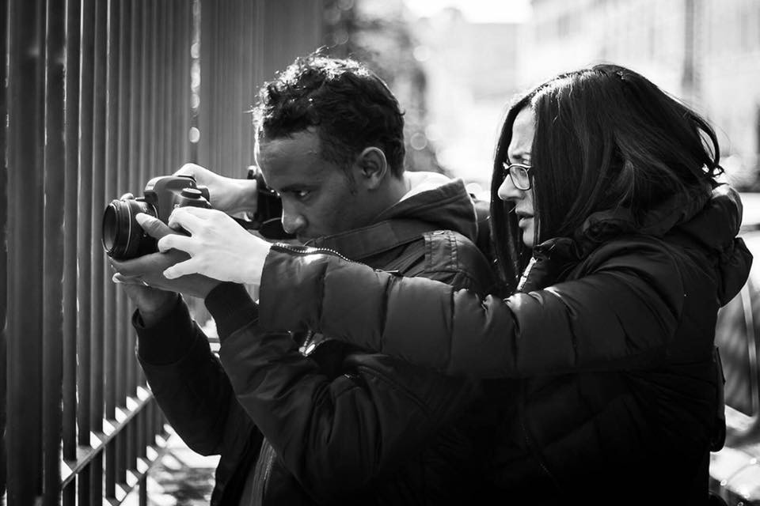

### AYS DAILY DIGEST 29/01/17 — No ban\!

Series of protests against Trump’s “Muslim ban” in the US and internationally / More avoidable tragedies at sea in Italy and Spain / New restrictions at the Serbian\-Hungarian border / Reaction from Chalkida Solidarity Initiative in the aftermath of Ritsona camp tragedy / Welcoming refugees in Rome

From the protest tonight at O’Hare Airport\. Photo by Jacobin Magazine
### NO BAN\.

In the aftermath of President Donald Trump’s [executive order](https://inews.co.uk/essentials/news/president-trumps-muslim-ban-executive-order-text-full/) imposing a ban on people from seven Muslim\-majority countries \(Iran, Iraq, Libya, Somalia, Sudan, Syria and Yemen\), numerous protests both within and outside of the US have been taking place\. A significant number of protests are now emerging around the UK **,** fueled by former UK Independence Party \(UKIP\) leader Nigel Farage’s [declaration](http://www.mirror.co.uk/news/uk-news/nigel-farage-welcomes-donald-trumps-9715860) that the UK should copy Trump’s so\-called Muslim ban, and the lack of a direct response to Trump from Theresa May\. i News shared [a list of protest events](https://inews.co.uk/essentials/news/trump-muslim-ban-protests-around-uk-full-list-events/amp/) being held not only in [London](https://www.facebook.com/events/359732827741189/) but around the country\.

A comprehensive list of refugee/migrant resources in the UK and Europe is currently being built\. Take a look here: [https://storify\.com/trillingual/refugee\-resources\-in\-the\-uk\-and\-europe](https://storify.com/trillingual/refugee-resources-in-the-uk-and-europe)

Calais Action is urging anyone who has students or colleagues currently stranded outside of the U\.S\., or know a Syrian, Iranian etc\. green card holder stuck outside with tickets to return, to let Simon Sandoval\-Moshenbeng know\. He is the director of the Immigrant Advocacy Program at the Legal Aid Center in Washington, DC\.
simon@justice4all\.org , 703–778–3450

 ; “We must continue to make a show of solidarity with those from the list of ‘banned’ countries, and continue to make our collective voice heard by those in government\.”](assets/7215aa70e257/1*RaSH6valQdexM1dKQCBBnQ.jpeg)

Help Refugees offers [WAYS TO HELP](https://www.facebook.com/HelpRefugeesUK/photos/a.123267671367248.1073741830.111893659171316/377447222615957/?type=3&theater) ; “We must continue to make a show of solidarity with those from the list of ‘banned’ countries, and continue to make our collective voice heard by those in government\.”

> There are moments of terrible injustice throughout history where we look back and rightly ask — what did people do? 

### Europe
#### SERBIA

Hungary\-based [Sirius Help](http://www.sirius.help/) and Serbia\-based Fresh Response have [reported](https://www.facebook.com/freshresponseserbia/photos/a.1158374040876421.1073741828.1157495037630988/1313367628710394/?type=3&theater) yet again on the tightening of already tight borders and new restrictions regarding asylum waiting lists\. They have described the people stuck in the limbo at the Serbo\-Hungarian border:

“Since Monday only 5 refugees daily have been allowed to enter Hungary through each transit zone on Serbian\-Hungarian borders, while more than 100 new asylum seekers are arriving daily from Bulgaria and Macedonia to Serbia\. Newest restrictive measures of the Hungarian authorities also mean that Syrian, Iraqi and Afghan families now entering Serbia in order to be included in the waiting list and to legally enter Hungary by seeking asylum will have to wait more than a year instead of the current 6–7 months\. Single men’s waiting time can be more years\. Serbian authorities have not allowed for citizens of several countries to register since December\. Therefore these outcast people are rambling around the forests in abandoned buildings, and trying to survive\.”
#### BRINGING AID TO SERBIA

Many people are determined to help refugees in Serbia\. However, it is important to keep in mind some legal obstacles and know the easiest and best ways to distribute aid\. Here is some useful volunteer information from [SoulWelders](https://www.facebook.com/SoulWelders/) on bringing and distributing aid in Serbia, as well as what items are most needed at the moment\.

> “You cannot transport second hand items across the Serbian border unless you get special papers from the commissariat of Serbia\. If you bring new items you will be charged duty on the border\. If you are an experienced aid worker and want to volunteer in Belgrade contact us as we are leasing a house here with a workshop\. The northern border is needing hard boiled aid workers, they are undermanned, not for the faint hearted\. If you want to bring catering trucks again, you will need paperwork from the commissariat of Serbia maybe if you have connections with MSF or UNHCR this will be possible\. 

> Here is an update from the northern Hungary Serbian border\.
 

> **What is the biggest need?** 
 

> Well to be honest: first, **money** to buy urgent items ourselves as the need arises\. We’ve had several new donors offer help this last weekend but they all require buying items themselves — which means we must try to predict the items we need in advance\. Secondly — **sleeping bags** \. \(Synthetic, \-10 degree rating\) — We have trouble finding suppliers for this\. Third — **firewood, or alternately briquettes** \. All our local suppliers are out of stock\. \(Edit, we’ve found a solution to this the next couple weeks and have stocked up on firewood and briquettes\) \. Fourth — we will never have enough **warm winter hats, gloves, wool socks** — which are all cheaper items, but we have emptied the stock of most Subotica shops — and we go through at least 200–300 of each of these items every week \(because every time migrants try to cross the border illegally, Hungarian police steal or destroy their clothes\) \. Finally— **tents** \. Serbian police regularly destroy these\. 

> We spend over 300 euro on average per day only on food, purchased fresh every day\. We are the only provider of food, clothing/camping items, and now medical for the population of unregistered migrants in the north\.
 

> Situation is that 4 days ago, Serbian police coordinated another mass removal of people — they moved 180 to Presevo in the south\. Illegal deportations continue happening to Macedonia, though not as high profile as before\.
 

> Our numbers are climbing again — we currently have at least 200 migrants we serve in the area, and if the former pattern continues \(because this is the 4th police removal since October\), in a week or two the numbers will be back to normal\. We distribute large fresh food bags and cooking ingredients and drinking water \(most migrants have no access to drinking water\) 4 days each week to Subotica area\. 3 days a week we distribute the same to Kelebija and Horgos\. Every day, we distributed targeted non\-food items in the hidden areas where migrants live— blankets, sleeping bags, tents, gloves, jackets, hats scarves, thermals, shoes\. We also do a few mass NFI \(non\-food\) distributions each week: hygiene kits — toilet paper, razors, soap, baby wipes, toothbrushes, toothpaste\. Our main challenge is because Hungarian police systematically destroy all migrants’ phones, cash, and clothing with each border attempt \(which they try every few days\), we constantly replace the same items for the same people\. So they don’t freeze to death\. Meanwhile, Serbian police continue to occasionally destroy every informal camp structure — which we constantly help to improve over and over again, with floor insulation, covering tarpaulin, and wall insulation\. There are some small recent developments to increase capacity by the part of the Serbian state, responding to pressure and leverage by MSF as a main actor — Obrenovac camp has opened near Belgrade accommodating 255 people, in poor conditions but better than sleeping outside\. And MSF is currently working to install overflow tents to increase 3 or 4 official camps’ accommodation capacity by about 120 each\. Our total daily expenses are now probably 500–600 euro/day when we factor in the constant non\-food item purchases added on top of the food, as well as spending increasing amounts on medicines and medical tools\. Many of our team have been forced into the role of amateur field doctor, as there are no other supports and we make first contact with the migrants who have been beaten violently \(systematically and regularly\) by Hungarian police — so we do a lot of emergency first aid treatment for trauma wounds and frostbite\.” 

Belgrade barracks, photo by John refugee

[Aid Delivery Mission](http://aiddeliverymission.org/) is preparing for Serbia\! Last year the organization cooked almost 1,000,000 hot meals in Idomeni, northern Greece and now they are preparing to start a new mission in the Balkans\. Support them by visiting their [page](http://aiddeliverymission.org/) and make sure to INVITE people to [join them](https://www.facebook.com/events/271878003230897/) as they prepare in Amsterdam\.

#### GREECE

A [web application](http://geochoros.survey.ntua.gr/ekepy/) aiming to facilitate access and provide useful cartographic data relating to the health services and hospitality hot spots in Greece has been developed\. Find it here: [http://geochoros\.survey\.ntua\.gr/ekepy/](http://geochoros.survey.ntua.gr/ekepy/) This tool is thanks to the Research Group for Geospatial Analysis and Geographic Information Systems \(GEOCHOROS\), the National Technical University of Athens \(NTUA\) and was completed in collaboration with the National Health Operations Centre \(E\.K\.EP\.Y\. \) \.

A total of 58 refugees arrived on the northern Greek islands in the last three days\. 47 people arrived on Lesvos and 11 on Samos\. There were no new arrivals on Chios\. Source: [Greek Reporter](http://greece.greekreporter.com/2017/01/29/58-refugees-and-migrants-arrived-in-the-last-3-days-on-the-aegean-islands/?utm_source=dlvr.it&utm_medium=twitter) \.

[Advocates Abroad](http://advocatesabroad.org/) , qualified attorneys and human rights experts providing legal aid to refugees in Greece, announced the opening of their **Legal Aid Hotline** this week\. Every Monday and Wednesday, from 6–9pm Athens time, refugees are welcome to call or message them with asylum related questions\. The Hotline is based on Skype with the handle “Advocates Abroad Hotline\.”
#### Athens

The organisation **Help Refugees** and their partners **Khora Community Centre** are working hard on helping refugees to stay in Athens by providing them with a number of services such as dentistry, information, legal services, language classes, lessons for children, internet and more, six days a week\. In order to keep doing this as well as realize future plans, like providing basic medical services for people who cannot afford treatment, they need our support\. You can read more about them [here](http://www.aljazeera.com/indepth/inpictures/2017/01/khora-community-centre-greece-refugees-170125134213915.html) and make a donation [here](https://mydonate.bt.com/donation/start.html?charity=127188) \.

](assets/7215aa70e257/1*ig-111EQ95MQUvuflIKMeA.jpeg)

Photo by [Al Jazeera](http://www.aljazeera.com/indepth/inpictures/2017/01/khora-community-centre-greece-refugees-170125134213915.html)

Another Athens\-based NGO, [**Zaatar**](https://www.facebook.com/zaatarngo) **,** published a schedule of classes and activities for the week of January 30th:

Among the five people who died in refugee camps last week, one was a 2 month old baby living in Ritsona camp from birth\. After yesterday’s event, which we [wrote about](https://medium.com/@AreYouSyrious/ays-daily-digest-28-01-2017-the-events-of-today-are-so-absurd-that-it-is-hard-to-believe-this-day-9ec774f14e22#.68iinlptu) , Greek police brought the parents to the police station of Chalkida on charges of child neglect\. No Borders has put out a statement in response to the false news surrounding the event:

> Baby girl Noursan was born on November 26 2016 in the hospital of Chalkida\. From the day of birth she was diagnosed with cystic fibrosis, respiratory problems and frequently needed oxygen support\. On 02\.12\.2016 the child entered Agia Sophia children’s hospital where she was admitted for 24 days and left on 27\.12\.2016\.
 

> All this time from 27\.12\.2016 and after the baby was coming in the hospitals of Athens and was hospitalized again in Paidon Agia Sofia and Aglaia Kyriakou where upon examination and after being hospitalized for one day returned on 1/12/2017 in Ritsona\. There she visited doctors of the Spanish Red Cross, who insisted that the child should be within the urban fabric to have easy access to the hospital\. **Desperate parents pressed and implored those responsible of IOM and NGOs to find them a home in Chalkida** \(like they did for other refugees as they had to\), and they ignored them and postponed it from day to day, totally indifferent\. **The baby was diagnosed with congenital cystic fibrosis and needed oxygen support, which does not and did not exist in the camp of Ritsona\.** 
 

> On 24\.01\.2017 the parents contacted once again the doctors of Ritsona and finally **received a written confirmation that they should be relocated immediately near the hospital** \(following document\) \.
 

> One day later, 25\.01\.2017, the infant was transferred from the mother due to lack of oxygen in Chalkida hospital where after the tests said they would call ambulance without informing them of where and why\. The woman stayed outside clinic with the baby in her arms from 10 am to 9 pm waiting for the ambulance and all this time often bothered the doctors about the incident\. The last time, she talked to a doctor who told her that the child is well without giving them further instructions\. So as there was no ambulance, the mother returned to Ritsona with a taxi\.
 

> On 27\.01\.2017 at 10 in the morning \(opening working hour for Red Cross doctors\) she visited them and told them that the baby was not well and that she was told by hospital if worse to call an ambulance\. In the afternoon, while the doctors departed, she kept on calling those responsible for the camp \(doctors and managers from IOM and NGOs\) and nobody answered\. Around 11\.50 she called an ambulance which never arrived, so around 12 to 12\.15 she and her grandmother called a taxi and the grandmother transferred the infant \(parents remained in the isobox in the camp under huge shock among friends, relatives and neighbors\) and en route to the hospital infant passed away, two kilometers before arriving\. 
 

> It is significant that, all this time, parents experiencing this discomfort in Athens and Chalkida hospitals having also another two minor children, no translators for the longest time, no money and food, despite the desperate appeals to those responsible\. Please also note that Ritsona doctors, nurses and managers work from Monday to Friday 10 am to 16:30 pm\.
 

> Criminal responsibilities for those responsible for the camp, media and all those involved at the time trying to shirk responsibility, to disorient the fact through the media and maliciously accuse the infant’s parents dragging them on 28\.01, 10am to Chalkida police station, for minor neglect\. 
 

> Conclusions are your own\.
 

> Also, in the past there was criminal negligence of those responsible for infectious and other diseases which have been reported to Chalkida prosecutor\.
 

> Chalkida Solidarity Initiative to refugees\-immigrants\. 

Photo by Chalkida Solidarity Initiative to refugees\-immigrants
#### ITALY

205 people landed at Molo Favarolo this morning, after having been rescued by an Italian Navy ship and transported along a coastal navigation route by the Lampedusa coast guard\. Among them were 26 women, including many in late stages of pregnancy, and 2 children\. The body of a woman who died during the Mediterranean crossing was also taken to the dock, reports [Mediterranean Hope](http://www.mediterraneanhope.com/) \.

Another tragic event took place further north, in Milan\. Earlier today Mussie, a 30 year old man from Eritrea committed suicide by throwing himself out the window of the centre in via Aldini where he was housed\. More details of the event have still to be made public by the police, who are investigating\. Source: [Milano Today](http://www.milanotoday.it/cronaca/suicidio-centro-accoglienza.html) \.
#### Rome

**A welcoming ceremony and a press briefing\. Monday 30 January 2017 at 11:00 at Fiumicino airport, Terminal 2\.**

Speakers at the briefing will include president of Comunita’ di Sant’Egidio Marco Impagliazzo, president of the Federation of the Evangelic Churches Luca Maria Negro, vice\-minister of foreign affairs Mario Giro and prefect Angelo Malandrino from the Ministry of the Interior\.
On Monday, another 40 refugees will arrive from Lebanon thanks to the humanitarian corridors promoted by Comunita’ di Sant’Egidio, Federation of the Evangelic Churches in Italy and Tavola Valdese, writes [nev\.it\.](http://www.nev.it/nev/2017/01/28/profughi-corridoi-umanitari-lunedi-mattina-altri-40-arrivi-fiumicino/) 
Collaborations between civil society and institutions are once again promoting integration and offering a safe and legal arrival to refugees and particularly vulnerable people \(families with children, women traveling alone, elders, sick people, people with disabilities\) \. Some of the refugees who arrived previously will be present at Fiumicino to welcome the new arrivals\.

](assets/7215aa70e257/1*Nk3j-J7bNC3eMBaE5skEwA.jpeg)

Benvenuti in Italia\! Photo by [nev\.it](http://www.nev.it/nev/2017/01/28/profughi-corridoi-umanitari-lunedi-mattina-altri-40-arrivi-fiumicino/)

Baobab Experience held a lunch with refugees/migrants once hosted at Baobab at 100celleaperte in Rome today\. Libyan, Tunisian and Italian cooks prepared local dishes and many musicians participated in the event\. A photography workshop was also held providing young refugees an opportunity to learn from professional photographers while in Rome\.
Praiseworthy initiatives from Italy\!

Photos by Baobab Experience
#### SPAIN

News of more avoidable tragedies at sea\. The body of a six/seven year old boy was found on the coast of Barbate Cádiz, near the lighthouse, a local source reported\. According to the authorities this took place on Friday morning\. A representative of the Cádiz security forces announced it and Gabriel Delgado from the office for migrations confirmed\. It is not yet clear whether the boy belonged to a group of five \(four men and a woman\) who drowned and were found last week\. Another woman and a man were found lifeless in the waters at Tarifa\. On the coast of Algeciras three men were found dead\. It is assumed that the child is a resident of sub\-Saharan Africa\. **To date, this event has found little mention in the media\.** Today a small note was made on ORF\.at as well as on [WELT\.de/N24](http://l.facebook.com/l.php?u=http%3A%2F%2FWELT.de%2FN24&h=ATPqzb5yIwiMvCKDNcdQCgEWvaVWFP6iZxxL6TpNxV_W2qioELCVgTic3Y66rsqxUf5rNke5CBqCe0L-JKf0QtxwDjxzkFCqdA8giEBlLPjGYKVlL4LR21ZWgY3AoyI-0nl9w0n-c_pNVTs&enc=AZPu7np8isoibGnXNOB1_rJsApZQJaijHhls_m-uqMDzOHS5GgijeODuxQbO11MDBlaR0FqYjTF-3kdW3-0bBm_Z1rxenTUJDlvZ2bmz5HXU129qNemGpKmTTeFHbz79PJ0H5L58t00XqwdWMWkmWJc3jAP75twJlS72L1IKT-4_nl9i6qwl_aChGwAQg9wk8zE&s=1) \.

_Converted [Medium Post](https://areyousyrious.medium.com/ays-daily-digest-29-1-17-no-ban-7215aa70e257) by [ZMediumToMarkdown](https://github.com/ZhgChgLi/ZMediumToMarkdown)._
