### AYS DAILY DIGEST 01/02: Refugees chased in Calais

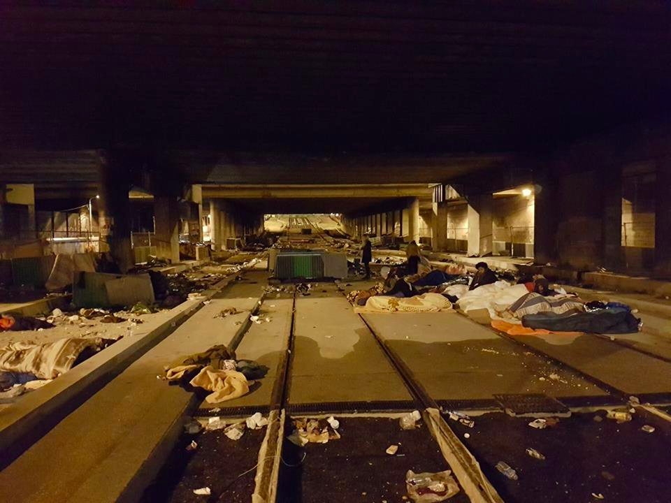

**Refugees sleeping rough in Paris \(Calais photos these days are hard to find and maybe not wise to publish\) \.** Photo by Joao Pequeno

_IRC builds emergency shelters in Moria//Refugees chased by police in Calais while associations feel “betrayed” by government//EU summit will discuss how to close its borders to Africa_
### Registrations & Relocations

76 refugees were registered on the Aegean Islands today, including 17 on Samos and 59 on other islands\.

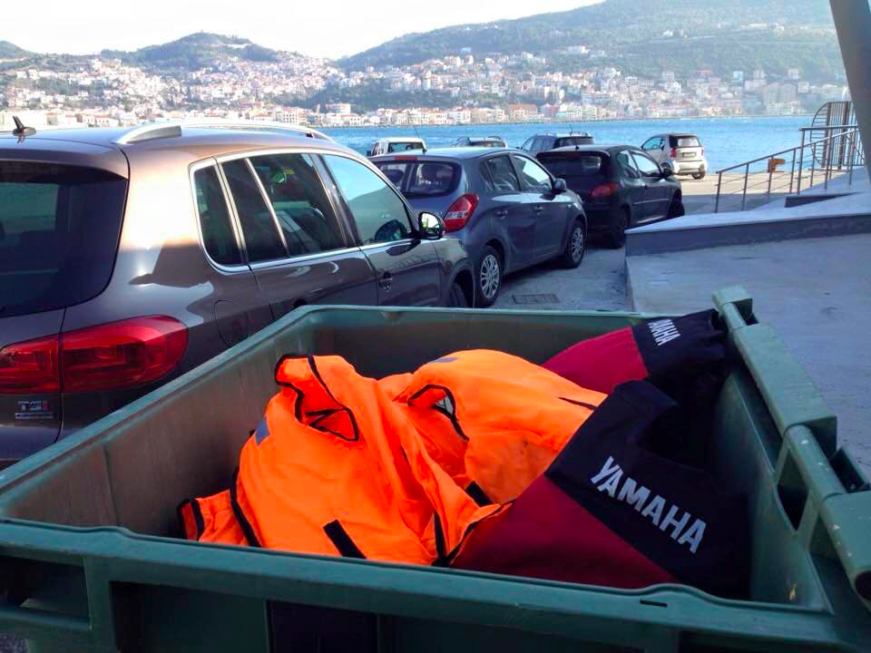

Photo by Samos Volunteers

493 refugees were relocated between the 24th and the 31th of January, including 237 to Germany and 127 to Norway, bringing the total to 8,412\. These brings the numbers for January above 1,000\. However, **we remain far from the target of relocating 2,000 people every month from Greece and 1,000 people from Italy in order to end relocation by the end of September 2017\.**

As the procedure remains slow, hundreds of people will gather for a car rally on the 6 March 2017 in Brussels to remind European leaders of their promise to relocate refugees\. Drivers will act as ‘Official European Chauffeurs’, willing to bring refugees to their respective countries if that’s what it takes to make it happen\. You can still join the car parade by signing up [here](http://www.bringthemhere.eu/) \.
### Hunger strike, Day 2

On Samos, one person fell unconscious as the hunger strike entered its second day\. Refugees are protesting the slow asylum process\. The Refugee Rights Data Project, based however on surveys made on mainland Greece, says most people expressed concern about being stuck ‘in limbo’, as they face uncertainty and slow bureaucratic procedures\. 80% said they had spent more than eight months in Greece\.

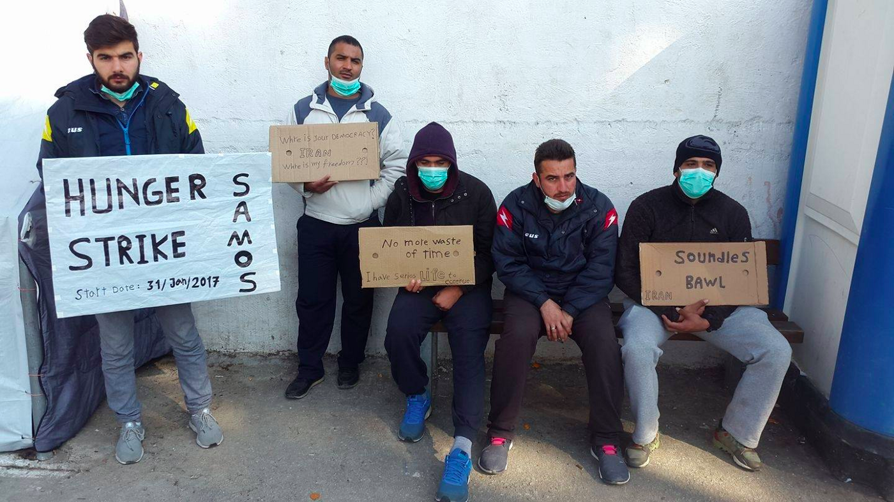

Photo by Hessam Ghafelpour

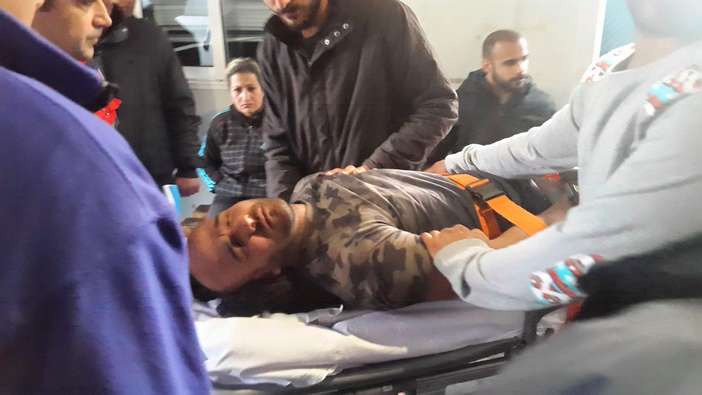

Photo by Hessam Ghafelpour
### Changes in Moria

After the death of three people in just one week in Moria, the [Greek Reporter](http://greece.greekreporter.com/2017/02/01/housing-units-replace-tents-in-moria-after-series-of-deaths/) says the International Rescue Committee has replaced some tents with 23 insulated shelters, hosting 120 single men in total\.

■■■■■■■■■■■■■■ 
> **[Daphne Tolis](https://twitter.com/daphnetoli) @ Twitter Says:** 

> > 23 insulated shelters that will host up to 120 people previously in tents are set up in #Moria refugee camp on #Lesbos. @[IRCEurope](https://twitter.com/IRCEurope) @[eu_echo](https://twitter.com/eu_echo) https://t.co/RQXZZIki3R 

> **Tweeted at [2017-02-01 13:43:45](https://twitter.com/daphnetoli/status/826788128635621376).** 

■■■■■■■■■■■■■■ 

The IRC says it is an _“emergency, stopgap measure to improve living conditions on site_ ”, adding that “ _steps must be taken, immediately, to dramatically reduce the number of people accomodated at Moria and to staff up the asylum process so that the thousands of people whose lives have been put on hold can regain some semblance of control over their future_ ”\.

[Left\.gr](https://left.gr/news/aposymforisi-kai-anavathmisi-se-exelixi-entatikes-ergasies-sti-moria) reports that on the western slope of the camp, two\-story shelters are supposed to be erected and Moria “will be how it should be” by the end of February\. Yesterday, another 50 refugees were transferred to the Navy Vessel “Lesvos” at the Mytilini port while around 100 people, mainly families, were transferred to the Kara Tepe camp\.

While these changes are welcomed and necessary, they risk being insufficent over the long\-term\. People urgently need to be moved to the mainland to reduce the camp’s overpopulation\.
### Books needed for Leros

Hub Leros is looking to set up a library\. Residents have been stuck on the island for a very long time, without being able to work and study — introducing a library would allow them to continue their studies and practice new languages\.

The Hub is the centre for adult refugees created by [Echo100PLU](http://echo100plus.com/) S and is a space for learning, creativity, community and social engagement\.

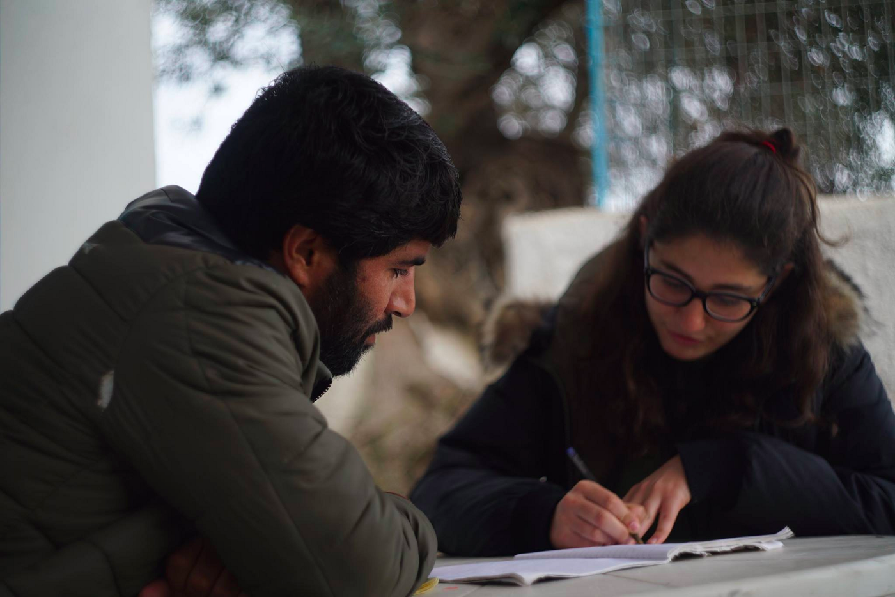

Books are needed in Arabic, Dari, Urdu, Kurdish, Farsi as well as in basic English, German and Dutch\. Textbooks are also need in subjects like medicine, biomedical sciences,engineering, psychology, economics, history, politics, philosophy and law\. We imagine that books to learn languages including English, German and Dutch would be welcome as well\.
### Soft launch of the Polykastro Open Cultural Center

The Polykastro Open Cultural Center will have its soft launch on Thursday, with families able to visit, play some music and offer their feedback\. The shelves and walls will go up next week and the center will hopefully open soon after that\. The center hopes to be an education and culture space, using teachers from the community whenever possible, as well as a community gathering space, education center and much much more\.

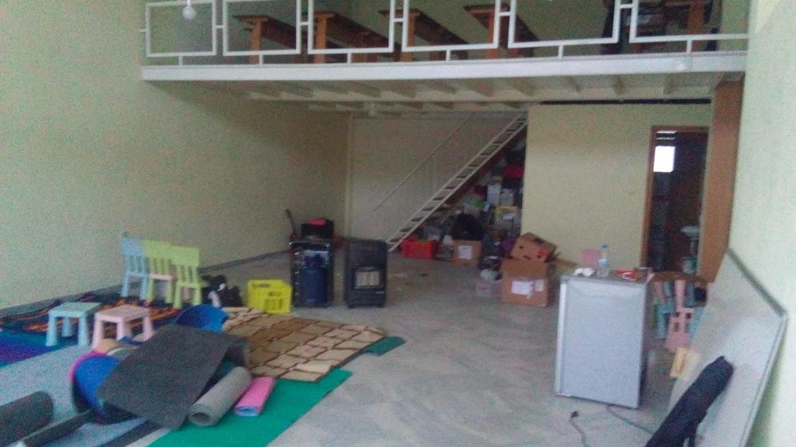

Photo by the Polykastro Open Cultural Center
### Classrooms in Alexendreia repurposed as kids join the local school

In Alexandreia, kids between 7 and 12 are now joining the local school and classrooms in the camp will therefore be opened to adults to learn English, Greek and other skills\.

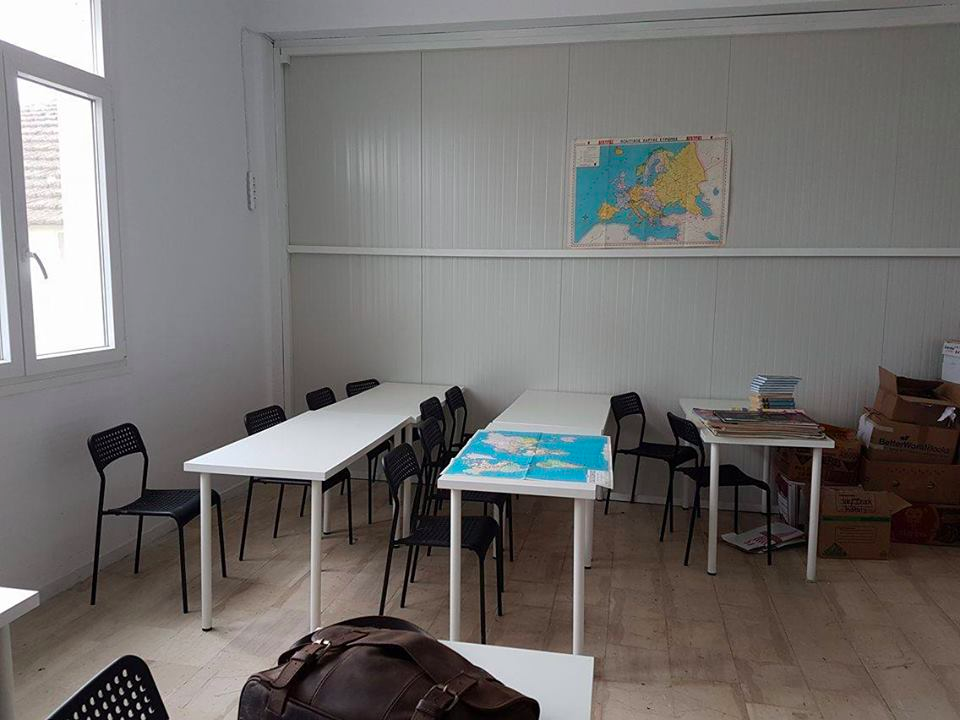

Photo by Refugee Support Greece
#### France
### Refugees are coming back to Calais and being chased by police

It its January report, Care4Calais says the clearance of the Calais camp has not addressed the underlying reasons why refugees arrive in Northern France and says around 10–12 people arrive every day\.

Care4Calais also says that there is no infrastructure to host them and police is focused on clearing the town of refugees, often taking them directly to detention centres, where they are provided with minimal food, blankets and toiletries and have little or no access to interpreters or information\.

[Le Monde](http://www.lemonde.fr/immigration-et-diversite/article/2017/01/30/migrants-le-gouvernement-refuse-tout-dispositif-humanitaire-a-calais_5071784_1654200.html) reports that associations feel “betrayed” by the government, as the minister for housing said there will be no specific facilities for Calais on Monday — on the 7th of November, the minister of the interior had still promised that a “humanitarian system” would be put in place, to shelter refugees arriving in the north of France\. The lack of infrastructure and the reinforced police presence, leads to “manhunts” and forces refugees to hide even more\.

[Watchtheborders](https://watchtheborders.wordpress.com/2017/01/31/return-to-calais-fascist-attacks-and-police-repression/) also says that a group called “Calaisien en colère” is searching and chasing refugees, taking photos and videos and calling the police on them, forcing them to hide further and further\. Around 300–400 refugees are estimated to be in and around the city\.

Care4Calais insists on the UK’s responsibility, saying that refugees travel to Calais because they have close family or community ties to the UK, have served with the British army in Afghanistan or have lived in the UK previously\. The UK should therefore be providing a fair share of places for refugees and create the conditions for safe passage\.
### Street artists needed for the Dunkirk Refugee Women’s Centre

After the fire, the [Dunkirk Refugee Women’s Centre](https://www.facebook.com/refugeewomenscentre/) is being rebuilt and could opening soon\. It’s looking for street artists to paint the facades and tranform it into a “super cool place”\.

“Paintable” surfaces include:

2 outside container facades: 12\.2 x 2\.7 m long \(resting room\+free shop\)
1 inside facade: 4\.8 x 2\.7 m \(free shop\)
2 facades \(inside and outside\): 6 x 2\.6 m \(office\) 
\+ 1 inside facade resting room, but damaged by the fire and hard to access\.

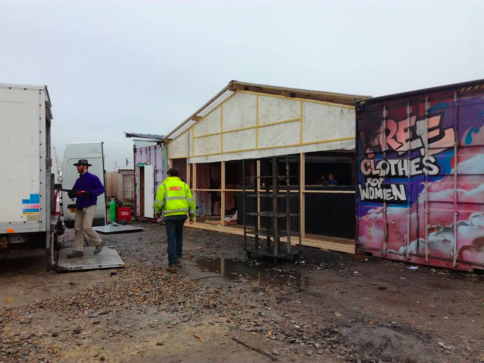

Photo by Refugee Women’s Centre

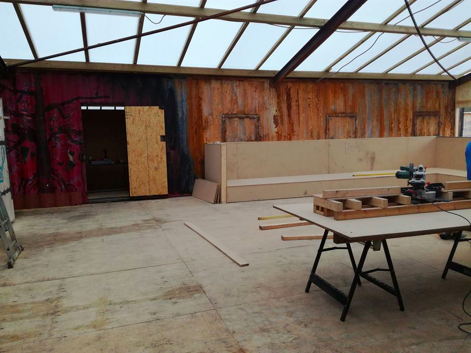

Photo by Refugee Women’s Centre
### Refugees still sleep rough in Paris and living conditions are terrible in Massy Palaiseau

In Paris, refugees are still forced to sleep rough, as described in this short video by MSF\.

■■■■■■■■■■■■■■ 
> **[MSF International](https://twitter.com/MSF) @ Twitter Says:** 

> > The reception centre in #Paris is full &amp; many asylum seekers like Khaled &amp; Hassan sleep rough. @MSF_France has treated cases of hypothermia. https://t.co/HDl2I1gLdW 

> **Tweeted at [2017-02-01 09:02:04](https://twitter.com/msf/status/826717242448543744).** 

■■■■■■■■■■■■■■ 

Outside of Paris, living conditions in reception centres are not really great either\. On the 20th of January, the association BAAM sent a letter to public authorities denouncing the living conditions in the Massy Palaiseau center, managed by the “Secours Islamique”\.

This letter was sent after a meeting with refugees themselves, who described several issues: Since December 2016, no social worker is present and all tasks are handled by two security agents\. Food always arrives in insufficent quantities, and distribution times are extremely limited, forcing some of the refugees to go without\. The 70 people sleep, eat and live in one room and blankets have not been cleaned in three months, while only four showers are available\.

Many other problems are described in the letter, including humiliations, verbal abuse and punitive sanctions\. On New Year’s Eve for example, some refugees arrived after midnight and were forced by the guards to sleep outside\. There has been so far no response or changes made to their living conditions\. Instead, police came to the centre today and three supposed refugee “leaders” were brought to the police station\.
#### Serbia
### Souldwelders building woodstoves in Belgrade

[Soulwelders](https://www.facebook.com/SoulWelders/) has started building woodstoves for the people stuck in Belgrade’s abandoned warehouse\. The goal is to find an easy solution that allows to people to heat themselves with clean firewood, rather than burning up toxic waste that endangers their health\.

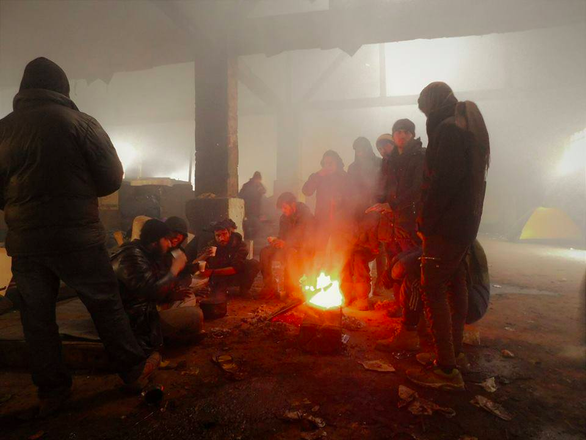

Photo by Nadine Allgeier

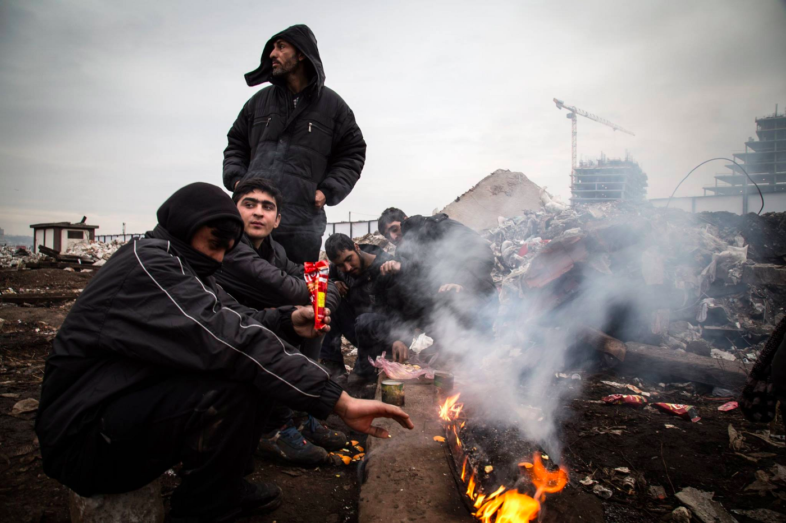

Photo by Matteo Congregalli

After providing firewood, they are now starting to build heat and cooking essentials, including barrel woodburners\. Their house is conveniently located near a scrapyard, which will allow them to cut down on costs\.

If you need more information about volunteering in Serbia a new [People to People Solidarity](https://www.facebook.com/groups/1236769899744449/) has just been created\.
#### Bulgaria
### 500 refugees evacuated from Harmanli camp after fire

[Newsthatmoves](https://newsthatmoves.org/en/500-evacuated-after-fire-at-bulgarian-centre/) says 500 refugees were evacuated from the Harmanli camp, in Bulgaria, due to a major fire\. The flames erupted in a hallway just past midnight on January 31st, with the suspected cause being an overloaded electrical system\. The Harmanli refugee centre was the scene of a mass demonstration in November 2016, when residents protested against overcrowding and poor living conditions\.
#### Italy
### Italy pays out €200m to stop refugees from leaving their countries

[The Local](http://www.thelocal.it/20170201/italy-will-give-200-million-to-african-states-to-stop-migrant-flow) reports Italy pledged €200 million in funds to several African countries as it seeks to boost efforts by African security forces to stop people from leaving\. The funds will go mainly to Niger, Libya and Tunisia and are intended to help train the nations’ security forces and to pay for equipment to monitor the borders\. This information comes agead of the EU summit this Friday in Malta and after the German embassady in Niger described “catastrophic” abuses and “concentration camp\-like” conditions in smuggler\-run camps in Libya\.

[Human Rights Watch](https://www.hrw.org/news/2017/02/01/eu-put-rights-above-politics) mentions that EU leaders will discuss funding and training to enhance border surveillance on Libya’s borders and says “ _the possibility that the EU will seriously consider returning migrants to Libya is of greatest concern_ ”\.

Meanwhile, [The Guardian](https://www.theguardian.com/world/2017/feb/01/nato-eu-ships-tackle-people-trafficking-libya-mediterranean-refugees-migrants) says Libya’s prime minister Serraj has delivered a boost to EU plans to move Operation Sophia into Libyan waters to help prevent migrants from reaching Europe\. Serraj said following talks at Nato that ‘If there is something to be carried out jointly between the Libyan navy and any other party interested in extending a hand to the Libyan navy, that would be possible\.’ Finally, [Ansa](http://www.ansamed.info/ansamed/en/news/nations/libya/2017/01/31/stable-libya-more-important-than-ever-draft-final-ec-d_ae9e9077-3b79-45fc-bef0-fb158b5efe97.html) reports on a draft statement of conclusions for this week’s European Council meeting, which will express the EU’s determination to carry out additional action to slow down migration along the central Mediterranean route\. In addition,

It is ironic that this comes one day after Federica Mogherini issued a statement on Trump, saying his policy ‘ _is not the European way for sure\. The European Union will continue first of all to take care of and host Syrian refugees and other refugees fleeing from war”_ …

As said in yesterday’s [digest](https://medium.com/@AreYouSyrious/are-you-syrious-digest-31-1-alternative-facts-and-the-european-way-76211440b7ac#.h7pg4op50) :

> _“The high\-minded solidarity seems to come with a side of Frontex cooperation in patrolling and hunting for those pushed to the margins of the world, all designed to keep these undesired people out\. President Trump gave a great gift to more than those in his staff and party, lowering the bar of “humanitarian care” to new lows\. Congratulations, Europe, your values stand strong\.”_ 

_Converted [Medium Post](https://areyousyrious.medium.com/ays-daily-digest-01-02-refugees-chased-in-calais-b5277482f4a1) by [ZMediumToMarkdown](https://github.com/ZhgChgLi/ZMediumToMarkdown)._
