### AYS DAILY DIGEST 3/2/2017 — Malta summit: EU needs a reality check

European leaders meet in Malta to discuss the EU\-Libya “migration plan” / Aid groups accuse the EU of abandoning humanitarian values and misrepresenting conditions in Libya / Demonstration in solidarity with refugees in Greece amid terrible living conditions/ Push backs from Greece to Turkey / Volunteers needed in Calais
### Libya is not a safe place

European leaders met today in Malta to discuss the EU\-Libya migration plan that was first proposed last month by the European Commission\. In order to “reduce migratory flows along the Central Mediterranean route”, priority will be given to “training, equipment and support to the Libyan national coast guard” and “further efforts to disrupt the business model of smugglers”, according to [the declaration published today](http://www.consilium.europa.eu/en/press/press-releases/2017/01/03-malta-declaration/) \. There is no mention of _refugees_ or _protection_ \.

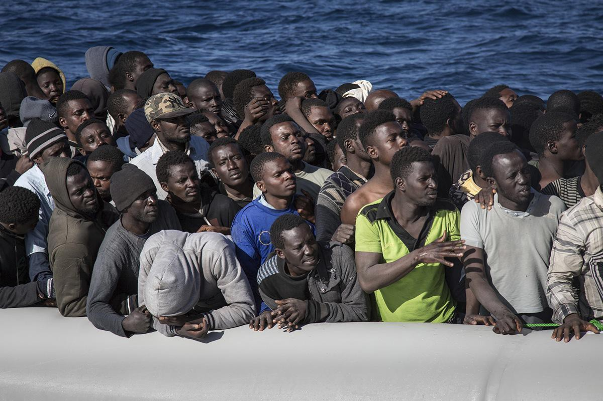

Photo by Independent

Reuters’ [preview of today’s meeting of EU leaders](http://www.reuters.com/article/us-europe-migrants-italy-libya-idUSKBN15I17D?il=0) highlights hopes they will endorse plans to help Africa halt migration flows to Italy, but stresses they are aware that ‘anarchy in Libya means any quick fix is a long shot\.’ President Tusk, quoted by The Irish Times and Ansa, said after meeting Libya PM al\-Sarraj that an agreement to close the Libya migration route is ‘within our reach\.’ He added ‘the EU has shown it is able to close routes of irregular migration\.’

La Repubblica and The Irish Times report Italy’s PM Gentiloni and al\-Sarraj signed a memorandum of understanding on cooperation to combat illegal migration and reduce human trafficking\. Meanwhile, Le Figaro notes the bulk of trafficking activity has been pushed west towards Tripoli as the Islamist coalition in control of the city has fragmented\.

Die Süddeutsche reports Libyan PM al\-Sarraj was ‘warmly welcomed’ in Brussels as the EU hopes to end refugee flows from the country\. The paper notes doing so will only be possible if the country is stabilized\. Al\-Sarraj said he hoped for ‘practical aid’, adding that financial support from the EU is currently very low\. HR Mogherini confirmed that increasing financial aid is being discussed but that the priority is finding out how to better use the resources available\. She added that migration is only one issue and that Europeans are interested in the ‘well\-being of Libyans’\. The paper notes that Tusk made the closure of the route a priority\. Co\-president of the Green\-EFA group in the European Parliament Ska Keller is quoted as warning that living conditions for refugees in Libya are ‘terrible’ and that nobody should be returned to the country\.

European Union leaders are betting on Libya’s fragile government to help them prevent a new wave of African migrants this spring, offering Tripoli 200 million euros and help to beef up its frontier controls, says the Reuters [report](http://www.reuters.com/article/us-europe-migrants-italy-libya-idUSKBN15I17D?il=0) \.
#### Warnings from Amnesty International and MSF

Aid groups accused the EU of abandoning humanitarian values and misrepresenting conditions in Libya, where the U\.N\. \-backed government of Fayez Seraj has only a shaky and partial hold on the country\.

Medecins Sans Frontieres, which has been providing medical care to migrants, refugees and asylum seekers detained in Tripoli and the surrounding area since July 2016, said the summit proved EU leaders were “delusional” about Libya, noting that “today was not about saving lives; it’s clear that the EU is ready to sacrifice thousands of vulnerable men, women and children in order to stop them reaching European shores\.” In a [statement issued today they stressed the need to raise grave concerns](http://www.msf.org/en/article/migration-msf-warns-eu-about-inhumane-approach-migration-management) about the fate of people trapped in [Libya](http://www.msf.org/en/where-we-work/libya) or returned to the country where they are detained arbitrarily in inhumane and unsanitary conditions, often without enough food and clean water and with a lack of access to medical care\.

In a [statement issued yesterday](http://www.amnesty.eu/en/news/press-releases/all/eu-plans-to-close-sea-border-would-lock-refugees-and-migrants-in-horrendous-conditions-in-libya-1017/#.WJTjYlMrK02) , prior to the EU leadership’s Malta meeting, Amnesty warned that closing the EU’s southern sea borders would put thousands of refugees and migrants setting sail from Libya at risk of detention and appalling human rights abuses\. It says the latest EU proposal would “pull back EU naval operations from search and rescue activities and encourage — and indirectly fund — the Libyan coast guard to plug the gap”, trapping “tens of thousands of people in a conflict ravaged country and exposing them to the risk of torture and exploitation”\.

> “It is frankly staggering, given the gravity of the situation in Libya and the depth of human suffering endured by refugees and migrants there, that such a proposal is even being discussed\. The lack of any tangible details on resettlement or on safeguards for migrants and refugees trapped in an essentially lawless country betrays the mean\-spirited intentions behind this cynical proposal,’’ [_said_](http://www.amnesty.eu/en/news/press-releases/all/eu-plans-to-close-sea-border-would-lock-refugees-and-migrants-in-horrendous-conditions-in-libya-1017/#.WJQ79WQrKgR) _Iverna McGowan_ 

In the wake of these events, let’s remind ourselves of [Amnesty’s report on the horrific, widespread abuses](https://www.amnesty.org/en/latest/campaigns/2016/08/through-their-eyes-refugees-own-accounts-of-abuses-in-libya/) being inflicted on people travelling through Libya, including sexual abuse, torture and exploitation\.

At the Malta summit, British MP Theresa May announced a new £30m British aid package that will urge refugees to settle in Asia and Latin America instead of Europe\. People would only be diverted to Asia and Latin America if they were _willing to be resettled there,_ the Independent [writes](http://www.independent.co.uk/news/uk/politics/eu-malta-summit-refugees-europe-redirect-settle-asia-latin-america-theresa-may-30-million-aid-plan-a7561296.html) \.
#### SERBIA

A leftover WW2 bomb was found in the Waterfront works area where the refugee barracks are in Belgrade\. Officials are giving out flyers with information but only in Serbian\. The bomb will be safely deactivated on Sunday between 8–10 in the morning at the location\.
#### GREECE

**Demonstration in solidarity with the refugees in Athens**

Demonstration were held today in solidarity with the refugees in the city center of Athens\. Five refugees died during the last few days in the refugee camps of Greece, three people at Moria camp on the island of Lesvos, one in Samos and a 2 month old baby in Ritsona camp outside Athens\. People took to the streets in solidarity with refugees trapped between closed borders, living under terrible conditions in freezing temperatures\. The main stops of the protesters carrying strong anti\-racist messages were outside the Ministry of Migration Policy and the Greek parliament in Athens\.

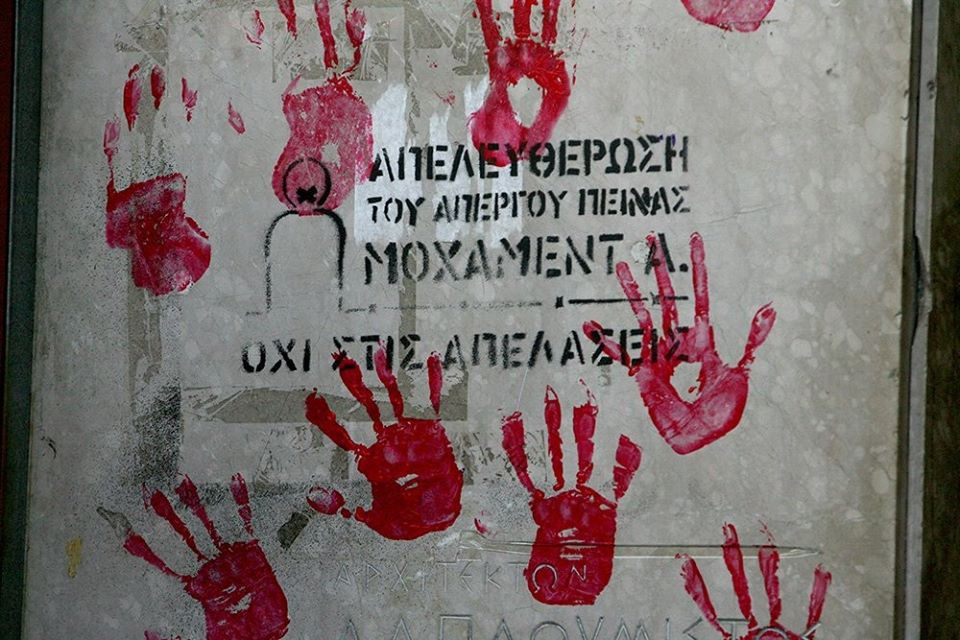

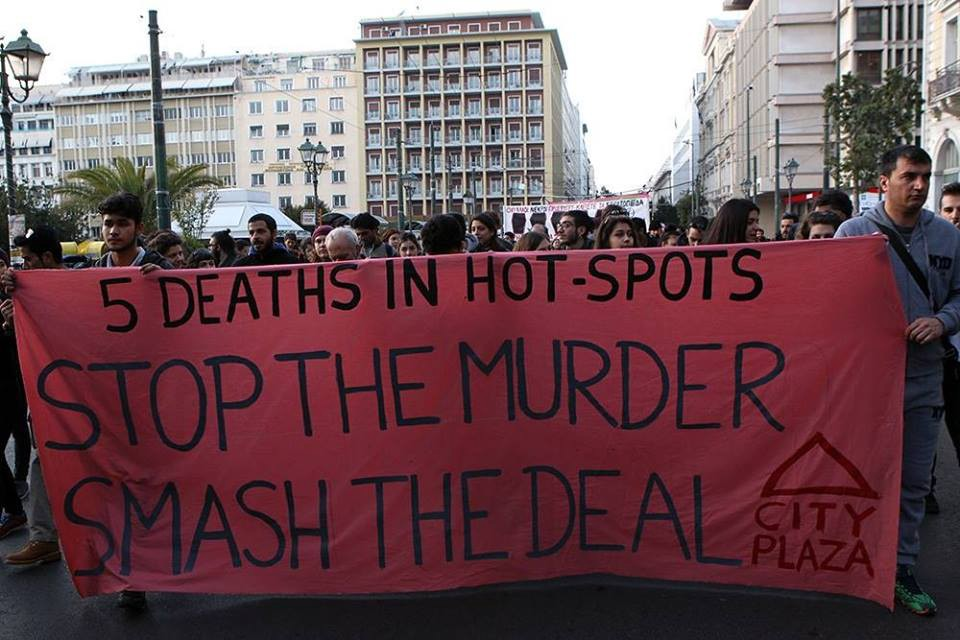

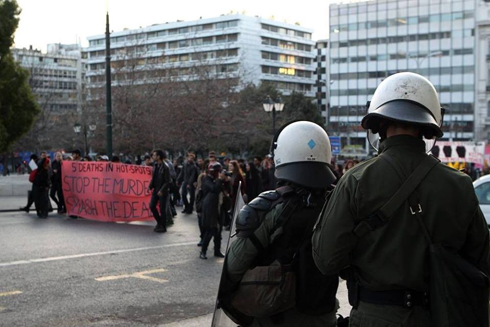

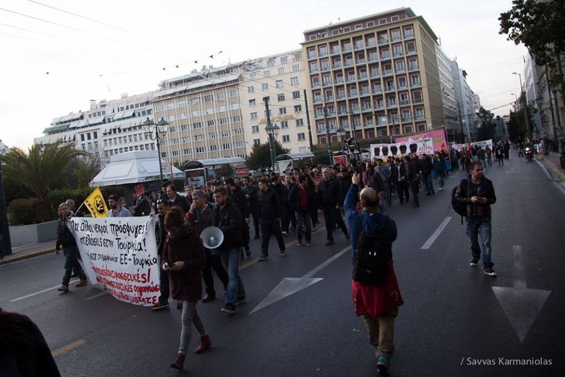

Anti\-rascist protest in solidarity with refugees, outside the Ministry of Migration Policy in Athens city center\.
Photos by Savvas Karmaniolas, Yorgos Siniorakis and Marios Lolos

Demonstrations were also held in Mytilene, Lesvos\. In the last week three people have died in the nearby **Moria** refugee camp from suspected inhalation of carbon monoxide from the heaters in their tents\. Conditions in the overcrowded Moria camp have deteriorated over the recent bitterly cold spell, with many residents still sleeping in inadequate shelters\. Demonstrators stood in solidarity with refugees everywhere and called for the closure of the camp, writes Help Refugees\.

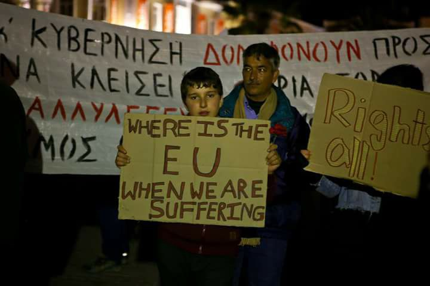

“Where is the EU when we are suffering” , photo by Help Refugees

One of the reasons for the need to stand in solidarity with refugees was clearly shown today in Samos camp, where refugees once again had to experience inhumane conditions\. In a situation where diseases are hard to avoid and medical help is often hard to reach, the food refugees were given was rotten and contained worms\. Just one day after the hunger strike and straight after the visit of the deputy minister \(when the authorities rushed around to tidy the camp and ensure that the most vocally angry people were out of the way\) the residents were served rotten food\.

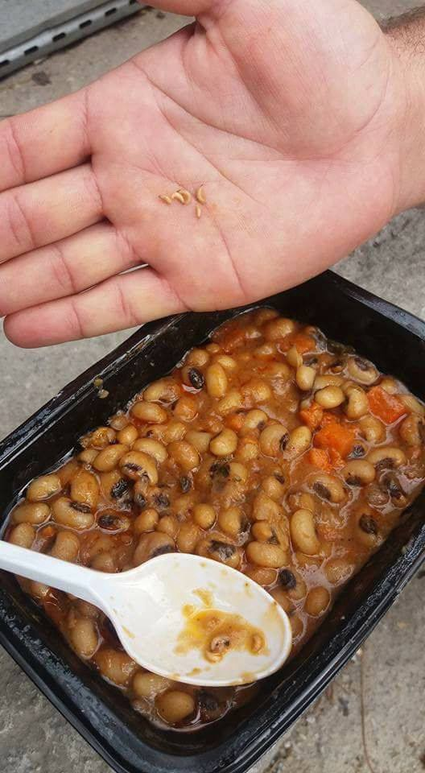

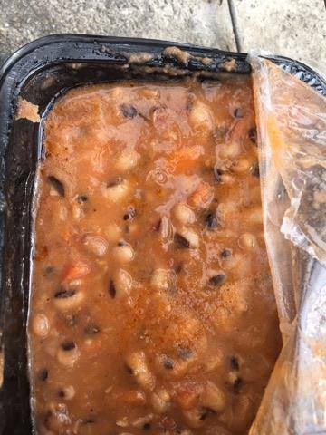

Samos — photos by residents of the camp

The **ATHENS mobile shower bus** is open Monday to Friday from 9am until 4pm and available to everyone\. Towels, soap and showers are free to use for anyone who needs them\. Showers are located 5 minutes walk from Omonia Square \(location in photos\)

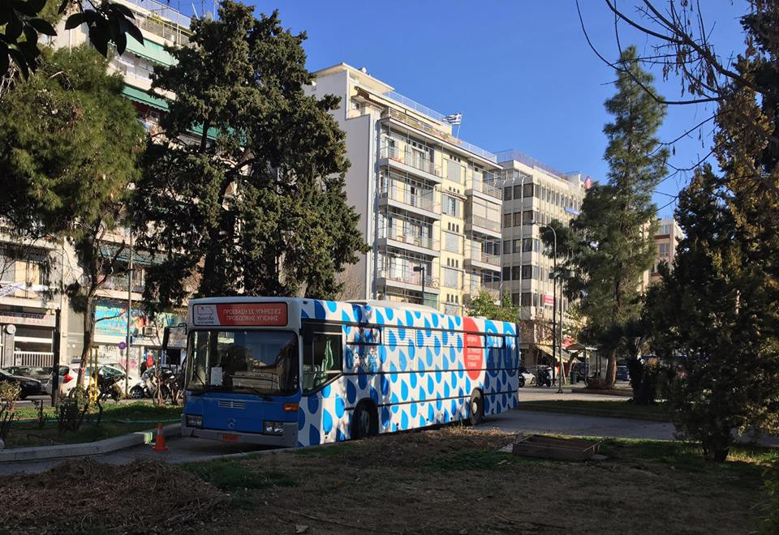

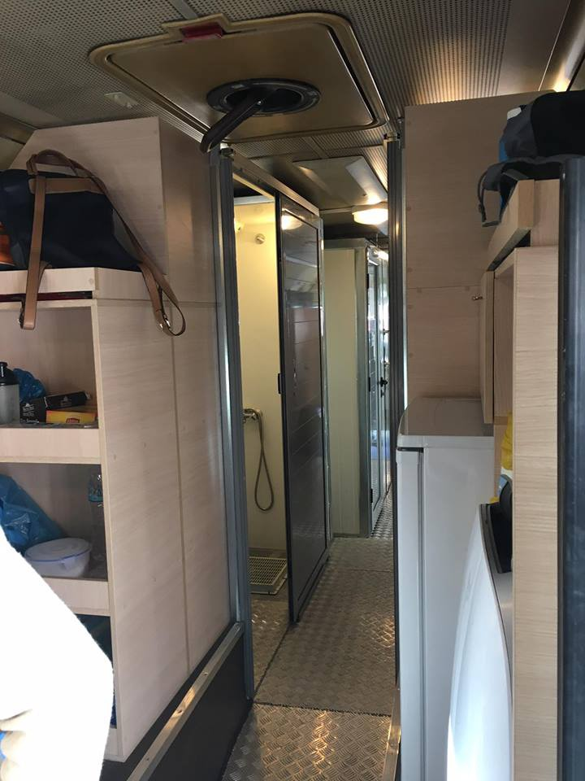

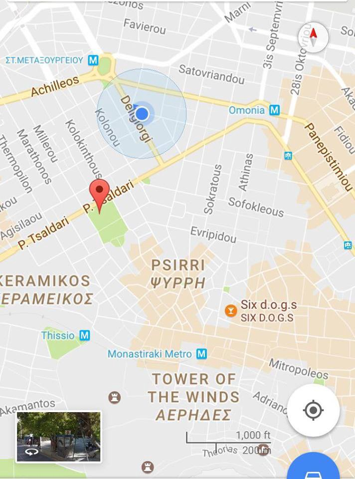

ATHENS — mobile howers are located 5 minutes walk from Omonia Square

**ARABIC — GREEK : mini printable Lexicons for basic communication**

The Embassy of Switzerland in Greece in collaboration with UNHCR Greece, EADAP and METAdrasi, financed by the Swiss Agency for Development and Cooperation SDC and with the support of the Hellenic Republic have put together these useful lexicons\. They are available **Arabic,** **Sorani, Farsi, Urdu, Kurmanji and French with translation into Greek and English\.**

You can retrieve them on the official website [http://refucomm\.com/](http://refucomm.com/) or [here](https://www.facebook.com/notes/refucomm/new-mini-printable-lexicons-for-greece-multilingual/392265164458625?hc_location=ufi) \.
#### **Forcible push\-backs from Greece to Turkey**

[Hurriyet daily news reports](http://www.hurriyetdailynews.com/ankara-says-greece-has-forcefully-sent-thousands-of-migrants-back-to-turkey.aspx?pageID=238&nID=109319&NewsCatID=359) on beatings and forcible push\-backs by Greek police officers, forcing people to board the boats back to Turkey\. Thousands have been sent back via the River Maritza in recent months, according to the accusation\. Taking of personal belongings is also reported, the same scenario that has been repeated in other parts of Europe where closed borders are forcing people to keep finding alternative solutions to a desperate situation while the police keep responding with brutality\. As many as 3000 people are reported to have been sent back in this push\-back maneuver in the last four months\.

On the other hand, 280 refugees were relocated from Greece between the 31th and 2nd of February, including 211 people to Germany, bringing the total to 8,692\. Since the 12th of January, Germany has more than doubled its number of relocations from 644 to 1,342\.

One boat landed on the north coast of **Lesvos** between Eftalou and skala Sykaminia with 44 people on board\. There were no children and everyone is okay, a local volunteer stated\. There were 57 new registrations on **Chios** today\.
#### ITALY

■■■■■■■■■■■■■■ 
> **[MSF Sea](https://twitter.com/MSF_Sea) @ Twitter Says:** 

> > UPDATE: After a huge 36 hours the #Aquarius is headed for #Italy with 785 rescued #people on board. It's squishy but all is well. https://t.co/hGyyXL0QsU 

> **Tweeted at [2017-02-03 16:32:01](https://twitter.com/msf_sea/status/827555249787334657).** 

■■■■■■■■■■■■■■ 

Rosarno Hospital\(ity\) school, a multifunctional and sustainable school in the **Rosarno makeshift camp —** a project promoted by the Collective Mamadou:

The Collective Mamadou from Bolzano, who, for more than a year, operates within the major ghettos of the Italian South, organizing a series of first\-literacy classes for workers \(often illiterate or semi illiterate\), along with SOS Rosarno, MEDU and others active in promoting the rights and dignity of the voiceless has launched a campaign for the construction of a multipurpose building to be included within Rosarno camp, [writes MeltingPot](http://www.meltingpot.org/Rosarno-Hospital-ity-school-una-scuola-polifunzionale-e.html#.WJTz4lMrK01) \.

To enter Rosarno these days is to enter Dante’s circle of hell, writes MeltingPot\. Forgotten by the institutions, more than 2,000 African laborers live crammed inside between heaps of rubbish, plastic and wooden shacks, worn and dirty tents\.
#### FRANCE / UK

Help Refugees UK is in need of volunteers in **Calais** , both those who can stay short and long term\.

> SNUG packs are coming in and are on their way to our Calais Warehouse\. Blanket and sleeping bag stocks are not as desperate as they were\. Thank you very much for all your contributions\. 

> But, what we need now is VOLUNTEERS\. On weekdays there’s usually no more than a handful of volunteers working in the non\-food section of the warehouse\. Meanwhile there are three vans of clothes, bedding and other items going to the streets of Calais every night, and two vans to the Dunkirk camp every day\! This is not sustainable\. We need many more volunteers to come and sort clothes, bedding, toiletries and more\. Calais Woodyard, Refugee Community Kitchen and the distribution teams need people as well\. 

> So whether you can come for a day, a week or a month, and whether you are brand new to Calais or have been around many times before, we need you\! Please like and share this post far and wide, and tag any friends you think could come \(back\) to Calais\. 

> Email calaisvolunteers@helprefugees\.org\.uk to find out how you can get involved\! 

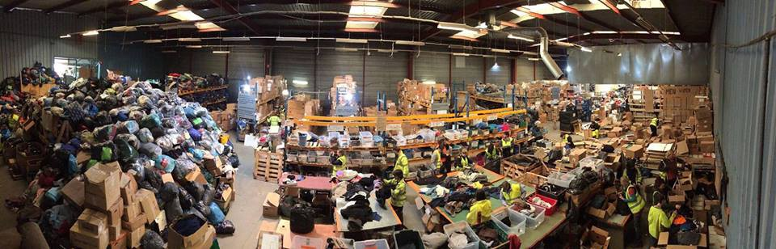

“Warehouse photo by Jenny Noakes, in a time when we \*did\* have enough volunteers” Help Refugees UK

_Converted [Medium Post](https://areyousyrious.medium.com/ays-daily-digest-3-2-2017-malta-summit-eu-needs-a-reality-check-fffccc426659) by [ZMediumToMarkdown](https://github.com/ZhgChgLi/ZMediumToMarkdown)._
