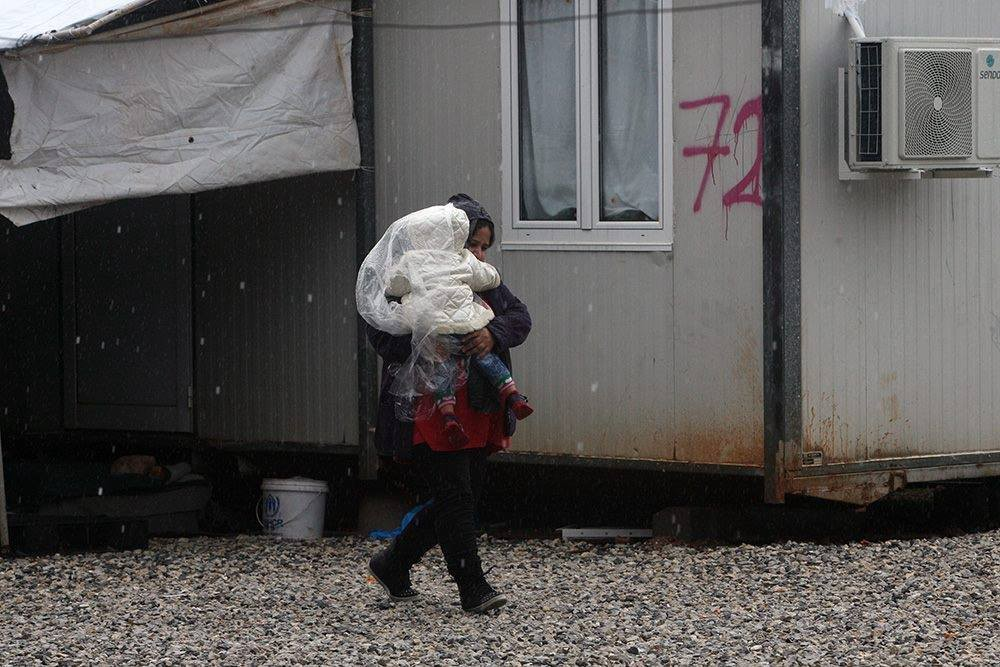
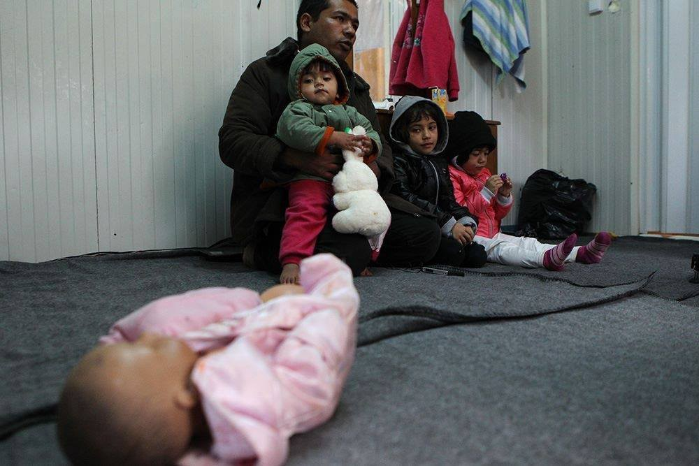
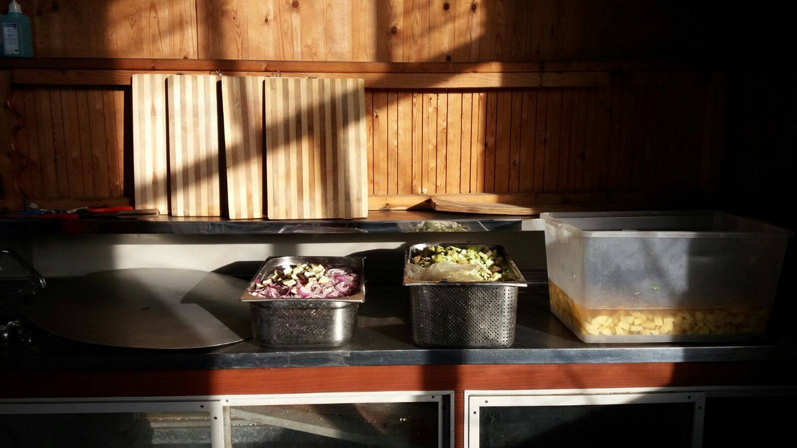
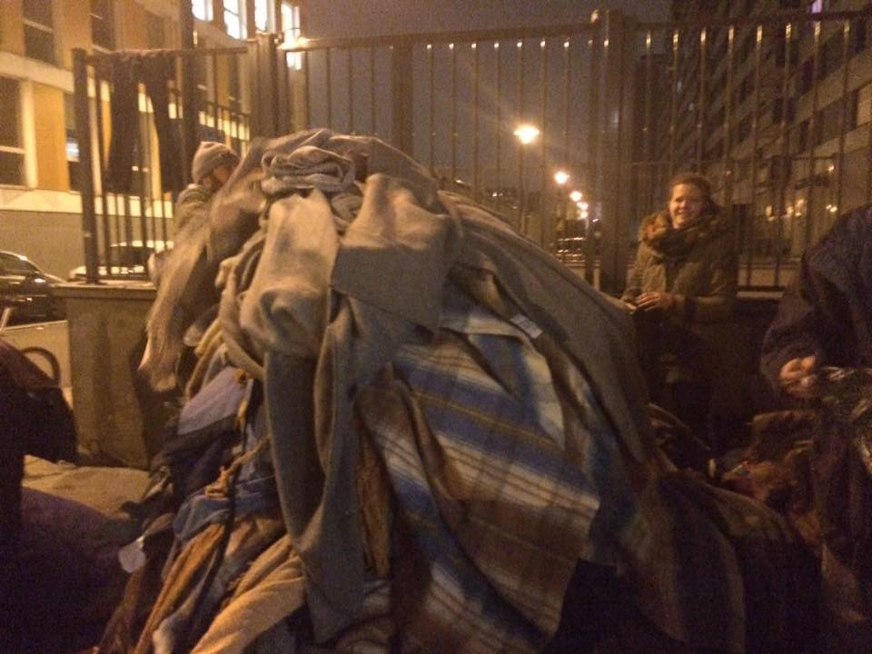
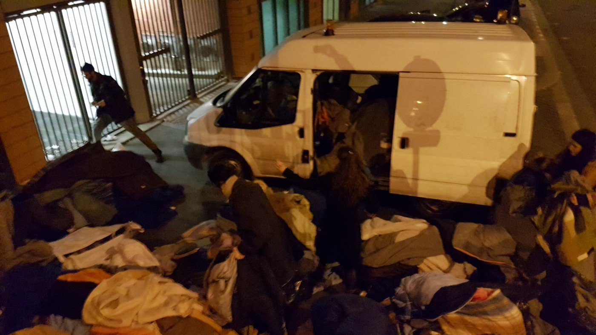
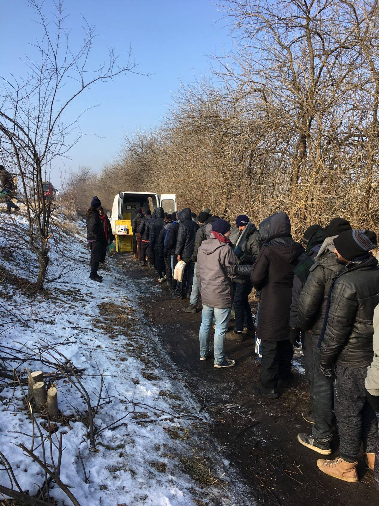
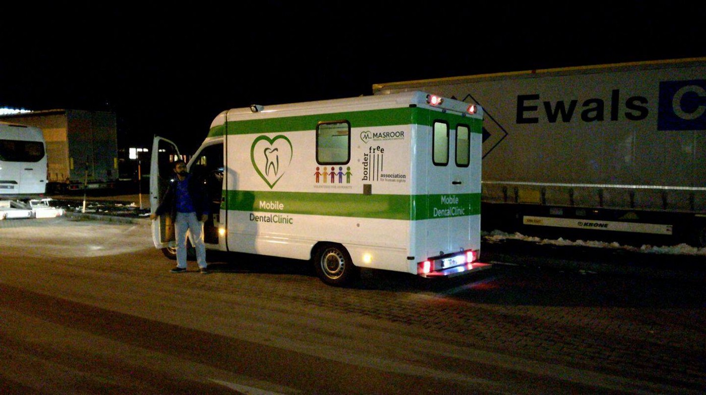

### AYS DAILY DIGEST 10/2: Seeing how it could be — peaceful evacuation in Paris

_Details on Paris — IRR report on mishandling of refugee deaths in Greece — deportations, bomb defusal, and pushback management — water distribution in Serbia — volunteer opportunities_

Photo Credit: Art Against, Marios Lolos

_The conditions here are ten times worse than in my own country\. Only if I go back, I’m gonna die_ — Somalian in Paris\.
#### GREECE
### Calls for accountability in refugee deaths amid WWII bomb defusions, deportations, and pushback reception\.

IRR released a haunting criticism of the game that authorities have been playing with the lives and deaths of refugees in Greece\. The report, entitled “‘No One Accepts Responsibility’: Thirteen Dead Refugees in Greece,” not only gives detailed, but respectful accounts of the deaths that have occurred in the last year, but collects testimony from dedicated volunteers and other media reports who elucidate on how much neglect is on flagrant display in Greece\.

> In fact, evading accountability is hard\-wired into the way refugee reception is organised in Greece, as there is no central authority responsible for the camps’ administration but a number of actors — a mixture of EU officials, the Greek army and other Greek institutions, the Red Cross and the UNHCR\. This means that when anything goes wrong, the various actors end up blaming each other — something academics refer to as a process of distanciation, in which complex chains of responsibility make it difficult to connect cause \(ie, government policies\) with effect \(ie, border\-related deaths\) \. 

The report highlights the work of various organizations and individuals who are working to draw attention to the voices of refugees calling for help\. Read the full report for more [details](http://www.irr.org.uk/news/no-one-accepts-responsibility-thirteen-refugees-dead-in-greece/?platform=hootsuite) and links to valuable resources\.

> 20 individuals were deported from Greece to Turkey yesterday: 18 Pakistanis, 1 Palestinian, and 1 Kurd\. 

> Additionally, an update on the report of the pushback group from Macedonia — the 49 people were put into Larissa camp\. 

Around 75,000 people in Thessaloniki, including residents of the camp, will be evacuated on Sunday morning in advance of the defusing of a World War II\-era bomb that has been found in the vicinity, Mobile Info Team reports\.

Art Against was in Malakassa camp where people spoke out about the unsafe and inhumane conditions in the camp, where flooding is a serious and repeated problem\. Visit [the page](https://www.facebook.com/artagainstproject/posts/1279047248811373) for more photos\.

Photo courtesy of Art Against/Marios Lolos\.

[No Border Kitchen Lesvos](https://www.facebook.com/NBKLesvos/posts/875305742609216) has found a new home\! In a detailed report posted yesterday, they report that they now have a stable place to prepare food\.

> We are cooking every day now in the new kitchen and distributing most of the food on Tsamakia beach and bringing a smaller amount to the people in the squats around the old Social Center\. 

They are also responding to the requests of the community, focusing their efforts on food packs and boxes, rather than prepared food\. In the update, they also highlight the work of those who are helping to clean up the squats\.

Photo Credit: No Border Kitchen Lesvos
#### GENERAL
### _Good policy is more important than good feelings_

This important update from our friends at [International Relations for Peace](https://www.facebook.com/IRPeace.org/posts/1752235038135523) in Hungary reminds all of us that true support is rooted in being careful\. Although good intentions are always appreciated, if not backed up by careful and wise planning, they can create even bigger problems for the people being helped\. In this case, donations\.

> Dear fellow volunteer,
 

>  In recent weeks, we received a lot of winter clothing in our warehouse\.
 

> It is unfortunate to see that a lot of clothing has been ruined before coming to us\. At yesterday’s opening session, several boxes were also found which were full of mouse droppings, clothes chewed by mice, and moths\. We ask all of you to check the contents of every donation before sending it on, as enormous damage can be caused by these small animals\. 

> Starting today, we are shutting down the collection of winter clothing\! 

Although winter clothing is still needed by some groups along the Balkan route, organizations are now bracing for spring and summer\. It can be expected that as temperatures rise, there will be more movement along official and unofficial routes\. With helpers laying the foundations of support, consider this list, also provided by IRP, to be a good guide when preparing donations for spring and summer\. Additionally, always prioritize careful and meticulous research before beginning collection of items and assess whether you will be able to ensure they reach the people who need them most\.

_Spring / summer clothes: begin admission\._ 
_— T\-shirts_ 
_— Skirts \(short / long\)_ 
_— Shorts_ 
_— Underwear \(new only\)_ 
_— Socks / tights \(new only\)_ 
_— Etc …_

_Non\-clothing items:_

_\- Diapers \(all sizes \(preferably unopened packaging for hygiene reasons\) \)_ 
_\(Diapers urgently need\)_ 
_— Wet wipes_ 
_— Creams for babies and children_ 
_— Sunscreens_ 
_— Vitamins_ 
_— Baby equipment \(pacifiers, bottles with dummy, nursing shawls, etc …\)_ 
_— Anti\-bacterial wipes_ 
_— Hand sanitizer_

_Food type:_
- _Non\-perishable food_ 
_— Canned food_ 
_— Dried food_ 
_— Instant meals_ 
_— Spices_ 
_— Salt / sugar_ 
_— Hydration powders for beverages_

Disorganized donations create havoc both at borders/customs and in warehouses, requiring volunteers to dedicate the valuable resource of time to sorting items, sizing them, assessing their quality\. Always check with the organization you are donating to and create a timeline — consider what paperwork will be necessary, whether it is possible to obtain this paperwork, and how the items can be distributed\.

This is especially crucial considering how much more limited aid of all kinds is currently\. With supplies and support being less plentiful than during the initial days of the refugee crisis, wasted donations pinch everyone a lot harder\. Please be careful and meticulous so we can keep a steady supply of support in the coming months\!
#### FRANCE
### Paris Night Evacuation Surprisingly Successful

Danika Jurisic provided a detailed report on Thursday night’s evacuation of refugees in Paris\. In short, around 300 people were moved from the improvised camp\. This camp was located next to the official camp \(created in November 2016\) \. The improvised camp assembled in response to the “backlog” of people wishing to enter the official camp, which admits 20 people per day, with 50–70 people arriving on a daily basis\.

Blanket Collection\. Courtesy of Danika Jurisic

It’s a situation seen countless times, with self\-organized structures commonly facing thinly\-veiled brutality under the guise of “protection\.” However, this evacuation was different:

> Although this nocturnal event started in a very scary way, with an unsaid promise of violence, it turned out to be an actual evacuation — people were housed, not all of them permanently, but two full buses and one van for the families and minors left the premises without major conflict\. A total of 60 people were taken to the camp — maybe only for the night, it is left to be seen\. Still, there are around 150 persons sleeping right in front of the camp hoping they will eventually find their way in\. The evacuation was humiliating and a bit brutal but without major conflicts\. Large numbers of police, representatives of the authorities and construction workers were there, to redefine the only shelter those people have had for months, to reclaim it, but fortunately they did offer an alternative to the refugees — even if it is only for the night\. 
 

> We have very low temperatures in Paris right now, so taking them indoors is equivalent to saving their lives\. Maybe the motivation came from the wrong place, maybe they only wanted to continue with construction of the tramway tracks, but still, something positive happened\. 

Volunteers and locals were able to collect the sleeping bags and blankets left behind\. They will be disinfected and hopefully redistributed to newly\-arrived refugees\. International collaboration between volunteers, locals, and refugees made it a fun and fast event\! Below is a lovely video of everyone playing a round of football to stay warm in the nail\-biting cold\! Read her full report [here](https://www.facebook.com/permalink.php?story_fbid=1779020532424578&id=100009499466124) \.

Volunteers from Signal of Solidarity were on\-site and also reported distribution of part of their truckload of blankets and sleeping bags to people in Paris\. The donations were also split between those on these streets and those in La Chappelle\. They also bring with them this heartbreaking account of a refugee from Afghanistan:

_We saw the situation most clearly when we met Corlos \(his nickname\) \. We would like to present him to you before we report on our day\. We have decided against publishing a picture of him\. Corlos comes from Afghanistan and is fluent in German\. He lived in Ingolstadt \[Germany\] for two years, on internships, had a training place in view — and then his asylum application was rejected\. He had to leave Germany or he would have been deported\. According to the German authorities, the region he came from is safe\. Several people, especially from Afghanistan, with whom we talked here in France, told us of a similar fate\._

_Corlos therefore decided to go to Paris and France to seek asylum\. After Afghanistan, he says, he can’t go back\. “The problem is the problem,” and when it comes to safety, the region of a country does not matter in the crisis\. For three weeks now he’s been sleeping on the street and was hoping to enter the camp today\. We don’t know yet whether he managed to get in and are still waiting for the answer\._

Blanket Collection\. Photo Courtesy of Signal of Solidarity

All in all, SoS reports that around 300 people have been sleeping there over the weeks\. People have been sleeping between construction barriers and on beds salvaged from the surrounding area\. A truly miserable situation that fortunately came to an end with people sleeping inside, for now, at least\. However there are other makeshift camps where people continue to shiver in the cold\.

Read the full report, in German, [here](https://www.facebook.com/SignalofSolidarity/posts/1874493952788022) \.
#### SERBIA
### Water distribution in the north\.

In the wake of increasing incidents of dehydration and diarrhea, [Fresh Response](https://www.facebook.com/freshresponseserbia/posts/1324468667600290) has begun to mass distribute water to those in the area\. They are currently distributing around 2000 litres a day, and are working with local actors to help come up with more sustainable and cost\-effective solutions than large jugs of water\.

Distribution in northern Serbia

Additionally, the mobile dental clinic sponsored by Borderfree has arrived in Serbia\! With repeated reports of inadequate dental care for refugees, it is hoped this will help fill some gaps, and some cavities\!

Photo courtesy of Borderfree Association
#### ITALY
### Dorm opens in Como, requires volunteer support

Como: First dorm in S\. Eusebio will open tonight and it will need volunteers especially during night time\. It will host 8 migrants, reaching a max capacity of 14 next week\. 
 It is a temporary project and will last until 31st March\. The dormitory will open at 8 PM every night and close at 8 AM the following morning\.
 If interested in volunteering, contact Flavio Bogani on Facebook or call this number: \+39 031265225
#### NETHERLANDS
### Refugee Company looking for volunteers\!

> We need you\! Dutch or Newcomer volunteers\! Are you interested in being a volunteer or have you signed up to be a volunteer for Refugee Company? If so, please join our Information/training evening: Thursday February 16 from 19–21\.
 

>  We are currently looking for: 
 

>  Office/Administration support volunteers
 

>  Dutch conversation volunteers \(2hrs per week\)
 

>  Mentors volunteers 

Check out their page to learn [more](https://www.facebook.com/refugeecompany/posts/1547994041896427:0) \.

_Converted [Medium Post](https://areyousyrious.medium.com/ays-daily-digest-10-2-seeing-how-it-could-be-peaceful-evacuation-in-paris-99ea3ee14460) by [ZMediumToMarkdown](https://github.com/ZhgChgLi/ZMediumToMarkdown)._
