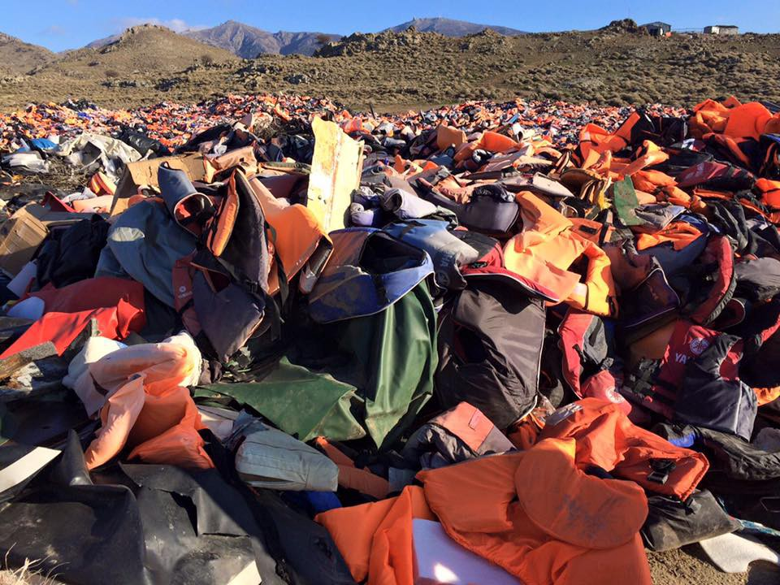

### AYS NEWS DIGEST 16\.02\.17 — Enforcement of Dublin Regulations for Greece: What does this mean?

#### Feature

On December 8, 2016, the EU Commission recommended that Greece begin enforcing the Dublin Regulation by March 15, 2017\. This means that asylum seekers who enter another EU country through Greece can be returned to Greece\. But the system is not as simple as it may seem:
- The recommendation only applies to refugees who enter Greece illegally after the deadline of March 15, 2017 or receive international protection in Greece after that date\. Whoever is currently in Greece or arrives before this deadline will not be affected by the Commission’s recommendation\. This measure can be seen as an extension or the consequence to the \(failing\) EU\-Turkey deal\. Refugees who arrived in Greece after March 20, 2016 were supposed to be sent back to Turkey\. In fact, this largely has not happened, because courts have ruled in several cases that Turkey is not a safe country for refugees\. Greek authorities have threatened to transfer refugees from the islands to the mainland, which would mean that they could continue to Northern Europe on their own without waiting for finals decisions on their asylum applications\. In order to discourage people from doing this, EU Member States now want to come back to Dublin Regulations\.
- If member states adopt the Commission’s recommendations, they will not send back asylum seekers back to Greece retroactively\.
- It’s a only recommendation\. “It is a non\-binding Recommendation from the Commission to the Member States,” the Commission states [in its FAQs](http://europa.eu/rapid/press-release_MEMO-16-4253_en.htm) \. This means that the governments of each Member State must decide independently whether or not to follow the Dublin Regulations again\.
- Any return to Dublin policies will happen “under the control of the courts, which may make preliminary references to the European Court of Justice on the interpretation of the Dublin Regulation\.” Even if national authorities want to start sending back refugees to Greece, individuals can sue to block being transferred\.
- The Dublin Regulation to send back refugees was suspended in 2011 by two judgments of the European Court of Human Rights \(ECHR\) and the Court of Justice of the European Union \(CJEU\) \. The recommendation of the Commission can be seen as attempt to see if the courts still see systemic deficiencies in the Greek asylum system\. Several humanitarian Organisations, including AYS, do\. Inappropriate shelters, insufficient access to education and the slow efforts in relocations and family reunions from Greece are only some of the most important problems\.
- No EU Member State has thus far announced their intentions to adopt the Commission’s recommendation\. There have only been [media reports](https://www.mnnonline.org/news/germany-start-returning-newly-arrived-refugees-greece/) of individual countries’ plans to do so\.
- Even if Member States return to applying the Dublin Regulations to Greece, it is a bureaucratic process\. They cannot send back asylum seekers immediately\. The Dublin Regulation means that the country has to request that the authorities of the first EU Member State the asylum seeker had entered \(in this case Greece\) take the refugees back and work on their asylum applications\. The authorities can deny the request, and if the return does not happen within six months, it is no longer valid\. If the asylum seeker is not sent back to Greece within this time frame, the host country that requested the return is responsible for the asylum request\. \(These policies are laid out [here](http://www.citizensinformation.ie/en/moving_country/asylum_seekers_and_refugees/the_asylum_process_in_ireland/dublin_convention.html) \. \)
- If a refugee is sent back to Greece from another country, Greece would be responsible for the asylum application\. Once there, the claimant can also ask to be reunited with their family\.
- Vulnerable applicants, including unaccompanied minors, should not be transferred to Greece at all for the time being\.

#### Greece

Vaccinations are brought up to speed\. Photo Credit: Lsvos Solidarity — Pipka
### Greek authorities expedite asylum process for Pakistani refugees

Pakistani refugees will now have a division of the Regional Asylum Office in Athens working on their behalf\. The unit is expected to process 30–40 applications per week\. This will improve the chance to get through on Skype and make an appointment with the Asylum Service\. In the past, the waiting time for a Pakistani refugee to get an appointment was around one year\. Now, according to the Asylum Service, it might only be a few days\. The times to call Skype for Urdu\-speaking refugees are:
Monday, 15:00–16:00
Tuesday, 14:00–15:00
Wednesday, 10:00–12:00
The Skype ID to call is asylum\.service\.urdu
### Volunteers asked to ask refugees to fill out anonymous survey detailing mistreatment

Refugees who have been abused or mistreated at any point on their journey through Turkey and Greece are encouraged to fill out a survey documenting their experiences\. The questionnaires are completely anonymous and come in [English](https://docs.google.com/forms/d/e/1FAIpQLSelevnUuhF7_nFnoNLZjAnKGd0RfvOhCirSUTF7llcKmHEHDw/viewform) and [Arabic](https://docs.google.com/forms/d/e/1FAIpQLSdUpZnQ8nuQuqy_LBGBNVZUyFz0dSHwJcy3jX5GB7hkPRX4tQ/viewform) versions\.
### Asylum seekers registered in June\-July may need to confirm the date/location of their appointment

Some appointments made in June and July have been rescheduled\. Refugees should confirm the date and location of their appointment by going to [this site](https://search.rescueapp.org/#) and entering their registration number\.
### Numbers

109 relocations have taken place between February 13 and 15, bringing the total up to 8,983\. Of the 109, 26 were sent to Belgium, 40 to Ireland, and 43 to the Netherlands\.

There have been 57 registrations on Lesvos today\.
### Over 70 jobs available for all kinds of positions

Generation 2\.0, a nonprofit organization devoted to protecting the rights of socially vulnerable groups, has listed a large number of open positions in various refugee and community support fields\. Check [their website](http://g2red.org/job-adverts-16022017/) for more details\.

#### Serbia
### Volunteer group Fresh Response seeks men’s pants\!

[The group](https://www.facebook.com/freshresponseserbia/?fref=ts) has announced that they are in need of donations\. Size 30–33 pants are most in demand, and the refugees have voiced a preference for jeans\.
#### Hungary

#### France
### French police prevent volunteers from distributing food, issue fines

Police have fined the group “solidarité migrants Wilson” and prevented them from distributing food his morning\. Volunteers were forced to vacate the area around the center and distribute tea and food elsewhere, making it impossible to give breakfast to those waiting in the queue for the “humanitarian” center\. They also received two parking tickets of €135 each, despite parking in a place where they normally go “in accordance with police” according to volunteers\. Police and the city invoke security and hygiene reasons for asking volunteers to distribute elsewhere\. Additional info found [here](http://tempsreel.nouvelobs.com/societe/20170216.OBS5413/paris-des-benevoles-empeches-de-nourrir-des-migrants-pres-du-centre-de-la-chapelle.html) \.

Police have announced that the distribution of aid outside or around official camps will be forbidden\. Those who violate the ban will be fined\.

_Converted [Medium Post](https://areyousyrious.medium.com/ays-news-digest-16-02-17-enforcement-of-dublin-regulations-for-greece-what-does-this-mean-b67d9282a929) by [ZMediumToMarkdown](https://github.com/ZhgChgLi/ZMediumToMarkdown)._
