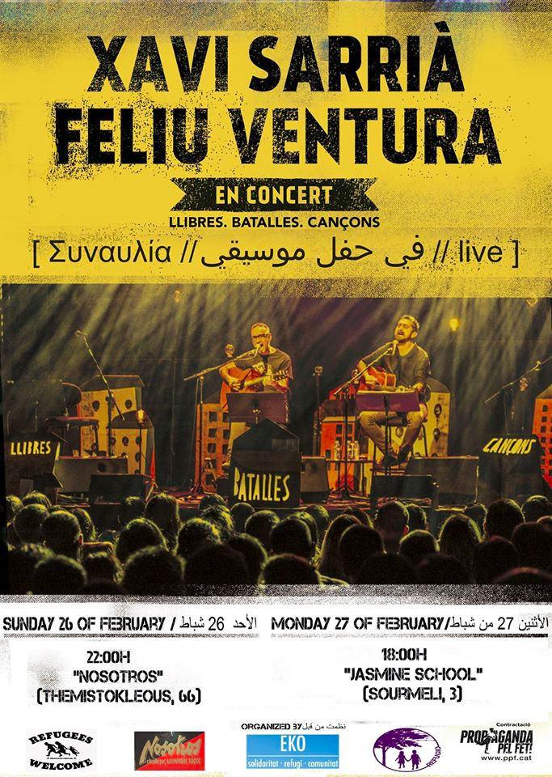
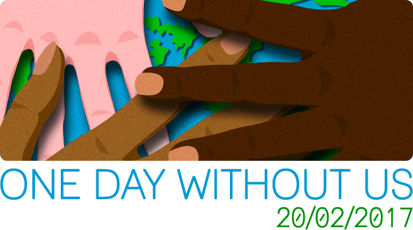
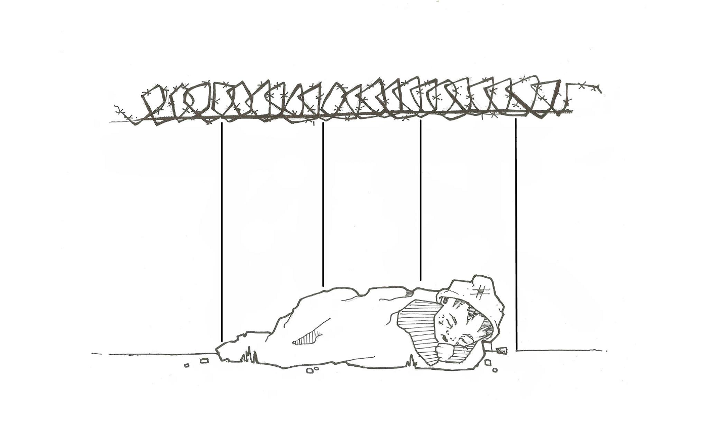
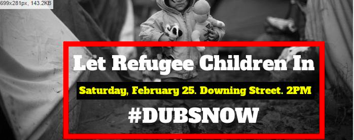
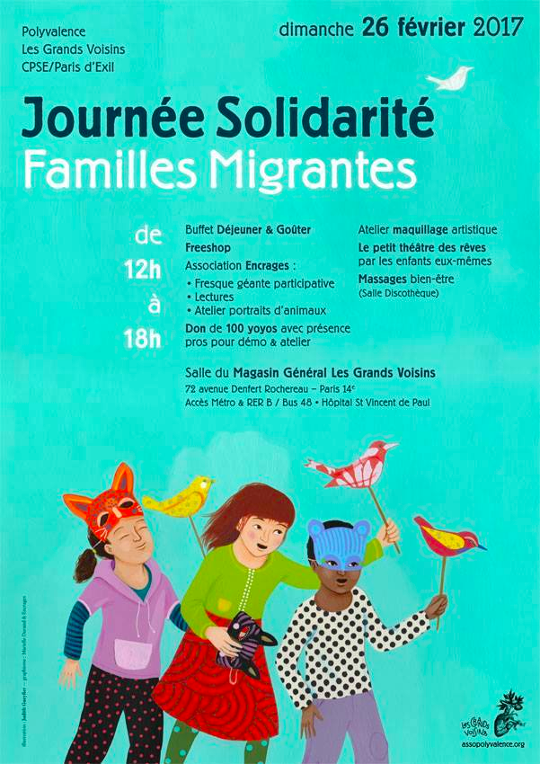
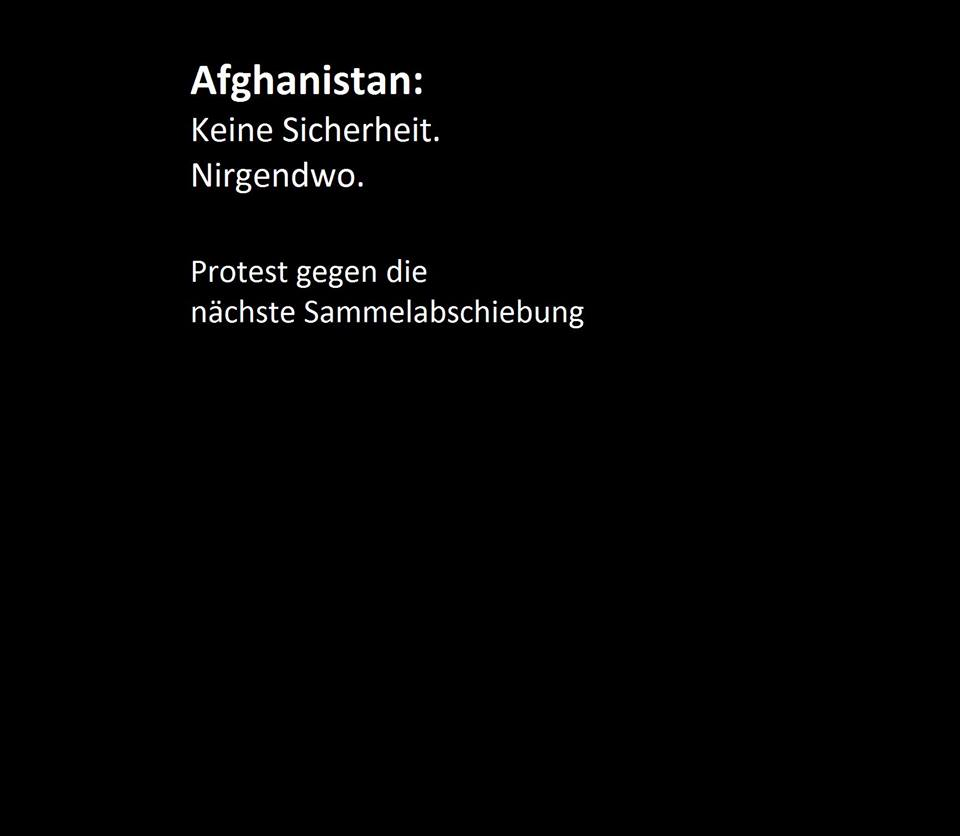

### This Week’s Solidarity Events in Europe
#### 20th to 27th of February — Calendar of protests, fundraisers and other events in solidarity with refugees
### Greece

Eko Project is inviting people to come to [concerts by Catalan singers Feliu Ventura i Xavi Sarriàin](http://ppf.cat/index.php/cat/14-artistes/feliu-ventura/476-feliu-ventura-i-xavi-sarria-viatgen-a-grecia-per-tocar-per-les-persones-refugiades) in Athens on Sunday and Monday:
- The first on **Sunday 26th at 10PM** at _“Nosotros”, Themistokleous 66_
- The second on **Monday 27th at 6PM** at _Jasmine School, Sourmeli 3_

### UK

**Monday 20th** — [One day without us](http://www.1daywithoutus.org/feb20/) : National day of action on 20th February 2017, in support of EU nationals and non EU immigrants living, working, and studying in this country\.

**Wednesday 22nd from 7PM** — [Solidarity Sleep\-Out for Unaccompanied Child Refugees](https://www.facebook.com/events/244488102676968/) : Protest and action to raise awareness of unaccompanied child refugees who are sleeping rough in France\. Please bring your sleeping bag, pillow, snacks and righteous anger\. More information to follow on catering and evening speakers\.

_Address: Downing Street, London_

**Wednesday 22th at 7:15PM — 10PM** — [The CalAid Story](https://www.facebook.com/events/1830428933845869/) : CalAid are very excited to have James Fisher, one of CalAid’s founders, and Keir Starmer, MP for Holborn and St Pancras, speaking on the urgent and immediate refugee crisis, and the crucial role grassroots groups have to play — £20 per ticket\.

_Address: The Oasis Centre, 1 Kennington Road, London, SE1 7QP_

Help4Refugee Children

**Saturday 25th at 2PM — 5PM** — [Reinstate the Lord Dubs Amendment: Let The Children In\!](https://www.facebook.com/events/1824886271109193/) Hours before the final vote on the triggering of Article 50, the government quietly announced it would allow just 350 unaccompanied children to come to the UK, thousands short of the figure suggested by government sources last year\. This is a protest demanding that the “Dubs Amendment is Enacted Now”\.

_Address: Downing Street, London_
### France

](assets/683e9088675f/1*X0DeG65-HZCQwiGqyEcIlg.png)

Photo by [Dessins Sans Papiers](https://www.facebook.com/groups/dessinssanspapiers)

**15th to 28th at 10AM — 7PM** — [Sale of the book “Dessins sans Papiers”](https://www.facebook.com/events/1437059872993714/) : The book contains 200 drawings made by refugees in reception centres and the streets of Paris since this summer\. 10 euros per book will be given to the TIMMY, a group supporting unaccompanied minors in Paris\.

_Address: 43 rue Myrha, Paris 75018_

**Friday 24th from 6PM to 9PM**

A national meeting of migrants, regardless of their status, is going to be held on 18th of March at the Ecoole Normale Supérieure, 45 rue d’Ulm\. The aim is to establish a unified national political basis to fight the isolation and division created by government policies\. An initial meeting will be held this Friday to lay out the mayor topics to be discussed at the national meeting in March\.

_Address: Bourse du travail, 3 Rue du Château d’Eau, 75010 Paris_

Polyvalence

**Sunday 26th from 12PM to 6PM** — Day of solidarity with refugee families: Contact assopolyvalence@gmail\.com to volunteer to prepare the buffet, organise workshops or games and manage the Free Shop\. Donations of hygiene products and non\-perishable food are welcomed\.

_Address: Les Grands Voisins, 72 avenue Denfert Rochereau 74014_
### Germany

**Wednesday 20th** — [Protests against deportations in Baden\-Würrtemberg](http://fluechtlingsrat-bw.de/informationen-ansicht/protestkundgebungen-gegen-abschiebungen-am-mittwoch.html) : The Baden\-Württemberg Refugee Council calls for protests against deportations to Afghanistan, Serbia and FYROM that are planned the same day\.

_Address: Protests will take place in Biberach, Stuttgart, Mannheim, Karlsruhe, Gammertingen, Stadtbrunnen and Tübingen\._
### Serbia

**24th of February to 4th of March** — [Documentary photography exhibition about life of refugees in Serbia and call for donations](https://www.facebook.com/events/1144112645711099/) : Lazara Marinkovic is a Belgrade based journalist, author and photo\-reporter\. Her articles and photo reports are published in various media outlets, such as VICE, Al Jazeera, Pescanik, NIN, Bturn magazine and others\. Street gallery’s “People at the gates” is her first solo exhibition of documentary photographs created while reporting the refugee crisis in Serbia from August 2015 to date\. All photos are for sale and all proceedings will be donated to humanitarian organizations helping the most vulnerable refugees in Belgrade\. On the opening day, you can bring warm clothes, jackets, pants, socks, shoes, gloves, hats, scarves and other items that will be donated as well\.

_Address_ : _Ulična galerija, Čavketov pasaž Belgrade 11000_

_We hope to provide a weekly list of solidarity events all over Europe\. If you would like us to add one of your events, do not hesitate to contact us though our [Facebook page](https://www.facebook.com/areyousyrious/) \._

_Converted [Medium Post](https://areyousyrious.medium.com/this-weeks-solidarity-events-in-europe-683e9088675f) by [ZMediumToMarkdown](https://github.com/ZhgChgLi/ZMediumToMarkdown)._
