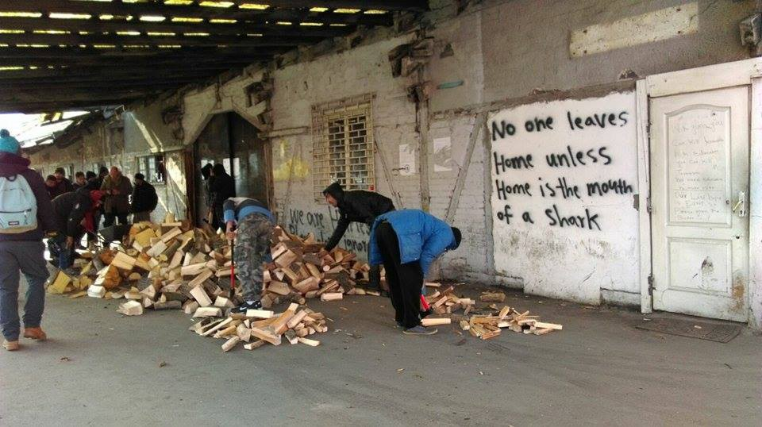
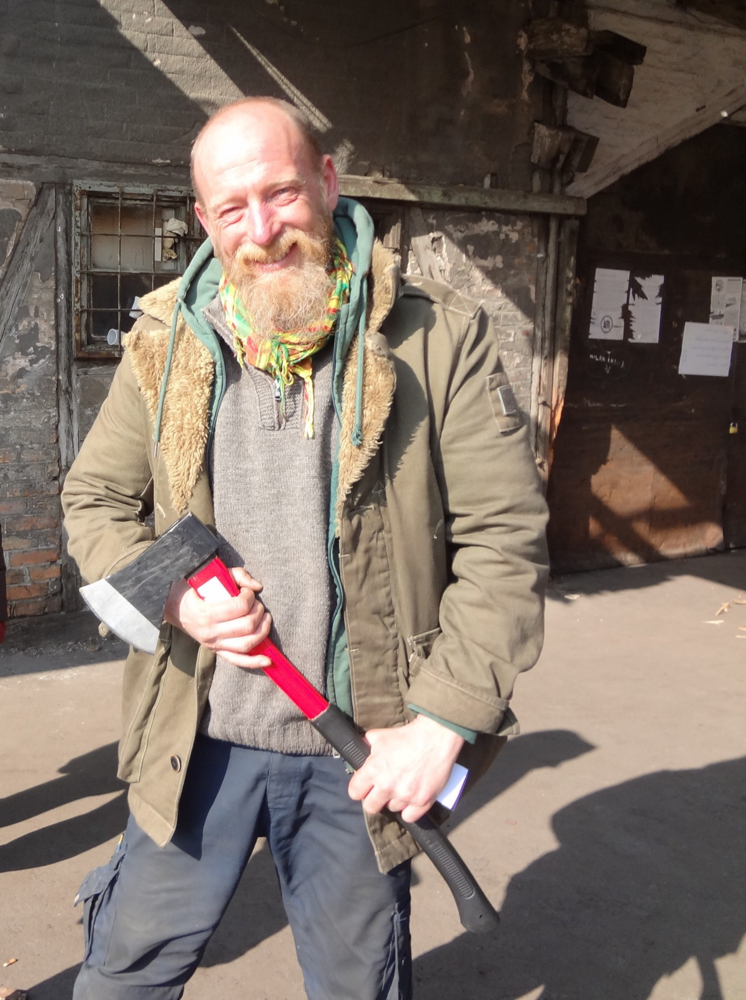
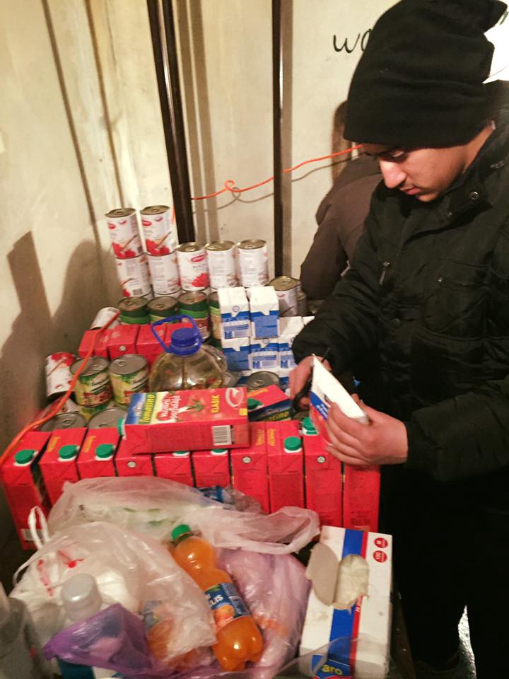
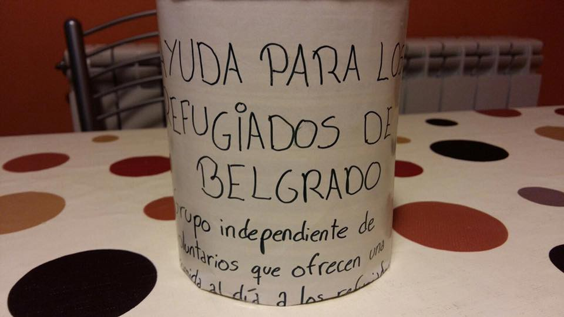
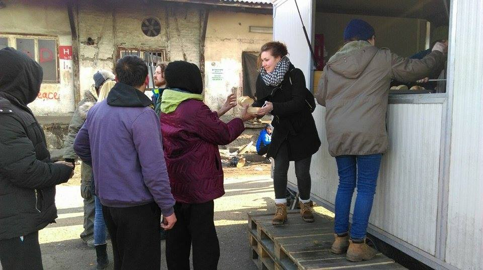

### AYS Daily Digest 20/02: Discrimination, expulsion and denial of rights — is this the best we can do?
#### Right wing party members protested against refugee children in Oreokastro \| Bulgaria — a Syrian family granted humanitarian status, but told to leave \| Initiatives strive to help desperate people stuck in Serbia \| Hungary outraged as Austria starts “playing the Dublin card” \| Hundreds manage to enter Spain in Ceuta \| This week’s calendar of events in solidarity with refugees

 
Photography by David Ramos](assets/267df132530b/1*g4BY6oq0_ihklWboyDGanA.jpeg)

Refugees were picked up off the Libyan coast north of Sabratha by the rescue boat Golfo Azzurro of Proactiva Open Arms, on February 17 — [Art Against](https://www.facebook.com/artagainstproject/) 
Photography by David Ramos
#### GREECE
#### Registrations

43 people were officially registered on the Aegean islands on the morning of Monday, February 20\.

 \.](assets/267df132530b/1*0om0LMnymtmgdVdHtj0lyA.jpeg)

Thanks to Translators without Borders, this weekly newsletter is available in Arabic, English, Farsi and Greek\. Please find all versions at [this link](https://drive.google.com/drive/folders/0B-_rJ_0o5IZIVnJpSUctNS1WOWc) \.
### Reminder: the cash card system \(of control\)

Unaccompanied refugee minors are among those still not receiving financial aid through the system of the cash cards\. An estimated 2,000 people living in squats are affected by the Greek government’s decision not to provide cash cards to those refugees living in self\-organized communities, mostly in the city of Athens\.

These facts support [the interpretation](https://medium.com/@AreYouSyrious/ays-digest-13-2-stonewalled-in-paris-4dd9362f1430#.95j5eumja) that these are tools to exert leverage over people, punishing those who have gone from the islands to the mainland, for whatever reason, and those who live in self\-organized communities\. The reason for unaccompanied minors to be excluded from the cash card system is still unknown to us\. If anyone has any knowledge of a legitimate reason for these restrictions, we would be happy to receive more information \(areyousyrious@gmail\.com\) \.

The previously published information on the cash card program is available [here](http://blog.refugee.info/you-asked-cash-assistance-in-greece/) \.
### Athens
#### New women’s house opened in Exarchia

Recently opened accommodation for women and children provides free, secure accommodation\. There are also cooking and laundry facilities and social spaces\. The [Jafra R2R](https://www.facebook.com/JafraGreeceR2R/?ref=page_internal) team plans to approach each of the women individually so as to assist them in accessing the appropriate services\.

 ‎](assets/267df132530b/1*ypjG81j2bKj-wMksGOQYKA.jpeg)

Photos by: J [afra Team R2R in Greece — فريق جفرا في اليونان](https://www.facebook.com/JafraGreeceR2R/?ref=page_internal) ‎

[**Edusquats**](https://www.facebook.com/Edusquats/?ref=page_internal&fref=nf) kindly requests the following donations:
Pens for whiteboards
Whiteboards
Pens
Story books for children
Dictionaries \(all languages\)
Teaching Resources

They have an account for photocopies at CopyCat, Stournari 20, Exarcheia, where you can support them\. If you come to the school with materials from the list, please leave it at the housing squat for refugees and immigrants at Notara 26 \(Navarchou Notara 26 Exarchia\) \.

](assets/267df132530b/1*kqo1e9yVQZJ2Eyvp-iuLkw.jpeg)

Illustration by: Mahnaz Yazdani via [Art Against](https://www.facebook.com/artagainstproject/)
### Local men threatening children who fled war?\!

A violent confrontation happened earlier today in Oreokastro\. The incident took place in front of the local 1st Primary School, where recently refugee children started attending classes with local Greek children, as in other places\.

A group of right\-wing men, calling themselves “Patriotic Union”, gathered at the school in order to protest against refugee children attending\. The group shouted and chanted offensive content\. Shortly afterwards, according to the [media](http://www.thepressroom.gr/ellada/agrio-xylo-exo-apo-sholeio-sto-oraiokastro-htypoyn) , another group appeared around the school and the anti\-fascist group and confronted the protesters\. Some people were injured in the skirmish and were escorted to the local hospital by police\.

](assets/267df132530b/1*FaehyURopX122o_qOmMh-g.jpeg)

Neonazis of a so called “Patriotic Union” attacked an elementary school with refugee children in Oreokastro today\.
Reports say they were yelling “Death to immigrants” and “Say hello to Pavlos Fyssas \(antifascist rapper, murdered by Golden Dawn members in 2013\)” — by: [NoBorders](https://www.facebook.com/nobordersnetwork/?ref=page_internal&hc_ref=PAGES_TIMELINE)
#### BULGARIA
### Harsh treatment for a family from destroyed Aleppo

The mayor of Elin Pelin, a town not far from the Bulgarian capital of Sofia, has told a Syrian family of three to leave the municipality despite the fact that they have been granted humanitarian status\. Fakhim and his wife Fatima, together with their youngest son, a six year\-old boy, left Aleppo after their house was destroyed in the war 5 years back\.

Although Bulgarian municipalities [receive funding](http://www.novinite.com/articles/175838/Bulgaria+Adopts+Norms+for+Integration+Agreements+with+Foreign+Nationals) so as to be able to properly accommodate refugees who have been granted protection, the mayor of Elin Pelin insists that “the family should find another place to settle as people from every village and town of the municipality are against having refugees accommodated there\.” See full article [here](http://www.novinite.com/articles/178861/Mayor+of+Bulgarian+Town+Seeks+to+Expel+Syrian+Family) \.

> “The municipality’s plans amount to a violation of international conventions as granting humanitarian status means a person is legally residing in a country” — A lawyer and member of the organization of [Syrians in Bulgaria](http://www.novinite.com/articles/178311/Depleted%2C+Divided+and+Dispirited+-+The+%3Cb%3ESyrians%3C/b%3E+of+Bulgaria) 

243 nationals from 11 states were denied international protection in Bulgaria in January alone\. Afghans were again the biggest group to file applications, with [188 requests in January](http://www.novinite.com/articles/178903/Migrants+Seeking+Protection+in+Bulgaria+Dwindled+by+Half+in+January) \. The second\-largest group was Syrians \(88 applications\) and Iraq \(54\), followed by Pakistan \(54\) and Bangladesh \(22\) \.

The severe difficulties that refugees and asylum seekers are facing in Bulgaria have been confirmed and documented in [AIDA](http://www.asylumineurope.org/) ’s [report](http://www.asylumineurope.org/sites/default/files/report-download/aida_bg_2016update.pdf) on the country, which is based on data from the past year\. The State Agency for Refugees resumed their previous practice, dating from November 2016, of detaining asylum seekers at the Ministry of Interior after fingerprinting and registering them, in some cases conducting interviews, and finally issuing asylum registration cards\. See full report [here](http://www.epim.info/wp-content/uploads/2016/09/Detention_Report_CLA_2016_EN_final.pdf) \. In some cases the personal registration process was delayed by several months for no clear legal reason\. The report points out that such a practice is in clear violation of [Bulgarian law](http://detainedinbg.com/blog/2017/02/17/the-2016-asylum-information-database-report-finds-that-detention-of-asylum-seekers-is-systematically-applied-in-bulgaria/#_ftnref2) \.
### Legal help wanted — vacancies at “Voice in Bulgaria”

[Center for Legal Aid “Voice in Bulgaria”](https://www.facebook.com/voiceinbulgaria/?ref=page_internal) , in partnership with Bulgarian Lawyers for Human Rights \(BLHR, or [Фондация “Български адвокати за правата на човека”](https://www.facebook.com/blhr.org/) \) is currently implementing the project, “Protecting migrants with precarious status: decreasing the use of detention and applying community\-based alternatives\.”

Current students and/or recent graduates and Masters degree holders in Law, Social Work, Psychology, Sociology, Migration Studies, Middle Eastern Studies and other related areas can apply to help refugees and asylum seekers in Bulgaria\. \(Current students and recent graduates are invited to apply for Trainee positions; Masters degree students may apply for Case Manager Assistant jobs\. \) Assistance is needed in the following areas: finding housing, accessing psychological, medical, legal and other help, finding employment, getting involved in the community, completing administrative procedures, accompanying refugees and asylum seekers to appointments when appropriate, assisting them in interaction with relevant institutions in the community, etc\.

Those eligible and interested should prepare and send their CVs and cover letters by Sunday, 5 pm to hrlawyer@blhr\.org or voiceinbulgaria@gmail\.com\. More information is available [here](https://www.facebook.com/voiceinbulgaria/) \.
#### SERBIA
### Belgrade

The situation in [Belgrade warehouses](https://lookaside.fbsbx.com/file/belgrade_map_version_1.pdf?token=AWxsvEzXeoBJgI132FPEpPbD09ZL56Aj6JykuUqjN7_nU1_shCZkwq7XP2VQv3MVLHszKRu04QaC0r3BY-ttmFQ6axyxsgYHQo_AZC3E7TB7_MSo7Vn2Q4RI3ergp5qXvoMY0Of1kj_9qQuZAbhWAQI2) is slowly improving due to warmer temperatures and independent teams, such as [SoulWelders](https://www.facebook.com/SoulWelders/?fref=ts) , who have provided much needed firewood and stoves\. Before their arrival, as many as 1,000 people were sleeping rough in abandoned warehouses near the Belgrade train station and using old wood from train tracks, covered with toxic chemicals, to heat up their makeshift homes\. This desperate practice exposed them to many health hazards\. \(The number of people affected fluctuates, depending on people’s movement towards Croatia and Hungary\. \) In warehouses, where the sanitary situation is still far from acceptable, the toxic smell of burnt tar and plastic has now been replaced by the comforting smell of real firewood crackling in proper stoves and heaters\. A simple but effective system of distribution has been put in place, so that everyone can get proper firewood\.

“Dunkirk Pirate,“ Dylan from SoulWelders, distributing firewood \(Photo: AYS\)

In addition to the AYS kitchen trailer, operated by [Hot Food Idomeni](https://www.facebook.com/Hotfoodidomeni/?fref=ts) every day around lunchtime, [NoName Kitchen](https://www.facebook.com/NoNameKitchenBelgrade/?fref=ts) is providing around 600 dinners each evening\. The atmosphere in the kitchen, which is located inside one of the warehouses, is wonderful, and provides much\-needed communal feeling\.

](assets/267df132530b/1*L-5Rv-bJEpN_mgsWNdDJ4g.jpeg)

Photos: [No Name Kitchen](https://www.facebook.com/NoNameKitchenBelgrade/)

Further down the train tracks, MSF has three heated tents where minors and ill people can rest during the night\. The distribution of clothes and other necessities on site still seems to be problematic\. Since Komesariat has discouraged local groups and NGOs from providing direct help in the warehouses, most of the work on site is done by international teams\.

Lunch distribution by the Hot Food Idomeni team with a little support from AYS in the form of a kitchen trailer\. \(Photo: AYS\)

Local groups such as [Info Park](https://www.facebook.com/infoparkserbia/?fref=ts) and [Refugees Foundation](https://www.facebook.com/izbegliceusrbiji/?fref=ts) have adjusted their activities to avoid pressure from the state, but are still contributing significantly\. [Miksaliste](https://www.facebook.com/RefugeeAidMiksaliste/?hc_ref=SEARCH&fref=nf) is located few minutes from the warehouses and offers electrical outlets for charging mobile phones and other infrastructural benefits\.

](assets/267df132530b/1*kqVxDtjMpIZvsuAnq8WIqQ.jpeg)

Photo: [Refugee Aid Miksalište](https://www.facebook.com/RefugeeAidMiksaliste/)

Many refugees are still complaining about police treatment on the Croatian and Hungarian borders, where they have been exposed to police violence and unjustified push\-backs to Serbia\. AYS and the Centre for Peace Studies have collected more testimonies to support our case against the Croatian police, which relates to violent and unlawful push\-backs from Croatia\.

We’ll publish a new report about this issue soon\.
#### AUSTRIA / HUNGARY
### Hungary accuses Austria of illegal push backs

Austria has reportedly returned to Hungary 58 refugees who had previously crossed the Hungarian\-Austrian border and entered Austria\. \(See details [here](http://diepresse.com/home/innenpolitik/5172615/Ungarn-wirft-Oesterreich-illegale-Rueckschiebung-von-Fluechtlingen-vor?from=rss&utm_source=dlvr.it&utm_medium=twitter&utm_campaign=diepressecom) \. \) A similar case happened earlier this month with a group of 8 people from Syria and Iraq\.

Such procedures can only be carried out in consultation with the Hungarian authorities, the head of the Hungarian border police department claims\. The latest incident happened at the Hegyeshalom crossing this Sunday\. From the point of view of the Austrian government, everything is perfectly legal and is being handled according to the Dublin III regulation\.

> Although Hungary has highly restrictive \(against\) refugee politics — especially on the border with Serbia, where police violence and mistreatment of people is documented daily — looking at the Dublin regulations from this side of the fence does not come easy\. 

As a reminder, the push backs that Hungary employs don’t only happen in close proximity to Hungary’s border with Serbia \(that is to say, in the oft mentioned 8 kilometers\) \. As the [latest information](https://medium.com/@AreYouSyrious/ays-daily-digest-19-02-2017-a-glimpse-hope-for-at-some-minors-stuck-in-france-e0b255a251a9#.a5vnwajvj) to reach us has shown, some people, who have previously been beaten up and had their phones smashed, had been walking through Hungary for 2 days before being caught by the police\. Some of them came back to the Horgoš border area severely bruised\.
#### FRANCE
### SolidariTea

> We’re starting an info/tea van in Paris because we think a hot drink & legal support can help people get through one of the worst experiences a person can go through\. In Paris people are often forced to sleep on the streets, moving constantly in order to avoid police hostility, all while trying to navigate their way through complicated, drawn out legal processes in a foreign language\.
 

> We can’t fix the situation but we can provide hot drinks, help people make informed decisions about their lives & direct them to available aid\. We’re starting this tea van from scratch so any help & contributions are much appreciated\. 

Whether you are an expert in insuring cars in France, have a laser printer/tea urn/van to spare, know someone who works at a paper supply company or can give a contribution to support this initiative, contact [Solidarithé](https://www.facebook.com/solidarithe/?ref=page_internal) \.
#### SPAIN
### Another large group from Africa pushes through in Ceuta

After about 500 migrants breached the fence between Morocco and the Spanish enclave of Ceuta on Friday, 359 people from different African countries broke through the border fence earlier today\. These people now have to wait to be transferred to the mainland to have their papers processed\. Most are likely going to be returned to Morocco or their country of origin, Reuters [claims](http://www.reuters.com/article/us-europe-migrants-spain-idUSKBN15Z0PL) \.

 \)](assets/267df132530b/1*L19ZlQca-n0KXS9lYTCcNQ.jpeg)

A film that tells the story of the realities of the refugees in Greece, filmed by a member of the rescue team Salvamento Maritimo Humanitaio \(active on Chios\), will be shown at various locations in Spain\. Screenings start this Wednesday, February 22, in Oviedo\. \(by [Salvamento Marítimo Humanitario](https://www.facebook.com/smhumanitario/) \)
### This Week’s Solidarity Events in Europe

Every week we will be gathering information about different events all around the globe that you can engage and take part in\. Let us know if you are organizing or know of an important event of this type and we will include it in the weekly calendar\.

Here is the [calendar](https://medium.com/@AreYouSyrious/this-weeks-solidarity-events-in-europe-683e9088675f#.6vgkufg7o) of protests, fundraisers and other events in solidarity with refugees for this week, February 20–27\.

_Converted [Medium Post](https://areyousyrious.medium.com/ays-daily-digest-20-02-discrimination-expulsion-and-denial-of-rights-is-this-the-best-we-can-do-267df132530b) by [ZMediumToMarkdown](https://github.com/ZhgChgLi/ZMediumToMarkdown)._
