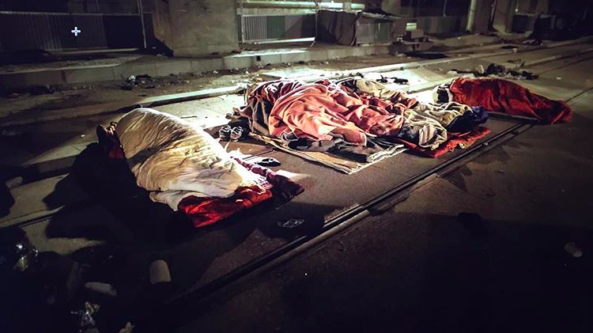
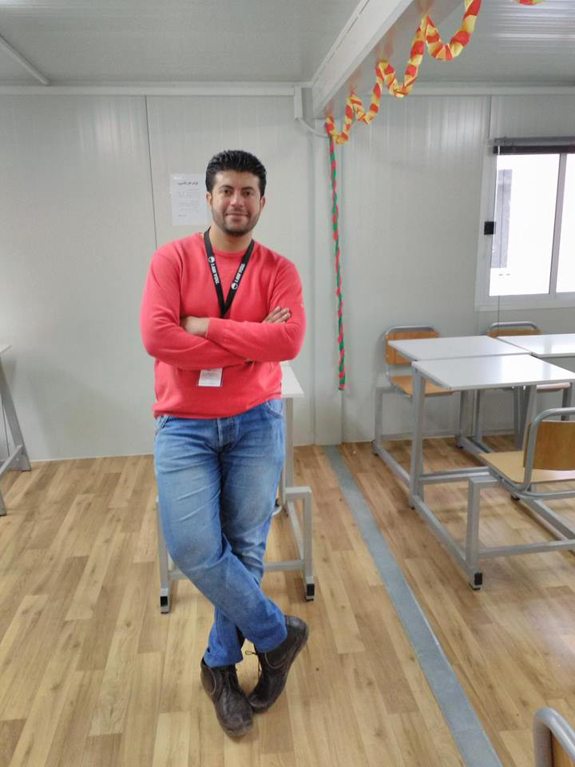
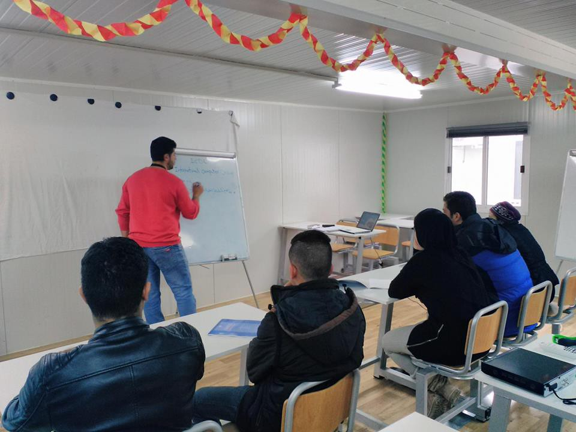
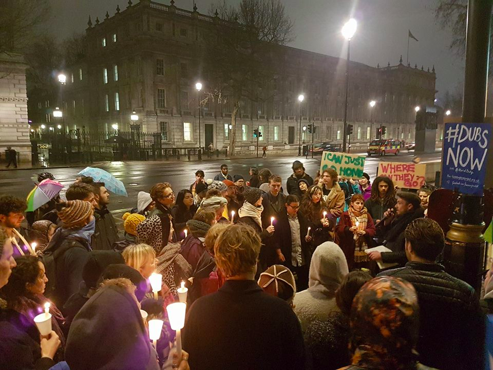

### AYS Digest 23/02 — Unaccompanied children’s message to the UK government

_Report on integration in Greece by News That Moves\. Police violence at the Hungarian border\. 2,500 refugees rescued off the coast of Libya in three days\._

Photo by Charlotte Maxwell
#### Greece
### 10,000 approved asylum claims in Greece

[Ekathimerini](http://www.ekathimerini.com/216429/article/ekathimerini/news/greece-okays-asylum-requests-of-10000-refugees) reports at least 10,000 refugees, including around 2,000 minors, are expected to remain in Greece over the coming three years as their asylum applications have been approved\.

The approved asylum claims account for about a sixth of more than 60,000 migrants who are currently stranded in Greece\. Meanwhile, only around 9,000 refugees have been relocated throughout the rest of Europe\.
### Report on integration issues by News That Moves

News That Moves has produced a [report on integration issues](https://newsthatmoves.org/en/integration-in-greece-rights-of-refugees/) for refugees living in Greece\. Refugees expresss their wish to integrate in Greek society but explained the hurdles they face, including the language barrier and the lack of access to public services\. A Syrian woman in Athens for example explains _“the main problem is the language\. They should help our children to be accepted in Greek public schools by helping them with learning Greek”\._

People also mention the need for stability and their desire to find jobs\. One woman tells In the Loop _“they told us that even Greeks can’t find a job so there is no chance for us\. If there were work here, we would stay \(…\) How will you feel integrated if you don’t have a job?”_

We highly recommend you read the whole report, including ideas provided by refugees on how to accelerate integration, like helping them find work or help them contribute to camp life\. Refugees have skills to offer and want to be productive — as one person says “ _not doing anything is killing us slowly”\._

I AM YOU for example tells the story of Ahmed Taha, in the Ritsona camp, who has been able to use his skills to help others\. He holds a degree in Information Technology Engineering and has started giving computer classes at the I AM YOU school — “ _my goal is to educate students on how to use the Computer Networks, Windows, Microsoft Office, Word, Power Point, Access, Internet and other concepts of the Internet\. At the end of the course the students will have the chance to apply for an ICDL Certificate\._ ”

_Photo by I AM YOU_
### “With the People”

Schwizerchrüz has put up a detailed update of its new projects on Lesvos, based on the principle of doing things “ _with_ and not _for_ the people”\. For example, they have worked with people living in the squats to clean up around 60 tons of garbage and helped set up a bakery, where Pakistani refugees now bake 300 pita breads per day\. Ingredients were also provided so that refugees can cook around 300 nutritious meals\. Finally, the refugees’ expertise and skills are also being put to use, as a school will be established for the squats with the help of an Afghan English teacher\.
### Registrations

145 people were registered in Chios until 7:30AM this morning\. An additional twelve were registered in Kos and eight on “other” islands\. This is the second time in February that more than 100 people were registered on the islands — 142 total were registered on the 4th of February including 105 on Lesvos\.
#### France/UK
### Unaccompanied Children’s Message to the Government

As the British House of Commons debated the Dubs Amendment, unaccompanied children in France urged the British government to let them join their families in the UK\.

Charlotte Maxwell, the volunteer who produced the video, told the [Independent](http://www.independent.co.uk/news/world/europe/child-refugees-theresa-may-plea-dubs-scheme-uk-immigration-let-me-see-brother-a7596056.html) , _“I was working with the minors in Calais during the demolition and they were all promised they would undergo a proper process to seek asylum in the UK and be considered under the Dubs Amendment\._

_They were made that promise\. When it closed I got all these phone calls from minors saying it didn’t make sense because they were in the same situation as many of those who were accepted\. The Government didn’t offer any real reasons to either them or their families in the UK”_ \.

Yesterday night, a sleep\-out was also organised outside Downing Street to remind the government of all the people still sleeping in Northern France and Paris\. Benny Hunter of Help Refugees, told [The Independent](http://www.independent.co.uk/news/uk/home-news/brexit-donald-trump-refugees-out-spotlight-keir-starmer-mp-dubs-debate-orphan-child-amendment-a7595306.html#commentsDiv) _:_ “ _The debate is specifically about kids in Greece and Italy, and we wanted to make sure the voices of children in France are not left out of that conversation \(…\) these are kids who have been ruled out or considered not eligible for the Dubs Amendment, or have had their appeals for family reunification rejected, sometimes on arbitrary grounds\. Most importantly, they need an avenue to appeal that decision”_ \.

A vigil to remember those who have died in calais seeking sanctuary in the UK and to remember the kids who will be sleeping on calais streets tonight\. Photo by Refugee Info Bus

Benny Hunter described a child he has been working with, now homeless in Paris, who was interviewed by the Home Office while living in the “Jungle”, but has since heard nothing about his legal routes to the UK\.

_“I’ve visited his uncle and aunty in Leeds, and they are visibly related\. They are distraught\. They text and phone me regularly\. I helped them write a letter to the Home Office, but we have heard nothing\. It’s very distressing,”_

](assets/6a31a57108e6/1*B5F-TVSHLhxsI_Fp9aTsiA.png)

Photo by [**KE Januszek Photography**](https://www.facebook.com/KEJANUSZEKPHOTOGRAPHY/)

[Another protest will be held on Saturday](https://www.facebook.com/events/1824886271109193/) outside Downing Street calling for the reinstatement of the Dubs Amendment\.
### Hearts of Stone in Paris

On Saturday, stone masons and sculptors will congregate in Paris\. The goal will be to transform the blocks of stones that were installed to prevent refugees from sleeping under a bridge, near the La Chapelle centre\. These stones, which have become the symbol of a city that does not want to welcome refugees, will be transformed into a monument dedicated to those who lost their lives while trying to find refuge in Europe\. Support is welcomed\.
#### Hungary
### Police violence at the border

[MSF](https://twitter.com/MSF_Sea) reports on violent pushbacks by Hungarian police\. One refugee says “ _they made us stand in a line and beat us on our legs with their sticks”_ while another says “ _I was just sitting when the Hungarian police gave me a knee in the face\. They went crazy and start beating us\. Some of them were laughing\!_ ”

](assets/6a31a57108e6/1*cRVl2W-Wa-eE0UfUuVtgvg.png)

Photo by [MSF\_Sea](https://twitter.com/MSF_Sea)

The advocacy group MigSzol says _“the systemic violence at the border to Serbia is still ongoing\. We have started to collect testimonies of the beatings, humiliations, thievery and push\-backs, which we get from volunteer groups in Serbia, on our website\. The testimonies are partially very detailed and — even knowing that the violence exists — they are extremely shocking and alarming\._ 
_We lack words to describe our anger and sadness, read the texts yourself to get an idea about the situation”\._ You can read the testimonies [here](http://www.migszol.com/border-violence) \. People describe how police set dogs on them, hit them and steal their belongings, among many other forms of abuse\.
#### Mediterrenean
### 2,500 refugees rescued off the coast of Libya

[Reuters](http://www.reuters.com/article/us-europe-migrants-italy-idUSKBN1622F3) reports that almost 2,500 refugees were rescued in the past three days, according to the Italian Coast Guard\. Some 1,100 were plucked from nine flimsy vessels off the coast of Libya on Thursday after a total of 1,360 were picked up the two preceding days\.

Since the beginning of the year, there have been more than 10,700 sea arrivals, the Interior Ministry said on Thursday, a third higher than the same period last year\.

Proactiva Open Arms says its crew has had no respite since it entered the rescue zone, as it had to proceed to three rescues with only the support of a distant cargo ship\.

“I prefer to die in the water than in Libya”, one woman has told [MSF](https://twitter.com/MSF_Sea) \. She didn’t plan on going to Europe, but a rubber boat was the only way out of the horrors faced by refugees in Libya\. In Libya itself, [13 refugees suffocated in a shipping container](http://bigstory.ap.org/article/315117e7f03c4806920ad1411019dd97) while being transported over four days between two Libyan towns, according to the Red Crescent\.
#### Germany
### Cabinet approves plan to accelerate deportations

[_Süddeutsche Zeitung_](http://www.sueddeutsche.de/news/politik/migration-koalition-will-mehr-abschiebungen-dpa.urn-newsml-dpa-com-20090101-170222-99-383091) reports the German government has approved a 15\-point plan aimed at speeding up deportation times for failed asylum seekers in the country\. Interior Minister Thomas de Maizière welcomed the plans, saying it is important that the government be able to deport failed migrants and he expected the number of deportations to continue to rise in 2017\. The new regulations make it easier to deport those who have committed a crime, place fresh restrictions on those attempting to conceal their identity, and allow immigration officials to check the mobile phones of migrants on entry into the country\.
#### Switzerland
### Amnesty says Switzerland illegally turns back people at the border

Amnesty International has criticised Switzerland for turning back refugees at the Italian border, saying it acted illegally\. Under Swiss law, migrants who wish to seek asylum in Switzerland must present themselves at the border and request asylum, while those who simply wish to pass through the country can be sent back to the country from which they arrived\. Amnesty International, however, says that the methods used by Swiss border guards “prevented or dissuaded people from entering the country” and prevented people, including minors, from seeking asylum\.

_Converted [Medium Post](https://areyousyrious.medium.com/ays-digest-23-02-6a31a57108e6) by [ZMediumToMarkdown](https://github.com/ZhgChgLi/ZMediumToMarkdown)._
