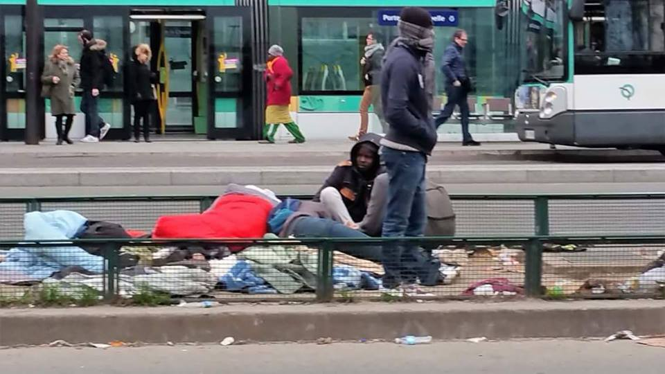
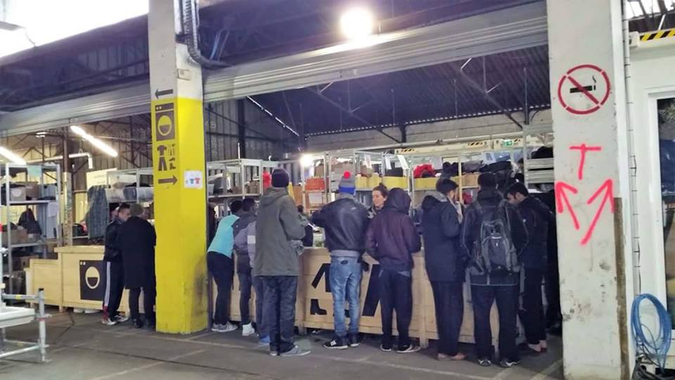
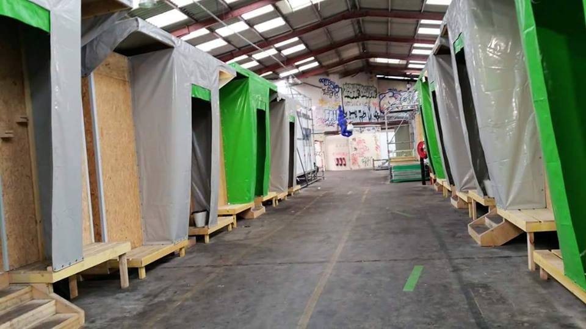
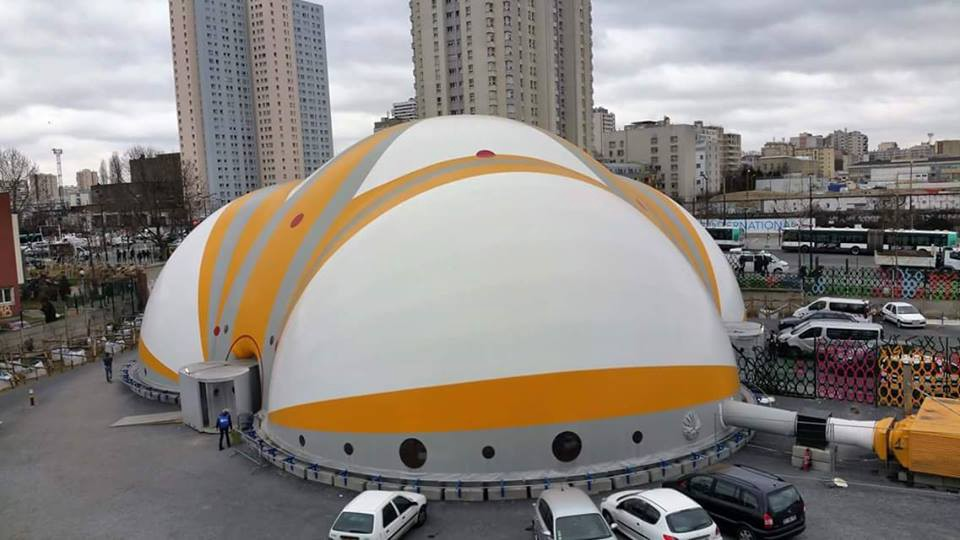
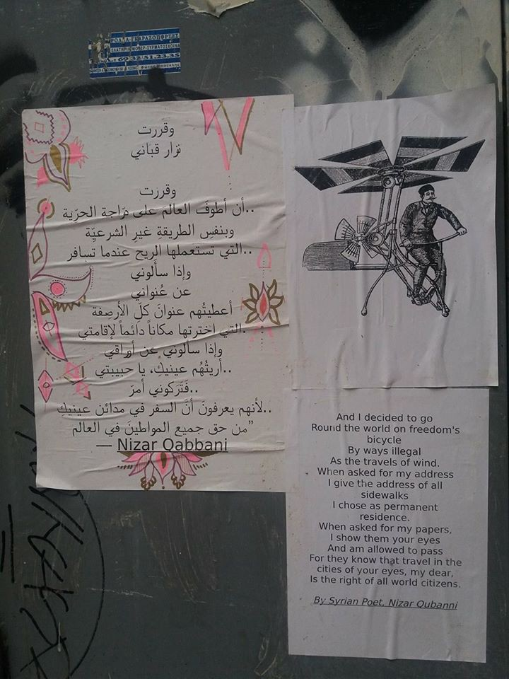

### AYS DAILY DIGEST 27/2/2017 — Push them back

_Volunteers needed in Greece / New plans for deportations / Information guide for volunteers in Serbia / A concerning new draft bill proposed by the Hungarian government / Updates on asylum in Austria / Launch of the Italian “Frontiere Minori” project / Paris report_

![Cold Sunday morning\. For the first time after December, I saw an almost empty warehouse\. The first and the worst one of the three existing\. With no fires and no smoke, and sun only, leaking through the broken windows and roof\. With an army of volunteers walking all around\. Outside, there are mobile toilets, regular firewood, but hell remains hell, after all\. Ruins of one hell of a winter, with the worst possible scenes of human devastation, where human life became the most worthless thing in this world\. 
“People went to the borders” said a sleepy refugee hidden under a blanket, explaining this emptiness… Belgrade, February 2017\. ; photo/text by Igor Čoko [www\.igorcoko\.net](https://l.facebook.com/l.php?u=http%3A%2F%2Fwww.igorcoko.net%2F&h=ATPK933-5ex0bg3sl6phZu9SdniBUek0zuFeAiSJahwev7daXYm2lwZ3bt662pW4vFPUv57HSlt1075zt5PT8l56mOLOStwDcIMEcYvGwZCbPzWqdt-0KY_CJkmxe6XTBx4&enc=AZN3nEmGs9yh5_bT6BJxFKXBIaNHJBIj-C7zwUOZdZY8YhNQl8ZH_4nVDBcVyUVBpVR_uXdT6MAaqCbzbnCm5vFMctRlsajM9ZiOyNvV0JVrj-1eR3moZ7eb1C7l80Y7IobpQsxrx08SWA8o8tFyKdzN&s=1)](assets/28a4e70040a1/1*4FsmkY82SUD0iswTvIg79A.jpeg)

Cold Sunday morning\. For the first time after December, I saw an almost empty warehouse\. The first and the worst one of the three existing\. With no fires and no smoke, and sun only, leaking through the broken windows and roof\. With an army of volunteers walking all around\. Outside, there are mobile toilets, regular firewood, but hell remains hell, after all\. Ruins of one hell of a winter, with the worst possible scenes of human devastation, where human life became the most worthless thing in this world\. 
“People went to the borders” said a sleepy refugee hidden under a blanket, explaining this emptiness… Belgrade, February 2017\. ; photo/text by Igor Čoko [www\.igorcoko\.net](https://l.facebook.com/l.php?u=http%3A%2F%2Fwww.igorcoko.net%2F&h=ATPK933-5ex0bg3sl6phZu9SdniBUek0zuFeAiSJahwev7daXYm2lwZ3bt662pW4vFPUv57HSlt1075zt5PT8l56mOLOStwDcIMEcYvGwZCbPzWqdt-0KY_CJkmxe6XTBx4&enc=AZN3nEmGs9yh5_bT6BJxFKXBIaNHJBIj-C7zwUOZdZY8YhNQl8ZH_4nVDBcVyUVBpVR_uXdT6MAaqCbzbnCm5vFMctRlsajM9ZiOyNvV0JVrj-1eR3moZ7eb1C7l80Y7IobpQsxrx08SWA8o8tFyKdzN&s=1)
#### FEATURE

We are witnessing a continuous silent game of pushbacks from Europe to refugees’ so\-called “safe” home countries\. Since certain destination countries such as Germany have announced the start of new deportations, the Greek asylum system is under more pressure\. People are pushed back to Greece, the Greek Government is working on cleaning up the islands and speeding up deportations to Turkey, where detention centers often have very limited or no access to legal or medical support and overall living conditions are bad, and from Turkey they are more easily deported back to their countries of origin\. European countries are [updating their policies](http://www.asylumineurope.org/) on asylum procedures, reception conditions, detention of asylum seekers and integration\. Austria is now granting the right of residence to refugees for three years, instead of the previous indefinite right of residence\. A draft bill proposed by the Hungarian government would allow the authorities to automatically detain asylum seekers in transit zones and make further deportations\. Strict interpretation of the Dublin rules in countries such as Switzerland make it almost impossible to prevent transfers at times\.
#### GREECE
### Volunteers needed
#### Athens — [Zaatar](http://www.zaatarngo.org/) NGO

Zaatar is an Athens based NGO with an international and local team that assists refugees with a focus on unaccompanied minors, single women and mothers\. If you have a miniumn of two weeks or longer feel free to [message them](https://www.facebook.com/zaatarngo/) \.
#### Lesvos — North Shore Response coast support needed — Eftalou/Skala Sykamenias zones

Volunteers are needed to join the north shore response group as part of the daily boat spotting/day and night watch/coast support team\. [Octopus Volunteer Team Lesvos](https://www.facebook.com/Octopus-Volunteer-Team-Lesvos-593864180791265/) can assist you with finding accommodation \(they can help volunteers to find local accommodation and room shares at good rates\) \. For more information and if interested send them a message\.

> The current situation in Lesvos is very changeable\. There are many refugees who are unable to leave the island and who are living in the camps here whilst waiting for the lengthy asylum process to take place\. As a team we also aim to help source and provide support and supplies to other areas of the island, where we can and where needed\. Currently there are not many boat arrivals but the spotting watch is vital as without a spotting team the boats that do attempt the crossing would be at great risk\. The situation is very unpredictable so we need to ensure that effective support is in place at all times\. Please get in touch if you are interested in volunteering and would like more information\. 

](assets/28a4e70040a1/1*kCzJjq6Spa9j0wb1cYSiuA.jpeg)

photo from [**Octopus Volunteer Team Lesvos**](https://www.facebook.com/Octopus-Volunteer-Team-Lesvos-593864180791265/)
#### Lesvos — arrests and deportations

No Borders Kitchen [issued a statement](https://noborderkitchenlesvos.noblogs.org/post/2017/02/27/deportations-and-new-prisons-whats-going-on-on-lesvos/) about police arrests in squats, targeting specific nationalities \(that are very unlikely to be granted asylum\) \. Following the European Commission [report](http://eur-lex.europa.eu/legal-content/EN/TXT/?qid=1485246956987&uri=CELEX:52016DC0792) on the EU\-Turkey deal \(which says that 1,187 irregular migrants were returned from Greece to Turkey in the course of 2016 \) the Greek government wishes to speed up deportations from the islands\.

> Since many months ago the plan of the EU and the Greek government has been to empty the islands, speed up deportations, and lock up more people\. Therefore the people arrested in the past weeks are forced to apply for asylum if they haven’t done so yet\. If they already had their asylum rejected they are incarcerated and will most likely be deported\. All this has been going on for months but we feel that now it is becoming more serious, and happening faster\. The following text aims to be a summary of what is going on politically now on Lesvos and tries to provide an analysis of changes in the coming weeks and months, according to the _statement\._ 

> The Greek authorities plan to put people in jail after their interview has been rejected\. Even if they appeal a negative decision, they can be incarcerated during the time of their appeal\. This concerns especially certain nationalilites \(see above\) that have low chances for asylum recognition\. Although detaining people by nationality is illegal in principle, the Greek authorities can do it until a court pronounces these incarcerations illegal\. For this increase of incarcerations, the authorities are already planning new « pre\-removal centers » on the islands [\[iv\]](http://www.ekathimerini.com/216314/article/ekathimerini/news/pre-departure-migrant-camps-planned-for-greek-islands) \. We are at this moment not sure how these plans will be implemented on Lesvos\. While reports speak about a new pre\-removal center being planned, there is also the option of Moria turning more and more into a closed camp\. In the past weeks, families and nationalities with chances of asylum in Greece \(such as Syrians\) have been moved out of Moria camp, leaving mostly single men behind\. 

in view of this, NTM has published another edition of _Rumors_ \(Cash, asylum & Turkey\), including more on the right to appeal in case of possible deportation to Turkey, read it [here](https://newsthatmoves.org/en/rumours-58-cash-asylum-turkey/) \.
#### TURKEY
#### Half of the Syrian border wall built

290 kilometers \(180 miles\) of a planned 511\-kilometer \(317 miles\) border wall with Syria has been built, DW [reports](http://www.dw.com/en/turkey-builds-more-than-half-of-syrian-border-wall/a-37723820?maca=e) \. Meant to improve security, rights groups warn that it will leave refugees fleeing war trapped on the Syrian side\. All this at a time Turkey is tightening its refugee policy\. Human Rights Watch and other groups have [documented security forces firing on fleeing civilians\.](http://www.dw.com/en/rights-group-turkish-border-guards-killed-syrian-asylum-seekers/a-19248010)
#### MACEDONIA
#### FYROM: [SOS Children’s Village](http://sos.mk/)

Skopje\-based NGO dedicated to protecting children’s rights [SOS Children’s Village International](http://sos.mk/) has a special focus on unaccompanied and separated children, young persons \(particularly female\), mothers with children \(particularly malnourished\), pregnant women, adults in need of medical assistance or other life\-saving support\.

They have been operating the Children’s Friendly Space in **Tabanovce** since 19 November 2015\. The facility is staffed with professionals and interpreters providing psychosocial support at any time\. The center also provides specialized food, clothes for children and hygiene kits\.

Two **ICT corners** operated by the NGO in **Gevgelija** and **Tabanovce** are also operating 24/7 in three shifts\. They provide Internet access, phone charging, printing and scanning services\.

**To contact them:** call \+389\(0\)2 3290 556 or email: [info\.na@sos\.org\.mk](mailto:info.na@sos.org.mk)
#### SERBIA
#### **Information guide for volunteers in Serbia**

Still in development, but very useful new i [nformation guide](https://docs.google.com/document/d/14hlTlXT2H5Q9oetl7u2pirxBJltZZ97-R0kLILOt9dM/edit) to facilitate the organization of volunteering in Serbia developed by the German organisation [Rigardu](https://www.facebook.com/rigardu/) and written by many different individuals and organisations\. People can \(and should\! \) add their knowledge by making comments to the document\.
#### Belgrade — NEW DISTRIBUTION AT THE BARRACKS

From tomorrow \(Tuesday\) morning there will be distribution of tea at the barracks\. This will start from around 09:30 and will go on for a couple of hours, depending on the interest\. Help is welcome and needed tomorrow morning with the line as this is a new distribution\.

FRIEDRICH EBERT STIFTUNG issued a new **Study on refugees** — **Serbia 2016** , available [here](http://library.fes.de/pdf-files/bueros/belgrad/12929.pdf) \(in Serbian only\) concerning the integration of refugees\.

The research focuses on two major aspects — humanitarian or the aspect of integration, and safety aspect or that which is often the source of fear of the local population\. The study also focuses on the issue of the extent to which the local population is willing to engage and accept the process of integration of refugees\. In other words, trying to find answers to the questions: what are the obstacles \(specific to Serbia\) for integration and what are the benefits and opportunities of integration of refugees for the domestic population, economy, culture and politics\.
The research answers the following questions:
1\. What are the attitudes of the general population toward integration of migrants and refugees in Serbia?
2\. Do these attitudes differ according to region, religion, age, education, ethnicity, gender, economic and other differences?
3\. To what extent were the respondents willing to engage in various forms of individual and collective actions to accelerate or prevent the integration of refugee and migrant populations?
4\. Do the attitudes of the general population differ with respect to different groups of migrants?
5\. What is the impact of the various leaders of public opinion in developing attitudes towards migrants and refugees or what are the channels of communication to which respondents are most responsive?
6\. What mostly causes positive or negative attitudes towards migrants and refugees?
7\. How do people perceive the responsibilities of different actors \(states, NGOs, international organizations, local government and the migrants themselves\) in the process of solving the migrant crisis?
8\. Do the respondents recognize the developmental potential of eventual integration of refugee and migrant populations?
9\. What are the key problems regognized by the local government and central authorities in resolving issues of integration of migrant and refugee population?
#### HUNGARY

A draft bill proposed by the Hungarian government would allow the authorities to automatically detain asylum seekers in transit zones and to summarily return asylum seekers to the Serbian border from anywhere in [Hungary](http://www.hrw.org/europecentral-asia/hungary) , reports HRW\. This law would apply in “states of crisis” allowing authorities to detain asylum seekers without any way for them to challenge the detention and make further deportations\. Together with [Magyar Helsinki Bizottság / Hungarian Helsinki Committee](https://www.facebook.com/helsinkibizottsag/) they sent a letter to the EU Commission stating that the draft bill goes against asylum seekers’ rights\. The Commission should take immediate steps to halt the adoption of the bill until it and [UNHCR Central Europe](https://www.facebook.com/UNHCRcentraleurope/) can assess its compliance with Hungary’s obligations under EU and refugee law\. HRW [writes](https://www.hrw.org/news/2017/02/27/hungary-draft-law-tramples-asylum-seekers-rights) that if the bill is approved, the only way refugees in Hungary will be able to request protection through the asylum system is to gain admission to a transit zone established on the Hungarian\-Serbian border where currently only 25 people per week are admitted into each of the two transit zones, leaving over 7,000 asylum seekers and migrants stranded in Serbia, many in inhumane conditions\.

> “The European Commission should not stand by while Hungary makes a mockery of the right to seek asylum,” _said [Benjamin Ward](https://www.hrw.org/about/people/benjamin-ward) , deputy director of the Europe and Central Asia division at Human Rights Watch\._ “Using transit zones as detention centers and forcing asylum seekers who are already inside Hungary back to the Serbian side of the razor\-wire fence is abusive, pointless, and cruel\.” 

#### Children mirror our behavior — teach them solidarity\!

A bizarre, yet indicative video from a carnival school event, brought to attention by [index\.hu](http://index.hu/mindekozben/poszt/2017/02/27/cuki_gyerekek_mutatjak_be_milyen_sikeres_volt_a_menekultellenes_hiszteriakampany._farsang_migranssal_es_rendorrel./) \. Two kids presenting “a cop” holding a gun and “a migrant woman” holding a baby recreating the humiliations refugees go through while parents chuckle in the background\. No mention of the war in Syria or the hardships refugees face daily in their country\. The most bizarre part of the show is the happy end when the refugee seems to bribe the corrupt policeman and they begin their merry dance\.

](assets/28a4e70040a1/1*YXpkH-QecVKTTWUKrRCS_w.png)

screenshot from [index\.hu](http://index.hu/mindekozben/poszt/2017/02/27/cuki_gyerekek_mutatjak_be_milyen_sikeres_volt_a_menekultellenes_hiszteriakampany._farsang_migranssal_es_rendorrel./)

> The Hungarian anti\-refugee propaganda has come to the point where it brainwashes the minds of innocent children who are seen in this video dressed as “migrant” and “police” for the carnival season in Hungary\. Adults, happily laughing in the background, are perfectly fine teaching these children to sing songs about how refugees \(migrants as said in the video\) belong in jail, that it’s fine for the police to “slap around” a refugee woman\. What’s wrong with these people? What are they teaching these poor kids? Appalling\. — _comment by reporter Lydia Gall_ 

#### AUSTRIA
#### Asylum in Austria — updates

NTM [reports](https://newsthatmoves.org/en/asylum-in-austria-more-restrictions/) on a series of updated reports made by [AIDA](http://www.asylumineurope.org/) about access to asylum in various countries in Europe, including [Austria](http://www.asylumineurope.org/news/21-02-2017/aida-2016-update-austria) \.

The report shows the following:

> **Fixed quota** : a new legal framework to prevent asylum seekers accessing asylum procedures and to be pushed back at the borders if a fixed quota on asylum applications is reached \(37,500 applications per year\) \. The quota is planned to decrease in the future; 

> **Temporary asylum** : Austria is now granting the right of residence to refugees for three years, instead of the previous indefinite right of residence; 

> **Changes in country of origin** : if the situation in the country of origin of refugees has improved, a ‘cessation procedure’ of the asylum right will be started; 

> **Crimes** : in December 2016, a bill was submitted to the Parliament to allow a fast\-track withdrawal of refugee status to a refugee accused of a crime or caught while committing a crime\. 

Read the report in full [here](http://www.asylumineurope.org/news/06-02-2017/aida-2016-update-bulgaria) \.
#### SWITZERLAND
#### Transfers from Switzerland to Italy under Dublin regulations

Every year Switzerland sends thousands of immigrants back to Italy since the Dublin accords call for asylum seekers to be handled by the first European country where they arrive or land, most often Italy and Greece\. What is surprising is that the vast majority of the cases Switzerland wanted to refer to Italy were immigrants who were never registered \(didn’t leave fingerprints\) there\. Under Dublin people can be transferred to another country even if they weren’t registered if proven they were previously there \(ie\. with a train ticket, receipts or the asylum seeker’s own statement\), Swiss Info [reports](http://www.swissinfo.ch/eng/migration-policy_are-the-swiss-too-strict-about-the-dublin-accords-/42973448) \.

In recent years, Switzerland has had the second highest number in Europe of people transferred to another country\. First was Germany, but receiving over one million asylum applications in 2015\. \(25 times more than Switzerland — about 40,000\) \. The ratio of the population between the two countries is 10–1 \(80 million in Germany, eight million in Switzerland\), says Swiss Info\.
#### ITALY
#### Launch of the “Frontiere Minori” project

The project is co\-funded by the EU and the Interior Ministry with the Asylum, Migration and Integration Fund \(FAMI\), and realized by the Italian Council for Refugees in partnership with the Nuovi Cittadini onlus \(non\-profit\), the Italian Red Cross \-Gorizia Committee\- and the Istituto di Culture Mediterranee \.

The goal of the project is to strengthen the protection of migrant minors, including unaccompanied minors, arriving in Italy through the major border crossings\. The project involves direct actions of assistance to underage migrants coming from or travelling towards the Balkan route \(specifically in the provinces of Udine, Gorizia, Trieste\) and those coming from or going to the Brennero Pass \(Verona\) \. This project will improve information services, primary care and assistance in the territory\. Basic necessity goods will be provided too\. Also, actions of “capacity building” for key public and private actors of the system will be carried out by organizing training sessions both in the above mentioned Provinces and in the area of Lecce \(Puglia\), [reports](http://www.cir-onlus.org/it/comunicazione/news-cir/51-ultime-news-2016/2253-cir-al-via-frontiere-minori-per-rafforzare-la-protezione-dei-migranti-minorenni-in-italia) CIR\.

“The drama of foreign minors who arrive in our country is clear: in 2016 only, 28,200 minors arrived by sea and 25,846 of them were alone\. We lose track of too many unaccompanied minors arriving to our country\. The protection of children is a duty that involves us all directly, and so we want to immediately develop specific and targeted actions\. In Frontiere Minori we decided to focus on the less known routes \[…\]: the North East connected to the Balkan route, \[…\] the Brennero Pass, which is often the way chosen to reach Northern Europe by those who arrived by sea, and Puglia, which opens towards the Middle East\. “Protecting minors in these areas will be our priority” said Roberto Zaccaria, President of CIR\.
#### FRANCE

**PARIS — Volunteer report \(** 18th\-21st February 2017\)

Below are parts of a report on the current situation in Paris, from a recent visit by a volunteer\.

> **The official camp** 
 

> Paris currently has about 600 asylum\-seekers living in the official “camp”\. The incongruous inflatable big\-top serves as the admission point, and as a day\-centre for those already admitted\. Somewhere to socialize, get information about the asylum system, begin to learn French and so on\. Behind it is the actual camp\. Eight zones, each housing about 75 people in plywood huts within a derelict warehouse\. Each zone has a communal dining area, serving three meals a day\. And that’s about it\. People can obtain clothes from the distribution area managed by [Utopia56](here:http://www.utopia56.com/en) , and the camp management \(carried out by Emmaus\) run a laundry service for the sake of hygiene and dignity\.
 

> **Clothes distribution in\-camp** 
 

> I spent a fair bit of my time sorting and distributing clothes here\. Distribution allows each person two fresh changes of clothes during their stay \(No\-one is supposed to be here more than ten days before being removed from the system or found accommodation elsewhere in France\. Though I gave clothes out to some people who had been there over a fortnight\. One man came to say goodbye to the clothes\-team and to return items he didn’t need for redistribution, as he was about to be moved to a reception centre somewhere else while his claim was processed\. I asked if he would be happy to receive asylum in France\. “Anywhere I can have safety and continue my education\. It is up to the authorities\.” He’s from Afghanistan\. It’s highly likely he’ll be deported back to the “safe country” that saw more civilian deaths from violence in 2016 than in any recent year\.
 

> **On the street** 
 

> Life outside is a cruel game of cat\-and\-mouse\. Hundreds of people trying to seek asylum in France\. \(Very few people I met considered the UK an option any more\. \) The system can only register tens of people every day\. At least that many seem to arrive in Paris every day too\. Only so many people are allowed to join the line to register at two offices in Paris\. No\-one is allowed to queue outside the official camp \(or they are teargassed away, separated from their belongings which are then skipped\) \. They’re not allowed to camp out in the street\. \(Any time people find somewhere to sleep with an element of shelter, such as under a railway bridge, the police either place boulders on the site to prevent laying down, or fence off and patrol the area with menace\) \. They’re also not allowed to be sheltered in homes or hotels \(except in emergency situations\) without the owners being prosecuted\. The authorities seem to view people as no more than litter to be removed from the street\. Fortunately, a number of volunteer teams in Paris work tirelessly to mitigate the harsh existence on the streets of Paris, distributing shelter equipment, clothes and food, as well as offering information at night\. In turn, some of these groups are backed up by Care4Calais and L’Auberge des Migrants supplying them when they can from their Calais warehouses\. On my first night in Paris, under the direction of Danika Jurisic, we handed out hygiene kits supplied by a team of students from London, and socks and hats from our stocks in Carlisle\. On some nights the police presence is heavy and intimidating \(A CRS officer swaggering in front of a peaceful group of displaced people, brandishing his teargas\-launcher\) \. On that first night there were no police to be seen\. \[…\] The bottleneck that is the door to asylum in France means that approximately thirty people attempt to sleep at the entrance each night, hoping receive support in their asylum\-claim I the morning\. Of late the police seem to have agreed not to teargas this queue, as long as people lay close to the building, and the queue isn’t too long\. It seems that **some degree of mass homelessness is deemed acceptable, provided the aesthetics aren’t too unsightly** \. We distributed more sleeping\-bags and blankets here, but ran out before we had equipped everyone…
 

> **Utopia Night\-team** 
 

> I spent one night with the Utopia night\-team\. By day, volunteers scour the streets for minors, lone women and particularly vulnerable men \(They’re all vulnerable\. It’s just that in this situation, everything is by degrees\) \. They agree a location to meet later that night, then the night team arrive, drive to them to a hotel \(Medecins Sans Frontieres fund 60 beds per night\), where they are checked in and asked to remain in the hotel until a team can collect them the next day\. That team bring them back to camp, fast\-track minors into the asylum system, ensure anyone with medical needs is assessed by the MSF team, and try to get lone women into secure accommodation\. For those fortunate enough to be found, this is a step in the right direction\. There are some safeguards in place \(for instance, a minor cannot share a room with an adult\), but again these are people who are not out of harm’s way… 

Sitting and waiting here is sometimes tolerated, sometimes not\. Clothes distribution by the Utopia 56 team inside the camp\.

Dormitories inside a warehouse with a 20ft by 30ft hole in the wall\. The official camp sleeping area\. The reception centre at the official camp\. Photos by Solidarité migrants Wilson/text by James Cartwright

Seen in Greece

_Converted [Medium Post](https://areyousyrious.medium.com/ays-daily-digest-27-2-2017-push-them-back-28a4e70040a1) by [ZMediumToMarkdown](https://github.com/ZhgChgLi/ZMediumToMarkdown)._
