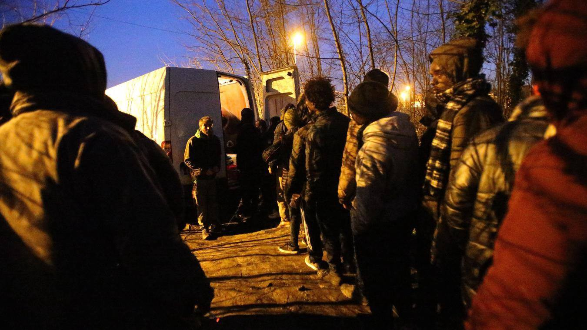

### AYS DAILY DIGEST 4/3/2017: Afghan boy committed suicide in Germany

_The desperate situation refugees are pushed into is forcing them into addiction, self harm while number of suicides among them is increasing // The situation in Iraq is getting worse and more and more people are forced to leave their homes // Walls of Europe are becoming higher and more dangerous // Deportation of Afghan people from Belgium and Denmark //_

Refugees have dinner in a bedroom offered by a volunteer for them to sleep for one night and take a break from the inhuman conditions they have in the abandoned wharehouses\. One of them has one feet broken in several places by Hungarian Border police\. Photo by NuuNoo Felicio\.
### FEATURE
#### Another life lost in Europe

A young boy from Afghanistan committed suicide shortly before his 18th birthday in Wasserburg, Germany where he was searching for a refuge\. He came alone from Kabul, on a dangerous journey that lasted for months\.

He was trying his best to start a new life, but life in uncertainty and insecurity draw him into despair, that many others feel\. However, it is still unknown why he committed suicide\. [Volunteers who met him told the media](http://www.schwaebische.de/region_artikel,-Minderjaehriger-Fluechtling-nimmt-sich-das-Leben-_arid,10625355_toid,441.html) that he was depressed, but also that he visited psychologist trying to find help\.

Friends and volunteers are collecting money so that his body can be transferred to Kabul to his family\.

This is just the latest case the public know about\. But every day we are receiving more alarming reports about despair among refugees that draws them to self\-harm, or even to commit suicide\. This week we also got the report from Subotica, Serbia, about another Afghan boy who jumped through the window in camp desperately trying to draw attention to his and the situation of many other who are living in this place\. Luckily, he survived\.

Experts who are working with refugees are warning for a very long time, years, about poor mental conditions among refugees and migrants all over Europe\. In Sweden, the Ombudsman for Children, recently held an emergency meeting with the Swedish Migration Agency, National Board of Health and Welfare and Health and Social Care Inspectorate \(IVO\) to talk about the warring trend or suicide attempts among young refugees\. The discussions came after local network, which works for the rights of lone refugee children, warned about existence of closed online forums to plan group suicides\. Some of the kids wrote inside this circle that they would die anyway if they had their asylum application rejected and were deported\.

The press officer for the Ombudsman’s office, told the local media that they have seen worrying signs while carrying out research on the situation for refugee children in the country\.

> ”We have met kids who showed signs of self\-harm and expressed suicidal thoughts\. What we see is that the uncertain situation many live under after coming to Sweden contributes to increased mental illness among newly arrived kids during the asylum process,” he said\. 

The number of suicide and suicide attempts is increasing in Greece where the biggest number of refugees are stranded, too\. Especially in islands where the situation is the worst of all\. Experts in the field are reporting about the severe depression among people that is linked to living conditions\.

_“Refugees in Moria are absolutely crushed and we hear more and more about how people are self\-mutilating, how they want to commit suicide and we are aware of cases of suicide and attempted suicide, not only on Lesbos but also on other islands,_ ” Louise Roland\-Gosselin, an advocacy manager for the medical Doctors Without Borders \(MSF\) told the media recently\.

Most of the people have nothing to do all day, and it affects their mental health, experts are warning\. Even more, they are forced to do nothing while living in camps and closed facilities\. Some are volunteering, some are finding low paid jobs, but most of them have nothing\.

Another problem is that many refugees are turning to alcohol and drugs, which is especially dangerous among minor and could have a long term consequences\.

In 2015, the UNHCR issued a report that warned this may happen stating that the causes of mental health disorders in refugees are not necessarily the same as the causes of these conditions in people who are not refugees\. According to this report, depression and anxiety are natural responses to displacement and disruption\. However, not even UNHCR done much to prevent this\.

Some organizations are trying to find the ways to help, including MSF, but it is becoming extremely difficult in a situation where many people are losing their hope that they will reach some safe place\. “Closed borders do affect mental health because they mean that people are cut out from hope\. If you have hope, you can move, you can accept to do sacrifices, for some time,” [said Nikos Gionakis, the member of the Babel Day Care Center team in Athens](https://medium.com/@AreYouSyrious/closed-borders-are-damaging-our-mental-health-cf810a93d45b#.t1kfsindk) \.
### IRAQ
#### Number of displaced people is increasing with atrocities

Meanwhile, the number of people who are trying to find a refuge from wars is increasing\. Over the last week, atrocities in Mosul led to massive displacements of people\. According to UNICEF, over the previous week, some 15,000 children have fled the western section of Mosul city where fightings intensified daily\. Many people are placed in the Hamam Al Alil camp, 20km from Mosul, that is close to reaching its maximum capacity\. At the moment, 150,000 places were occupied and construction is under way to accommodate up to 250,000 people\. Many are on their way to Europe, and some already here waiting\.

### GREECE
#### Volunteers needed

At [City Plaza](https://www.facebook.com/groups/943355035786244/\) School they are looking for English teachers, ideally long\-term, to start teaching adults as soon as possible\.

If you are interested or know anybody who could be please get in touch\.
### MACEDONIA
#### Book about refugees by volunteer

Macedonian police are busy with push backs\. Every day people are trying to cross from Greece and continue toward Serbia and EU, but police are pushing them back\.

Our friend from Macedonia, the long\-term volunteer, is writing a book about refugees and needs your help\. He worked for two years to help refugees in transit and in camps, but also collecting their stories that he would like to summarize in a book\. [Now, after the book is written and edited, he need support to publish it\.](https://www.generosity.com/emergencies-fundraising/100-stories-of-the-refugee-crisis)

> The book that I hope to be published in May this year, will contain the names of the supporters that contributed for the publishing\. Everyone who donates will receive hard\-copy or PDF from the published book\. 

### HUNGARY
#### More walls, less human rights

The government in this EU country is persistent to stop anybody from entering\. Nevertheless, those in Brussels are not that keen to find a way to deal with dangerous threats and actions in this country\.

This week, the government decided to extend by six months a state of emergency that is their response to people who are trying to cross through their country and reach safety\. The state of emergency would be maintained until Sept\. 7\.

They also announced to restore immigration detention as well as strengthening the border with a second fence that will be build up along the 150km of border with Serbia by May 1\. The fence will be built by 700 prisoners\. The fence will also deliver electric shocks to those who try to cross it and will be equipped with cameras and motion sensors\. Additionally, recorded warnings in English, Arabic, and Farsi to inform people who approach the fence will be transmitted over big loud speakers\.
### FRANCE
#### We will not stop\!

France does not have fences, but the treatment of people who need help is brutal\. Like in the case of Hungary, no measures are proposed from any EU body to stop this, while media hardly report about it\.

Photo by L’Auberge des migrants

In Calais, the mayor tried to prevent refugees from washing, and volunteers are prevented from distributing food\. Activists from [Utopia 56](https://www.facebook.com/groups/172900819749383/) , [L’Auberge des migrants](https://www.facebook.com/LAuberge-des-Migrants-358496450338/) and Help Refugees, determined to continue with their amazing work, issued and the statement saying that the decree produced by the Mayor “is inhuman and unworthy”\.

> The associations recall that the food distributions:
 

> \- not only correspond to a vital need but also allow to distribute blankets and warm clothes so as to avoid illness and possibly death on the street
 

> \- contribute to the safety of Calaisians, citizens, and traders, avoiding the desperate situations that can lead to theft
 

> \- are also an opportunity to spot medical problems especially for minors victims of the Great Cold
 

> \- make it possible to inform migrants about their rights, the possibilities of reception in France and the protection of children for the very many minors present\.
 

> The associations do this work because the State and public authorities do not respect their own obligations, in terms of laws and humanity\. 

At home, unpacking all my luggage\. I want everyone to see this\. When I used to talk and post about the rubber bullets they shot people within Calais, I think many people visualized something small and harmless\. These are the bullets\. Not small, not harmless\. Big, heavy, hard and brutal and shot at men, women, and children\. Just think on that for a bit\. I’ve seen the bruises\. They still use these all over Europe\. Photo by Ali Reid\.
### BELGIUM
#### Deportation to start soon

[Authorities in this country announced](http://www.tolonews.com/afghanistan/belgium-deport-illegal-afghan-migrants) that they will start implementing the agreement they made with the Afghan government on voluntary return of illegal Afghan immigrants or will deport them\.

In 2016, more than 2,700 Afghan citizens sought asylum in this country, but many of them were rejected\. Some of them could be deported now including 530 people who were arrested last year\.
### DANMARK
#### More deportations

Deportation is happening from Denmark, too\. [Afghanistan Migrants Advice & Support Org](http://Afghanistan Migrants Advice & Support Org) reported about at least 13 people who were deported to Afghanistan on 1st of March\. They were deported on a charter flight\.
### SWEEDEN
#### Relocation to start in June

Finally, good news\. The European Commission has confirmed that Sweden is getting ready to begin relocating people, starting in June\. The country agreed to relocate at least 3,727 people from Greece and Italy\.

_Converted [Medium Post](https://areyousyrious.medium.com/ays-daily-digest-4-3-2017-afghan-boy-committed-suicide-in-germany-ff37c818a882) by [ZMediumToMarkdown](https://github.com/ZhgChgLi/ZMediumToMarkdown)._
