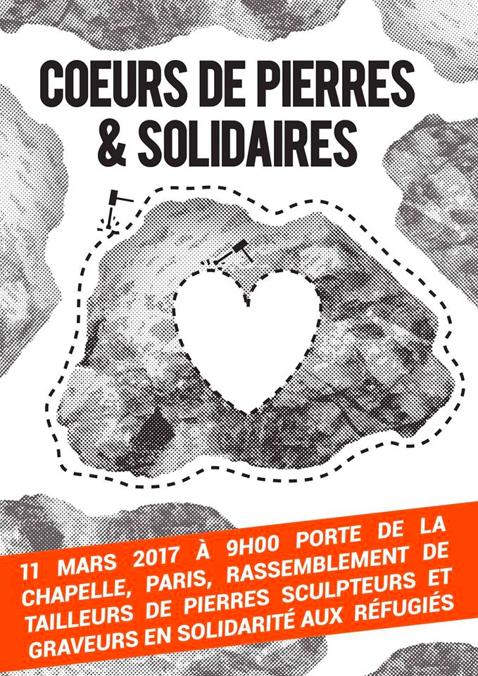
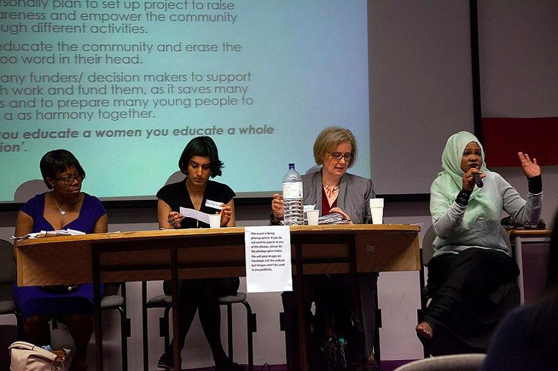
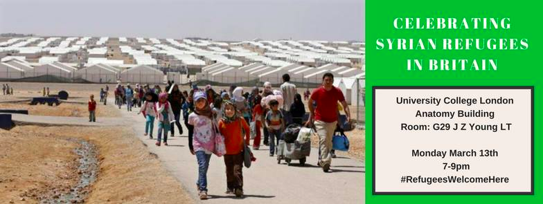
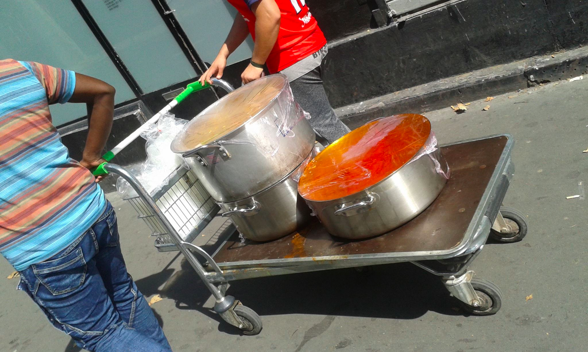
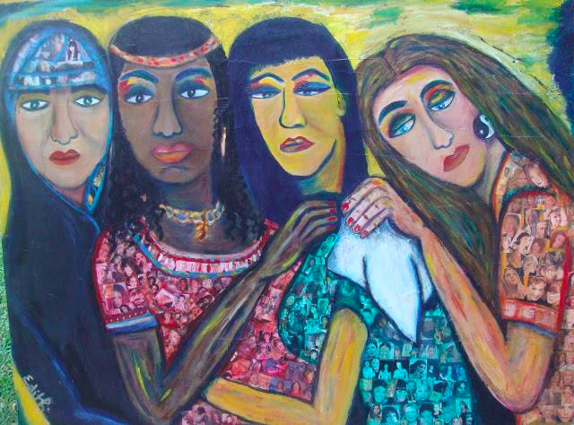
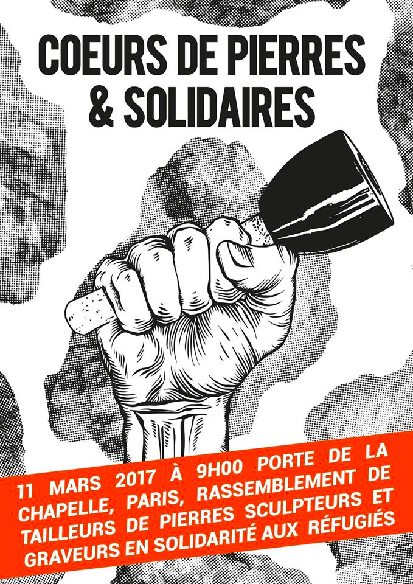
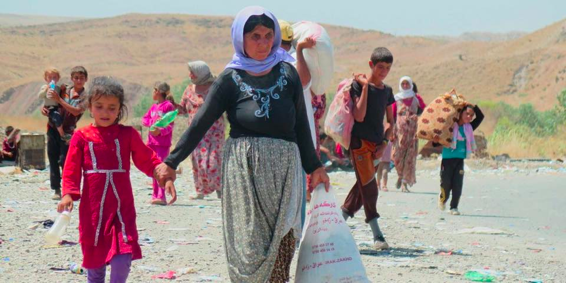

### This Week’s Solidarity Events in Europe
#### 7th to 13th of March — Calendar of protests, fundraisers and other events in solidarity with refugees\.

### UK

**Wednesday 8th of March 4PM to 7PM** — [Women in Asylum](https://www.facebook.com/events/379908802388674/) : To mark International Women’s Day, the Evelyn Oldfield Unit is looking at the challenges facing women asylum seekers in the UK, and how these can be overcome\. This event is mainly but not exclusively open to refugee, migrant and asylum\-seeking women\. Tickets [here](https://www.eventbrite.co.uk/e/women-in-asylum-safeguarding-and-support-tickets-31932141896) \.

_Address: London Metropolitan University, 166–220 Holloway Road, E1 7 Islington_

**Monday 13th 7PM to 9PM** — [Celebrating Syrian Refugees in Britain](https://www.facebook.com/events/1241839509240561/) : The event will celebrate the contribution of Syrian refugees in Britain\. You’ll be able to hear the personal success stories of Syrian refugees now settled in the UK and also hear from organisations who work with refugees on the challenges they face\. Tickets available [here](https://www.eventbrite.co.uk/e/celebrating-syrian-refugees-in-britain-tickets-32310834576) \.

_Address:UCL Anatomy Building, WC1E 6 London_

**Until the 29th of March \(live event on the 30th of March\)** — [Art Auction for the Refugee Community Kitchen](https://www.facebook.com/Art-Auction-Raising-money-for-RCK-1420676804632238/) : Artists have donated work for an online art auction, with 100% of profits being donated to the Refugee Community Kitchen, active in northern France\. You can start bidding [here](http://www.jumblebee.co.uk/rckartauction#none) \.
### **France**

**Tuesday 7th of March from 7:30PM to 11PM** — [Dinner in support of Nico](https://www.facebook.com/events/637710286416622/) : La Cuisine des Migrants organises an informational evening and pay\-what\-you\-want dinner in support of Nico, an activist who was beaten and arrested by police while filming a roundup of refugees in Paris this summer and whose trial will take place this Friday

_Address: La Nouvelle Rôtisserie, 4 rue jean et marie Moinon, 75010 Paris_

**Friday 10th of March from 9AM —** [Support Nico in court](https://paris-luttes.info/appel-a-soutien-contre-les-7650?lang=fr) :

_Address: TGI de Paris, Chambre 30, 4 Boulevard du Palais, 75001 Paris_

**Wednesday 8th of March from 7PM to 9PM** — [Table Ronde: La solidarité féminine avec les femmes exilées](https://www.facebook.com/events/1457986480900451/) : The IFAFE federation \(Initiatives of African Women in France and Europe\) and the association Kâlî organise a roundtable on female solidarity with refugees — the event will start with a presentation of the organisations and their projects and will end with a discussion with the public\.

_Address: CICP,_ 21 _ter rue Voltaire, 75011 Paris_

**Saturday 11th from 9AM** — [Rally of stone carvers and sculptors in solidarity with refugees](https://www.facebook.com/C%C5%93urs-de-Pierre-et-Solidaires-1174517849332599/) : After a similar event last month, stone carvers will again meet in front of the Parisian reception centre to to transform the stones installed by the city of Paris\. These massive stones prevent refugees from sleeping under a nearby bridge and stone carvers will use their tools and knowledge to transform something ugly into something beautiful\.

_Address: Porte de La Chapelle, Paris_

**Saturday 11th from 8PM to 11PM** — [Free course on French nationality law](https://paris.demosphere.eu/rv/52890) : Volunteers give a class each Saturday on immigration law, including nine sessions on applicable rules and six sessions on possibilities of appeal\. Compulsory registration: [intercapa@yahoo\.com](mailto:---)

_Address:_ C _ampus de Jussieu, salle de conférences \(couloir 65/66, 5ème étage, Tour 65\), 4 Place Jussieu 75005 Paris_
### Switzerland

**March 9th 6:30PM —** [Refugee women — Challenges in Switzerland](https://www.facebook.com/events/368289476897500/) :The Amnesty International Hochschulgruppe Zürich is organising this event which will provide an insight into the basic difficulties and challenges faced by women on the refugee trail to Switzerland\.

_Address:_ _Universität Zürich Zentrum \(KOL\-F\-109\)_
### What to look out for — [International Action Day Against European Migration Politics](https://www.google.com/maps/d/u/0/edit?mid=1clpJX1_iDx-Gici5cfdLFZcLuvU&ll=56.168290862540786%2C9.730635849999999&z=4) on the 18th of March all over Europe

_If you want to share any events with us, do not hesitate to write to us directly through our [Facebook page](https://www.facebook.com/areyousyrious/) \._

_Converted [Medium Post](https://areyousyrious.medium.com/this-weeks-solidarity-events-in-europe-8be95077b67f) by [ZMediumToMarkdown](https://github.com/ZhgChgLi/ZMediumToMarkdown)._
