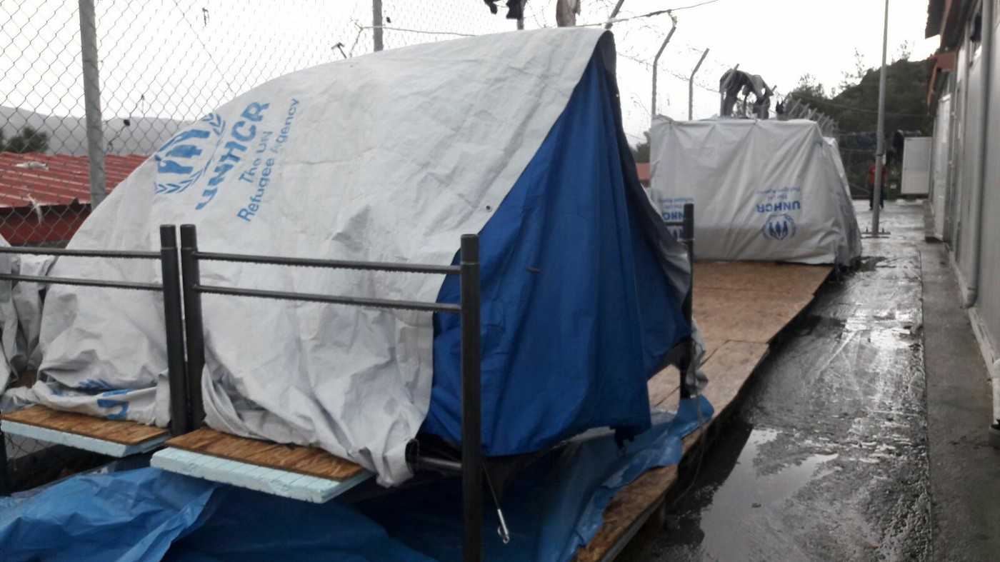
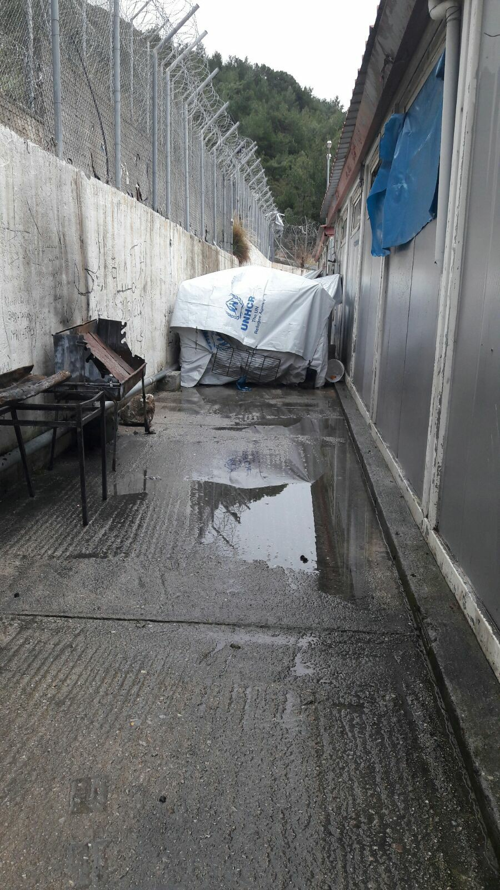
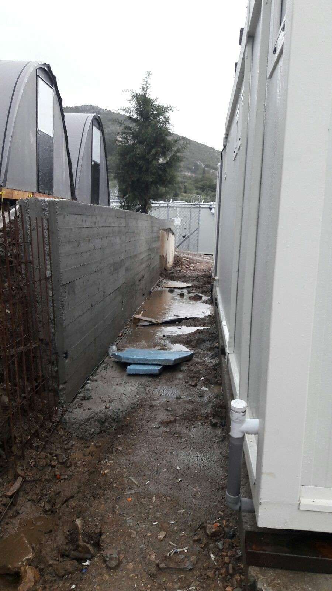
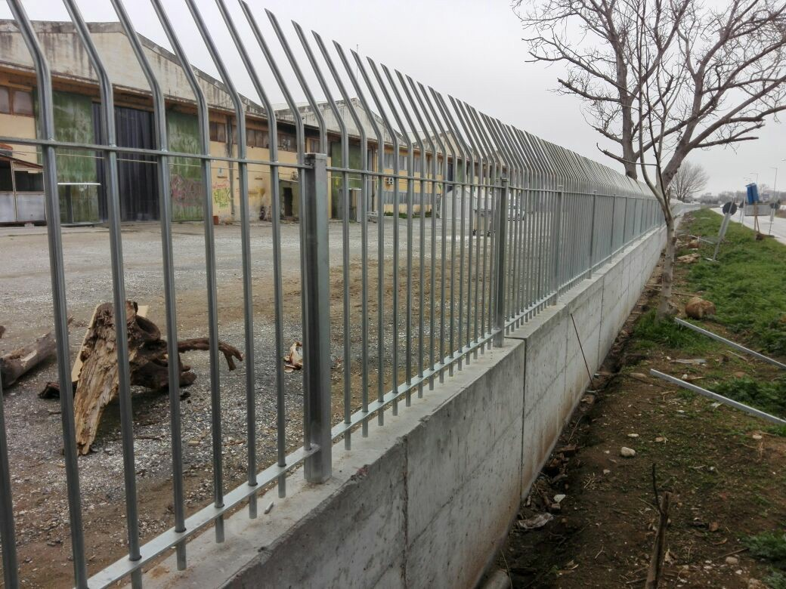

### AYS Daily Digest 08/03/17: We offer waiting, risking, violence and a cold welcome
#### Smuggling blooms everywhere / New cases of police violence against refugees used to press charges against the Police in Croatia / Floods in the island camps make life impossible / Information for refugees who have managed to arrive in Greece or islands without having their fingerprints taken / Bulgaria struggles with accepting refugee families in small communities / Austria urges for denying financial support to those who deny international protection to refugees / Evictions in Italy

 \)](assets/23313700cb0e/1*HmKYlvDba_U8xn5g8ctsHA.jpeg)

Iraqi women who have been traumatised at the hand of ISIS are creating through their own projects, to rebuild their livelihoods and independence \(Photo: [Help Refugees](https://www.facebook.com/HelpRefugeesUK/) \)

> To all the women who have walked across deserts and journeyed over treacherous seas\. To all the women who have fled destroyed homes and falling bombs\. To all the women who have stayed strong and resilient in times of un imaginable despair\. To all the women who sacrificed food and blankets to keep their children alive\. To all the women who march for freedom, for others and for futures\. To all the women who gave up their time to help change the lives of strangers\. To all the women who face prejudice and hate\. To all the women who stand tall against racism, misogyny and fear\. To all the women all over the world\. We will not back down, we will not be ignored, we will keep fighting\. 

> To all the women, we salute you\. — [Calais Action](https://www.facebook.com/calaisaction/?fref=nf) 

#### FEATURE
### Croatia — Pressing charges against the police violence

A month ago [the first testimonials](ays-daily-news-digest-17-1-massive-negligence-of-minors-and-serious-police-abuse-remain-silently-38c0815bdec5) about the police violence towards the refugees, gathered by the AYS and the Welcome Initiative were [filed to the Ministry of Interior](https://medium.com/@AreYouSyrious/report-on-illegal-and-forced-push-backs-of-refugees-from-the-republic-of-croatia-3f8c50ca10c1#.h9477cp7g) in Croatia and a criminal investigation was under way\. After the legal deadline had passed, the Police have informed us that they have made an investigation to confirm the allegations and that no unprofessional or illegal conduct happened towards the migrants, as they said, so on Tuesday the AYS and Welcome Initiative filed criminal charges\.

The General Police Directorate have given answers in several cases and in 3 out of 6 cases they state that the foreign citizens who had entered Croatia illegally were given the document that states they must leave the European Economic Area in a period of 30 days\. Considering the fact that all of them had 30 days to leave the EEA, a question arises — why did the police push these people back from the country on the same day or already on the next day? The Police also say there were no confirmations to the claims from the charges filed that speak about the refused demands for the international protection in Croatia\. Nevertheless, the testimonials that the refugees gave to the volunteers speak differently\. Also, the fact that some of these people have spent time at the police stations in Croatia, which was confirmed by the head of the Police, go to confirm the fact that they did ask for international protection\.

The complaints about the police violence over refugees and denial of the possibility to ask for international protection are still present and, with the material gathered during the last round of gathering testimonials in Serbia, the [Second report of illegal and violent push backs of refugees from the Republic of Croatia](http://welcome.cms.hr/wp-content/uploads/2017/03/DRUGI-IZVJE%C5%A0TAJ-O-NEZAKONITIM-I-NASILNIM-PROTJERIVANJIMA-IZBJEGLICA-IZ-REPUBLIKE-HRVATSKE.doc) was made\. It documents breaching of authority, signing documents in Croatian language or another language the refugees don’t understand and signing documents by the police official when the person in question refused to do it\. Also, push backs inspite explicit demand for asylum/international protection in Croatia, violent behavior of the Croatian officers and confiscating valuables and personal belongings\.

Therefore, we invite the responsible official institutions in charge to investigate the accusations and to stop every illegal and unprofessional treatment of those who are most vulnerable and in need of protection, as soon as possible\.
#### GREECE
#### The islands — arrivals

75 people have arrived on Greek islands in the past 48 hours: 13 on Lesvos, 21 on Chios and 41 on Samos, authorities [said](http://www.ekathimerini.com/216713/article/ekathimerini/news/75-migrants-arrive-on-greek-islands-in-past-48-hours) \. A total of 8,780 asylum\-seekers are currently stranded on the islands, according to official data Wednesday\.

A cargo ship from Malta came to the rescue of 113 people whose smuggling boat had ran into trouble close to the island of Paxos\. They were to be transferred to a reception center in Patra\. They were said to be in good health\.
### Samos

According to the last week’s report by the UNHCR, 919 people are registered and living on Samos in the refugee camp\. The situation for these people is definitely not getting any easier and the changing weather conditions are not helping them either\. Lately, with the cash cards system in place on Samos, the Samos Volunteers group have stopped their clothes distribution and will continue to be an emergency response team catering for the clothing needs of those arriving in the camp while increasing their psycho\-social activities where the needs are far from being met, as they say\.

The camp is built on a very steep incline so when it rains it flows completely through the whole camp from top to bottom\. People staying in camps on the Greek islands have been struggling with the situation for a while now — with the consequences it has on the infrastructure of the camp and, of course, with the fact that they some have to live in the wet tents after the rains\. As the weather improves, more arrivals are registered coming from Turkey\.

Greece is the biggest recipient of EU home affairs funding at the moment and, after the last visit to some of the camps on the Aegean islands in January, greek minister Mouzalas and the EU Commissioner for Migration Avramopoulos explicitly said that “ Greeks and Europeans have a humanitarian imperative to alleviate the situation on the Greek islands”, but almost 2 months after that the same problems are a daily reality of the island residents\. Hopefully, without bringing them to an even worse situation on the mainland, very soon the responsable officials and organizations will make alleviating the situation on the islands a a priority\.

](assets/23313700cb0e/1*WMyYRlZF0QhrdPwt2FJw_Q.jpeg)

Photos by: [No more borders, No more tears](https://www.facebook.com/No-more-borders-No-more-tears-1254181771265187/)

> This is the situation in the camp in Samos today\. A refugee camp situated on a hill where those injured and exhausted must walk up a steep incline many times a day to queue for registration, processing, interviews \(when they eventually are called for one\), food, water and any medical needs\. It is ill equipped, unsanitary and after the rains, flooded\. — [No more borders, No more tear](https://www.facebook.com/No-more-borders-No-more-tears-1254181771265187/) s 

](assets/23313700cb0e/1*2DAAXdsMokgpDCIAee1zZQ.jpeg)

Photos by: [No more borders, No more tears](https://www.facebook.com/No-more-borders-No-more-tears-1254181771265187/)
### Information for refugees — ‘no fingerprints or papers’

For refugees who have managed to arrive in Greece or islands without having their fingerprints taken, this is the process to take:
**1\) get your initial registration and fingerprints taken** at the police station — this is the first crucial step as without this, you will not be able to register further\. For post 20/3, there is likely to be an admissibility interview first\. 
See question 26 of the GAS questions and answers [here](http://asylo.gov.gr/en/?page_id=1499) \. 
**2\) then register via skype** if appropriate \(skype schedule can be found [here](http://asylo.gov.gr/en/?page_id=987) \)
**3\) pre 20/03/2016** , ask for, whichever is appropriate, Asylum, Family Reunion or Relocation \(for those that are eligible\) with the Greek Asylum Service
**Post 20/3/2016** , ask for Asylum or Reunification, whichever is appropriate with GAS\. This may involve an admissability interview if not carried out at fingerprint/registration stage\.
see the flowchart of the **process here on [GAS website](https://goo.gl/AVw8TL) \.** 
NOTE: if you say you arrived via islands there is a strong possibility that you will be sent back to the islands to have your admissibility interview\.

To read the original text, follow [this link](https://www.facebook.com/groups/AthensVolunteersInformation/permalink/1051579914974305/) \.
### Athens

Teams at the Khora Community Centre are continually on the look out for long term volunteers\.

> You might already be living in Greece and able to help out for one or two days a week, you might be living somewhere else with the freedom to travel, and able to come join us for several months\.We are currently looking for people with skills and experience to support the following roles: 

> \- Kitchen co\-ordination \(menu planning, managing food hygiene, liaising with suppliers and ordering ingredients, working with kitchen volunteers\) 

> \- Cafe co\-ordination \(maintaining a welcoming space, co\-ordinating a team of volunteers on shift, working closely with the kitchen\) 

> \- Free Shop and warehouse \(co\-ordinating sorting and distribution of clothing and other goods in our free shop, maintaining a welcoming friendly space\) 

> \- Dental support \(a non medical role, all training offered\) 

> \- Volunteer co\-ordination \(managing weekly rotas, liaising with new volunteers before arrival, welcoming and inducting new volunteers\) 

> \- People who speak multiple languages \(including Greek, Arabic, Farsi, Greek, Urdu, Kurdish and English and especially women\) 

> \- Legal support \(co\-ordinating with lawyers, following up on cases, accompanying people to appointments, providing information on asylum processes and law\) 

> \- Qualified social worker \(to begin June 1st\) to supervise students and generally be part of the legal team\. 

### Fenced new face of Vasilika raises questions

As we’ve previously [reported](https://medium.com/@AreYouSyrious/ays-daily-digest-01-03-17-are-some-refugee-nationals-purposly-ignored-a90f6a02e9a3#.ikxp4veue) , Vasilika camp has closed recently and it was said the camp will soon be prepared to host newly arrived refugees from the Greek islands\. However, what most of us had in mind as a “preparation” did not have a fence wall in it as a part of the idea of making it a better place to welcome people\.

We hope the UNHCR and the NGOs present at the site will still be attentive to the circumstances and the needs of the people, even if they didn’t manage to work against the new prison\-looking facility plan\.
### Pharmaceutical treatment in Greece

[NTM](https://newsthatmoves.org/en/rumour-pharmaceutical-treatment-in-greece/) have published new information in their Rumours/Facts series\.

**The Rumour:** _“They gave me a prescription from the hospital but I cannot get the medicine if I don’t have any money\.”_

**In Fact:** Asylum seekers, recognised refugees and people granted subsidiary protection, together with their spouse and minor children, have the right to receive hospital, medical and pharmaceutical treatment free of charge in all the public health facilities of the public National Health System in Greece \(ESY\), provided that they are in need and have no other medical health insurance\.

Pharmaceutical treatment is provided free of charge by private pharmacies contracted with the National Organization of Providing Health Services \(E\.O\.P\.Y\.Y\. \) but only for cheaper medication\. High cost medicines are only supplied by hospital pharmacies\.
Some hospitals may require from refugee patients a [social security number \(AMKA\)](https://newsthatmoves.org/en/asylum-seekers-work-in-greece/) which can be obtained at a Citizens’ Service Centre \(KEP\) \.
### Smuggling business blooming

The growing number of refugees smuggled into EU countries is a result of the fully functional and coordinated network of smugglers and other actors in the process that is particularly active in the area starting from the northern Greece\. We are told prices for a trip from the north of Greece to the Serbian border have grown rapidly, reaching up to 2000 euro\. 
In Macedonia, a trend in attacking and closing up people along the route has also been present, according to some sources, and people must pay a price of 1,000 euro in order to be able to leave\. It seems the locals, foreigners, officials and everyone who finds benefit in these activities takes part along with the key organizers, the smugglers\. The EU doesn’t seem to have and effective way or a political will to approach the problem nearly as firm as they do when closing the borders is the topic, where all these life threatening situations stem from in the first place\.
#### BULGARIA
### Tensions over refugee families’ housing

Hostilities towards the Syrian refugee families who have arrived in Bulgaria and were given international protection or asylum continue\. Similar to the recent story of the family in Elin Pelin that [we reported about](https://medium.com/@AreYouSyrious/ays-daily-digest-20-02-discrimination-expulsion-and-denial-of-rights-is-this-the-best-we-can-do-267df132530b#.nd5o0pqqo) , another such case is leading the family to cosider leaving\.

The municipal councillor of Belene, a town in north of Bulgaria, Krassimir Todorov and a number of his friends have [reportedly](http://sofiaglobe.com/2017/03/07/row-in-bulgarian-town-of-belene-over-church-sheltering-syrian-refugee-family/) opposed s family that had previously been welcomed in this town\. “People are afraid that after one family settles, another 50 will come,” he said\. He has also launched a campaign against the local priest who decided to accept the Syrians, providing them accommodation and help to learn Bulgarian\.

> These and similar widely present attitudes are preventing those who are seeking refuge from war and persecution, including a [growing number of unaccompanied minors](http://www.novinite.com/articles/179093/State+Agency+for+Refugees%3A+7+Unaccompanied+Minors+Enter+Bulgaria+per+Day) , to believe that an EU member country has the will to provide them with the basic human solidarity and shelter they need desperately\. 

#### AUSTRIA
### Selective solidarity should result in selective payments

Once again, the idea that the EU members who refuse to accept refugees to receive less funding is back on the table\. 
Germany and Austria could not continue to contribute high amounts into the EU budget if the bloc did not come to an agreement on a fair distribution of refugees, [said](http://www.politico.eu/article/austria-urges-eu-funding-cuts-for-countries-that-refuse-refugees/) the Austrian Chancellor Kern\. Therefore, countries that shirk their responsibilities on migration should not receive high funds\. “A weak Europe weakens Austria too,” he declared\.
#### ITALY
### A smell of ‘clearing out’ in San Ferdinando \(Reggio Calabria\)

The makeshift camp of San Ferdinando is under a threat of evacuation\.
[Comitato Lavoratori delle Campagne](https://www.facebook.com/comitatolavoratoridellecampagne/?fref=nf) reports that the police raided the San Ferdinando’s camp on Tuesday, this time in full deployment with dogs\. They have checked everyone, inspected the documents as a preparation for an evacuation in order to move the people to the new — so far incomplete — tent camp\. The reason for this, supposedly, has to do with the way the local trade of the informal shops and restaurants in the camp work and earn\.

> This seems to be a clear attack towards who has been fighting for years for conditions of dignity\. They have not only systematically ignored these requests, but also silenced them through repressive law instruments in a hypocrite way\. 

 \. By [Greek Forum of Refugees](https://www.facebook.com/Greekforumofrefugees/?ref=page_internal&fref=nf)](assets/23313700cb0e/1*RMLYcEePatUw69xdGkosfg.png)

There are still big gaps when it comes to the opportunity for an asylum seeker to legally be employed\. This difference concerns the possibility to work in itself, as well as the delay before getting the right to work\. The ONE EUROPE OF DETENTION, INEQUALITY & RACISM campaign aims at revealing the differences between refugees’ rights across Europe\. More information [here](http://www.asylumineurope.org/comparator/reception) \. By [Greek Forum of Refugees](https://www.facebook.com/Greekforumofrefugees/?ref=page_internal&fref=nf)

_Converted [Medium Post](https://areyousyrious.medium.com/ays-daily-digest-08-03-17-we-offer-waiting-risking-violence-and-a-cold-welcome-23313700cb0e) by [ZMediumToMarkdown](https://github.com/ZhgChgLi/ZMediumToMarkdown)._
