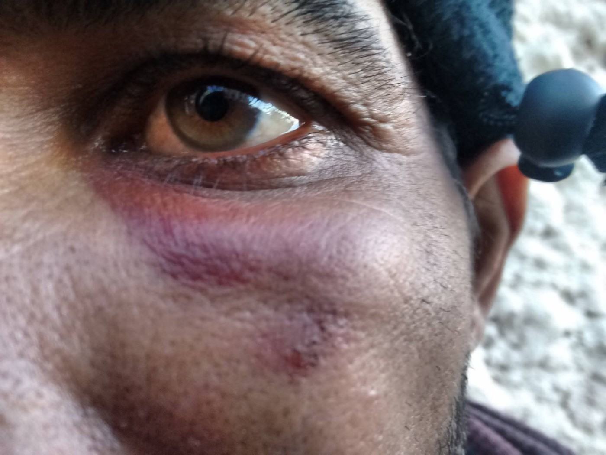
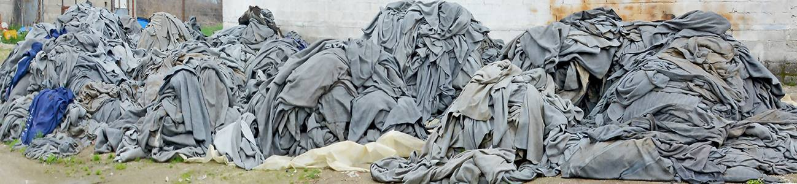
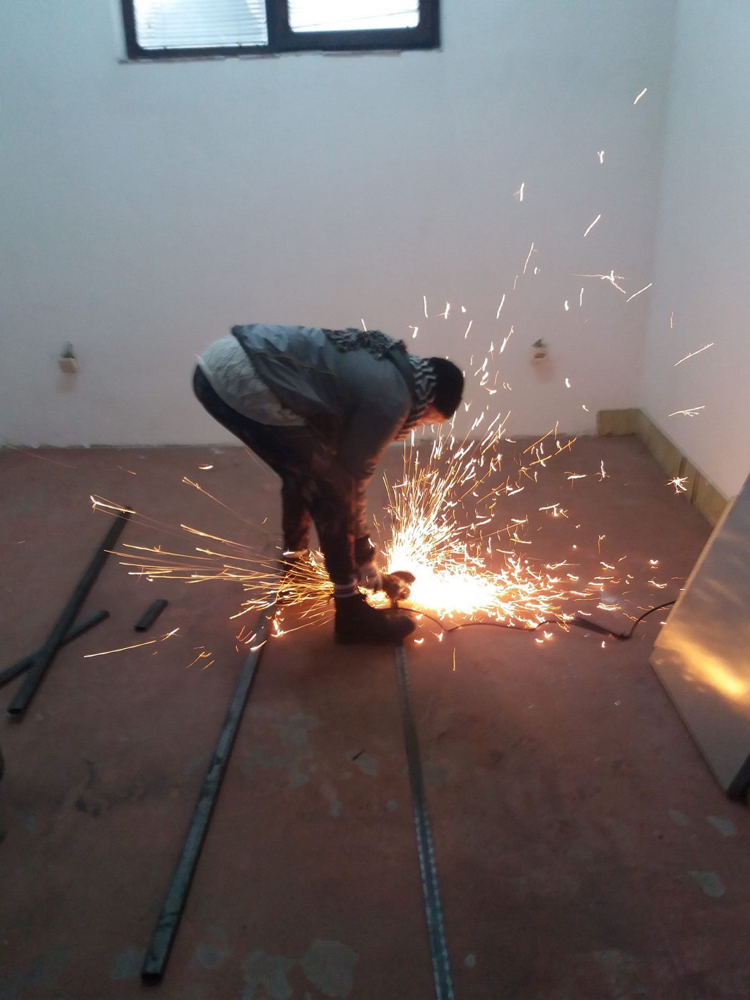
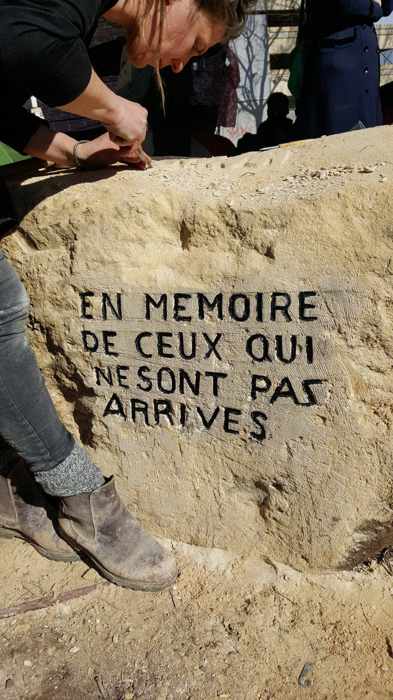
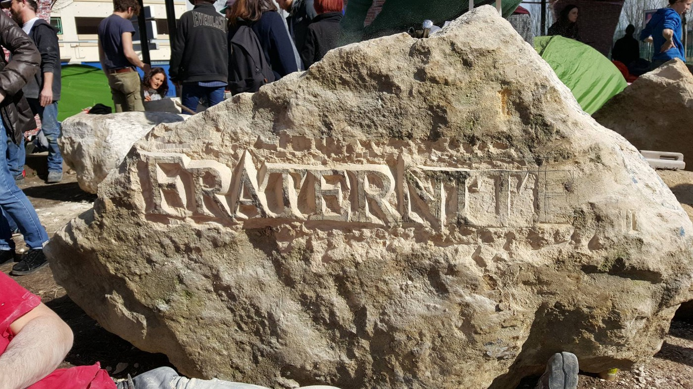
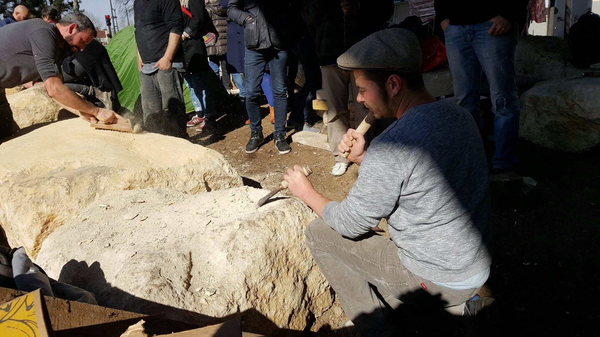
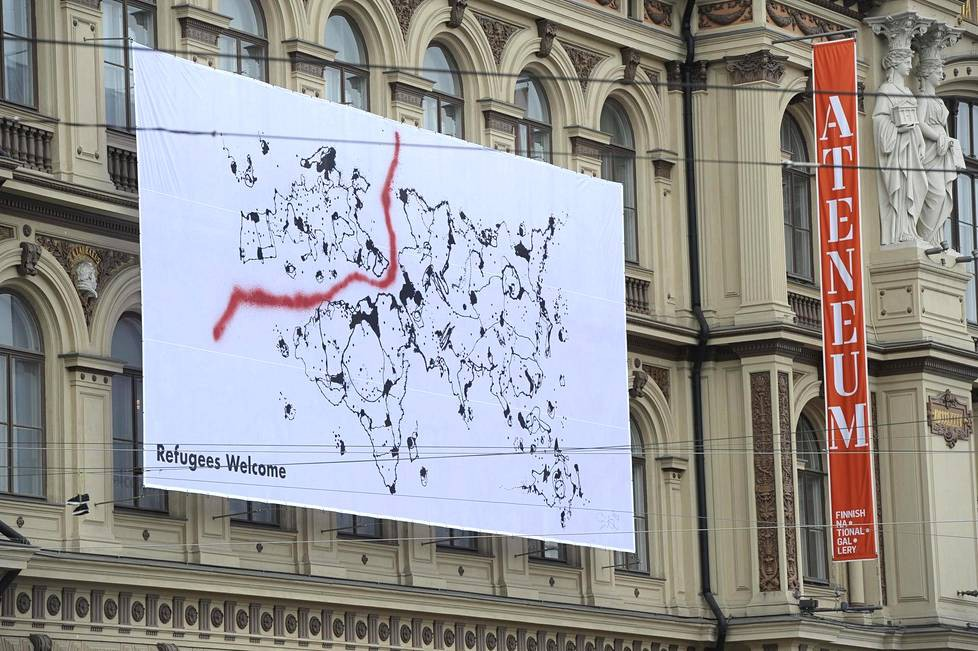

### AYS DAILY DIGEST 11/3/2017: The future stopped at the closed borders

_Children deprived of education, shelter and safety in Europe // Police violence against refugees and intimidations against those who support them in Greece, Serbia, and Italy // Artists in France and Finland against oppressive government policies // Europe is still showing its ugliest face to the rest of the world_

](assets/73d190e1982f/1*xGvr-opFRKjAv9w6srOqjw.jpeg)

European Anthem, By Tjeerd Royaards\. [Art Against\.](https://www.facebook.com/artagainstproject/)
### FEATURE: Children forgotten by Europe

According to the official data, there is about 20,500 refugee and migrant children only in Greece at the moment, including around 2,100 registered unaccompanied minors\. However, these numbers could be much higher for many kids, especially unaccompanied, are not registered at all which puts them in horrible and very dangerous situations\.

Most of those children who are registered in Greece are living in hostels, squats, apartments, and only around 6 percent are placed in shelters\. Out of this number, so far only 4\.027 children were relocated to other EU countries from Greece\.

Even though it was promised back in September that all the children will go to school, only 2,500 attend regular education, but mostly in the afternoon classes\.

In the meantime, more children are arriving in Greece and Italy every day\. During January, 309 children arrived in Greece, while in Italy among new arrivals there are 462 minors without adult care\.

As well as for the adults, relocation is very slow for children, even in the case of unaccompanied minors\. [In the new report by the European Parliament’s Policy Department for Citizens’ Rights and Constitutional Affairs](http://reliefweb.int/sites/reliefweb.int/files/resources/IPOL_STU%282017%29583132_EN.pdf) , it is stated that some European governments are claiming that the lack of the special reception facilities is the reason for them not to accept these children that desperately need protection and home\. It is hard to believe that so far only one unaccompanied minor has been relocated from Italy so far\.

Some EU countries reported about the problem with minors who moved onward, irregularly, after relocation\. Conclusion highlighted by the report that many European countries “prefer to relocate particularly young children”\.

> “In Ireland, for example, these children are usually placed in foster families and are viewed as less likely to disappear than older teenagers \(over the age of 16\), who are usually accommodated in larger reception facilities\.” 

So far, through relocation program, Finland accept the highest number of children who are traveling alone, 78, followed by Netherlands, Spain, Luxembourg, Norway, Belgium, Ireland, Switzerland, Germany, and Portugal\.
### Greece

Today, only Samos and Chios, 88 new arrivals were registered by volunteers\. [Samos Volunteers](https://www.facebook.com/samosvolunteers/?ref=br_rs) groups reports about 26 new arrivals around 2 am\.

> “They were very wet and dirty\. We gave them tea, sleeping bags, dry clothes, sandals, towels, baby hygiene and baby milk, food, and water\. This group included 16 children\.” 

On Chios, 11 women, 17 children, and 30 men arrived in the morning, joining the 5 other arrivals from the last night\.

All new arrivals have to stay on islands, in closed centers, with restricted freedom of movement, living in extreme conditions\. Over 13,000 people are forced to live on Greek Islands at the moment, many in tents, and despite protests, criticism and even media reports, nobody is doing anything to change this\.
### Police violence reported, again

We received disturbing information from various sources at islands\. The most disturbing comes from friends in [No Border Kitchen Lesvos](https://www.facebook.com/NBKLesvos/) and it is about continuous police violence against refugees on this island\. As they report; _“every day on this island people are controlled, harassed, humiliated insulted and beaten\.”_

Another victim of police violence\. By No Border Kitchen Lesvos\.

> “People that the police assumes are refugees are repeatedly controlled on the basis of the color of their skin\. When they are stopped in the street they are usually asked to show their papers\. We know of several people who failing to show identification were taken to the police station and there they were beaten\. They were brought to a separate room in the police station that didn’t have cameras and beaten with fists, kicks, and sticks\. After this, they have released again\. At least one person was unable to walk after being severely beaten with sticks and another had his arm broken… 

> Another form of violence the police use is humiliation\. People are being insulted and forced to undress in front of the police\. A person told us his story which happened on a night in December when the temperatures dropped to zero every night\. He said „the police came with three cars and stopped me\. They asked me for my papers\. I showed them my papers\. After they gave me back my papers\. Then they told me to undress\. I had to put my jacket, my trouser, all my clothes on the ground\. I was only in my underwear\. I was very cold\. I had to stand there for two or three hours without my clothes\. The policemen were looking at me and laughing\. Then they told me to dress\. Then they beat me\. They kicked me with their boots in the back and on the legs\.“ 

Not only refugees are targeted, but also people who support them\. No Border groups reports about that in their post, but we received the report from [Advocates Abroad](https://www.facebook.com/advocatesabroad/) saying that two members or their group — one at Lesvos and one at Samos — were called in by the police and interrogated for hours, without given proper explanation\.

This is not the first time that refugees and their supporters on islands are reporting these types of police acting, but so far we are not aware of the actions by the government or any EU institutions against it\. We strongly condemn police violence and call for the responsible institution to act and stop this practice\.
### New Skype schedule

Info from [The Mobile Info Team for Refugees in Greece](https://www.facebook.com/mobileinfoteam/) informs on changes to Skype schedule of the Asylum Service\.

_Arabic\-speakers can call on Mondays \(1pm\-2pm\), Thursdays \(1pm\-2pm and Fridays \(10am\-11am\) \._

_Kurmanji\-speakers can call on Fridays \(1pm\-2pm\) \._

_Sorani\-speakers in Athens area can call from Monday to Wednesday \(always 9am\-11am\), while Sorani\-speakers in the rest of Greece can call on Mondays \(9am\-11am\) \._

_Farsi/Dari\-speakers in Athens area can call from Monday to Thursday \(always between 12 and 1 pm\), while Farsi/Dari\-speakers in the rest of Greece can call on Fridays \(9am\-10am\) \._

[Advocates Abroad](https://www.facebook.com/advocatesabroad/) are starting their new program on 27 March, and they need your help\.

> “This program will put attorneys in hospitals and clinics in Greece to ensure that refugee patients are fully informed of their rights for health care and receiving the full medical care to which they are entitled\. We are looking for other medical teams and volunteers to collaborate with in this program\. Please let us know if you are interested: [director@advocatesabroad\.org](mailto:director@advocatesabroad.org) ”\. 

### Calls for solidarity

5th school squat in Athens issued a call for health workers, psychologists, and social workers\.

> “With war and the tragedies that refugees have lived and are still living the development of mental or social health issues is very important\. We, the people in solidarity but also society, have to provide them with the assistance of experts that can help them to understand/overcome or learn how to live with them\.” 

[Dirty Girls of Levos](https://www.facebook.com/dirtygirlslesvos/) are still doing their amazing job\. They are cleaning 20,000 blankets

Dirty Girls help protect the environment and care for people\. You too can be a Dirty Girl Environmental Protector\. To become one, visit their FB page for more info\.

Dirty Girls of Lesvos\.

The amazing story comes from [The Worldwide Tribe](https://www.facebook.com/theworldwidetribe/) and Eco Project\. This week their team made fully functional dream space, _“a multifunctional learning space for kids and adults inside a previously unused barn\. Adults can sit on the steps like in a lecture theater, and the kids can use the steps as a den or maze to run, jump, hide and seek\.”_

The new plan is to create a caffe\. All the spaces are designed by professionals\. Their main architect Ryan made a very interesting observation of the way how different areas in camps especially are usually created\.

> “I can’t stop thinking about how many trained, talented architects there are out there, and then how many humanitarian agencies are currently grappling to find architectural solutions to problems… but there seems to be the little collaboration between them\. I’ve noticed that the majority of these camps are not designed by architects, but by army planners, humanitarian organizations, and in some cases inexperienced and unskilled grassroots volunteers\. This leads to many problems…things like rainwater gathering on top of tents, or flooding camps, electric heaters being sent by the UNHCR to camps that don’t have electricity, outbreaks of disease and conflicts between groups forced to live unnaturally side by side\. Us architects have the skill set to ease these problems and collaboration between architects and humanitarian organizations, I feel, could be amazing\.” 

The Worldwide Tribe
### Serbia
#### Police raid in Subotica

Yesterday we reported about the coordinated police raid in Subotica, and today we bring an update prepared by one of the volunteers in the field\.

> “Around 5 am on the morning of 10 March 2017, a coordinated police raid occurred in Subotica, focusing on the main living sites for the unregistered population: brick factory and ‘jungle’ camps and another abandoned building\. Around 114 people were forced onto 3 buses \(according to UNHCR estimates\) which left Subotica around 6 am for Presevo closed camp, next to the Macedonian border\. 

> Throughout the morning, police went into the jungle sites and rounded up between 30–50 more, though it’s not confirmed if they were taken to Presevo as well\. Until the early afternoon, workers destroyed all the camps in the ‘jungles’ and hauled away at least 2 truckloads of tents, sleeping bags, blankets, and other personal possessions\. Reportedly one of the buses stopped near Belgrade, as a person onboard had to be taken to a hospital\. We’ve heard conflicting accounts of the reason why\. 

> This is the 5th such coordinated police action in Subotica since October, with the raid on 12th October resulting in at least one full bus illegally deporting people to Macedonia \(reported by UNHCR in a statement in December\) \. We’ve heard of illegal deportations happening to Macedonia \(and often, consequently to Greece\) on a smaller scale throughout this whole time from refugee contacts, who fear such police raids\. If the same pattern follows since October, the population numbers here will climb back up to over at least 300 within the next week or two, and the next raid and forced removal/detention will occur\. 

> Rough notes on the previous raids: 

> 12 October — 4–5 buses to Presevo and Macedonia
 

> 6 November — 2 buses escorted by 1 bus and 3 cars filled with police… to Presevo\. 3 guys beaten in RAP when refusing to enter the bus\. 
 

> 23 November — Train Deportation — 100 jumped off
 

> 11 January — 180 ppl to Presevo
 

> 11 March — 114 people to Presevo \+ 40–50 from jungle taken in afternoon to Presevo or arrested” 

### Calls for solidarity

The [SouldWelders](https://www.facebook.com/SoulWelders/) group need help, too\. They are getting 1\.000 meter distribution warehouse operational in Belgrade, and to do that they need donor aid charities to support them financially\. They also need volunteers skilled in joinery, plumbing, distribution, but would not mind if you come just to help them to muck in and clean, paint and shift things around\.

Call for help is also issued by the [No Name Kitchen team](https://www.facebook.com/NoNameKitchenBelgrade/) \. They need chefs\.

> “Please contact us to continue making possible the spoons do not lack in the most remote places\.” 

### Italy
#### Victims of forced work arrested

[Local media are reporting](http://react-text: 222 http://www.larena.it/.../caporalato-a-verona-immigrati...) about 5 persons who have been arrested and detained, and 4 more who have been arrested and subsequently released\. All of them are farm owners who exploited undocumented people for agricultural work\.

People worked in Forlì, Ravenna e Verona in three cooperatives, received very low wages, not enough to even buy bread to nourish themselves, while living in extremely unhygienic conditions in two shelters\.
### Austria
#### New deportations and calls for tightening of borders

Despite constant protest by the people, the government announced new deportations\. [Der Standart report](http://derstandard.at/2000054000786/Start-vermehrter-Abschiebungen-aus-Wien-nach-Afghanistan?ref=article) s about government plans for the next week to deport another the group of people from Afghanistan, including a 19\-year\-old man with no criminal record even though officials announced that only persons with the criminal record will be deported\.

In the meantime, Austrian defense minister Hans Peter Doskozil, in an interview for German daily BNR, concluded that the _‘’Balkan route is not closed,”_ insisting for tightening of borders in Bulgaria, Hungary and the Balkan countries\.

So far, none of the EU officials reacted to numerous reports about violence against innocent people at those borders\. Every time when they call for tightening borders while staying silent about the violence, they are giving support to those illegal actions\.

Meanwhile, more reports about beatings from Hungary and Macedonia are arriving, as well as about push back, and people hunters in Bulgaria\.
### France
#### Fraternité and égalité

Beautiful action by an the artists in Paris continues\. Today more people came to work together on stones left by the police to prevent people from sleeping under the bridge, and to transform them into something more beautiful, but also to inscribing messages and faces of refugees on them\.

By Comite de soutien des Migrants de la Chapell\.
### Finland
#### Solidarity

One of the biggest art museums in Finland raised art piece by graffiti artist EGSin called Europe’s Greatest Shame\. [This project is part of the declaration](http://www.hs.fi/kaupunki/art-2000005121739.html) of the Finnish immigration policy by artists and culture professionals signed by over 10\.000 people\.

_“We, the artists and culture professionals, share the same concern in regard to the Finnish immigration policy\. We have seen how the time limits for appeals on asylum decisions have been shortened, the criteria for granting asylum have been tightened and family reunification has been made more difficult\. The grounds for asylum decisions have often been insufficient\. Erroneous decisions create human tragedies\. Little by little, these decisions may become a threat to peace within society and create distrust towards the system and the Finnish authorities\. The policies will create a group of paperless people who may become subjected to crime and exploitation\. Policy based on humanitarian values could prevent this\.”_

The groups demand that everyone “including the asylum seekers and the paperless people,” must be guaranteed legal protection\.

_“Forced returns during the asylum seeking processes must end\. Being a country that abides by the rule of law, the forced returns are in conflict with the values of Finland\. We call on the Government of Finland and officials that they do not ignore the Constitution of Finland and human rights when decisions on asylum are made\. We also want to emphasize that the freedom of expression and the right to demonstrate is unlimited and, in an open, democratic country, it is the right of all people \-including asylum seekers\.”_
### UK
#### New education project

The new project is being launched in UK — [Springboard Youth Academy](https://www.facebook.com/springboardyouthacademy/) , founded by Tyler Fox who explains it as the project that will tackle the problem of lack of education for youth\.

> “I’ve gathered a team of friends who are experts in the fields of education, refugee support, youth work, social impact and more, and we have designed an innovative and exciting summer programme for young asylum\-seekers and refugees that are meant to bridge the English language and life skills gap, as well as provide a fun and active space for young people to meet each other and mentally prepare for their year ahead at school\.” 

 \.](assets/73d190e1982f/1*XECWw4CljoH4pl2kXoyepQ.jpeg)

The Feet of a refugee to get to Europe\. By [Gabriel Tizoni](https://www.facebook.com/gabrieltizonfotografo/photos/a.213760148669815.51627.213743695338127/1325635820815570/?type=3&theater) \.

_Converted [Medium Post](https://areyousyrious.medium.com/ays-daily-digest-11-3-2017-the-future-stopped-at-the-closed-borders-73d190e1982f) by [ZMediumToMarkdown](https://github.com/ZhgChgLi/ZMediumToMarkdown)._
