### This Week’s Solidarity Events in Europe
#### 14 to 21 of March — Calendar of protests, fundraisers and other events in solidarity with refugees\.

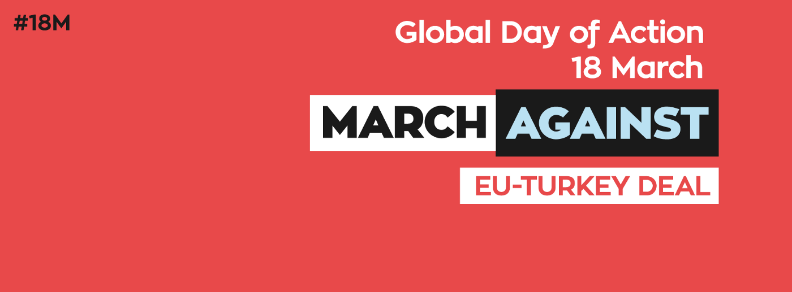

### Greece

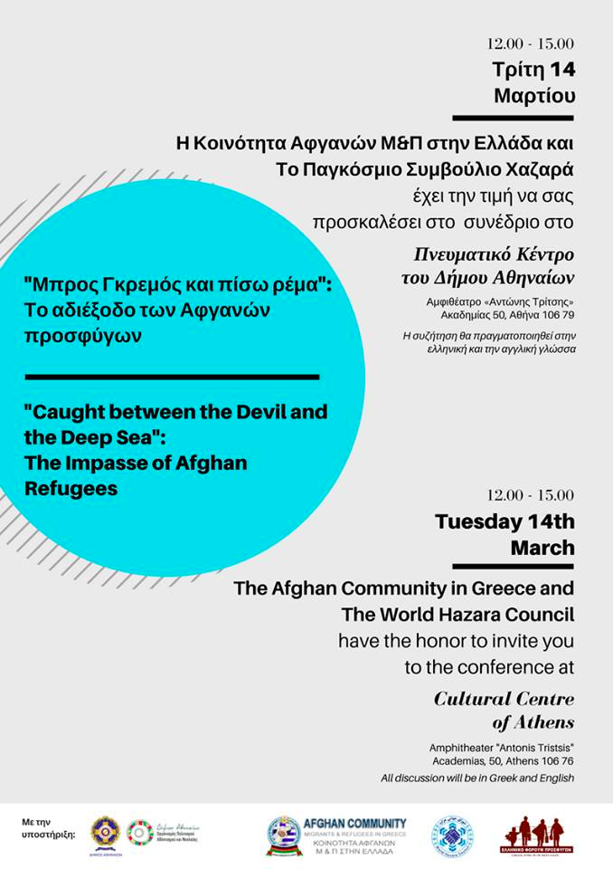

**Tuesday 14th from 12AM to 3PM —** [Caught between the Devil and the Deep Blue Sea: the impasse of the Afghan refugees](http://solomon.gr/project/conference-by-afghan-community-in-greece/) : Conference by the Afghan community in Greece on the situation the country is facing and the rights of Afghan refugees\.

_Address: Cultural Centre of Athens, Amphitheater “Antonis Tristsis, Academias 50, Athens_

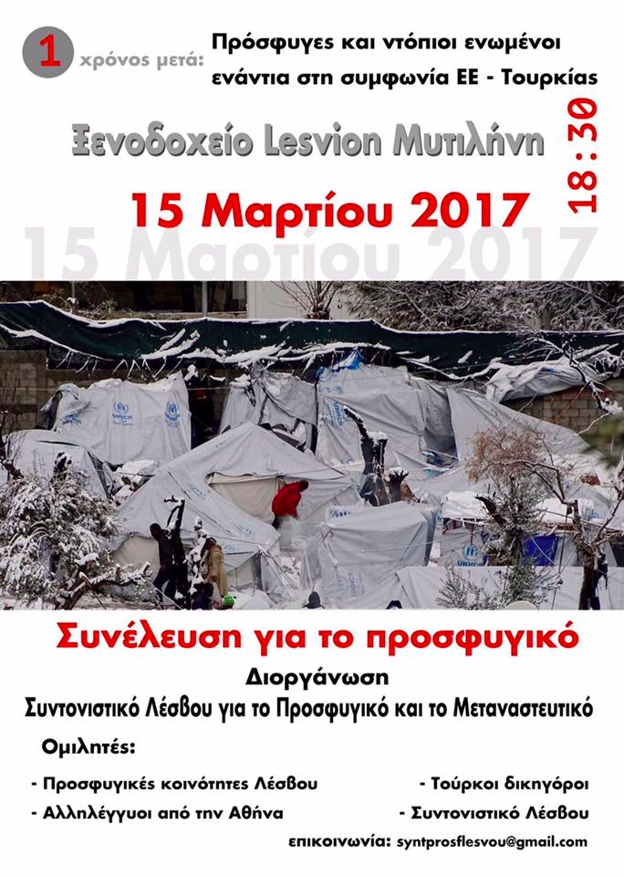

**Wednesday 15th from 6:30PM to 8PM** — Refugees and locals are coming together in a unique People’s Assembly in Mytilene to denounce the impact of the EU\-Turkey deal on their everyday lives\. At the assembly, Moria refugee community leaders will present their open letter to European Union government leaders\.

_Address: Lesvion Hotel Mytilene_

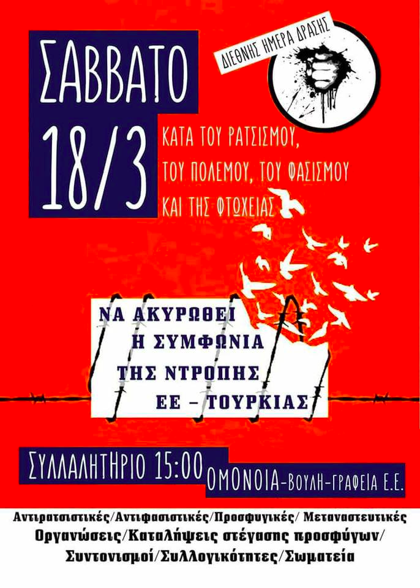

**Saturday 18 from 3PM to 7PM** — [March against Fascism, Racism, Austerity and the EU — Turkey deal](https://www.facebook.com/events/364263960626344/) : One year after the signature of the EU\-Turkey deal, City Plaza is calling for a European mobilization against the agreement and for a protest against racism towards refugees and immigrants\. Many organisations throughout Europe have answered the call and most of these events can be found on this [map](https://www.google.com/maps/d/u/0/viewer?mid=1clpJX1_iDx-Gici5cfdLFZcLuvU&ll=43.35453150000002%2C-2.670948400000043&z=8) \.

_Address: Omonia Square, Athina 104 31_

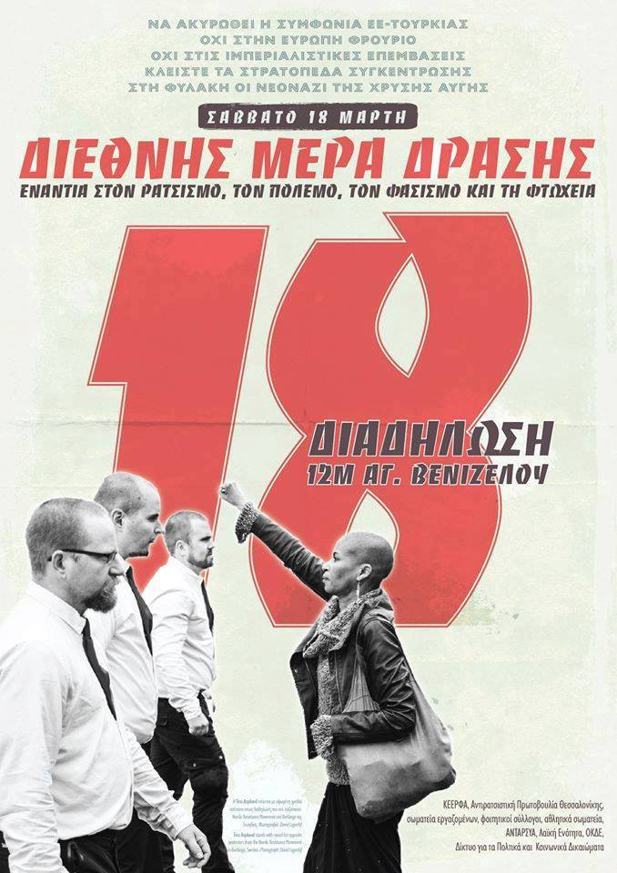

**Saturday 18th from 12PM** : Antifa demo against the EU\- Turkey Deal\.

_Meeting point: in front of the Venizelos statue, Egnatia 78, Thessaloniki_
### Germany

**Friday 17th from 7PM** — [Grenzen überwinden\! Von der Seenotrettung bis zur Solidarischen Stadt](http://www.frankfurter-info.org/termine/grenzen-ueberwinden-von-der-seenotrettung-bis-zur-solidarischen-stadt) : Roundtable with Ruben Neugebauer from Sea Watch on how to resist against migration policies, one day before the international day of action against the EU\-Turkey deal\. _Address: Exzess, Leipziger Str\. 91, Frankfurt_

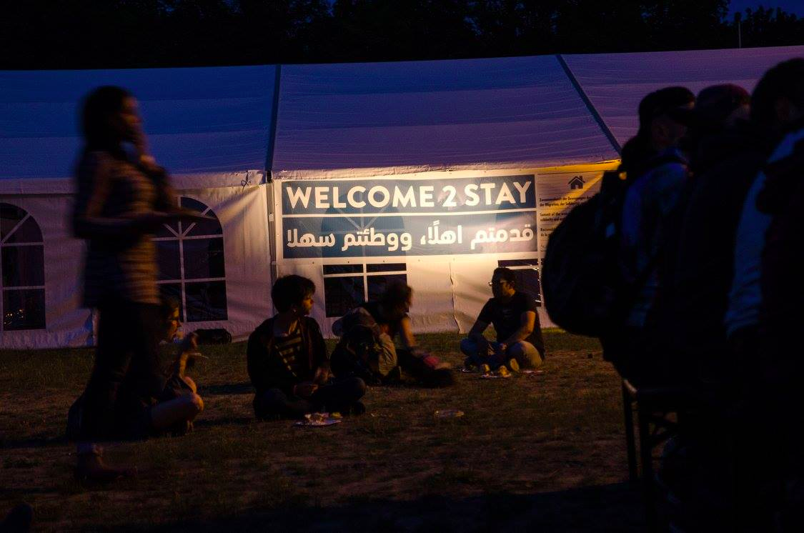

**Saturday 18th of March** — The European system of exclusion is getting more and more brutal\. Germany is going ahead with more and more deportations\. Welcome2Stay is calling for nationwide days of action for a right to stay and equal social rights for everyone from 18th to 23rd of March\. The weekend of the 18th of March was chosen after a call for action by the Hotel City Plaza in Athens\.
- **12PM to 4PM** — [Welcome2Stay Berlin Abschiebefrei — Grenzenlos Solidarisch](https://www.facebook.com/events/1325531260823322/) The Berlin\-Schönfeld airport is not only an important transport junction of the capital, but also a hub of the European border regime\. A massive increase of deportations is looming in the coming months: thousands of Afghans are to be sent back to a country still ravaged by war\. The protest will show another vision of Berlin at Schönefeld Airport, a Berlin in which migration is not a threat, in which “welcome” is not a question of the political climate, but includes the real possibility to stay\. _Address: Flughafen Berlin Schönefeld, 12529 Schönefeld, Brandenburg_
- **3PM to 5PM** — [Asylrecht und Flüchtlingsschutz jetzt und hier\!](https://www.facebook.com/events/1492630234080987/) Protest against deportations and Dublin transfers\. _Address: Nauener Tor, 14467 Potsdam_
- **12PM to 3PM** — [Welcome2Stay and](https://www.facebook.com/events/1807357119527993/) [Equal Rights For All — Bündnis Bremen](https://www.facebook.com/buendnisequalrightsforall/) : [Demonstration gegen Abschiebung und soziale Ausgrenzung](https://www.facebook.com/events/1807357119527993/) : The protest stands in solidarity with Afghani and other refugees to resist the injustice of deportation and to resist the forced exile of a people who have braved the deadly waters and dangerous borders, only to be told Afghanistan is a safe country\. _Address: Am Brill, 28195 Bremen_
- **From 10AM** **until the 23rd of March** — [Welcome 2Stay Aktionstage Leipzig](https://www.facebook.com/events/697045043788698/) : Events all over the city of Leipzig, including demonstrations, information meetings, workshops\.
- **From 4PM —** [My Religion? Solidarity\! — Hamburg](https://www.facebook.com/events/247950612297220/) : Talks and debates about the concept of “solidarity”, with guest Firas Alshater who will read from his book “Ich komm auf Deutschland zu”\. The event will be followed by a solidarity party, with all proceeds going to [Café Exil](https://www.facebook.com/CafeExilHamburg/) , which advises and support refugees and migrants\. _Address: Gängeviertel, Valentinskamp 28A, 20335 Hamburg\._
- **From 12PM to 3PM** — [Lübeck for ALL\!](https://www.facebook.com/events/288035708298038) : Conferences, music and happenings, for an inclusive city and against deportations\. _Address: Lübecker Flüchtlingsforum, Willy\-Brandt\-Allee 11, 23554 Lübeck_
- **From 2PM** — Flughafen Protest Frankfurt: Protest against deportations\. _Meeting point: Frankfurt Airport Terminal 1, Departures, area B_
- **From 6PM to 9PM** — [1\. Jahrestag „EU — Türkei — Deal“](https://www.facebook.com/events/1394966883897062/) : Part of the “DUBLIN4EVER” action week, this conference will explain the background and new developments of the EU\-Turkey deal\. Other events, taking place until the 23rd, can be found [here](https://www.facebook.com/events/1354716881260399/) \. _Address: AZ Conni, Rudolf\-Leonhard\-Straße 39, 01097 Dresden_

### Italy

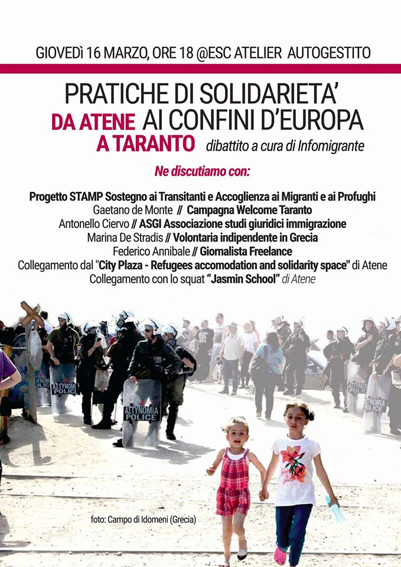

**Thursday 16th from 6PM to 10PM** — [Solidarity practices on the borders of Europe — from Athens to Taranto](https://www.facebook.com/events/1859822960938306/) : Before the International Day of Action on the 18th, a discussion will take place with activists from Italy and Greece, including activists from City Plaza and Jasmin School in Athens\. _Address:Esc Atelier Via dei Volsci, 159 — San Lorenzo, 00185 Rome_

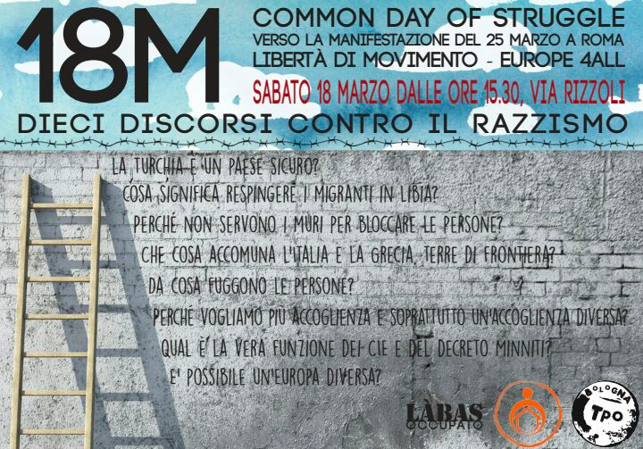

**Saturday 18th from 3\.30PM to 5\.30PM** — [Ten speeches against racism and the closed borders](https://www.facebook.com/events/1346716918725320/) : Ten questions and ten speeches on the occasion of the International Day of Action against racism, fascism, austerity and the EU — Turkey deal\. The questions include “is Turkey a safe country? What does it mean to repel migrants to Libya? Is a different Europe possible?

_Address: Via Francesco Rizzoli, 40125 Bologna_

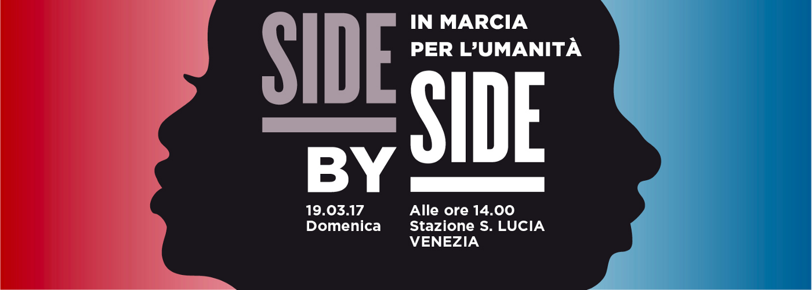

**Sunday 19th from 2PM —** [Side by Side — in marcia per l’umanità”](http://www.meltingpot.org/Sunday-March-19-2017-in-Venice-Side-by-Side-marching-for.html#.WLfpJbGZMdU) **:** March for migrants’ rights and for the creation of a better reception system in Italy and specifically in Veneto\. Part to a wider call by Refugees City Plaza in Athens to mobilize against the EU — Turkey deal\.

_Meeting point: In front of the railway station Santa Lucia in Venice_
### France

**Saturday 18th from 10AM** — National meeting of refugees and migrants: Day of discussions for migrants no matter their administrative status\. The goal is to define a united political base to break the isolation and the divisions that are produced by government policies\. Participants will be divided in three groups to discuss problems of housing, problems of work and problems of undocumented people\. **This is an event for migrants and refugees\.**

_Address: Ecole Normale Supérieure \(ENS\), 45 rue d’Ulm, Paris_
#### UK

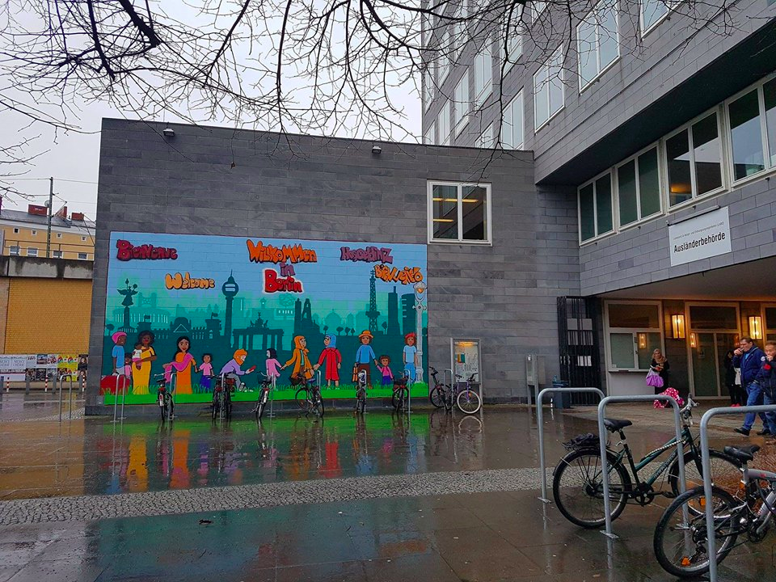

**Thursday 16th from 7PM to 9PM** — [Report launch: Refugees and asylum seekers in Berlin](https://www.facebook.com/events/1353803427973230/?ref=1&feed_story_type=279&action_history=%5B%7B%22surface%22%3A%22permalink%22%2C%22mechanism%22%3A%22surface%22%2C%22extra_data%22%3A%5B%5D%7D%5D) : Join the Refugee Rights Data Project for the launch of its latest report relating to refugees and asylum seekers in Berlin, Germany\. The research took place in December 2016 and January 2017 across a number of camps and accommodation centres in Berlin\. The findings highlight a number of successful approaches taken by the German government in relation to refugee reception, as well as a few areas for concern raised by respondents\.

_Address: Goethe\-Institut London, 50 Princes Gate, Exhibition Road, SW7 2 London_

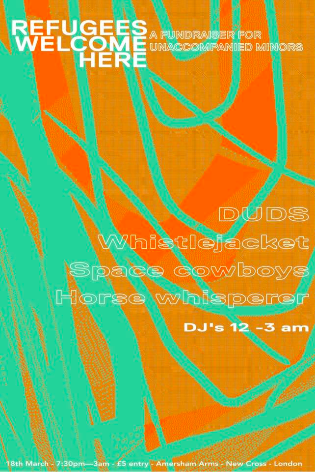

**Saturday 18th from 7:30PM to 3AM** — [Refugees Welcome Here](https://www.facebook.com/events/375418872828887/) : A night of bands and DJs in support of the Dunkirk Legal Support Team and the ‘Unofficial’Women and Children’s Centre for their work with unaccompanied refugee minors in the UK and France\.

_Address: Amersham Arms, 388 New Cross Road, SE14 6TY London_
### Denmark

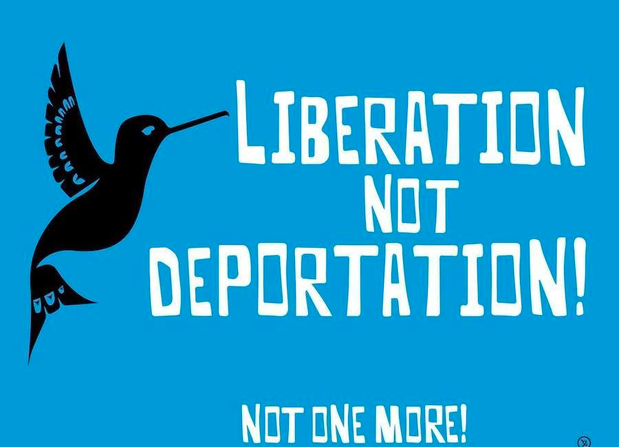

**Friday 17th from 6PM to 1AM** — [Support Party for Deportees: Stop Deportations to Afghanistan](https://www.facebook.com/events/241920259545006/) : An evening of solidarity with those subject to Denmark’s inhumane deportations\. Proceeds will go towards a safe house for deportees in Kabul\.

_Address: Folkets Hus, Stengade 50, Nørrebro_
### Finland

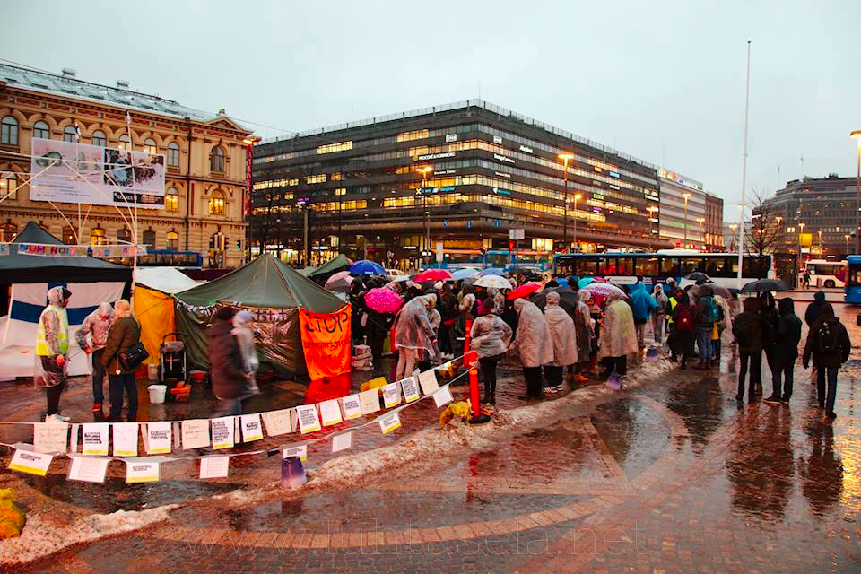

**Until 23rd of March:** [Right to Live — Oikeus elää](https://www.facebook.com/events/1735675453409402/) : A group of asylum seekers in Finland has decided to step out from reception centers because of the Finnish Government’s and the Finnish Immigration Service’s policies\. Their tent at the Helsinki Railway Square symbolizes their displacement and the search for home and safety\. You are welcome to join them and their demands including:
- Their opposition tothe random and unjustified negative decisions from the Immigration Service\.
- Their opposition tothe compulsory return policy for asylum seekers in Finland\. Violent treatment and locking the asylum seekers in solitary confinement cells to force them to leave, must come to an end\.
- Their opposition to the fact that asylum seekers are kicked out of the reception centers and cut off from financial aid and access to basic services after receiving a negative decision\.

_Address: Rautatientori, 00100 Helsinki\. Protests all over Finland\._

_Converted [Medium Post](https://areyousyrious.medium.com/this-weeks-solidarity-events-in-europe-20bd2088f697) by [ZMediumToMarkdown](https://github.com/ZhgChgLi/ZMediumToMarkdown)._
