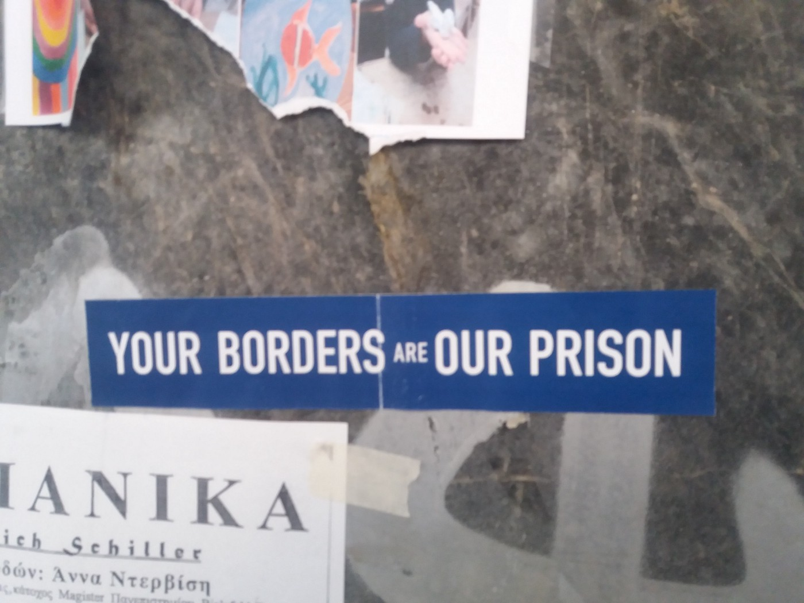

### **AYS SPECIAL: Slow reunification process leaves families separated for a long time**

_Due to slow and complicated process in many European countries, families are left separated for months, in some cases over a years\. Additionally, when decision is made, families are entering another round of complications for them in order to be able to reach their loved once\. Complicated and slow process is another way for many European countries to keep their borders tightly closed while promising protection of basic human rights\._

Photo AYS

Ali \(8\) and four of his brothers and sisters \(the oldest 12, youngest 4\) have not seen their father for over one year\. The most part of that time, they lived in an ugly camp in Samos, one of the Greek islands where refugees are forced to live\. At the beginning of December last year, they moved to Athens and now they live in a small room in a shared apartment\. They all left Syria two years ago\. In Turkey they were separated when their father went to Austria, hoping to bring his family in through the reunification program\. But 12 months later, his wife and children are still waiting and slowly losing hope it will happen any time soon, even though they got the approval from Germany in October last year\. However, they are still waiting the precious call from [Greek Asylum Service \(GAS\)](http://asylo.gov.gr/en/?page_id=39) with the notification about when they will finally be able to leave\.

Slow reunification process, which is covered by [Dublin Regulation](http://www.unhcr.org/protection/operations/4a9d13d59/dublin-regulation.html) , is a huge cause of frustration for families in Greece\. In the past, a vast number of human rights organizations, but also UNHCR, urged countries to speed up the process\. In some cases, like in Austria, the process can take up to three years\. But little has changed since then\.
#### **Long and complicated procedures**

The number of families who were reunited in this way is not available because their applications are not separated from other legal categories\.

By the rules, people in Greece have three months after they apply for asylum to apply to the other EU country for family reunification\. The other country has another two months to respond\. After a positive decision, Greece has six months to send people to the country in question\. In total, the maximum time should not exceed 11 months\. But, in some cases this process lasts much longer since it took a long time for people to apply for asylum after they arrived in Greece\.

Additionally, the regulations applying to families vary from country to country\.

Sadaf \(62\) and her husband Naadir \(65\) have two sons, and a daughter, and five grandchildren in Finland\. Recently their request for reunification was rejected with the explanation that they are not “the nuclear family eligible for reunification”\. Now they live in Athens, separated from the rest of their family\. However, they were told that once they get their asylum status, which should be soon, they will be able to visit their family, but they will be able to stay no longer that three months\. Additionally, once they get the asylum cleared, they will have rights as all Greek citizens have, which for them means losing the support they receive as refugees, meaning cash cards and accommodation\. There is a possibility that they will find a job that will enable them to support themselves, with the current situation in Greece, this is almost non\-existent\. But more than anything, they will be separated from their family\. However, they live only for that moment when they will be able to travel to see them, barely accepting any kind of integration in the society\.
#### **Costly travel arrangements**

These are just some of the issues people who are waiting for reunification are experiencing\. Besides the lengthy and complicated process, when the decision finally comes, there is a huge possibility they will have to pay for their travel \(See [recent case](https://www.generosity.com/sports-fundraising/help-a-syrian-family-reach-germany--2) \) \. From time to time, GAS does cover these expenses — like for all those who will travel in March — but many people have to find their own way to cover their flights\. Greece has been criticized for this practice in the past\.

Families are separated for a long time by EU regulations\. Photo AYS\.

Additionally, there is only one travel agency they can contact for issuing tickets for reunification flights — Himalaya agency in Athens\. This agency won a public bid in 2015\. The agent AYS spoke with, confirmed that more than 80 percent of plane tickets for refugees in reunification program were bought through this agency\. They also receive private data for passenger and case numbers from GAS, in order to be able to process it in order to issue the tickets\. All of the tickets are “flex” \(ticket that are easy to adjust and that allow more baggage than usual ones\) with the explanation that due to complicated procedure and lot of baggage, that is the best option for all\. These tickets are usually much more expensive than the regular ones\.

In some cases, refugees were paying for themselves, in others they have found donors — usually among volunteers — and in some cases GAS found donors from big organizations\. We spoke with a number of refugees who were told they had to pay for themselves upon the instructions they got from GAS\. In one case, a person told us that he wanted to buy the ticket for himself online or with agency he wanted to deal with, but GAS told him that he cannot do that but has to wait and do it through Himalaya agency\.

A volunteer who paid for a family of five, told us that she had to buy a ticket via Himalaya Agency, and had a problem to pay with the air miles even though they were available\.

The existing Dublin regulation, [Section VI on transfers](http://eur-lex.europa.eu/legal-content/en/ALL/?uri=celex%3A32013R0604) , precisely art\. 30, clearly states that applicants “ _\[…\] shall not be required to meet the costs of such transfers\._ ” If the state provided tickets for refugees, applicants would be able to transfer faster, and more importantly, would not have to spend money they desperately need, having in mind that refugees and asylum seekers cannot work for a very long period of time\. In the case of Germany, there was a possibility that about 30 percent of costs could be reimbursed after arrival\.

Greece is obliged to respect this regulation, but the state obviously chose to disregard it with the explanation that they cannot afford that\.

AYS tried to get explanation about this practice from GAS, but received very short answer with no details\. “ _The Greek Asylum Service carries out all the necessary administrative steps\. Airliners are selected on the basis of the availability of direct flights to the final destination and on the availability of places dedicated to persons traveling with laissez passer documents\. Price depends on the fact that they also need to carry their luggage, thus light traveling options are excluded\. Some applicants e\.g\. minors need escorts to the final destination and in those cases the Greek Asylum Service provides for the required arrangements for the minors and/or the people with severe medical problems to be transferred safely to their final destination\.”_

Even though we ask for additional clarification of the process, we never got reply from GAS\.

The procedure for people who are traveling for reunification is also very complicated\. According to the Dublin Regulation, these are so\-called “escorted transfers”\. The persons traveling do not have any personal identity documents, other than the specific “laissez passer” document, for which airlines set specific restrictions\. Those who are traveling are picked up by the Hellenic Police and driven to the airport\. The police officer escorts the applicants to the check\-in counter\. Once the boarding passes are issued, the escorting officer hands in the boarding passes, the laissez\-passer and the applicant’s “asylum seeker’s card” to a police officer at the airport\. The latter escorts the applicant into the aircraft, hands in the required documents to the captain of the aircraft and the applicant boards the aircraft\.

To reunite with their families is the only desire many people who fled war and poverty, and have lost everything, are hoping for\. This should not be difficult and complicated, but a simple and small thing any state can do, if they wish to do that\. International regulations permit them to allow families to be reunited\. Ali and his sisters and brothers, as well as Sadaf and Naadir, deserve to be with their loved once, as well as any of us\. But complicated bureaucratic procedures only work to keep these families apart at a time when the one thing they need is healing time together\.

\(See also AYS [story on Mohammed and his family](https://medium.com/@AreYouSyrious/ays-special-meet-mohammed-one-father-struggling-to-reunite-his-family-863de6885f40#.9nlhk4tkq) who are waiting for reunification for over a year\) \.

_Converted [Medium Post](https://medium.com/are-you-syrious/slow-reunification-process-leaves-family-separated-for-a-long-time-185e5835e73d) by [ZMediumToMarkdown](https://github.com/ZhgChgLi/ZMediumToMarkdown)._
