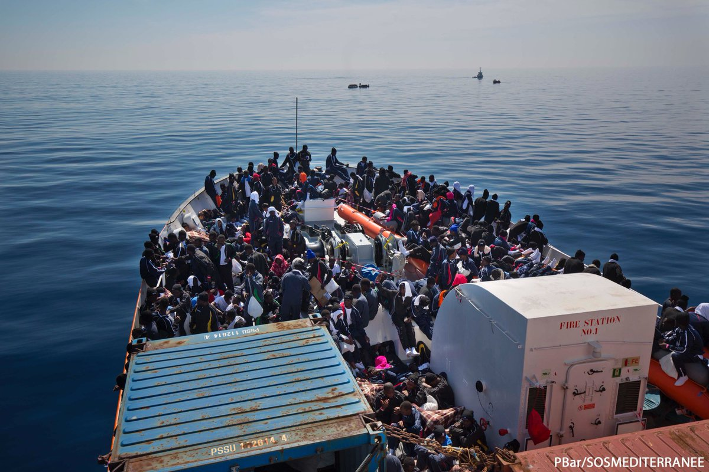
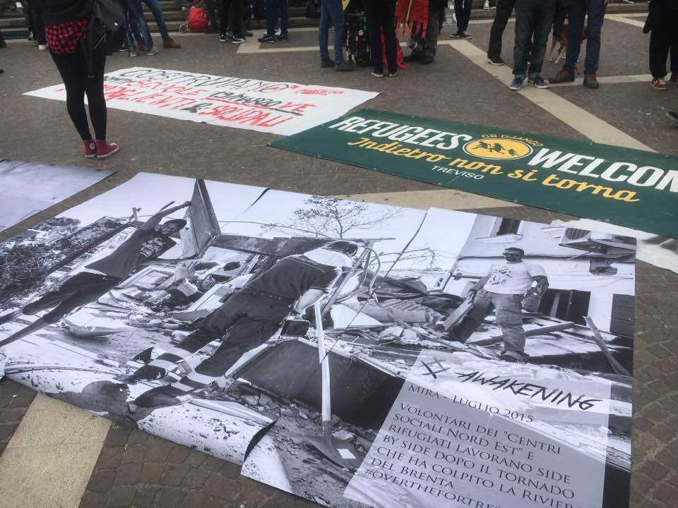
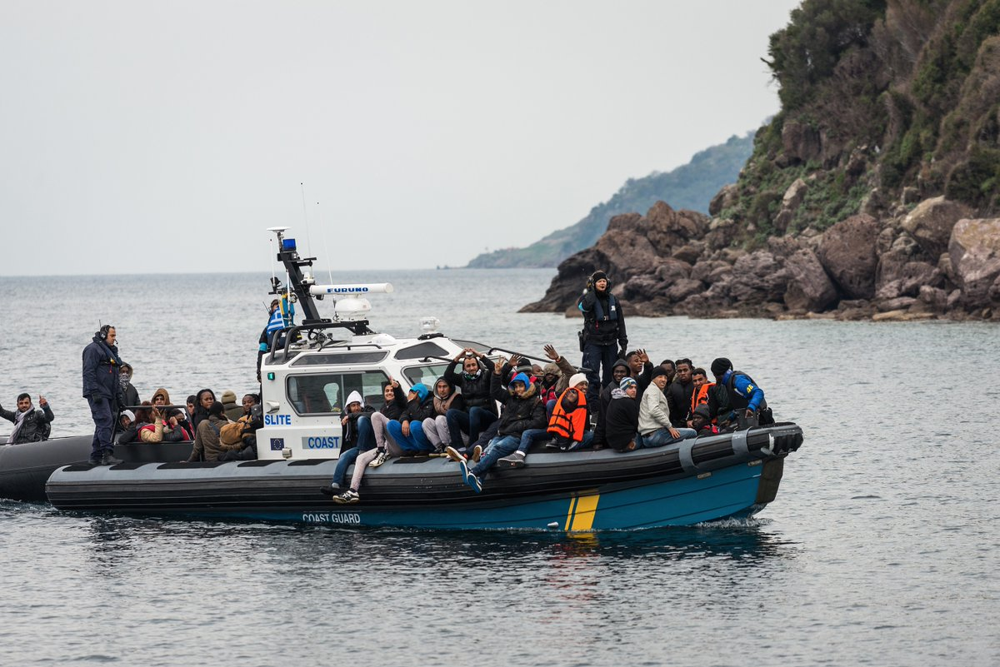
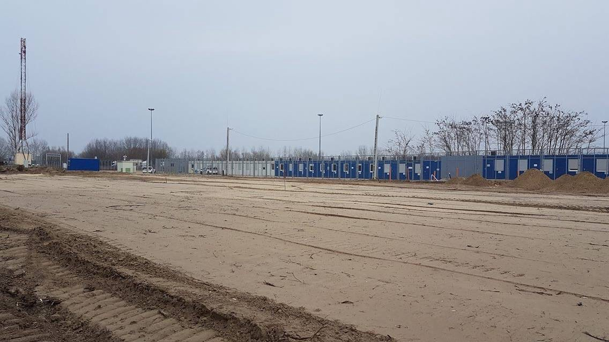
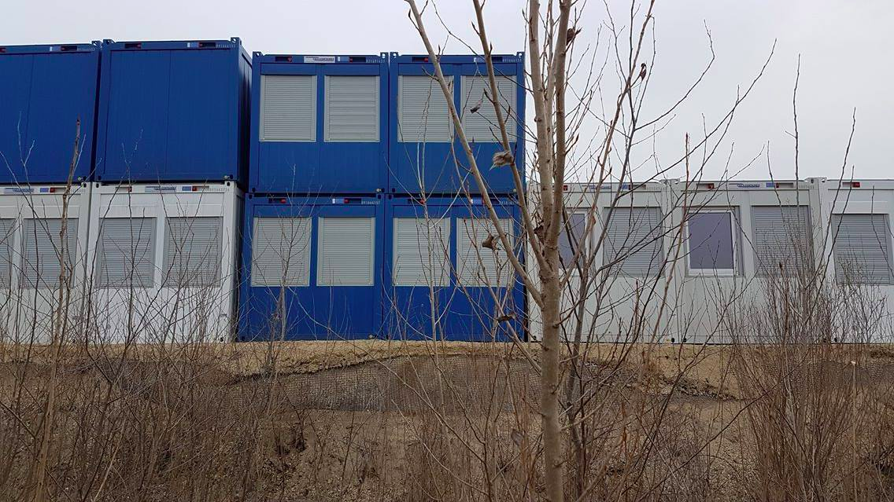

### AYS DIGEST 19/03/2017: 946 refugees rescued and brought on board the Aquarius

_Equipment problems for refugees hosted in apartments // 4,000 people present during ‘Side by Side’ protest in Italy // 946 people rescued in the Mediterrenean and brought aboard the Aquarius today\._

### Feature

946 people, including almost 200 unaccompanied minors, were brought from nine separate rubber and wooden boats to the “Aquarius”, a boat operated in partnership by MSF and SOS Mediterranée\. More than 250 people were brought aboard the “Sea Watch 2”\.

“Imagine how difficult it is to spot a boat this small in the enormity of the Mediterranean at night” — Photo by SOS Méditerranée

The [Middle East Monitor](https://www.middleeastmonitor.com/20170318-italy-panics-as-north-africa-migrants-surge/) reports that Italy will host a meeting between European and North African countries next week in a bid to strengthen support for an agreement it struck with Libya, whereby it would provide Libya with money, training and equipment to help it “fight people smugglers”, effectively preventing refugees from leaving the country\. The paper also notes that Italy and the EU have promised to fund refugee camps on Libyan soil, despite UN chiefs saying that _“migrants and refugees in detention \[in Libya\] are held outside any legal process and in conditions which are generally inhuman\. They are exposed to malnutrition, extortion, torture, sexual violence and other abuses”\._
### Italy
### 4,000 participate in “Side by Side” protest

4,000 people participated in today’s “Side by Side” protest in Venice\. The protest answered the call of City Plaza to create a web of European solidarity marches on the anniversary of the EU\-Turkey deal but also argued for a better reception system, especially in Veneto\.

The protest allowed refugees themselves to make their voices heard\. One Malian refugee talked about his difficult living conditions in the centre “Caserma Serena” ‏ near Treviso, due to the lack of proper care for sick people, the lack of opportunities to learn the language and abusive behavior by the centre’s staff\. Another refugee explained how “the whole reception system is the opposite of what we call self\-determination” and talked about his project, Talking Hands, which promotes “integration through craftsmanship” and were “all the decisions are taken together, without any form of discrimination or prejudice: nationality, religion, gender”\.

](assets/1ee1bbf6dd7d/0*IGWXO1h74dhwH7e2.)

Photo by [Talking Hands](https://www.facebook.com/OpificioTalkingHands/)
### Refugee electrocuted on the roof of a train

[Ecoinformazioni](https://ecoinformazioni.wordpress.com/2017/03/19/frontiera-assassina-un-altro-ragazzo-africano-fulminato-al-confine-italo-svizzero/) reports one 22 year old man from Cameroon was electrocuted and badly injured on top of a train on Saturday while trying to cross the border with Switzerland\. This comes after [a similar incident a few weeks ago](https://www.thelocal.ch/20170228/man-found-dead-on-roof-of-train-travelling-from-italy-to-switzerland) , when a man was found dead on the roof of a train, apparently electrocuted by the train’s live cables as it passed through a tunnel between Como in Italy and Chiasso in Switzerland\.

Meanwhile, Swiss Authorities say that the number of refugees sent back to neighboring countries has increased from 8,309 in 2015 to 26,267 in 2016 — Switzerland sends back refugees who opt not to ask for asylum in the country on the basis of “readmission agreements”\.
#### Greece

25 new refugees arrived on Chios last night, including 12 children\. One boat with 56 people arrived on the north coast of Lesvos this morning\.

Photo by Lighthouse Relief
### Lack of equipment for refugees hosted in apartments

Independent volunteers have complained about the lack of assistance given to refugee families after they got moved from hotels to apartments in northern Greece by the Norwegian Refugee Council\. Several families were provided with insufficient blankets, forcing other families and volunteers to step in and help at the last minute\. One volunteer says it is the second family that it knows of that wasn’t provided with enough blankets and other important household items\. Another volunteer says that families were provided with insufficient household items including, noting that while living in apartments has some undeniable benefits, the move can leave some of them more isolated\.

In an article on the NRC’s housing programme, [IRIN](https://www.irinnews.org/feature/2017/03/13/syrian-refugee-family%25E2%2580%2599s-year-long-greek-odyssey) also notes that “ _for now, furnishings are sparse_ ” with the manager of the programme Anne Forget saying “ _it’s mattresses on the floor; one mattress per person, one pillow per person, a fridge, a double stove… There’s no tables, no chairs, no frames, even, for the beds and no Wi\-Fi_ ”\. The website says that the family in question in the article “ _doesn’t seem to mind”_ as for the first time “ _they have a space of their own_ ”\.

Regarding their housing plans, the NRC has written that _“housing the most vulnerable among the refugees in apartments \(…\) is a priority\. The plan is to move 2,100 people living in camps and hotels around Thessaloniki into apartments by the end of the year\. The project is funded by the European Commission until the end of July, with a budget of 1\.8 million Euro”\._

In a study on “adequate urban housing for refugees”, written by consulting firm ETC for the NRC in November 2016, the authors warned that “ _the project has set a highly ambitious target as housing 2,100 people, or 420 families, in nine months seems a difficult challenge”_ and insisted that an adequate proportion of social workers is necessary to follow\-up on the families’ needs\.
#### Bosnia
### Bosnia as an alternative transit route

During January and February, around 100 people were registered in Bosnia\. Last year in the same time period it was only 40\. The head of Bosnia’s Service for Foreigners’ Affairs considers this a significant increase and predicts that even more people could arrive in the near future\. “Migrants are moving in two directions now, toward Romania and Bosnia, and it can signify a change of the route\. Many migrants are in Serbia for a very long period of time, and they are unhappy because of that and they will look for every possible way to continue their journey toward the promised land,” head of the service Slobodan Ujic said\.
#### Hungary
### Construction of container camp starts in Röszke

The Hungarian government has started building a container camp in Röszke, in order to detain all asylum seekers\.

Photo by Amnesty International Hungary

The Hungarian government insists that it will stick to its migration policy\. Chief Security Advisor to the Prime Minister, György Bakondi, also announced that Hungary will be appealing the preliminary ruling by the European Court of Human Rights, according to which two asylum\-seekers from Bangladesh were unlawfully detained for 23 days in a transit zone on the southern border in 2015 and then expelled\.

A [statistical update](http://s3.amazonaws.com/ecre/wp-content/uploads/2017/03/16143127/AIDA_2016Update_Dublin.pdf) published by ECRE’s Asylum Information Database shows the number of Dublin transfers to Hungary has dropped from 1,402 in 2015 to 513 in 2016 even though the country remains among the top recipients of Dublin requests by Germany, Sweden and Austria\. The report says that _“the decline in Dublin transfers to Hungary could be related to increasing pronouncements by national courts and appeal bodies on risks of ill\-treatment contrary to the fundamental rights of the individuals concerned\. Since the enactment of restrictive amendments to the Hungarian Asylum Act in the summer of 2015, administrative authorities and courts in at least 15 countries have ruled against Dublin transfers to Hungary”_ \.
### Scotland
### 200 refugees resettled to Scotland

[STV](https://stv.tv/news/west-central/1383267-more-than-200-syrian-refugees-arrive-at-glasgow-airport/) reports more than 200 Syrian refugees have arrived at Glasgow Airport on a charter flight as part of the UK Government’s Vulnerable Persons Resettlement \(VPR\) scheme\. More than 5,500 refugees have been resettled under the scheme so far and the UK government said it remains on track to meet its commitment of resettling 20,000 Syrians by 2020\.

Individuals selected for resettlement are often among the most vulnerable, with the UNHCR saying that 24% of refugees submitted for resettlement are survivors of violence and/or torture\. The Refugee Council adds that Britain offers no ‘asylum visa’ , meaning there are no safe, legal ways for a refugee to reach Britain in order to claim asylum\. Unlike resettled refugees, refugees who claim asylum in Britain have often undertaken a perilous journey at the hands of smugglers before arriving here\.

The EU, despite its rhetoric of wanting to save lives and fight against smugglers, has resettled very few refugees so far\. Less tha14,000 have arrived as of the 6th of February under the European Resettlement Scheme from July 2015\.

_Converted [Medium Post](https://areyousyrious.medium.com/ays-digest-19-03-946-rescued-and-brought-on-board-the-aquarius-1ee1bbf6dd7d) by [ZMediumToMarkdown](https://github.com/ZhgChgLi/ZMediumToMarkdown)._
