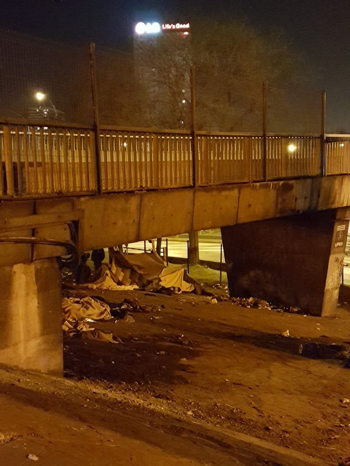
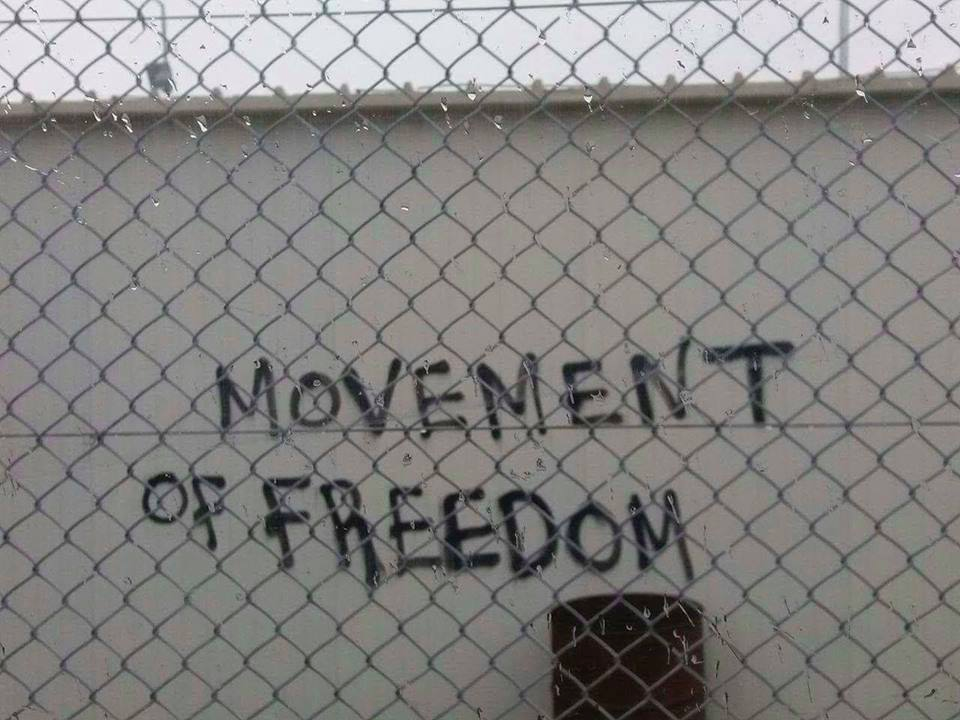
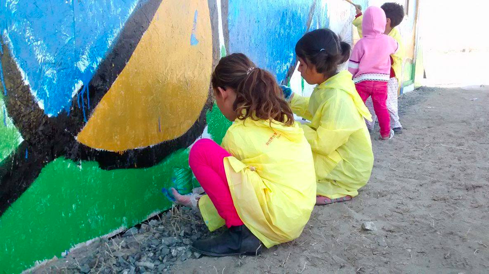
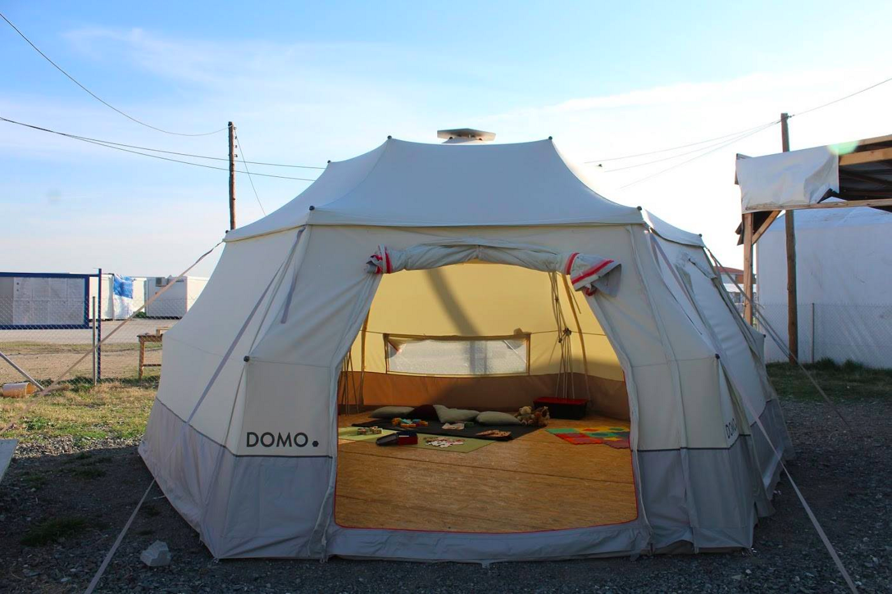
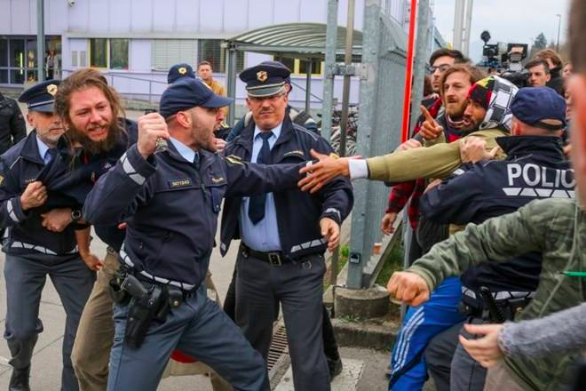
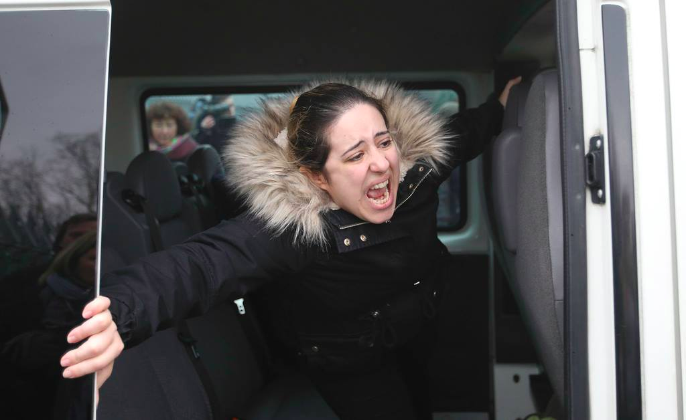
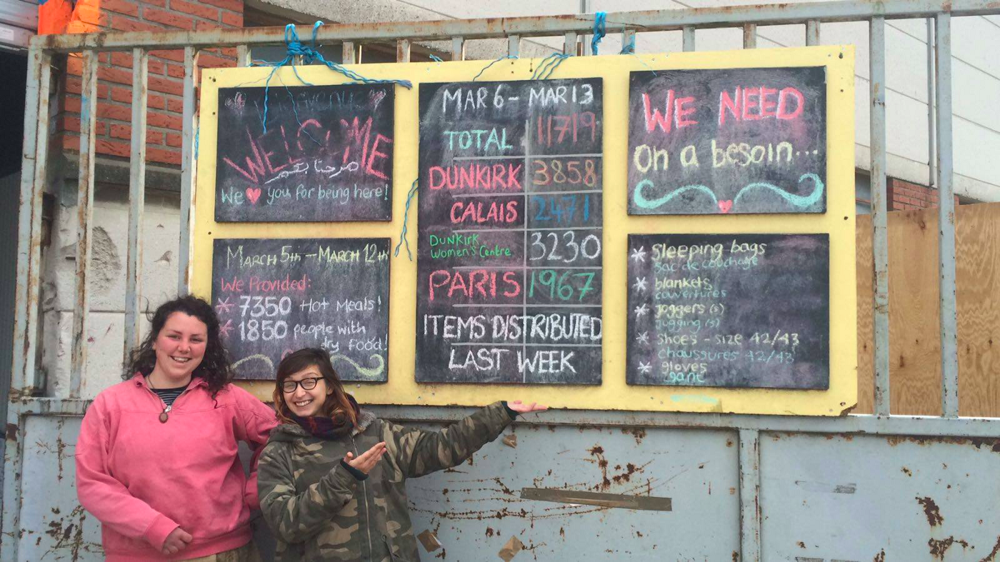
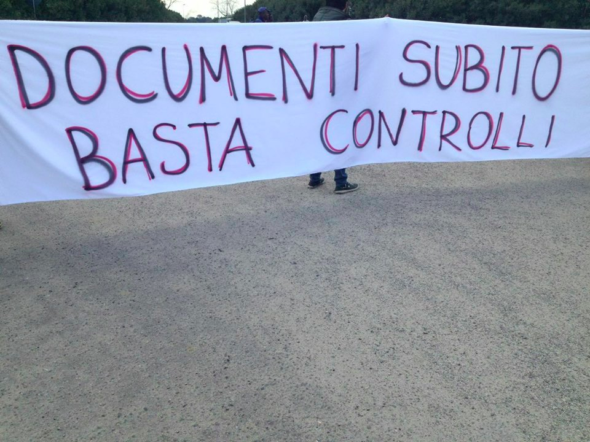

### AYS DIGEST 22/03: Refugee children live in “abysmal conditions”

Photo by Joao Pequeno

_Family deported from Slovenia to Croatia//Refugees flee Hungary before new legislation is enacted//Court suspends ban on food distributions in Calais//_
### Council of Europe report says children are “vulnerable to neglect and violence”

A new [report](https://search.coe.int/cm/Pages/result_details.aspx?ObjectId=09000016806fdd08) by the Council of Europe says unaccompanied children in Europe are living in “ _abysmal conditions_ ” and are “ _vulnerable to neglect and violence_ ”\. The organisation undertook four fact\-finding missions to Greece, Macedonia, Turkey, northern France and Italy\. Paris, London and several accommodation centres in the north of France were also visited\.

The report raises concerns over several issues, including age assessment\. While it says that age assessment measures are necessary for unaccompanied children to access special protection, the report argues “ _such measures are not always comprehensive because psycho\-social aspects appear to be neglected_ ”\. **This seems to apply to the situation in France and Paris in particular** , were the responsible service denies protection to many children, often arguing they lack the ID papers that could prove they are underage, even though they clearly still look and behave like children\. Volunteers have said that children as young as 13 have been rejected, leading them to sleep in the streets, become victims of violence, or simply disappear for good\.

The report also notes that “ _immigration detention is never in the best interests of the child,_ ” but that “ _migrant and refugee children are detained and many are separated from a parent who is placed in immigration detention_ ”\. **In Bosnia for example, we wrote that [children are put in detention\-like facilities](https://medium.com/@AreYouSyrious/ays-daily-digest-25-12-2016-refugees-in-bosnia-criminalized-and-kept-in-prison-like-facilities-8e0a530a5e45#.ov6lqz6nm)** and are not even mentioned in statistics, meaning that nobody knows how many are actually being detained\. **In Italy, the Ombudsman for imprisonned people expressed his concern about the detention of unaccompanied minors in a [new report](http://www.garantenazionaleprivatiliberta.it/gnpl/resources/cms/documents/bc9d71fe50adf78f32b68253d1891aae.pdf) \.** The lack of space in centres for minors means that they have to spend time in hotspots ranging from an average of five days in Trapani to 15–20 days in Pozzallo\.

Other major criticisms found in the report include the lack of appropriate legal aid for children, the exposure to violence “ _as a result of state action and inaction,_ ” and the lack of access to education and healthcare\. While the report doesn’t mention concrete examples, a Save the Children [report](http://reliefweb.int/report/greece/tide-self-harm-and-depression-eu-turkey-deal-s-devastating-impact-child-refugees-and) on the impact of the EU\-Turkey deal mentions how exposure to violence leads to “ _deterioration in children’s mental health_ ”, and that some unaccompanied children live in “ _24\-hour survival mode_ ”, sleeping in shifts to try to stay safe\. The Council of Europe report argues that _“practical measures such as gender\-separate sanitary facilities, better lighting and child\-friendly spaces?”_ are needed, not only for children’s well\-being, but also to eliminate risks of sexual abuse\.
#### Greece
### The “cages without a roof” of Vial

A few days ago, [Vice Greece](https://www.vice.com/en_nz/article/are-refugees-being-held-in-a-cage-in-a-greek-refugee-centre) published a photo of a cage holding adults and children within the Vial hotspot\. The Reception and Identification Service, when asked about the photo said “ _there are no cages within the RIS’s premises in Chios, nor any other type of construction that could be characterised as such, in any kind of way_ ”\. New videos of these cages have now emerged\.

In the same article, a spokesperson for the Ministry of Citizen Protection has called it a “ _fenced\-off space used to help us deal with newcomers”_ while a UNHCR spokesperson said “ _it is not a prison or a cage\. This ‘thing’ was created in August 2016 by local authorities in an effort to facilitate crowd management”\._ Obviously, no matter the name, the concern remains that a cage is not a way to welcome people in dignified conditions\.
### Three refugees try to swim to Chios

[Harekact](http://harekact.bordermonitoring.eu/2017/03/21/search-and-rescue-operation-for-three-refugees-who-allegedly-tried-to-reach-chios-swimming/) reports via [Era\-Aegean](http://www.era-aegean.gr/?p=25033) that on Monday evening, Greek coast guards were engaged in a search and rescue for three refugees who allegedly tried to swim from the Turkish shores to the island of Chios\. The rescue operation took place close to the islands Paspargos and Karfas\. A helicopter was involved but the rescue operation remained without success\. The three people could not be found\.
### Truckshop present in Lesvos

InterEuropean Human Aid Association \(IHA\) and Truckshop sent a team to Lesvos and were able to build a permanent clothing store in Moria camp in just a few days, thanks to the help of residents\. The shop allowed them to complete a mass distribution of clothing items and undergarments, while providing residents with choice\.

Photo by IHA/Truckshop

They say the situation inside Moria remains quite challenging but the situation is more stable now with a smaller population and the weather conditions being much milder\. They also say that more and more people are resorting to so\-called “voluntary returns”, with staff asking detainees in Moria daily whether they would like to volunteer\.

Photo by IHA/Truckshop

The clothing store Truckshop set up in a 40 ft container in Moria continues to run daily and the group urges all organizations working within camps in Greece to contact them if they would like assistance in establishing a store themselves — “c _lothing distributions that offer choice don’t need to be difficult and have many positive implications for both residents and the effective management of limited NFI resources”\._
### Update from Nea Kavala

As reported yesterday, with many new nationalities in Nea Kavala , the group “We are Here” says it hopes to adapt to the new situation and will need new book donations to give refugees, not matter the language, a chance to read\. Workshops were also organised to paint the walls of Drop in the Ocean’s “Drop Shop”, where refugees can exchange tokens for clothes\.

Photo by We are Here

Finally, the Women’s Space has a new creche — a “domo tent” were young children are entertained while mothers are busy with activities inside the Women’s Space\.

The new creche\. Photo by We are Here
### City Plaza statement on EU\-Turkey deal march

[City Plaza](http://solidarity2refugees.gr/18th-march-last-saturdays-big-international-mobilization-come/) , in a statement on the protests on the annniversary of the EU\-Turley deal, mentions how locals and refugees all over Greece mobilised against “ _racism, war, poverty and fascism”_ and expresses its satisfaction at the movement’s unity\. It also mentionned the protests all across Europe, which can “s _erve as a reference point for a systematic networking of European social movements_ ”\.
#### Hungary
### Refugees leave Hungary before new legislation comes into effect

[Budapest Beacon](http://budapestbeacon.com/featured-articles/refugees-flee-hungarian-camps-avoid-detention/45235) reports refugees currently housed in open camps are moving quickly to leave Hungary, with refugees who have spent months waiting for asylum decisions particularly worried about the prospect of being deported to Serbia once the new camp is set up\.

New legislation allows for the automatic detention of all asylum seekers currently in transit zones while refugees in camps across Hungary will all be moved to a new, closed camp along the border, where they will be housed in storage containers\.

The refugees cited in the article expect to receive negative asylum decisions once they are being put in a closed camp and fear of being deported to Serbia, with one saying “ _it feels like we’re already dead_ ”\.

Sources inside the Kiskunhalas refugee camp estimate that of the camp’s current 30 residents, only eight to ten will stay at the camp after the new law comes into effect\.

Photo by Syrious Help

The new legislation will come into effect on the 28th of March and from then on all asylum\-seekers arriving in Hungary will be put into detention at the Serbian\-Hungarian border\. Syrious Help says that the capacity of this detention camp is about 200 people, divided into three separate sections for single men, single women and families\. With 25 people allowed into the transit zones per week, the camp would be full within 2 months\. Syrious Help notes that the Hungarian asylum procedure generally has lasted for 4–9 months until now, and says _“it’s an open question what would happen if they can’t speed up the process in merit…”_

Hungarian authorities admitted 43 asylum seekers, mostly families from Afghanistan and Iraq, one family from Syria and three UASCs, into procedures at the Hungarian “transit zones” near the Kelebija and Horgos border crossings\. Fewer reports of collective expulsions from Hungary were received this week, with some asylum seekers alleging mistreatment by Hungarian authorities\. At the same time, the number of encountered collective expulsions from Croatia rose from 32 last week to 57 this week\.
#### Slovenia
### Family deported to Croatia

A Syrian family was deported from Ljubljana, Slovania, to Croatia this morning under the Dublin agreement\. They had arrived to Croatia by plane a year and a half ago and proceeded to Slovenia where they applied for asylum\. Their 1\-year old boy was born in Slovenia and the mother is severely depressed due to their situation\. Protests were organized in Ljubljana and there were clashes with police\.

Photo by Protirasistična fronta brez meja

The Slovenian rapper N’toko has described this “ _soul crushing experience_ ”, saying that after “ _an exhausting legal battle, the Slovenian high court chose to ignore the warnings of the European courts, ombudswoman and human rights groups, telling the family to fuck off to Croatia despite the mother’s health problems_ ”\.

Photo by N’Toko

He adds that “ _as they were being deported, we went to stand in front of the asylum home and placed ourselves before the van\. Police arrived and started to beat us and make way for the vehicle\. The family screamed and cried, only to be driven off at full speed\. This is what deportation looks like in real life, They try to make asylum rejections look like a neutral legal thing, but actually, they are an act of extreme violence against innocent people, even babies_
#### France
### Court suspends ban on food distributions in Calais

The Lille Administrative Court has ruled to suspend the order of the mayor of Calais to cease food distributions in designated parts of the city, arguing that the decision by the mayor has obstructed “ _the fulfilment of migrants’ vital elementary needs and their right not to suffer from inhuman and degrading treatment”_ \.

François Guennoc, of l’Auberge des migrants, says he will ask authorities to find a place were associations will be allowed to do distributions and help unaccompanied minors\. Help Refugees says that it will be meeting with their partners on the ground to discuss a strategy for the future and consult with the refugees themselves to find a safe location for the distribution of meals\.

Care4Calais notes that there is no evidence that the distribution of meals made since the beginning of 2017 is the cause of serious disturbances to public order\. The group also says that refugees do not go to Calais because of the prospect of finding a minimal amount of humanitarian aid, but because they want to join the UK — therefore, measures which have the effect of depriving a very vulnerable population of vital food aid are neither necessary nor proportionate to the objectives pursed by the mayor\.

Distribution goes on\. Photo by Help Refugees
#### Italy
### March in Rosarno

Migrants and seasonal workers living in the makeshift camp of Rosarno started marching towards the city of San Ferdinando today, to demand legal documents and to protest against the repressive operations of the police in the past few weeks\. They are blocking the major routes of the city until the Prefecture and the Interior Ministry gives them an answer\.

Photo by Comitato Lavoratori delle Campagne
### Suicide attempt in Ventimiglia

[Riviera 24](http://www.riviera24.it/2017/03/ventimiglia-respinto-dalla-francia-si-lancia-nel-vuoto-gravissimo-afghano-250160/) reports an Afghan refugee has climbed up a wall near the border police station in Italy and jumped, falling some ten meters\. The man had been pushed back for the eleventh time from the French border and was about to be taken to Taranto by bus\. He is severly injured and has been taken by helicopter to the hospital\.

_Converted [Medium Post](https://areyousyrious.medium.com/a-new-report-by-the-council-of-europe-says-unaccompanied-children-in-europe-are-living-in-abysmal-86bfe06eefbd) by [ZMediumToMarkdown](https://github.com/ZhgChgLi/ZMediumToMarkdown)._
