### AYS DAILY DIGEST 23/3/2017 — More lives lost at sea

_Another tragedy off Libyan coast / Increase in returns from Bulgaria and Macedonia towards Serbia / Update on BelgrAid centre — volunteers needed / The Emergency Center in Bolzano soon closing / Denmark’s government proposes a new law change_
### Another Mediterranean tragedy

Up to 250 men, women and children coming from Africa are feared dead on the Mediterranean tonight\. It is [reported](https://t.co/5g0tMHS5si) the people have probably drowned after a rescue boat found two partially submerged rubber dinghies off Libya, a spokeswoman for the NGO which operates the vessel said today\. Laura Lanuza of Spanish charity Pro\-Activa Open Arms [said](https://www.facebook.com/proactivaservice/posts/1452170701480443) its boat had recovered five floating corpses close to the dinghies, about 15 miles off the Libyan coast\. The overall number is yet to be determined, but it is already certain it will yet again be a devastating one\. To remind of the scale of recent arrivals by sea more often than not invisible in media reports — International Organization for Migration \(IOM\) published a [report](https://www.iom.int/news/mediterranean-migrant-arrivals-reach-20484-deaths-525) three days ago showing 20,484 migrants and refugees entered Europe by sea in 2017 through 19 March, with over 80 percent arriving in Italy and the rest in Spain and Greece\. On 19 March, 223 migrants, 57 of them women, two of whom were pregnant, sailing in two rubber boats were rescued off Tripoli\. On 20 March, about 120 and 200 migrants were rescued off Az Zawiyah, with reports of 10 bodies retrieved\. Some 559 people are estimated to have died or gone missing on the route\.

 , March 23, 2017\., credit Yannis Behrakis](assets/b7991c2ac69d/1*h5J3DXgaSgJ50ifUGS3mbA.jpeg)

Dead migrant attached to life jacket is seen off the Libyan coast during a SAR operation by Spanish NGO [@openarms\_fund](https://twitter.com/openarms_fund) , March 23, 2017\., credit Yannis Behrakis
#### GREECE
#### What happens when you reject your relocation country?

The [Mobile Info Team for refugees in Greece](https://www.facebook.com/mobileinfoteam/) published a short summary on rejecting relocations, also available in Arabic [here](https://www.facebook.com/mobileinfoteam/photos/a.1800063030222418.1073741830.1796286800600041/1933067216921998/?type=3&theater)

> At some point after you apply for relocation, you will be called to go to Athens, to receive your relocation decision\. The Relocation Unit in Alimos told the Mobile Info Team today that if you choose to reject your relocation country, you will be asked to call the Asylum Service on Skype to schedule a new registration appointment for asylum in Greece\. Your white card should also be taken from you\. The same will also happen if you first accept your relocation decision and then later change your mind and reject it; your white card might be taken and you will have to call on Skype again to apply for asylum in Greece\. This should be done as soon as possible, otherwise you might face problems
 

>  Remember that you can never apply for relocation a second time or get a different country\. Asylum in Greece is the only other option\. After you have signed papers to reject your relocation country, you can not get it back 

Following the statement of German interior Minister that Germany will be returning rejected asylum seekers to Greece, Greek Foreign Minister Nikos Kotzias said in [an interview](https://www.welt.de/politik/ausland/article163088776/Griechenland-will-keine-Fluechtlinge-aus-Deutschland-nehmen.html) to Greman Die Welt today that Greece will not be taking back refugees from northern Europe, adding that “a new wave this summer would overwhelm us\.” Kotzias said Greece does not have the capacity nor the financial means to take back refugees from Germany and other northern European countries\.

> “Some EU countries think that they can use Italy and Greece as closed boxes, where refugees can be stored,” [_said_](http://www.politico.eu/article/minister-greece-wont-take-back-refugees-from-northern-europe/) _Kotzias_ 

#### Chios — violence in Souda camp last night

Violence emerged between Algerian and Afghan refugees yesterday night in Souda camp in Chios\. Tensions are reportedly still ongoing\. Greek Politischios [reported](http://www.politischios.gr/olonykties-symplokes-metanaston-sti-soyda-binteo-foto#.WNNmAAmRNJI.twitter) on it\. A woman and a child were injured in the clashes and taken to the hospital, [reported](http://www.ekathimerini.com/217102/article/ekathimerini/news/woman-and-child-injured-in-clashes-at-chios-migrant-camp) Ekathimerini\. Due to overcrowding and tensions amid long waiting and bad living conditions throughout Greek camps, clashes are frequent and expected\. The clashes lasted for around 20 minutes until riot police were brought in, wrtes Ekathimerini\.
#### Lesvos

One boat carrying 18 people, including 4 children, came in on North East coast of Lesvos at 1AM today in a very difficult area\. Everyone is okay, a local volunteer reported\.

There were 77 new registrations on Chios, 41 on Samos, making a total of 112\. The number of arrivals remains high, 758 people came since last Friday alone, most frequently on Chios\.

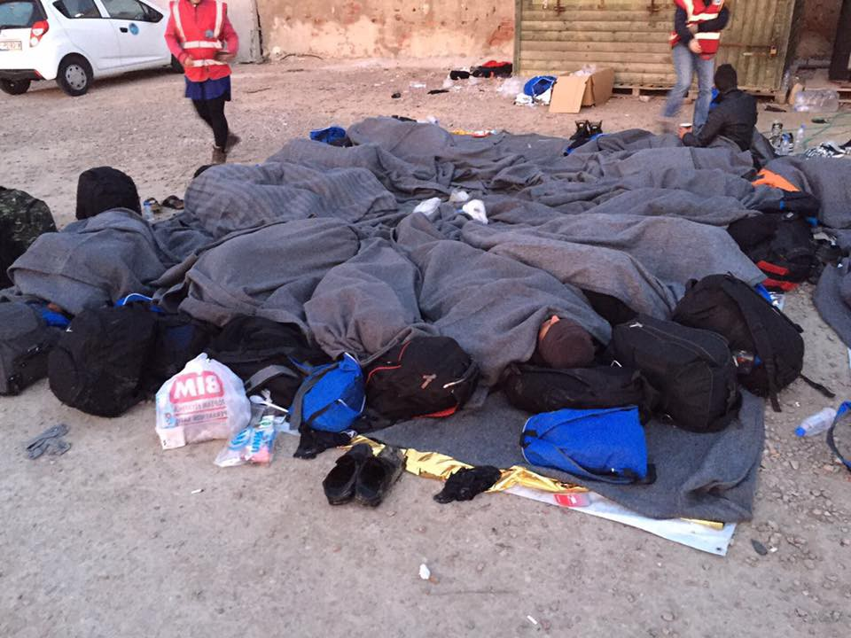

](assets/b7991c2ac69d/1*JBVdqjwqyyWBHSzcV0cVQg.jpeg)

Photos by NGO [Salvamento Marítimo Humanitario](https://www.facebook.com/smhumanitario/)

**News That Moves** published another issue of Rumors, concentrating on complaints against NGOs, which you can find [here](https://newsthatmoves.org/en/rumour-complaints-against-ngos/) \.

#### SERBIA

The spokesperson of the Serbian Defence Ministry said that in the last few days, there has been an increase in the migrant pressure from Bulgaria and Macedonia towards Serbia, [reports](http://www.novinite.com/articles/179367/Increased+Migrant+Pressure+from+Bulgaria,+Macedonia+on+Serbia) Novinite\. Bordermonitoring Bulgaria also [reports](http://bulgaria.bordermonitoring.eu/2017/03/23/a-huge-number-of-migrants-leave-bulgaria/) on “a huge number of migrants leaving Bulgaria”\. In January 2017, more than 2210 migrants had already left the country and in February 903 people were reported to be ‚disappeared‘\. In March more than 400 people left Bulgaria, they said the State Agency for Refugee \(SAR\) and the Bulgarian Ministry of Interior \(MoI\) stated\. Bordermonitoring predicts that this will continue in the near future\.

No Name Kitchen invites people to an event against borders in the “Chai Park”
this Saturday, 25th of March\.
#### **Situation at Belgrade barracks**

A local volunteer reported on the situation at the Belgrade barracks where refugees are still sleeping in inhumane conditions\.

> Around 150 people in these two small rooms\. \. mostly minors\. It’s only two of the many rooms in this place\. By the government decision we can’t help these people but the police sees us but doesn’t do anything\. I think they prefer to ignore it rather than showing up on the news around the world because of the deaths of some of these people\. We are useful in a non\-official way\. \. , _he writes_ 

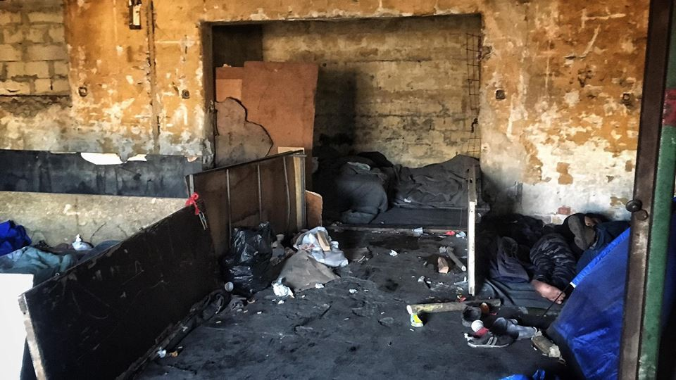

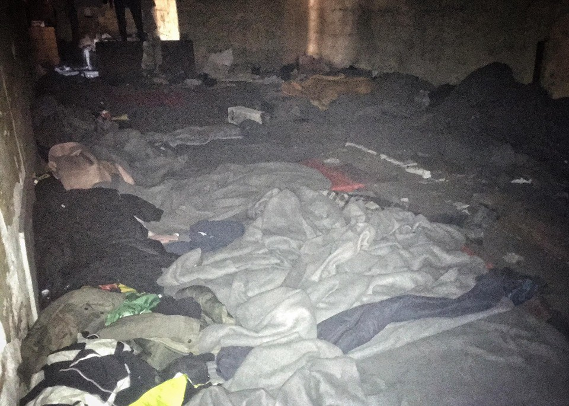

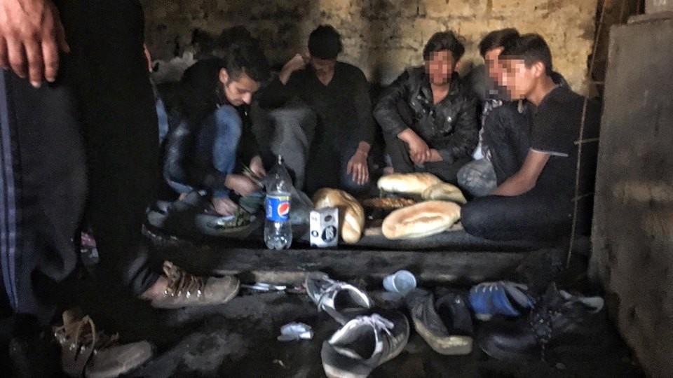

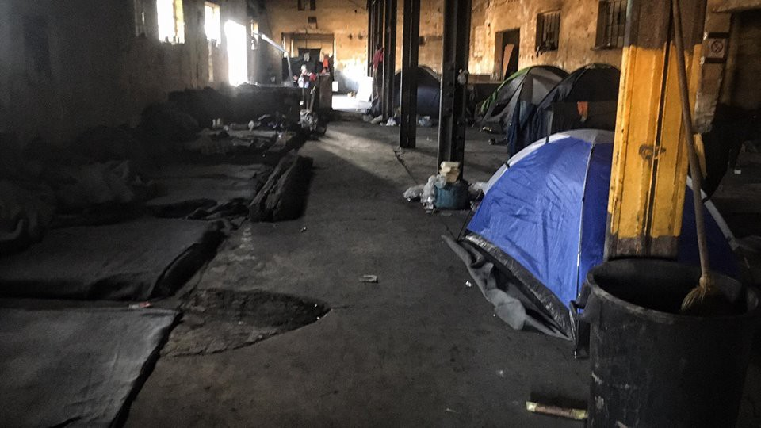

Photos by NuuNoo Miguel

In the meantime, volunteers are still working hard on making the living conditions a bit more bearable for people stranded in Serbia\.

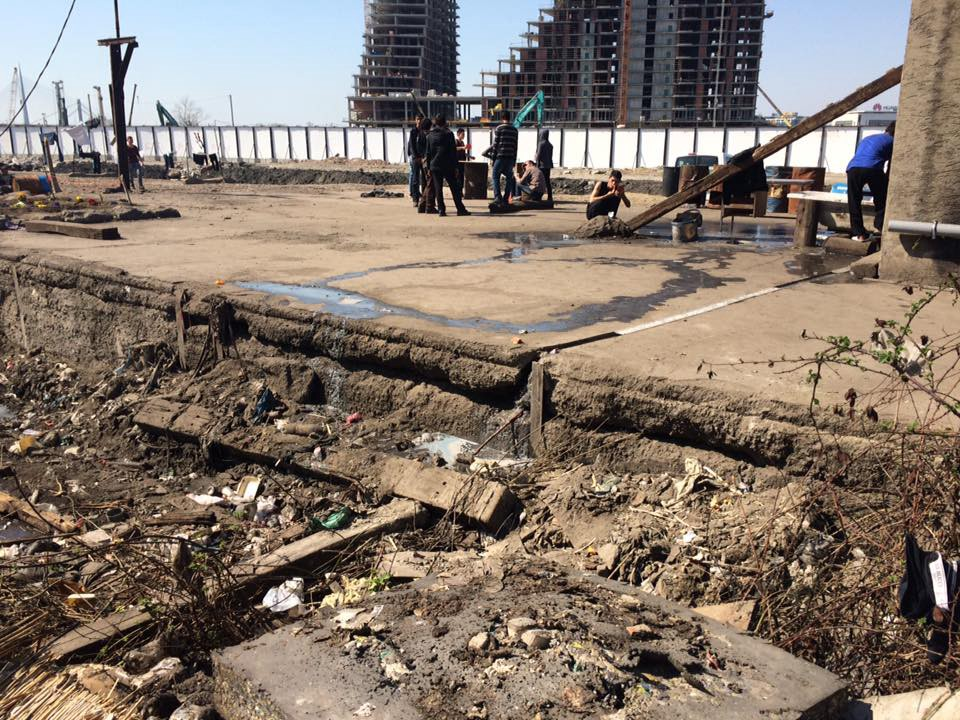

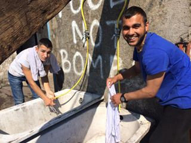

“New showers, some kind of washing area and frames for rubbish bags\. Not exactly three star hotel but better than before\. Still cooking with No Name kitchen for dinner and setting up the big kitchen and distribution center\. Today we building mobile showers in a truck so we can provide to people at the borders where there is no water supply” by Cris Herrera
#### Update on BelgrAid centre — volunteers needed

Belgrade\-based SoulWelders reported on their recent work

> The BELGRAID distribution warehouse build is on\! We ordered nearly all the timber needed today to complete the warehouse build for all the shelves hoppers and tables… its a race against time,as already aid is coming in,and on Monday a 40 ft container arrives filled with aid… so VOLUNTEERS NEEDED\! Anyone in the Belgrade area handy at woodwork or just enthusiastic please get in touch as all hands on deck needed\! Just send us a message on this page and come on down\.
 

> Also any DONATIONS would be gratefully received on our CROWDFUNDER a few posts below\.this is going to be the largest distribution centre in Serbia serving the 8000 refugees living here, so your support,that created this is further needed to realise its potential to deliver effective aid here where it is needed…\. also our kitchen given to us from the Khios refugee kitchen is on its first leg up to here stopping at Thessaloniki warehouse whilst paperwork is sorted to get it across the border… 

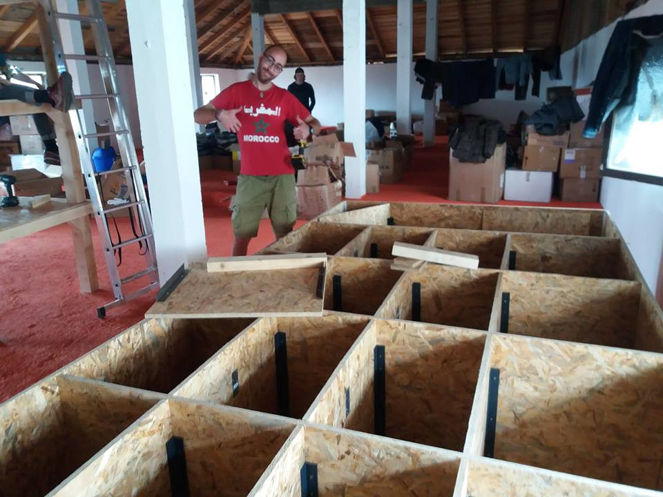

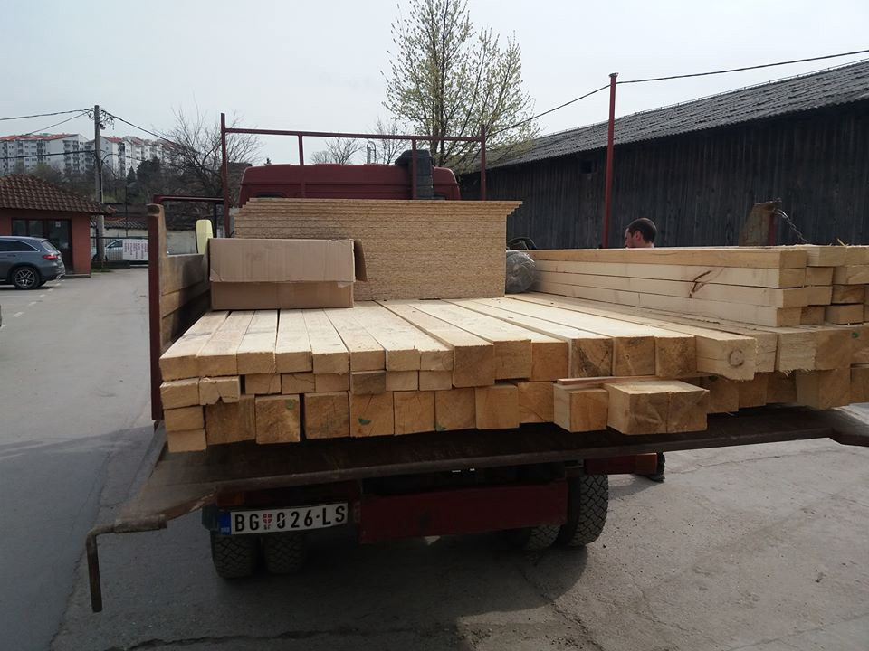

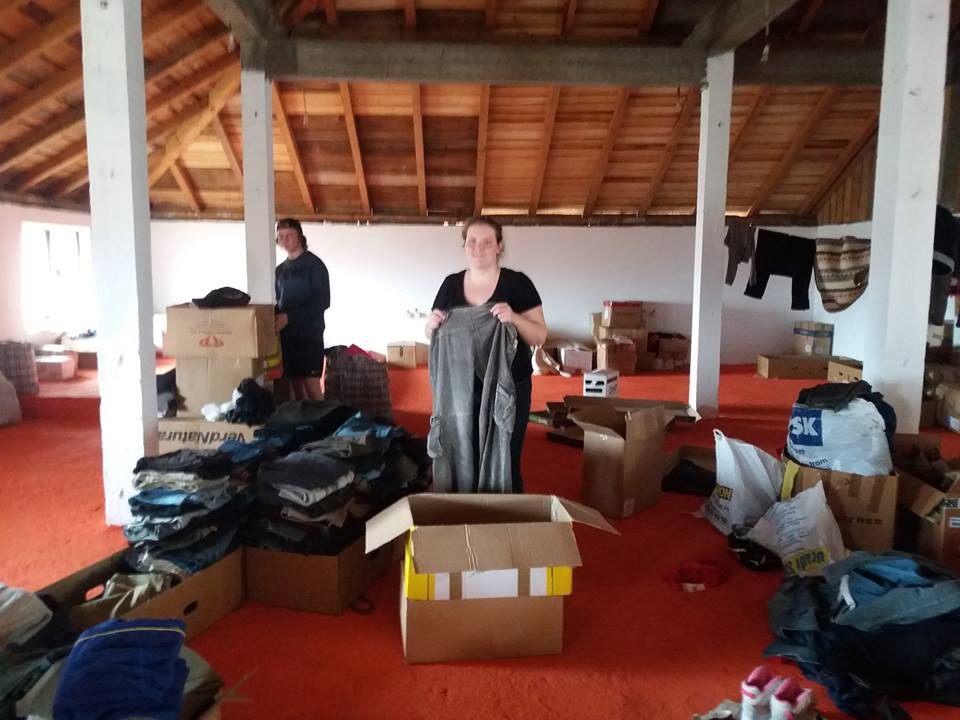

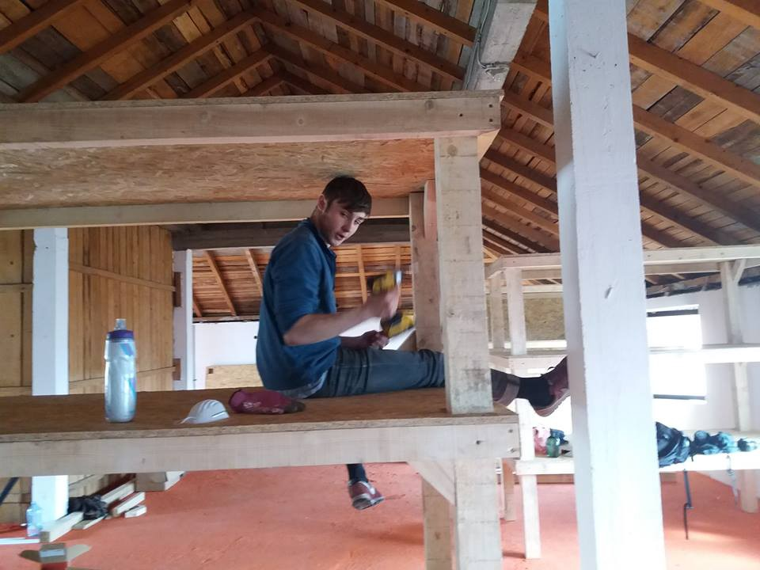

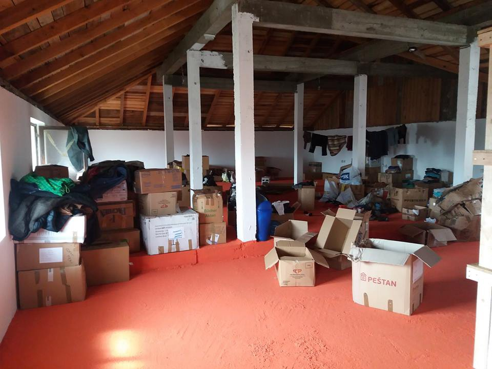

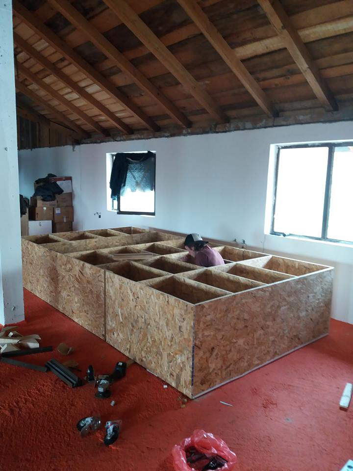

Photos by SoulWelders
#### CROATIA

The Syrian family that was returned from Slovenia, which we [reported](https://medium.com/@AreYouSyrious/a-new-report-by-the-council-of-europe-says-unaccompanied-children-in-europe-are-living-in-abysmal-86bfe06eefbd#.b1urv17dp) on yesterday, has been transferred today from Kutina to Porin centre in Zagreb\. Our translators already visited them and they seem to be doing fine for now\. AYS volunteers will make sure their transition goes as best as possible\.
#### BULGARIA

28 refugees were found in a burning truck near the village of Rezovo close to the Bulgarian — Turkish border, according to BNR\. After the fire was put out firefighters discovered a secret compartment, where 28 people were found\. They were not hurt by the fire\. The driver fled the accident and has not been found yet, [reports](http://www.novinite.com/articles/179396/28+Migrants+Found+in+Burning+Truck+in+Bulgaria) Novinite\.
#### AUSTRIA

**Encouraging “less traumatic” voluntary returns**

The amount of money paid to people who voluntarily return home could double as part of a campaign to speed up the repatriation of around 50,000 asylum seekers, [reports](https://www.thelocal.at/20170323/austria-will-double-the-amount-it-pays-refugees-who-volunteer-to-leave) Austrian The Local\. The scheme is run in collaboration with pro\-refugee groups, primarily aiming refugees not likely to be granted the right to long\-term residence, mostly those from Iraq, Iran, Afghanistan and sub\-Saharan countries\. However, the doubled payment offer is currently only available to the first 1000 people to register and who have already filed an asylum application\.
#### ITALY
#### **In late March the Emergency Center in Bolzano will close**

The Centri per l’Emergenza Freddo providing shelters for people sleeping rough in Bolzano will close by the end of the month, reports [Bozen Accoglie](https://www.facebook.com/Bozen-Accoglie-909095505875385/?fref=nf) , leaving more than 180 refugees currently using the space without a roof\. Only in the first 15 days of March it is estimated that around 50 new people arrived in Bolzano, some of which applied for asylum in the city, others still in transit to northern Europe\. The required solution is the immediate opening of a transit center, a place where people can find temporary shelter, medical care and legal information\. The opening of the center must be established with the involvement in the methods of management of associations and civil society which in recent months have dedicated themselves to support and help people left out of the reception system, write [Bozen Accoglie](https://www.facebook.com/Bozen-Accoglie-909095505875385/?fref=nf) \.
#### DENMARK

**Government proposes law change in case of “emergency situation”**

Denmark’s government came out with a new law change proposal which would allow the country to close the borders for refugees, including unaccompanied children, due to exceptional circumstances, [reports](https://www.thelocal.dk/20170323/danish-government-wants-to-turn-away-child-refugees-at-the-border) The Local\. This would apply in case of a “crisis situation”, a phrase often used without further clarification, in which case the Dublin Regulation would not apply\. Children could then be turned away without any assessment of their asylum claims\. The Danish government’s proposal for the so\-called ‘emergency brake’ \(nødbremse\) law, [originally proposed](https://www.thelocal.dk/20161121/heres-what-denmarks-new-budget-means-for-foreigners) in September last year, would allow complete border closure\. The proposal will be discussed in parliament on Thursday\. While humanitarian organisations and opposition political groups oppose the proposal, the Social Democrats said they would support it\.

> While no statement on minors is included in the proposal itself, Politiken reports that the Ministry for Integration informed it in an email that “in principal, everyone will be turned away — including unaccompanied minors\. There may be exceptions, however, for example if the parents are already in Denmark\.” , [_writes_](https://www.thelocal.dk/20170323/danish-government-wants-to-turn-away-child-refugees-at-the-border) _The Local\._ 

#### AUSTRALIA

The Federal Government has refused entry to more than 500 Syrian and Iraqi refugees over the last year, some of them being part of 12000 Syrian refugees being resettled in Australia, for failing security checks, ABC [reports](http://mobile.abc.net.au/news/2017-03-23/government-blocks-entry-to-500-syrian-and-iraqi-refugees/8380762?pfmredir=sm) \. Immigration Minister Peter Dutton called the number of refusals “startling” and said it justified the Coalition’s decision to put Syrian refugees through stringent security checks\.

![HOW LONG CAN ASYLUM SEEKERS STAY IN A RECEPTION CENTER? This chart shows the different maximum accommodation time in several European countries, as contained in their national legal framework as application of the EU directive laying down minimum standards for the reception of asylum seekers\. It refers to the regular procedure only and are not taken into account here other procedures such as the ones included in the Dublin regulation or family reunification\. Of course, law provisions can vary a lot compared to what asylum seekers and refugees are experiencing, whether they face a shortage of places available or are confronted to other obstacles preventing them to be effectively hosted\.; by [Greek Forum of Refugees](https://www.facebook.com/Greekforumofrefugees/)](assets/b7991c2ac69d/1*sQty8qPacaM4pVShHKWckA.png)

HOW LONG CAN ASYLUM SEEKERS STAY IN A RECEPTION CENTER? This chart shows the different maximum accommodation time in several European countries, as contained in their national legal framework as application of the EU directive laying down minimum standards for the reception of asylum seekers\. It refers to the regular procedure only and are not taken into account here other procedures such as the ones included in the Dublin regulation or family reunification\. Of course, law provisions can vary a lot compared to what asylum seekers and refugees are experiencing, whether they face a shortage of places available or are confronted to other obstacles preventing them to be effectively hosted\.; by [Greek Forum of Refugees](https://www.facebook.com/Greekforumofrefugees/)

_Converted [Medium Post](https://areyousyrious.medium.com/ays-daily-digest-23-3-2017-more-lives-lost-at-sea-b7991c2ac69d) by [ZMediumToMarkdown](https://github.com/ZhgChgLi/ZMediumToMarkdown)._
